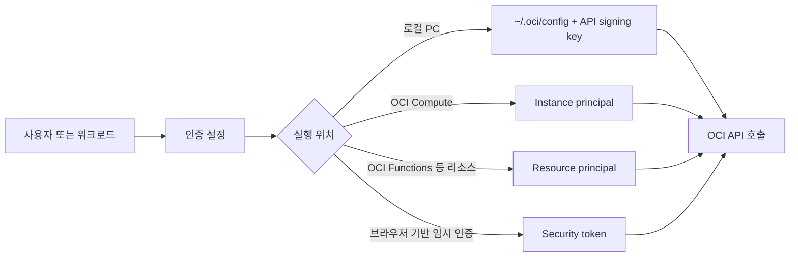
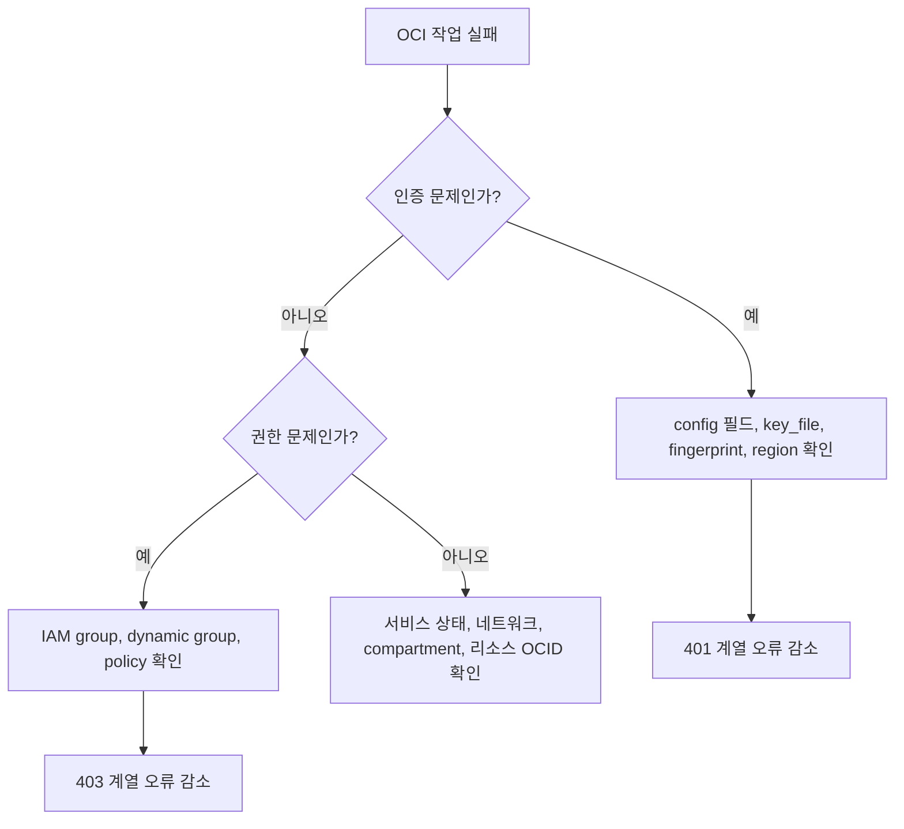
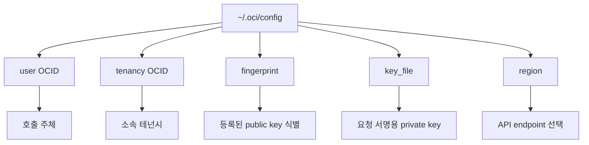
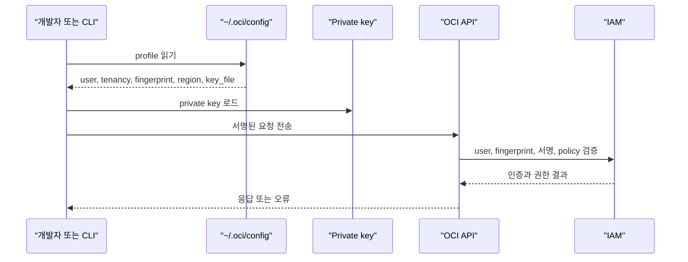
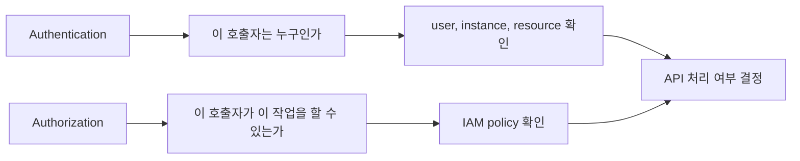
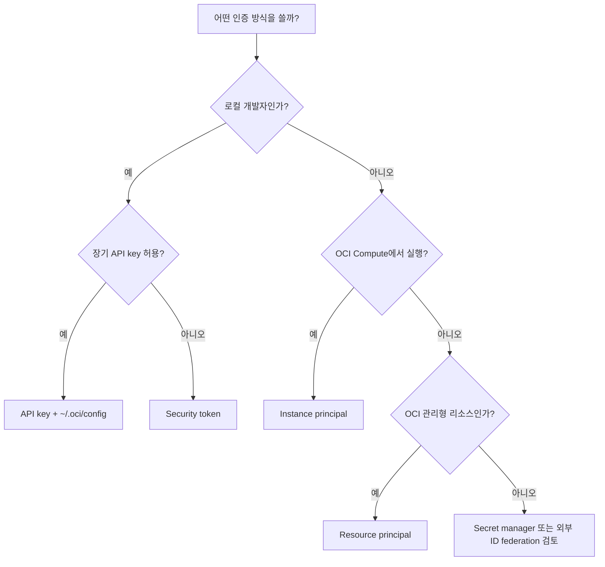
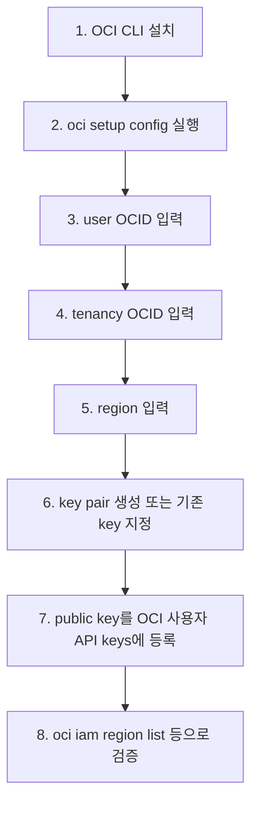
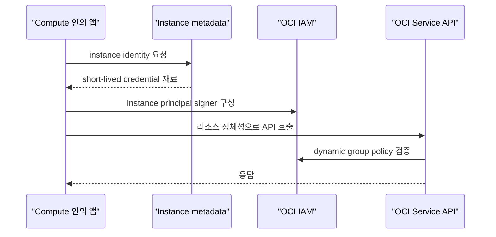
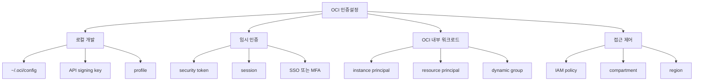

# OCI 인증설정

- 작성일: 2026-06-29
- 범위: Oracle Cloud Infrastructure, OCI CLI, OCI SDK, API signing key, security token, instance principal, resource principal

## 1. 한 줄 요약

- OCI 인증설정은 사용자가 OCI API를 호출할 때 "누가 호출하는지"를 증명하기 위해 `~/.oci/config`, API signing key, OCID, region, 또는 principal 기반 인증 방식을 준비하는 설정이다.
- 로컬 개발자 PC에서는 보통 `~/.oci/config`와 개인 API signing key를 쓰고, OCI 안에서 실행되는 워크로드는 instance principal 또는 resource principal을 쓰는 편이 운영상 더 안전하다.



## 2. 왜 중요한가

- OCI CLI, SDK, Terraform provider, 직접 REST API 호출은 모두 OCI API에 접근한다.
- 인증설정이 틀리면 `401 NotAuthenticated`, `403 NotAuthorizedOrNotFound`, region 오류, key fingerprint 불일치 같은 문제가 발생한다.
- 인증은 "신원 확인"이고, IAM policy는 "무엇을 할 수 있는지"를 결정한다. 인증이 성공해도 권한 policy가 없으면 작업은 실패한다.
- 장기 개인 키를 서버에 배포하면 키 유출 위험이 커진다. 그래서 운영 환경에서는 가능하면 principal 기반 인증을 선택한다.



## 3. 핵심 개념

- `~/.oci/config`: OCI CLI와 여러 SDK가 기본으로 읽는 설정 파일이다. 기본 위치는 사용자 홈 아래 `.oci/config`다.
- profile: 하나의 config 파일에 `[DEFAULT]`, `[dev]`, `[prod]`처럼 여러 계정, tenancy, region 조합을 담을 수 있다.
- API signing key: OCI API 요청에 서명하는 RSA private key다. public key는 OCI 사용자 프로필에 등록하고, private key는 로컬에 보관한다.
- fingerprint: OCI에 등록한 public key를 식별하는 지문이다. config의 `fingerprint` 값과 OCI Console의 API key fingerprint가 맞아야 한다.
- OCID: tenancy, user, compartment, resource를 전역적으로 식별하는 Oracle Cloud Identifier다.
- region: API 호출 대상 리전을 결정한다. 예: `us-ashburn-1`, `ap-seoul-1`, `ap-chuncheon-1`.



### 기본 config 예시

```ini
[DEFAULT]
user=ocid1.user.oc1..example
fingerprint=20:3b:97:13:55:1c:example
key_file=/Users/me/.oci/oci_api_key.pem
tenancy=ocid1.tenancy.oc1..example
region=ap-seoul-1

[prod]
user=ocid1.user.oc1..example
fingerprint=7c:8d:example
key_file=/Users/me/.oci/prod_api_key.pem
tenancy=ocid1.tenancy.oc1..example
region=ap-chuncheon-1
```

### 인증 방식 비교

| 방식 | 주 사용처 | 장점 | 주의점 |
| --- | --- | --- | --- |
| API key 기반 사용자 principal | 로컬 CLI, SDK, CI 일부 | 설정이 단순하고 대부분 도구가 지원 | private key 보호와 rotation 필요 |
| Security token | SSO, MFA, 짧은 세션 | 장기 API key 없이 임시 인증 가능 | 토큰 만료 후 재인증 필요 |
| Instance principal | OCI Compute에서 실행되는 앱 | 서버에 개인 API key를 둘 필요 없음 | dynamic group과 policy 설정 필요 |
| Resource principal | Functions, Data Flow 등 OCI 리소스 | 관리형 리소스 정체성으로 호출 가능 | 서비스별 지원 여부와 policy 필요 |

## 4. 아키텍처와 인증 흐름

- API key 방식은 private key로 요청을 서명하고, OCI는 등록된 public key와 fingerprint를 기준으로 서명을 검증한다.
- SDK와 CLI는 config를 읽어 signer를 만들고, signer가 HTTP 요청에 필요한 인증 헤더를 붙인다.
- instance principal과 resource principal은 사용자 private key 대신 OCI가 발급하고 검증하는 리소스 정체성을 사용한다.



### 인증과 권한의 분리



## 5. 중요 세부사항, 엣지 케이스, 트레이드오프

- API signing key는 RSA key pair이며 PEM 형식이어야 한다. 공식 문서는 최소 2048 bits를 요구한다.
- 등록된 key가 많아질수록 추적이 어려우므로 운영에서는 rotation 절차를 정해 오래된 key를 제거해야 한다.
- private key는 Git, 이미지, 로그, CI artifact에 들어가면 안 된다.
- private key 끝에 `OCI_API_KEY` 태그를 붙이면 실수로 public GitHub repository에 노출됐을 때 OCI의 탐지와 알림에 도움이 된다.
- `pass_phrase`를 config에 평문으로 넣는 방식은 피하고, 가능하면 실행 시 입력하거나 안전한 secret store를 사용한다.
- `~/.oci/config` 권한은 너무 열려 있으면 경고나 실패 원인이 될 수 있다. private key 파일은 특히 소유자만 읽을 수 있게 둔다.
- SSO 또는 MFA가 강제되는 조직에서는 security token 기반 CLI 세션이 더 맞을 수 있다.
- Compute, Functions, Data Flow처럼 OCI 안에서 실행되는 워크로드는 사용자 API key보다 principal 기반 인증이 권장된다.
- `403 NotAuthorizedOrNotFound`는 인증 실패가 아니라 권한 policy, compartment, 리소스 위치 문제일 수 있다.



### 자주 헷갈리는 지점

| 증상 | 흔한 원인 | 확인할 것 |
| --- | --- | --- |
| `401 NotAuthenticated` | key, fingerprint, config 필드 불일치 | `user`, `tenancy`, `fingerprint`, `key_file`, 파일 권한 |
| `403 NotAuthorizedOrNotFound` | IAM policy 부족 또는 compartment 오류 | group, dynamic group, policy, compartment OCID |
| 다른 리소스가 보이지 않음 | region 또는 compartment가 다름 | `region`, CLI `--compartment-id` |
| profile을 못 찾음 | profile 이름 불일치 | `--profile`, `OCI_CLI_PROFILE`, config 섹션명 |
| CI에서만 실패 | key 파일 경로 또는 secret 주입 실패 | absolute path, secret mount, environment variable |

## 6. 실무 예시

- 가장 일반적인 로컬 설정 절차는 `oci setup config`를 실행해 user OCID, tenancy OCID, region, key 경로를 입력하고, 생성된 public key를 OCI Console의 사용자 API keys에 등록하는 흐름이다.
- 여러 환경을 다룰 때는 profile을 나누고 CLI에서 `--profile`을 명시한다.
- 앱 코드에서는 SDK가 config를 자동으로 읽게 하거나, 실행 환경에 맞는 signer를 명시한다.



### CLI 명령 예시

```bash
# 기본 프로필로 설정 생성
oci setup config

# 특정 프로필 사용
oci iam region list --profile prod

# 환경 변수로 프로필 지정
export OCI_CLI_PROFILE=prod
oci os ns get
```

### Python SDK 예시

```python
import oci

config = oci.config.from_file("~/.oci/config", "DEFAULT")
identity = oci.identity.IdentityClient(config)

print(identity.list_regions().data)
```

### Instance principal 개념 예시



## 7. 용어 정리와 빠른 복습

- OCI 인증설정: OCI API 호출자가 누구인지 증명하기 위한 구성 전체를 말한다.
- `config`: profile, OCID, fingerprint, key path, region을 담는 파일이다.
- API signing key: OCI 요청 서명에 쓰는 RSA key pair다.
- fingerprint: OCI에 등록된 public key를 식별하는 값이다.
- principal: API를 호출하는 정체성이다. user, instance, resource가 될 수 있다.
- policy: 인증된 principal이 어떤 리소스에 어떤 동작을 할 수 있는지 정한다.



### 빠른 점검표


- 로컬에서 시작한다면 `oci setup config`로 기본 설정을 만든다.
- 운영 서버에 개인 API key를 넣어야 한다면 먼저 instance principal 또는 resource principal로 대체 가능한지 검토한다.
- 오류를 볼 때는 `401`은 인증 정보, `403`은 권한 policy와 compartment를 먼저 의심한다.
- profile을 여러 개 쓴다면 명령마다 `--profile` 또는 `OCI_CLI_PROFILE`을 명확히 지정한다.

## 8. 참고 링크

- [Oracle Cloud Infrastructure Documentation - SDK and CLI Configuration File](https://docs.oracle.com/iaas/Content/API/Concepts/sdkconfig.htm)
- [Oracle Cloud Infrastructure Documentation - SDK Authentication Methods](https://docs.oracle.com/iaas/Content/API/Concepts/sdk_authentication_methods.htm)
- [Oracle Cloud Infrastructure CLI Command Reference - oci setup config](https://docs.oracle.com/en-us/iaas/tools/oci-cli/latest/oci_cli_docs/cmdref/setup/config.html)
- [Oracle Cloud Infrastructure Documentation - CLI Environment Variables](https://docs.oracle.com/en-us/iaas/Content/API/SDKDocs/clienvironmentvariables.htm)
- [Oracle Cloud Infrastructure Documentation - Token-based CLI Session](https://docs.oracle.com/en-us/iaas/Content/API/SDKDocs/clitoken.htm)
- [Oracle Cloud Infrastructure Documentation - Required Keys and OCIDs](https://docs.oracle.com/iaas/Content/API/Concepts/apisigningkey.htm)

<!-- study-links:start -->
## 관련 문서

- `sso`: [[정보처리기사/5과목 정보시스템 구축 관리/257 SSO(Single Sign On)/257 SSO(Single Sign On)|257 SSO(Single Sign On)]]
<!-- study-links:end -->
