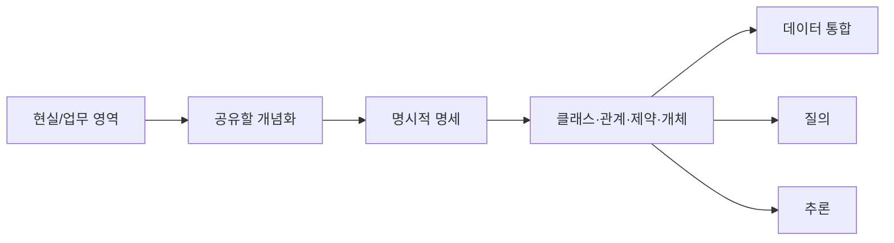
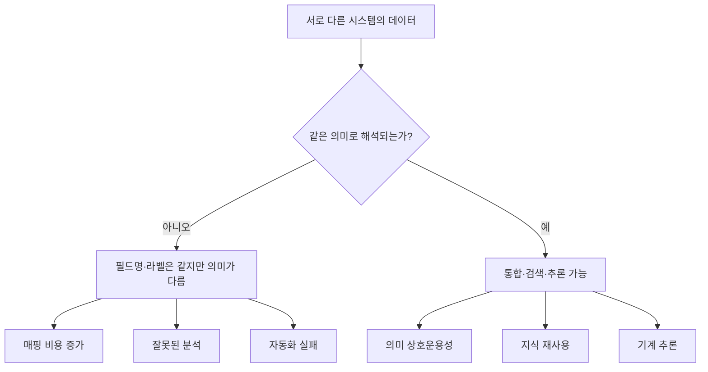
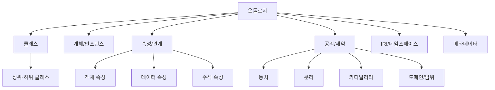
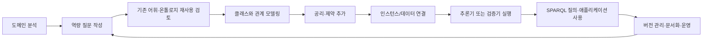
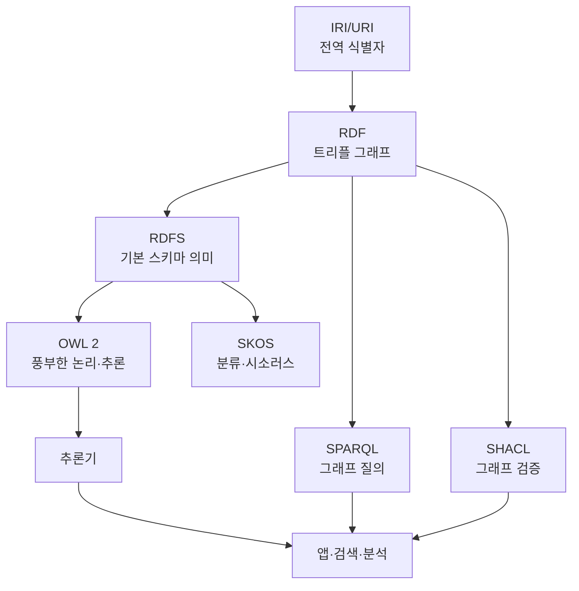
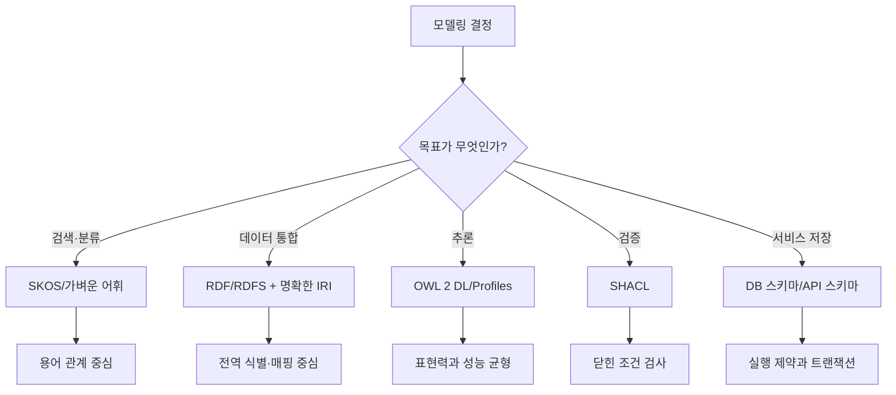
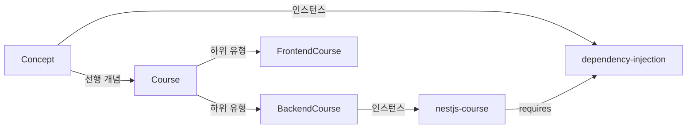
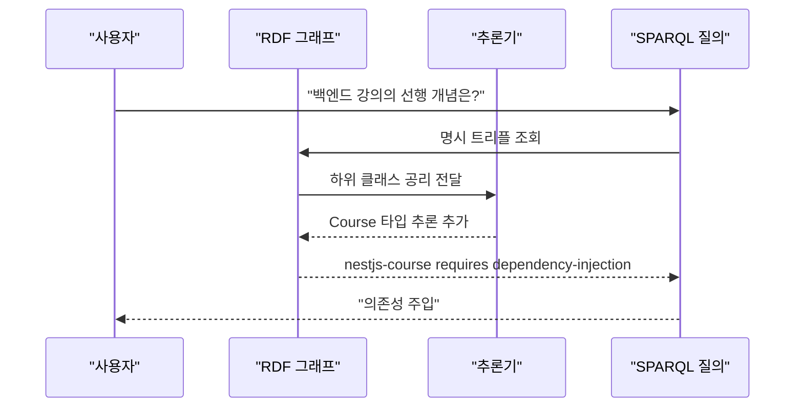
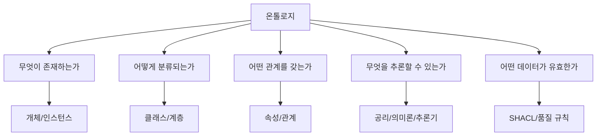

# 온톨로지(Ontology)

- 검색일: 2026-07-01
- 요약: 온톨로지는 특정 세계나 업무 영역에서 "무엇이 존재한다고 볼 것인가", "그것들이 어떤 종류에 속하는가", "서로 어떤 관계와 제약을 갖는가"를 사람과 기계가 함께 해석할 수 있게 명시한 의미 모델이다.

## 1. 한 줄 요약



- 온톨로지는 단순한 용어 목록이 아니라, 한 도메인을 이해하는 데 필요한 개념, 관계, 규칙, 식별자를 체계적으로 묶은 의미 기반 설계도다.
- 철학에서는 온톨로지가 "무엇이 존재하는가"를 묻는 존재론의 문제에 가깝다.
- 컴퓨터 과학과 지식공학에서는 온톨로지가 특정 도메인에 대한 공유 가능한 개념 모델을 기계가 처리할 수 있는 형식으로 표현한 산출물에 가깝다.
- 실무에서는 온톨로지를 데이터베이스 스키마, 분류체계, 지식 그래프, 검색 시스템, 추천 시스템, RAG/AI 시스템의 의미 계층으로 사용한다.
- 좋은 온톨로지는 "단어를 모아둔 문서"가 아니라 "이 데이터가 무엇을 뜻하는지, 어떤 추론이 가능한지, 어떤 해석은 잘못인지"를 밝히는 계약이다.

## 2. 왜 중요한가



- 온톨로지가 중요한 첫 번째 이유는 의미 상호운용성이다.
- 같은 `user`, `account`, `customer`, `member`라는 단어가 시스템마다 다르게 쓰이면, 단순한 컬럼 매핑만으로는 데이터 통합이 안전하지 않다.
- 온톨로지는 "이 시스템의 고객은 계약 주체인가, 로그인 주체인가, 결제 주체인가"처럼 개념의 의미를 드러낸다.
- 두 번째 이유는 지식 재사용이다.
- 잘 만든 온톨로지는 특정 애플리케이션 내부에 묻힌 도메인 지식을 외부 시스템, 분석 파이프라인, 검색 엔진, 에이전트가 다시 쓸 수 있게 만든다.
- 세 번째 이유는 추론이다.
- 예를 들어 `BackendCourse`가 `Course`의 하위 클래스이고 `nestjs-course`가 `BackendCourse`의 인스턴스라면, 시스템은 명시적으로 쓰지 않아도 `nestjs-course`가 `Course`임을 추론할 수 있다.
- 네 번째 이유는 데이터 품질 관리다.
- OWL/RDFS는 주로 의미와 추론을 담당하고, SHACL 같은 제약 언어는 RDF 그래프가 특정 조건을 만족하는지 검증하는 데 쓰인다.
- 다섯 번째 이유는 AI 시스템의 맥락 고정이다.
- LLM 기반 검색이나 에이전트가 "같은 말", "상위/하위 개념", "허용되는 관계", "금지된 관계"를 일관되게 다루려면 도메인 의미 모델이 필요하다.
- 단, 온톨로지가 있다고 해서 AI가 자동으로 정확해지는 것은 아니다. 온톨로지는 모델의 답을 보증하는 장치가 아니라, 검색·검증·정규화·추론에 사용할 수 있는 명시적 의미 기반이다.

## 3. 핵심 개념



- 온톨로지를 이해할 때 가장 먼저 구분할 것은 철학적 의미와 정보시스템 의미다.
- 철학적 온톨로지는 존재자의 종류와 존재 조건을 묻는다.
- 정보시스템의 온톨로지는 철학의 문제의식을 빌리지만, 목적은 더 실용적이다. 특정 업무 영역에서 필요한 범주와 관계를 형식 언어로 기록해 시스템 간 공유와 자동 처리를 가능하게 한다.
- Tom Gruber의 고전적 정의는 온톨로지를 "conceptualization의 explicit specification"으로 본다.
- 이 말은 어떤 도메인을 바라보는 추상화가 있고, 그 추상화를 클래스, 관계, 함수, 제약, 인스턴스 같은 표현 요소로 명시한다는 뜻이다.
- 온톨로지의 핵심 단위는 다음과 같다.

| 개념 | 의미 | 예시 |
| --- | --- | --- |
| 도메인 | 모델링 대상 영역 | 학습 노트, 의료, 제품 카탈로그, 금융 계약 |
| 클래스 | 같은 종류로 묶는 범주 | `Course`, `Concept`, `Person` |
| 인스턴스 | 클래스에 속하는 구체적 대상 | `nestjs-course`, `dependency-injection` |
| 속성/관계 | 대상 사이의 연결이나 값 | `requires`, `hasAuthor`, `difficulty` |
| 공리 | 항상 참이라고 선언하는 의미 규칙 | `BackendCourse`는 `Course`의 하위 클래스 |
| 제약 | 데이터가 만족해야 하는 조건 | 강의는 최소 1개 이상의 선행 개념을 가져야 함 |
| IRI | 웹 전체에서 식별 가능한 이름 | `https://example.org/study#Course` |
| 주석 | 사람이 이해할 수 있는 설명 | `rdfs:label`, `rdfs:comment` |

- 클래스는 프로그래밍 언어의 클래스와 비슷해 보이지만 목적이 다르다.
- 프로그래밍 클래스는 객체 생성과 동작 구현에 초점이 있고, 온톨로지 클래스는 의미 분류와 추론에 초점이 있다.
- 관계는 온톨로지의 힘이 가장 잘 드러나는 부분이다.
- 단순한 태그 시스템은 "A가 B와 관련 있다" 정도만 말하지만, 온톨로지는 "A는 B의 하위 유형이다", "A는 B를 선행 조건으로 요구한다", "A와 B는 동시에 성립할 수 없다", "A는 정확히 하나의 B를 가져야 한다" 같은 구조화된 의미를 말할 수 있다.
- 공리는 온톨로지에서 매우 중요하다.
- 공리는 데이터에 숨어 있는 결론을 끌어내는 근거다.
- 예를 들어 `모든 유료 강의는 강의다`, `무료 강의와 유료 강의는 서로 겹치지 않는다`, `강의의 저자는 사람 또는 조직이어야 한다` 같은 선언이 공리다.
- 온톨로지의 엄밀함은 표현 언어에 따라 달라진다.
- RDF는 주어-술어-목적어 트리플로 그래프를 표현하는 기본 데이터 모델이다.
- RDFS는 클래스, 하위 클래스, 하위 속성, 도메인, 범위 같은 기본 의미 어휘를 제공한다.
- OWL은 더 풍부한 논리 표현과 추론을 제공하는 웹 온톨로지 언어다.
- SKOS는 시소러스, 분류표, 주제명표 같은 지식 조직 체계를 표현하기 위한 모델로, 엄밀한 OWL 온톨로지보다 가벼운 용어 체계에 적합하다.

## 4. 구조와 흐름



- 온톨로지를 만드는 흐름은 일반적으로 "도메인을 파악한다 -> 무엇을 답할지 정한다 -> 개념과 관계를 만든다 -> 데이터와 연결한다 -> 추론·검증한다 -> 운영한다"의 반복이다.
- 처음부터 모든 개념을 다 모델링하려고 하면 실패하기 쉽다.
- 먼저 역량 질문을 잡는 것이 좋다.
- 역량 질문은 온톨로지가 답할 수 있어야 하는 질문이다.
- 예를 들어 학습 노트 도메인이라면 다음과 같은 질문이 역량 질문이 될 수 있다.
- "특정 개념을 이해하기 전에 알아야 할 선행 개념은 무엇인가?"
- "NestJS 관련 노트 중 인증과 관련된 것은 무엇인가?"
- "어떤 주제가 여러 문서에서 중복 설명되고 있는가?"
- "특정 프로젝트 문서가 참조하는 표준이나 프로토콜은 무엇인가?"
- W3C 기반 Semantic Web 스택에서 온톨로지는 대략 다음처럼 놓인다.



- RDF는 데이터를 그래프로 표현한다.
- RDF 그래프는 주어, 술어, 목적어로 이루어진 트리플의 집합이다.
- 예를 들어 `nestjs-course requires dependency-injection`은 `nestjs-course`라는 주어, `requires`라는 술어, `dependency-injection`이라는 목적어로 표현할 수 있다.
- RDFS는 RDF 위에 클래스와 속성의 기본 의미를 얹는다.
- `rdfs:subClassOf`를 사용하면 한 클래스가 다른 클래스의 하위 클래스임을 표현할 수 있다.
- `rdfs:domain`과 `rdfs:range`는 속성의 주어와 목적어가 어떤 클래스에 속한다고 추론할지 말한다.
- 중요한 점은 RDFS의 `domain`과 `range`가 데이터베이스의 타입 검사처럼 "틀리면 거부"하는 장치가 아니라는 것이다.
- 예를 들어 `teaches rdfs:domain Teacher`라고 선언한 뒤 `alice teaches math`라는 트리플이 있으면, RDFS 추론은 `alice`가 `Teacher`라고 추론한다.
- 데이터를 거부하거나 오류로 보고 싶다면 SHACL 같은 검증 언어가 더 직접적이다.
- OWL 2는 RDF/RDFS보다 표현력이 큰 온톨로지 언어다.
- OWL 2는 클래스, 속성, 인스턴스, 데이터 값을 제공하고, 형식적 의미론을 통해 기계 추론을 가능하게 한다.
- OWL 2에는 Direct Semantics와 RDF-Based Semantics라는 두 의미론 경로가 있고, OWL 2 DL처럼 제한된 형태를 지키면 더 예측 가능한 추론을 얻을 수 있다.
- SPARQL은 RDF 그래프를 질의하는 언어다.
- SQL이 테이블을 질의한다면, SPARQL은 그래프 패턴을 질의한다.
- SHACL은 RDF 그래프가 특정 모양과 조건을 만족하는지 확인하는 검증 언어다.
- SKOS는 엄격한 논리 온톨로지보다는 분류표, 주제어 목록, 시소러스에 적합하다.
- 2026-07-01 기준으로 RDF 1.1은 W3C Recommendation이고, RDF 1.2 Concepts는 2026-04-07 Candidate Recommendation Snapshot 상태다.
- 따라서 안정성이 중요한 문서에서는 RDF 1.1을 기준으로 설명하고, RDF 1.2의 triple term 같은 새 기능은 도입 가능성이 있는 최신 변화로 분리해 보는 것이 안전하다.

## 5. 중요한 디테일, 엣지 케이스, 트레이드오프



- 온톨로지를 다룰 때 가장 흔한 오해는 "온톨로지 = 분류체계"라고 보는 것이다.
- 분류체계는 보통 상하위 구조에 집중한다.
- 온톨로지는 상하위 구조뿐 아니라 관계, 속성, 공리, 제약, 인스턴스, 의미론, 추론을 포함할 수 있다.
- 또 다른 오해는 "온톨로지 = 데이터베이스 스키마"라고 보는 것이다.
- 데이터베이스 스키마는 저장 구조, 타입, 무결성, 인덱스, 트랜잭션에 초점이 있다.
- 온톨로지는 저장 방식보다 의미, 공유, 추론, 개념 정합성에 초점이 있다.
- 물론 둘은 함께 쓰일 수 있다.
- 실무에서는 데이터베이스가 운영 데이터를 저장하고, 온톨로지가 그 데이터의 의미 계층과 시스템 간 매핑을 제공하는 구조가 흔하다.
- Open World Assumption을 반드시 이해해야 한다.
- OWL/RDF 세계에서는 어떤 사실이 명시되어 있지 않다고 해서 거짓이라고 보지 않는다.
- "앨리스의 이메일이 없다"는 사실은 "앨리스에게 이메일이 없다"가 아니라 "아직 모른다"에 가깝다.
- 반대로 일반적인 데이터베이스나 폼 검증은 Closed World Assumption에 가깝다.
- 필수 필드가 없으면 오류로 본다.
- 이 차이를 모르면 OWL로 데이터 검증을 하려다가 기대와 다른 결과를 얻기 쉽다.
- RDFS의 `domain`과 `range`도 검증이 아니라 추론으로 작동한다.
- 특정 속성의 대상 타입을 강제하고 싶다면 SHACL shape를 별도로 두는 편이 명확하다.
- OWL의 표현력은 공짜가 아니다.
- 더 많은 논리 표현을 허용할수록 추론 비용이 커지거나 결정 가능성이 약해질 수 있다.
- OWL 2 DL은 추론 가능성을 보장하기 위해 구조적 제한을 둔다.
- OWL 2 Full은 RDF 그래프를 더 자유롭게 해석할 수 있지만 일반적인 완전 추론은 다루기 어렵다.
- OWL 2 Profiles는 목적별 절충안이다.
- OWL 2 EL은 큰 클래스 계층과 생의학 온톨로지처럼 대형 온톨로지에 적합하다.
- OWL 2 QL은 관계형 데이터베이스 위 질의 재작성에 적합하다.
- OWL 2 RL은 규칙 기반 처리와 RDF 트리플 저장소에서의 실행에 적합하다.
- `owl:sameAs`는 매우 강한 동일성 선언이다.
- 두 리소스가 이름이 비슷하거나 같은 외부 페이지를 가리킨다는 이유만으로 `owl:sameAs`를 쓰면, 모든 속성과 관계가 같은 개체처럼 합쳐져 잘못된 추론이 퍼질 수 있다.
- 용어 매핑에는 경우에 따라 `skos:exactMatch`, `skos:closeMatch`, 내부 매핑 테이블, 별도 정렬 관계를 쓰는 편이 더 안전하다.
- SKOS의 `skos:broader`와 `skos:narrower`는 직접적인 상하위 개념 관계를 표현하는 데 쓰인다.
- W3C SKOS는 직접 관계와 추론된 전이 관계를 구분한다.
- 즉 `skos:broader`를 무조건 `rdfs:subClassOf`처럼 취급하면 안 된다.
- 하위 클래스 관계는 "모든 A는 B다"라는 강한 의미를 갖지만, SKOS의 broader는 분류 체계에서 더 넓은 주제 관계일 수 있다.
- 온톨로지 설계의 범위도 중요하다.
- "세상의 모든 것을 설명하는 모델"을 만들려 하면 범위가 폭발한다.
- 좋은 온톨로지는 특정 사용 목적과 질문에 맞춰 충분히 작고 명확해야 한다.
- IRI와 버전 관리는 장기 운영에서 핵심이다.
- 한 번 공개된 식별자의 의미를 함부로 바꾸면 기존 데이터, 질의, 링크, 추론 결과가 깨진다.
- OBO Foundry는 오픈성, 공통 형식, 고유 IRI, 버전 관리, 범위, 텍스트 정의, 관계 재사용, 문서화, 명명 규칙, 용어 의미 안정성을 주요 원칙으로 둔다.
- 이 원칙들은 생명과학 온톨로지 맥락에서 나온 것이지만, 일반 도메인 온톨로지에도 좋은 품질 체크리스트가 된다.

## 6. 실전 예시



- 예시 도메인: 학습 노트와 강의.
- 목표: 학습 노트 저장소에서 어떤 주제를 공부하기 전에 필요한 선행 개념을 찾고, 관련 강의를 추천하고, 중복되거나 빠진 개념을 확인한다.
- 먼저 아주 작은 온톨로지를 만든다고 가정한다.

```turtle
@prefix ex: <https://example.org/study#> .
@prefix owl: <http://www.w3.org/2002/07/owl#> .
@prefix rdf: <http://www.w3.org/1999/02/22-rdf-syntax-ns#> .
@prefix rdfs: <http://www.w3.org/2000/01/rdf-schema#> .

ex:StudyOntology a owl:Ontology ;
  rdfs:label "Study ontology"@en ;
  rdfs:comment "학습 노트와 선행 개념을 표현하기 위한 예시 온톨로지"@ko .

ex:Course a owl:Class ;
  rdfs:label "강의"@ko .

ex:BackendCourse a owl:Class ;
  rdfs:subClassOf ex:Course ;
  rdfs:label "백엔드 강의"@ko .

ex:Concept a owl:Class ;
  rdfs:label "개념"@ko .

ex:requires a owl:ObjectProperty ;
  rdfs:domain ex:Course ;
  rdfs:range ex:Concept ;
  rdfs:label "선행 개념이 필요하다"@ko .

ex:difficulty a owl:DatatypeProperty ;
  rdfs:domain ex:Course ;
  rdfs:range rdfs:Literal ;
  rdfs:label "난이도"@ko .

ex:nestjs-course a ex:BackendCourse ;
  ex:requires ex:dependency-injection ;
  ex:difficulty "intermediate" .

ex:dependency-injection a ex:Concept ;
  rdfs:label "의존성 주입"@ko .
```

- 위 모델에서 명시적으로 쓴 사실은 `ex:nestjs-course a ex:BackendCourse`다.
- 그런데 `ex:BackendCourse rdfs:subClassOf ex:Course`가 있으므로, RDFS/OWL 추론기는 `ex:nestjs-course a ex:Course`도 추론할 수 있다.
- 이 차이가 온톨로지의 가치다.
- 데이터에 직접 쓰지 않은 의미도 선언된 구조를 통해 계산할 수 있다.



- SPARQL로 선행 개념을 질의하면 다음처럼 쓸 수 있다.

```sparql
PREFIX ex: <https://example.org/study#>
PREFIX rdfs: <http://www.w3.org/2000/01/rdf-schema#>

SELECT ?course ?concept
WHERE {
  ?course a/rdfs:subClassOf* ex:Course ;
          ex:requires ?concept .
}
```

- `a/rdfs:subClassOf*`는 특정 리소스가 `Course`이거나 `Course`의 하위 클래스 인스턴스인 경우를 함께 찾기 위한 property path다.
- 데이터 검증은 OWL 공리만으로 처리하지 않는 편이 명확하다.
- 예를 들어 모든 강의가 최소 1개 이상의 선행 개념을 가져야 한다는 운영 규칙은 SHACL로 표현할 수 있다.

```turtle
@prefix ex: <https://example.org/study#> .
@prefix sh: <http://www.w3.org/ns/shacl#> .

ex:CourseShape a sh:NodeShape ;
  sh:targetClass ex:Course ;
  sh:property [
    sh:path ex:requires ;
    sh:class ex:Concept ;
    sh:minCount 1 ;
  ] .
```

- 이 예시에서 OWL/RDFS는 "무엇이 무엇인가"와 "무엇을 추론할 수 있는가"를 담당한다.
- SHACL은 "운영상 허용 가능한 데이터 형태인가"를 담당한다.
- SPARQL은 "그 그래프에서 무엇을 찾아낼 것인가"를 담당한다.
- 애플리케이션은 이 세 층을 조합해 검색, 추천, 품질 검사, 문서 자동 연결을 구현할 수 있다.

## 7. 용어집과 빠른 복습



| 용어 | 빠른 설명 | 헷갈리기 쉬운 점 |
| --- | --- | --- |
| Ontology | 도메인의 개념·관계·제약을 명시한 의미 모델 | 단순 용어집보다 강하다 |
| Conceptualization | 도메인을 바라보는 추상화 | 현실 그 자체가 아니라 목적에 맞춘 모델이다 |
| Class | 인스턴스를 묶는 범주 | 프로그래밍 클래스와 목적이 다르다 |
| Individual | 실제 또는 가상의 구체 대상 | RDF 리소스로 식별된다 |
| Object property | 리소스와 리소스를 잇는 관계 | 예: 강의가 개념을 요구한다 |
| Datatype property | 리소스와 리터럴 값을 잇는 관계 | 예: 난이도, 날짜, 점수 |
| Annotation property | 설명, 라벨, 출처 같은 메타데이터 | 추론보다 문서화에 가깝다 |
| Axiom | 항상 참이라고 선언하는 논리 문장 | 추론 결과의 근거가 된다 |
| RDF | 웹에서 정보를 그래프로 표현하는 데이터 모델 | 온톨로지 언어 자체라기보다 기반 모델이다 |
| RDFS | RDF의 기본 스키마 어휘 | 검증보다 추론에 가깝다 |
| OWL 2 | 형식 의미론을 가진 웹 온톨로지 언어 | 표현력과 추론 비용의 균형이 중요하다 |
| SPARQL | RDF 그래프 질의 언어 | SQL과 달리 그래프 패턴을 찾는다 |
| SHACL | RDF 그래프 검증 언어 | OWL 추론과 목적이 다르다 |
| SKOS | 분류표·시소러스·주제명표 표현 모델 | `broader`는 곧바로 `subClassOf`가 아니다 |
| Knowledge Graph | 개체와 관계를 그래프로 저장한 지식 구조 | 온톨로지를 쓰기도 하지만, 항상 엄밀한 온톨로지를 갖는 것은 아니다 |
| Open World Assumption | 모르는 것을 거짓으로 보지 않는 관점 | DB 검증 감각과 다르다 |
| IRI | 리소스를 전역적으로 식별하는 문자열 | 안정성과 지속성이 중요하다 |

- 한 문장으로 정리하면, 온톨로지는 데이터에 의미를 부여하고, 시스템이 그 의미를 공유·질의·추론·검증할 수 있게 만드는 구조다.
- 실무적으로는 "이 도메인에서 중요한 명사와 동사는 무엇인가", "그 관계는 어떤 타입과 제약을 갖는가", "이 모델로 어떤 질문에 답할 수 있는가"를 계속 확인하면서 설계해야 한다.
- 처음부터 거대한 온톨로지를 만들기보다, 역량 질문 5~10개를 정하고 그 질문에 필요한 클래스와 관계부터 작게 시작하는 편이 좋다.
- 분류만 필요하면 SKOS나 단순 taxonomy로 충분할 수 있다.
- 데이터 의미 통합이 필요하면 RDF/RDFS가 출발점이 된다.
- 논리 추론이 필요하면 OWL 2를 검토한다.
- 데이터 품질 검증이 필요하면 SHACL을 함께 둔다.
- 운영 시스템의 트랜잭션과 저장 제약은 데이터베이스 스키마가 계속 담당한다.

## 8. 참고 링크

- [W3C - OWL 2 Web Ontology Language Document Overview](https://www.w3.org/TR/owl2-overview/)
- [W3C - OWL 2 Web Ontology Language Primer](https://www.w3.org/TR/owl2-primer/)
- [W3C - RDF 1.1 Concepts and Abstract Syntax](https://www.w3.org/TR/rdf11-concepts/)
- [W3C - RDF 1.2 Concepts and Abstract Data Model](https://www.w3.org/TR/rdf12-concepts/)
- [W3C - RDF Schema 1.1](https://www.w3.org/TR/rdf-schema/)
- [W3C - SPARQL 1.1 Query Language](https://www.w3.org/TR/sparql11-query/)
- [W3C - Shapes Constraint Language, SHACL](https://www.w3.org/TR/shacl/)
- [W3C - SKOS Simple Knowledge Organization System Reference](https://www.w3.org/TR/skos-reference/)
- [Stanford/Protégé - Ontology Development 101: A Guide to Creating Your First Ontology](https://protege.stanford.edu/publications/ontology_development/ontology101.pdf)
- [Tom Gruber - A Translation Approach to Portable Ontology Specifications](https://tomgruber.org/writing/ontolingua-kaj-1993.pdf)
- [Tom Gruber - Definition of Ontology](https://tomgruber.org/writing/definition-of-ontology.pdf)
- [Stanford Encyclopedia of Philosophy - Ontology and Information Systems](https://plato.stanford.edu/entries/ontology-is/)
- [Stanford Encyclopedia of Philosophy - Ontological Commitment](https://plato.stanford.edu/entries/ontological-commitment/)
- [OBO Foundry - Principles Overview](https://obofoundry.org/principles/fp-000-summary.html)
- [Schema.org - Organization of Schemas](https://schema.org/docs/schemas.html)
- [Schema.org - Data Model](https://schema.org/docs/datamodel.html)
