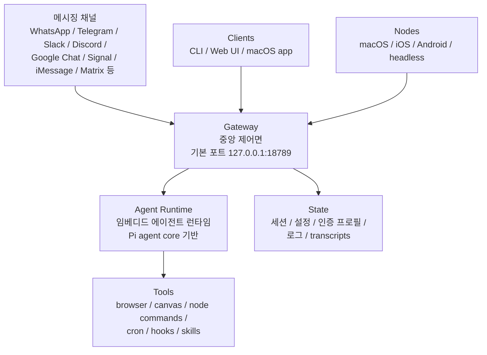
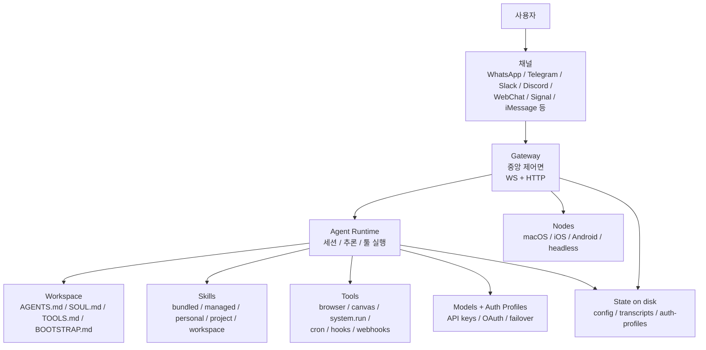

# OpenClaw 상세 정리

작성 기준일: 2026-04-13  
주요 참고: `openclaw/openclaw` 공식 README, `docs.openclaw.ai`, `openclaw/docs`

## 1. 한 줄 요약

`OpenClaw`는 "내가 직접 소유하고 운영하는 개인용 AI 비서"를 지향하는 오픈소스 플랫폼이다.

핵심은 단순 CLI 에이전트가 아니라:

- 여러 메시징 채널을 붙일 수 있고
- 중앙 `Gateway`가 세션/도구/채널/이벤트를 통합 관리하며
- 로컬 또는 원격 장치와 연결하고
- 웹 UI, 음성, Canvas, 브라우저 자동화, 스킬을 묶어서
- "항상 켜져 있는 개인 비서"처럼 쓰게 해주는 구조

공식 README 표현을 그대로 요약하면:

- `personal AI assistant`
- `you run on your own devices`
- `Gateway is just the control plane — the product is the assistant`

즉, OpenClaw는 "모델 한 번 호출하는 도구"가 아니라 "개인 AI 운영체제" 쪽에 가깝다.

---

## 2. 현재 기준 스냅샷

2026-04-13 기준 공식 GitHub와 공식 docs에서 확인되는 큰 그림은 다음과 같다.

- 대표 저장소: `openclaw/openclaw`
- 라이선스: `MIT`
- 최신 패키지 버전: `2026.4.12`
- 공식 문서: `https://docs.openclaw.ai`
- 공식 웹사이트: `https://openclaw.ai`

GitHub 저장소 메타데이터 기준으로는 매우 큰 프로젝트다.

- Stars: 약 `355k+`
- Forks: 약 `71k+`
- Open issues: 약 `18k+`

이 숫자는 시간이 지나면 달라진다. 따라서 이 문서에서는 `2026-04-13 기준 관측값`으로 이해해야 한다.

---

## 3. OpenClaw가 해결하려는 문제

OpenClaw는 일반적인 "AI 채팅 앱"과 다른 문제를 풀려고 한다.

### 3.1 일반 AI 앱의 한계

보통 AI 서비스는 아래 중 하나에 머무른다.

- 브라우저 탭에서만 사용
- 특정 앱 안에서만 사용
- 한 채널만 연결 가능
- 장치 로컬 능력과 분리
- 세션/자동화/도구가 따로 놀음

### 3.2 OpenClaw의 목표

OpenClaw는 이걸 이렇게 바꾸려 한다.

- 내가 이미 쓰는 채널에서 AI를 호출
- 하나의 gateway가 전체 제어면(control plane)을 담당
- 여러 디바이스가 node로 연결
- 여러 모델 공급자와 인증 프로필을 붙임
- 세션, 메모리, 도구, 채널 라우팅을 일관되게 관리
- 필요하면 음성, 화면, 카메라, 브라우저 제어까지 포함

즉:

- 단순 `chatbot`
- 단순 `terminal agent`
- 단순 `Slack bot`

이 아니라, 이들을 하나로 합친 `personal assistant platform`이다.

---

## 4. OpenClaw의 기본 철학

공식 문서와 README를 보면 OpenClaw의 방향은 몇 가지 축으로 정리된다.

### 4.1 Personal assistant

OpenClaw는 기본적으로 `personal AI assistant`를 전제로 한다.

즉:

- "많은 불특정 사용자가 공유하는 멀티테넌트 SaaS"보다
- "한 명 또는 하나의 신뢰 경계 안에서 쓰는 개인 비서"

에 초점이 맞춰져 있다.

### 4.2 Local-first / own-your-data 성향

공식 설명상:

- 네 디바이스에서 돌리고
- 네 채널에 연결하고
- 네 설정과 세션을 네가 관리하는 구조

를 강하게 지향한다.

완전한 오프라인 제품은 아니지만, 운영 주체가 서비스 사업자보다 사용자 자신이라는 점이 중요하다.

### 4.3 Gateway 중심

OpenClaw 세계관의 핵심은 `Gateway`다.

OpenClaw는 많은 기능이 있지만, 모든 것이 흩어져 있는 것이 아니다.

- 채널
- 세션
- 모델
- 도구
- Web UI
- node
- hooks
- cron

이 전부 Gateway를 중심으로 붙는다.

### 4.4 Product is the assistant

README의 문구 중 중요한 표현:

- `The Gateway is just the control plane — the product is the assistant.`

이 말은:

- 게이트웨이 자체가 목표가 아니라
- 사용자가 일상적으로 쓰는 AI 비서 경험 전체가 목표

라는 뜻이다.

---

## 5. 아키텍처 한눈에 보기

OpenClaw 공식 docs의 `Gateway architecture`를 바탕으로 큰 그림을 Mermaid로 표현하면 아래와 같다.



핵심 해석:

- 채널은 입력/출력 표면이다.
- Gateway가 모든 연결의 중심이다.
- Agent runtime은 Gateway 뒤에서 실제 추론과 툴 실행을 담당한다.
- Nodes는 장치별 능력을 노출한다.
- 상태는 디스크와 설정 파일에 유지된다.

---

## 6. 핵심 구성 요소

### 6.1 Gateway

공식 docs 기준 `Gateway`는 WebSocket 서버이며, OpenClaw의 control plane이다.

Gateway가 하는 일:

- 채널 연결 유지
- control-plane client 연결
- node 연결
- 세션 상태 관리
- 설정 반영
- 이벤트 방송
- hooks / cron / webhooks 실행
- Control UI와 Canvas host 제공

기본 bind/port는 문서상:

- `127.0.0.1:18789`

### 6.2 Agent Runtime

공식 docs는 `single embedded agent runtime`이라고 설명한다.

중요 포인트:

- OpenClaw는 단순 shell wrapper가 아니다.
- 내부적으로 agent loop가 있고
- 세션 / 컨텍스트 / 모델 추론 / 툴 실행 / 응답 스트리밍 / persistence까지 하나의 loop로 관리한다.

또 공식 docs는 runtime boundary를 이렇게 설명한다.

- 모델 / 툴 / 프롬프트 파이프라인은 `Pi agent core` 기반
- 세션 / 채널 / discovery / tool wiring 등은 OpenClaw 레이어

즉:

- 순수 모델 런타임은 외부 코어를 활용
- 실제 제품화/운영 계층은 OpenClaw가 담당

### 6.3 Clients

Gateway에 붙는 대표 control-plane client:

- CLI
- Web UI / Control UI
- macOS app

이들은 Gateway에 요청을 보내고 상태/이벤트를 받는다.

### 6.4 Nodes

Nodes는 OpenClaw의 큰 차별점 중 하나다.

Nodes는:

- macOS
- iOS
- Android
- headless node

같은 실제 장치 능력을 Gateway에 노출한다.

공식 docs에서 node가 제공하는 대표 기능:

- `canvas.*`
- `camera.*`
- `screen.record`
- `location.get`
- macOS 쪽 `system.run`, `system.notify`

즉, OpenClaw는 단순히 "텍스트 답변"만 하는 것이 아니라, 장치 기능을 안전하게 라우팅하는 플랫폼이기도 하다.

### 6.5 Web UI / Dashboard / WebChat

공식 docs 기준:

- Gateway는 Control UI를 직접 제공할 수 있다.
- WebChat도 같은 gateway 위에서 동작할 수 있다.

즉 별도 SaaS 대시보드 없이도:

- 브라우저에서 상태 보기
- 채팅하기
- 설정 보기

가 가능하다.

### 6.6 Skills

OpenClaw는 skills를 매우 중요한 개념으로 둔다.

공식 docs 기준:

- AgentSkills-compatible skill folders 사용
- 각 skill은 `SKILL.md` 포함 디렉터리
- YAML frontmatter + instructions 구조

즉 OpenClaw는 skill을 통해:

- 툴 사용법 교육
- 환경별 가이드 삽입
- 선택적 로딩

을 한다.

### 6.7 Browser / Canvas / Voice

README에서 강조하는 대표 기능:

- Browser control
- Live Canvas
- Voice Wake
- Talk Mode

이 부분 때문에 OpenClaw는 "text bot"보다 "멀티모달 작업 비서"에 가깝다.

---

## 7. 설치와 시작 방식

OpenClaw 공식 docs의 `Getting Started` 기준 최소 요구사항은 다음과 같다.

- Node.js
  - Node 24 권장
  - Node 22.14+ 또는 22.16+도 지원 문구가 보임
- 모델 제공자 API key 또는 OAuth

### 7.1 가장 권장되는 설치 방식

공식 문서에서 빠른 설치는 대략 아래 흐름이다.

```bash
curl -fsSL https://openclaw.ai/install.sh | bash
openclaw onboard --install-daemon
```

README의 npm 글로벌 설치 방식도 있다.

```bash
npm install -g openclaw@latest
openclaw onboard --install-daemon
```

즉, 공식 권장 시작점은 `onboard`다.

### 7.2 왜 onboard가 중요한가

`openclaw onboard`는 단순 설치가 아니라 아래를 한 번에 묶는다.

- gateway 설정
- workspace 생성
- model provider 선택
- API key / OAuth 설정
- daemon 설치
- optional channel setup

즉, OpenClaw는 "패키지 설치 후 직접 다 수작업"보다 "온보딩 wizard"를 정식 경로로 본다.

### 7.3 설치 후 첫 확인

공식 getting started 기준 기본 확인 명령:

```bash
openclaw gateway status
openclaw dashboard
```

정상이라면:

- Gateway가 올라와 있고
- port `18789`에서 응답하고
- Control UI가 뜬다.

---

## 8. 설정 파일 구조

OpenClaw docs의 `Configuration` 기준:

- 설정 파일 경로: `~/.openclaw/openclaw.json`
- 형식: `JSON5`

문서에서 강조하는 포인트:

- 파일이 없으면 safe defaults 사용
- 대부분의 운영은 이 파일을 기준으로 제어
- onboarding / configure / UI / direct edit 모두 지원

### 8.1 설정 파일에서 제어하는 것

공식 docs에서 예시로 드는 주요 범주:

- channels
- models
- tools
- sandboxing
- automation
- sessions
- media
- networking
- UI

즉 설정 파일은 단순 환경변수 모음이 아니라 OpenClaw 운영 정책의 중심이다.

### 8.2 최소 예시

공식 docs의 최소 예시 요지:

```json5
{
  agents: { defaults: { workspace: "~/.openclaw/workspace" } },
  channels: { whatsapp: { allowFrom: ["+15555550123"] } }
}
```

### 8.3 설정 변경 방식

공식 docs 기준 가능한 방식:

- `openclaw onboard`
- `openclaw configure`
- `openclaw config get/set/unset`
- Control UI Config tab
- 직접 파일 수정

### 8.4 Hot reload

이 부분은 꽤 강력하다.

공식 docs 기준 Gateway는 `openclaw.json`을 감시하고 자동 반영한다.

reload mode:

- `hybrid` 기본
- `hot`
- `restart`
- `off`

실무적으로 중요 포인트:

- 대부분 설정은 재시작 없이 hot apply 가능
- gateway bind/port/auth/tailscale/TLS 등 핵심 infra 변화는 restart 필요

즉 설정 UX는 꽤 운영 친화적이다.

---

## 9. Workspace와 bootstrap 파일

공식 docs의 `Agent Runtime` 페이지는 workspace 구조를 매우 명확하게 설명한다.

기본 개념:

- `agents.defaults.workspace`가 agent의 기본 작업 디렉터리
- tools와 context의 기준 cwd 역할

### 9.1 주요 bootstrap 파일

공식 docs가 언급하는 user-editable 파일:

- `AGENTS.md`
- `SOUL.md`
- `TOOLS.md`
- `BOOTSTRAP.md`

이 파일들의 역할은 대략 아래처럼 이해하면 된다.

- `AGENTS.md`: 운영 지침 + 기억
- `SOUL.md`: 페르소나, 경계, 톤
- `TOOLS.md`: 툴 관련 사용자 메모
- `BOOTSTRAP.md`: 초기 1회성 부트스트랩

즉 OpenClaw는 "에이전트 인격/지침/도구 사용 메모"를 workspace 파일로 관리하는 철학이 강하다.

---

## 10. Skills 구조와 우선순위

OpenClaw docs의 `Skills` 페이지는 skill precedence를 매우 구체적으로 설명한다.

로드 소스는 높은 우선순위부터 대략 아래다.

1. `<workspace>/skills`
2. `<workspace>/.agents/skills`
3. `~/.agents/skills`
4. `~/.openclaw/skills`
5. bundled skills
6. `skills.load.extraDirs`

즉 OpenClaw는:

- 전역 skill
- 개인 agent skill
- 프로젝트 agent skill
- workspace skill

을 계층적으로 합친다.

### 10.1 왜 이게 중요한가

이 구조는 아래를 가능하게 한다.

- 사용자 공통 skill
- 프로젝트별 skill
- 특정 workspace에서만 높은 precedence로 override

즉 단순 plugin 설치보다 훨씬 정교한 지식/동작 계층화가 가능하다.

### 10.2 Skill gating

공식 docs는 metadata 기반 load-time filter도 설명한다.

예:

- 특정 binary 필요
- 특정 env 필요
- 특정 config 필요

즉 모든 skill을 무조건 싣는 게 아니라, 환경에 맞는 skill만 활성화할 수 있다.

### 10.3 ClawHub

공식 registry는 `ClawHub`다.

관련 흐름:

- skill 검색
- install/update
- public registry 기반 배포

즉 OpenClaw ecosystem은 core repo만이 아니라 skills registry까지 포함한다.

---

## 11. 세션 모델

OpenClaw docs의 `Session Management`는 이 프로젝트가 단순 채팅 앱이 아니라는 걸 잘 보여준다.

핵심:

- 모든 대화를 session으로 관리
- direct chat, group chat, cron, webhook, node run 등을 서로 다른 session key로 분리

### 11.1 기본 direct message 동작

문서상 기본값은:

- direct chats는 하나의 `main` session으로 collapse

장점:

- continuity가 좋다

단점:

- 여러 사람이 DM을 보내면 context leakage 가능

### 11.2 DM isolation

문서가 강하게 경고하는 보안 포인트:

- 여러 사용자가 DM을 보내는 환경이면 `dmScope: "main"`은 위험할 수 있다.

권장 대안:

- `per-peer`
- `per-channel-peer`
- `per-account-channel-peer`

즉 OpenClaw는 다중 사용자 DM을 "자동으로 안전"하게 보지 않는다.

### 11.3 세션 저장 위치

공식 docs 기준 transcripts는 JSONL로 디스크에 저장된다.

대표 경로:

- `~/.openclaw/agents/<agentId>/sessions/<SessionId>.jsonl`

이는 매우 중요하다.

- 세션 지속성에 좋다
- 메모리/컴팩션에 유리하다
- 하지만 디스크 접근 자체가 신뢰 경계가 된다

### 11.4 Session tools

공식 docs의 `Session Tools`에 따르면 agent는 세션 간 도구도 가진다.

예:

- `sessions_list`
- `sessions_history`
- `sessions_send`
- `sessions_spawn`
- `sessions_yield`
- `subagents`
- `session_status`

즉 OpenClaw는 "한 세션 안의 단일 응답"만이 아니라, 세션 간 orchestration도 지원하는 쪽이다.

---

## 12. 모델, 인증, failover

OpenClaw는 하나의 모델 공급자에 고정된 제품이 아니다.

공식 README와 docs에 따르면:

- 여러 provider 지원
- API key와 OAuth 프로필 모두 지원
- 모델 fallback 체계 존재

### 12.1 Auth profiles

공식 docs의 `Model Failover` 기준:

- auth profiles에 API key / OAuth token을 저장
- profile id를 provider별로 분리
- 여러 계정을 coexist 가능

대표 저장 위치:

- `~/.openclaw/agents/<agentId>/agent/auth-profiles.json`

### 12.2 Failover 전략

OpenClaw는 실패를 2단계로 처리한다고 문서가 설명한다.

1. 현재 provider 안에서 auth profile rotation
2. `agents.defaults.model.fallbacks` 기준 다음 모델로 fallback

즉:

- 같은 provider의 다른 인증 프로필 재시도
- 그래도 안 되면 다른 model candidate로 이동

이 흐름을 가진다.

### 12.3 왜 이게 중요한가

실전 운영에서는 아래 문제가 자주 생긴다.

- rate limit
- OAuth 만료
- 특정 provider 장애
- billing limit
- temporary server error

OpenClaw는 이런 환경을 `human operator가 매번 수동으로 고치기 전에 자동 완충`하려는 설계가 강하다.

---

## 13. 채널 지원 범위

OpenClaw 공식 README는 굉장히 많은 채널을 나열한다.

대표 예:

- WhatsApp
- Telegram
- Slack
- Discord
- Google Chat
- Signal
- iMessage / BlueBubbles
- IRC
- Microsoft Teams
- Matrix
- Feishu
- LINE
- Mattermost
- Nextcloud Talk
- Nostr
- Twitch
- Zalo
- WeChat
- WebChat

이건 OpenClaw의 가장 큰 차별점 중 하나다.

대부분의 에이전트 도구는:

- CLI 전용이거나
- 특정 IDE 전용이거나
- Slack/Discord 한두 개 정도만 붙는다

반면 OpenClaw는 메시징 허브 성격이 강하다.

### 13.1 채널이 많다는 의미

장점:

- 사용자가 이미 쓰는 UX 표면을 그대로 활용 가능
- "AI를 쓰기 위해 새로운 앱 습관을 만들 필요"가 줄어듦

단점:

- 채널별 인증/정책/보안 고려가 복잡
- 운영면이 무거워짐

즉 OpenClaw는 강력한 대신 단순하지 않다.

---

## 14. 보안 모델

OpenClaw docs의 `Security` 페이지는 매우 중요하다.

가장 중요한 한 줄:

- OpenClaw는 `hostile multi-tenant security boundary`를 목표로 하지 않는다.

즉:

- 개인 비서
- 하나의 trusted operator boundary

가 기본 가정이다.

### 14.1 지원하는 보안 자세

문서가 권장하는 기본 자세:

- one user / one trust boundary / one gateway
- 필요하면 agent 여러 개 가능
- 하지만 adversarial user들이 하나의 gateway를 공유하는 구조는 비권장

### 14.2 왜 이런 제한을 두는가

OpenClaw는:

- frontier model behavior
- real messaging surfaces
- real tools
- real device actions

을 연결한다.

즉 잘못 설계하면:

- 누가 봐도 위험한 RCE 표면
- 대화 내용 leakage
- 채널 남용
- 브라우저/노드/시스템 액션 악용

으로 이어질 수 있다.

그래서 공식 docs도 "perfectly secure setup 같은 건 없고, deliberate하게 최소 권한부터 시작하라"는 방향을 강조한다.

### 14.3 세션 로그 디스크 저장

문서가 직접 경고하는 부분:

- session transcript가 디스크에 저장된다
- `~/.openclaw`에 접근 가능한 사용자/프로세스는 내용을 볼 수 있다

즉 filesystem access가 곧 trust boundary다.

### 14.4 DM pairing

공식 README는 DM 정책 기본값을 꽤 보수적으로 둔다.

기본 동작 요지:

- Telegram/WhatsApp/Signal/iMessage/Teams/Discord/Google Chat/Slack 등에서
- unknown sender는 pairing code를 받고
- 바로 agent에게 메시지가 처리되지 않는다

즉 DM 기본 개방형이 아니라 pairing 중심이다.

### 14.5 Per-agent access profiles

공식 security docs는 multi-agent routing 환경에서 agent별 sandbox/tool policy를 다르게 둘 수 있다고 설명한다.

예시 사용 시나리오:

- personal agent: full access
- family/work agent: sandboxed + read-only tools
- public agent: sandboxed + no filesystem/shell tools

즉 OpenClaw는 agent별 권한 분리 개념도 지원한다.

---

## 15. Gateway 노출과 원격 접근

OpenClaw는 gateway를 네트워크에 노출하는 시나리오도 문서화한다.

대표 방식:

- Tailscale Serve
- Tailscale Funnel
- SSH tunnels

### 15.1 기본 방향

문서상 권장 포인트:

- gateway는 loopback bind 유지
- Tailscale/SSH로 외부 접근 노출
- public exposure는 password auth 같은 보호장치와 함께

즉 "그냥 0.0.0.0 열어두는" 단순 구조를 권장하지 않는다.

### 15.2 Remote gateway

README는 Linux host에 gateway를 두고:

- macOS app
- CLI
- WebChat

가 원격 gateway에 붙는 구조도 지원한다고 말한다.

이건 꽤 실용적이다.

- 집의 작은 서버/VPS에 gateway 운영
- 각 디바이스는 client/node로 붙음

형태가 가능하기 때문이다.

---

## 16. Voice, Canvas, Browser가 의미하는 것

OpenClaw는 일반 채팅 에이전트와 달리 "입출력 표면"이 풍부하다.

### 16.1 Voice

공식 README가 강조하는 기능:

- Voice Wake
- Talk Mode

즉 호출형 음성 비서 경험을 지향한다.

### 16.2 Canvas

Canvas는 agent-driven visual workspace다.

즉 OpenClaw는 텍스트 응답만이 아니라, agent가 시각적 공간을 조작하는 경험도 포함한다.

### 16.3 Browser control

브라우저 제어는 요즘 agent system의 핵심인데, OpenClaw도 이를 first-class tool로 넣고 있다.

브라우저 자동화가 들어간다는 건:

- 검색
- 웹사이트 상호작용
- 로그인된 워크플로우
- 폼 제출/수집

같은 것이 가능해진다는 뜻이다.

---

## 17. OpenClaw를 써야 하는 경우

아래에 해당하면 OpenClaw는 꽤 맞는 선택일 수 있다.

### 17.1 여러 채널에 같은 개인 AI를 붙이고 싶을 때

예:

- Slack에서도 쓰고
- Telegram에서도 쓰고
- 휴대폰에서도 쓰고
- 웹에서도 같은 assistant를 쓰고 싶다

### 17.2 개인 소유형 assistant를 원할 때

예:

- SaaS 안에 종속되기 싫다
- 내 호스트에서 돌리고 싶다
- 세션/로그/설정을 내가 관리하고 싶다

### 17.3 에이전트가 실제 도구와 연결돼야 할 때

예:

- 브라우저
- 로컬 장치
- 캔버스
- 스킬
- hooks / cron / webhooks

### 17.4 장기 운영형 assistant가 필요할 때

예:

- 항상 켜져 있어야 한다
- 여러 입력 표면을 받아야 한다
- 메모리/세션 지속성이 중요하다

---

## 18. OpenClaw가 안 맞을 수 있는 경우

아래 경우엔 오히려 과할 수 있다.

### 18.1 단순 CLI 코딩 에이전트만 원할 때

그렇다면:

- Codex CLI
- Claude Code
- Gemini CLI

같은 쪽이 더 단순하고 맞을 수 있다.

### 18.2 멀티유저 SaaS처럼 안전한 공유 서비스가 필요할 때

공식 docs도 OpenClaw를 hostile multi-tenant 보안 경계로 보지 않는다.

즉:

- 서로 신뢰하지 않는 사용자들이 한 gateway를 공유

하는 구조는 맞지 않다.

### 18.3 운영 복잡도를 감당하기 싫을 때

OpenClaw는 기능이 많은 대신 운영 포인트도 많다.

- 인증
- 채널 연결
- 세션
- logs
- 모델
- 장치 pairing
- gateway exposure

즉 "간단한 로컬 툴"은 아니다.

---

## 19. 관련 공식 저장소

공식 org 기준으로 함께 보면 좋은 저장소:

### 19.1 `openclaw/openclaw`

메인 저장소.

- 제품 본체
- CLI
- gateway
- docs source
- skills
- apps 관련 코드

### 19.2 `openclaw/docs`

공식 docs site mirror repo.

중요 포인트:

- source of truth는 `openclaw/openclaw` 아래 `docs/`
- `openclaw/docs`는 published docs mirror 성격

### 19.3 `openclaw/clawhub`

공식 skill directory.

### 19.4 `openclaw/skills`

ClawHub에 있는 skill 버전 archive.

### 19.5 `openclaw/openclaw-ansible`

하드닝된 설치/배포 자동화를 위한 ansible repo.

### 19.6 `openclaw/nix-openclaw`

Nix packaging용 repo.

### 19.7 `openclaw/openclaw-windows-node`

Windows companion suite.

### 19.8 `openclaw/lobster`

OpenClaw-native workflow shell / macro engine 성격의 별도 프로젝트.

---

## 20. 구조 요약 Mermaid

아래는 OpenClaw 전체 구조를 한눈에 보는 다이어그램이다.



---

## 21. 실무적 해석

OpenClaw를 실무 관점에서 해석하면 다음과 같다.

### 21.1 이것은 "에이전트 앱"이 아니라 "에이전트 플랫폼"이다

기능 범위를 보면:

- 채널 허브
- agent runtime
- device node
- skill 시스템
- browser + canvas
- sessions + memory
- hooks + cron

이 전부 들어 있다.

### 21.2 강점은 통합성이다

OpenClaw의 가장 큰 강점은 개별 기능보다 `통합된 제어면`이다.

즉:

- 모델 따로
- 채널 따로
- 로컬 앱 따로
- 세션 따로

가 아니라 하나의 gateway에 묶인다.

### 21.3 약점은 복잡도다

이 정도 통합은 강력하지만, 동시에 아래가 어렵다.

- 운영
- 디버깅
- 보안 경계 설정
- 채널 정책 관리
- 세션 설계

즉 "강력한 개인 assistant infra"를 얻는 대신 운영 복잡성을 받아들이는 프로젝트다.

---

## 22. 시작할 때 추천 순서

처음 OpenClaw를 만진다면 아래 순서를 추천한다.

1. `Getting Started`를 읽는다.
2. `openclaw onboard --install-daemon`으로 최소 설치한다.
3. `openclaw gateway status`와 `openclaw dashboard`로 기본 동작을 확인한다.
4. Control UI에서 먼저 채팅한다.
5. 그 다음 Telegram 같은 쉬운 채널 하나만 연결한다.
6. `Security` 문서를 읽고 pairing / allowlist / dmScope를 조정한다.
7. `Skills`와 `Configuration`을 읽고 필요한 스킬과 config만 추가한다.
8. 마지막에 remote gateway / Tailscale / nodes로 확장한다.

이 순서가 좋은 이유:

- 처음부터 모든 채널과 device node를 붙이면 너무 복잡하다.
- 먼저 gateway + local chat + security baseline을 잡아야 한다.

---

## 23. 소스 링크

이 문서를 정리할 때 직접 참고한 주요 공식 링크:

- 공식 메인 repo: <https://github.com/openclaw/openclaw>
- 공식 README: <https://github.com/openclaw/openclaw/blob/main/README.md>
- 공식 docs: <https://docs.openclaw.ai>
- Getting started: <https://docs.openclaw.ai/start/getting-started>
- Gateway architecture: <https://docs.openclaw.ai/concepts/architecture>
- Agent runtime: <https://docs.openclaw.ai/concepts/agent>
- Session management: <https://docs.openclaw.ai/concepts/session>
- Session tools: <https://docs.openclaw.ai/concepts/session-tool>
- Skills: <https://docs.openclaw.ai/tools/skills>
- Configuration: <https://docs.openclaw.ai/gateway/configuration>
- Security: <https://docs.openclaw.ai/gateway/security>
- Model failover: <https://docs.openclaw.ai/concepts/model-failover>
- Gateway CLI: <https://docs.openclaw.ai/cli/gateway>
- openclaw/docs mirror repo: <https://github.com/openclaw/docs>
- ClawHub repo: <https://github.com/openclaw/clawhub>

