# PHP `::` 스코프 결정 연산자 상세 노트

작성 기준일: 2026-05-08  
조사 방식: PHP 공식 문서 + Dubright 실제 코드 기반 정리  
주요 참고: PHP Manual `Scope Resolution Operator (::)`, `Static Keyword`, `Late Static Bindings`, `Class Constants`

## 1. 한 줄 요약

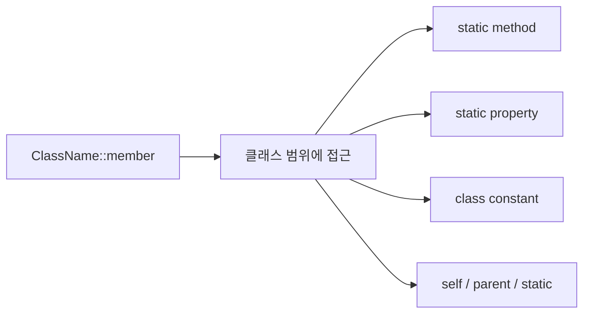

- PHP의 `::`는 **스코프 결정 연산자**다.
- 읽는 법은 보통 "클래스 또는 특정 스코프 안에 있는 멤버를 가리킨다"로 보면 된다.
- `PHASTAPI_AUTH::GetUserInfo()`는 `PHASTAPI_AUTH` 클래스의 `GetUserInfo` static method를 인스턴스 없이 호출한다는 뜻이다.

```php
$info = PHASTAPI_AUTH::GetUserInfo();
```

- 이 줄 전체는 실무적으로 **"`PHASTAPI_AUTH`의 `GetUserInfo()` 호출 결과를 `$info` 변수에 담는다"**고 읽는다.
- 기호까지 풀어 읽으면 "`$info`에 `PHASTAPI_AUTH::GetUserInfo()`의 반환값을 대입한다"가 된다.
- `$info`에서 `$`는 돈 표시가 아니라 **PHP 변수 이름 앞에 붙는 표식**이다.
- PHP 변수는 보통 `$변수명` 형태로 쓰며, 여기서는 `$info` 전체가 변수 표현이고 실제 변수 이름은 `info`다.
- `=`는 비교가 아니라 **대입 연산자**다. 오른쪽 값을 계산한 뒤 왼쪽 변수에 저장한다.

| 조각 | 읽는 법 | 의미 |
|------|---------|------|
| `$info` | "인포 변수" 또는 "달러 인포" | 값을 담을 PHP 변수 |
| `=` | "대입한다" | 오른쪽 결과를 왼쪽 변수에 저장 |
| `PHASTAPI_AUTH` | "PHASTAPI_AUTH 클래스" | static method를 가진 인증 helper class |
| `::` | "스코프 결정 연산자" | class scope 안의 member에 접근 |
| `GetUserInfo()` | "GetUserInfo 메서드 호출" | 현재 요청의 user info를 가져오는 static method |

- 이 코드는 아래처럼 해석한다.

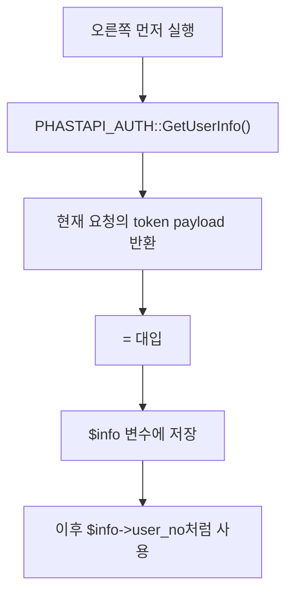

- JavaScript의 `object.method()`처럼 객체 인스턴스에 붙은 method를 부르는 느낌이 아니다.
- PHP에서는 `->`와 `::`를 구분해야 한다.

| 문법 | 기준 | 대표 의미 |
|------|------|-----------|
| `$obj->method()` | 객체 인스턴스 | 특정 객체가 가진 instance method 호출 |
| `ClassName::method()` | 클래스 스코프 | static method 또는 class-level member 접근 |
| `self::method()` | 현재 클래스 정의 위치 | 같은 클래스 안의 static member 접근 |
| `parent::method()` | 부모 클래스 | override한 부모 구현 호출 |
| `static::method()` | 런타임 호출 클래스 | late static binding |

## 2. 왜 중요한가

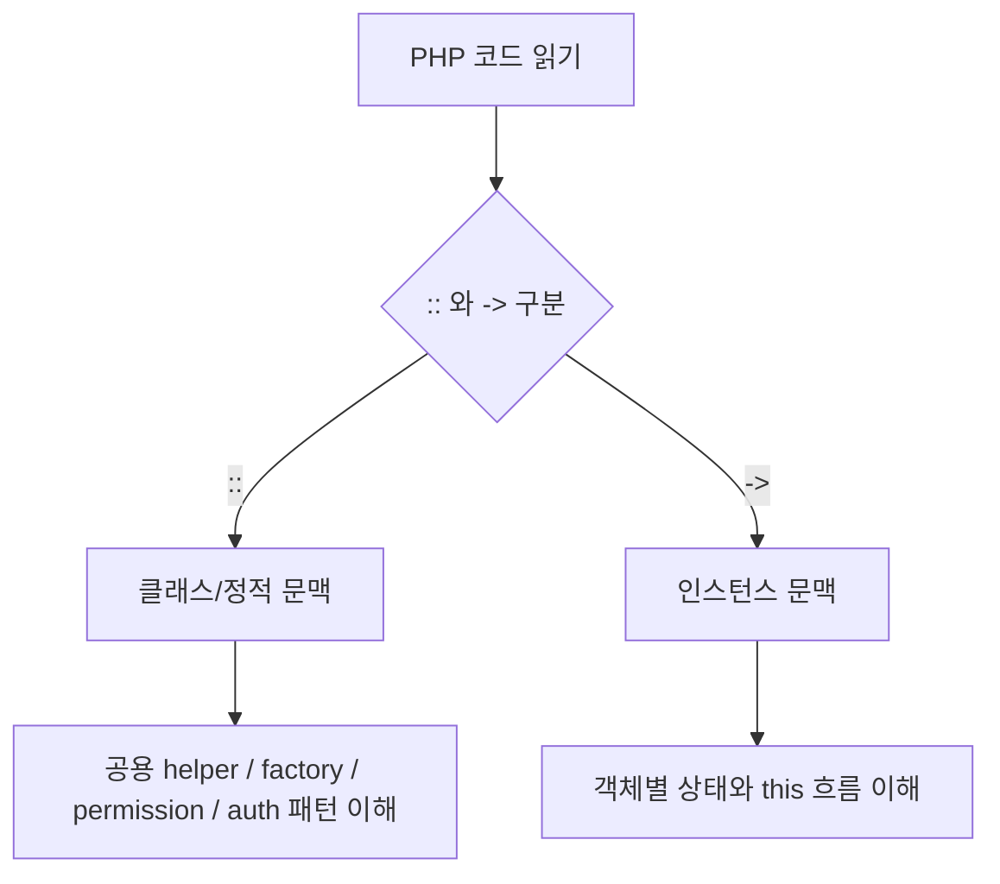

- `::`를 모르면 PHP backend에서 공용 helper, permission check, auth utility, enum-like constant를 읽기 어렵다.
- 특히 오래된 PHP 코드나 자체 framework 코드에서는 아래 같은 static helper 패턴이 자주 나온다.

```php
$info = PHASTAPI_AUTH::GetUserInfo();
$user_type = PHASTAPI::GetUserTypeFromHeader();
$is_admin = PERMISSION_API::IsAdmin($user_type);
```

- 위 코드는 모두 class를 인스턴스화하지 않고 class 이름으로 method를 호출한다.
- 이런 패턴은 전역 함수처럼 편하게 쓰이지만, 실제로는 특정 class에 묶인 static API다.

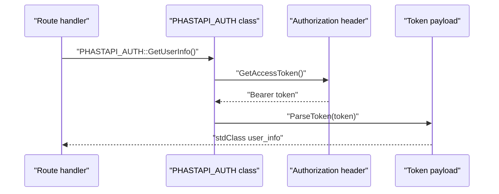

- Dubright 예시에서는 `$info`가 현재 로그인 사용자의 actor context다.
- route handler는 `$info->user_no`로 생성자·수정자·성우 번호를 결정하고, `$info->user_type`으로 역할별 분기를 한다.

## 3. 핵심 개념

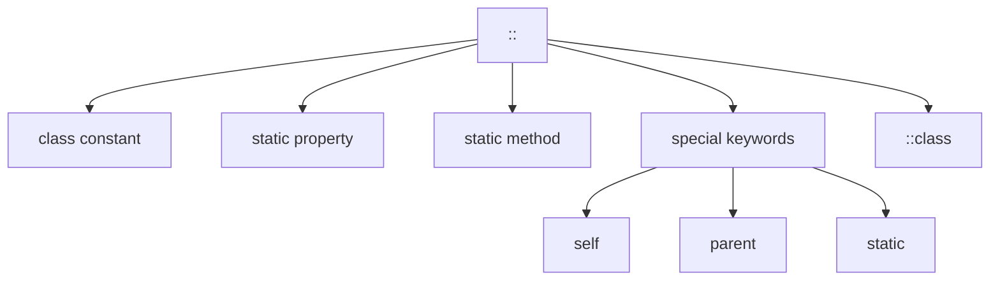

### 3.1 클래스 상수

- class 안에 고정값을 정의하고 `ClassName::CONST_NAME`으로 읽는다.
- 인스턴스마다 달라지는 값이 아니라 class 자체에 붙은 값이다.

```php
class UserRole {
    public const ADMIN = 'USER_ROLE_ADMIN';
}

echo UserRole::ADMIN;
```

### 3.2 static property

- class 전체에 공유되는 property다.
- 접근할 때 `$` 위치가 중요하다.

```php
class Counter {
    public static int $count = 0;
}

Counter::$count++;
```

- `Counter::$count`처럼 class 뒤에는 `::`, property 이름 앞에는 `$`가 붙는다.

### 3.3 static method

- object를 만들지 않고 class 이름으로 호출할 수 있는 method다.

```php
class TokenParser {
    public static function parse(string $token): array {
        return explode('.', $token);
    }
}

$parts = TokenParser::parse($token);
```

- `PHASTAPI_AUTH::GetUserInfo()`도 이 범주다.

```php
class PHASTAPI_AUTH
{
    public static function GetUserInfo()
    {
        $access_token = self::GetAccessToken();
        $parsed = self::ParseToken($access_token);
        return $parsed->payload;
    }
}
```

### 3.4 `self::`, `parent::`, `static::`

```mermaid
classDiagram
    class ParentClass {
        +who()
    }
    class ChildClass {
        +who()
    }
    ParentClass <|-- ChildClass
    ParentClass : self::who()
    ChildClass : parent::who()
    ParentClass : static::who()
```

- `self::`는 코드가 정의된 현재 class를 기준으로 한다.
- `parent::`는 부모 class의 member를 가리킨다.
- `static::`은 실행 시점에 실제로 호출된 class를 기준으로 한다. 이를 late static binding이라고 부른다.

## 4. 동작 흐름

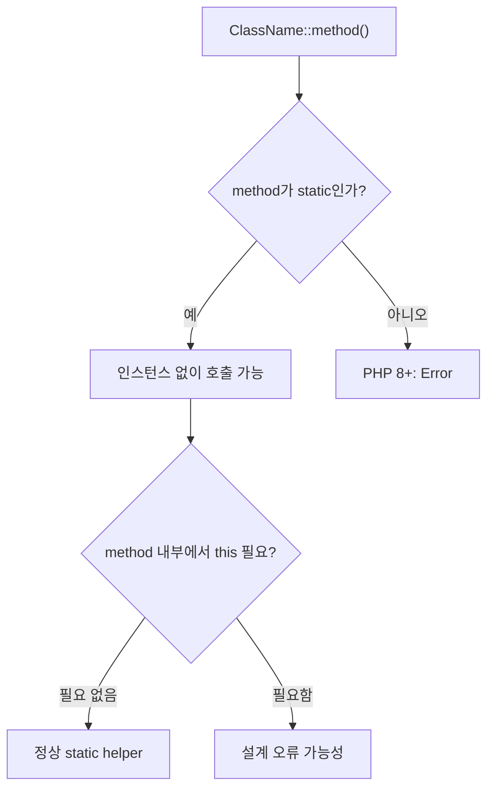

- static method는 특정 객체 상태 없이 실행된다.
- 그래서 static method 안에서는 `$this`를 사용할 수 없다.
- `$this`는 "현재 인스턴스"를 뜻하는데, static 호출에는 현재 인스턴스가 없기 때문이다.

```php
class BadExample {
    public static function run() {
        // $this는 static method 안에서 사용할 수 없다.
    }
}
```

- Dubright의 `PHASTAPI_AUTH::GetUserInfo()`는 request header를 읽고 token을 parse하는 utility라서 인스턴스 상태가 필요 없다.
- 이런 경우 static method가 실용적으로 쓰인다.

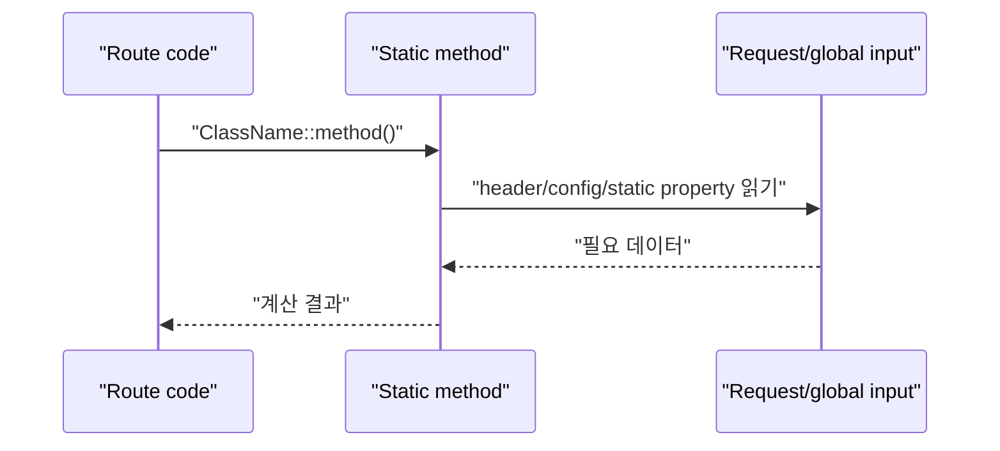

- 다만 static helper가 많아지면 의존성이 숨는다.
- 예를 들어 `PHASTAPI_AUTH::GetUserInfo()`는 함수 인자만 봐서는 `Authorization` 헤더에 의존한다는 사실이 드러나지 않는다.
- 테스트하기도 어려워질 수 있다.

## 5. 중요한 세부사항과 주의점

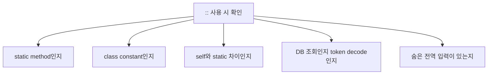

### 5.1 `::`는 "무조건 static method"가 아니다

- `::`는 static method뿐 아니라 class constant, static property, `::class`, `self`, `parent`, `static`에도 쓰인다.

```php
UserRole::ADMIN;        // class constant
Counter::$count;        // static property
TokenParser::parse();   // static method
User::class;            // fully qualified class name
self::helper();         // current class scope
parent::helper();       // parent class scope
static::helper();       // late static binding
```

### 5.2 `self::`와 `static::`은 상속에서 다르다

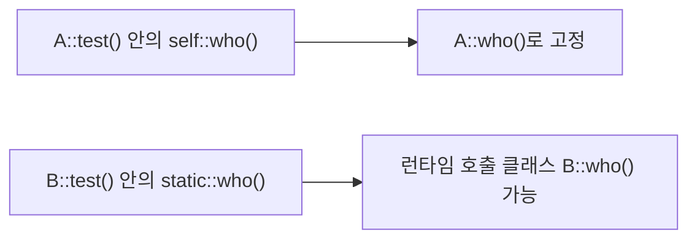

- `self::`는 method가 정의된 class로 고정된다.
- `static::`은 실제 호출된 class를 따라갈 수 있다.
- 상속 가능한 factory, enum-like base class, overridable static config에서는 `static::`이 필요할 수 있다.

```php
class Base {
    public static function name() { return 'Base'; }
    public static function selfName() { return self::name(); }
    public static function staticName() { return static::name(); }
}

class Child extends Base {
    public static function name() { return 'Child'; }
}

echo Child::selfName();   // Base
echo Child::staticName(); // Child
```

### 5.3 static method가 DB를 조회하는지, token만 읽는지 구분해야 한다

- 이름만 보고는 `GetUserInfo()`가 DB user row를 다시 가져오는지 알 수 없다.
- Dubright의 실제 구현은 DB 조회가 아니라 token payload decode다.

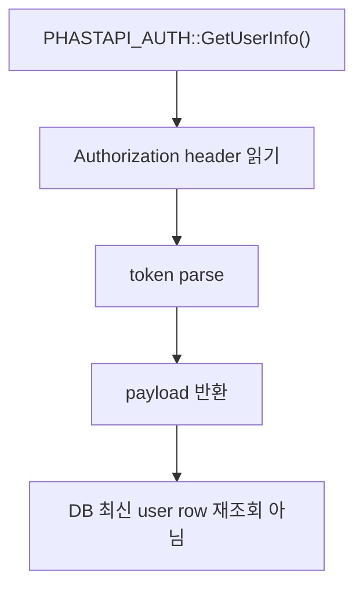

- 따라서 사용자 상태나 역할이 DB에서 바뀌었어도 기존 access token payload에는 예전 정보가 남아 있을 수 있다.
- 최신성이 중요한 route는 별도 DB 조회나 permission helper를 확인해야 한다.

## 6. 실무 예시

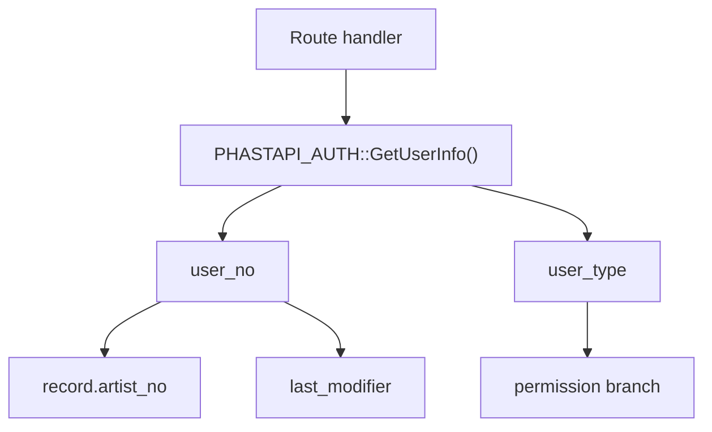

### 6.1 Dubright `GetUserInfo()` 해석

```php
$info = PHASTAPI_AUTH::GetUserInfo();
$user_no = (int) $info->user_no;
```

- 첫 줄은 "`PHASTAPI_AUTH::GetUserInfo()`의 반환값을 `$info` 변수에 대입한다"로 읽는다.
- `$info`의 `$`는 PHP에서 "이 이름은 변수다"라고 표시하는 문법이다.
- 따라서 `$info`는 `info`라는 이름의 변수이고, `PHASTAPI_AUTH::GetUserInfo()` 호출 결과를 가리킨다.
- `PHASTAPI_AUTH`는 인증 helper class다.
- `::`는 class scope 접근이다.
- `GetUserInfo()`는 static method다.
- `$info`는 현재 요청 token payload에서 decode된 user info object다.
- 두 번째 줄의 `$info->user_no`는 "`$info` object 안의 `user_no` property를 읽는다"는 뜻이다.
- 즉 `$info->user_no`는 현재 로그인 사용자의 DB 번호다.

### 6.2 `::`와 `->` 비교

```php
class AuthContext {
    public static function currentUserNo(): int {
        return 1;
    }

    public function label(): string {
        return 'current user';
    }
}

$userNo = AuthContext::currentUserNo(); // class로 static method 호출

$ctx = new AuthContext();
$label = $ctx->label();                 // object로 instance method 호출
```

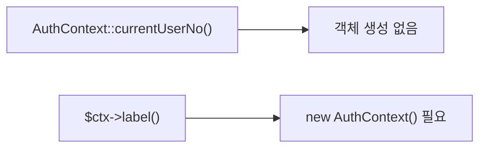

### 6.3 class constant와 static property

```php
class ApiStatus {
    public const OK = 'ok';
    public static int $requestCount = 0;
}

echo ApiStatus::OK;
ApiStatus::$requestCount++;
```

- 상수는 `$` 없이 `ApiStatus::OK`로 읽는다.
- static property는 property 이름 앞에 `$`를 붙여 `ApiStatus::$requestCount`로 읽고 쓴다.

## 7. 용어 정리와 빠른 복습

```mermaid
mindmap
  root((PHP ::))
    "Scope Resolution Operator"
      "class scope 접근"
      "double colon"
    "사용 대상"
      "class constant"
      "static property"
      "static method"
      "::class"
    "특수 키워드"
      "self"
      "parent"
      "static"
    "Dubright"
      "PHASTAPI_AUTH::GetUserInfo()"
      "$info 변수"
      "token payload"
      "user_no / user_type"
```

- `::`: PHP의 스코프 결정 연산자. class나 특정 class scope 안의 member를 가리킨다.
- `$변수명`: PHP 변수 표기법. `$info`는 `info`라는 이름의 변수다.
- `=`: 대입 연산자. 오른쪽 표현식의 결과를 왼쪽 변수에 저장한다.
- static method: instance 없이 `ClassName::method()`로 호출 가능한 method.
- static property: class에 붙어 공유되는 property. `ClassName::$property`로 접근한다.
- class constant: class에 정의된 고정값. `ClassName::CONSTANT`로 접근한다.
- `self::`: 현재 class 정의 위치 기준.
- `parent::`: 부모 class 기준.
- `static::`: 런타임 호출 class 기준. late static binding에 사용한다.
- `::class`: class의 fully qualified name 문자열을 얻는 특수 constant.
- `->`: object instance member 접근 연산자. `::`와 다르다.
- `PHASTAPI_AUTH::GetUserInfo()`: Dubright PHP backend에서 현재 요청의 token payload를 user info object로 꺼내는 static helper 호출.

## 8. 참고 링크

- [PHP Manual — Scope Resolution Operator (::)](https://www.php.net/manual/en/language.oop5.paamayim-nekudotayim.php)
- [PHP Manual — Static Keyword](https://www.php.net/manual/en/language.oop5.static.php)
- [PHP Manual — Late Static Bindings](https://www.php.net/manual/en/language.oop5.late-static-bindings.php)
- [PHP Manual — Class Constants](https://www.php.net/manual/en/language.oop5.constants.php)
- [Dubright PHAST auth core](/Users/nes0903/Documents/dobedub/dubright_backend/api/core/phastapi.auth.php)
- [Dubright auth workflow wiki](/Users/nes0903/Documents/dobedub/dobedub-wiki/services/dubright/workflows/auth.md)
