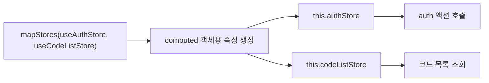
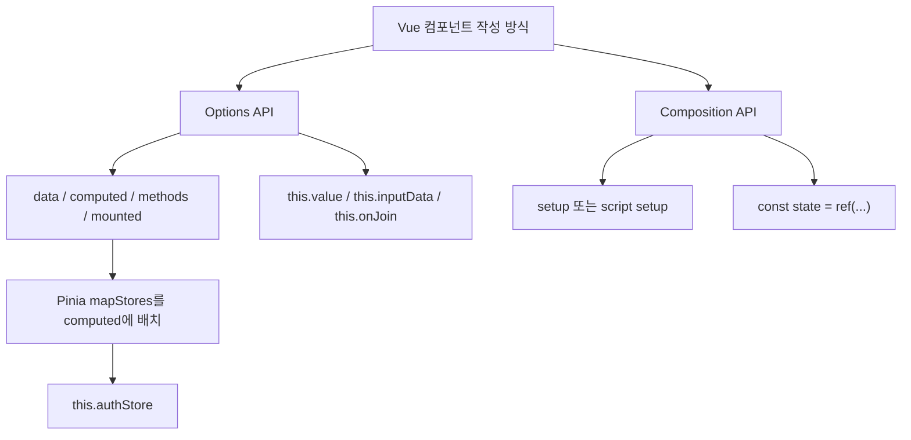
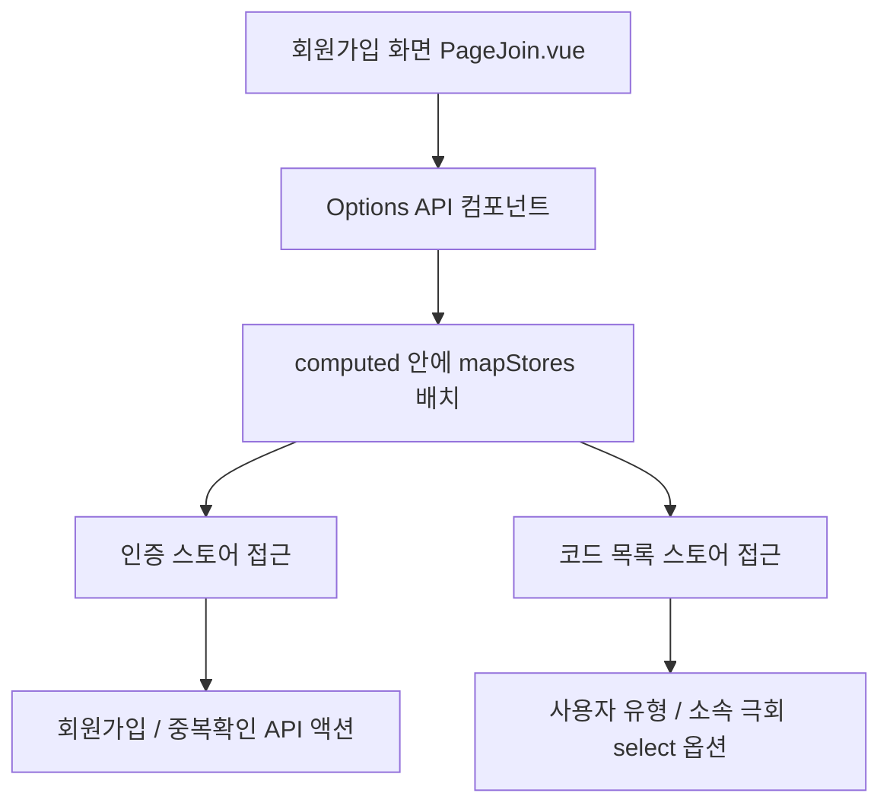
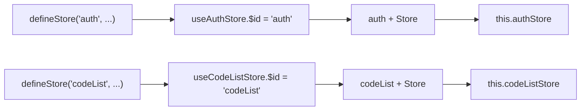
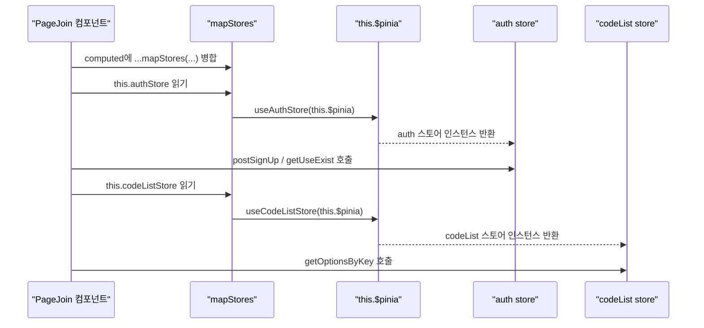
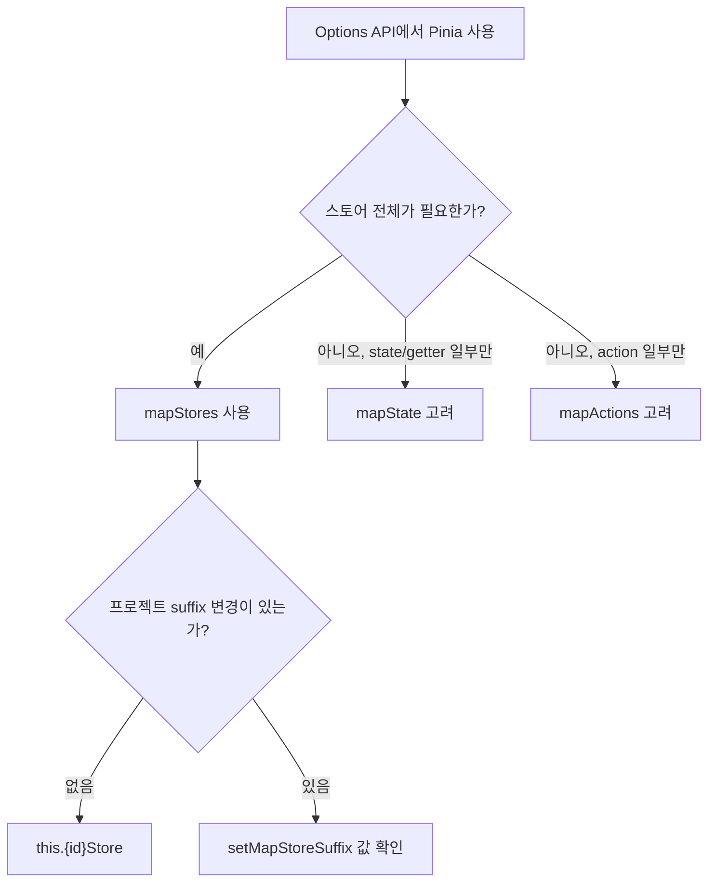
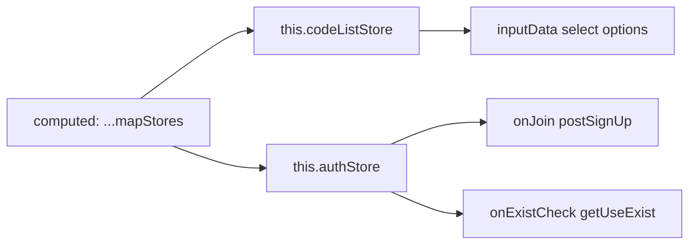
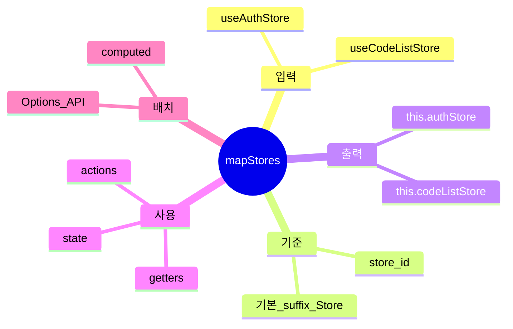

# Pinia `mapStores` Options API 용법

## 1. 한 줄 요약

- `...mapStores(useAuthStore, useCodeListStore)`는 Pinia 스토어 정의 함수를 Vue Options API 컴포넌트의 `computed` 객체에 펼쳐 넣어서, 컴포넌트 안에서 `this.authStore`, `this.codeListStore`로 스토어 전체 인스턴스에 접근하게 해 주는 문법이다.
- `/Users/nes0903/Documents/dobedub/dubright_front/src/pages/join/PageJoin.vue:118`에서는 회원가입 화면이 `setup()`을 쓰지 않는 Options API 컴포넌트이므로, Pinia 스토어를 `this.*Store` 형태로 쓰기 위해 이 헬퍼를 사용한다.



## 2. Options API가 무엇인가

- Vue에서 컴포넌트를 작성하는 방식은 크게 `Options API`와 `Composition API`로 나뉜다.
- `Options API`는 컴포넌트 로직을 하나의 객체 안에 옵션별로 나누어 적는 방식이다.
  - `data()`는 컴포넌트의 반응형 상태를 정의한다.
  - `computed`는 상태에서 파생되는 계산값을 정의한다.
  - `methods`는 버튼 클릭, API 호출, 상태 변경 같은 동작 함수를 정의한다.
  - `mounted()` 같은 lifecycle hook은 컴포넌트가 생성·마운트·업데이트되는 시점의 동작을 정의한다.
- Options API에서는 `data`, `computed`, `methods`에 정의된 값들이 컴포넌트 인스턴스에 연결되고, 같은 컴포넌트 내부에서 `this`로 접근된다.
  - `data()`가 반환한 `value` → `this.value`
  - `computed`의 `inputData()` → `this.inputData`
  - `methods`의 `onJoin()` → 템플릿에서는 `@click="onJoin"`, 내부에서는 `this.onJoin()`
- `PageJoin.vue`는 `<script setup>`이 아니라 아래처럼 `export default { data, computed, mounted, methods }` 형태로 되어 있으므로 Options API 컴포넌트다.

```js
export default {
    data() {
        return {
            value: {},
            check: {},
        };
    },
    computed: {
        inputData() {
            return [];
        },
    },
    mounted() {
        console.log(this.value);
    },
    methods: {
        onJoin() {
            // this.value, this.inputData 접근 가능
        },
    },
};
```

- 그래서 Pinia 스토어도 Composition API처럼 `setup()` 안에서 `const authStore = useAuthStore()`로 선언하지 않고, Options API에 맞게 `computed`에 `mapStores()`를 펼쳐 넣어 `this.authStore` 형태로 사용한다.



## 3. 왜 중요한가

- `PageJoin.vue`는 `<script setup>`이나 `setup()` 함수가 아니라 `data`, `computed`, `mounted`, `methods`를 쓰는 Options API 구조다.
- Composition API라면 `const authStore = useAuthStore()`처럼 바로 변수에 담지만, Options API에서는 컴포넌트 옵션 내부의 `this` 컨텍스트에서 스토어를 쓰는 방식이 필요하다.
- Pinia의 `mapStores()`는 이런 Options API 컴포넌트에서 스토어 전체를 `computed` 속성으로 노출하는 공식 헬퍼다.
- 회원가입 화면에서는 전역 인증 API 액션과 코드 목록 조회가 필요하다.
  - `this.authStore.postSignUp(param)`
  - `this.authStore.getUseExist(email, nickname)`
  - `this.codeListStore.getOptionsByKey(...)`



## 4. 핵심 개념

- `mapStores`는 `pinia`에서 import하는 Options API용 map helper다.
- 인자로는 스토어 인스턴스가 아니라 `defineStore()`가 반환한 스토어 사용 함수, 즉 `useAuthStore`, `useCodeListStore` 같은 store definition을 넘긴다.
- 공식 문서 기준으로 `mapStores()`는 배열을 받는 형태가 아니라 `mapStores(useCartStore, useUserStore)`처럼 인자를 하나씩 나열하는 형태를 권장한다.
- `...`는 Pinia 문법이 아니라 JavaScript object spread 문법이다.
  - `mapStores(...)`가 반환한 객체의 key-value를 `computed: { ... }` 안으로 병합한다.
- 생성되는 computed 이름은 기본적으로 `store id + "Store"`다.
  - `defineStore("auth", ...)` → `this.authStore`
  - `defineStore("codeList", ...)` → `this.codeListStore`
- `dubright_front`의 `yarn.lock` 기준 현재 설치된 Pinia는 `2.3.1`이고, 로컬 패키지 구현도 기본 suffix를 `"Store"`로 둔다.
- `src/stores/index.js`에는 `setMapStoreSuffix()` 호출이 없으므로 기본 suffix 규칙이 그대로 적용된다.



## 5. 아키텍처와 동작 흐름

- `computed` 옵션에 `...mapStores(...)`를 넣으면, Pinia는 각 스토어마다 computed getter 함수를 만들어 준다.
- 컴포넌트에서 `this.authStore`를 읽는 순간 해당 computed getter가 `useAuthStore(this.$pinia)`를 호출해 현재 앱의 Pinia 인스턴스에 연결된 `auth` 스토어를 반환한다.
- 반환되는 값은 store 전체 인스턴스라서 state, getters, actions를 모두 접근할 수 있다.
- `PageJoin.vue`에서는 `computed.inputData()` 안에서 `this.codeListStore`를 쓰고, `methods.onJoin()`과 `methods.onExistCheck()`에서 `this.authStore`를 쓴다.



## 6. 중요한 디테일, 주의점, 트레이드오프

- `mapStores`는 스토어 전체를 노출한다.
  - 장점: state, getters, actions를 한 번에 쓸 수 있어 Options API 컴포넌트에서 편하다.
  - 단점: 컴포넌트가 스토어의 어떤 부분에 의존하는지 `mapState`, `mapActions`보다 덜 명시적이다.
- computed 이름 충돌에 주의해야 한다.
  - 같은 컴포넌트에 `authStore()`라는 computed를 직접 정의하면 `mapStores`가 만든 이름과 충돌한다.
- suffix는 바꿀 수 있지만, 프로젝트 전체 규칙에 영향을 준다.
  - `setMapStoreSuffix("")`를 쓰면 `this.authStore`가 아니라 `this.auth`가 된다.
  - `dubright_front`는 suffix를 바꾸지 않았으므로 `Store` suffix를 기준으로 읽으면 된다.
- `mapStores([useAuthStore, useCodeListStore])`처럼 배열로 감싸는 형태는 피한다.
  - Pinia 로컬 구현에는 개발 환경 경고가 있고, 공식 문서도 인자를 나열하는 예시를 든다.
- `this.authStore` 자체는 computed property지만, 그 안의 store 인스턴스는 Pinia reactive store다.
  - action 호출: `await this.authStore.postSignUp(param)`
  - state 읽기/쓰기: `this.authStore.isLogin`
- 일부 코드에서는 `useCodeListStore()`를 필요한 지점에서 직접 호출하는 패턴도 보인다.
  - Options API 컴포넌트 내부에서 반복적으로 store를 쓰는 경우에는 `mapStores`가 더 일관된 `this.*Store` 접근 방식을 제공한다.



## 7. 실전 예시

- 현재 코드:

```js
import { mapStores } from "pinia";
import { useAuthStore } from "src/stores/auth.store";
import { useCodeListStore } from "src/stores/codeList.store";

export default {
    computed: {
        ...mapStores(useAuthStore, useCodeListStore),
        inputData() {
            return [
                [
                    {
                        itype: "select",
                        prepend: "사용자 유형",
                        selections: this.codeListStore.getOptionsByKey(COMMON.CODES.USER_ROLE, "join"),
                    },
                ],
            ];
        },
    },
    methods: {
        async onJoin() {
            const r = await this.authStore.postSignUp(param);
        },
    },
};
```

- 이해를 돕기 위해 내부적으로는 아래와 비슷하게 확장된다고 보면 된다.
  - 실제 구현 세부는 Pinia 버전에 따라 달라질 수 있지만, 현재 설치된 Pinia 2.3.1 로컬 구현도 같은 구조다.

```js
export default {
    computed: {
        authStore() {
            return useAuthStore(this.$pinia);
        },
        codeListStore() {
            return useCodeListStore(this.$pinia);
        },
        inputData() {
            // this.codeListStore 사용 가능
        },
    },
};
```

- `PageJoin.vue`의 실제 사용 지점:
  - `this.codeListStore.getOptionsByKey(COMMON.CODES.USER_ROLE, "join")`
  - `this.codeListStore.getOptionsByKey(COMMON.CODES.ARTIST_ASSOCIATION)`
  - `await this.authStore.postSignUp(param)`
  - `await this.authStore.getUseExist(email, nickname)`



## 8. 용어 정리와 빠른 복습

- Options API
  - Vue 컴포넌트를 `data`, `computed`, `methods`, `mounted` 같은 옵션 객체로 정의하는 방식이다.
- Composition API
  - `setup()` 또는 `<script setup>` 안에서 `ref`, `computed`, 함수 등을 조합해 컴포넌트 로직을 작성하는 방식이다.
- Store definition
  - `defineStore("auth", {...})`가 반환한 `useAuthStore` 같은 함수다.
- Store id
  - `defineStore()`의 첫 번째 인자다. `mapStores`의 computed 이름 생성 기준이 된다.
- Store instance
  - `useAuthStore()` 또는 `useAuthStore(this.$pinia)` 호출 결과다. state, getters, actions를 가진다.
- Map helper
  - Options API에서 Pinia store를 컴포넌트 옵션에 연결하는 헬퍼 계열이다. `mapStores`, `mapState`, `mapActions` 등이 있다.
- Object spread
  - `{ ...obj }`처럼 객체의 enumerable own properties를 다른 객체 literal 안에 펼쳐 넣는 JavaScript 문법이다.
- Suffix
  - `mapStores`가 store id 뒤에 붙이는 문자열이다. 기본값은 `"Store"`다.



## 참고 링크

- [Pinia 공식 문서: Usage without setup()](https://pinia.vuejs.org/cookbook/options-api.html)
- [Pinia API: mapStores()](https://pinia.vuejs.org/api/pinia/functions/mapStores.html)
- [Pinia API: setMapStoreSuffix()](https://pinia.vuejs.org/api/pinia/functions/setMapStoreSuffix.html)
- [Pinia 공식 문서: Defining a Store](https://pinia.vuejs.org/core-concepts/)
- [Vue 공식 문서: Introduction / Options API](https://vuejs.org/guide/introduction.html)
- [MDN: Spread syntax (...)](https://developer.mozilla.org/en-US/docs/Web/JavaScript/Reference/Operators/Spread_syntax)
- [PageJoin.vue](/Users/nes0903/Documents/dobedub/dubright_front/src/pages/join/PageJoin.vue)
- [auth.store.js](/Users/nes0903/Documents/dobedub/dubright_front/src/stores/auth.store.js)
- [codeList.store.js](/Users/nes0903/Documents/dobedub/dubright_front/src/stores/codeList.store.js)
- [stores/index.js](/Users/nes0903/Documents/dobedub/dubright_front/src/stores/index.js)
- [Pinia 2.3.1 로컬 구현](/Users/nes0903/Documents/dobedub/dubright_front/node_modules/pinia/dist/pinia.mjs)

<!-- study-links:start -->
## 관련 문서

- `dubright`: [[dubright-yarn/dubright-yarn|dubright_front의 Yarn 패키지 매니저]]
- `join`: [[정보처리기사/3과목 데이터베이스 구축/119 순수 관계 연산자 - Join/119 순수 관계 연산자 - Join|119 순수 관계 연산자 - Join]]
<!-- study-links:end -->
