# QMD

- 작성일: 2026-06-29
- 범위: QMD, Markdown semantic search, BM25, vector search, LLM rerank, MCP, Obsidian/Raycast/Claude Desktop 연동
- 주의: 여기서 다루는 `QMD`는 공식 저장소 기준 `Query Markup Documents` 도구다. Quarto의 `.qmd` 파일 형식과는 다른 주제다.

## 1. 한 줄 요약

- QMD는 로컬 Markdown 문서를 인덱싱해서 키워드 검색, 의미 기반 검색, LLM 기반 재정렬을 함께 제공하는 TypeScript 기반 CLI/MCP 검색 도구다.
- 핵심 목적은 Obsidian vault, 개발 문서, 회의록, 개인 지식 베이스처럼 Markdown으로 쌓인 자료를 "정확한 키워드"와 "의미상 관련 문맥" 양쪽으로 빠르게 찾는 것이다.
- 공식 README 기준 QMD는 BM25 full-text search, vector semantic search, LLM reranking을 결합하며, `node-llama-cpp`와 GGUF 모델로 로컬 실행하는 방향을 취한다.

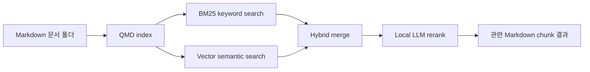

## 2. 왜 중요한가

- Markdown 기반 지식 베이스는 시간이 지날수록 파일 수가 늘고, 파일명이나 정확한 단어만으로는 원하는 내용을 찾기 어려워진다.
- 일반 `grep`/`ripgrep`은 빠르고 정확하지만, 사용자가 기억하는 표현과 문서에 적힌 표현이 다르면 놓치기 쉽다.
- 순수 vector search는 의미 유사성에 강하지만, 함수명, 에러 메시지, 고유명사, 날짜, 태그처럼 정확한 문자열이 중요한 검색에서는 BM25보다 불리할 수 있다.
- QMD는 로컬 Markdown 문서라는 좁은 문제를 대상으로 BM25, vector search, reranking, MCP 연동을 묶어 주기 때문에 개인 지식 검색과 AI agent 컨텍스트 검색에 실용적이다.

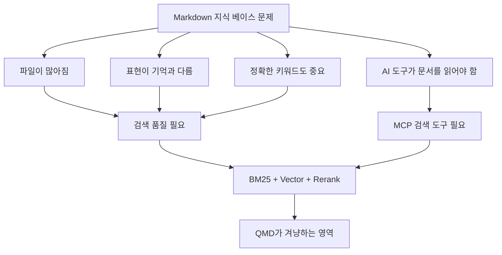

## 3. 핵심 개념

### QMD가 제공하는 기능 축

- `collection`: 검색 대상 Markdown 폴더를 이름 있는 collection으로 등록한다.
- `update`: collection의 파일 시스템을 스캔해 문서 메타데이터와 full-text index를 갱신한다.
- `embed`: 문서를 chunk 단위로 나누고 vector embedding을 생성한다.
- `BM25`: 검색어와 문서 chunk의 키워드 매칭을 점수화한다.
- `vector search`: 문서 chunk와 query를 embedding으로 바꿔 의미 유사도를 계산한다.
- `search`: BM25 full-text search 전용 명령이다.
- `vsearch`: vector semantic search 전용 명령이다.
- `query`: BM25, vector search, query expansion, RRF fusion, LLM rerank를 결합한 고품질 hybrid search 명령이다.
- `rerank`: 상위 후보를 로컬 LLM으로 다시 평가해 최종 순위를 개선한다.
- `MCP server`: Claude Desktop 같은 MCP client가 로컬 Markdown 검색을 도구처럼 호출할 수 있게 한다.
- `HTTP MCP transport`: 반복 실행 때 모델 로딩 비용을 줄이기 위해 장기 실행 HTTP MCP 서버로 띄울 수 있다.

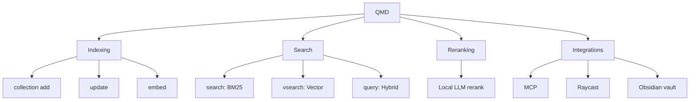

### QMD가 다루는 데이터 단위

- 검색 결과는 보통 전체 파일이 아니라 문서 안의 관련 chunk다.
- chunk 단위 검색은 긴 Markdown 파일에서 "정확히 어느 부분이 관련 있는지"를 찾는 데 유리하다.
- QMD는 Markdown 구조를 전제로 하므로 제목, 목록, 문단, frontmatter, 코드 블록 같은 요소 처리 방식이 검색 품질에 영향을 준다.

| 개념 | 의미 | 검색 품질에 미치는 영향 |
| --- | --- | --- |
| Markdown file | 원본 문서 파일 | 지식 베이스의 저장 단위 |
| Chunk | 검색/embedding을 위한 조각 | 너무 작으면 문맥 부족, 너무 크면 잡음 증가 |
| Embedding | 텍스트를 벡터로 변환한 표현 | 의미 유사 검색의 기반 |
| BM25 score | 키워드 기반 관련도 점수 | 정확한 용어 검색에 강함 |
| Rerank score | 후보 결과를 LLM이 재평가한 점수 | 최종 순위 품질 개선 |

## 4. 아키텍처와 검색 흐름

- QMD의 기본 흐름은 `collection 등록 → update → embed → 검색 → RRF 병합 → LLM rerank`다.
- 사용자가 query를 입력하면 QMD는 같은 query를 keyword 쪽과 vector 쪽에 모두 보내 후보를 만든다.
- BM25는 단어가 직접 등장하는 문서를 잘 잡고, vector search는 표현이 달라도 의미가 가까운 문서를 잡는다.
- `qmd query`는 query expansion을 수행하고 BM25/vector 결과를 Reciprocal Rank Fusion으로 합친 뒤, 상위 후보를 LLM rerank로 재정렬한다.

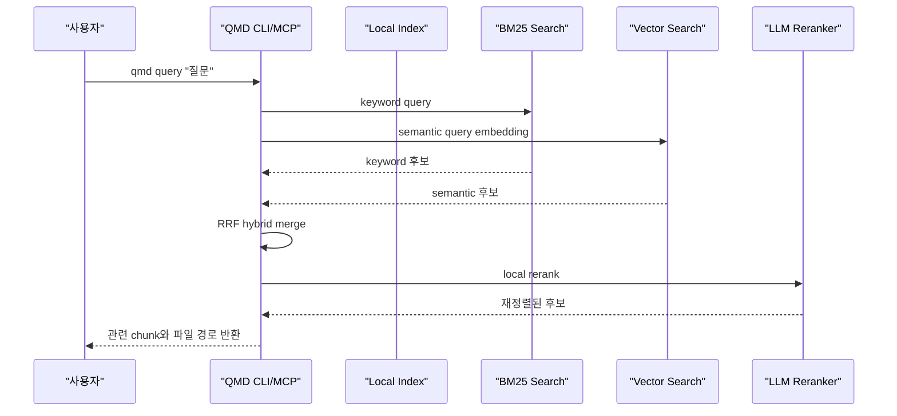

### 인덱싱 파이프라인

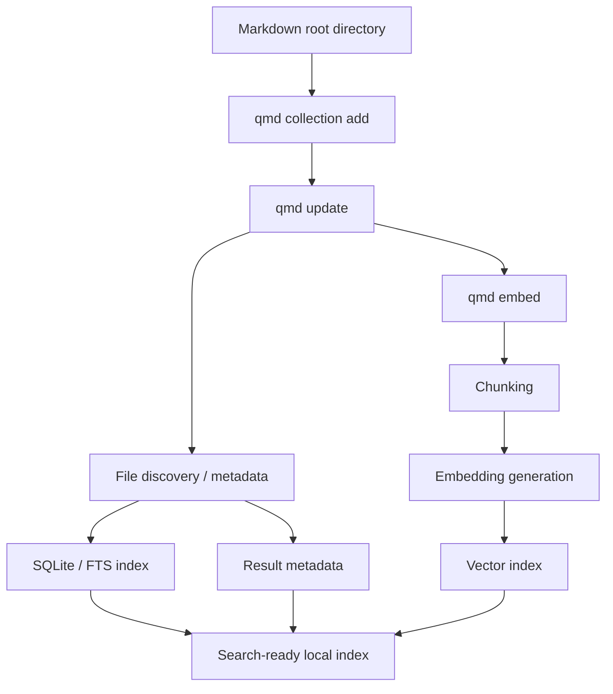

### MCP 연동 흐름

- MCP 모드에서 QMD는 검색 도구 서버가 된다.
- Claude Desktop 같은 MCP client는 사용자의 질문을 바탕으로 QMD tool을 호출한다.
- QMD는 로컬 Markdown 문서에서 관련 chunk를 찾아 client에게 반환한다.
- 이렇게 하면 LLM이 전체 vault를 무작정 읽는 대신 필요한 문맥만 가져올 수 있다.

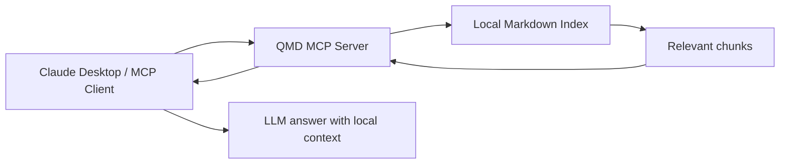

## 5. 중요 세부사항, 엣지 케이스, 트레이드오프

### BM25와 vector search를 같이 쓰는 이유

- BM25는 정확한 단어가 query와 문서에 같이 등장할 때 강하다.
- vector search는 "OAuth 로그인 문제"와 "인증 리다이렉트 실패"처럼 표현은 다르지만 의미가 가까운 내용을 찾는 데 강하다.
- QMD처럼 Markdown 지식 베이스를 검색할 때는 두 요구가 동시에 나온다. 그래서 hybrid search가 합리적이다.

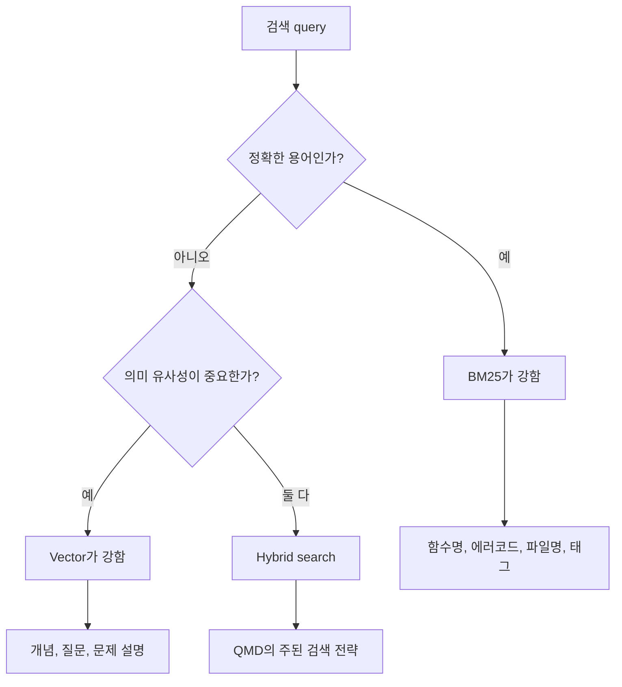

### LLM rerank의 장단점

- 장점: 후보 chunk가 query에 실제로 답하는지 더 정교하게 판단할 수 있다.
- 장점: BM25나 vector score만으로 놓치는 문맥적 우선순위를 보정할 수 있다.
- 장점: 공식 README 기준 reranking은 로컬 GGUF 모델을 사용하므로 외부 LLM API 호출을 전제로 하지 않는다.
- 단점: 로컬 모델 로딩과 추론 때문에 지연 시간, 메모리, VRAM/CPU 사용량이 늘어난다.
- 단점: 첫 사용 또는 모델 변경 시 Hugging Face 모델 다운로드와 cache 관리가 필요하다.
- 단점: rerank는 후보를 재정렬하는 것이므로, 초기 후보 검색에서 빠진 문서는 살릴 수 없다.

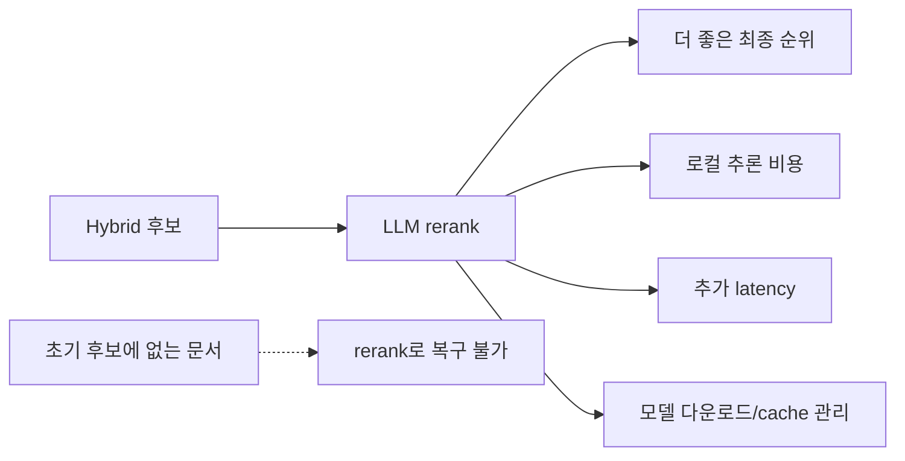

### 로컬 도구로서의 장점과 주의점

| 항목 | 장점 | 주의점 |
| --- | --- | --- |
| 로컬 Markdown 대상 | 개인 노트/팀 문서를 바로 검색 | 모델 다운로드와 로컬 cache 위치 확인 |
| CLI 중심 | 자동화와 스크립트에 적합 | 초기 설정과 index 관리 필요 |
| MCP 지원 | AI client가 검색 도구로 호출 가능 | MCP client 설정 파일 관리 필요 |
| HTTP MCP daemon | 모델을 반복 로딩하지 않아 AI client 연동에 유리 | host/port 노출 범위와 장기 실행 프로세스 관리 필요 |
| Hybrid search | keyword와 semantic 장점 결합 | 점수 병합/랭킹이 항상 기대와 같지는 않음 |

### 헷갈리기 쉬운 지점

- `QMD`는 Quarto Markdown 파일 확장자 `.qmd`와 다르다.
- QMD는 Markdown editor가 아니라 검색/indexing 도구다.
- QMD는 전체 답변 생성 도구라기보다 "관련 문서 chunk를 찾는 도구"에 가깝다.
- Semantic search 품질은 embedding 모델, chunk 크기, 문서 품질, query 표현에 크게 좌우된다.
- 민감한 Markdown vault를 검색할 때는 모델이 로컬에서 실행되는지, HTTP MCP 서버가 외부에 노출되지 않는지, cache와 index 파일 위치가 안전한지 확인해야 한다.

## 6. 실무 예시

### 설치와 기본 사용 흐름

- 공식 README 기준 QMD는 `npm`/`bun`/`npx` 기반 사용을 전제로 한다.
- 일반적인 흐름은 `collection add`로 Markdown 폴더를 등록하고, `embed`로 semantic search용 벡터를 만들고, `search`/`vsearch`/`query`로 질의하는 것이다.
- MCP로 연결하려면 QMD를 MCP server 명령으로 등록한다.

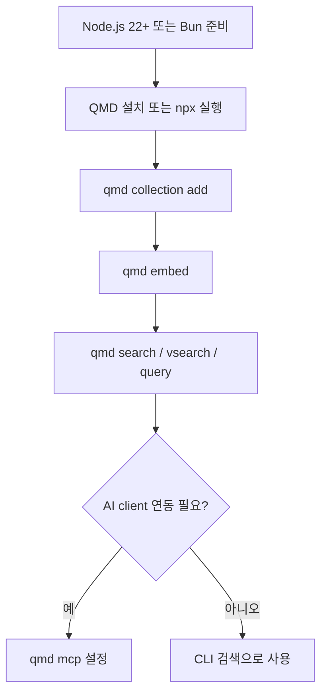

### CLI 사용 예시

```bash
# 전역 설치
npm install -g @tobilu/qmd

# Markdown 폴더를 collection으로 등록
qmd collection add ~/notes --name notes
qmd collection add ~/work/docs --name docs

# semantic search용 embedding 생성
qmd embed

# BM25 full-text search
qmd search "OAuth callback"

# vector semantic search
qmd vsearch "로그인 리다이렉트가 실패하는 이유"

# hybrid + query expansion + reranking
qmd query "OAuth callback 처리 흐름"

# 특정 collection으로 제한
qmd query "프로젝트 배포 체크리스트" -c docs
```

> 실제 옵션 이름은 QMD 버전에 따라 달라질 수 있으므로 `qmd --help`와 공식 README를 같이 확인한다.

### MCP 설정 예시

```json
{
  "mcpServers": {
    "qmd": {
      "command": "qmd",
      "args": ["mcp"]
    }
  }
}
```

### HTTP MCP 서버 예시

```bash
# 기본 localhost:8181
qmd mcp --http

# 다른 포트
qmd mcp --http --port 8080

# 백그라운드 daemon
qmd mcp --http --daemon
qmd mcp stop
```

### AI agent 컨텍스트 검색 예시

- 사용자가 Claude Desktop에 "내 노트에서 BM25 설명 찾아줘"라고 요청한다.
- Claude는 MCP tool로 QMD 검색을 호출한다.
- QMD는 로컬 Markdown index에서 관련 chunk를 반환한다.
- Claude는 반환된 chunk를 근거로 답변한다.

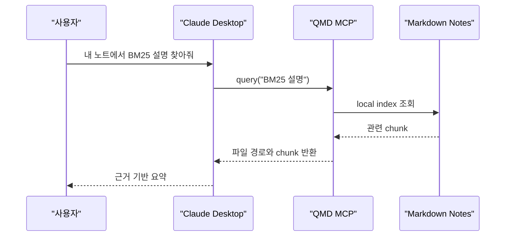

### Obsidian vault 검색 패턴

- Obsidian은 Markdown 파일을 폴더에 저장하므로 QMD의 기본 대상과 잘 맞는다.
- 태그, 링크, 제목을 잘 관리하면 BM25와 vector search 모두 품질이 좋아진다.
- 한 파일에 모든 내용을 몰아넣기보다 주제별로 나누면 chunk 검색 결과를 해석하기 쉽다.

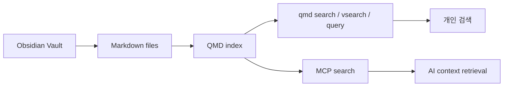

### 언제 QMD를 쓰면 좋은가

| 상황 | QMD 적합도 | 이유 |
| --- | --- | --- |
| Markdown 개인 지식 베이스 검색 | 높음 | 대상 도메인이 정확히 맞음 |
| Obsidian vault를 AI에게 검색시키기 | 높음 | MCP와 chunk retrieval이 유용 |
| 코드베이스 전체 심볼 검색 | 중간 | `ripgrep`, LSP, code search와 역할 분리 필요 |
| PDF/Word/웹페이지 검색 | 낮음 | Markdown 중심 도구이므로 전처리 필요 |
| 대규모 엔터프라이즈 검색 | 낮음~중간 | 권한, 색인 분산, 감사 로그, 운영 요구가 더 큼 |

### 요구사항과 로컬 모델

- 공식 README 기준 시스템 요구사항은 Node.js `>= 22`, Bun `>= 1.0.0`이다.
- macOS에서는 SQLite extension 지원을 위해 Homebrew SQLite 설치가 필요할 수 있다.
- 기본 로컬 GGUF 모델은 embedding, reranking, query expansion 역할로 나뉜다.
- 기본 embedding 모델은 영어 중심이며, 한국어/일본어/중국어 같은 CJK corpus는 Qwen3-Embedding 계열로 바꾸는 선택지가 문서에 안내되어 있다.
- embedding 모델을 바꾸면 기존 vector와 호환되지 않으므로 `qmd embed -f`로 다시 embedding해야 한다.

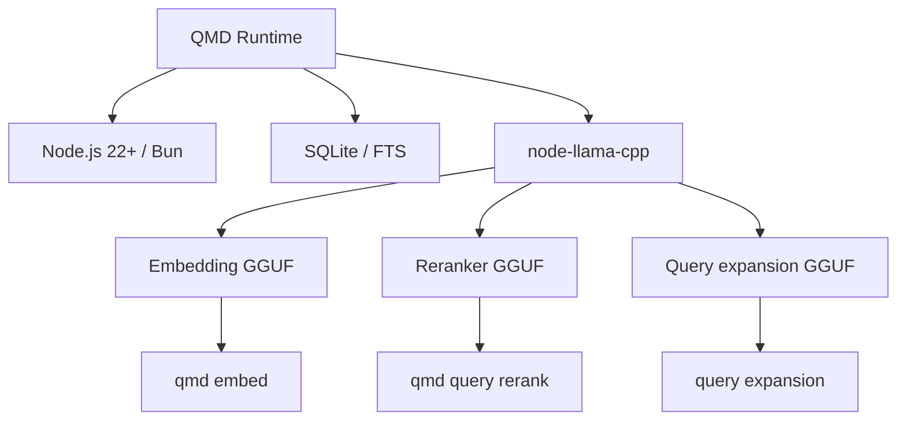

## 7. 용어 정리와 빠른 복습

- `QMD`: Query Markup Documents. Markdown/markup 문서 검색을 위한 CLI/MCP 도구다.
- `Markdown semantic search`: Markdown 문서를 embedding으로 표현해 의미상 가까운 문단을 찾는 방식이다.
- `BM25`: 키워드 기반 검색 랭킹 함수다. 정확한 단어 매칭에 강하다.
- `Vector search`: 텍스트를 벡터로 바꿔 의미 유사도를 계산하는 검색 방식이다.
- `Hybrid search`: BM25와 vector search 결과를 결합하는 방식이다.
- `Rerank`: 1차 후보 결과를 더 비싼 모델이나 추가 알고리즘으로 다시 정렬하는 단계다.
- `MCP`: Model Context Protocol. LLM client가 외부 도구와 데이터 소스를 표준 방식으로 호출하게 해 주는 프로토콜이다.
- `Chunk`: 검색과 embedding을 위해 문서를 나눈 작은 단위다.
- `RRF`: Reciprocal Rank Fusion. 여러 검색 결과 목록의 순위를 결합하는 fusion 방식이다.
- `FTS5`: SQLite의 full-text search 확장이다. QMD는 BM25 쪽 backend로 FTS를 사용한다.
- `GGUF`: llama.cpp 계열에서 쓰는 로컬 모델 파일 형식이다.

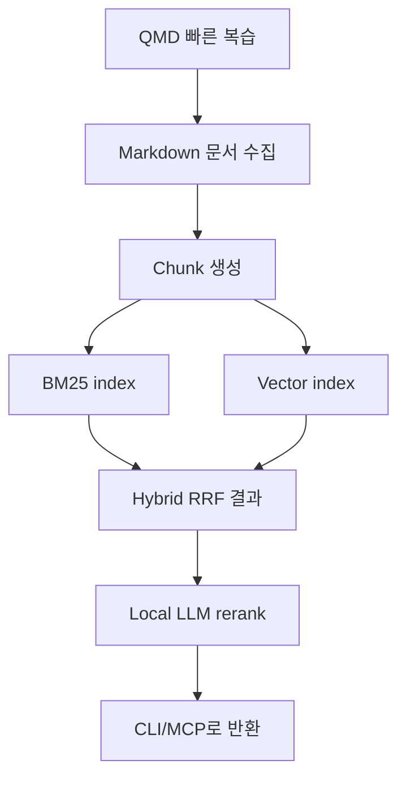

### 판단 기준

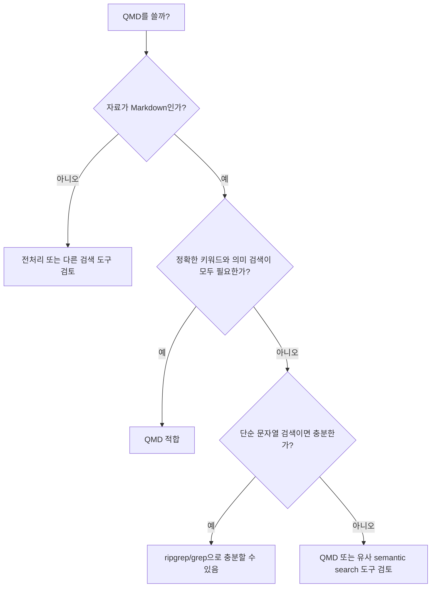

- QMD는 Markdown 문서 검색에 특화된 로컬 검색 도구다.
- 단순 grep보다 의미 검색에 강하고, 순수 vector search보다 exact keyword 검색을 보완하기 좋다.
- MCP를 통해 AI client가 로컬 노트를 검색하게 할 수 있다.
- 검색 품질은 chunking, embedding 모델, 문서 구조, rerank 사용 여부에 크게 좌우된다.
- 민감한 문서를 다룰 때는 index/cache 위치, HTTP MCP bind host, 모델 다운로드 경로, collection ignore 설정을 확인해야 한다.

## 8. 참고 링크

- [QMD GitHub Repository](https://github.com/tobi/qmd)
- [QMD package.json](https://github.com/tobi/qmd/blob/main/package.json)
- [QMD Architecture Overview](https://tobi-qmd-3.mintlify.app/architecture/overview)
- [QMD API Reference](https://tobi-qmd-3.mintlify.app/api-reference/introduction)
- [QMD Changelog](https://github.com/tobi/qmd/blob/main/CHANGELOG.md)
- [Model Context Protocol Documentation](https://modelcontextprotocol.io/)

<!-- study-links:start -->
## 관련 문서

- `daemon`: [[daemon/daemon|데몬(daemon) 상세 정리]]
- `sqlite`: [[sqlite/sqlite|SQLite 상세 정리]]
- `bm25`: [[bm25/bm25|BM25 검색 방식]]
- `파이프`: [[정보처리기사/1과목 소프트웨어 설계/029 파이프 - 필터 패턴/029 파이프 - 필터 패턴|029 파이프 - 필터 패턴]]
<!-- study-links:end -->
