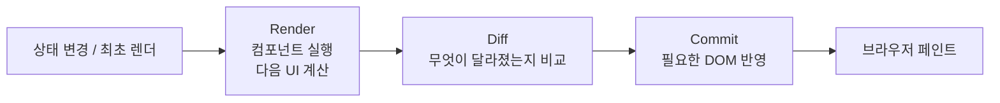

# React 상세 정리

작성 기준일: 2026-04-14  
주요 참고: `react.dev` 공식 Learn / Reference / Blog

## 1. 문서 목적

이 문서는 `React`를 처음 배우는 사람부터 이미 조금 써 본 사람까지, "React가 정확히 무엇이고 왜 이런 방식으로 코드를 쓰는지"를 한 번에 연결해서 이해할 수 있도록 정리한 학습 문서다.

단순히 문법 목록만 나열하지 않고, 아래를 하나의 흐름으로 연결해서 설명한다.

- React의 정체와 역할
- React가 문제를 푸는 방식
- 컴포넌트, props, state, hook의 관계
- 렌더링과 상태 변경이 실제로 어떻게 동작하는지
- `useEffect`를 언제 써야 하고 언제 피해야 하는지
- React 19 / 19.2에서 무엇이 달라졌는지
- 2026년 기준으로 어떤 방식으로 React 앱을 시작하는 것이 맞는지

---

## 2. 2026-04 기준 React의 현재 상태

공식 문서 헤더 기준 현재 안정 버전 계열은 `react@19.2`다.

중요한 시점은 아래처럼 이해하면 된다.

- `2024-12-05`: `React 19` 안정 버전 공개
- `2025-10-01`: `React 19.2` 공개
- `2026-02-24`: React가 `React Foundation` 아래로 이전되었고, Linux Foundation 호스팅 구조로 운영 시작

즉 지금 React를 공부한다면, 예전 `class component + lifecycle` 중심 문서가 아니라 `함수형 컴포넌트 + Hooks + Suspense + Concurrent features + Server Components` 축으로 공부해야 한다.

또 하나 중요한 변화가 있다.

- 공식 문서는 `Create React App`를 더 이상 권장하지 않는다.
- 새 프로젝트는 `React 기반 framework`로 시작하는 것을 우선 추천한다.
- 프레임워크가 맞지 않으면 `Vite`, `Parcel`, `Rsbuild` 같은 도구로 직접 빌드 구성을 잡는 쪽이 현재 관점에 가깝다.
- 공식 Reference에는 stable 외에도 `Canary`, `Experimental` 기능이 함께 보이므로, 문서를 읽을 때 "안정 기능인지"를 먼저 구분해야 한다.

---

## 3. React를 한 줄로 정의하면

`React`는 사용자 인터페이스를 `컴포넌트` 단위로 나누고, `상태(state)`가 바뀌면 화면을 다시 계산해서 반영하는 `선언형 UI 라이브러리`다.

조금 더 풀면 이렇다.

- 화면을 작은 조각인 컴포넌트로 나눈다.
- 각 컴포넌트는 현재 상태를 기준으로 "지금 화면이 어떻게 보여야 하는지"를 반환한다.
- 상태가 바뀌면 React가 다시 렌더링해서 변경된 UI를 계산한다.
- 개발자는 DOM을 직접 조작하기보다 "상태가 이러면 UI는 이렇게 생겨야 한다"를 선언한다.

핵심은 `DOM 명령형 조작`보다 `상태 기반 선언`이다.

예전 식 접근:

- 버튼을 찾는다.
- 클래스를 붙인다.
- 텍스트를 바꾼다.
- 로딩 중이면 비활성화한다.

React 식 접근:

- `isLoading`, `error`, `data` 같은 상태를 둔다.
- 그 상태를 기반으로 버튼/텍스트/UI를 계산한다.

즉 React는 "무엇을 어떻게 조작할까"보다 "`현재 상태에서 UI가 무엇이어야 하는가`"를 중심에 둔다.

---

## 4. React가 해결하려는 핵심 문제

UI가 커질수록 아래 문제가 반복된다.

- 화면 조각이 서로 의존한다.
- 사용자 입력이 많아진다.
- 서버 응답, 로딩, 에러, optimistic update가 섞인다.
- 여러 화면에서 같은 데이터를 공유해야 한다.
- 일부만 바뀌어야 하는데 전체 DOM을 직접 관리하면 코드가 엉킨다.

React는 이를 다음 방식으로 푼다.

- `컴포넌트 분해`: UI를 재사용 가능한 단위로 나눈다.
- `단방향 데이터 흐름`: 부모가 자식에게 props를 내려준다.
- `상태 기반 렌더링`: 상태만 바꾸면 UI는 React가 다시 계산한다.
- `escape hatch 분리`: 외부 시스템 동기화는 Effect로 분리한다.
- `점진적 최적화`: Suspense, Transition, Compiler 등으로 성능 최적화를 추가한다.

---

## 5. React의 핵심 mental model

React를 제대로 이해하려면 API 이름보다 아래 사고방식을 먼저 잡아야 한다.

### 5.1 UI는 상태의 함수다

가장 중요한 문장은 이것이다.

`UI = f(state)`

즉 화면은 상태를 입력으로 받아 계산된 결과물이다.

예:

- `isLoggedIn = false` 이면 로그인 버튼
- `isLoggedIn = true` 이면 프로필 메뉴
- `isLoading = true` 이면 스피너
- `error != null` 이면 에러 메시지

이 관점이 잡히면 DOM을 직접 수정하는 코드가 줄어든다.

### 5.2 React는 렌더와 커밋을 구분한다

공식 문서의 `Render and Commit` 설명은 React 동작 이해의 핵심이다.



이때 중요한 점:

- 렌더는 "컴포넌트 함수를 실행해서 다음 UI를 계산하는 단계"다.
- 커밋은 "실제로 DOM에 반영하는 단계"다.
- 렌더가 일어났다고 항상 DOM 전체가 바뀌는 것은 아니다.

즉 React는 상태 변경이 있을 때 무조건 DOM을 직접 다루지 않고, 먼저 "다음 화면"을 계산한 뒤 필요한 최소 반영만 한다.

### 5.3 state는 즉시 바뀌는 변수가 아니라 snapshot이다

공식 문서 `State as a Snapshot`의 핵심은 다음이다.

- state는 일반 변수처럼 즉시 값이 덮어써지는 것이 아니다.
- `setState`는 "다음 렌더를 요청"하는 동작이다.
- 현재 이벤트 핸들러 안에서 읽는 state는 그 렌더 시점의 snapshot이다.

그래서 아래 현상이 자연스럽다.

- `setCount(count + 1)`를 호출해도 직후의 `count` 값은 바로 바뀌지 않는다.
- 이벤트 핸들러는 자신이 만들어질 당시의 state snapshot을 본다.

이걸 이해하지 못하면 "왜 set 했는데 값이 안 바뀌지?" 같은 혼란이 계속 생긴다.

### 5.4 state는 컴포넌트 인스턴스가 아니라 UI 트리의 위치에 묶인다

공식 문서 `Preserving and Resetting State`의 핵심 포인트다.

- React는 state를 "이 컴포넌트 이름"에 붙이지 않는다.
- 실제로는 "UI 트리의 이 위치에 렌더된 컴포넌트"에 state를 붙인다.

그래서:

- 같은 위치에 같은 컴포넌트가 렌더되면 state가 보존된다.
- `key`가 바뀌거나 위치가 바뀌면 state가 리셋될 수 있다.

이건 form 초기화, tab 전환, 목록 렌더링에서 매우 중요하다.

### 5.5 React 컴포넌트와 Hook은 순수해야 한다

공식 Reference의 `Rules of React`는 `Components and Hooks must be pure`를 강조한다.

즉 렌더링 중에는:

- 기존 객체를 멋대로 mutate하지 말고
- 외부 시스템에 부수 효과를 내지 말고
- 같은 입력이면 같은 결과를 내는 방향으로 작성해야 한다

왜 중요하냐면, React는 렌더를 여러 번 시도하거나 중단하거나 우선순위를 조정할 수 있기 때문이다. 코드가 순수할수록 React가 안전하게 최적화할 수 있다.

---

## 6. 가장 기본이 되는 React 구성 요소

### 6.1 컴포넌트

React 앱은 컴포넌트 트리다.

- 페이지 전체도 컴포넌트
- 버튼도 컴포넌트
- 카드도 컴포넌트
- 폼도 컴포넌트

컴포넌트는 보통 함수로 작성하고, JSX를 반환한다.

```tsx
function Greeting({ name }: { name: string }) {
  return <h1>Hello, {name}</h1>;
}
```

중요한 관점:

- 컴포넌트는 UI와 동작을 함께 캡슐화한다.
- 하지만 "너무 큰 컴포넌트"는 관리가 어렵다.
- 반대로 "너무 잘게 쪼갠 컴포넌트"도 문맥이 끊긴다.

실무에서는 `재사용성`보다 `책임 분리`를 기준으로 쪼개는 편이 더 낫다.

### 6.2 JSX

JSX는 HTML처럼 보이지만 실제로는 JavaScript 안에서 UI 구조를 표현하는 문법이다.

중요 포인트:

- JSX 안에서 `{}`로 JS 표현식을 넣는다.
- 여러 태그를 반환하려면 하나의 부모 또는 `<>...</>`가 필요하다.
- 속성은 `camelCase`가 많다. 예: `className`, `onClick`

JSX는 "템플릿 언어"처럼 보이지만, React에서는 UI를 코드로 생각하게 만드는 핵심 장치다.

### 6.3 props

`props`는 부모가 자식에게 넘기는 읽기 전용 입력이다.

- props는 함수 인자처럼 생각하면 된다.
- 자식은 props를 바꾸지 않는다.
- props가 바뀌면 자식은 다시 렌더될 수 있다.

즉:

- `state`는 컴포넌트 내부의 변화 가능한 값
- `props`는 외부에서 들어오는 입력

으로 구분하면 된다.

### 6.4 key

리스트 렌더링에서 `key`는 매우 중요하다.

- React는 `key`를 보고 항목의 정체성을 판단한다.
- `index`를 key로 쓰면 재정렬, 삽입, 삭제 시 state 꼬임이 생길 수 있다.
- 가능하면 DB id나 고유 식별자를 써야 한다.

`key`는 단순 경고 제거용이 아니라 "이 UI 조각이 누구인지"를 알려주는 식별자다.

### 6.5 이벤트

React 이벤트는 브라우저 이벤트를 일관된 방식으로 다룰 수 있게 해준다.

- `onClick`
- `onChange`
- `onSubmit`
- `onFocus`

중요한 점:

- 이벤트 핸들러는 "사용자 행동에 대한 반응"을 넣는 곳이다.
- 반대로 렌더 중에 부수 효과를 내면 안 된다.
- 사용자 이벤트로 직접 결정되는 로직은 Effect보다 이벤트 핸들러에 두는 편이 맞다.

---

## 7. 상태(state) 관리의 핵심

React는 상태 관리가 곧 설계다.

상태를 잘못 잡으면 UI가 꼬이고, 상태를 잘 잡으면 대부분의 문제는 단순해진다.

### 7.1 `useState`

가장 기본적인 로컬 상태 관리 도구다.

```tsx
const [count, setCount] = useState(0);
```

언제 쓰나:

- 토글 상태
- 입력값
- 선택 상태
- 로딩 / 에러 상태
- UI에서 일시적으로 필요한 값

주의:

- 객체나 배열은 직접 mutate하지 말고 새 값으로 교체해야 한다.
- state를 최소화해야 한다.

예를 들어 아래는 좋지 않다.

- `fullName`을 따로 state로 두고
- `firstName`, `lastName`도 state로 두는 것

이 경우 `fullName`은 렌더에서 계산하면 된다.

### 7.2 state는 최소한으로 둬야 한다

공식 문서는 중복 state를 버그 원인으로 본다.

원칙:

- 계산 가능한 값은 state로 두지 않는다.
- 가능한 한 원본 데이터 하나만 state로 둔다.
- 파생 값은 렌더링 중 계산한다.

예:

- 장바구니 목록만 state
- 총합 금액은 `reduce`로 계산

이렇게 하면 동기화 버그가 줄어든다.

### 7.3 state 끌어올리기(lifting state up)

서로 다른 두 컴포넌트가 같은 데이터를 봐야 한다면:

- 더 가까운 공통 부모로 state를 올리고
- props로 내려보내는 것이 기본 전략이다

이 패턴은 React의 단방향 데이터 흐름을 가장 잘 보여준다.

### 7.4 복잡한 상태는 `useReducer`

아래 상황에서는 `useReducer`가 적합하다.

- 상태 전이가 복잡하다
- 이벤트 종류가 많다
- 업데이트 규칙을 명시적으로 관리하고 싶다

예:

- 폼 마법사
- 복잡한 필터 UI
- drag-and-drop 상태
- 네트워크 요청 상태 머신

`useReducer`는 "로직을 이벤트 기반으로 정리"하는 느낌에 가깝다.

### 7.5 전역에 가까운 공유는 Context

`Context`는 깊은 트리 아래로 값을 전달할 때 prop drilling을 줄이는 도구다.

주로:

- theme
- locale
- auth 정보
- 현재 사용자 설정

같은 비교적 폭넓은 공유값에 적합하다.

다만 Context는 "아무 상태나 전역화하는 도구"가 아니다.

- 자주 변하는 값을 큰 Context 하나에 몰아넣으면 불필요한 리렌더가 생길 수 있다.
- 지역 상태는 지역에 두는 편이 더 좋다.

---

## 8. Hook을 어떻게 이해해야 하나

Hook은 "함수형 컴포넌트에서 React 기능을 쓰는 API"이지만, 단순 기능 목록으로 외우면 금방 헷갈린다.

차라리 목적별로 구분하는 편이 좋다.

### 8.1 자주 쓰는 Hook 분류표

| 분류 | API | 역할 | 실무 감각 |
|---|---|---|---|
| 로컬 상태 | `useState` | 단순 상태 저장 | 가장 기본 |
| 상태 전이 관리 | `useReducer` | 복잡한 상태 로직 분리 | 이벤트 종류가 많을 때 유리 |
| 공유값 읽기 | `useContext` | 상위 Provider 값 사용 | theme, locale 등에 적합 |
| DOM/값 보관 | `useRef` | 렌더와 무관한 가변값 보관 | DOM 접근, 이전 값 보관 |
| 외부 동기화 | `useEffect` | 외부 시스템과 동기화 | 남용 금지 |
| 레이아웃 타이밍 | `useLayoutEffect` | DOM 측정/동기 레이아웃 작업 | 꼭 필요할 때만 |
| 메모이제이션 | `useMemo` | 계산 결과 캐시 | 무조건 쓰지 말고 필요할 때만 |
| 함수 안정화 | `useCallback` | 함수 참조 안정화 | 최적화 문맥에서만 |
| 전환 | `useTransition` | 낮은 우선순위 UI 업데이트 | 입력 반응성 개선 |
| 지연 값 | `useDeferredValue` | 값 반영을 뒤로 미룸 | 검색결과/리스트 렌더 |
| 폼/액션 상태 | `useActionState` | 액션 결과와 pending 관리 | React 19 이후 중요 |
| optimistic UI | `useOptimistic` | 낙관적 업데이트 | 네트워크 반응 전 UI 선반영 |
| Effect 내부 이벤트 | `useEffectEvent` | Effect 재실행 없이 최신 값 사용 | React 19.2 핵심 |
| 렌더 중 리소스 읽기 | `use` | Promise / Context 읽기 | Suspense와 함께 사용 |
| 외부 스토어 구독 | `useSyncExternalStore` | store와 안전하게 연결 | Redux류 통합 시 중요 |

### 8.2 Hook 규칙

공식 `Rules of Hooks`는 매우 중요하다.

- Hook은 컴포넌트 최상위에서 호출한다.
- 조건문, 반복문, 중첩 함수 안에서 임의 호출하면 안 된다.
- React 함수 컴포넌트 또는 custom hook에서만 호출한다.

이 규칙이 있는 이유는 React가 Hook 호출 순서로 내부 state를 매핑하기 때문이다.

즉 Hook은 "그냥 함수"처럼 보이지만, 호출 위치에 제약이 있는 특별한 API다.

---

## 9. `useEffect`는 만능이 아니라 escape hatch다

React를 배울 때 가장 많이 오해하는 API가 `useEffect`다.

공식 문서 `You Might Not Need an Effect`는 아주 강하게 말한다.

- Effect는 React 바깥의 외부 시스템과 동기화할 때 쓰는 도구다.
- 외부 시스템이 없다면 Effect가 필요 없을 가능성이 높다.

### 9.1 Effect가 필요한 대표 사례

- WebSocket 연결
- 브라우저 API 구독
- DOM 직접 제어
- 타이머 설정/해제
- 외부 라이브러리 인스턴스 관리
- 네트워크/스토어/브라우저 이벤트와의 동기화

### 9.2 Effect가 불필요한 대표 사례

- props/state를 조합해서 화면용 값을 계산하는 일
- 클릭 이벤트에 반응하는 로직
- 단순 파생 state 동기화
- 렌더에서 계산 가능한 값 캐싱 없는 변환

즉 다음 질문을 먼저 해야 한다.

`이 로직이 React 외부 시스템과 동기화하는가?`

아니라면 대부분:

- 렌더링 중 계산
- 이벤트 핸들러
- reducer
- key를 통한 reset

중 하나로 풀 수 있다.

### 9.3 `useEffectEvent`

React 19.2의 중요한 추가 기능이다.

기존에는 Effect 안에서 이벤트성 콜백이 최신 props/state를 참조해야 할 때 의존성 배열이 불필요하게 커져 재연결/재구독 문제가 자주 생겼다.

대표 예:

- 채팅방 연결은 `roomId`가 바뀔 때만 다시 연결하면 되는데
- 연결 완료 알림 메시지는 최신 `theme`를 써야 하는 경우

기존 방식은 `theme` 때문에 Effect 전체가 다시 실행되기 쉬웠다.

`useEffectEvent`는 이 문제를 풀기 위해:

- "연결 자체"와
- "연결 후 호출되는 최신 콜백"

을 분리하게 해 준다.

즉 Effect 의존성 관리를 더 정확하게 만들기 위한 도구라고 보면 된다.

---

## 10. React 19와 19.2에서 꼭 알아야 할 변화

### 10.1 Actions

React 19의 가장 큰 변화 중 하나다.

기존에는 폼 제출이나 데이터 변경 후 아래를 직접 관리해야 했다.

- pending
- error
- optimistic update
- form reset

React 19는 async transition 기반 `Actions` 패턴을 도입해 이 흐름을 더 자연스럽게 만들었다.

관련 핵심 API:

- `useActionState`
- `useOptimistic`
- `useFormStatus`
- `<form action={fn}>`

이 조합은 "서버 변경 요청이 있는 폼/뮤테이션 UI"를 훨씬 깔끔하게 만든다.

### 10.2 `use`

`use`는 렌더 중에 Promise나 Context를 읽는 API다.

핵심은:

- Promise가 끝날 때까지 Suspense와 함께 기다릴 수 있고
- 일부 경우 `useContext`보다 더 유연하게 조건부 읽기를 할 수 있다는 점이다

다만 공식 문서는 `render 내부에서 새 Promise를 만드는 패턴`은 지원하지 않는다고 분명히 적고 있다. 즉 캐시 가능한 Suspense 호환 라이브러리나 프레임워크와 함께 써야 한다.

### 10.3 `ref` as a prop

React 19부터 함수 컴포넌트는 `forwardRef` 없이 `ref`를 prop처럼 받을 수 있다.

즉 이전보다 ref 전달 패턴이 단순해졌다.

다만 레거시 코드와 라이브러리 생태계에는 `forwardRef`가 여전히 남아 있으므로, 현실에서는 두 방식을 모두 읽을 수 있어야 한다.

### 10.4 `<Context>` as provider

기존:

```tsx
<ThemeContext.Provider value="dark">
  {children}
</ThemeContext.Provider>
```

이제는:

```tsx
<ThemeContext value="dark">
  {children}
</ThemeContext>
```

처럼 더 간단히 쓸 수 있다.

### 10.5 `<Activity />`

React 19.2의 새 컴포넌트다.

핵심 아이디어:

- 일부 UI를 바로 보이지 않게 숨기더라도
- 그 부분을 완전히 버리지 않고
- 백그라운드에서 유지/준비할 수 있게 한다

공식 설명상 `hidden` 모드에서는:

- 자식을 숨기고
- Effect는 unmount하며
- 업데이트는 다른 일이 없을 때까지 미룬다

이 기능은 탭 전환, 다음 화면 미리 준비, 뒤로 가기 시 상태 보존 같은 UX 개선에 유용하다.

### 10.6 Partial Pre-rendering

React 19.2는 `Partial Pre-rendering`을 추가했다.

개념:

- 앱의 정적인 부분은 미리 pre-render해서 CDN 등에 둘 수 있고
- 동적인 부분은 나중에 `resume` 계열 API로 이어서 렌더링한다

즉 SSG와 SSR 사이를 더 세밀하게 섞는 느낌이다.

이 영역은 보통 프레임워크가 감싸서 제공하지만, React가 내부 개념을 공식화했다는 점이 중요하다.

### 10.7 `cacheSignal`, Performance Tracks, hooks lint 강화

19.2는 단순 새 Hook 몇 개 추가 수준이 아니라:

- 성능 측정 체계
- Suspense / 서버 렌더링 개선
- hooks lint 규칙 강화

를 함께 가져왔다.

즉 React는 이제 "단순 뷰 라이브러리"를 넘어서, 컴파일러/서버 렌더링/리소스 로딩/성능 트레이싱까지 포함하는 플랫폼 성격이 강해지고 있다.

---

## 11. React DOM과 렌더링 전략

React를 "브라우저에서만 도는 SPA 라이브러리"로 이해하면 이미 절반은 놓친 셈이다.

현재 React는 여러 렌더링 전략을 포괄한다.

### 11.1 CSR

브라우저에서 JS가 실행된 뒤 화면을 렌더한다.

장점:

- 상호작용이 풍부한 앱에 익숙한 모델
- 서버 단순

단점:

- 초기 로딩 지연 가능
- JS 의존성 큼

### 11.2 SSR

서버에서 HTML을 먼저 렌더하고, 클라이언트에서 hydrate한다.

장점:

- 초기 화면 표시 빠름
- SEO에 유리

단점:

- hydration mismatch 주의 필요
- 서버/클라이언트 경계 설계가 중요

React 19는 hydration 오류 메시지를 더 이해하기 쉽게 개선했다.

### 11.3 SSG / prerender

빌드 타임에 HTML을 미리 만들어 배포한다.

정적 콘텐츠 위주의 페이지에 적합하다.

React 19는 `react-dom/static`의 `prerender` 계열 API로 정적 HTML 생성 흐름을 강화했다.

### 11.4 React Server Components

이건 매우 중요하다.

Server Components는:

- 일부 컴포넌트를 서버 환경에서 먼저 실행하고
- 클라이언트 번들에 포함하지 않거나 최소화하며
- 클라이언트 컴포넌트와 역할을 분리하는 모델이다

장점:

- 서버에서만 필요한 코드/비밀값/무거운 의존성을 분리 가능
- 번들 크기 절감 가능
- 데이터 접근과 렌더를 더 가까이 붙일 수 있음

다만 공식 문서는 주의도 같이 적는다.

- `React Server Components` 자체는 React 19에서 stable
- 하지만 이를 구현하는 bundler/framework 내부 API는 minor 버전 간에도 semver 보장이 약할 수 있음

즉 일반 앱 개발자는 프레임워크를 통해 쓰는 편이 맞다.

### 11.5 Server Functions

공식 문서에서 예전 `Server Actions`라는 표현은 더 넓은 `Server Functions` 맥락으로 정리됐다.

핵심은:

- 클라이언트 컴포넌트가 서버에서 실행되는 async 함수를 호출할 수 있다는 것
- `"use server"` 지시어는 Server Component 표시가 아니라 Server Function 정의용이라는 것

이 부분은 특히 Next.js 계열을 공부할 때 매우 중요하다.

---

## 12. 새 프로젝트를 어떻게 시작하는 게 맞나

공식 `Installation` 문서는 새 앱 시작 시 `recommended framework`를 먼저 보라고 한다.

즉 현재 React의 기본 철학은:

- "React만 깔고 모든 것을 직접 조립"보다
- "React 기반 framework를 통해 routing, data loading, SSR/RSC, code splitting, forms, deployment까지 포함한 구조"를 쓰는 것

에 더 가깝다.

공식 `Creating a React App` 문서 기준으로 웹 쪽에서 먼저 확인할 프레임워크 예시는 아래처럼 보면 된다.

- `Next.js App Router`: 가장 널리 알려진 full-stack React 프레임워크
- `React Router v7`: 라우팅 라이브러리를 넘어 full-stack React 프레임워크로 확장된 흐름

### 12.1 권장 접근

- 제품형 웹앱: React 기반 framework 우선
- 기존 서비스 일부에 점진 도입: 기존 프로젝트에 React 부분 삽입
- 학습/실험/도구형 UI: Vite 등으로 가볍게 시작

### 12.2 Create React App는 왜 피해야 하나

공식 설치 문서는 명확하게 말한다.

- `Create React App`는 deprecated
- 최신 React 기능과 현대 웹앱 요구사항을 반영하기에 구조적으로 한계가 있다

즉 지금 CRA 튜토리얼을 새로 따라가는 것은 권장되지 않는다.

### 12.3 프레임워크를 쓰지 않는다면

프레임워크가 맞지 않을 때는 공식 문서가 `Build a React App from Scratch` 경로를 제공한다.

이 경우 보통 아래를 직접 선택해야 한다.

- bundler
- transpiler
- router
- data fetching 전략
- code splitting
- SSR/SSG 여부
- testing

학습 목적이라면 좋지만, 실무 제품에서는 이 선택 비용이 꽤 크다.

공식 `Build a React app from Scratch` 문서는 초기 빌드 도구로:

- `Vite`
- `Parcel`
- `Rsbuild`

를 예시로 든다.

---

## 13. React Compiler는 무엇인가

공식 Reference는 React Compiler를 `build-time optimization tool`로 설명하며, React 컴포넌트와 값을 `자동으로 memoize`한다고 말한다.

이건 매우 큰 변화다.

예전 React 최적화의 대표 수단은 아래였다.

- `React.memo`
- `useMemo`
- `useCallback`

하지만 실무에서는:

- 어디를 memoize해야 하는지 판단이 어렵고
- 과도한 memoization이 코드 가독성을 해치고
- dependency 관리 실수도 잦았다

Compiler는 이 부담을 줄이는 방향이다.

핵심 이해:

- 최적화의 중심이 수동 미세 튜닝에서 컴파일 단계 자동 최적화로 이동하고 있다
- 그래서 최신 React 학습에서는 `memo/useMemo/useCallback`를 습관처럼 남발하는 것이 좋은 스타일이 아니다
- 먼저 코드를 순수하고 명확하게 작성하고, Compiler 친화적으로 두는 것이 더 중요해지고 있다

물론 현재도 현실에서는:

- 라이브러리 경계
- 대규모 리스트
- expensive calculation
- props referential equality가 중요한 경우

에 수동 최적화가 여전히 필요할 수 있다.

즉 Compiler는 "최적화가 사라졌다"가 아니라 "최적화의 기본 전략이 바뀌고 있다"로 이해하는 것이 정확하다.

---

## 14. React를 잘 쓰는 사람의 코드 습관

### 14.1 파생 값은 렌더에서 계산한다

좋은 React 코드는 state를 늘리기보다 줄인다.

- 중복 저장하지 않는다
- 계산 가능한 값은 매 렌더에서 계산한다
- 데이터의 single source of truth를 유지한다

### 14.2 이벤트성 로직은 이벤트 핸들러에 둔다

예:

- 저장 버튼 클릭 후 토스트 띄우기
- 구매 버튼 클릭 후 checkout 이동

이런 것은 Effect보다 이벤트 핸들러 쪽이 맞다.

### 14.3 외부 동기화만 Effect에 둔다

좋은 기준:

- 외부 시스템이 있으면 Effect 후보
- 없으면 대부분 Effect 불필요

이 원칙만 지켜도 `의존성 배열 지옥` 상당수가 사라진다.

### 14.4 state는 가까운 곳에 둔다

모든 것을 전역 상태로 올리지 않는다.

- 입력창 로컬 상태는 그 폼 근처에
- 모달 열림 여부는 해당 UI 근처에
- 전역적 의미가 있을 때만 context/store 고려

### 14.5 key를 의미 있게 쓴다

`key`는 렌더 최적화가 아니라 정체성 관리다.

- 리스트 항목이 누구인지
- state를 보존할지 리셋할지

를 결정하는 중요한 수단이다.

### 14.6 React는 DOM 조작 라이브러리가 아니라 상태 설계 도구이기도 하다

React 실력이 올라갈수록 "Hook 외우기"보다 아래 역량이 중요해진다.

- 상태를 어디에 둘지
- 데이터를 어디서 가져오고 누가 소유할지
- 무엇이 파생 값이고 무엇이 원본인지
- 렌더/커밋/Effect 경계를 어떻게 나눌지

즉 React는 결국 `UI 구조화 + 상태 설계 + 비동기 흐름 제어` 도구다.

---

## 15. 흔한 오해와 바로잡기

### 15.1 "React는 프레임워크다"

완전히 틀렸다고 보긴 어렵지만, 공식적으로는 `UI 라이브러리` 관점이 기본이다.

다만 현재 생태계는 framework와 결합된 React 사용이 사실상 표준에 가까워졌다.

### 15.2 "React에서는 무조건 useEffect를 많이 써야 한다"

반대다.

최신 공식 문서는 오히려:

- 불필요한 Effect를 제거하고
- 렌더 계산 / 이벤트 핸들러 / reducer로 옮기라고 권한다

### 15.3 "최적화하려면 useMemo/useCallback을 최대한 붙여야 한다"

아니다.

- 측정 없이 남발하면 복잡도만 올라간다
- React Compiler 시대에는 더더욱 기본값이 아니다

### 15.4 "상태는 많을수록 편하다"

초반엔 편해 보여도 결국 동기화 버그를 만든다.

좋은 React 설계는 상태를 줄이고, 원본 데이터를 중심으로 파생 값을 계산하는 쪽이다.

### 15.5 "React Server Components는 use server를 붙인 컴포넌트다"

아니다.

공식 문서는 `"use server"`는 Server Function용이라고 분명히 적는다. Server Component 자체를 표시하는 전용 directive는 없다.

---

## 16. 학습 순서 추천

처음부터 모든 API를 한꺼번에 외우기보다 아래 순서가 좋다.

### 16.1 1단계: React 기본 모델

- 컴포넌트
- JSX
- props
- state
- 이벤트
- 조건부 렌더링
- 리스트와 key

이 단계에서 "`화면은 상태의 함수`"라는 사고방식을 먼저 고정해야 한다.

### 16.2 2단계: 상태 설계

- state 최소화
- state 끌어올리기
- reducer
- context
- state 보존/리셋

여기서 React 실력이 크게 갈린다.

### 16.3 3단계: Effect와 escape hatch

- `useEffect`
- `useRef`
- `useLayoutEffect`
- 불필요한 Effect 제거
- `useEffectEvent`

이 단계의 목표는 "Effect를 많이 쓰는 법"이 아니라 "Effect를 적게, 정확히 쓰는 법"이다.

### 16.4 4단계: 비동기와 사용자 경험

- Suspense
- `useTransition`
- `useDeferredValue`
- `useOptimistic`
- `useActionState`
- `<form action>`

이 단계부터 React가 단순 UI 라이브러리가 아니라 사용자 경험 조율 도구로 보이기 시작한다.

### 16.5 5단계: 서버/프레임워크/성능

- SSR / hydration
- Server Components
- Server Functions
- Compiler
- prerender / resume 계열 API

이 단계는 실무 프로젝트 구조를 이해하는 데 중요하다.

---

## 17. 실무 관점 한 줄 정리

- React는 컴포넌트로 UI를 나누고 state 변화로 화면을 다시 계산하는 선언형 모델이다.
- 실력의 핵심은 Hook 암기보다 `상태 설계`, `렌더와 Effect의 구분`, `데이터 흐름 설계`에 있다.
- 2026년 기준 React 학습은 `React 19.2`, `framework 우선`, `CRA 비권장`, `Compiler/Server Components` 문맥까지 포함해야 현실적이다.
- `useEffect`는 기본 도구가 아니라 외부 시스템 동기화용 escape hatch라고 이해하는 것이 중요하다.

---

## 18. 추천 학습 체크리스트

- `Quick Start`를 보며 컴포넌트/props/state 흐름을 손으로 따라친다.
- `Render and Commit`, `State as a Snapshot`, `Preserving and Resetting State`를 읽고 mental model을 먼저 잡는다.
- `You Might Not Need an Effect`를 읽고 기존 코드를 다시 보면 React 이해도가 급격히 오른다.
- `React 19`와 `React 19.2` 블로그를 읽고 최신 기능이 왜 나왔는지 배경까지 같이 이해한다.
- Reference에서 `useState`, `useEffect`, `useTransition`, `useOptimistic`, `useActionState`, `useEffectEvent`, `use`를 순서대로 확인한다.

---

## 19. 공식 자료 링크

- React Learn: [https://react.dev/learn](https://react.dev/learn)
- React Reference Overview: [https://react.dev/reference/react](https://react.dev/reference/react)
- Installation: [https://react.dev/learn/installation](https://react.dev/learn/installation)
- Creating a React App: [https://react.dev/learn/start-a-new-react-project](https://react.dev/learn/start-a-new-react-project)
- Build a React App from Scratch: [https://react.dev/learn/build-a-react-app-from-scratch](https://react.dev/learn/build-a-react-app-from-scratch)
- Render and Commit: [https://react.dev/learn/render-and-commit](https://react.dev/learn/render-and-commit)
- State as a Snapshot: [https://react.dev/learn/state-as-a-snapshot](https://react.dev/learn/state-as-a-snapshot)
- Managing State: [https://react.dev/learn/managing-state](https://react.dev/learn/managing-state)
- Preserving and Resetting State: [https://react.dev/learn/preserving-and-resetting-state](https://react.dev/learn/preserving-and-resetting-state)
- You Might Not Need an Effect: [https://react.dev/learn/you-might-not-need-an-effect](https://react.dev/learn/you-might-not-need-an-effect)
- React 19: [https://react.dev/blog/2024/12/05/react-19](https://react.dev/blog/2024/12/05/react-19)
- React 19.2: [https://react.dev/blog/2025/10/01/react-19-2](https://react.dev/blog/2025/10/01/react-19-2)
- Sunsetting Create React App: [https://react.dev/blog/2025/02/14/sunsetting-create-react-app](https://react.dev/blog/2025/02/14/sunsetting-create-react-app)
- The React Foundation: [https://react.dev/blog/2026/02/24/the-react-foundation](https://react.dev/blog/2026/02/24/the-react-foundation)

<!-- study-links:start -->
## 관련 문서

- `websocket`: [[websocket/websocket|WebSocket 상세 정리]]
- `상태 전이`: [[정보처리기사/4과목 프로그래밍 언어 활용/203 프로세스 상태 및 상태 전이/203 프로세스 상태 및 상태 전이|203 프로세스 상태 및 상태 전이]]
- `흐름 제어`: [[정보처리기사/5과목 정보시스템 구축 관리/267 흐름 제어 - 정지-대기(Stop-and-Wait)/267 흐름 제어 - 정지-대기(Stop-and-Wait)|267 흐름 제어 - 정지-대기(Stop-and-Wait)]]
- `memo`: [[memo/memo|memo]]
- `vite`: [[vite/vite|Vite]]
- `캡슐화`: [[정보처리기사/1과목 소프트웨어 설계/033 캡슐화(Encapsulation)/033 캡슐화(Encapsulation)|033 캡슐화(Encapsulation)]]
<!-- study-links:end -->
