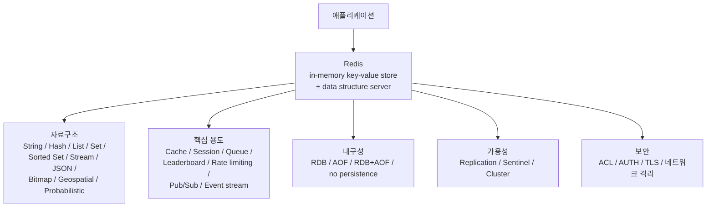
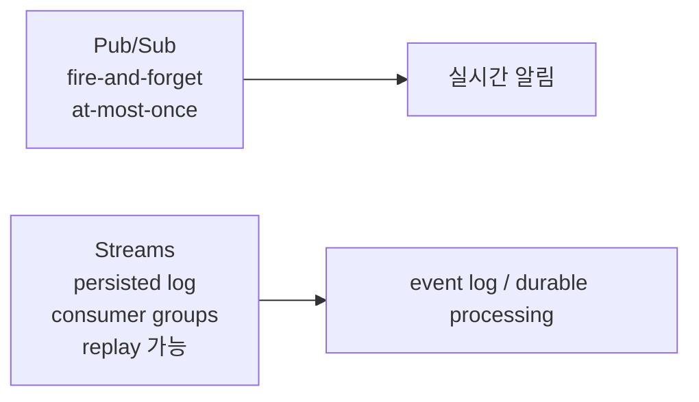

# Redis 상세 정리

작성 기준일: 2026-04-13  
주요 참고: `redis.io` 공식 문서

## 1. 한 줄 요약

`Redis`는 `메모리 기반 key-value 데이터 저장소`이면서, 동시에 `data structure server`, `cache`, `message broker`, `streaming engine`로 활용되는 매우 범용적인 시스템이다.

짧게 말하면:

- 단순 문자열 저장소가 아니라
- 다양한 자료구조를 메모리에 매우 빠르게 저장하고
- 원자적(atomic) 명령으로 조작하며
- 필요하면 persistence, replication, Sentinel, Cluster로 운영까지 확장할 수 있는 시스템

이다.

---

## 2. 먼저 큰 그림

아래 Mermaid는 Redis를 처음 이해할 때 가장 중요한 전체 구조를 압축해서 보여준다.

이 다이어그램에서 중요한 점은 Redis를 하나의 역할로만 이해하면 안 된다는 것이다.

- 캐시로만 봐도 부족하고
- DB로만 봐도 부족하고
- 큐로만 봐도 부족하다

Redis는 `빠른 메모리 저장소` 위에 `다양한 자료구조와 운영 기능`이 올라간 시스템이라고 보는 것이 가장 정확하다.

---

## 3. Redis는 무엇인가

공식 문서 기준 Redis는 보통 아래 식으로 설명된다.

- `in-memory data store`
- `data structure store`
- `NoSQL key/value store`
- `cache`
- `message broker`
- `streaming engine`

즉 Redis의 본질은 다음 두 문장으로 정리된다.

1. 데이터는 주로 메모리에 저장된다.
2. 값(value)이 단순 바이트 덩어리가 아니라 풍부한 자료구조일 수 있다.

### 3.1 단순 key-value store와의 차이

예를 들어 가장 단순한 key-value store는:

- key 하나
- value 하나

만 생각한다.

하지만 Redis는 value가 아래 중 하나가 될 수 있다.

- 문자열
- 해시
- 리스트
- 집합
- 정렬된 집합
- 스트림
- 비트맵
- 지리정보
- JSON
- 확률적 자료구조
- 타임시리즈

즉 Redis는 `값 하나`가 아니라 `값 내부 구조`를 서버가 이해하는 시스템이다.

이 차이가 매우 크다.

왜냐하면:

- 단순 저장만 하는 게 아니라
- 서버가 자료구조에 맞는 연산을 직접 제공하기 때문이다.

---

## 4. 왜 Redis가 빠른가

Redis가 빠른 가장 큰 이유는 `메모리 중심`이기 때문이다.

디스크 기반 DB는 보통:

- 디스크 I/O
- 페이지 캐시
- 인덱스 탐색
- 복잡한 query planner

등이 성능에 영향을 준다.

반면 Redis는:

- 메모리 상주
- 단순하고 예측 가능한 자료구조
- 작은 명령 단위
- event loop 기반 처리

구조라서 매우 낮은 지연시간을 보인다.

공식 설명도 Redis를 sub-millisecond response time으로 자주 소개한다.

### 4.1 그러나 "무조건 빠르다"는 오해는 금물

Redis는 빠르지만, 항상 자동으로 빠른 것은 아니다.

아래 경우 성능이 깨질 수 있다.

- 큰 key/value 설계
- 잘못된 자료구조 선택
- 과도한 전체 스캔
- 큰 Lua 스크립트
- replication backlog/네트워크 병목
- fork 기반 persistence 시 순간적인 지연
- 메모리 부족으로 인한 eviction pressure

즉 Redis의 성능은 "메모리에 있으니 무조건 빠름"이 아니라, `사용 패턴에 맞는 설계`가 있어야 제대로 나온다.

---

## 5. Redis를 왜 쓰는가

Redis는 보통 아래 이유 때문에 선택된다.

### 5.1 빠른 캐시

가장 흔한 이유다.

예:

- DB 조회 결과 캐싱
- API 응답 캐싱
- 템플릿 렌더 결과 캐싱
- 계산 결과 캐싱

### 5.2 세션 저장소

예:

- 로그인 세션
- 토큰
- 임시 인증 코드

TTL과 빠른 조회가 필요할 때 적합하다.

### 5.3 실시간 카운터

예:

- 조회수
- 좋아요 수
- API 요청 횟수
- rate limit

원자적 증가(`INCR`, `HINCRBY`)가 쉬워서 적합하다.

### 5.4 대기열 / 작업 큐

예:

- background job queue
- delayed task
- stream consumer group

### 5.5 리더보드 / 랭킹

`Sorted Set`이 매우 강력하다.

예:

- 게임 점수표
- 사용자 순위
- 인기 콘텐츠 정렬

### 5.6 실시간 이벤트 / 메시징

예:

- Pub/Sub
- Streams
- keyspace notification

### 5.7 document / vector / AI workload

공식 최신 문서는 Redis를:

- vector database
- document store
- semantic cache
- feature store

같은 용도로도 강하게 밀고 있다.

즉 Redis는 예전의 "캐시 전용 도구" 이미지를 넘어 훨씬 넓게 확장된 상태다.

---

## 6. Redis의 가장 중요한 특징: 자료구조 서버

Redis를 제대로 이해하려면 "자료구조 서버"라는 표현을 이해해야 한다.

이 말의 의미는:

- 서버가 값의 내부 형태를 알고 있고
- 그 구조에 맞는 연산을 제공한다

는 뜻이다.

예를 들어:

- String이면 `SET`, `GET`, `INCR`
- Hash면 `HSET`, `HGET`, `HINCRBY`
- List면 `LPUSH`, `RPUSH`, `LPOP`
- Set이면 `SADD`, `SISMEMBER`
- Sorted Set이면 `ZADD`, `ZRANGE`, `ZINCRBY`

즉 Redis는 값을 "직렬화된 blob"으로만 보지 않는다.

이 때문에 애플리케이션 코드가 할 일을 Redis 명령으로 많이 밀어 넣을 수 있다.

---

## 7. 핵심 자료구조

공식 `Redis data types` 문서 기준으로 Redis는 매우 많은 자료구조를 제공한다.

여기서는 가장 중요한 것들을 개념 위주로 정리한다.

### 7.1 String

가장 기본 타입이다.

용도:

- 단순 값 저장
- JSON 문자열 저장
- 토큰 저장
- 카운터

대표 명령:

- `SET`
- `GET`
- `INCR`
- `DECR`
- `APPEND`

특징:

- 가장 단순하고 빠름
- 숫자처럼 다룰 수도 있음

### 7.2 Hash

field-value 쌍의 모음이다.

용도:

- 사용자 프로필
- 상품 정보
- 작은 객체 저장

대표 명령:

- `HSET`
- `HGET`
- `HGETALL`
- `HINCRBY`

특징:

- 객체 하나를 key 하나 안에 묶어 저장하기 좋음
- user:1 같은 key 아래 name, age, role 등을 보관 가능

### 7.3 List

삽입 순서를 가진 문자열 리스트다.

용도:

- 큐
- 최근 로그
- 순서 있는 작업 목록

대표 명령:

- `LPUSH`
- `RPUSH`
- `LPOP`
- `RPOP`
- `LRANGE`

특징:

- queue/stack 패턴에 적합

### 7.4 Set

중복 없는 unordered collection이다.

용도:

- 태그 집합
- 사용자 집합
- membership check

대표 명령:

- `SADD`
- `SREM`
- `SMEMBERS`
- `SISMEMBER`
- `SUNION`
- `SINTER`

특징:

- 집합 연산이 강함

### 7.5 Sorted Set

각 member에 score가 붙는 정렬 집합이다.

용도:

- 리더보드
- 점수 기반 정렬
- 시간 기반 우선순위

대표 명령:

- `ZADD`
- `ZRANGE`
- `ZREVRANGE`
- `ZINCRBY`
- `ZSCORE`

특징:

- Redis에서 가장 실전성이 높은 타입 중 하나
- 랭킹/정렬 문제를 매우 우아하게 해결함

### 7.6 Stream

append-only log 같은 자료구조다.

공식 docs 표현 요지:

- append-only log처럼 동작하지만
- consumer group 등 더 복잡한 소비 전략을 지원

용도:

- event log
- event sourcing
- durable queue
- notification feed

대표 명령:

- `XADD`
- `XRANGE`
- `XREAD`
- `XREADGROUP`
- `XACK`

특징:

- Pub/Sub보다 내구성과 재처리 구조가 강함

### 7.7 Bitmap / Bitfield

비트 단위 저장/조작용이다.

용도:

- 출석 체크
- feature flag 비트맵
- 효율적인 boolean tracking

### 7.8 Geospatial

좌표 기반 저장과 검색을 지원한다.

용도:

- 반경 검색
- 근처 매장 찾기

### 7.9 JSON

공식 docs는 JSON도 Redis 데이터 타입으로 소개한다.

용도:

- 계층형 structured document 저장
- document-like access

### 7.10 Probabilistic Data Types

예:

- HyperLogLog
- Bloom filter
- Cuckoo filter
- Top-K
- Count-min sketch
- t-digest

용도:

- 근사치 통계
- 메모리 효율적인 대규모 추정

### 7.11 Vector set / Time series

최신 문서는 vector set과 time series도 중요한 타입으로 밀고 있다.

이건 Redis가 최근:

- AI / embedding
- monitoring / telemetry

영역까지 사용 범위를 넓히고 있음을 보여준다.

---

## 8. 자료구조를 고르는 사고방식

공식 `Compare data types` 문서의 취지는 단순하다.

- 값을 저장하려 하지 말고
- 문제 형태에 맞는 구조를 선택하라

예를 들어:

- 단일 값 -> `String`
- 작은 객체 -> `Hash`
- 순서 있는 큐 -> `List`
- 멤버십 체크 -> `Set`
- 순위/점수 -> `Sorted Set`
- durable event log -> `Stream`

즉 Redis를 잘 쓰는 핵심은 SQL처럼 "테이블 하나로 다 해결"이 아니라, 문제를 자료구조 문제로 바꾸는 능력이다.

---

## 9. Keyspace와 네이밍

Redis의 keyspace는 평평하다(flat).

즉:

- 디렉터리 계층이 있는 것이 아니라
- 문자열 key가 모두 한 공간에 놓인다

그래서 key naming convention이 매우 중요하다.

보통 다음처럼 짓는다.

- `user:123`
- `session:abc123`
- `order:2026:1001`
- `leaderboard:daily`

### 9.1 왜 네이밍이 중요한가

Redis는 schema를 강제하지 않기 때문에:

- key만 보고 의미를 추론해야 하고
- 관리, 삭제, 스캔, observability에도 key prefix가 중요하다

즉 key naming은 사실상 schema의 일부다.

---

## 10. TTL과 만료(expiration)

Redis의 매우 중요한 기능 중 하나는 `TTL`이다.

예:

- 캐시 만료
- 세션 만료
- OTP 만료
- rate limit window

를 매우 쉽게 구현할 수 있다.

대표 명령:

- `EXPIRE`
- `EXPIREAT`
- `TTL`
- `PTTL`

### 10.1 TTL의 장점

- 애플리케이션이 직접 cleanup 안 해도 됨
- 메모리 관리를 단순화
- 일시적 상태 모델링에 강함

### 10.2 주의점

만료 이벤트는 "이론상 0초 되는 순간"과 "실제 삭제 순간"이 다를 수 있다.

공식 keyspace notifications 문서도:

- expired event는 TTL이 0 되는 순간이 아니라
- 서버가 실제 키를 삭제할 때 발생한다고 설명한다

즉 expiration timing은 엄밀한 실시간 타이머로 생각하면 안 된다.

---

## 11. Redis는 어떻게 데이터를 잃지 않을 수 있는가: Persistence

Redis는 메모리 기반이지만 persistence를 지원한다.

공식 persistence 문서는 네 가지 옵션을 정리한다.

- `RDB`
- `AOF`
- `No persistence`
- `RDB + AOF`

### 11.1 RDB

스냅샷 방식이다.

특징:

- 특정 시점의 전체 데이터셋 snapshot 저장
- point-in-time snapshot

장점:

- 파일이 compact함
- 백업/복제에 좋음
- 복구가 빠를 수 있음

단점:

- 스냅샷 간격 사이 데이터 유실 가능
- fork 비용 존재

즉:

- "몇 분 단위 유실 감수 가능"

이면 잘 맞는다.

### 11.2 AOF

Append Only File 방식이다.

특징:

- write operation을 로그처럼 축적
- 재시작 시 replay해서 복구

장점:

- 더 높은 durability 가능
- 기본 `everysec` 정책이면 보통 최대 1초 유실 수준

단점:

- 파일 관리와 rewrite 필요
- 디스크 비용 증가

### 11.3 No persistence

정말 캐시 전용이라면 persistence를 끌 수도 있다.

이 경우 장점:

- 단순
- 디스크 쓰기 부담 감소

단점:

- 프로세스/호스트 장애 시 데이터 소실

### 11.4 RDB + AOF

둘 다 켤 수 있다.

장점:

- snapshot 장점 + 더 나은 durability 절충

단점:

- 운영 복잡도 증가

### 11.5 어떻게 고르나

아주 단순하게 보면:

- 그냥 캐시 -> no persistence 또는 가벼운 RDB
- 중요한 상태 저장 -> AOF 또는 RDB+AOF
- 빠른 restart/backup도 중요 -> RDB 병행

즉 persistence 전략은 Redis를 "캐시로 쓰는지", "시스템 오브 레코드에 가까운 상태 저장소로 쓰는지"에 따라 달라진다.

---

## 12. Replication

공식 replication 문서 기준 Redis는 `leader-follower`, 문서 표현으로는 `master-replica` 모델을 가진다.

핵심 요지:

- replica는 master의 복제본
- 연결이 끊겨도 재접속
- partial resynchronization 시도
- 비동기(async) replication

### 12.1 왜 replication을 쓰나

- read scaling
- 장애 대비
- 백업 노드
- failover 기반 마련

### 12.2 중요한 사실

공식 문서는 명확히 말한다.

- Redis replication은 `asynchronous replication`

이다.

즉:

- 쓰기 직후 장애가 나면
- replica가 아직 못 받은 데이터는 유실될 수 있다

### 12.3 WAIT 명령

문서는 `WAIT`가 유실 확률을 줄일 수 있다고 설명한다.

하지만:

- 완전한 강한 일관성 보장은 아니다

즉 Redis replication은 기본적으로 관계형 DB의 강한 commit semantics와는 다르게 이해해야 한다.

### 12.4 read-only replica

replica는 기본적으로 read-only 모드가 가능하다.

이는 read scaling에 유용하다.

---

## 13. Sentinel

공식 Sentinel 문서는 Redis Sentinel을 `high availability with Redis Sentinel`로 소개한다.

쉽게 말하면 Sentinel은:

- Redis 자체 데이터 저장 노드가 아니라
- 장애 감지와 failover orchestration 계층

이다.

### 13.1 Sentinel의 역할

- master 장애 감지
- replica 중 새 master 선출
- 클라이언트가 새 master를 찾게 도움

### 13.2 Sentinel이 필요한 이유

replication만 있으면 복제는 되지만:

- master 죽었을 때 누가 승격될지
- 클라이언트가 어디로 붙어야 할지

문제가 남는다.

Sentinel은 이 운영 문제를 해결한다.

### 13.3 Sentinel의 한계

Sentinel은:

- sharding을 해결하는 것이 아니고
- 고가용성 failover를 위한 계층

이다.

즉:

- HA가 필요하면 Sentinel
- horizontal scale이 필요하면 Cluster

로 먼저 구분하면 이해하기 쉽다.

---

## 14. Cluster

공식 `Scale with Redis Cluster` 문서는 Redis Cluster를 `horizontal scaling` 방식으로 설명한다.

핵심:

- 데이터를 여러 노드에 자동 sharding
- 일부 장애 시 계속 동작 가능

### 14.1 Cluster의 핵심 개념

Redis Cluster는 `16384 hash slots`를 사용한다.

즉:

- 키는 해시되어 slot으로 매핑
- 각 노드는 slot 일부를 담당

이 구조로 shard 분산을 한다.

### 14.2 왜 중요한가

이 구조 덕분에:

- 노드 추가/제거
- slot 이동
- resharding

이 가능해진다.

### 14.3 최소 구성

공식 문서 기준 production에서는 보통:

- 최소 3 master
- 권장 6 node (3 master + 3 replica)

를 추천한다.

### 14.4 Multi-key 제약

Cluster는 여러 key를 한 번에 다룰 때 제한이 있다.

왜냐하면:

- 서로 다른 slot의 key는 서로 다른 노드에 있을 수 있기 때문이다

그래서 Redis Cluster는 `hash tags`를 통해 관련 key를 같은 slot에 묶는 기능을 제공한다.

예:

- `user:{123}:profile`
- `user:{123}:account`

는 같은 해시 태그를 공유하므로 같은 slot에 들어간다.

### 14.5 Cluster와 Sentinel 차이

간단 비교:

- Sentinel: failover 중심
- Cluster: sharding + 일부 HA

둘은 같은 것이 아니다.

---

## 15. Transaction

공식 transaction 문서 기준 Redis transaction은:

- `MULTI`
- `EXEC`
- `DISCARD`
- `WATCH`

를 중심으로 동작한다.

### 15.1 Redis transaction의 의미

Redis transaction은 일반적인 관계형 DB transaction과 동일하게 보면 안 된다.

공식 문서가 강조하는 핵심 보장은:

- transaction 안 명령은 순차적으로 직렬 실행된다
- 중간에 다른 클라이언트 명령이 끼어들지 않는다

즉 isolation 측면의 단순한 원자적 실행에 가깝다.

### 15.2 WATCH

`WATCH`는 optimistic locking에 가깝다.

즉:

- 특정 key 변경 여부를 감시
- 기대하던 상태가 아니면 `EXEC` 실패

패턴을 만든다.

### 15.3 오해하면 안 되는 점

Redis transaction은:

- SQL DB의 full ACID transaction을 그대로 기대하는 도구가 아니다

대신:

- 짧은 원자적 묶음
- optimistic concurrency control

에 적합하다.

---

## 16. Pipelining

공식 pipelining 문서는 Redis 성능 최적화에서 매우 중요하다.

Pipelining은:

- 각 명령의 응답을 기다리지 않고
- 여러 명령을 한 번에 보내
- RTT(round-trip time) 비용을 줄이는 기법

이다.

### 16.1 언제 효과적인가

- 네트워크 RTT가 무시 못 할 때
- 작은 명령을 많이 보낼 때
- bulk update/read에서

효과가 크다.

### 16.2 transaction과의 차이

이건 많이 헷갈린다.

- transaction: 실행 묶음과 격리 의미
- pipeline: 네트워크 왕복 최적화 의미

즉 둘은 목적이 다르다.

---

## 17. Pub/Sub

공식 Pub/Sub 문서 기준 Redis Pub/Sub는 전형적인 publish/subscribe 메시징이다.

핵심:

- publisher는 subscriber를 모름
- subscriber는 관심 채널을 구독
- 메시지는 채널 기반으로 전달

### 17.1 장점

- 단순
- 빠름
- 실시간 알림에 적합

### 17.2 가장 중요한 한계

공식 문서가 명확히 설명한다.

- Redis Pub/Sub는 `at-most-once` delivery semantics

즉:

- 메시지는 오면 한 번 전달될 수 있지만
- subscriber가 끊겨 있으면 영영 잃어버릴 수 있다

### 17.3 언제 쓰면 좋나

- 일시적 실시간 알림
- 온라인 구독자만 중요
- durable replay 불필요

### 17.4 언제 Streams가 더 낫나

- 메시지를 저장해야 할 때
- consumer group 필요할 때
- 재처리/ack가 필요할 때

---

## 18. Streams

공식 Streams 문서는 Stream을:

- append-only log
- consumer groups 지원
- random access
- real-time event recording and syndication

로 설명한다.

### 18.1 Pub/Sub와의 핵심 차이

즉:

- Pub/Sub는 휘발성 실시간 메시지
- Streams는 저장되는 이벤트 로그

에 더 가깝다.

### 18.2 Streams가 좋은 경우

- 이벤트 처리
- 작업 큐
- 소비자 그룹
- read model 갱신
- 이벤트 소싱

### 18.3 주의점

Streams는 강력하지만:

- 길이 관리(trim)
- consumer lag
- pending entries
- retry / ack 전략

을 운영적으로 신경 써야 한다.

---

## 19. Keyspace notifications

공식 문서 기준 keyspace notifications는:

- key 변경 이벤트를 Pub/Sub 채널로 발행

하는 기능이다.

예:

- 어떤 key가 삭제됨
- 어떤 key가 만료됨
- 특정 명령이 수행됨

### 19.1 언제 유용한가

- 디버깅
- 캐시 invalidate 감지
- 내부 event trigger

### 19.2 주의점

공식 문서도 말하듯:

- CPU 비용 있음
- expired event timing이 완벽히 즉시 보장되지 않음
- cluster에서는 node-specific임

즉 production 핵심 신뢰 경로로 쓰기보다, 보조 신호로 생각하는 게 안전하다.

---

## 20. Eviction

Redis를 캐시로 쓸 때 중요한 개념이다.

공식 eviction 문서 기준:

- `maxmemory` 제한 설정
- 초과 시 policy에 따라 자동 eviction

대표 정책:

- `noeviction`
- `allkeys-lru`
- `allkeys-lfu`
- `allkeys-random`
- `volatile-*`

### 20.1 왜 중요한가

Redis는 메모리 기반이기 때문에:

- 메모리 한계 설계
- 어떤 key를 버릴지

를 명시적으로 생각해야 한다.

### 20.2 어떤 상황에 무엇을 쓰나

단순 감으로 보면:

- 진짜 캐시 -> `allkeys-lru` 또는 `allkeys-lfu`
- TTL 있는 캐시만 버리고 싶다 -> `volatile-*`
- 절대 버리면 안 되는 store -> `noeviction`

즉 Redis를 캐시로 쓰느냐, primary-ish store로 쓰느냐에 따라 eviction policy가 달라진다.

---

## 21. 보안

공식 보안 문서의 가장 중요한 한 줄은 이거다.

- Redis는 trusted environment 안의 trusted client를 전제로 설계되었다.

즉 Redis를 인터넷에 그냥 노출하는 건 좋지 않다.

### 21.1 기본 보안 원칙

- 직접 public internet에 노출하지 말 것
- 네트워크로 먼저 막을 것
- 인증/권한제어를 켤 것
- TLS 필요 시 적용할 것

### 21.2 ACL

Redis는 ACL을 지원한다.

즉:

- 특정 사용자
- 특정 command category
- 특정 key pattern
- 특정 Pub/Sub channel

에 대해 허용/차단을 설정할 수 있다.

### 21.3 AUTH만 믿으면 안 되는 이유

Redis는 원래 내부 trusted network 전제였기 때문에:

- 단순 비밀번호 하나로 public exposure를 정당화하면 안 된다

즉 보안의 우선순위는:

1. 네트워크 격리
2. 방화벽/VPC/private subnet
3. ACL/AUTH
4. TLS

순으로 보는 게 맞다.

### 21.4 명령 보안

보안 문서가 다루는 또 다른 주제:

- 외부 입력으로 위험한 명령을 유도하는 문제
- module/Lua/command surface 남용

즉 Redis는 "메모리 캐시"라서 안전한 것이 아니라, 잘못 열면 강한 내부 권한을 가진 데이터 서비스가 된다.

---

## 22. Redis를 데이터베이스로 봐야 하나, 캐시로 봐야 하나

정답은 `둘 다 가능하지만, 사용 맥락을 분리해서 봐야 한다`이다.

### 22.1 캐시로 볼 때

적합:

- 원본 데이터는 다른 DB에 있음
- Redis는 성능 가속 계층
- 일부 데이터 유실이 치명적이지 않음

### 22.2 운영 DB처럼 볼 때

적합:

- 빠른 상태 저장
- counter/state/session
- durability와 HA를 같이 설계

주의:

- persistence
- backup
- replication lag
- failover semantics

를 명확히 이해해야 한다.

즉 "Redis는 캐시지"라고 단정하는 것도 틀리고, "Redis를 RDBMS처럼 써도 돼"라고 쉽게 말하는 것도 위험하다.

---

## 23. Redis가 잘 맞는 문제와 안 맞는 문제

### 23.1 잘 맞는 문제

- 캐시
- 세션 저장
- 리더보드
- rate limiting
- token bucket
- 작업 큐
- 실시간 알림
- 짧은 지연시간이 중요한 상태 저장
- feature store / semantic cache / vector lookup

### 23.2 덜 맞는 문제

- 복잡한 관계형 조인 중심 워크로드
- 강한 ACID transaction이 핵심인 업무 시스템
- 거대한 cold dataset 위주의 cheap storage
- 임의 ad-hoc analytical query

즉 Redis는 "모든 DB를 대체하는 범용 정답"이 아니라, 특정 성능/구조 문제에 매우 강한 도구다.

---

## 24. Redis를 잘못 쓰는 대표 패턴

### 24.1 모든 값을 무조건 String으로만 저장

문제:

- Redis 자료구조 장점을 버린다

### 24.2 key 설계가 엉망

문제:

- 운영/정리/디버깅이 어려워진다

### 24.3 persistence 전략 없이 중요한 데이터 저장

문제:

- 장애 시 데이터 유실

### 24.4 duplicate-safe하지 않은 queue 설계

문제:

- 재처리/실패 시 데이터 불일치

### 24.5 Cluster에서 multi-key 제약 무시

문제:

- CROSSSLOT 에러

### 24.6 Redis를 인터넷에 그대로 노출

문제:

- 보안 사고 가능성

---

## 25. Redis를 처음 배울 때 추천 순서

처음 Redis를 공부한다면 아래 순서가 좋다.

### 1단계

- String
- Hash
- List
- Set
- Sorted Set

### 2단계

- TTL
- eviction
- persistence

### 3단계

- transactions
- pipelining
- Pub/Sub
- Streams

### 4단계

- replication
- Sentinel
- Cluster
- ACL/security

### 5단계

- 실제 use case 설계
- 캐시 전략
- queue 설계
- distributed coordination 패턴

이 순서가 좋은 이유는:

- 먼저 자료구조를 이해해야
- 나중 운영 개념이 자연스럽게 붙기 때문이다.

---

## 26. 한 문장으로 다시 요약

`Redis`는 "메모리 위에서 다양한 자료구조를 매우 빠르게 다루고, 필요하면 persistence/replication/cluster까지 확장할 수 있는 범용 데이터 시스템"이다.

즉:

- 캐시이기도 하고
- 상태 저장소이기도 하고
- 메시징/이벤트 시스템이기도 하다

하지만 그만큼:

- 자료구조 선택
- persistence 전략
- HA 구성
- 보안 경계

를 정확히 설계해야 제대로 쓸 수 있다.

---

## 27. 참고 링크

- Redis 소개: [Introduction to Redis](https://redis.io/about/)
- Redis Open Source 시작 가이드: [Open Source](https://redis.io/docs/latest/get-started/)
- Develop with Redis: [Develop with Redis](https://redis.io/docs/latest/develop/)
- Redis 데이터 타입 개요: [Redis data types](https://redis.io/docs/latest/develop/data-types/)
- 데이터 타입 비교: [Compare data types](https://redis.io/docs/latest/develop/data-types/compare-data-types/)
- Persistence: [Redis persistence](https://redis.io/docs/latest/operate/oss_and_stack/management/persistence/)
- Replication: [Redis replication](https://redis.io/docs/latest/operate/oss_and_stack/management/replication/)
- Sentinel: [High availability with Redis Sentinel](https://redis.io/docs/latest/operate/oss_and_stack/management/sentinel/)
- Cluster: [Scale with Redis Cluster](https://redis.io/docs/latest/operate/oss_and_stack/management/scaling/)
- Transactions: [Transactions](https://redis.io/docs/latest/develop/using-commands/transactions/)
- Pipelining: [Redis pipelining](https://redis.io/docs/latest/develop/using-commands/pipelining/)
- Pub/Sub: [Redis Pub/Sub](https://redis.io/docs/latest/develop/pubsub/)
- Streams: [Redis Streams](https://redis.io/docs/latest/develop/data-types/streams/)
- Keyspace notifications: [Redis keyspace notifications](https://redis.io/docs/latest/develop/pubsub/keyspace-notifications/)
- Eviction: [Key eviction](https://redis.io/docs/latest/develop/reference/eviction/)
- Security: [Redis security](https://redis.io/docs/latest/operate/oss_and_stack/management/security/)

<!-- study-links:start -->
## 관련 문서

- `acid`: [[ACID-트랜잭션/ACID-트랜잭션|ACID 트랜잭션 상세 정리]]
- `sql`: [[sql-query/sql-query|반드시 알아둬야 할 SQL 쿼리 정리]]
- `해시`: [[정보처리기사/5과목 정보시스템 구축 관리/304 해시(Hash)/304 해시(Hash)|304 해시(Hash)]]
<!-- study-links:end -->
