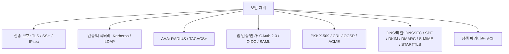

# 보안 프로토콜과 관련 메커니즘 정리

작성 기준일: 2026-04-15  
조사 방식: 웹검색 기반 최신 조사  
주요 참고: `rfc-editor.org` RFC, `csrc.nist.gov` NIST Glossary, `openid.net`, `docs.oasis-open.org`

## 1. 문서 목적

이 문서는 실무에서 자주 접하는 보안 프로토콜과, 자주 함께 묶여 이야기되지만 엄밀히는 프로토콜이 아닌 보안 메커니즘까지 한 흐름으로 정리한 학습 문서다.

사용자가 흔히 묻는 질문은 보통 이런 식이다.

- SSL과 TLS는 무엇이 다른가
- HTTPS와 mTLS는 TLS와 어떤 관계인가
- SSH는 왜 서버 접속에 쓰고, TLS는 왜 웹에 쓰는가
- ACL은 프로토콜인가
- OAuth 2.0은 인증인가 인가인가
- OIDC와 SAML은 언제 쓰는가
- LDAP, Kerberos, RADIUS, TACACS+는 각자 무슨 역할을 하는가
- DNSSEC, SPF, DKIM, DMARC, S/MIME은 모두 메일/도메인 보안인데 무엇이 다른가

즉 이 문서는 "프로토콜 이름 암기"가 아니라:

- 무엇을 보호하는지
- 어느 계층에서 동작하는지
- 무엇을 대신할 수 있고 무엇은 대신할 수 없는지
- 무엇이 이미 레거시인지

를 분명하게 정리하는 데 목적이 있다.

---

## 2. 먼저 한 줄 요약

보안 프로토콜은 모두 같은 일을 하지 않는다.

대체로 아래처럼 나뉜다.

- `전송 보호`: TLS, SSH, IPsec
- `원격 관리/네트워크 AAA`: RADIUS, TACACS+
- `디렉터리/인증`: LDAP, Kerberos
- `웹 인증/인가 연동`: OAuth 2.0, OpenID Connect, SAML
- `인증서/PKI`: X.509, CRL, OCSP, ACME
- `DNS/메일 보호`: DNSSEC, SPF, DKIM, DMARC, S/MIME, STARTTLS
- `접근 제어 메커니즘`: ACL

즉 "보안"이라는 공통 분모만 있을 뿐:

- 어떤 것은 기밀성 보호
- 어떤 것은 무결성/출처 인증
- 어떤 것은 인증서 상태 확인
- 어떤 것은 접근 권한 모델

이라는 점에서 역할이 다르다.

---

## 3. 범위와 분류 기준

### 3.1 이 문서에서 다루는 범위

이 문서는 "실무에서 일반적으로 자주 마주치는 대표 보안 프로토콜과 인접 메커니즘"을 다룬다.

즉:

- 웹 서비스
- 서버 운영
- 기업 인증/연동
- 네트워크 장비 관리
- 이메일 보안
- PKI 운영

에서 자주 접하는 것들을 중심으로 정리한다.

모든 산업/통신/ICS/전용망 프로토콜을 완전히 포괄하는 문서는 아니다.

### 3.2 분류 기준

각 항목은 아래 관점으로 본다.

- 이게 진짜 "프로토콜"인가, 아니면 "메커니즘/프레임워크"인가
- 보호 목표는 무엇인가
- 보통 어디에 쓰이는가
- 무엇과 자주 헷갈리는가
- 2026년 기준 실무 권장은 무엇인가

---

## 4. 먼저 바로잡아야 할 것

### 4.1 ACL은 프로토콜이 아니다

NIST Glossary는 ACL을 "리소스에 접근할 수 있는 엔티티와 그 권한을 나열해 접근 제어를 구현하는 메커니즘"으로 설명한다.

즉 ACL은:

- 네트워크를 통해 메시지를 주고받는 protocol이 아니라
- 접근 권한을 기록/평가하는 authorization mechanism

이다.

따라서 `SSL`, `TLS`, `SSH`와 같은 층의 개념이 아니다.

### 4.2 HTTPS는 TLS와 분리된 새 암호 프로토콜이 아니다

`HTTPS`는 보통 `HTTP over TLS`를 뜻한다.

즉:

- 애플리케이션 프로토콜은 HTTP
- 전송 보안은 TLS

라고 이해하는 편이 맞다.

### 4.3 mTLS도 별도 프로토콜이라기보다 TLS 운용 방식이다

`mTLS(mutual TLS)`는 서버만 인증하는 일반 TLS와 달리, 클라이언트 인증서까지 요구하는 TLS 배치 방식이다.

즉 새로운 기반 프로토콜이라기보다:

- TLS를 어떻게 배포하고 검증할지에 대한 운영 패턴

에 가깝다.

### 4.4 OAuth 2.0은 "인증 프로토콜"이 아니다

RFC 6749는 OAuth 2.0을 authorization framework라고 설명한다.

즉 OAuth 2.0의 중심 질문은:

- "이 사용자가 누구인가"

가 아니라,

- "이 클라이언트에게 이 리소스에 대한 제한된 접근 권한을 줄 것인가"

이다.

인증은 보통 OpenID Connect가 담당한다.

---

## 5. 대표 항목 빠른 표

| 항목 | 성격 | 주 역할 | 실무 한 줄 |
|---|---|---|---|
| SSL | 레거시 전송 보안 | 과거 웹/전송 암호화 | 지금은 사용 금지 대상으로 이해 |
| TLS | 전송 보안 프로토콜 | 기밀성, 무결성, 서버/선택적 클라이언트 인증 | 웹/앱 전송 보안의 표준 |
| HTTPS | HTTP + TLS | 웹 트래픽 보호 | 사실상 웹 기본값 |
| mTLS | TLS 운용 방식 | 양방향 인증 | 서비스 간 통신, B2B, Zero Trust |
| SSH | 원격 관리 프로토콜군 | 원격 로그인, 터널링, 파일 전송 | 서버 운영의 기본 |
| IPsec/IKE | 네트워크 계층 보안 | IP 레벨 암호화/인증/VPN | 사이트 간 VPN, 네트워크 보호 |
| Kerberos | 인증 프로토콜 | 티켓 기반 상호 인증 | AD/기업망 핵심 |
| LDAP/LDAPS | 디렉터리 접근 프로토콜 | 사용자/그룹/정책 조회 | 기업 디렉터리 연동 |
| RADIUS | AAA 프로토콜 | 네트워크 접속 인증/인가/설정 | Wi-Fi/VPN/NAS |
| TACACS+ | AAA 프로토콜군 | 장비 관리용 AAA | 네트워크 장비 admin |
| OAuth 2.0 | 인가 프레임워크 | 위임된 접근 권한 | API access delegation |
| OIDC | 인증 레이어 | 사용자 인증 + 프로필 claims | 로그인/SSO |
| SAML 2.0 | 연합 인증/어설션 표준 | 브라우저 기반 기업 SSO | 엔터프라이즈 SSO |
| X.509 | 인증서 프로파일 | 공개키 인증서 형식/검증 체계 | TLS/PKI 기반 |
| CRL | 인증서 폐지 목록 | 폐지된 인증서 배포 | 오래된 but still relevant |
| OCSP | 인증서 상태 조회 프로토콜 | 인증서 실시간 상태 확인 | CRL보다 빠른 확인 용도 |
| ACME | 인증서 자동화 프로토콜 | 도메인 검증/인증서 발급 자동화 | Let's Encrypt 류 자동화 |
| DNSSEC | DNS 보안 확장 | DNS 데이터 출처 인증/무결성 | DNS 위변조 방지 |
| SPF | 메일 송신 도메인 권한 검증 | 어떤 서버가 메일 보내도 되는지 | 메일 위조 완화 |
| DKIM | 메일 도메인 서명 | 메시지 무결성/도메인 책임성 | 메일 신뢰성 향상 |
| DMARC | 메일 정책/정렬/리포트 | SPF+DKIM 결과 정책 적용 | 도메인 spoofing 대응 |
| S/MIME | 메일 보안 표준 | 메일 서명/암호화 | 기업 메일 end-to-end 보호 |
| STARTTLS | 기존 평문 프로토콜의 TLS 업그레이드 | SMTP/IMAP/POP3 연결 보호 | hop-to-hop 보호에 자주 사용 |
| ACL | 접근 제어 메커니즘 | 리소스별 허용 목록 관리 | 프로토콜이 아님 |

---

## 6. SSL과 TLS

### 6.1 SSL은 무엇이었나

`SSL(Secure Sockets Layer)`은 TLS 이전 세대의 보안 프로토콜 계열이다.

실무에서는 아직도:

- "SSL 인증서"
- "SSL 적용"

같은 표현이 남아 있지만, 엄밀히는 현재 쓰는 것은 대부분 TLS다.

### 6.2 TLS는 무엇인가

RFC 8446은 TLS 1.3을 client/server application들이 인터넷에서 eavesdropping, tampering, message forgery를 막기 위한 프로토콜이라고 설명한다.

즉 TLS의 핵심 목표는:

- 기밀성(confidentiality)
- 무결성(integrity)
- 인증(authentication)

이다.

### 6.3 TLS가 제공하는 것

RFC 8446의 서술을 실무 관점으로 요약하면:

- 서버 인증은 기본
- 클라이언트 인증은 선택적
- 연결 후 데이터는 암호화됨
- 중간 변조를 감지함

즉 오늘날 웹과 많은 애플리케이션 프로토콜의 전송 보호 기본층이다.

### 6.4 TLS 1.3이 중요한 이유

RFC 8446은 TLS 1.3을 TLS 1.2 이후의 현재 표준으로 정의한다.

실무적으로 TLS 1.3이 중요한 이유:

- 핸드셰이크 단순화
- 더 현대적인 암호 suite 중심
- 오래된 취약한 옵션 정리

즉 "가능하면 TLS 1.3, 최소한 안전하게 설정된 TLS 1.2"가 현재 감각이다.

### 6.5 TLS 1.0 / 1.1은 왜 안 되나

RFC 8996은 TLS 1.0과 1.1을 공식적으로 deprecated로 옮겼다고 설명한다.

핵심 이유:

- 오래된 cipher suite 의존
- AEAD 같은 현대적 암호 보호 부족
- 공격면과 운영 복잡도 증가

즉:

- `SSL`
- `TLS 1.0`
- `TLS 1.1`

은 학습용 역사 지식으로는 알아도, 새 시스템에서 목표로 삼으면 안 된다.

### 6.6 HTTPS와 TLS의 관계

HTTPS는 "TLS 위에서 동작하는 HTTP"라고 이해하면 된다.

즉:

- TLS가 transport protection
- HTTP가 application protocol

이다.

실무에서는 "HTTPS 적용"이라고 말하지만, 실제 핵심은 TLS 구성, 인증서 검증, hostname 검증, cipher suite 정책에 있다.

### 6.7 mTLS

mTLS는:

- 서버도 인증하고
- 클라이언트도 인증서로 인증

하는 TLS 배치 방식이다.

주로:

- 서비스 간 통신
- 내부 API
- B2B 파트너 연결
- Zero Trust 네트워크

에서 쓴다.

장점:

- 양방향 신원 확인
- 비밀번호 대신 인증서 기반 신뢰

주의점:

- 인증서 발급/폐기/회전 운영이 어려움
- 앱 사용자 로그인과는 다른 층의 문제

즉 mTLS는 강력하지만 운영 부담이 큰 편이다.

---

## 7. SSH

### 7.1 정체

RFC 4251은 SSH를 insecure network 위에서 secure remote login과 other secure network services를 제공하는 프로토콜이라고 설명한다.

즉 SSH는:

- 원격 로그인
- 명령 실행
- 터널링
- 파일 전송(SCP/SFTP 계열)

에 쓰인다.

### 7.2 SSH 구조

RFC 4251은 SSH가 세 개의 주요 구성 요소를 가진다고 설명한다.

- Transport Layer Protocol
- User Authentication Protocol
- Connection Protocol

즉 SSH는 하나의 단순 암호 채널이 아니라:

- 암호화된 터널을 만들고
- 사용자 인증을 하고
- 그 안에서 여러 logical channel을 다룰 수 있는 프로토콜군

에 가깝다.

### 7.3 SSH가 제공하는 것

RFC 4251 기준 핵심:

- server authentication
- confidentiality
- integrity
- perfect forward secrecy

즉 서버 운영에서 "안전한 관리자 접속"의 기본 도구다.

### 7.4 SSH 인증

RFC 4252는 SSH authentication protocol이:

- public key
- password
- host-based

같은 인증 방식을 제공한다고 설명한다.

실무적으로는:

- 패스워드보다 공개키 인증을 선호
- 루트 직접 로그인 금지
- 키 회전과 권한 분리

가 흔한 운영 원칙이다.

### 7.5 TLS와 SSH 차이

둘 다 암호화된 채널을 만들지만 목적이 다르다.

- TLS: 주로 client-server application traffic 보호
- SSH: 주로 관리자 접속/원격 shell/터널링

즉 둘은 경쟁 관계가 아니라 용도가 다른 도구다.

---

## 8. IPsec와 IKE

### 8.1 정체

RFC 4301은 IPsec을 Security Architecture for the Internet Protocol이라고 설명한다.

즉 IP 계층에서 트래픽을 보호하는 구조다.

### 8.2 왜 중요한가

TLS가 대개 애플리케이션 계층 위에서 "특정 연결"을 보호한다면, IPsec은 네트워크 계층에서 더 광범위한 트래픽을 보호할 수 있다.

주로:

- site-to-site VPN
- host-to-host VPN
- 네트워크 구간 보호

에 쓰인다.

### 8.3 핵심 감각

IPsec은 보통:

- 패킷을 암호화/인증하는 데이터 보호
- 키 교환(IKE 계열)

을 함께 생각해야 한다.

즉 실무에서 "IPsec"을 말할 때는 종종 "IKE로 키를 협상하고, ESP/AH로 트래픽을 보호하는 체계" 전체를 말하는 경우가 많다.

### 8.4 TLS와 차이

- TLS: 애플리케이션 연결 단위 보호
- IPsec: 네트워크 계층 단위 보호

즉 VPN 게이트웨이, 지사 간 터널링은 IPsec이 자연스럽고, 브라우저-서버 웹 연결은 TLS가 자연스럽다.

---

## 9. Kerberos

### 9.1 정체

RFC 4120은 Kerberos V5를 network authentication service라고 설명한다.

즉 Kerberos는 티켓 기반 인증 프로토콜이다.

### 9.2 왜 중요한가

기업 내부망, 특히 Active Directory 환경에서 Kerberos는 핵심이다.

주된 역할:

- 사용자가 한 번 인증하면
- 티켓을 통해 여러 서비스에 재사용 가능한 신뢰 전달

즉 중앙 KDC를 기반으로 한 조직형 인증 체계다.

### 9.3 핵심 개념

세부 프로토콜을 다 외울 필요는 없지만, 아래 감각은 중요하다.

- 비밀번호를 매번 서비스에 직접 보내지 않음
- 티켓을 기반으로 서비스 접근
- 상호 인증(mutual authentication) 가능

### 9.4 언제 자주 보나

- AD 도메인 로그인
- Windows 기업망 SSO
- 일부 Hadoop / 내부 서비스 인증

즉 인터넷 공개 서비스보다 기업 내부 인프라에서 훨씬 자주 본다.

### 9.5 OAuth/OIDC와 차이

- Kerberos: 조직 내부/도메인 기반 티켓 인증
- OAuth/OIDC: 웹/모바일/API 기반 외부/내부 서비스 연동

즉 같은 인증처럼 보여도 주 무대가 다르다.

---

## 10. LDAP와 LDAPS

### 10.1 LDAP란

RFC 4511은 LDAP를 distributed directory services에 접근하기 위한 protocol이라고 설명한다.

즉 LDAP는:

- 사용자
- 그룹
- 조직 단위
- 속성(attribute)

같은 디렉터리 정보를 조회/관리하는 프로토콜이다.

### 10.2 무엇에 쓰나

실무에서는 보통:

- 사내 계정 조회
- 그룹 멤버십 조회
- 조직도/속성 조회
- 인증 연동의 사용자 저장소

용도로 많이 쓴다.

### 10.3 LDAP와 Kerberos의 관계

기업 환경, 특히 AD에서는 둘이 자주 같이 등장한다.

- Kerberos: 인증
- LDAP: 디렉터리 조회와 정책/속성

즉 둘은 대체 관계가 아니라 상호보완적이다.

### 10.4 LDAPS와 StartTLS

실무적으로는 LDAP를 평문으로 쓰면 안 된다.

보통:

- `LDAPS`라고 부르는 LDAP over TLS/SSL
- 또는 LDAP StartTLS

를 사용한다.

즉 "LDAP"는 디렉터리 프로토콜이고, 전송 보안은 TLS 계열이 덧입혀진다고 이해하면 된다.

### 10.5 주의점

LDAP는 인증 프로토콜처럼 오해되기도 하지만, 본질은 디렉터리 접근 프로토콜이다.

즉:

- "누군가가 누구인지 인증"
- "그 사용자의 속성과 그룹을 조회"

를 분리해서 이해해야 한다.

---

## 11. RADIUS와 TACACS+

### 11.1 RADIUS

RFC 2865는 RADIUS를 Network Access Server와 shared Authentication Server 사이에서 authentication, authorization, configuration information을 전달하는 프로토콜이라고 설명한다.

즉 RADIUS는 전형적인 AAA(Authentication, Authorization, Accounting) 프로토콜 계열이다.

### 11.2 어디에 쓰나

주로:

- Wi-Fi 802.1X
- VPN 접속
- NAS / 네트워크 접속 제어

환경에서 많이 본다.

### 11.3 특징

RFC 2865는 공식 포트 1812를 언급하며, shared secret 기반 보호 모델을 설명한다.

즉 역사적으로 매우 널리 쓰였지만, 현대 관점에서는 추가 보호와 배치 방식까지 함께 봐야 한다.

### 11.4 TACACS+

RFC 8907은 TACACS+가 widely deployed today for device administration이라고 설명한다.

즉 TACACS+는:

- 라우터
- 스위치
- 네트워크 장비

관리용 AAA에서 매우 흔하다.

### 11.5 RADIUS와 TACACS+ 차이

실무 감각으로 요약하면:

- RADIUS: 네트워크 접속 인증/인가에 강함
- TACACS+: 장비 관리와 명령 단위 authorization/auditing에 강함

RFC 8907도 TACACS+가 device administration use case에 특히 맞다고 설명한다.

즉 둘 다 AAA지만 주 사용처가 다르다.

---

## 12. OAuth 2.0

### 12.1 정체

RFC 6749는 OAuth 2.0을 authorization framework라고 설명한다.

즉 OAuth 2.0의 목적은:

- 클라이언트가
- 리소스 소유자의 비밀번호를 직접 갖지 않고
- 제한된 권한(access token)을 받아
- 보호된 자원에 접근하게 하는 것

이다.

### 12.2 왜 나왔나

RFC 6749는 전통적인 모델의 문제를 지적한다.

- 제3자 앱에 사용자 비밀번호를 넘겨야 함
- 권한 범위가 과도함
- 개별 앱 권한 회수가 어려움

OAuth는 access token이라는 추상화를 통해 이를 해결한다.

### 12.3 핵심 감각

OAuth 2.0에서 중요한 것은:

- authorization server
- resource server
- client
- resource owner
- access token
- scope

다.

즉 "로그인" 자체보다 "권한 위임"이 핵심이다.

### 12.4 중요한 실무 포인트

OAuth 2.0은 인증(authentication) 자체를 정의하는 프로토콜이 아니다.

즉:

- "이 사용자가 누구인가"

는 별도 계층이 필요하고, 그게 보통 OIDC다.

### 12.5 어디에 쓰나

- 소셜 로그인 뒤의 API 권한 부여
- 제3자 앱 연동
- API gateway 토큰 기반 접근
- 마이크로서비스 인가 토큰 흐름

---

## 13. OpenID Connect (OIDC)

### 13.1 정체

OpenID Connect Core 1.0은 OIDC를 OAuth 2.0 위의 simple identity layer라고 설명한다.

즉 OIDC는:

- OAuth 2.0의 인가 흐름 위에
- 사용자 인증 정보와 claims를 추가한 것

이다.

### 13.2 OAuth와 차이

이 차이는 실무에서 매우 중요하다.

- OAuth 2.0: 권한 위임
- OIDC: 인증 + 기본 프로필 정보

즉 "로그인" 기능을 제대로 하려면 보통 OIDC가 필요하다.

### 13.3 핵심 구성

OIDC를 이해할 때 중요한 단어:

- ID Token
- Claims
- OpenID Provider(OP)
- Relying Party(RP)
- UserInfo endpoint

즉 OIDC는 단순히 access token 하나 더 주는 게 아니라, 인증 결과를 표준 claims 형태로 전달하는 체계다.

### 13.4 어디에 쓰나

- 웹/모바일 로그인
- 사내/외부 IdP 연동
- 소셜 로그인 표준화
- SaaS SSO

### 13.5 요약

실무 감각으로는:

- API 권한만 필요 -> OAuth 2.0
- 로그인/사용자 식별까지 필요 -> OIDC

라고 정리하면 된다.

---

## 14. SAML 2.0

### 14.1 정체

OASIS SAML 2.0 Core는 SAML을 security assertions 기반 연동 표준으로 다룬다.

즉 SAML은:

- 인증 결과
- 속성 정보
- 권한 관련 어설션

을 신뢰 관계에 따라 교환하는 프레임워크다.

### 14.2 어디에 쓰나

실무에서는 특히:

- 기업 SSO
- 오래된 엔터프라이즈 SaaS 연동
- 브라우저 기반 리디렉션 로그인

에서 자주 본다.

### 14.3 OIDC와 차이

대략적인 감각:

- SAML: XML, 엔터프라이즈 전통 SSO
- OIDC: JSON/REST 친화, 현대 웹/모바일 로그인

즉 둘은 같은 "연합 인증" 문제를 다루지만 스타일이 다르다.

### 14.4 지금도 중요한가

중요하다.

신규 시스템은 OIDC가 더 자연스러운 경우가 많지만, 엔터프라이즈 환경에서는 SAML 기반 SSO가 여전히 널리 쓰인다.

즉 레거시가 아니라 "현역 엔터프라이즈 표준"으로 보는 편이 맞다.

---

## 15. X.509, CRL, OCSP, ACME

### 15.1 X.509

RFC 5280은 Internet PKI에서 쓰는 X.509 certificate와 CRL profile을 정의한다.

즉 X.509는:

- 인증서 형식
- 신뢰 경로
- 확장 필드
- 인증서 검증 규칙

의 핵심 기반이다.

TLS/HTTPS를 이해하려면 결국 X.509를 알아야 한다.

### 15.2 CRL

RFC 5280은 CRL(Certificate Revocation List)도 함께 다룬다.

CRL은:

- 폐지된 인증서 목록을 배포

하는 방식이다.

즉 "이 인증서는 만료 전이더라도 더 이상 신뢰하면 안 된다"는 정보를 배포한다.

### 15.3 OCSP

RFC 6960은 OCSP를 "CRL 전체를 받지 않고 현재 인증서 상태를 확인하는 프로토콜"로 설명한다.

즉:

- CRL은 목록 기반
- OCSP는 상태 조회 기반

이라고 이해하면 된다.

### 15.4 ACME

RFC 8555는 ACME를 CA와 신청자가 도메인 검증과 인증서 발급을 자동화하는 프로토콜이라고 설명한다.

실무적으로 ACME는 매우 중요하다.

왜냐하면:

- 인증서 발급
- 도메인 제어 검증
- 갱신
- 폐기

를 자동화할 수 있기 때문이다.

즉 Let's Encrypt 류 자동화의 핵심 프로토콜이다.

### 15.5 이 네 개의 관계

- X.509: 인증서 형식과 검증 체계
- CRL/OCSP: 인증서 상태 확인
- ACME: 인증서 발급/관리 자동화

즉 모두 PKI 운영의 서로 다른 부분을 맡는다.

---

## 16. DNSSEC

### 16.1 정체

RFC 4033은 DNSSEC가 DNS에 data origin authentication과 data integrity를 추가한다고 설명한다.

즉 DNSSEC는:

- DNS 응답이 진짜 존 소유자에서 왔는지
- 응답 내용이 중간에 바뀌지 않았는지

를 검증하는 체계다.

### 16.2 무엇을 제공하지 않는가

RFC 4033은 DNSSEC의 capabilities and limitations를 설명한다.

실무적으로 중요한 한 줄:

- DNSSEC는 무결성과 출처 인증을 준다
- 기밀성(confidentiality)은 주지 않는다

즉 DNSSEC가 있다고 DNS 질의가 숨겨지는 것은 아니다.

### 16.3 어디에 쓰나

- DNS spoofing 완화
- DNS 레코드 신뢰성 향상
- 하위 보안 체계(DKIM key lookup 등) 기반 신뢰 강화

### 16.4 자주 하는 오해

DNSSEC는 "HTTPS 대체재"가 아니다.

DNSSEC는 이름 해석의 무결성을 보호하고, TLS는 애플리케이션 전송 채널을 보호한다.

즉 서로 다른 층이다.

---

## 17. 이메일 보안: SPF, DKIM, DMARC

### 17.1 SPF

RFC 7208은 SPF를 "어떤 호스트가 특정 도메인 이름으로 메일을 보낼 수 있는지 명시적으로 승인하는 프로토콜"이라고 설명한다.

즉 SPF는:

- MAIL FROM / HELO/EHLO 수준의 송신 호스트 권한 검증

에 가깝다.

### 17.2 DKIM

RFC 6376은 DKIM이 메시지에 도메인을 연결한 cryptographic signature를 통해 책임성과 무결성을 검증한다고 설명한다.

즉 DKIM은:

- 메시지에 서명
- DNS에서 공개키 조회
- 서명 검증

하는 구조다.

### 17.3 DMARC

RFC 7489는 DMARC를 domain-level policy, disposition, reporting mechanism으로 설명한다.

즉 DMARC는:

- SPF / DKIM 결과를 활용하고
- From 도메인 정렬(alignment)을 보고
- 실패한 메일을 어떻게 처리할지 정책을 배포하고
- 보고서를 받는 체계

다.

### 17.4 세 개의 역할 차이

실무 감각으로 요약하면:

- SPF: 이 서버가 이 도메인으로 보내도 되는가
- DKIM: 이 메시지가 이 도메인 서명으로 검증되는가
- DMARC: 둘 결과를 가지고 이 메일을 어떻게 처리할까

즉 세 개는 대체 관계가 아니라 조합 관계다.

### 17.5 무엇을 제공하지 않는가

이 세 가지는 주로:

- 출처 위조 완화
- 정책/무결성

를 다룬다.

즉 메일 내용을 end-to-end로 암호화하는 것은 아니다.

그건 S/MIME나 PGP 계열 문제다.

---

## 18. S/MIME

### 18.1 정체

RFC 8551은 S/MIME이 secure MIME data를 송수신하는 일관된 방법이며:

- authentication
- message integrity
- non-repudiation of origin
- confidentiality

를 제공한다고 설명한다.

즉 S/MIME은 메일 내용 보호 그 자체에 더 가깝다.

### 18.2 SPF/DKIM/DMARC와 차이

- SPF/DKIM/DMARC: 도메인 수준 신뢰/정책/검증
- S/MIME: 메시지 내용 서명/암호화

즉 메일 보안이라도 층이 다르다.

### 18.3 어디에 쓰나

- 기업 메일 서명/암호화
- 법무/규제 환경
- 고신뢰 B2B 메일

### 18.4 운영 난점

- 인증서 배포
- 사용자 키 관리
- 클라이언트 호환성

즉 강력하지만 운영 복잡도가 크다.

---

## 19. STARTTLS

### 19.1 정체

RFC 3207은 SMTP에서 TLS를 사용하도록 업그레이드하는 서비스 확장으로 STARTTLS를 설명한다.

즉 STARTTLS는:

- 처음엔 평문 프로토콜로 연결을 시작하고
- 중간에 TLS로 업그레이드

하는 방식이다.

### 19.2 어디에 쓰나

주로:

- SMTP
- IMAP
- POP3

같은 메일 계열 프로토콜에서 많이 본다.

### 19.3 왜 중요한가

메일 시스템은 end-to-end가 아니라 hop-to-hop 전달이 흔하다.

즉 STARTTLS는:

- 구간 간 전송 보호

에 유용하다.

### 19.4 한계

STARTTLS는 S/MIME처럼 메시지 자체를 끝까지 암호화하는 게 아니다.

즉:

- STARTTLS: 전송 구간 보호
- S/MIME: 메시지 객체 보호

라고 구분하면 된다.

---

## 20. ACL과 접근 제어 메커니즘

### 20.1 ACL 재정리

NIST Glossary는 ACL을 "리소스에 접근 가능한 엔티티와 권한을 나열한 메커니즘"으로 정의한다.

즉 ACL은 프로토콜이 아니라 authorization data structure / access control mechanism이다.

### 20.2 어디에 쓰나

- 파일 시스템 권한
- 네트워크 장비 ACL
- 방화벽 규칙
- 애플리케이션 리소스 접근 목록

### 20.3 RBAC / ABAC와 관계

실무에서는 ACL과 함께 아래도 자주 본다.

- ACL: 리소스별 허용 목록
- RBAC: 역할 기반 접근 제어
- ABAC: 속성 기반 접근 제어

즉 ACL은 보안 제어의 한 방식이지, TLS/SSH처럼 wire protocol이 아니다.

### 20.4 왜 사용자들이 같이 묶어 말하나

현장에서는 "보안 프로토콜/보안 체계"를 넓게 묶어 부르기 때문이다.

하지만 설계와 운영을 제대로 하려면:

- 전송 보안
- 인증
- 인가
- 디렉터리
- PKI
- 정책 메커니즘

을 구분해서 생각해야 한다.

---

## 21. 실무 아키텍처에서 어떻게 조합되나

### 21.1 웹 서비스

전형적인 현대 웹 서비스는:

- HTTPS(TLS)
- X.509 인증서
- ACME로 인증서 자동화
- OAuth 2.0 / OIDC 로그인

을 조합한다.

즉 웹 로그인은 보통 TLS + OIDC/OAuth 조합으로 이해하면 된다.

### 21.2 내부 마이크로서비스

내부 서비스 간에는:

- TLS 또는 mTLS
- 내부 CA / SPIFFE 류 정체성
- OAuth access token 또는 서비스 계정 토큰

조합이 흔하다.

### 21.3 기업 사내 환경

기업 내부는 종종:

- Kerberos
- LDAP
- ACL/RBAC
- SAML 또는 OIDC

가 함께 등장한다.

즉 사용자는 Kerberos/AD로 인증되고, 디렉터리 정보는 LDAP에서 오고, SaaS SSO는 SAML/OIDC로 연결되는 식이다.

### 21.4 네트워크 운영

네트워크 장비 쪽은:

- SSH
- RADIUS
- TACACS+
- IPsec

조합이 흔하다.

즉 관리자 접속은 SSH, 장비 AAA는 TACACS+, 사용자 네트워크 접속은 RADIUS, 지사 연결은 IPsec 같은 식이다.

### 21.5 메일 시스템

메일은 층이 더 분리된다.

- STARTTLS: 전송 구간 보호
- SPF: 송신 호스트 검증
- DKIM: 메시지 도메인 서명
- DMARC: 정책/정렬/리포트
- S/MIME: 메시지 서명/암호화

즉 메일 보안은 "하나의 프로토콜"이 아니라 여러 층의 조합이다.

---

## 22. 자주 헷갈리는 비교

### 22.1 SSL vs TLS

- SSL: 역사적/레거시
- TLS: 현재 표준

즉 새 설계에서 "SSL 쓴다"는 표현은 부정확하다.

### 22.2 TLS vs SSH

- TLS: 애플리케이션 전송 채널 보호
- SSH: 관리자 원격 접속/터널링

### 22.3 OAuth vs OIDC

- OAuth 2.0: 인가
- OIDC: 인증 + claims

### 22.4 OIDC vs SAML

- OIDC: 현대 웹/모바일/JSON/REST 친화
- SAML: 엔터프라이즈 브라우저 SSO 전통 강자

### 22.5 LDAP vs Kerberos

- LDAP: 디렉터리 프로토콜
- Kerberos: 인증 프로토콜

### 22.6 SPF/DKIM/DMARC vs S/MIME

- SPF/DKIM/DMARC: 도메인 단위 메일 신뢰/정책
- S/MIME: 메시지 자체 서명/암호화

### 22.7 ACL vs 프로토콜

- ACL: 접근 제어 메커니즘
- TLS/SSH/OAuth 등: 통신/연동 규약

---

## 23. 무엇을 먼저 배우면 좋은가

보안 프로토콜을 처음 정리한다면 아래 순서가 효율적이다.

### 1단계: 전송 보안

- TLS
- HTTPS
- mTLS
- SSH

이걸 먼저 알아야 실제 서비스 연결 보호를 이해할 수 있다.

### 2단계: 인증/인가 구분

- Kerberos
- OAuth 2.0
- OIDC
- SAML

즉 "누구인지 확인"과 "무엇을 할 수 있는지 위임"을 분리해서 배운다.

### 3단계: 디렉터리/네트워크 운영

- LDAP
- RADIUS
- TACACS+
- IPsec

### 4단계: PKI

- X.509
- CRL
- OCSP
- ACME

### 5단계: DNS/메일

- DNSSEC
- SPF
- DKIM
- DMARC
- STARTTLS
- S/MIME

### 6단계: 정책 메커니즘

- ACL
- RBAC
- ABAC

즉 학습 순서는 계층을 따라가는 편이 덜 헷갈린다.

---

## 24. 실무 체크리스트

### 24.1 웹 서비스 보안

- TLS 1.2 이상, 가능하면 TLS 1.3
- 신뢰할 수 있는 X.509 체인
- ACME 자동 갱신
- 로그인은 OIDC 중심으로 검토

### 24.2 서버 운영

- SSH 공개키 인증
- 비밀번호 직접 로그인 최소화
- 장비 AAA는 RADIUS/TACACS+ 목적에 맞게 선택

### 24.3 기업 인증/SSO

- 내부망은 Kerberos/LDAP 관계 이해
- 외부 SaaS 연동은 SAML 또는 OIDC 선택
- OAuth와 인증을 혼동하지 않기

### 24.4 메일 보안

- SPF, DKIM, DMARC는 세트로 생각
- STARTTLS는 구간 보호
- 메시지 end-to-end는 S/MIME 별도 고려

### 24.5 접근 제어

- ACL을 프로토콜로 부르지 않기
- 인증(authn)과 인가(authz)와 전송 보안(encryption)을 분리해서 설계하기

---

## 25. 한 문장 결론

실무에서 자주 접하는 보안 프로토콜들은 모두 "보안을 한다"는 공통점은 있지만, 실제로는 전송 보호(TLS/SSH/IPsec), 인증(Kerberos/OIDC/SAML), 인가(OAuth 2.0), 디렉터리(LDAP), AAA(RADIUS/TACACS+), 인증서 운영(X.509/OCSP/ACME), DNS/메일 신뢰(DNSSEC/SPF/DKIM/DMARC/S/MIME)처럼 각자 다른 층의 문제를 해결한다.

즉 보안 설계를 제대로 하려면:

- 무엇을 보호하려는지
- 어떤 계층에서 동작하는지
- 어떤 것은 프로토콜이고 어떤 것은 메커니즘인지

를 먼저 구분하는 것이 핵심이다.

---

## 26. 공식 출처

- RFC 8446, TLS 1.3: <https://www.rfc-editor.org/info/rfc8446>
- RFC 8996, Deprecating TLS 1.0 and TLS 1.1: <https://www.rfc-editor.org/info/rfc8996>
- RFC 4251, SSH Protocol Architecture: <https://www.rfc-editor.org/info/rfc4251>
- RFC 4252, SSH Authentication Protocol: <https://www.rfc-editor.org/info/rfc4252>
- RFC 4301, IPsec Architecture: <https://www.rfc-editor.org/info/rfc4301>
- RFC 4120, Kerberos V5: <https://www.rfc-editor.org/info/rfc4120>
- RFC 4511, LDAP: <https://www.rfc-editor.org/info/rfc4511>
- RFC 2865, RADIUS: <https://www.rfc-editor.org/info/rfc2865>
- RFC 8907, TACACS+: <https://www.rfc-editor.org/rfc/rfc8907>
- RFC 6749, OAuth 2.0 Authorization Framework: <https://www.rfc-editor.org/info/rfc6749>
- OpenID Connect Core 1.0: <https://openid.net/specs/openid-connect-core-1_0-18.html>
- OASIS SAML specifications portal: <https://docs.oasis-open.org/security/saml/>
- RFC 5280, X.509 PKI Certificate and CRL Profile: <https://www.rfc-editor.org/info/rfc5280>
- RFC 6960, OCSP: <https://www.rfc-editor.org/info/rfc6960>
- RFC 8555, ACME: <https://www.rfc-editor.org/info/rfc8555>
- RFC 4033, DNSSEC Introduction and Requirements: <https://www.rfc-editor.org/info/rfc4033>
- RFC 7208, SPF: <https://www.rfc-editor.org/info/rfc7208>
- RFC 6376, DKIM: <https://www.rfc-editor.org/info/rfc6376>
- RFC 7489, DMARC: <https://www.rfc-editor.org/info/rfc7489>
- RFC 8551, S/MIME 4.0: <https://www.rfc-editor.org/info/rfc8551>
- RFC 3207, STARTTLS for SMTP: <https://www.rfc-editor.org/info/rfc3207>
- NIST Glossary, Access Control List: <https://csrc.nist.gov/glossary/term/access_control_list>
- NIST Glossary, Access Control: <https://csrc.nist.gov/glossary/term/access_control>
