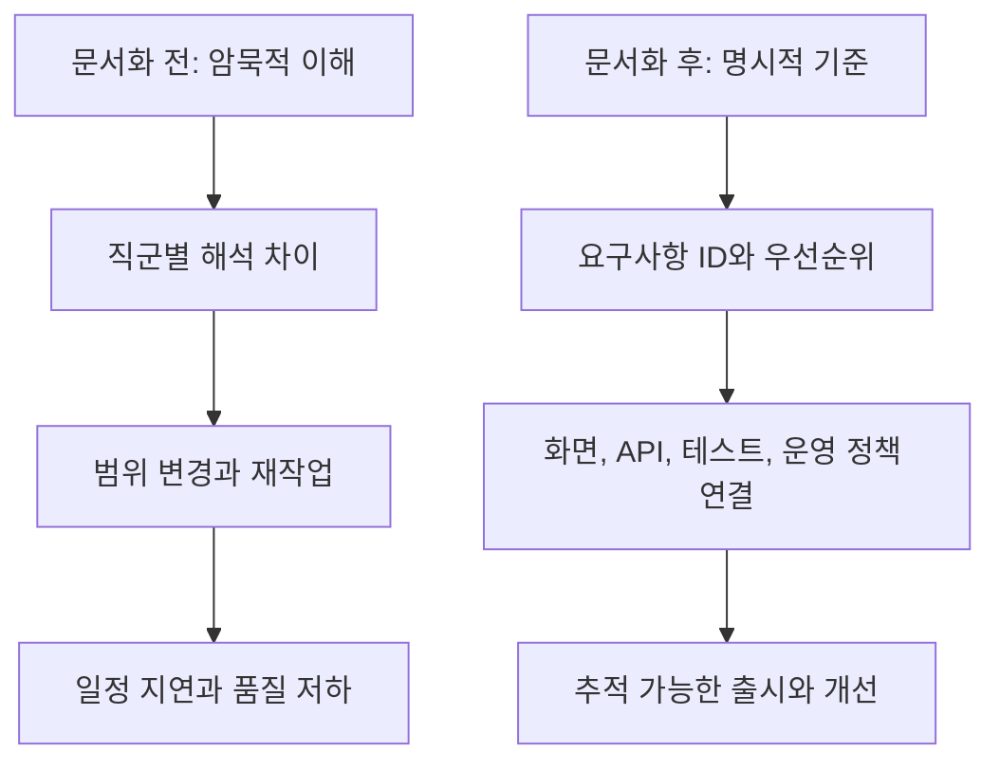
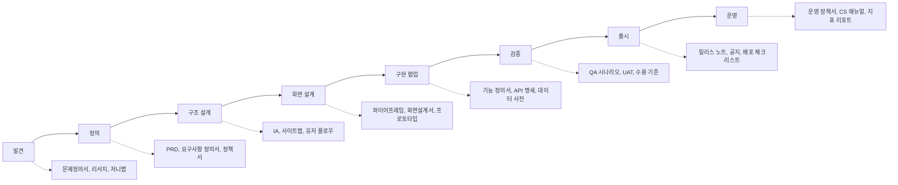
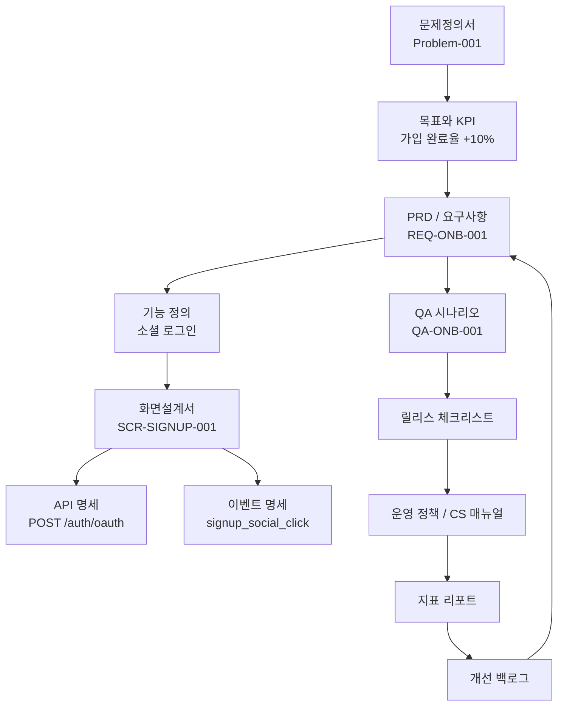
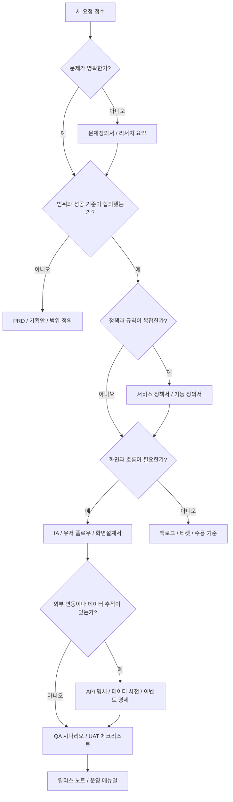
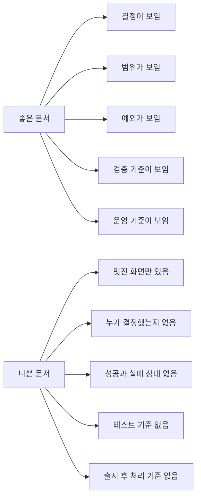
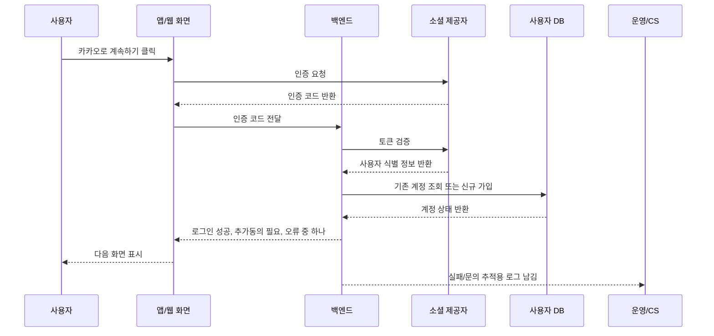
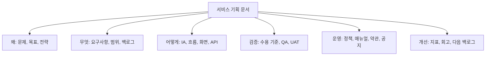

# 서비스 기획자가 자주 작성하는 문서

- 작성일: 2026-06-22
- 검색 기준: 서비스 기획 실무 산출물, 제품 요구사항 문서, 요구사항 공학 표준, 애자일 산출물, UX/서비스 디자인 산출물, 개인정보/약관 공식 가이드
- 전제: 회사마다 `서비스 기획자`, `프로덕트 매니저`, `프로덕트 오너`, `UX 기획자`, `서비스 디자이너`, `비즈니스 분석가`의 업무 경계가 다르다. 이 노트는 한국 서비스 기획 실무에서 자주 만나는 문서를 중심으로, 국제적으로 통용되는 제품/요구사항/UX 문서 체계를 함께 정리한다.

## 1. 한 줄 요약

- 서비스 기획자가 쓰는 문서는 `왜 만들지`, `무엇을 만들지`, `어떻게 동작해야 하는지`, `어떻게 검증하고 운영할지`를 팀이 같은 기준으로 판단하게 만드는 의사결정 문서다.
- 문서의 목적은 글을 많이 남기는 것이 아니라, 모호한 요구를 `추적 가능한 결정`, `구현 가능한 요구사항`, `검증 가능한 기준`, `운영 가능한 규칙`으로 바꾸는 것이다.
- 자주 쓰는 문서는 크게 `방향 문서`, `요구사항 문서`, `구조/흐름 문서`, `화면/상호작용 문서`, `구현/검증 문서`, `운영/정책 문서`, `관리/커뮤니케이션 문서`로 나눌 수 있다.

### 문서군 한눈에 보기

| 문서군 | 대표 문서 | 핵심 질문 | 주 사용자 |
|---|---|---|---|
| 방향 문서 | 문제정의서, 기획안, 제품 비전, 로드맵, 시장/경쟁 분석 | 왜 지금 이 문제를 풀어야 하는가? | 리더십, 사업, 제품팀 |
| 요구사항 문서 | PRD, 요구사항 정의서, SRS, 기능 정의서, 유저스토리, 백로그 | 무엇을 만들고 무엇은 만들지 않는가? | 기획, 디자인, 개발, QA |
| 구조/흐름 문서 | IA, 사이트맵, 유저 플로우, 화면흐름도, 저니맵, 서비스 블루프린트 | 사용자는 어떤 경로로 목표를 달성하는가? | 기획, UX, 디자인, 개발 |
| 화면/상호작용 문서 | 와이어프레임, 화면설계서, 스토리보드, 프로토타입 | 각 화면은 어떤 상태와 규칙으로 동작하는가? | 디자인, 프론트엔드, 백엔드, QA |
| 구현/검증 문서 | API 명세서, 데이터 사전, 이벤트 택소노미, QA 시나리오, UAT 체크리스트 | 구현과 테스트가 같은 기준을 보는가? | 개발, 데이터, QA, 운영 |
| 운영/정책 문서 | 서비스 정책서, 운영 정책서, CS 매뉴얼, 이용약관, 개인정보 처리방침, 릴리스 노트 | 출시 후 어떤 규칙으로 운영하고 설명할 것인가? | 운영, CS, 법무, 마케팅 |
| 관리/커뮤니케이션 문서 | WBS, R&R/RACI, 회의록, 의사결정 로그, 리스크 로그 | 누가 언제 무엇을 결정하고 실행하는가? | 프로젝트 참여자 전체 |

## 2. 왜 중요한가

- 서비스 기획 문서는 여러 직군 사이의 `공통 언어` 역할을 한다.
- 같은 기능도 사업팀은 매출/정책으로, 디자이너는 사용성으로, 개발자는 데이터/상태/예외로, 운영팀은 처리 기준으로 이해한다.
- 문서가 없으면 팀은 각자 머릿속의 서비스를 만든다. 문서가 있으면 의사결정, 구현 범위, 테스트 기준, 운영 기준을 같은 위치에서 확인한다.
- Scrum Guide는 제품 백로그를 제품 개선에 필요한 작업의 정렬된 목록으로 설명하고, PRD/요구사항 문서 계열 자료는 팀 정렬과 단일 기준의 중요성을 강조한다. 서비스 기획 문서도 결국 이 정렬을 만드는 장치다.

### 문서가 줄이는 비용

- 커뮤니케이션 비용
  - 같은 질문을 회의마다 반복하지 않게 한다.
  - 결정된 내용과 아직 열린 질문을 분리한다.
  - 신규 참여자가 빠르게 맥락을 따라잡게 한다.
- 구현 비용
  - 개발 전에 정책, 데이터, 상태, 예외, 권한을 먼저 드러낸다.
  - 요구사항 누락과 충돌을 조기에 발견한다.
  - 프론트엔드, 백엔드, 디자인, QA의 기준을 맞춘다.
- 운영 비용
  - CS, 운영, 마케팅, 법무가 같은 서비스 규칙을 본다.
  - 장애/환불/탈퇴/개인정보/공지 같은 민감한 판단을 개인 감각에 맡기지 않는다.
  - 출시 이후 지표와 고객 피드백을 다시 백로그로 연결한다.

### 문서가 없을 때 자주 생기는 문제

- 문제와 솔루션이 섞인다.
  - 예: "간편 로그인 추가"가 문제 정의처럼 쓰이지만, 실제 문제는 "가입 전환율이 낮다"일 수 있다.
- 요구사항과 디자인 취향이 섞인다.
  - 예: "버튼을 크게"가 요구사항처럼 쓰이지만, 실제 요구는 "모바일에서 결제 CTA를 쉽게 찾는다"일 수 있다.
- 정책과 구현이 분리된다.
  - 예: 환불 정책은 정해지지 않았는데 결제/주문 DB 설계가 먼저 진행된다.
- 화면만 있고 상태가 없다.
  - 예: 성공 화면은 있는데 로딩, 빈 상태, 오류, 권한 없음, 재시도, 중복 요청이 빠진다.
- 티켓만 있고 맥락이 없다.
  - 예: 개발자는 작업 단위를 알지만, 왜 이 순서인지, 무엇이 성공인지 모른다.

## 3. 핵심 개념과 자주 쓰는 문서

- 서비스 기획 문서는 보통 `발견`, `정의`, `설계`, `구현 협업`, `검증`, `출시`, `운영`으로 이어진다.
- 모든 문서를 항상 작성할 필요는 없다. 다만 복잡도가 커질수록 `정책`, `상태`, `예외`, `데이터`, `검증 기준`, `운영 기준`을 별도 문서 또는 명확한 섹션으로 분리해야 한다.

### 3.1 방향 문서

| 문서 | 언제 쓰는가 | 반드시 담을 내용 | 흔한 실수 |
|---|---|---|---|
| 문제정의서 | 기능을 정하기 전 | 대상 사용자, 현재 문제, 근거 데이터, 영향 범위, 성공 지표, 비목표 | 솔루션을 문제처럼 적음 |
| 서비스/제품 기획안 | 신규 서비스나 큰 기능 제안 | 배경, 목표, 타깃, 사용자 가치, 사업 가치, 핵심 기능, 리스크, 예상 일정 | 예쁜 제안서에 집중하고 실행 조건을 빠뜨림 |
| 제품 비전/전략 문서 | 장기 방향 정렬 | 고객 세그먼트, 해결할 문제, 차별점, 성공 기준, 주요 원칙 | 선언은 있는데 선택 기준이 없음 |
| 로드맵 | 분기/반기 단위 우선순위 정렬 | 목표, 테마, 이니셔티브, 의존성, 대략적 시점, 제외 범위 | 일정표처럼만 쓰고 전략적 이유가 없음 |
| 시장/경쟁 분석 | 신규 진입, 포지셔닝 변경 | 시장 구조, 고객 대안, 경쟁 제품, 가격/정책, 기회 영역 | 경쟁사 기능 목록 복사로 끝남 |

- 문제정의서는 `무엇을 만들까`보다 먼저 `왜 풀어야 하는가`를 밝힌다.
- 기획안은 의사결정을 얻기 위한 문서다. 아이디어 소개보다 `투자할 이유`, `성공 판단 기준`, `실패 위험`, `필요 리소스`가 중요하다.
- 로드맵은 일정표가 아니라 선택의 논리다. 어떤 목표에 어떤 이니셔티브가 연결되는지 보여야 한다.

### 3.2 요구사항 문서

| 문서 | 목적 | 주요 항목 | 산출물 품질 기준 |
|---|---|---|---|
| PRD | 제품/기능의 목적, 범위, 사용자 가치, 성공 기준 정렬 | 문제, 목표, 사용자, 핵심 요구, 범위/비범위, 성공 지표, 가정, 의존성, 열린 질문 | 팀이 `왜/무엇/성공 기준`을 같은 말로 설명할 수 있음 |
| 요구사항 정의서 | 개발 가능한 요구를 ID 단위로 정리 | 요구사항 ID, 구분, 설명, 우선순위, 수용 여부, 관련 화면, 데이터, 비고, 상태 | 누락 추적과 변경 이력이 가능함 |
| SRS | 시스템/소프트웨어 요구사항을 공식 명세화 | 기능 요구사항, 비기능 요구사항, 제약, 인터페이스, 품질 속성, 검증 기준 | 요구가 명확하고 검증 가능함 |
| 기능 정의서 | 각 기능의 동작과 규칙을 구체화 | 입력, 출력, 상태, 권한, 정책, 예외, 알림, 로그, 데이터 처리 | 개발자가 구현 로직을 질문 없이 1차 설계할 수 있음 |
| 유저스토리 | 사용자 관점의 작은 가치 단위 표현 | 역할, 목표, 이유, 수용 기준, 대화 기록 | 요구사항을 대체하지 않고 대화를 여는 단위로 작동함 |
| 백로그 | 구현/개선 작업의 우선순위 목록 | 이슈, 스토리, 버그, 기술부채, 리서치, 우선순위, 추정치 | 최신 우선순위와 제품 목표가 연결됨 |

- PRD는 제품을 만들기 위한 `공유 맥락`이다.
- 요구사항 정의서는 `개발해야 할 항목의 추적 장부`다.
- 기능 정의서는 `동작 규칙의 세부 설명서`다.
- 유저스토리는 `사용자 가치 중심의 작업 단위`다. Agile Alliance의 설명처럼 스토리는 고객/PO와 팀이 기능적 증분을 나누고 대화하기 위한 단위이며, `Card, Conversation, Confirmation` 관점으로 다루는 것이 안전하다.
- ISO/IEC/IEEE 29148 계열 요구사항 공학 관점에서는 좋은 요구사항이 생명주기 전반에서 관리되고 검증 가능해야 한다. 서비스 기획 실무의 요구사항 정의서도 결국 이 원칙을 가볍게 적용한 형태다.

### 3.3 구조와 흐름 문서

| 문서 | 설명 | 주의할 점 |
|---|---|---|
| IA | 정보, 메뉴, 화면, 기능의 구조와 관계를 정리 | IA는 화면 디자인이 아니라 정보 구조다 |
| 사이트맵 | 페이지/화면의 계층 구조를 시각화 | 전체 IA의 일부이지 IA 전체가 아니다 |
| 유저 플로우 | 사용자가 목표를 달성하는 경로와 분기를 표현 | 정상 흐름만 그리면 예외가 누락된다 |
| 화면흐름도 | 화면 단위 이동, 조건, 분기를 표현 | 화면 ID와 요구사항 ID를 연결해야 한다 |
| 저니맵 | 특정 사용자가 목표를 달성하는 과정의 행동, 생각, 감정, 기회를 정리 | 실제 리서치 근거 없이 상상으로만 만들면 위험하다 |
| 서비스 블루프린트 | 사용자 접점과 내부 운영, 시스템, 지원 프로세스를 함께 표현 | 복잡한 옴니채널/운영형 서비스에서 특히 유용하다 |

- NN/g는 IA를 콘텐츠를 구조화하고 조직화하며 라벨링하는 실무로 설명한다.
- GOV.UK Service Manual은 사용자의 전체 문제를 이해하기 위해 사용자 관점의 여정과 서비스 환경을 함께 보라고 안내한다.
- 서비스 블루프린트는 사용자가 보는 화면뿐 아니라 운영자, 시스템, 내부 프로세스까지 연결해서 보여준다.

### 3.4 화면과 상호작용 문서

| 문서 | 목적 | 포함하면 좋은 항목 |
|---|---|---|
| 와이어프레임 | 화면 구조와 정보 배치를 빠르게 합의 | 주요 영역, 콘텐츠 우선순위, CTA, 입력 요소, 흐름 연결 |
| 목업 | 최종에 가까운 시각 디자인 확인 | 색상, 타이포그래피, 컴포넌트, 레이아웃, 시각적 상태 |
| 프로토타입 | 상호작용과 흐름을 체험 가능하게 검증 | 클릭 경로, 모달/드로어, 전환, 애니메이션, 오류 흐름 |
| 화면설계서 | 화면별 기능, 정책, 데이터, 상태, 예외를 개발/QA 기준으로 명세 | 화면 ID, 목적, 진입 조건, UI 요소, 동작 규칙, API, validation, 상태, 오류, 권한, 로그 |
| 스토리보드 | 화면 흐름과 화면별 설명을 결합 | 서비스 흐름, 화면 설명, 정책, 버튼/링크 동작, 예외 케이스 |

- Figma는 와이어프레임을 디지털 제품의 골격을 표현하는 시각 가이드로 설명한다.
- 와이어프레임은 미적 완성도가 아니라 `구조`, `정보 우선순위`, `사용자 흐름`을 검증하기 위한 도구다.
- 화면설계서는 와이어프레임보다 구현 기준에 가깝다. 화면의 "모양"보다 `상태`, `규칙`, `데이터`, `예외`, `권한`, `추적 이벤트`가 빠지면 개발/QA에서 다시 질문이 발생한다.

### 3.5 구현, 검증, 운영 문서

| 문서 | 목적 | 주요 항목 |
|---|---|---|
| API/인터페이스 명세서 | 프론트엔드, 백엔드, 외부 시스템 연동 기준 정렬 | endpoint, method, request, response, error code, auth, rate limit, version |
| 데이터 사전 | 필드 의미와 데이터 타입을 통일 | 필드명, 설명, 타입, nullable, enum, 출처, 보관 기간, 마스킹 여부 |
| 이벤트 택소노미 | 분석 이벤트와 속성을 통일 | event name, trigger, properties, user/session 기준, 전송 조건 |
| QA 시나리오 | 기능 검증 흐름과 기대 결과 정리 | 사전 조건, 단계, 기대 결과, 테스트 데이터, 우선순위 |
| UAT 체크리스트 | 현업/운영 관점의 인수 기준 확인 | 업무 시나리오, 운영 가능 여부, 공지/매뉴얼, 권한, 예외 처리 |
| 릴리스 노트 | 배포 변경사항을 내부/외부에 전달 | 변경 내용, 영향 범위, 사용자 안내, 롤백/문의 경로 |
| 서비스 정책서 | 서비스의 공통 규칙 정의 | 용어, 회원, 상품, 결제, 환불, 알림, 포인트, 권한, 제재 |
| 운영 정책서/CS 매뉴얼 | 출시 후 처리 기준 정리 | 문의 유형, 처리 절차, SLA, 환불/보상, 이관 기준, 템플릿 |
| 이용약관/개인정보 처리방침 | 법적 고지와 사용자 권리/의무 설명 | 법무/개인정보 담당 검토 필수, 공식 가이드 준수 |

- OpenAPI Specification은 HTTP API를 사람과 컴퓨터가 이해할 수 있게 설명하는 표준 인터페이스 기술 방식이다.
- 개인정보 처리방침과 약관은 기획자가 초안을 준비할 수는 있지만, 법무/개인정보보호 담당 검토 없이 확정하면 안 된다.
- 국내 서비스에서는 개인정보 처리방침 작성 시 개인정보보호위원회/개인정보 포털의 최신 작성지침을 확인해야 하며, 전자상거래형 서비스는 공정거래위원회 표준약관을 참고해 법무 검토를 진행하는 것이 안전하다.

## 4. 문서 흐름과 연결 구조

- 좋은 서비스 기획 문서는 독립된 파일 더미가 아니라 서로 연결된 체계다.
- 핵심은 `문제 → 목표 → 요구사항 → 기능 → 화면 → API/데이터 → 테스트 → 운영 → 지표`가 끊기지 않는 것이다.
- 요구사항 ID, 화면 ID, API ID, 이벤트 ID, QA 케이스 ID를 연결하면 변경 영향도를 추적할 수 있다.

### 단계별 문서 흐름

| 단계 | 시작 질문 | 산출물 | 다음 단계로 넘겨야 하는 것 |
|---|---|---|---|
| 1. 발견 | 어떤 문제가 실제로 중요한가? | 문제정의서, 리서치 요약, 저니맵 | 문제, 사용자, 근거, 기회 |
| 2. 방향 결정 | 이번 사이클에 어디까지 할 것인가? | 기획안, 로드맵, PRD 초안 | 목표, 범위, 비범위, 성공 기준 |
| 3. 요구사항 구체화 | 개발 가능한 요구로 쪼개졌는가? | 요구사항 정의서, 백로그, 유저스토리 | 요구사항 ID, 우선순위, 수용 기준 |
| 4. 구조 설계 | 사용자는 어떤 구조와 경로를 거치는가? | IA, 사이트맵, 유저 플로우, 블루프린트 | 화면 목록, 흐름, 분기, 운영 접점 |
| 5. 화면 설계 | 각 화면은 어떤 상태로 동작하는가? | 와이어프레임, 화면설계서, 프로토타입 | UI 요소, 정책, validation, 에러, 권한 |
| 6. 구현 협업 | 개발/데이터/QA가 같은 기준을 보는가? | 기능 정의서, API 명세, 데이터 사전, 이벤트 명세 | 인터페이스, 데이터, 테스트 기준 |
| 7. 검증/출시 | 출시 가능한 품질인가? | QA 시나리오, UAT, 릴리스 체크리스트 | 결함, 승인, 공지, 롤백 계획 |
| 8. 운영/개선 | 실제로 목표를 달성했는가? | 운영 정책서, CS 매뉴얼, 지표 리포트 | 고객 피드백, 지표, 개선 백로그 |

### 어떤 문서를 먼저 써야 하는가

### 문서 간 경계

| 헷갈리는 조합 | 구분 기준 |
|---|---|
| PRD vs 요구사항 정의서 | PRD는 맥락과 방향, 요구사항 정의서는 구현 항목의 목록과 추적 |
| 요구사항 정의서 vs 기능 정의서 | 요구사항 정의서는 무엇이 필요한지, 기능 정의서는 그 기능이 어떻게 동작해야 하는지 |
| IA vs 사이트맵 | IA는 정보 구조 전체, 사이트맵은 그 구조를 계층 그림으로 나타낸 일부 |
| 유저 플로우 vs 화면흐름도 | 유저 플로우는 사용자 목표 중심, 화면흐름도는 화면 이동과 조건 중심 |
| 와이어프레임 vs 화면설계서 | 와이어프레임은 구조 합의, 화면설계서는 구현/QA 기준 |
| 유저스토리 vs 요구사항 | 유저스토리는 대화와 작업 단위, 요구사항은 검증 가능한 필요 조건 |
| 서비스 정책서 vs 운영 매뉴얼 | 정책서는 규칙, 운영 매뉴얼은 그 규칙을 실제 업무에서 처리하는 절차 |

## 5. 중요한 디테일, 예외, 트레이드오프

- 문서의 완성도는 분량이 아니라 `결정 가능성`, `구현 가능성`, `검증 가능성`, `운영 가능성`으로 판단한다.
- 기획 문서에서 가장 많이 빠지는 것은 화면이 아니라 `상태`, `예외`, `권한`, `데이터`, `정책`, `변경 이력`이다.

### 5.1 좋은 요구사항의 체크리스트

- 식별 가능해야 한다.
  - 요구사항 ID가 있어야 한다.
  - 관련 PRD, 화면, API, 테스트 케이스와 연결되어야 한다.
- 검증 가능해야 한다.
  - "빠르게", "쉽게", "편하게" 같은 표현은 측정 기준으로 바꾼다.
  - 예: "검색이 빨라야 한다"보다 "검색 결과 첫 응답은 p95 1초 이내"가 낫다.
- 범위가 명확해야 한다.
  - 포함 범위와 제외 범위가 있어야 한다.
  - 이번 릴리스에서 하지 않는 일을 명확히 적어야 한다.
- 예외가 있어야 한다.
  - 실패, 권한 없음, 중복 요청, 네트워크 오류, 빈 데이터, 만료, 취소를 적는다.
- 소유자가 있어야 한다.
  - 작성자, 승인자, 리뷰어, 변경 요청 경로를 표시한다.
- 변경 이력이 있어야 한다.
  - 언제, 왜, 무엇이 바뀌었는지 남겨야 QA와 운영 혼선을 줄인다.

### 5.2 화면설계서에서 자주 빠지는 항목

| 항목 | 빠졌을 때 생기는 문제 | 적는 방식 |
|---|---|---|
| 진입 조건 | 접근 불가능한 화면이 생김 | 로그인 여부, 권한, 이전 단계, URL 직접 접근 |
| 화면 상태 | 개발자가 임의 처리 | 기본, 로딩, 성공, 빈 상태, 오류, 비활성, 만료 |
| 입력 검증 | 프론트/백엔드 validation 불일치 | 필수 여부, 형식, 길이, 허용 문자, 중복 체크 |
| 정책 | 화면마다 다른 규칙 적용 | 수수료, 환불, 포인트, 알림, 제한 횟수 |
| 예외 | QA 후반에 결함 폭증 | 네트워크 오류, 서버 오류, 재시도, 중복 클릭 |
| 권한 | 보안/운영 문제 | 사용자 역할, 관리자 권한, 마스킹, 접근 로그 |
| 데이터 | API와 화면 불일치 | 노출 필드, 정렬, 필터, 페이징, 캐시 |
| 이벤트 | 출시 후 성과 측정 불가 | 이벤트명, 트리거, 속성, 전송 조건 |
| 접근성 | 사용성/법적 리스크 | 라벨, 포커스, 키보드 이동, 대체 텍스트 |
| 운영 영향 | CS가 처리하지 못함 | 문의 유형, 처리 기준, 관리자 기능, 알림 문구 |

### 5.3 문서별 트레이드오프

| 선택 | 장점 | 위험 | 권장 기준 |
|---|---|---|---|
| PRD를 자세히 쓴다 | 맥락 공유가 쉽다 | 변경 때 낡기 쉽다 | 큰 기능, 여러 팀, 법/정책 영향이 있을 때 |
| 티켓 중심으로 간다 | 실행 속도가 빠르다 | 제품 맥락이 사라진다 | 작은 개선, 단일 팀, 정책 영향이 낮을 때 |
| 화면설계서를 자세히 쓴다 | 개발/QA 기준이 명확하다 | 디자인 변경 때 유지보수가 무겁다 | 상태/예외/정책이 복잡할 때 |
| 프로토타입으로 합의한다 | 흐름 검증이 빠르다 | 데이터/예외/권한이 누락될 수 있다 | 사용성 검증이 핵심일 때 |
| 유저스토리로 쪼갠다 | 사용자 가치 중심으로 개발 가능 | 기술/정책 요구가 숨을 수 있다 | 백로그 관리와 스프린트 계획에 사용 |
| 서비스 정책서를 먼저 쓴다 | DB/권한/운영 설계가 안정된다 | 초기에 시간이 든다 | 결제, 환불, 회원, 포인트, 제재처럼 규칙이 많은 서비스 |

### 5.4 기획자가 특히 조심해야 하는 지점

- 유저스토리를 요구사항 명세서처럼 쓰지 않는다.
  - 유저스토리는 대화를 시작하는 단위다.
  - 세부 정책, 상태, 예외, 데이터는 별도 수용 기준이나 기능 정의로 보강해야 한다.
- IA를 메뉴 트리로만 끝내지 않는다.
  - 실제 사용자는 메뉴 구조보다 목표 달성 경로를 경험한다.
  - IA와 유저 플로우를 함께 봐야 한다.
- 정책을 화면설계서 뒤로 미루지 않는다.
  - 회원 등급, 결제, 환불, 권한, 알림, 데이터 보관은 화면보다 먼저 결정되어야 할 때가 많다.
- 개인정보/약관을 단순 카피하지 않는다.
  - 서비스의 실제 개인정보 처리, 위탁, 보유기간, 파기, 제3자 제공, 자동 수집 장치가 반영되어야 한다.
  - 법무/개인정보 담당 검토가 필요하다.
- "오픈 후 운영"을 개발 완료 뒤에 생각하지 않는다.
  - 관리자 화면, CS 처리 기준, 공지, 고객 안내, 지표 대시보드가 없으면 출시 후 서비스가 흔들린다.

## 6. 실무 예시

- 아래 예시는 `소셜 로그인으로 가입 전환율을 개선하는 기능`을 기획한다고 가정한 문서 세트다.
- 실제 회사에서는 이 전체를 모두 별도 문서로 만들 필요는 없다. 작은 조직이라면 PRD 한 문서 안에 요구사항, 화면 정책, QA 기준을 섹션으로 넣어도 된다.

### 6.1 문제정의서 예시

| 항목 | 예시 |
|---|---|
| 문제 | 모바일 회원가입 1단계 진입 대비 가입 완료율이 42%로 낮다 |
| 사용자 | 신규 방문자, 특히 모바일 검색 유입 사용자 |
| 근거 | 가입 폼 이탈률, 세션 리플레이, 고객 인터뷰에서 "입력 항목이 많다"는 피드백 |
| 목표 | 가입 완료율을 42%에서 52% 이상으로 높인다 |
| 비목표 | 전체 회원 등급 정책 개편, 추천인 제도 개편은 이번 범위에서 제외 |
| 성공 지표 | 가입 완료율, 소셜 로그인 클릭률, 소셜 로그인 실패율, 가입 후 7일 활성률 |
| 리스크 | 소셜 계정 이메일 미제공, 기존 계정 중복, 개인정보 동의 문구 변경, CS 문의 증가 |

### 6.2 PRD 목차 예시

- 배경
  - 현재 가입 퍼널의 문제와 근거 데이터
- 목표
  - 전환율, 실패율, 활성률 등 측정 가능한 지표
- 사용자
  - 신규 방문자, 기존 이메일 가입자, 휴면 사용자
- 핵심 기능
  - 소셜 로그인 제공자 선택
  - 기존 계정 연결
  - 추가 약관/개인정보 동의
  - 실패 시 대체 가입 경로 제공
- 범위
  - 모바일 웹과 앱 가입 플로우
  - 카카오/구글 우선 지원
- 비범위
  - 네이버 로그인
  - 법인 계정 가입
  - 관리자 회원 병합 기능
- 요구사항
  - 요구사항 정의서 링크 또는 표
- 디자인/흐름
  - 유저 플로우, 화면설계서, 프로토타입 링크
- 데이터/분석
  - 이벤트 택소노미, 대시보드 정의
- 의존성
  - OAuth 앱 등록, 개인정보 처리방침 개정, 앱 심사
- 열린 질문
  - 이메일 미제공 사용자의 식별 정책
  - 기존 이메일 계정과 소셜 계정 병합 정책

### 6.3 요구사항 정의서 예시

| ID | 구분 | 요구사항 | 우선순위 | 관련 화면 | 수용 기준 |
|---|---|---|---|---|---|
| REQ-AUTH-001 | Front | 가입 화면에서 카카오/구글 소셜 로그인 버튼을 제공한다 | Must | SCR-SIGNUP-001 | 버튼 클릭 시 각 제공자 인증 화면으로 이동 |
| REQ-AUTH-002 | Back | 인증 코드로 소셜 제공자 토큰을 검증하고 사용자 식별자를 저장한다 | Must | API-AUTH-001 | 유효하지 않은 코드는 401 오류와 표준 오류 메시지 반환 |
| REQ-AUTH-003 | Policy | 기존 이메일 계정과 동일 이메일의 소셜 계정은 계정 연결 안내를 제공한다 | Should | SCR-LINK-001 | 사용자가 본인 인증 후 연결 또는 취소 가능 |
| REQ-AUTH-004 | Data | 소셜 로그인 클릭/성공/실패 이벤트를 수집한다 | Must | EVT-AUTH-* | provider, result, error_code 속성 포함 |
| REQ-AUTH-005 | Ops | 소셜 로그인 장애 시 이메일 가입 경로와 공지 문구를 제공한다 | Should | OPS-AUTH-001 | 운영자가 공지 템플릿을 사용할 수 있음 |

### 6.4 유저스토리와 수용 기준 예시

- 유저스토리
  - 신규 사용자는 긴 가입 폼을 입력하지 않고도 빠르게 서비스를 시작하기 위해 소셜 계정으로 가입할 수 있다.
- 수용 기준
  - Given 사용자가 가입 화면에 진입했을 때, When 카카오로 계속하기를 누르면, Then 카카오 인증 화면으로 이동한다.
  - Given 소셜 인증이 성공했을 때, When 필수 약관 동의가 아직 없으면, Then 약관 동의 화면을 먼저 보여준다.
  - Given 동일 이메일의 기존 계정이 있을 때, When 소셜 로그인 인증이 성공하면, Then 계정 연결 안내 화면을 보여준다.
  - Given 소셜 제공자 오류가 발생했을 때, When 인증이 실패하면, Then 이메일 가입으로 계속할 수 있는 대체 경로를 보여준다.

### 6.5 화면설계서 일부 예시

| 항목 | 내용 |
|---|---|
| 화면 ID | SCR-SIGNUP-001 |
| 화면명 | 가입 시작 |
| 목적 | 신규 사용자가 가입 방식을 선택한다 |
| 진입 조건 | 비로그인 사용자, 가입 CTA 클릭 |
| 주요 UI | 카카오로 계속하기, 구글로 계속하기, 이메일로 가입, 로그인 링크 |
| 기본 상태 | 소셜 로그인 버튼 2개와 이메일 가입 CTA 노출 |
| 로딩 상태 | 버튼 클릭 후 중복 클릭 방지, spinner 표시 |
| 오류 상태 | 제공자 인증 실패, 네트워크 오류, 점검 중 |
| validation | 약관 동의 전 가입 완료 불가 |
| 이벤트 | signup_social_click, signup_social_success, signup_social_fail |
| API | POST /auth/oauth/callback |
| 접근성 | 버튼 라벨에 제공자명 포함, 키보드 포커스 순서 확인 |
| 정책 | 만 14세 미만 가입 제한 문구 노출 여부는 회원 정책서 참조 |

### 6.6 API 명세 요약 예시

| 항목 | 예시 |
|---|---|
| API ID | API-AUTH-001 |
| endpoint | POST /auth/oauth/callback |
| request | provider, authorization_code, redirect_uri |
| response success | access_token, refresh_token, user_status, required_agreements |
| response error | INVALID_CODE, PROVIDER_TIMEOUT, EMAIL_CONFLICT, REQUIRED_AGREEMENT |
| 인증 | public endpoint, CSRF/state 검증 필요 |
| 로그 | provider, result, error_code, latency_ms |
| 보안 | 소셜 제공자 user id는 내부 식별자와 분리 저장, 민감정보 로그 금지 |

### 6.7 QA/UAT 체크리스트 예시

| 시나리오 | 기대 결과 |
|---|---|
| 신규 사용자가 카카오로 가입 | 계정 생성, 필수 동의 저장, 홈으로 이동 |
| 기존 이메일 사용자와 동일 이메일 소셜 로그인 | 계정 연결 안내 표시 |
| 소셜 제공자가 이메일을 반환하지 않음 | 추가 이메일 입력 또는 대체 플로우 제공 |
| 인증 코드 재사용 | 실패 처리, 중복 가입 없음 |
| 네트워크 오류 | 재시도 가능, 이메일 가입 경로 유지 |
| 약관 미동의 | 가입 완료 불가, 필수 동의 항목 안내 |
| 이벤트 수집 확인 | 클릭/성공/실패 이벤트가 provider와 result 속성으로 수집 |
| CS 문의 대응 | 운영 매뉴얼에 따라 오류 코드별 안내 가능 |

## 7. 용어 정리와 빠른 복습

- 문서 이름보다 중요한 것은 `문서가 해결하는 질문`이다.
- 같은 회사에서도 팀에 따라 PRD를 `기획서`, `제품 사양서`, `요구사항 정의서`, `스펙 문서`라고 부를 수 있다.
- 따라서 협업 초기에 "이 문서가 어떤 결정을 담고, 어떤 문서를 대체하지 않는지"를 합의해야 한다.

### 용어 요약

| 용어 | 뜻 | 한 줄 기준 |
|---|---|---|
| 문제정의서 | 해결할 문제와 근거를 정의 | 솔루션보다 문제를 먼저 고정 |
| 기획안 | 제안과 의사결정을 위한 문서 | 투자할 이유와 실행 조건을 설명 |
| PRD | 제품 요구사항 문서 | 목적, 사용자, 기능, 성공 기준의 단일 기준 |
| 요구사항 정의서 | 구현해야 할 요구를 목록화 | ID, 우선순위, 상태, 관련 화면으로 추적 |
| SRS | 시스템/소프트웨어 요구사항 명세 | 공식적이고 검증 가능한 요구사항 문서 |
| 기능 정의서 | 기능 단위 동작 규칙 | 입력, 출력, 상태, 예외, 권한을 구체화 |
| 유저스토리 | 사용자 가치 중심의 작업 단위 | 대화를 여는 카드, 수용 기준으로 보강 |
| 수용 기준 | 완료 여부 판단 조건 | QA와 개발이 같은 완료 기준을 봄 |
| IA | 정보 구조 | 콘텐츠/기능의 구조, 관계, 라벨링 |
| 사이트맵 | 화면/페이지 계층도 | IA를 시각화한 내부 계획 도구 |
| 유저 플로우 | 사용자 목표 달성 경로 | 정상/예외/분기 흐름을 함께 표시 |
| 저니맵 | 사용자의 행동/생각/감정/기회 지도 | 문제와 기회를 사용자 관점에서 봄 |
| 서비스 블루프린트 | 사용자 접점과 내부 프로세스 지도 | 프론트스테이지, 백스테이지, 시스템을 연결 |
| 와이어프레임 | 화면 골격 | 정보 배치와 흐름을 빠르게 검증 |
| 목업 | 시각 디자인 시안 | 최종에 가까운 형태와 스타일 확인 |
| 프로토타입 | 상호작용 가능한 시안 | 클릭 흐름과 사용성을 검증 |
| 화면설계서 | 화면별 구현 기준 | UI, 상태, 정책, 데이터, API, 이벤트, 오류 포함 |
| API 명세서 | 시스템 간 인터페이스 기준 | 요청/응답/오류/인증/버전 정의 |
| 데이터 사전 | 데이터 필드의 공통 정의 | 타입, 의미, 출처, 보관, 마스킹 기준 |
| 이벤트 택소노미 | 분석 이벤트 체계 | 이벤트명, 트리거, 속성 통일 |
| QA 시나리오 | 기능 검증 절차 | 사전 조건, 단계, 기대 결과 |
| UAT | 사용자/현업 인수 테스트 | 실제 업무 기준으로 출시 가능성 확인 |
| 서비스 정책서 | 서비스 공통 규칙 | 회원, 결제, 환불, 권한, 제재 등 |
| 운영 매뉴얼 | 운영/CS 처리 절차 | 문의, 장애, 보상, 이관 기준 |
| 로드맵 | 목표와 이니셔티브의 시간축 | 일정표보다 선택의 논리를 보여줌 |
| 백로그 | 우선순위가 있는 작업 목록 | 기능, 버그, 기술부채, 리서치 포함 |
| WBS | 작업 분해 구조 | 일정, 담당, 의존성을 관리 |
| RACI | 역할과 책임 정의 | Responsible, Accountable, Consulted, Informed |
| 의사결정 로그 | 결정과 근거 기록 | 나중에 왜 그렇게 했는지 추적 |

### 빠른 판단 기준

| 상황 | 우선 작성할 문서 |
|---|---|
| 아이디어가 많지만 왜 해야 하는지 불명확 | 문제정의서 |
| 여러 이해관계자의 승인이 필요 | 기획안, PRD |
| 개발팀이 규모 산정해야 함 | 요구사항 정의서, 기능 정의서 |
| 화면 수와 이동 경로가 복잡 | IA, 유저 플로우, 화면흐름도 |
| 디자이너와 화면 구조를 합의해야 함 | 와이어프레임, 프로토타입 |
| 개발/QA가 상세 동작을 알아야 함 | 화면설계서, API 명세, QA 시나리오 |
| 결제/환불/회원/권한 규칙이 복잡 | 서비스 정책서 |
| 출시 후 문의와 장애 대응이 중요 | 운영 매뉴얼, CS 스크립트 |
| 개인정보나 약관 문구가 바뀜 | 개인정보 처리방침, 이용약관, 법무 검토 문서 |
| 분기 우선순위를 설명해야 함 | 로드맵, 백로그 |

## 참고 링크

- [NCS FAQ - 국가직무능력표준의 정의와 구성](https://www.ncs.go.kr/th07/qna_faq.do?faqTypeCd=08&searchCondition=&searchKeyword=)
- [IEEE/ISO/IEC 29148-2018 - Requirements Engineering](https://standards.ieee.org/ieee/29148/6937/)
- [The 2020 Scrum Guide](https://scrumguides.org/scrum-guide.html)
- [Agile Alliance - User Stories](https://agilealliance.org/glossary/user-stories/)
- [Agile Alliance - User Story Template](https://agilealliance.org/glossary/user-story-template/)
- [Agile Alliance - The Three C's](https://agilealliance.org/glossary/three-cs/)
- [Atlassian - Product Requirements Document](https://www.atlassian.com/agile/product-management/requirements)
- [Atlassian - Product Roadmaps](https://www.atlassian.com/agile/product-management/product-roadmaps)
- [Atlassian - Product Backlog](https://www.atlassian.com/agile/scrum/backlogs)
- [Atlassian - Epics, Stories, and Initiatives](https://www.atlassian.com/agile/project-management/epics-stories-themes)
- [GOV.UK Service Manual - Map and understand a user's whole problem](https://www.gov.uk/service-manual/design/map-a-users-whole-problem)
- [NN/g - Journey Mapping 101](https://www.nngroup.com/articles/journey-mapping-101/)
- [NN/g - Service Blueprints: Definition](https://www.nngroup.com/articles/service-blueprints-definition/)
- [NN/g - Information Architecture vs. Sitemaps](https://www.nngroup.com/articles/information-architecture-sitemaps/)
- [NN/g - The Difference Between IA and Navigation](https://www.nngroup.com/articles/ia-vs-navigation/)
- [Figma - How to wireframe](https://www.figma.com/blog/how-to-wireframe/)
- [Figma - Wireframe vs. Mockup](https://www.figma.com/resource-library/wireframe-vs-mockup/)
- [OpenAPI Specification - Latest](https://spec.openapis.org/oas/latest.html)
- [개인정보 포털 - 2026 개인정보 처리방침 작성지침](https://www.privacy.go.kr/front/bbs/bbsView.do?bbsNo=BBSMSTR_000000000049&bbscttNo=20885)
- [개인정보보호위원회 - 개인정보 처리방침 작성지침](https://www.pipc.go.kr/np/cop/bbs/selectBoardArticle.do?bbsId=BS217&mCode=D010030000&nttId=11134)
- [공정거래위원회 - 표준약관](https://www.ftc.go.kr/www/selectBbsNttList.do?bordCd=201&key=202)
- [공정거래위원회 - 전자상거래 표준약관](https://www.ftc.go.kr/www/selectBbsNttView.do?bordCd=201&key=202&nttSn=11139&pageIndex=1&pageUnit=10&searchCnd=all&searchKrwd=%EC%A0%84%EC%9E%90%EC%83%81%EA%B1%B0%EB%9E%98)
- [서비스 기획 산출물 톺아보기](https://enjoyinjoanne.tistory.com/72)
- [서비스기획 전체 플로우와 기획산출물 정리](https://deep-wide-studio.tistory.com/96)

<!-- study-links:start -->
## 관련 문서

- `iec`: [[정보처리기사/1과목 소프트웨어 설계/024 ISO IEC 9126의 품질 특성/024 ISO IEC 9126의 품질 특성|024 ISO/IEC 9126의 품질 특성]]
- `트리거`: [[정보처리기사/3과목 데이터베이스 구축/158 트리거(Trigger)/158 트리거(Trigger)|158 트리거(Trigger)]]
- `목업`: [[정보처리기사/1과목 소프트웨어 설계/023 목업/023 목업|023 목업]]
<!-- study-links:end -->
