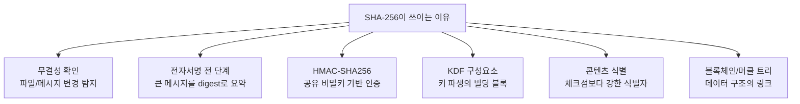
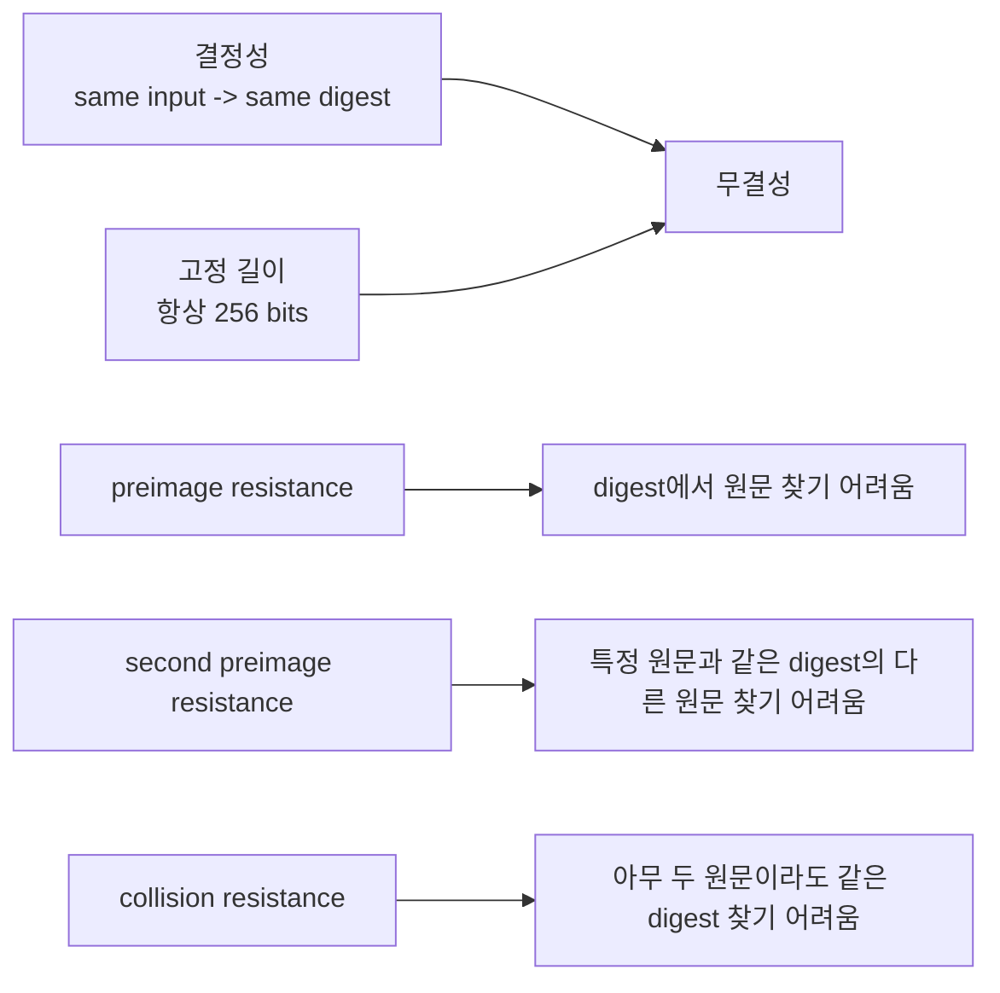
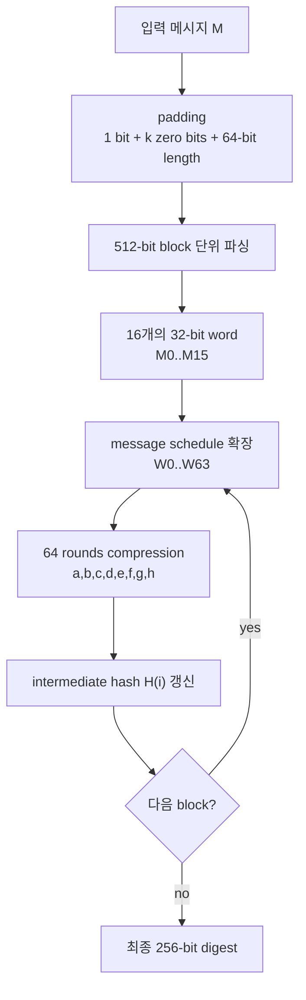
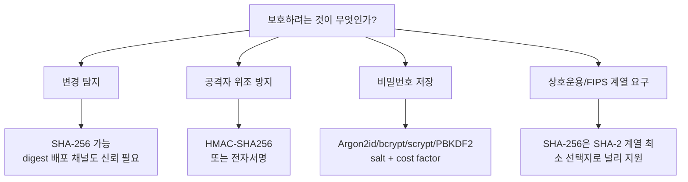
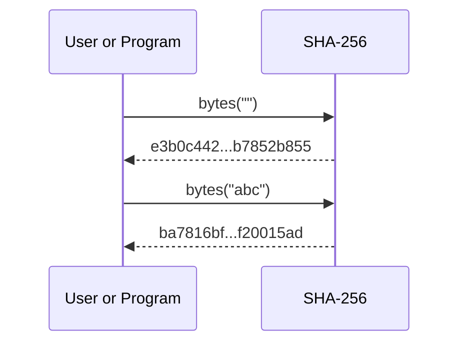
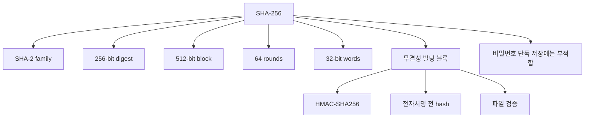

# SHA-256

- 검색 기준: 2026-05-11
- 핵심 출처: NIST FIPS 180-4, NIST Hash Functions, NIST hash policy, RFC 6234, NIST HMAC 문서, NIST SP 800-63B, OWASP Password Storage Cheat Sheet

## 1. 한 줄 요약


- SHA-256은 임의 길이의 입력을 항상 256비트 해시값으로 압축하는 암호학적 해시 함수다.
- SHA-256은 SHA-2 계열에 속하며, NIST의 `FIPS 180-4 Secure Hash Standard`에 정의되어 있다.
- 출력은 보통 64자리 16진수 문자열로 표시된다.
  - 256비트 = 32바이트
  - 1바이트 = 2자리 16진수
  - 따라서 32바이트 = 64자리 16진수
- 해시는 암호화가 아니다.
  - 암호화: 키가 있으면 복호화 가능
  - 해시: 원문으로 되돌리는 복호화 절차가 없음
- 다만 "복호화가 없다"는 말이 "항상 안전하다"는 뜻은 아니다. 용도에 따라 SHA-256 단독 사용이 부적절할 수 있다.

## 2. 왜 중요한가



- SHA-256은 "데이터가 바뀌었는지"를 확인하는 데 강하다.
  - 다운로드 파일 검증
  - 빌드 산출물 검증
  - 로그/아카이브 무결성 확인
  - Git, 컨테이너 이미지, 패키지 매니저, 블록체인 계열 시스템의 데이터 식별
- 전자서명에서는 대개 큰 메시지 전체를 직접 서명하지 않고, 메시지의 digest를 서명 대상으로 삼는다.
  - 해시가 바뀌면 서명 검증도 실패한다.
  - 단, 서명 알고리즘과 프로토콜이 올바르게 결합되어야 한다.
- 인증이 필요한 상황에서는 SHA-256 단독이 아니라 HMAC-SHA256이나 전자서명을 써야 한다.
  - 파일과 해시값을 같은 공격자가 둘 다 바꿀 수 있다면 SHA-256만으로는 위조를 막지 못한다.
  - HMAC은 비밀키를 가진 쪽만 올바른 태그를 만들 수 있게 한다.
- 비밀번호 저장에는 SHA-256 단독 사용이 부적절하다.
  - SHA-256은 빠르기 때문에 공격자가 대량 추측을 고속으로 수행할 수 있다.
  - 비밀번호는 Argon2id, bcrypt, scrypt, PBKDF2-HMAC-SHA256처럼 salt와 비용 인자를 가진 password hashing scheme을 써야 한다.

## 3. 핵심 개념



- 기본 성질
  - 결정적이다: 같은 입력은 항상 같은 digest를 낸다.
  - 입력 길이와 무관하게 출력 길이는 256비트다.
  - 작은 입력 변화가 출력 전반을 크게 바꾸도록 설계되어 있다.
  - 입력 공간은 사실상 무한하고 출력 공간은 `2^256`개이므로 충돌은 수학적으로 존재한다.
  - 중요한 것은 충돌이 존재하느냐가 아니라, 현실적으로 찾을 수 있느냐이다.
- NIST가 설명하는 승인 해시 함수의 주요 보안 속성
  - Collision resistance: 서로 다른 두 입력이 같은 해시값을 갖도록 찾기 어렵다.
  - Preimage resistance: 주어진 해시값에 대응하는 입력을 찾기 어렵다.
  - Second preimage resistance: 특정 입력과 같은 해시값을 갖는 다른 입력을 찾기 어렵다.
- SHA-256의 보안 강도
  - Collision resistance: 약 128비트 보안 강도
  - Preimage resistance: 약 256비트 보안 강도
  - Second preimage resistance: NIST 표에서는 메시지 길이에 따라 `256 - L(M)` 형태로 표현한다.
- 왜 collision 강도가 256이 아니라 128인가
  - 생일 역설 때문에 `n`비트 해시의 임의 충돌 탐색 비용은 대략 `2^(n/2)` 수준이다.
  - SHA-256은 256비트 출력이므로 일반적인 collision 탐색 비용은 대략 `2^128`이다.
- SHA-256, SHA-224, SHA-512/256은 이름이 비슷해도 같은 출력이 아니다.
  - SHA-224는 SHA-256과 처리 구조가 거의 같지만 초기값과 최종 출력 길이가 다르다.
  - SHA-512/256은 SHA-512 기반이며 512비트 워드/1024비트 블록 구조를 쓰고 최종 출력이 256비트다.
  - `SHA-256(x)`와 `SHA-512/256(x)`는 둘 다 256비트 출력이지만 서로 다른 알고리즘이다.

## 4. 내부 구조와 처리 흐름



- 입력 길이 제한
  - SHA-256은 길이가 `0 <= L < 2^64` 비트인 메시지를 처리한다.
  - 현실 시스템에서 이 한도는 사실상 매우 크지만, 알고리즘 사양에는 명시되어 있다.
- 전처리 단계
  - 메시지 끝에 `1` 비트를 붙인다.
  - `L + 1 + k ≡ 448 (mod 512)`가 되도록 `k`개의 `0` 비트를 붙인다.
  - 원래 메시지 길이 `L`을 64비트 값으로 붙인다.
  - 결과 전체 길이는 512비트의 배수가 된다.
- 블록과 워드
  - SHA-256은 512비트 블록을 처리한다.
  - 각 512비트 블록은 16개의 32비트 워드로 해석된다.
  - 이후 16개 워드를 64개 워드의 message schedule `W0..W63`로 확장한다.
- 초기 해시값
  - SHA-256의 초기값은 8개의 32비트 워드다.
  - FIPS 180-4는 이 값들이 첫 8개 소수의 제곱근 소수부에서 앞 32비트를 취해 만든 값이라고 설명한다.

```text
H0 = 6a09e667
H1 = bb67ae85
H2 = 3c6ef372
H3 = a54ff53a
H4 = 510e527f
H5 = 9b05688c
H6 = 1f83d9ab
H7 = 5be0cd19
```

- 라운드 상수
  - SHA-256은 64개의 32비트 상수 `K0..K63`을 사용한다.
  - FIPS 180-4는 이 값들이 첫 64개 소수의 세제곱근 소수부에서 앞 32비트를 취해 만든 값이라고 설명한다.
- 핵심 논리 함수

```text
Ch(x,y,z)  = (x AND y) XOR ((NOT x) AND z)
Maj(x,y,z) = (x AND y) XOR (x AND z) XOR (y AND z)

Σ0(x) = ROTR 2(x)  XOR ROTR 13(x) XOR ROTR 22(x)
Σ1(x) = ROTR 6(x)  XOR ROTR 11(x) XOR ROTR 25(x)
σ0(x) = ROTR 7(x)  XOR ROTR 18(x) XOR SHR 3(x)
σ1(x) = ROTR 17(x) XOR ROTR 19(x) XOR SHR 10(x)
```

- message schedule 확장

```text
W[t] = M[t]                                           for 0 <= t <= 15
W[t] = σ1(W[t-2]) + W[t-7] + σ0(W[t-15]) + W[t-16]    for 16 <= t <= 63
```

- 64라운드 압축의 핵심 형태

```text
T1 = h + Σ1(e) + Ch(e,f,g) + K[t] + W[t]
T2 = Σ0(a) + Maj(a,b,c)

h = g
g = f
f = e
e = d + T1
d = c
c = b
b = a
a = T1 + T2
```

- 위 덧셈은 모두 `mod 2^32` 연산이다.
- 각 블록 처리 후 작업 변수 `a..h`를 이전 hash state `H0..H7`에 더해 다음 중간 hash state를 만든다.
- 마지막 블록까지 처리하면 `H0 || H1 || ... || H7`이 최종 256비트 digest가 된다.

## 5. 중요한 주의점과 트레이드오프



- SHA-256은 "무결성"을 제공하지만, 단독으로 "인증"을 제공하지 않는다.
  - 예: 공격자가 파일과 `sha256sum.txt`를 모두 바꿀 수 있다면 검증자는 속을 수 있다.
  - 해결: 해시값을 HTTPS, 서명, 투명 로그, 패키지 저장소 메타데이터처럼 신뢰 가능한 채널로 제공한다.
- 인증이 필요하면 HMAC-SHA256 또는 전자서명을 사용한다.
  - HMAC은 공유 비밀키가 있는 환경에 적합하다.
  - 전자서명은 공개키 검증이 필요한 배포/릴리스 검증에 적합하다.
- `SHA256(secret || message)` 같은 직접 조합을 MAC처럼 쓰지 않는다.
  - SHA-256은 반복 압축 구조를 사용하므로 이런 직접 조합은 프로토콜 수준에서 취약한 패턴이 될 수 있다.
  - HMAC은 이런 문제를 피하기 위해 설계된 표준 구조다.
- 비밀번호 저장에 SHA-256 단독 사용 금지
  - SHA-256은 너무 빠르다.
  - 빠른 해시는 파일 무결성에는 장점이지만, 비밀번호 추측 방어에는 단점이다.
  - 비밀번호 저장에는 salt, 비용 인자, 가능하면 memory-hard 성질이 필요하다.
- SHA-1과 혼동하지 않는다.
  - NIST는 SHA-1에서 SHA-2/SHA-3로 전환할 것을 권고한다.
  - FIPS 180-4 개정 결정의 주요 방향 중 하나도 SHA-1 사양 제거다.
  - 이것이 SHA-256이 깨졌다는 뜻은 아니다.
- SHA-3와의 관계
  - SHA-3는 SHA-2를 즉시 대체하기 위한 긴급 패치가 아니라 별도 표준 계열이다.
  - NIST hash policy는 SHA-2에서 SHA-3로 전환할 필요가 현재 없다고 설명한다.
  - 다만 신규 설계에서 sponge 구조, XOF, SHAKE, KMAC 등이 필요하면 SHA-3 계열을 검토할 수 있다.
- 구현 관점
  - 직접 구현하지 말고 검증된 라이브러리를 사용한다.
  - 바이트 인코딩을 고정한다. 같은 "문자열"이라도 UTF-8, UTF-16, 정규화 차이에 따라 digest가 달라진다.
  - 비교 시 인증 태그나 비밀 관련 값은 constant-time compare를 사용한다.
  - 해시 알고리즘 이름을 명확히 저장한다. `sha256`, `sha512-256`, `sha3-256`은 서로 다르다.

## 6. 실전 예시



- 빈 문자열의 SHA-256

```text
SHA256("") =
e3b0c44298fc1c149afbf4c8996fb92427ae41e4649b934ca495991b7852b855
```

- 문자열 `abc`의 SHA-256

```text
SHA256("abc") =
ba7816bf8f01cfea414140de5dae2223b00361a396177a9cb410ff61f20015ad
```

- macOS/Linux CLI 예시

```bash
printf 'abc' | shasum -a 256
```

- Node.js 예시

```js
import { createHash, createHmac } from "node:crypto";

const digest = createHash("sha256")
  .update("abc", "utf8")
  .digest("hex");

const tag = createHmac("sha256", "shared-secret")
  .update("message", "utf8")
  .digest("hex");

console.log({ digest, tag });
```

- Python 예시

```python
import hashlib
import hmac

digest = hashlib.sha256(b"abc").hexdigest()
tag = hmac.new(b"shared-secret", b"message", hashlib.sha256).hexdigest()

print(digest)
print(tag)
```

- 파일 검증 예시

```bash
shasum -a 256 download.tar.gz
```

- 실무 체크리스트
  - 파일 검증: SHA-256 digest를 신뢰 가능한 채널에서 받는다.
  - API 요청 서명: SHA-256 단독이 아니라 HMAC-SHA256 또는 비대칭 서명을 쓴다.
  - 비밀번호 저장: SHA-256 단독이 아니라 Argon2id, bcrypt, scrypt, PBKDF2-HMAC-SHA256 등을 쓴다.
  - 데이터베이스 중복 탐지: 보안 목적이 아니라면 SHA-256이 과한 경우도 있다. 성능/충돌 허용 범위를 따져 비암호학적 해시도 검토한다.

## 7. 용어 정리와 빠른 복습



- Digest
  - 해시 함수의 출력값.
  - SHA-256에서는 256비트.
- Message
  - 해시 입력.
  - 텍스트, 파일, 바이트 배열 등 무엇이든 최종적으로는 비트열/바이트열로 처리된다.
- Block
  - 압축 함수가 한 번에 처리하는 고정 크기 입력 단위.
  - SHA-256에서는 512비트.
- Word
  - 내부 연산 단위.
  - SHA-256에서는 32비트 word를 사용한다.
- Padding
  - 임의 길이 메시지를 512비트 배수로 맞추기 위한 전처리.
  - `1` 비트, `0` 비트들, 원래 길이를 붙인다.
- Compression function
  - 현재 hash state와 메시지 블록을 섞어 다음 hash state를 만드는 내부 함수.
- Collision
  - 서로 다른 두 입력이 같은 digest를 갖는 경우.
  - SHA-256에서 충돌은 존재하지만 찾기 어렵도록 설계되어 있다.
- Preimage
  - 주어진 digest를 만들어내는 입력.
  - SHA-256에서는 임의 digest의 preimage를 찾는 비용이 약 `2^256` 수준으로 기대된다.
- HMAC-SHA256
  - SHA-256을 빌딩 블록으로 사용해 메시지 인증 코드를 만드는 표준 구조.
  - 공유 비밀키 기반 인증과 무결성을 함께 제공한다.
- SHA-256을 선택해도 되는 경우
  - 파일 무결성 검증
  - 해시 기반 식별자
  - 전자서명/프로토콜 안에서 표준적으로 지정된 digest
  - HMAC이나 KDF의 내부 해시로 지정된 경우
- SHA-256 단독을 피해야 하는 경우
  - 비밀번호 저장
  - 메시지 인증
  - 암호화 대체
  - 키 없이 위조 방지를 기대하는 체크섬

## 참고 링크

- [NIST FIPS 180-4, Secure Hash Standard (SHS)](https://csrc.nist.gov/pubs/fips/180-4/upd1/final)
- [FIPS 180-4 PDF](https://nvlpubs.nist.gov/nistpubs/fips/nist.fips.180-4.pdf)
- [NIST Hash Functions Project](https://csrc.nist.gov/Projects/hash-functions)
- [NIST Policy on Hash Functions](https://csrc.nist.gov/Projects/hash-functions/nist-policy-on-hash-functions)
- [NIST: Decision to Revise FIPS 180-4](https://www.nist.gov/news-events/news/2023/03/decision-revise-fips-180-4-secure-hash-standard-shs)
- [RFC 6234: US Secure Hash Algorithms](https://www.rfc-editor.org/rfc/rfc6234.html)
- [NIST FIPS 198-1: The Keyed-Hash Message Authentication Code (HMAC)](https://csrc.nist.gov/pubs/fips/198-1/final)
- [NIST SP 800-224 Initial Public Draft: HMAC](https://csrc.nist.gov/pubs/sp/800/224/ipd)
- [NIST SP 800-63B Digital Identity Guidelines](https://pages.nist.gov/800-63-4/sp800-63b.html)
- [OWASP Password Storage Cheat Sheet](https://cheatsheetseries.owasp.org/cheatsheets/Password_Storage_Cheat_Sheet.html)
- [NIST FIPS 202: SHA-3 Standard](https://csrc.nist.gov/pubs/fips/202/final)

<!-- study-links:start -->
## 관련 문서

- `owasp`: [[정보처리기사/5과목 정보시스템 구축 관리/278 OWASP(오픈 웹 애플리케이션 보안 프로젝트)/278 OWASP(오픈 웹 애플리케이션 보안 프로젝트)|278 OWASP(오픈 웹 애플리케이션 보안 프로젝트)]]
- `무결성`: [[정보처리기사/3과목 데이터베이스 구축/115 무결성/115 무결성|115 무결성]]
- `정규화`: [[정보처리기사/3과목 데이터베이스 구축/123 정규화(Normalization)/123 정규화(Normalization)|123 정규화(Normalization)]]
- `해시`: [[정보처리기사/5과목 정보시스템 구축 관리/304 해시(Hash)/304 해시(Hash)|304 해시(Hash)]]
<!-- study-links:end -->
