# shadcn/ui

## 1. 한 줄 요약

- `shadcn/ui`는 전통적인 npm 컴포넌트 라이브러리라기보다, 접근성 있는 UI 컴포넌트 소스 코드와 그 코드를 프로젝트에 배포하는 CLI/registry 시스템이다.
- 핵심은 "패키지에서 가져다 쓰는 컴포넌트"가 아니라 "내 코드베이스로 복사되어 내가 소유하고 수정하는 컴포넌트"라는 점이다.
- 2026-06-25 기준 공식 문서 흐름은 `shadcn` CLI v4, Tailwind CSS v4, React 19, `new-york` 스타일, CSS 변수 기반 테마, Radix UI 또는 Base UI 기반 선택, registry 기반 코드 배포로 정리된다.

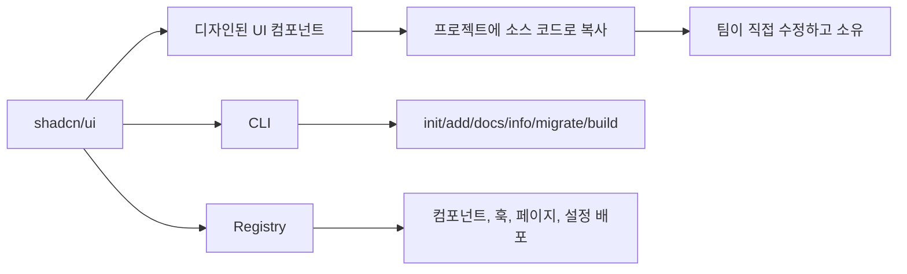

## 2. 왜 중요한가

- 기존 UI 라이브러리는 보통 `npm install` 후 패키지 내부 컴포넌트를 import해서 사용한다.
- 이 방식은 빠르지만, 디자인 시스템과 맞지 않는 API, 스타일 오버라이드, wrapper 컴포넌트 증가, 의존성 업데이트 충돌이 생기기 쉽다.
- `shadcn/ui`는 컴포넌트 소스가 프로젝트 안으로 들어오기 때문에 아래 장점이 있다.
  - 컴포넌트 구조와 스타일을 직접 확인할 수 있다.
  - 팀의 디자인 토큰, 컴포넌트 API, 접근성 정책에 맞게 수정할 수 있다.
  - 필요한 컴포넌트만 추가해서 번들/의존성 표면을 줄일 수 있다.
  - AI 코딩 도구가 실제 로컬 컴포넌트 코드를 읽고 수정하기 쉽다.
  - registry를 통해 사내 컴포넌트, 블록, 설정, 규칙 파일까지 배포할 수 있다.

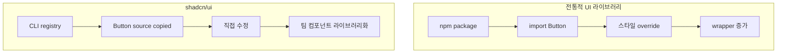

## 3. 핵심 개념

### 3.1 Open Code

- `shadcn/ui`의 가장 중요한 개념은 Open Code다.
- 컴포넌트가 외부 패키지 내부에 숨어 있지 않고, `components/ui/*` 같은 프로젝트 경로에 실제 파일로 생성된다.
- 결과적으로 `Button`, `Dialog`, `Select`, `Table`, `Sidebar` 같은 컴포넌트를 팀이 직접 수정할 수 있다.
- 이 모델에서는 "업데이트를 패키지 버전으로 따라간다"보다 "현재 프로젝트가 소유한 컴포넌트 소스를 필요할 때 비교하고 반영한다"에 가깝다.

### 3.2 Headless Primitive + Tailwind Styling

- 많은 컴포넌트는 Radix UI 또는 Base UI 같은 primitive 위에 만들어진다.
- primitive는 접근성, 키보드 상호작용, ARIA, focus 관리 같은 복잡한 동작을 담당한다.
- Tailwind CSS와 CSS 변수는 시각 스타일, 색상 토큰, radius, spacing, 상태 스타일을 담당한다.
- `class-variance-authority`, `clsx`, `tailwind-merge`는 variant와 조건부 class 병합에 자주 쓰인다.

### 3.3 코드 배포 시스템

- `shadcn/ui`는 컴포넌트 모음인 동시에 code distribution system이다.
- registry schema로 파일, 의존성, registry 의존성, CSS 변수, target path를 정의한다.
- CLI는 이 schema를 읽어서 파일을 생성하고, import alias와 프로젝트 구조에 맞춰 배치한다.

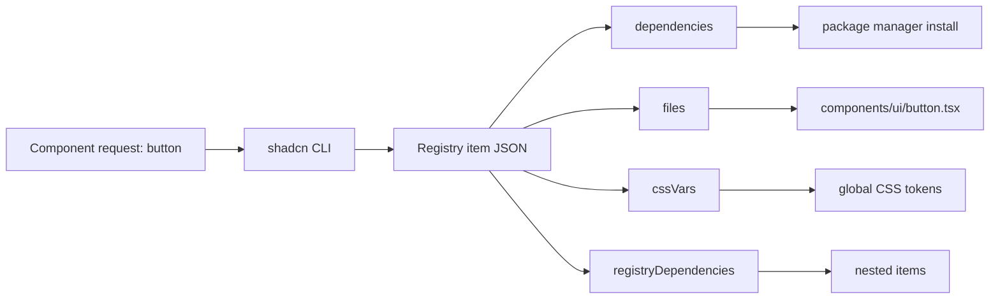

## 4. 설치와 CLI 흐름

### 4.1 새 프로젝트

- 공식 설치 문서는 새 프로젝트의 경우 `shadcn/create`로 preset을 시각적으로 만든 뒤 명령을 생성하는 흐름을 추천한다.
- 터미널에서 바로 시작할 때는 `shadcn` CLI를 사용한다.
- 예시:

```bash
pnpm dlx shadcn@latest init -t next
pnpm dlx shadcn@latest init -t vite
```

- 공식 설치 문서 기준 지원 템플릿은 `next`, `vite`, `start`, `react-router`, `astro`이고, Laravel은 Laravel 앱을 먼저 만든 뒤 `shadcn init`을 실행하는 흐름이다.

### 4.2 기존 프로젝트

- 기존 프로젝트에서는 framework별 설치 문서의 manual setup을 따른다.
- 핵심 단계는 보통 다음과 같다.
  - Tailwind CSS 설정 확인
  - global CSS 파일 확인
  - import alias 설정 확인
  - `components.json` 생성
  - `cn()` 유틸 생성
  - 필요한 컴포넌트 추가

### 4.3 자주 쓰는 CLI 명령

- `init`: 프로젝트 설정, 의존성, `cn` 유틸, CSS 변수 설정을 초기화한다.
- `add`: 컴포넌트나 registry item을 프로젝트에 추가한다.
- `search`: registry에서 item을 검색한다.
- `build`: custom registry의 `registry.json`을 읽어 배포용 JSON을 생성한다.
- `docs`: 컴포넌트 문서와 API reference를 CLI로 가져온다.
- `info`: 현재 프로젝트의 shadcn 설정 정보를 출력한다.
- `migrate`: 아이콘, Radix import, RTL 같은 마이그레이션을 수행한다.
- `eject`: `shadcn/tailwind.css` import를 global CSS에 inline하고 `shadcn` 의존성을 제거한다. 되돌리기 어려운 선택이다.

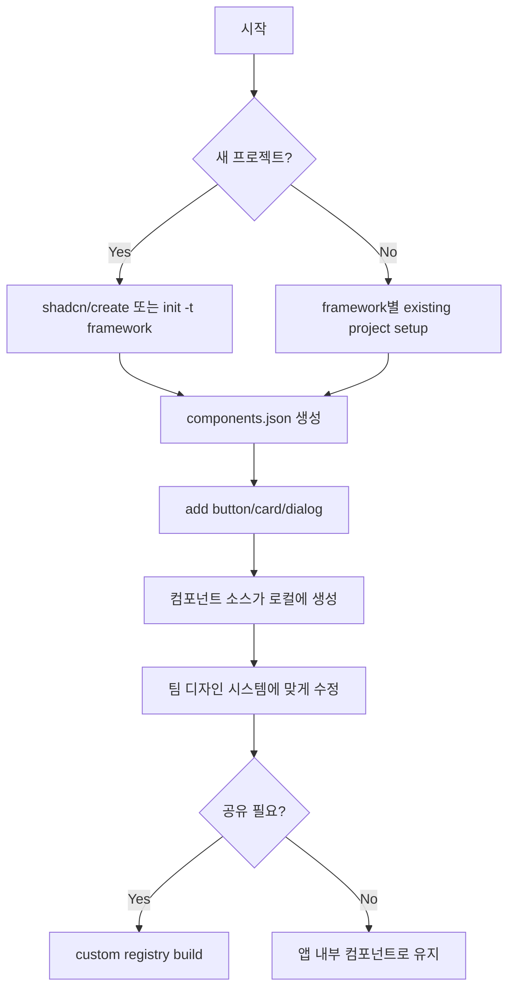

## 5. `components.json` 구조

- `components.json`은 CLI가 프로젝트 구조를 이해하는 설정 파일이다.
- copy/paste 방식으로만 컴포넌트를 가져오면 필수는 아니지만, CLI로 `add`, registry, alias rewrite를 쓰려면 사실상 중심 파일이 된다.

### 5.1 주요 필드

- `$schema`
  - 공식 JSON schema 위치를 지정한다.
- `style`
  - 컴포넌트 스타일 계열을 지정한다.
  - 공식 문서 기준 `default` 스타일은 deprecated이고, 새 프로젝트는 `new-york` 계열을 사용한다.
  - 초기화 후 바꾸기 어려운 선택이다.
- `tailwind.config`
  - Tailwind 설정 파일 경로다.
  - Tailwind CSS v4에서는 비워둘 수 있다.
- `tailwind.css`
  - Tailwind를 import하는 global CSS 파일 경로다.
- `tailwind.baseColor`
  - 초기 테마 토큰 생성에 쓰이는 base color다.
  - 공식 문서 기준 `neutral`, `stone`, `zinc`, `mauve`, `olive`, `mist`, `taupe` 등이 있다.
- `tailwind.cssVariables`
  - CSS 변수 기반 theme token을 쓸지 결정한다.
  - 공식 문서는 CSS 변수 방식을 권장한다.
- `rsc`
  - React Server Components 지원 여부다.
  - `true`면 client component에는 CLI가 `use client`를 추가한다.
- `tsx`
  - TypeScript/JavaScript 컴포넌트 생성 여부다.
- `aliases`
  - `components`, `ui`, `lib`, `hooks`, `utils`의 실제 위치를 CLI에 알려준다.
- `registries`
  - `@v0`, `@company-ui`, `@private` 같은 namespaced registry를 설정한다.

### 5.2 예시 구조

```json
{
  "$schema": "https://ui.shadcn.com/schema.json",
  "style": "new-york",
  "rsc": true,
  "tsx": true,
  "tailwind": {
    "config": "",
    "css": "app/globals.css",
    "baseColor": "neutral",
    "cssVariables": true,
    "prefix": ""
  },
  "aliases": {
    "components": "@/components",
    "ui": "@/components/ui",
    "lib": "@/lib",
    "hooks": "@/hooks",
    "utils": "@/lib/utils"
  }
}
```

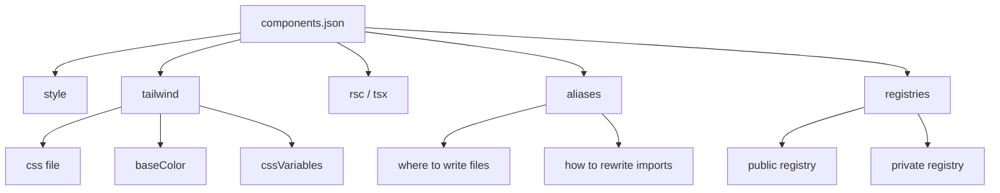

## 6. 테마 시스템

### 6.1 CSS 변수 기반 토큰

- 공식 문서는 CSS variables를 권장한다.
- `background`, `foreground`, `primary`, `primary-foreground`, `card`, `border`, `ring` 같은 semantic token을 만든다.
- 컴포넌트는 `bg-background`, `text-foreground`, `border-border`, `ring-ring` 같은 Tailwind utility로 이 토큰을 사용한다.
- 색상 자체는 global CSS의 `:root`와 `.dark`에서 바꾼다.

### 6.2 Tailwind CSS v4 변화

- Tailwind CSS v4에서는 `@theme inline`이 핵심이다.
- `--color-background: var(--background)`처럼 CSS 변수를 Tailwind theme token으로 노출한다.
- 공식 Tailwind v4 문서 페이지 기준 shadcn 컴포넌트는 Tailwind v4와 React 19에 맞춰 업데이트되었고, HSL 색상은 OKLCH로 전환되었다.
- 모든 primitive에 `data-slot` 속성이 추가되어 세밀한 스타일링이 쉬워졌다.
- `toast`는 `sonner`로 대체되는 방향이다.
- `default` 스타일은 deprecated이고 새 프로젝트는 `new-york`를 사용한다.

### 6.3 Dark Mode

- dark mode는 같은 semantic token을 `.dark` selector에서 다시 정의하는 방식이다.
- Next.js에서는 `next-themes`로 `attribute="class"`를 설정해 `<html>` 또는 root 영역에 `dark` class를 붙이는 패턴이 일반적이다.

### 6.4 Radius Scale

- `--radius`를 기준 토큰으로 두고, `--radius-sm`, `--radius-md`, `--radius-lg`, `--radius-xl` 등을 계산한다.
- 장점은 팀이 한 값만 바꿔도 버튼, 카드, 입력창, 팝오버 등의 radius 체계가 함께 움직인다는 점이다.

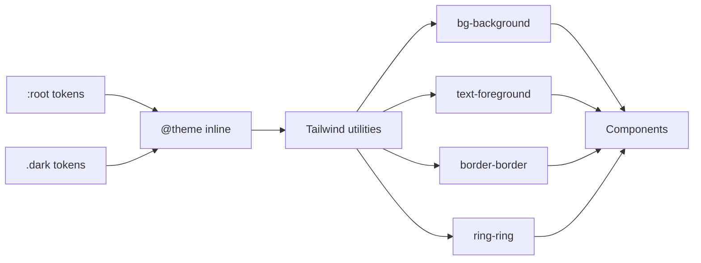

## 7. 컴포넌트 사용 모델

### 7.1 대표 컴포넌트

- 기본 UI
  - `Button`, `Badge`, `Card`, `Separator`, `Skeleton`, `Typography`
- Form
  - `Input`, `Textarea`, `Checkbox`, `Radio Group`, `Switch`, `Select`, `Label`, `Field`
- Overlay
  - `Dialog`, `Alert Dialog`, `Popover`, `Tooltip`, `Dropdown Menu`, `Context Menu`, `Hover Card`, `Sheet`, `Drawer`
- Navigation
  - `Tabs`, `Breadcrumb`, `Navigation Menu`, `Pagination`, `Menubar`, `Sidebar`
- Data/display
  - `Table`, `Data Table`, `Chart`, `Calendar`, `Carousel`, `Avatar`, `Progress`, `Scroll Area`, `Resizable`
- Interaction-heavy
  - `Command`, `Combobox`, `Input OTP`, `Toggle`, `Toggle Group`, `Slider`, `Sonner`

### 7.2 사용 방식

- 컴포넌트를 추가한다.

```bash
pnpm dlx shadcn@latest add button card dialog
```

- 생성된 파일을 import해서 쓴다.

```tsx
import { Button } from "@/components/ui/button"

export function SaveButton() {
  return <Button variant="outline">Save</Button>
}
```

- component source를 소유하므로, 팀에 필요한 variant를 직접 추가할 수 있다.
- 예를 들어 `button.tsx`에서 `cva` variant에 `success`, `premium`, `danger-outline` 같은 팀 전용 variant를 추가할 수 있다.

### 7.3 `asChild` 패턴

- Button처럼 특정 HTML element 스타일을 다른 컴포넌트에 입히고 싶을 때 `asChild` 패턴을 쓴다.
- 예: Next.js `Link`를 button처럼 보이게 만들 수 있다.

### 7.4 접근성

- Dialog, Select, Dropdown Menu 같은 복잡한 컴포넌트는 Radix UI 또는 Base UI primitive의 접근성 동작을 기반으로 한다.
- 다만 소스 코드를 직접 수정할 수 있으므로, 수정 과정에서 keyboard navigation, focus trap, aria attribute, disabled state를 깨지 않도록 주의해야 한다.

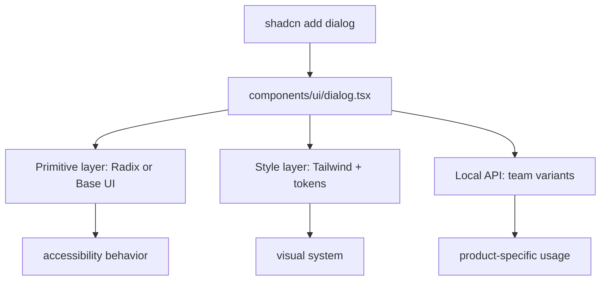

## 8. Registry와 코드 배포

### 8.1 Registry의 역할

- registry는 컴포넌트만 배포하는 시스템이 아니다.
- 공식 registry 문서 기준 custom registry는 components, hooks, pages, config, rules, 기타 파일을 프로젝트에 배포할 수 있다.
- registry 자체는 React에만 제한되지 않고, 파일과 설정을 배포하는 범용 구조에 가깝다.

### 8.2 `registry-item.json`

- registry item은 하나의 배포 단위다.
- 주요 필드는 다음과 같다.
  - `name`: item 식별자
  - `type`: item 유형
  - `title`, `description`: 사람이 읽는 설명
  - `dependencies`: npm package 의존성
  - `devDependencies`: 개발 의존성
  - `registryDependencies`: 다른 registry item 의존성
  - `files`: 배포할 파일 목록
  - `cssVars`: theme token 또는 light/dark 변수

### 8.3 지원되는 registry type

- `registry:base`: 전체 design system payload
- `registry:block`: 여러 파일로 구성된 복합 블록
- `registry:component`: 단순 컴포넌트
- `registry:font`: font 설정
- `registry:lib`: util/lib 파일
- `registry:hook`: hook
- `registry:ui`: UI primitive 또는 단일 UI 컴포넌트
- `registry:page`: route/page 파일
- `registry:file`: 기타 파일
- `registry:style`: style preset
- `registry:theme`: theme
- `registry:item`: 범용 item

### 8.4 Namespaced Registry

- namespace는 `@acme/button`, `@private/auth-form`처럼 registry source를 구분하는 방법이다.
- `components.json`의 `registries`에 URL template을 등록한다.
- private registry는 headers와 params를 설정할 수 있고, `${REGISTRY_TOKEN}` 같은 환경 변수를 사용할 수 있다.

```json
{
  "registries": {
    "@company-ui": {
      "url": "https://registry.company.com/ui/{name}.json",
      "headers": {
        "Authorization": "Bearer ${COMPANY_TOKEN}"
      }
    }
  }
}
```

### 8.5 GitHub Registry

- 2026년 6월 공식 changelog 기준, public GitHub repository를 registry로 사용할 수 있다.
- repository root에 `registry.json`을 두면, 별도의 registry server나 `shadcn build` 결과물을 호스팅하지 않아도 CLI가 repository의 registry 정의를 읽어 item을 설치한다.
- 예시:

```bash
pnpm dlx shadcn@latest add acme/toolkit/project-conventions
```

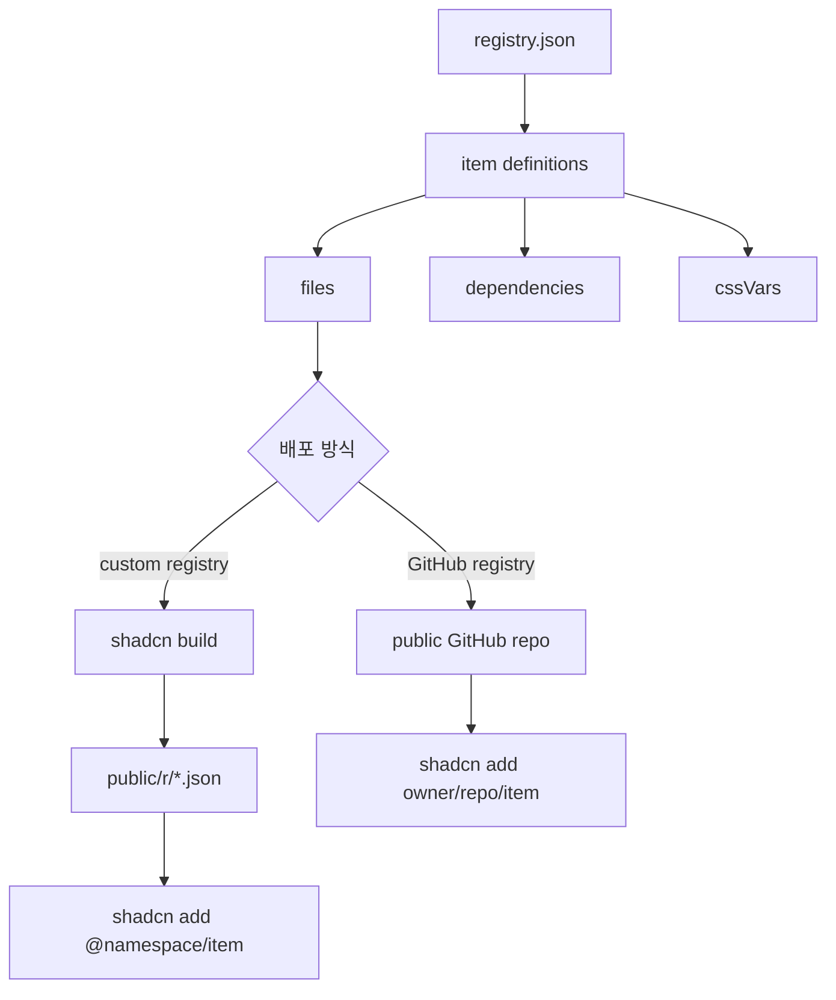

## 9. Radix UI와 Base UI 선택

- 최신 CLI는 base primitive를 선택할 수 있다.
- 공식 CLI 옵션 기준 `--base`는 `radix` 또는 `base`를 받는다.
- Radix 기반은 기존 shadcn 생태계와 오래 맞춰져 있고, Dialog/Select/Dropdown 등에서 검증된 primitive 사용 경험이 많다.
- Base UI 기반은 대안 primitive layer로 선택할 수 있다.
- 선택 기준은 팀의 기존 컴포넌트 의존성, 접근성 검증 범위, 외부 라이브러리 호환성, migration 비용이다.
- 이미 Radix 기반 컴포넌트를 많이 수정한 프로젝트라면 Base UI로 전환하는 데 비용이 있다.

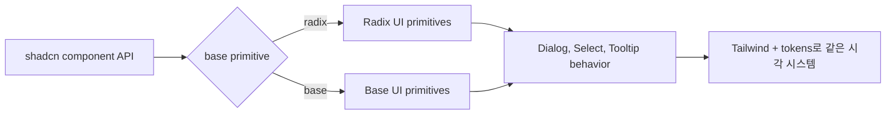

## 10. 실무 적용 패턴

### 10.1 제품 UI에서 유리한 경우

- Admin dashboard
  - `Card`, `Table`, `DropdownMenu`, `Badge`, `Tabs` 조합이 빠르게 맞는다.
- Settings
  - `Tabs`, `Card`, `Label`, `Input`, `Switch`, `Button` 조합이 안정적이다.
- CRUD
  - `Table`, `Sheet`, `Dialog`, `AlertDialog`, `DropdownMenu` 조합이 자연스럽다.
- Search/Command UI
  - `Command`, `Dialog`, `Popover`를 조합한다.
- Auth
  - `Card`, `Input`, `Button`, `Separator`, `Alert`를 조합한다.

### 10.2 팀 디자인 시스템화

- 처음에는 공식 컴포넌트를 그대로 추가한다.
- 프로젝트 반복 사용 중 variant, density, icon convention, spacing convention이 생긴다.
- 이 규칙을 로컬 컴포넌트에 반영한다.
- 여러 프로젝트에서 재사용이 필요해지면 custom registry를 만든다.
- 사내 registry를 namespaced registry로 등록한다.

### 10.3 AI 코딩 도구와의 궁합

- 컴포넌트 소스가 프로젝트에 있기 때문에 AI가 실제 코드와 스타일 토큰을 보고 수정하기 쉽다.
- CLI v4의 `docs`, `info`, `skills` 계열은 coding agent가 컴포넌트 사용법과 프로젝트 설정을 더 잘 이해하도록 설계된 흐름이다.

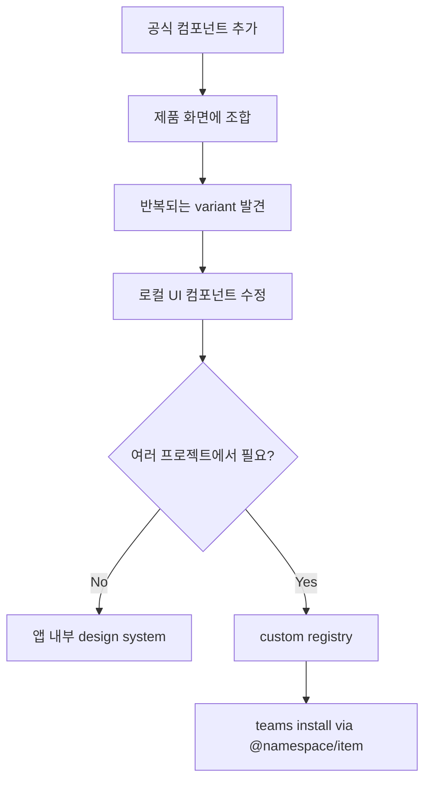

## 11. 주의점과 트레이드오프

### 11.1 장점

- 소스 코드 소유권이 있다.
- 디자인 시스템에 맞춰 깊게 수정할 수 있다.
- 필요한 컴포넌트만 가져온다.
- 접근성 primitive와 Tailwind styling을 함께 활용한다.
- registry로 팀 간 UI 자산 배포가 가능하다.
- AI 코딩 도구가 다루기 좋은 구조다.

### 11.2 단점

- 패키지 라이브러리처럼 버전만 올리면 모든 컴포넌트가 자동 업데이트되는 모델이 아니다.
- 프로젝트에 복사된 컴포넌트는 팀이 유지보수해야 한다.
- 컴포넌트를 많이 커스터마이즈하면 upstream 변경 반영이 수동 작업이 된다.
- 디자인 토큰과 컴포넌트 variant 규칙을 팀이 관리하지 않으면 로컬 UI 코드가 산발적으로 변질될 수 있다.
- registry를 직접 운영하면 schema, 배포, 인증, 버전 고정 전략까지 설계해야 한다.

### 11.3 선택하면 좋은 상황

- Tailwind CSS 기반 React 제품을 빠르게 만들고 싶다.
- 하지만 완제품 라이브러리의 디자인과 API에 갇히고 싶지 않다.
- 팀만의 design system을 만들 계획이 있다.
- UI 코드의 ownership이 중요하다.
- 사내 앱, SaaS dashboard, admin, AI tool, settings, CRUD 화면처럼 실용적인 제품 UI가 많다.

### 11.4 피하는 게 나은 상황

- 팀이 UI 소스 유지보수를 전혀 하고 싶지 않다.
- 패키지 버전 업데이트로 모든 컴포넌트를 중앙 관리하는 모델이 꼭 필요하다.
- Tailwind CSS를 쓰지 않거나, Tailwind 도입 자체가 조직적으로 맞지 않는다.
- 디자인 시스템보다 빠른 prototype용 완성형 component suite가 더 중요하다.

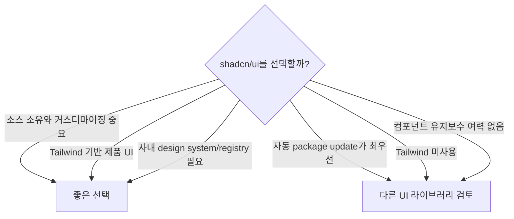

## 12. 빠른 실무 체크리스트

- 새 프로젝트라면 먼저 `shadcn/create` 또는 `init -t [framework]`로 시작한다.
- 초기 style/base color/css variables 선택은 나중에 바꾸기 어렵다고 보고 결정한다.
- Tailwind v4 프로젝트에서는 `tailwind.config`가 빈 값일 수 있음을 이해한다.
- `components.json`의 aliases가 실제 `tsconfig.json`, `jsconfig.json`, `package.json#imports`와 맞는지 확인한다.
- 컴포넌트 추가 전에는 `--dry-run`이나 `--diff`를 활용한다.
- destructive confirmation은 일반 `Dialog`보다 `AlertDialog`를 우선한다.
- loading/error/empty state도 `Skeleton`, `Alert`, `Empty` 등으로 일관되게 처리한다.
- 팀 전용 variant를 추가할 때는 `cva`와 `cn()` 규칙을 유지한다.
- private registry를 쓸 때 token은 환경 변수로 주입하고 repository에 직접 쓰지 않는다.
- GitHub registry를 쓸 때 reproducibility가 중요하면 tag 또는 full commit SHA로 고정한다.

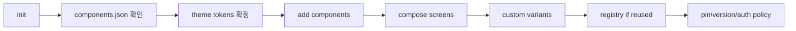

## 13. 용어 정리

- `shadcn/ui`
  - 접근성 있는 UI 컴포넌트와 code distribution platform.
- `shadcn CLI`
  - `init`, `add`, `docs`, `info`, `migrate`, `build` 등을 수행하는 CLI.
- Open Code
  - 컴포넌트 소스를 프로젝트가 직접 소유하는 모델.
- Registry
  - 컴포넌트, 훅, 페이지, 설정, 테마, 파일을 배포하기 위한 schema 기반 시스템.
- `components.json`
  - CLI가 프로젝트 구조, Tailwind 설정, alias, registry를 이해하는 설정 파일.
- `cn()`
  - `clsx`와 `tailwind-merge`를 조합해 조건부 class를 병합하는 유틸.
- Primitive
  - Dialog, Select, Tooltip 같은 접근성 동작의 기반 레이어. Radix UI 또는 Base UI가 담당한다.
- CSS Variables
  - theme token을 CSS 변수로 정의하고 Tailwind utility에 연결하는 방식.
- OKLCH
  - Tailwind v4 흐름에서 shadcn 기본 색상 토큰에 사용되는 색공간.
- `new-york`
  - 현재 권장되는 shadcn 스타일 계열.

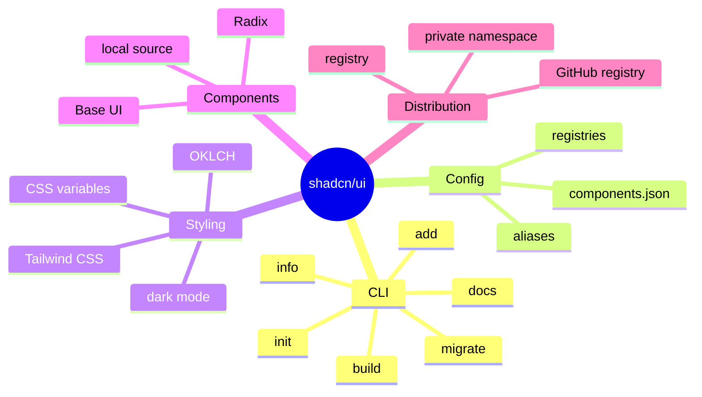

## 참고 링크

- [shadcn/ui Introduction](https://ui.shadcn.com/docs)
- [shadcn CLI](https://ui.shadcn.com/docs/cli)
- [shadcn Installation](https://ui.shadcn.com/docs/installation)
- [shadcn Next.js installation](https://ui.shadcn.com/docs/installation/next)
- [shadcn Vite installation](https://ui.shadcn.com/docs/installation/vite)
- [components.json](https://ui.shadcn.com/docs/components-json)
- [Theming](https://ui.shadcn.com/docs/theming)
- [Tailwind v4](https://ui.shadcn.com/docs/tailwind-v4)
- [Dark Mode for Next.js](https://ui.shadcn.com/docs/dark-mode/next)
- [Button component docs](https://ui.shadcn.com/docs/components/button)
- [Registry Introduction](https://ui.shadcn.com/docs/registry)
- [Registry Namespaces](https://ui.shadcn.com/docs/registry/namespace)
- [registry-item.json](https://ui.shadcn.com/docs/registry/registry-item-json)
- [Changelog](https://ui.shadcn.com/docs/changelog)
- [March 2026 - shadcn/cli v4](https://ui.shadcn.com/docs/changelog/2026-03-cli-v4)
- [GitHub repository: shadcn-ui/ui](https://github.com/shadcn-ui/ui)

<!-- study-links:start -->
## 관련 문서

- `react`: [[react/react|React 상세 정리]]
- `vite`: [[vite/vite|Vite]]
- `sha`: [[sha-256/sha-256|SHA-256]]
- `css`: [[tailwindcss/tailwindcss|Tailwind CSS 상세 정리]]
<!-- study-links:end -->
