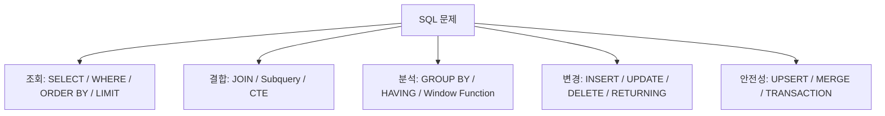

# 반드시 알아둬야 할 SQL 쿼리 정리

작성 기준일: 2026-04-14  
조사 방식: 웹검색 기반 최신 조사  
주요 참고: `postgresql.org` 공식 문서, `learn.microsoft.com` 공식 SQL Server 문서, `dev.mysql.com` 공식 문서

## 1. 문서 목적

이 문서는 SQL을 처음 배우는 사람부터 이미 어느 정도 써 본 사람까지, "실무에서 반드시 알아야 하는 SQL 쿼리가 무엇이고 왜 중요한지"를 한 번에 연결해서 이해할 수 있도록 정리한 학습 문서다.

중점은 아래와 같다.

- 단순 문법 암기가 아니라 쿼리의 역할을 이해하기
- 어떤 상황에서 어떤 쿼리 패턴을 꺼내야 하는지 익히기
- SQL 표준 개념과 주요 DBMS 차이를 함께 보기
- 실무에서 자주 실수하는 포인트까지 같이 정리하기

이 문서는 특히 아래 질문에 답하도록 구성했다.

- 조회할 때 가장 먼저 떠올려야 하는 쿼리는 무엇인가
- 집계와 JOIN은 어떻게 읽고 써야 하는가
- 서브쿼리와 CTE는 언제 쓰는가
- 윈도 함수는 왜 중요한가
- `INSERT`, `UPDATE`, `DELETE`를 안전하게 쓰려면 무엇을 조심해야 하나
- UPSERT와 MERGE는 어떤 문제를 해결하나
- 트랜잭션은 왜 쿼리와 함께 이해해야 하나

---

## 2. 어떤 쿼리를 "반드시 알아야 한다"고 보는가



SQL에는 기능이 많다. 하지만 실무에서 반드시 알고 있어야 하는 쿼리는 생각보다 명확하다.

핵심 축은 아래다.

- `SELECT`
- `WHERE`
- `ORDER BY`
- `LIMIT` / `FETCH` / `TOP`
- `DISTINCT`
- `GROUP BY`
- `HAVING`
- `JOIN`
- `UNION` / `INTERSECT` / `EXCEPT`
- `subquery`
- `CTE (WITH)`
- `window function`
- `INSERT`
- `UPDATE`
- `DELETE`
- `UPSERT` (`ON CONFLICT`, `MERGE`)
- `RETURNING`
- `BEGIN` / `COMMIT` / `ROLLBACK`

즉 SQL을 잘 쓴다는 것은:

- 데이터를 "읽는" 쿼리
- 데이터를 "바꾸는" 쿼리
- 여러 쿼리를 "안전하게 묶는" 트랜잭션

을 모두 이해하는 것이다.

---

## 3. 예시 테이블

설명을 통일하기 위해 아래 같은 단순 예시 테이블을 가정한다.

```sql
users (
  id,
  name,
  email,
  status,
  created_at
)

orders (
  id,
  user_id,
  total_amount,
  status,
  created_at
)

order_items (
  id,
  order_id,
  product_id,
  quantity,
  unit_price
)

products (
  id,
  name,
  category,
  price,
  stock
)
```

이 예시만으로도 대부분의 핵심 쿼리 패턴을 설명할 수 있다.

---

## 4. `SELECT`: SQL의 출발점

### 4.1 가장 기본 형태

가장 기본 쿼리는 아래다.

```sql
SELECT id, name, email
FROM users;
```

이 쿼리가 하는 일:

- `users` 테이블에서
- `id`, `name`, `email` 컬럼만 골라
- 결과 집합으로 반환

즉 SQL의 핵심은 "테이블에서 원하는 컬럼과 행을 선언적으로 고른다"는 데 있다.

### 4.2 `SELECT *`는 왜 조심해야 하나

공식 PostgreSQL 튜토리얼도 `SELECT *`가 일회성 확인에는 편하지만 production code에서는 좋지 않은 스타일이라고 설명한다.

이유:

- 불필요한 컬럼까지 읽는다
- 테이블 컬럼이 추가되면 결과 구조가 바뀐다
- 네트워크와 메모리 사용량이 늘어난다
- JOIN 시 중복 컬럼 때문에 혼란이 커진다

즉 실무에서는 가능하면 필요한 컬럼만 명시하는 편이 좋다.

나쁜 예:

```sql
SELECT *
FROM users;
```

더 나은 예:

```sql
SELECT id, name, email
FROM users;
```

### 4.3 계산식과 alias

`SELECT`는 단순 컬럼 선택만 하는 것이 아니다.

계산도 가능하다.

```sql
SELECT
  id,
  name,
  price,
  price * 1.1 AS price_with_tax
FROM products;
```

여기서 `AS`는 출력 컬럼 이름(alias)을 붙이는 역할을 한다.

실무에서는 alias를 적극적으로 쓰는 편이 좋다.

- 계산 결과 의미가 분명해진다
- 프런트엔드/백엔드 코드에서 읽기 쉬워진다
- 집계 결과 컬럼 이름을 명확히 할 수 있다

---

## 5. `WHERE`: 원하는 행만 고르기

### 5.1 가장 기본적인 필터

```sql
SELECT id, name, email
FROM users
WHERE status = 'ACTIVE';
```

즉:

- 모든 행을 가져오는 것이 아니라
- 조건을 만족하는 행만 가져온다

SQL 실무에서 대부분의 조회는 결국 `WHERE`가 핵심이다.

### 5.2 비교 연산자

자주 쓰는 조건:

- `=`
- `!=` 또는 `<>`
- `>`
- `<`
- `>=`
- `<=`

예:

```sql
SELECT id, total_amount
FROM orders
WHERE total_amount >= 100000;
```

### 5.3 논리 연산

`AND`, `OR`, `NOT`도 기본이다.

```sql
SELECT id, name, status
FROM users
WHERE status = 'ACTIVE'
  AND created_at >= DATE '2026-01-01';
```

```sql
SELECT id, name
FROM users
WHERE status = 'ACTIVE'
   OR status = 'PENDING';
```

조건이 복잡할수록 괄호를 명확히 써 주는 것이 좋다.

### 5.4 `IN`, `BETWEEN`, `LIKE`, `IS NULL`

실무에서 매우 자주 쓰는 패턴이다.

```sql
SELECT id, status
FROM orders
WHERE status IN ('PAID', 'SHIPPED', 'DELIVERED');
```

```sql
SELECT id, created_at
FROM orders
WHERE created_at BETWEEN DATE '2026-01-01' AND DATE '2026-01-31';
```

```sql
SELECT id, name
FROM products
WHERE name LIKE 'Mac%';
```

```sql
SELECT id, name
FROM users
WHERE email IS NULL;
```

특히 `NULL` 비교는 실수하기 쉽다.

잘못된 예:

```sql
WHERE email = NULL
```

올바른 예:

```sql
WHERE email IS NULL
```

### 5.5 `WHERE`와 성능

기본 원칙:

- 먼저 필터링하고
- 나중에 정렬/집계하는 것이 유리한 경우가 많다

또한 인덱스가 걸린 컬럼에 적절한 `WHERE` 조건을 쓰면 큰 성능 차이가 난다.

즉 `WHERE`는 단순 필터가 아니라 성능에도 직접 연결된다.

---

## 6. `ORDER BY`: 결과 순서 정하기

### 6.1 순서를 지정하지 않으면 순서는 보장되지 않는다

이건 매우 중요하다.

공식 PostgreSQL 문서도 `ORDER BY`가 없으면 결과 순서는 시스템이 가장 빠르다고 판단한 방식에 따라 달라질 수 있다고 설명한다.

즉:

- "지금은 이렇게 나오네"
- "항상 최신순이겠지"

라고 생각하면 안 된다.

### 6.2 기본 사용

```sql
SELECT id, created_at
FROM orders
ORDER BY created_at DESC;
```

정렬 방향:

- `ASC`: 오름차순
- `DESC`: 내림차순

### 6.3 다중 정렬

```sql
SELECT id, status, created_at
FROM orders
ORDER BY status ASC, created_at DESC;
```

즉:

- 먼저 `status`
- 같은 status 안에서는 `created_at DESC`

로 정렬한다.

### 6.4 `LIMIT`와 함께 쓸 때는 더 중요하다

공식 PostgreSQL `SELECT` 문서는 `LIMIT`를 쓸 때는 `ORDER BY`로 유일하고 예측 가능한 순서를 잡는 것이 좋다고 강조한다.

즉 아래는 위험하다.

```sql
SELECT *
FROM orders
LIMIT 10;
```

안전한 형태:

```sql
SELECT id, user_id, total_amount, created_at
FROM orders
ORDER BY created_at DESC, id DESC
LIMIT 10;
```

---

## 7. `LIMIT`, `FETCH`, `TOP`: 행 수 제한

이 부분은 DBMS별 차이를 같이 알아야 한다.

### 7.1 PostgreSQL / MySQL 계열

```sql
SELECT id, name
FROM users
ORDER BY id
LIMIT 10;
```

### 7.2 SQL 표준 / PostgreSQL 지원 문법

PostgreSQL 문서는 SQL:2008 표준형인 `FETCH FIRST`도 지원한다고 설명한다.

```sql
SELECT id, name
FROM users
ORDER BY id
FETCH FIRST 10 ROWS ONLY;
```

### 7.3 SQL Server 계열

Microsoft Learn 문서는 SQL Server에서 `TOP`을 사용한다고 설명한다.

```sql
SELECT TOP (10) id, name
FROM users
ORDER BY id;
```

### 7.4 중요한 실무 포인트

- `TOP`, `LIMIT`, `FETCH`는 "몇 행만 보겠다"는 뜻이다.
- 하지만 `ORDER BY`가 없으면 어떤 행이 먼저 나올지 예측할 수 없다.
- 즉 "상위 10개"가 아니라 그냥 "아무 10개"가 될 수 있다.

실무에서는 페이지네이션, 최신 1건 조회, 최근 로그 100건 조회 등에 필수다.

---

## 8. `DISTINCT`: 중복 제거

### 8.1 기본 사용

```sql
SELECT DISTINCT status
FROM orders;
```

이 쿼리는 주문 상태 종류만 중복 없이 뽑아낸다.

### 8.2 언제 유용한가

- 유니크한 상태 목록
- 카테고리 목록
- 특정 조합의 중복 제거

예:

```sql
SELECT DISTINCT user_id
FROM orders;
```

### 8.3 주의할 점

`DISTINCT`는 편하지만 남용하면 안 된다.

왜냐하면:

- JOIN이 잘못돼 중복이 생긴 것을 숨길 수 있고
- 결과는 맞는 것처럼 보여도 원인이 가려질 수 있다

즉 `DISTINCT`는 "중복을 의도적으로 제거"할 때 쓰고, JOIN 오류를 가리는 용도로 쓰면 안 된다.

---

## 9. `GROUP BY`와 집계 함수

### 9.1 집계 함수란

공식 PostgreSQL 문서는 `count`, `sum`, `avg`, `max`, `min` 같은 함수가 여러 행을 받아 하나의 값을 만드는 aggregate function이라고 설명한다.

예:

```sql
SELECT COUNT(*) AS order_count
FROM orders;
```

```sql
SELECT AVG(total_amount) AS avg_amount
FROM orders;
```

### 9.2 `GROUP BY`의 의미

`GROUP BY`는 여러 행을 특정 기준으로 묶는다.

```sql
SELECT
  status,
  COUNT(*) AS cnt
FROM orders
GROUP BY status;
```

즉 상태별 주문 개수를 본다.

### 9.3 실무에서 자주 쓰는 집계 패턴

```sql
SELECT
  user_id,
  COUNT(*) AS order_count,
  SUM(total_amount) AS total_spent,
  MAX(created_at) AS last_order_at
FROM orders
GROUP BY user_id;
```

이 패턴은:

- 사용자별 주문 횟수
- 총 구매액
- 마지막 주문 시각

같은 KPI를 뽑을 때 자주 쓴다.

### 9.4 `WHERE`와 `HAVING`의 차이

이건 반드시 알아야 한다.

- `WHERE`: 그룹 만들기 전, 행을 필터링
- `HAVING`: 그룹 만든 후, 집계 결과를 필터링

예:

```sql
SELECT
  user_id,
  COUNT(*) AS order_count
FROM orders
WHERE status = 'PAID'
GROUP BY user_id
HAVING COUNT(*) >= 3;
```

의미:

- 먼저 `PAID` 주문만 고르고
- 사용자별로 묶고
- 3번 이상 결제한 사용자만 남긴다

### 9.5 왜 `WHERE`에 aggregate를 못 쓰는가

PostgreSQL 튜토리얼도 aggregate는 `WHERE`에서 바로 쓸 수 없다고 설명한다.

왜냐하면:

- `WHERE`는 어떤 행을 집계에 포함할지 먼저 정하고
- aggregate는 그 뒤에 계산되기 때문이다

즉 실행 순서 차이다.

---

## 10. `JOIN`: 여러 테이블을 연결하기

### 10.1 왜 중요한가

실무 SQL의 핵심은 대부분 JOIN이다.

데이터는 보통 정규화되어:

- 사용자 정보는 `users`
- 주문은 `orders`
- 주문 상품은 `order_items`
- 상품 정보는 `products`

처럼 나뉘어 있기 때문이다.

즉 원하는 보고서를 만들려면 결국 테이블을 연결해야 한다.

### 10.2 `INNER JOIN`

가장 기본 JOIN이다.

```sql
SELECT
  o.id,
  u.name,
  o.total_amount
FROM orders o
JOIN users u
  ON o.user_id = u.id;
```

의미:

- 주문과 사용자 테이블을 연결
- 매칭되는 경우만 결과에 포함

### 10.3 `LEFT JOIN`

왼쪽 테이블은 모두 남기고, 오른쪽 테이블은 있으면 붙인다.

```sql
SELECT
  u.id,
  u.name,
  o.id AS order_id
FROM users u
LEFT JOIN orders o
  ON o.user_id = u.id;
```

이 쿼리는:

- 주문이 없는 사용자도 보여 준다
- 주문이 없으면 `order_id`는 `NULL`이다

### 10.4 `JOIN`할 때 컬럼은 명시적으로

PostgreSQL 튜토리얼도 JOIN에서는 컬럼 이름 충돌을 피하려고 테이블명을 명시적으로 적는 것이 좋은 스타일이라고 설명한다.

즉 이런 식이 좋다.

```sql
SELECT
  o.id,
  o.created_at,
  u.name
FROM orders o
JOIN users u
  ON o.user_id = u.id;
```

### 10.5 JOIN 실무 패턴

#### 사용자와 주문

```sql
SELECT
  u.id,
  u.name,
  o.id AS order_id,
  o.total_amount
FROM users u
JOIN orders o
  ON u.id = o.user_id;
```

#### 주문과 주문상품과 상품

```sql
SELECT
  o.id AS order_id,
  p.name AS product_name,
  oi.quantity,
  oi.unit_price
FROM orders o
JOIN order_items oi
  ON o.id = oi.order_id
JOIN products p
  ON oi.product_id = p.id;
```

### 10.6 JOIN 실수

가장 흔한 실수:

- `ON` 조건을 잘못 씀
- 조건이 빠져 cartesian product가 남
- `LEFT JOIN` 후 `WHERE`에서 오른쪽 컬럼 필터를 걸어 사실상 `INNER JOIN`처럼 됨

예를 들어:

```sql
SELECT *
FROM users u
LEFT JOIN orders o
  ON u.id = o.user_id
WHERE o.status = 'PAID';
```

이 쿼리는 주문이 없는 사용자 행을 제거해 버리므로, 의도와 다를 수 있다.

이럴 때는 보통 `ON` 조건으로 옮길지, `WHERE`가 맞는지 다시 판단해야 한다.

---

## 11. 서브쿼리

### 11.1 서브쿼리란

서브쿼리는 쿼리 안에 들어가는 또 다른 쿼리다.

예:

```sql
SELECT *
FROM users
WHERE id IN (
  SELECT user_id
  FROM orders
  WHERE status = 'PAID'
);
```

의미:

- 결제 완료 주문이 있는 사용자만 찾는다

### 11.2 `IN` 서브쿼리

자주 쓰는 패턴:

```sql
SELECT id, name
FROM users
WHERE id IN (
  SELECT user_id
  FROM orders
);
```

### 11.3 `EXISTS`

공식 PostgreSQL 문서는 `EXISTS(subquery)`가 서브쿼리가 한 행이라도 반환하면 참이라고 설명한다.

실무에서는 `EXISTS`가 매우 중요하다.

```sql
SELECT u.id, u.name
FROM users u
WHERE EXISTS (
  SELECT 1
  FROM orders o
  WHERE o.user_id = u.id
    AND o.status = 'PAID'
);
```

이 패턴은:

- "연결된 행이 하나라도 있는가"

를 묻는 데 매우 적합하다.

### 11.4 `NOT EXISTS`

없는 경우를 찾는 데도 자주 쓴다.

```sql
SELECT u.id, u.name
FROM users u
WHERE NOT EXISTS (
  SELECT 1
  FROM orders o
  WHERE o.user_id = u.id
);
```

즉 주문이 한 번도 없는 사용자를 찾는다.

### 11.5 서브쿼리 vs JOIN

둘 다 가능할 때가 많다.

대체로:

- 존재 여부 확인: `EXISTS`
- 결과를 실제로 붙여야 함: `JOIN`
- 복잡한 단계 분리: `CTE`

식으로 생각하면 편하다.

---

## 12. CTE: `WITH`

### 12.1 CTE란

공식 PostgreSQL 문서는 `WITH`를 Common Table Expressions라고 설명하며, 큰 쿼리 안에서 보조 쿼리를 이름 붙여 재사용하는 방식이라고 설명한다.

즉 "한 번 쓰는 임시 결과에 이름을 붙인다"는 느낌이다.

### 12.2 기본 형태

```sql
WITH paid_orders AS (
  SELECT *
  FROM orders
  WHERE status = 'PAID'
)
SELECT user_id, COUNT(*) AS cnt
FROM paid_orders
GROUP BY user_id;
```

장점:

- 긴 쿼리를 단계별로 읽기 쉽다
- 복잡한 비즈니스 로직을 쪼갤 수 있다
- 디버깅이 쉬워진다

### 12.3 CTE를 언제 쓰는가

적합한 경우:

- 복잡한 쿼리를 단계별로 나누고 싶을 때
- 같은 중간 결과를 여러 번 참조할 때
- 재귀 쿼리를 작성할 때

### 12.4 재귀 CTE

공식 PostgreSQL 문서는 재귀 CTE가 계층형 데이터에 자주 쓰인다고 설명한다.

예:

```sql
WITH RECURSIVE category_tree AS (
  SELECT id, parent_id, name, 1 AS depth
  FROM categories
  WHERE parent_id IS NULL

  UNION ALL

  SELECT c.id, c.parent_id, c.name, ct.depth + 1
  FROM categories c
  JOIN category_tree ct
    ON c.parent_id = ct.id
)
SELECT *
FROM category_tree;
```

이건:

- 조직도
- 카테고리 트리
- 댓글 대댓글 구조

같은 계층형 데이터를 다룰 때 중요하다.

### 12.5 CTE를 남용하면 안 되는 이유

읽기에는 좋아도:

- 너무 많은 CTE는 오히려 복잡해질 수 있고
- DBMS에 따라 최적화 방식이 다를 수 있다

즉 "읽기 쉬움"과 "과도한 분해" 사이 균형이 필요하다.

---

## 13. 집합 연산: `UNION`, `INTERSECT`, `EXCEPT`

### 13.1 `UNION`

둘 이상의 `SELECT` 결과를 합친다.

```sql
SELECT email
FROM users
UNION
SELECT email
FROM newsletter_subscribers;
```

기본 `UNION`은 중복을 제거한다.

### 13.2 `UNION ALL`

중복 제거 없이 그냥 붙인다.

```sql
SELECT email
FROM users
UNION ALL
SELECT email
FROM newsletter_subscribers;
```

실무에서는 성능과 의미상 `UNION ALL`이 더 적절한 경우도 많다.

### 13.3 `INTERSECT`

교집합이다.

```sql
SELECT email
FROM users
INTERSECT
SELECT email
FROM newsletter_subscribers;
```

즉 양쪽에 모두 존재하는 이메일만 찾는다.

### 13.4 `EXCEPT`

차집합이다.

```sql
SELECT email
FROM users
EXCEPT
SELECT email
FROM newsletter_subscribers;
```

즉 사용자 중 뉴스레터 구독자가 아닌 사람만 찾는다.

### 13.5 언제 유용한가

- 두 데이터 집합 비교
- 중복/누락 검출
- 배치 검증
- 마케팅 대상 추출

---

## 14. 윈도 함수

### 14.1 왜 중요한가

SQL을 "중급 이상"으로 끌어올리는 대표 기능이 윈도 함수다.

공식 PostgreSQL 문서는 윈도 함수가 집계 함수와 비슷하지만, 그룹으로 행을 뭉개지 않고 각 행의 정체성을 유지한 채 계산한다고 설명한다.

즉:

- 집계처럼 계산하지만
- 행은 사라지지 않는다

이게 핵심이다.

### 14.2 `ROW_NUMBER()`

```sql
SELECT
  user_id,
  created_at,
  ROW_NUMBER() OVER (
    PARTITION BY user_id
    ORDER BY created_at DESC
  ) AS rn
FROM orders;
```

의미:

- 사용자별로
- 최신 주문부터 번호를 매긴다

실무에서는 "각 사용자당 최신 1건"을 뽑을 때 자주 쓴다.

```sql
WITH ranked_orders AS (
  SELECT
    o.*,
    ROW_NUMBER() OVER (
      PARTITION BY user_id
      ORDER BY created_at DESC, id DESC
    ) AS rn
  FROM orders o
)
SELECT *
FROM ranked_orders
WHERE rn = 1;
```

### 14.3 `RANK()` / `DENSE_RANK()`

순위를 매길 때 쓴다.

```sql
SELECT
  id,
  name,
  price,
  RANK() OVER (ORDER BY price DESC) AS price_rank
FROM products;
```

### 14.4 이동 평균 / 누적 합

```sql
SELECT
  created_at::date AS dt,
  total_amount,
  SUM(total_amount) OVER (
    ORDER BY created_at::date
  ) AS running_total
FROM orders;
```

이건 누적 매출 계산에 유용하다.

### 14.5 부서 평균 비교 같은 패턴

PostgreSQL 튜토리얼은 `avg(...) OVER (PARTITION BY ...)` 예제로 "현재 행과 같은 그룹 평균" 비교를 설명한다.

실무 예시:

```sql
SELECT
  category,
  name,
  price,
  AVG(price) OVER (PARTITION BY category) AS category_avg_price
FROM products;
```

### 14.6 언제 필수인가

윈도 함수는 아래 상황에서 사실상 필수다.

- 그룹별 최신 1건
- 순위
- 누적 합계
- 이전/다음 행 비교
- 이동 평균

즉 분석 쿼리에서 정말 자주 등장한다.

---

## 15. `INSERT`

### 15.1 기본 삽입

```sql
INSERT INTO users (name, email, status)
VALUES ('Kim', 'kim@example.com', 'ACTIVE');
```

실무에서는 컬럼 목록을 명시하는 습관이 중요하다.

나쁜 예:

```sql
INSERT INTO users
VALUES ('Kim', 'kim@example.com', 'ACTIVE');
```

왜냐하면:

- 컬럼 순서 변경에 취약하고
- 기본값/nullable 컬럼 추가 시 깨질 수 있기 때문이다

### 15.2 여러 행 삽입

```sql
INSERT INTO products (name, category, price, stock)
VALUES
  ('MacBook', 'Laptop', 2000000, 5),
  ('iPad', 'Tablet', 900000, 10),
  ('AirPods', 'Audio', 300000, 30);
```

### 15.3 `INSERT ... SELECT`

이 패턴도 중요하다.

```sql
INSERT INTO paid_users (user_id)
SELECT DISTINCT user_id
FROM orders
WHERE status = 'PAID';
```

즉 조회 결과를 그대로 다른 테이블에 적재할 수 있다.

---

## 16. `UPDATE`

### 16.1 기본 수정

```sql
UPDATE products
SET stock = stock - 1
WHERE id = 1001;
```

### 16.2 여러 컬럼 수정

```sql
UPDATE users
SET
  name = 'Kim Minsu',
  status = 'ACTIVE'
WHERE id = 1;
```

### 16.3 `WHERE` 없는 `UPDATE`는 매우 위험하다

```sql
UPDATE users
SET status = 'INACTIVE';
```

이건 모든 사용자 상태를 바꾼다.

즉 실무에서는 `UPDATE`를 쓸 때 아래를 습관처럼 확인해야 한다.

- `WHERE`가 있는가
- 대상 행 수가 예상과 맞는가
- 먼저 `SELECT`로 동일 조건을 검증했는가

### 16.4 계산형 업데이트

```sql
UPDATE products
SET price = price * 1.05
WHERE category = 'Laptop';
```

이런 패턴은 일괄 가격 조정, 포인트 적립, 잔액 변경 등에 자주 쓰인다.

---

## 17. `DELETE`

### 17.1 기본 삭제

```sql
DELETE FROM orders
WHERE status = 'CANCELED'
  AND created_at < DATE '2025-01-01';
```

### 17.2 `WHERE` 없는 `DELETE`는 매우 위험하다

공식 PostgreSQL 튜토리얼도 qualification 없는 `DELETE FROM tablename`은 모든 행을 지운다고 경고한다.

즉 아래는 대형 사고 패턴이다.

```sql
DELETE FROM orders;
```

### 17.3 실무 안전 절차

보통 아래 순서가 안전하다.

1. 먼저 `SELECT COUNT(*)`로 대상 개수 확인
2. 샘플 `SELECT *`로 대상 행 확인
3. 트랜잭션 안에서 `DELETE`
4. 필요하면 `ROLLBACK` 또는 `COMMIT`

예:

```sql
BEGIN;

SELECT COUNT(*)
FROM orders
WHERE status = 'CANCELED'
  AND created_at < DATE '2025-01-01';

DELETE FROM orders
WHERE status = 'CANCELED'
  AND created_at < DATE '2025-01-01';

ROLLBACK;
```

---

## 18. `RETURNING`: 변경된 행 바로 받기

### 18.1 왜 중요한가

공식 PostgreSQL 문서는 `INSERT`, `UPDATE`, `DELETE`, `MERGE` 뒤에 `RETURNING`을 붙이면 추가 조회 없이 변경된 행 데이터를 바로 받을 수 있다고 설명한다.

이건 매우 실용적이다.

### 18.2 `INSERT ... RETURNING`

```sql
INSERT INTO users (name, email, status)
VALUES ('Lee', 'lee@example.com', 'ACTIVE')
RETURNING id, name, email;
```

이 패턴은:

- 자동 생성된 ID 받기
- 기본값이 채워진 결과 확인

에 자주 쓰인다.

### 18.3 `UPDATE ... RETURNING`

```sql
UPDATE products
SET stock = stock - 1
WHERE id = 1001
RETURNING id, stock;
```

### 18.4 `DELETE ... RETURNING`

```sql
DELETE FROM orders
WHERE id = 5001
RETURNING id, user_id, status;
```

즉 삭제된 데이터를 로깅하거나 후속 처리할 때 유용하다.

---

## 19. UPSERT: `ON CONFLICT`

### 19.1 왜 필요한가

실무에서는 자주 이런 요구가 있다.

- 없으면 INSERT
- 있으면 UPDATE

예전에는 이를 두 쿼리로 처리하며 race condition이 생기곤 했다.

공식 PostgreSQL `INSERT` 문서는 `ON CONFLICT DO UPDATE`가 원자적인 `INSERT or UPDATE` 결과를 보장하며, 이것이 UPSERT라고 설명한다.

### 19.2 기본 예시

```sql
INSERT INTO users (email, name, status)
VALUES ('kim@example.com', 'Kim', 'ACTIVE')
ON CONFLICT (email)
DO UPDATE SET
  name = EXCLUDED.name,
  status = EXCLUDED.status;
```

의미:

- 이메일이 unique라고 가정
- 같은 이메일이 이미 있으면 새로 넣지 않고 갱신

### 19.3 왜 실무에서 중요하나

- 배치 적재
- 외부 시스템 동기화
- 유저 프로필 최신화
- idempotent API 처리

같은 곳에서 필수에 가깝다.

---

## 20. `MERGE`

### 20.1 정체

공식 PostgreSQL 문서는 `MERGE`를 조건에 따라 `INSERT`, `UPDATE`, `DELETE`를 한 문장 안에서 수행하는 SQL 표준 기능이라고 설명한다.

Microsoft Learn 역시 SQL Server에서 `MERGE`가 source와 target을 조인한 뒤 조건에 따라 변경 작업을 수행한다고 설명한다.

### 20.2 기본 예시

```sql
MERGE INTO products p
USING new_products n
ON p.id = n.id
WHEN MATCHED THEN
  UPDATE SET
    name = n.name,
    price = n.price
WHEN NOT MATCHED THEN
  INSERT (id, name, price)
  VALUES (n.id, n.name, n.price);
```

### 20.3 언제 쓰는가

- 두 테이블 동기화
- 대량 배치 merge
- source/target 차이 반영

### 20.4 언제 조심해야 하나

Microsoft Learn은 단순한 경우 `MERGE` 대신 개별 `INSERT`, `UPDATE`, `DELETE`가 성능/확장성 면에서 더 나을 수 있다고도 설명한다.

즉 `MERGE`는 강력하지만:

- 단순한 upsert 1건
- 매우 명확한 케이스

에서는 `ON CONFLICT`나 별도 DML이 더 단순할 수 있다.

---

## 21. 트랜잭션: `BEGIN`, `COMMIT`, `ROLLBACK`

### 21.1 왜 SQL 쿼리와 같이 알아야 하나

조회만 이해하고 트랜잭션을 모르면 실무 SQL 이해가 완성되지 않는다.

왜냐하면:

- 여러 쿼리가 함께 성공해야 할 때
- 중간 단계가 외부에 보이면 안 될 때
- 실패 시 원복돼야 할 때

가 많기 때문이다.

### 21.2 `BEGIN`

공식 PostgreSQL 문서는 `BEGIN` 또는 `START TRANSACTION`이 트랜잭션 블록을 시작한다고 설명한다.

```sql
BEGIN;
```

### 21.3 `COMMIT`

공식 PostgreSQL 문서는 `COMMIT`이 현재 트랜잭션을 확정하고, 변경 내용을 다른 세션에 보이게 하며 durable하게 만든다고 설명한다.

```sql
COMMIT;
```

### 21.4 `ROLLBACK`

공식 PostgreSQL 문서는 `ROLLBACK`이 현재 트랜잭션의 모든 변경을 취소한다고 설명한다.

```sql
ROLLBACK;
```

### 21.5 실무 예시: 주문 생성 + 재고 차감

```sql
BEGIN;

INSERT INTO orders (user_id, total_amount, status)
VALUES (1, 300000, 'PAID');

UPDATE products
SET stock = stock - 1
WHERE id = 1001;

COMMIT;
```

이 흐름이 필요한 이유:

- 주문은 생성됐는데 재고 차감은 실패
- 또는 반대로 재고는 차감됐는데 주문 생성은 실패

같은 반쯤 성공한 상태를 막기 위해서다.

### 21.6 autocommit를 이해해야 한다

PostgreSQL 문서는 기본적으로 각 문장이 자기 own transaction에서 실행되고, 성공 시 자동 commit되는 동작을 autocommit로 설명한다.

즉:

- 단일 쿼리는 별도 `BEGIN` 없이도 동작
- 하지만 여러 쿼리를 하나의 작업 단위로 묶고 싶으면 `BEGIN`이 필요

하다.

---

## 22. 고급이지만 반드시 알아둘 패턴

### 22.1 `FOR UPDATE`

PostgreSQL `SELECT` 문서는 locking clause로 `FOR UPDATE` 등을 설명한다.

이건 동시성 제어에서 중요하다.

예:

```sql
SELECT *
FROM products
WHERE id = 1001
FOR UPDATE;
```

즉 해당 행을 수정하려는 다른 트랜잭션과 충돌을 제어할 수 있다.

주로:

- 재고 차감
- 포인트 차감
- 큐 처리

같은 곳에서 중요하다.

### 22.2 `SKIP LOCKED`

작업 큐 패턴에서도 자주 본다.

예:

```sql
SELECT id
FROM jobs
WHERE status = 'PENDING'
ORDER BY id
FOR UPDATE SKIP LOCKED
LIMIT 1;
```

의미:

- 이미 다른 워커가 잡은 행은 건너뛰고
- 내가 처리할 다음 작업 하나를 가져온다

즉 SQL만으로도 간단한 job queue 패턴을 만들 수 있다.

### 22.3 페이지네이션: `OFFSET`의 한계

```sql
SELECT id, created_at
FROM orders
ORDER BY created_at DESC, id DESC
LIMIT 20 OFFSET 40;
```

이 패턴은 쉽지만:

- 페이지가 깊어질수록 비효율적일 수 있고
- 중간에 데이터가 삽입/삭제되면 중복/누락이 생길 수 있다

그래서 실무에서는 keyset pagination도 자주 쓴다.

예:

```sql
SELECT id, created_at
FROM orders
WHERE (created_at, id) < ('2026-04-14 10:00:00', 9999)
ORDER BY created_at DESC, id DESC
LIMIT 20;
```

---

## 23. 실무에서 반드시 구분해야 하는 문법 차이

### 23.1 행 제한 문법

- PostgreSQL / MySQL: `LIMIT`
- SQL 표준 / PostgreSQL: `FETCH FIRST ... ROWS ONLY`
- SQL Server: `TOP`

즉 SQL은 "완전히 동일한 언어"가 아니라 dialect 차이가 있다.

### 23.2 UPSERT 문법

- PostgreSQL: `INSERT ... ON CONFLICT`
- SQL Server: `MERGE`
- MySQL: `INSERT ... ON DUPLICATE KEY UPDATE`

즉 같은 요구사항이라도 DBMS마다 쓰는 문법이 다르다.

### 23.3 반환 문법

- PostgreSQL: `RETURNING`
- SQL Server: `OUTPUT`

이런 차이도 실무에서는 중요하다.

즉 SQL 개념과 벤더 문법을 분리해서 기억해야 한다.

---

## 24. 꼭 기억해야 하는 실전 체크리스트

### 24.1 조회 쿼리

- `SELECT *` 대신 필요한 컬럼만 적기
- `LIMIT`를 쓸 때는 `ORDER BY` 같이 쓰기
- JOIN에서는 alias와 컬럼 출처를 명확히 적기

### 24.2 집계 쿼리

- `WHERE`와 `HAVING` 차이 구분하기
- 중복이 생기는 JOIN 후 집계가 아닌지 확인하기
- 윈도 함수가 더 적합한지 검토하기

### 24.3 변경 쿼리

- `UPDATE` / `DELETE` 전에 동일 조건 `SELECT` 먼저 실행하기
- 대상 건수 확인하기
- 가능하면 트랜잭션 안에서 검증하기
- 필요한 경우 `RETURNING`으로 실제 변경 행 확인하기

### 24.4 동시성

- 재고/잔액/큐 처리에는 트랜잭션과 row lock 고려하기
- upsert는 race condition 없이 원자적으로 처리하기

---

## 25. 추천 학습 순서

SQL을 처음부터 다시 잡는다면 아래 순서가 좋다.

### 1단계: 조회 기초

- `SELECT`
- `FROM`
- `WHERE`
- `ORDER BY`
- `LIMIT`
- `DISTINCT`

### 2단계: 집계와 JOIN

- `COUNT`, `SUM`, `AVG`, `MIN`, `MAX`
- `GROUP BY`
- `HAVING`
- `INNER JOIN`, `LEFT JOIN`

### 3단계: 중급 조회

- 서브쿼리
- `EXISTS`
- `UNION`, `INTERSECT`, `EXCEPT`
- `WITH`

### 4단계: 분석 쿼리

- `ROW_NUMBER`
- `RANK`
- `SUM() OVER`
- `PARTITION BY`

### 5단계: 데이터 변경

- `INSERT`
- `UPDATE`
- `DELETE`
- `RETURNING`
- UPSERT / MERGE

### 6단계: 안전성과 동시성

- `BEGIN`
- `COMMIT`
- `ROLLBACK`
- `FOR UPDATE`
- `SKIP LOCKED`

이 순서대로 가면 "읽는 SQL"에서 "운영 가능한 SQL"로 올라갈 수 있다.

---

## 26. 한 문장 결론

실무에서 반드시 알아야 하는 SQL 쿼리는 단순히 `SELECT`만이 아니라, `JOIN`, `GROUP BY`, `CTE`, `WINDOW FUNCTION`, `INSERT/UPDATE/DELETE`, `UPSERT`, `TRANSACTION`까지 포함한 "데이터를 읽고, 조합하고, 바꾸고, 안전하게 확정하는 언어 전체"다.

즉 SQL을 잘 쓴다는 것은:

- 정확하게 조회하고
- 올바르게 집계하고
- 안전하게 수정하고
- 동시성까지 고려하는 것

이라고 정리할 수 있다.

---

## 27. 공식 출처

- PostgreSQL Tutorial - Querying a Table: <https://www.postgresql.org/docs/current/tutorial-select.html>
- PostgreSQL Tutorial - Joins Between Tables: <https://www.postgresql.org/docs/current/tutorial-join.html>
- PostgreSQL Tutorial - Aggregate Functions: <https://www.postgresql.org/docs/14/tutorial-agg.html>
- PostgreSQL SELECT: <https://www.postgresql.org/docs/current/sql-select.html>
- PostgreSQL WITH Queries (CTE): <https://www.postgresql.org/docs/17/queries-with.html>
- PostgreSQL Window Functions Tutorial: <https://www.postgresql.org/docs/current/tutorial-window.html>
- PostgreSQL INSERT / ON CONFLICT: <https://www.postgresql.org/docs/current/sql-insert.html>
- PostgreSQL Updates Tutorial: <https://www.postgresql.org/docs/17/tutorial-update.html>
- PostgreSQL Deletions Tutorial: <https://www.postgresql.org/docs/current/tutorial-delete.html>
- PostgreSQL RETURNING: <https://www.postgresql.org/docs/current/dml-returning.html>
- PostgreSQL MERGE: <https://www.postgresql.org/docs/current/sql-merge.html>
- PostgreSQL START TRANSACTION: <https://www.postgresql.org/docs/16/sql-start-transaction.html>
- PostgreSQL COMMIT: <https://www.postgresql.org/docs/current/sql-commit.html>
- PostgreSQL ROLLBACK: <https://www.postgresql.org/docs/current/sql-rollback.html>
- SQL Server SELECT: <https://learn.microsoft.com/en-us/sql/t-sql/queries/select-transact-sql?view=sql-server-ver16>
- SQL Server TOP: <https://learn.microsoft.com/es-es/sql/t-sql/queries/top-transact-sql?view=sql-server-ver17>
- SQL Server MERGE: <https://learn.microsoft.com/en-us/sql/t-sql/statements/merge-transact-sql?view=sql-server-ver16>
- MySQL LIMIT optimization reference: <https://dev.mysql.com/doc/refman/8.4/en/limit-optimization.html>
