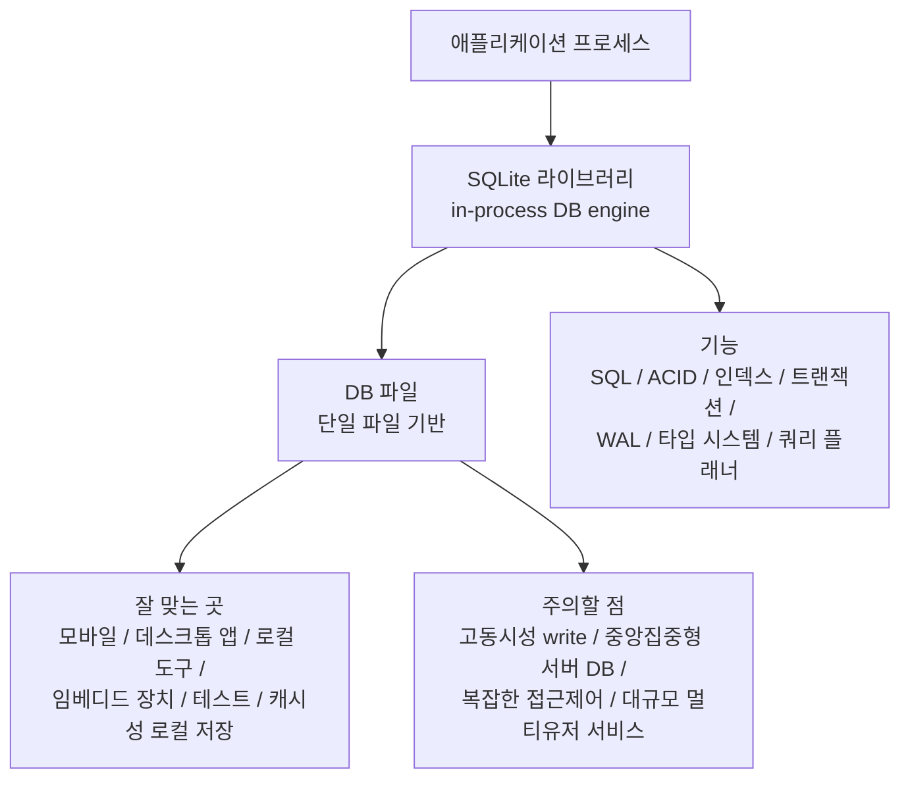

# SQLite 상세 정리

작성 기준일: 2026-04-13  
주요 참고: `sqlite.org` 공식 문서

## 1. 한 줄 요약

`SQLite`는 별도의 DB 서버 프로세스 없이 애플리케이션 프로세스 안에서 직접 동작하는 `임베디드 관계형 데이터베이스 엔진`이다.

짧게 말하면:

- 설치와 운영이 매우 단순하고
- 단일 파일 기반으로 이식성이 뛰어나며
- ACID 트랜잭션을 지원하고
- 모바일, 데스크톱 앱, 로컬 도구, 엣지 디바이스, 테스트 환경에 특히 강한
- `serverless SQL database engine`

이라고 보면 된다.

---

## 2. 먼저 큰 그림

이 그림에서 제일 중요한 포인트는 두 가지다.

- SQLite는 `서버형 DB`가 아니라 `라이브러리`다
- 따라서 장점도 단순성/이식성 쪽에 있고, 약점도 중앙집중형 대규모 동시성 쪽에 있다

---

## 3. SQLite는 정확히 무엇인가

공식 `About SQLite` 문서는 SQLite를 이렇게 설명한다.

- `in-process library`
- `self-contained`
- `serverless`
- `zero-configuration`
- `transactional SQL database engine`

즉 SQLite는:

- MySQL처럼 서버를 띄우는 DB가 아니라
- 애플리케이션이 링크해서 사용하는 라이브러리

다.

이 차이는 매우 크다.

왜냐하면 대부분의 관계형 DB는:

- DB 서버 프로세스
- 네트워크 프로토콜
- 별도 계정/권한/운영 프로세스

를 전제로 하지만,

SQLite는:

- 그냥 DB 파일을 열고
- 같은 프로세스 안에서 읽고 쓰는

형태이기 때문이다.

---

## 4. SQLite의 핵심 철학

SQLite의 공식 소개와 여러 문서를 종합하면, 핵심 철학은 `단순성`이다.

### 4.1 Small

작다.

- 코드베이스가 비교적 compact하고
- 의존성도 적고
- 환경 요구사항도 적다

### 4.2 Fast

빠르다.

특히:

- 네트워크 hop이 없고
- 같은 프로세스 안에서 동작하며
- 로컬 파일 접근 위주라

특정 워크로드에서 매우 빠르다.

### 4.3 Reliable

공식 슬로건으로 유명하다.

- `Small. Fast. Reliable. Choose any three.`

신뢰성을 강조하는 이유는:

- crash/power failure 상황에서도 ACID 보장을 강하게 목표로 하기 때문이다

즉 SQLite는 "장난감 로컬 DB"가 아니라, 매우 진지하게 신뢰성을 설계한 시스템이다.

---

## 5. SQLite는 왜 serverless라고 부르나

공식 `SQLite Is Serverless` 문서는 이 개념을 아주 명확하게 설명한다.

여기서 serverless는 요즘 클라우드 용어의 `서버리스 함수`가 아니라, 더 고전적 의미다.

의미:

- 별도의 DB 서버 프로세스가 없다
- 애플리케이션이 DB 파일을 직접 읽고 쓴다

즉 SQLite에서:

- 애플리케이션과 DB 엔진이 같은 프로세스 주소 공간에서 동작한다

### 5.1 이 구조의 장점

- 설치 단순
- 별도 운영 불필요
- 로컬 배포 쉬움
- 테스트 환경 구성 쉬움
- 엣지/임베디드 환경 적합

### 5.2 이 구조의 단점

- 네트워크 서버처럼 fine-grained concurrency 제어가 강하지 않다
- 중앙집중형 다중 사용자 서비스에는 제약이 있다

즉 serverless는 장점이자 한계다.

---

## 6. SQLite는 단일 파일 DB라는 점이 왜 중요한가

공식 `Single File Database` 문서는 SQLite DB의 중요한 특성을 강조한다.

### 6.1 데이터베이스가 하나의 파일이다

steady-state 기준으로:

- 하나의 `.sqlite` 또는 `.db` 파일에
- 테이블
- 인덱스
- 뷰
- 트리거

가 들어간다.

물론 journaling/WAL 중에는 `-journal`, `-wal`, `-shm` 같은 보조 파일이 생길 수 있다.

### 6.2 장점

- 복사 쉬움
- 백업 쉬움
- 배포 쉬움
- 이동 쉬움
- 앱 파일 포맷으로 쓰기 좋음

즉 많은 데스크톱 앱이 SQLite를 "문서 파일 포맷"처럼 쓰는 이유가 여기에 있다.

### 6.3 파일 포맷 안정성

공식 문서는 SQLite 3 파일 포맷 호환성을 매우 강하게 약속한다.

즉:

- 예전 SQLite 3에서 만든 파일을
- 훗날 SQLite 3가 읽고 쓸 가능성이 높다

이건 장기 보존성 측면에서 매우 큰 장점이다.

---

## 7. SQLite는 관계형 DB인가

`그렇다.`

SQLite는 풀 기능 SQL 엔진이다.

공식 소개에 나오는 핵심 포인트:

- SQL 지원
- 테이블
- 인덱스
- 트리거
- 뷰
- 트랜잭션

즉 "파일 하나짜리 키-밸류 저장소"가 아니라, 분명히 `관계형 데이터베이스 엔진`이다.

다만 운영 모델이 다를 뿐이다.

---

## 8. SQLite가 잘 맞는 곳

공식 `Appropriate Uses For SQLite` 문서를 보면 SQLite가 특히 잘 맞는 환경이 분명하다.

### 8.1 모바일 앱

가장 대표적이다.

- 앱 내부 로컬 저장
- 오프라인 데이터
- 캐시
- 동기화 전 임시 저장

### 8.2 데스크톱 앱

예:

- 메모 앱
- 전자책/미디어 라이브러리
- 에디터
- CAD
- 재무/분석 도구

### 8.3 임베디드 / IoT

공식 문서도 이걸 중요한 use case로 든다.

- 센서
- 기기
- 셋톱박스
- 자동차
- 카메라

### 8.4 로컬 도구 / CLI / 테스트

SQLite는:

- 설정이 거의 필요 없고
- 파일 하나면 되며
- CI에서도 쓰기 쉬워서

개발 도구나 테스트 환경에 특히 좋다.

### 8.5 앱 파일 포맷

SQLite는 "앱 전용 파일 포맷"으로도 매우 강하다.

예:

- 프로젝트 파일
- 카탈로그 파일
- 로컬 문서 저장

---

## 9. SQLite가 덜 맞는 곳

공식 `Appropriate Uses For SQLite`는 SQLite가 모든 문제의 해답은 아니라고 분명히 말한다.

### 9.1 고동시성 write가 많은 중앙 서버

SQLite는:

- 읽기는 동시성이 괜찮지만
- write는 본질적으로 더 제약이 있다

즉 대규모 멀티유저 웹서비스의 주 DB로는 보통:

- PostgreSQL
- MySQL

같은 client/server DB가 더 적합하다.

### 9.2 DB 권한/계정 관리가 중요한 경우

SQLite는 서버형 DB처럼 세밀한 사용자/권한 체계를 강하게 갖고 있지 않다.

### 9.3 네트워크 파일시스템 위 운영

공식 locking 문서는 network filesystem에서 locking 문제를 강하게 경고한다.

즉 NFS 같은 환경은 조심해야 한다.

---

## 10. SQLite의 가장 중요한 기술적 특징

### 10.1 In-process

DB 엔진이 앱 안에서 돈다.

### 10.2 Zero-configuration

서버 초기화, 유저 생성, 포트 오픈 같은 운영이 거의 없다.

### 10.3 ACID transaction

공식 `SQLite Is Transactional` 문서는 SQLite가 crash/power failure 상황에서도 ACID를 보장한다고 강조한다.

### 10.4 안정적인 파일 포맷

장기 호환성이 강점이다.

### 10.5 강력한 query planner

공식 `Query Planning` 문서는 SQLite query planner를 꽤 정교한 AI처럼 묘사한다.

즉 단순 파일 저장소가 아니라 optimizer가 있는 SQL 엔진이다.

---

## 11. SQLite 아키텍처를 어떻게 이해해야 하나

SQLite 내부 구현 전체를 다 알 필요는 없지만, 큰 층은 이해할 필요가 있다.

### 11.1 SQL 계층

- SQL 파싱
- query planner
- bytecode 생성

### 11.2 B-Tree 계층

- 테이블/인덱스 구조 저장

### 11.3 Pager 계층

공식 locking 문서 기준 pager는 매우 중요하다.

pager가 하는 일:

- 페이지 캐시
- 파일 잠금
- atomic commit/rollback
- durability 보장

즉 SQLite의 신뢰성 핵심이 pager에 있다.

### 11.4 OS interface

- 유닉스/윈도우 파일 시스템 API와 연결

즉 SQLite를 이해할 때:

- SQL 엔진
- B-Tree
- Pager
- File system

이 층을 떠올리면 된다.

---

## 12. 페이지(page)라는 개념

SQLite는 내부적으로 DB를 `page` 단위로 다룬다.

공식 locking 문서 기준:

- DB는 균일한 크기의 block/page로 본다
- 기본 page size는 환경에 따라 다르지만 보통 1024~4096 bytes 이상 범위를 쓴다

즉 파일 전체를 한 번에 다루는 게 아니라, 페이지 단위로 캐시하고 기록한다.

이 개념이 중요한 이유:

- 성능
- journaling
- max DB size
- B-Tree 구조

가 다 page 개념과 연결되기 때문이다.

---

## 13. SQLite의 트랜잭션

공식 `lang_transaction` 문서는 SQLite 트랜잭션을 이해하는 핵심 문서다.

### 13.1 기본 원리

SQLite에서는:

- DB를 읽거나 쓰는 대부분의 명령은 transaction 안에서 일어난다

즉 autocommit 모드에서도 사실상 각 statement가 transaction처럼 처리된다.

### 13.2 BEGIN / COMMIT / ROLLBACK

명시적으로:

- `BEGIN`
- `COMMIT`
- `ROLLBACK`

을 쓸 수 있다.

### 13.3 중첩 트랜잭션은?

공식 문서 기준:

- `BEGIN...COMMIT`은 중첩되지 않는다
- 중첩 구조는 `SAVEPOINT`를 써야 한다

이건 중요한 포인트다.

### 13.4 Read transaction vs Write transaction

공식 문서가 강조하는 핵심:

- 여러 동시 read transaction은 가능
- 동시에 하나의 write transaction만 가능

즉 SQLite의 concurrency를 이해하는 핵심 한 줄은:

- `many readers, one writer`

에 가깝다.

---

## 14. DEFERRED / IMMEDIATE / EXCLUSIVE

SQLite transaction mode는 세 가지가 자주 언급된다.

### 14.1 DEFERRED

기본값이다.

- 실제 DB 접근이 발생할 때 트랜잭션 성격이 정해진다

### 14.2 IMMEDIATE

- write intent를 일찍 잡는다
- 다른 writer가 이미 있으면 `SQLITE_BUSY`

### 14.3 EXCLUSIVE

일반 rollback journal 모드에서 더 강한 잠금 성격을 가진다.

공식 문서 기준 WAL 모드에서는 IMMEDIATE와 EXCLUSIVE가 같게 동작한다.

즉 transaction mode는 write contention 제어와 직접 연결된다.

---

## 15. SQLite는 어떻게 ACID를 지키나

SQLite 공식 `transactional.html`과 `lockingv3.html` 문서의 핵심은:

- crash나 power failure가 나도
- 반쯤 쓰인 상태로 남지 않게 설계

되어 있다는 점이다.

이걸 위해 SQLite는 journaling 메커니즘을 쓴다.

대표 방식:

- rollback journal
- WAL

---

## 16. Rollback Journal

WAL이 아닌 기본 전통 방식이다.

공식 locking 문서 요지:

- DB를 바꾸기 전에 원래 내용을 journal에 기록
- 문제가 생기면 journal을 바탕으로 rollback

### 16.1 장점

- 개념적으로 단순
- 오래된 기본 방식

### 16.2 한계

- writer가 실제 파일에 반영할 때 더 강한 locking 필요
- concurrency가 WAL보다 불리할 수 있다

---

## 17. WAL(Write-Ahead Logging)

공식 `wal.html`은 SQLite 운영에서 매우 중요한 문서다.

### 17.1 기본 개념

Rollback journal은 "원본 먼저 백업"인데,

WAL은 그 반대에 가깝다.

- 변경 내용을 먼저 WAL 파일에 append
- 나중에 checkpoint로 본 DB에 반영

### 17.2 장점

공식 문서가 설명하는 대표 장점:

- reader와 writer concurrency 개선
- append-heavy 패턴에 유리

### 17.3 왜 concurrency가 좋아지나

읽는 쪽은 main DB를 보고,
쓰는 쪽은 WAL에 append하기 때문에,

기본 rollback 방식보다 충돌이 줄어든다.

### 17.4 checkpoint

WAL 모드에서는 checkpoint가 중요하다.

즉:

- WAL에 쌓인 변경을 main DB에 병합하는 과정

이다.

### 17.5 WAL 파일

공식 문서 기준 WAL 모드에서는 보통:

- `dbfile`
- `dbfile-wal`
- `dbfile-shm`

형태의 파일이 생긴다.

즉 단일 파일이라는 감각은 steady-state 기준이고, WAL 중에는 보조 파일이 함께 움직인다.

### 17.6 WAL의 주의점

- WAL 파일이 너무 커질 수 있음
- checkpoint 전략 필요
- network filesystem 문제 여전

즉 WAL은 마법이 아니라 운영 tradeoff다.

---

## 18. Locking과 Concurrency

공식 `lockingv3`는 SQLite 동시성을 이해하는 기준 문서다.

### 18.1 잠금 상태

대표 상태:

- `UNLOCKED`
- `SHARED`
- `RESERVED`
- `PENDING`
- `EXCLUSIVE`

### 18.2 SHARED

- 읽기 가능
- 여러 reader 동시 가능

### 18.3 EXCLUSIVE

- 쓰기 위해 필요
- 동시에 하나만 가능

### 18.4 RESERVED / PENDING

writer가 쓰기 전 경로에 있는 중간 상태다.

### 18.5 핵심 요약

SQLite는 고동시성 multi-writer DB가 아니다.

즉:

- read-heavy에는 좋고
- write contention이 심하면 병목이 될 수 있다

이 점을 처음부터 알고 써야 한다.

---

## 19. Query Planner

공식 `queryplanner.html`은 SQLite가 단순히 "파일에서 읽기만 하는 엔진"이 아니라는 걸 잘 보여준다.

핵심:

- SQL은 선언형 언어
- 사용자는 무엇을 원하는지만 말한다
- 어떻게 실행할지는 planner가 결정한다

### 19.1 planner가 중요한 이유

같은 쿼리라도:

- 풀 스캔
- rowid lookup
- 인덱스 lookup
- covering index
- multi-column index 활용

등 실행 전략이 다를 수 있다.

### 19.2 실무적 함의

SQLite도 결국:

- 인덱스 설계
- where 절 패턴
- order by
- covering index

를 잘해야 빨라진다.

즉 "로컬 DB니까 planner 신경 안 써도 된다"는 건 틀리다.

---

## 20. Rowid와 WITHOUT ROWID

SQLite의 독특한 개념 중 하나다.

### 20.1 Rowid 테이블

기본적으로 SQLite 테이블은 숨겨진 `rowid`를 가진다.

즉:

- 내부적으로 rowid 기반 저장이 기본

### 20.2 INTEGER PRIMARY KEY

SQLite에서 `INTEGER PRIMARY KEY`는 특별하다.

- rowid alias처럼 동작한다

### 20.3 WITHOUT ROWID

공식 `withoutrowid.html`은 이 최적화를 설명한다.

핵심:

- rowid를 없애고
- primary key 자체를 clustered index처럼 사용

### 20.4 언제 유리한가

공식 문서 기준:

- non-integer PK
- composite PK
- 작은 row

에서 이점이 있을 수 있다.

### 20.5 언제 불리한가

- 단일 INTEGER PK
- row가 큰 경우

는 오히려 보통 rowid 테이블이 낫다.

즉 WITHOUT ROWID는 "항상 더 좋은" 게 아니라 특수 최적화다.

---

## 21. SQLite의 타입 시스템

공식 `datatype3.html` 문서는 SQLite를 이해하는 데 매우 중요하다.

SQLite는 전통적인 rigid typing DB와 다르다.

### 21.1 동적 타입 시스템

핵심 문장:

- 타입은 컬럼보다 값(value)에 더 밀접하게 연결된다

즉 같은 컬럼에도 다양한 storage class 값이 들어갈 수 있다.

### 21.2 Storage Classes

공식 문서 기준 5가지:

- `NULL`
- `INTEGER`
- `REAL`
- `TEXT`
- `BLOB`

### 21.3 Type Affinity

SQLite는 완전 무질서한 타입 시스템이 아니라 `affinity`를 가진다.

대표 affinity:

- `TEXT`
- `NUMERIC`
- `INTEGER`
- `REAL`
- `BLOB`

즉 컬럼 선언은 "권장 타입 성향"을 준다.

### 21.4 왜 중요한가

SQLite에서 흔히 생기는 혼란:

- VARCHAR 길이 제한이 실제로 강제되지 않음
- BOOLEAN이 별도 storage class가 아님
- DATE/DATETIME도 별도 storage class가 아님

즉 SQLite는 유연하지만, 그 유연함을 모르고 쓰면 버그가 생긴다.

---

## 22. SQLite에는 BOOLEAN, DATE 타입이 없다고?

공식 `datatype3.html` 기준:

- Boolean storage class는 따로 없다
- 보통 `0 / 1` 정수로 표현
- DATE/TIME도 전용 타입이 없다

날짜/시간 저장 방식 예:

- TEXT (ISO8601)
- REAL (Julian day)
- INTEGER (Unix time)

즉 SQLite는 날짜/불리언을 "없다"기보다:

- 다른 기본 storage class 조합으로 표현한다

고 이해해야 한다.

---

## 23. STRICT Tables

유연한 타입 시스템이 싫은 사람들을 위한 기능이다.

공식 `STRICT Tables` 문서 기준:

- SQLite 3.37.0부터 각 테이블별 strict typing 모드 지원

### 23.1 왜 나왔나

SQLite의 유연함은 장점이지만:

- 실수 허용이 너무 많아져
- 다른 RDBMS와의 기대 차이를 만든다

그래서 stricter behavior를 원하는 사용자를 위해 추가된 것이다.

### 23.2 실무적 의미

현대 SQLite를 쓸 때는:

- 예전처럼 완전 loose typing만 생각하지 말고
- `STRICT`도 선택지라는 걸 알아야 한다

---

## 24. JSON 지원

공식 `json1.html` 문서는 SQLite JSON 기능을 설명한다.

### 24.1 핵심

- SQLite는 JSON 전용 컬럼 타입을 새로 추가하지 않는다
- JSON은 여전히 TEXT 또는 BLOB 계층 위에 놓인다

### 24.2 JSON 함수

SQLite는:

- `json_extract`
- `json_set`
- `json_array`
- `json_object`
- `json_each`
- `json_tree`

등 다양한 JSON 함수를 제공한다.

### 24.3 JSONB

공식 문서 기준:

- 3.45.0부터 JSONB 저장 가능

즉 내부 parse tree representation을 디스크에 저장해 parsing 비용을 줄이는 방향이 추가되었다.

---

## 25. SQLite는 어떻게 백업하나

공식 `backup.html`은 SQLite 백업 방식을 설명한다.

### 25.1 단순 파일 복사

SQLite가 단일 파일 기반이기 때문에:

- 상황에 따라 파일 복사만으로도 백업 가능

하지만:

- 쓰기 중인 DB
- lock 상태

에서는 주의가 필요하다.

### 25.2 Online Backup API

공식 권장 백업 방법 중 하나다.

장점:

- 실행 중인 DB를 더 안전하게 백업

즉 production-ish 환경에서는 단순 `cp`보다 backup API가 더 적절할 수 있다.

---

## 26. SQLite CLI

공식 `cli.html`은 `sqlite3` 셸을 설명한다.

### 26.1 중요한 점

SQLite 자체와 `sqlite3` CLI는 다른 것이다.

- SQLite = 라이브러리/엔진
- sqlite3 = 사람이 직접 조작하는 셸 프로그램

### 26.2 CLI로 할 수 있는 것

- DB 열기
- SQL 실행
- schema 보기
- CSV import/export
- dot-command 사용

즉 SQLite를 공부할 때 CLI는 매우 중요하다.

---

## 27. SQLite의 장점

### 27.1 배포가 쉽다

- DB 서버 설치 불필요
- 파일 하나면 됨

### 27.2 운영이 단순하다

- 계정/포트/클러스터 설정 없음

### 27.3 테스트가 쉽다

- CI에서도 다루기 편함
- ephemeral DB 만들기 쉬움

### 27.4 이식성이 좋다

- DB 파일 자체를 옮기기 쉽다

### 27.5 신뢰성이 높다

공식 문서는 전원 장애와 crash까지 고려한 ACID를 강조한다.

---

## 28. SQLite의 단점

### 28.1 write concurrency 제한

핵심 단점이다.

- 동시에 writer 하나

에 가까운 모델이라 중앙 서비스 메인 DB로는 한계가 있다.

### 28.2 서버형 권한 모델 부족

- 세밀한 사용자별 접근제어는 약하다

### 28.3 네트워크 중심 아키텍처와 안 맞는다

- 직접 파일 접근 전제

### 28.4 대규모 멀티유저 shared DB에는 불리하다

즉 SQLite는 `local-first`에 강하고 `shared-server-first`에는 약하다.

---

## 29. 언제 PostgreSQL/MySQL이 더 나은가

아래 상황이면 보통 SQLite보다 서버형 DB가 낫다.

- 다중 사용자 동시 write가 많다
- 권한/계정 관리가 중요하다
- 중앙 서버에서 많은 클라이언트가 붙는다
- replication/HA/sharding을 정식으로 운영해야 한다

즉 SQLite는 "서버형 DB의 저가 대체재"가 아니라, 다른 문제를 푸는 도구다.

공식 문서도 이걸 분명히 한다.

- SQLite는 Oracle/PostgreSQL/MySQL과 같은 문제를 풀려고 하지 않는다
- SQLite는 `fopen()`과 경쟁한다고까지 말한다

---

## 30. SQLite를 공부할 때의 좋은 순서

### 1단계

- About SQLite
- Serverless
- Single-file

### 2단계

- Transaction
- Rollback Journal
- WAL
- Locking

### 3단계

- Datatypes / Affinity
- STRICT tables
- Rowid / WITHOUT ROWID

### 4단계

- Query planner
- Index 설계
- Backup
- CLI

이 순서가 좋다.

왜냐하면:

- 먼저 "SQLite가 어떤 종류의 DB인지"를 알아야
- 그 다음 "왜 이런 tradeoff를 가졌는지"가 이해되기 때문이다.

---

## 31. 자주 하는 오해

### 31.1 SQLite는 장난감 DB다

아니다.

공식 문서는 SQLite를:

- billions of deployments
- ACID
- stable file format
- long-term support

로 소개한다.

### 31.2 SQLite는 파일 하나라서 트랜잭션이 약하다

아니다.

오히려 트랜잭션 설계와 crash recovery를 매우 강하게 신경 쓴 시스템이다.

### 31.3 SQLite는 타입이 없어서 엉망이다

완전히 틀린 말은 아니지만 과장이다.

- 동적 타입 시스템 + affinity + strict mode

의 조합으로 이해해야 한다.

### 31.4 SQLite는 무조건 빠르다

아니다.

- 특정 로컬/임베디드 워크로드엔 매우 빠르지만
- 고동시성 중앙 서비스의 주 DB처럼 쓰면 한계가 분명하다

---

## 32. 빠른 복습

- SQLite는 `in-process`, `serverless`, `zero-configuration` SQL 엔진이다.
- DB는 주로 단일 파일로 존재한다.
- `many readers, one writer`에 가까운 동시성 모델이다.
- durability는 rollback journal 또는 WAL을 통해 확보한다.
- 타입 시스템은 유연하고, affinity와 STRICT tables가 중요하다.
- 모바일/로컬/임베디드/테스트에 특히 강하다.
- 중앙집중형 대규모 멀티유저 서비스 메인 DB에는 보통 서버형 DB가 더 적합하다.

---

## 33. 참고 링크

- SQLite 홈: [링크](https://www.sqlite.org/)
- About SQLite: [링크](https://www.sqlite.org/about.html)
- SQLite Is Serverless: [링크](https://www.sqlite.org/serverless.html)
- SQLite Single File Database: [링크](https://www.sqlite.org/onefile.html)
- Appropriate Uses For SQLite: [링크](https://www.sqlite.org/whentouse.html)
- SQLite Is Transactional: [링크](https://www.sqlite.org/transactional.html)
- Transaction Control: [링크](https://www.sqlite.org/lang_transaction.html)
- Write-Ahead Logging (WAL): [링크](https://www.sqlite.org/wal.html)
- File Locking And Concurrency: [링크](https://www.sqlite.org/lockingv3.html)
- Datatypes In SQLite: [링크](https://www.sqlite.org/draft/datatype3.html)
- STRICT Tables: [링크](https://www.sqlite.org/stricttables.html)
- WITHOUT ROWID: [링크](https://www.sqlite.org/withoutrowid.html)
- Query Planner: [링크](https://www.sqlite.org/queryplanner.html)
- JSON Functions: [링크](https://www.sqlite.org/json1.html)
- Backup API: [링크](https://www.sqlite.org/backup.html)
- sqlite3 CLI: [링크](https://www.sqlite.org/cli.html)
- Limits: [링크](https://www.sqlite.org/limits.html)

<!-- study-links:start -->
## 관련 문서

- `acid 트랜잭션`: [[ACID-트랜잭션/ACID-트랜잭션|ACID 트랜잭션 상세 정리]]
- `분석 도구`: [[정보처리기사/2과목 소프트웨어 개발/094 소스 코드 품질 분석 도구 - 정적 분석 도구/094 소스 코드 품질 분석 도구 - 정적 분석 도구|094 소스 코드 품질 분석 도구 - 정적 분석 도구]]
- `unix`: [[정보처리기사/4과목 프로그래밍 언어 활용/197 UNIX의 특징/197 UNIX의 특징|197 UNIX의 특징]]
- `sql`: [[sql-query/sql-query|반드시 알아둬야 할 SQL 쿼리 정리]]
- `트리거`: [[정보처리기사/3과목 데이터베이스 구축/158 트리거(Trigger)/158 트리거(Trigger)|158 트리거(Trigger)]]
<!-- study-links:end -->
