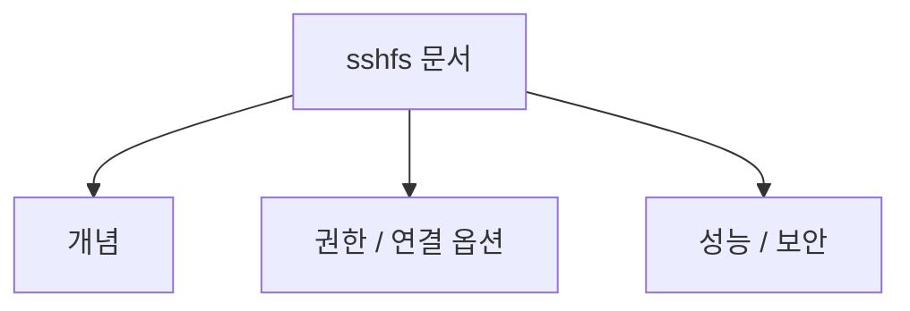
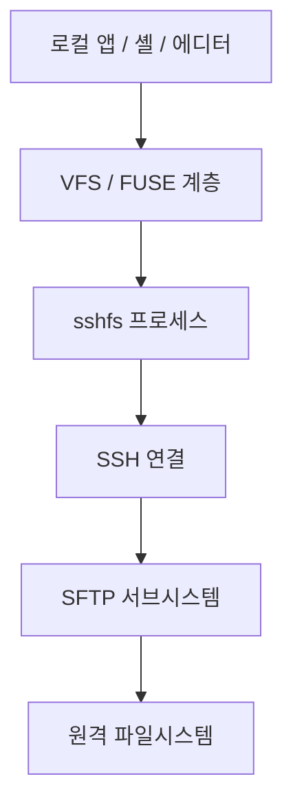
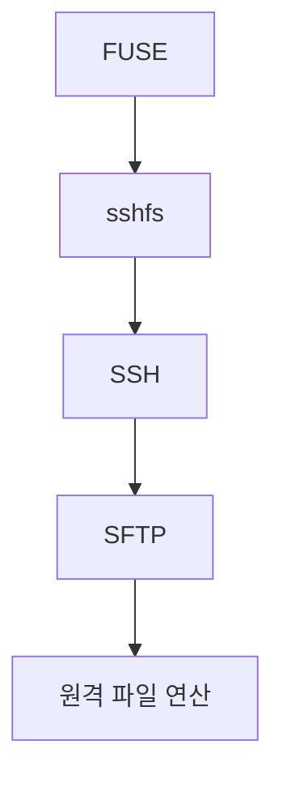
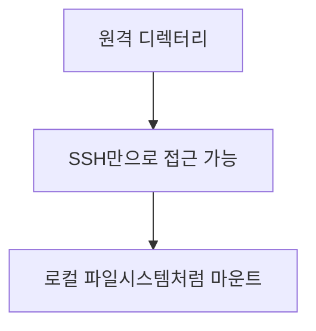
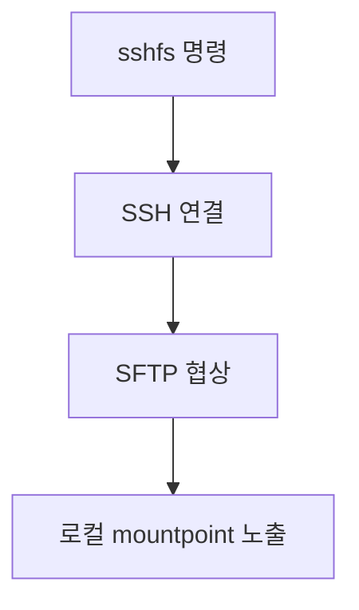
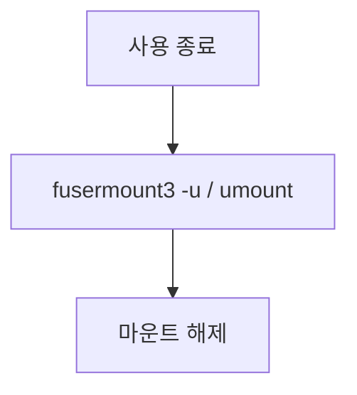
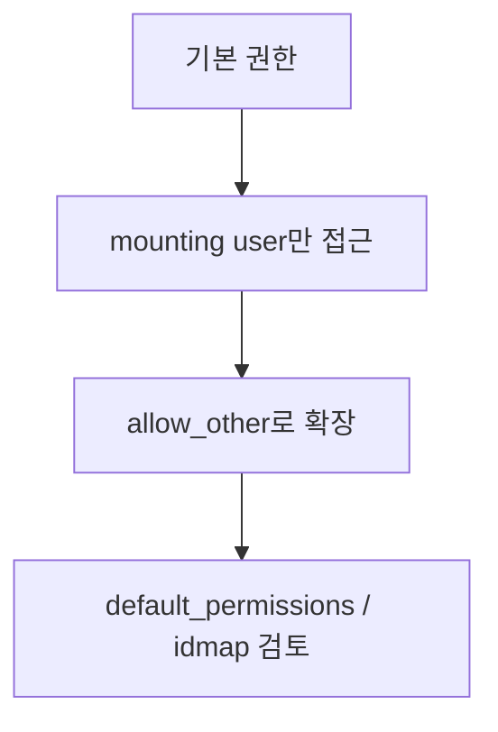

# SSHFS 상세 정리

작성 기준일: 2026-04-16  
조사 방식: 웹검색 기반 최신 조사  
주요 참고: `github.com/libfuse/sshfs`, `github.com/libfuse/libfuse`, `github.com/macfuse/macfuse`

## 1. 문서 목적


이 문서는 `sshfs`를 처음 접하는 사람부터 이미 한두 번 써 본 사람까지, "`sshfs`가 정확히 무엇이고 어떤 방식으로 원격 디렉터리를 로컬 파일시스템처럼 마운트하는지"를 한 번에 이해할 수 있도록 정리한 학습 문서다.

특히 아래를 함께 설명한다.

- `sshfs`가 정확히 무엇인가
- `SSH`, `SFTP`, `FUSE`와의 관계
- 어떤 상황에서 유용한가
- 기본 마운트 / 언마운트 방법
- `allow_other`, `default_permissions`, `idmap` 같은 권한 관련 옵션
- `reconnect`, `delay_connect`, `direct_io`, `max_conns` 같은 운영 옵션
- `/etc/fstab` 등록 감각
- `directport`, `vsock`, `passive` 같은 고급 연결 방식
- 보안 및 성능 주의점
- macOS에서 왜 `macFUSE`가 필요한가

즉 이 문서는 단순 명령어 메모가 아니라, "`sshfs`를 운영 도구로 이해하는 문서"다.

---

## 2. 먼저 한 줄 요약



`sshfs`는 원격 서버의 파일시스템 디렉터리를 `SSH`의 `SFTP` 서브시스템을 통해 로컬 머신에 마운트해서, 마치 로컬 디스크처럼 접근하게 해 주는 `FUSE 기반 사용자 공간 파일시스템 클라이언트`다.

프로젝트 README와 man page는 핵심을 이렇게 설명한다.

- SSHFS allows you to mount a remote filesystem using SFTP
- Most SSH servers support this by default
- Server-side에 특별한 추가 설정이 거의 필요 없다

즉 아주 단순하게 말하면:

- `scp`처럼 매번 파일을 복사하는 대신
- 원격 디렉터리를 로컬 폴더처럼 붙여서
- Finder/Explorer/쉘/에디터가 그냥 파일시스템처럼 보게 만드는 도구

다.

---

## 3. SSHFS는 어디에 속한 도구인가


### 3.1 SSHFS 자체

`sshfs`는 파일시스템 드라이버가 아니라, 사용자 공간에서 동작하는 `FUSE filesystem client`다.

즉:

- 커널 안에 파일시스템 코드를 넣는 것이 아니라
- 사용자 공간 프로세스로 파일시스템 동작을 구현한다

### 3.2 FUSE와의 관계

`libfuse` README는 FUSE를:

- userspace programs가 filesystem을 Linux kernel에 export할 수 있게 해 주는 인터페이스

라고 설명한다.

즉 FUSE는:

- 커널과 사용자 공간 파일시스템 프로세스를 이어주는 다리

이고,

`sshfs`는 그 위에 올라간 하나의 파일시스템 구현이다.

### 3.3 SSH와의 관계

`sshfs`는 이름 때문에 "SSH 프로토콜로 직접 파일시스템 명령을 주고받는다"고 느낄 수 있지만, 공식 문서는 더 정확히:

- SSH (more precisely, the SFTP subsystem)

라고 설명한다.

즉 `sshfs`는:

- SSH 연결을 만들고
- 그 안에서 SFTP 서브시스템을 이용해 원격 파일 연산을 수행한다

고 이해하면 된다.

### 3.4 SFTP와 SCP와의 차이

`sshfs`는 파일을 "복사"하는 도구가 아니라 "원격 파일시스템을 마운트"하는 도구다.

즉:

- `scp` = 파일 복사
- `sftp` = 파일 전송 세션
- `sshfs` = SFTP를 이용한 파일시스템 마운트

라고 구분하면 된다.

---

## 4. 왜 SSHFS를 쓰는가


`sshfs`가 특히 유용한 상황은 다음과 같다.

### 4.1 원격 서버 디렉터리를 로컬처럼 다루고 싶을 때

예:

- 원격 서버의 로그 디렉터리
- 웹서버 배포 경로
- 홈 디렉터리 일부
- 개발용 VM 내부 디렉터리

를 로컬 에디터/셸에서 바로 보고 싶을 때

### 4.2 SSH만 가능한 환경일 때

공식 README가 강조하듯, 대부분의 SSH 서버는 기본적으로 SFTP를 켜 두기 때문에:

- 서버 쪽 추가 데몬
- 별도 파일 공유 프로토콜(NFS, SMB)

이 없어도 바로 쓸 수 있다.

즉 "SSH 접근만 있으면 원격 파일시스템 마운트까지 가능"하다는 것이 큰 장점이다.

### 4.3 사내 서버/개발 서버/개인 서버 관리

특히 아래 같은 환경에서 편하다.

- 개발 서버
- 개인 VPS
- 도커/VM 테스트 환경
- CI/CD 디버깅

즉 "짧게 붙어서 파일 좀 보고 수정"하는 상황에 매우 실용적이다.

### 4.4 반대로 안 맞는 경우

- 대규모 고성능 파일 워크로드
- 낮은 지연이 매우 중요한 DB/빌드 캐시
- 다중 사용자 정교한 POSIX 권한 모델이 중요한 경우
- 장시간 끊김 없는 안정성이 핵심인 프로덕션 파일 서비스

이런 경우는 NFS, SMB, EFS/FSx, rsync, artifact sync 같은 다른 도구가 더 맞을 수 있다.

즉 `sshfs`는 편의성이 강점이지, 모든 파일 공유 문제의 정답은 아니다.

---

## 5. 기본 사용법


공식 README와 upstream man page가 제시하는 가장 기본 문법은 아래다.

```bash
sshfs [user@]host:[dir] mountpoint
```

예:

```bash
sshfs user@example.com:/var/www ~/mnt/remote-www
```

### 5.1 구성 요소 읽는 법

- `user@` = 원격 로그인 사용자, 생략하면 로컬 사용자명 사용
- `host` = 원격 SSH 서버
- `[dir]` = 원격 디렉터리, 생략하면 원격 홈 디렉터리
- `mountpoint` = 로컬에서 붙일 디렉터리

### 5.2 원격 디렉터리를 생략하면

공식 문서는 원격 디렉터리를 생략하면 remote home directory를 마운트한다고 설명한다.

즉:

```bash
sshfs user@example.com: ~/mnt/home
```

같이 쓰면 원격 홈 디렉터리가 붙는다.

### 5.3 비밀번호 입력

기본적으로는 실제 SSH를 호출하므로, 비밀번호 기반 접속이면 SSH가 비밀번호를 물어본다.

실무에서는 보통:

- SSH key 기반 인증

이 더 자연스럽다.

---

## 6. 언마운트


공식 README와 man page는 언마운트 방법을 다음처럼 설명한다.

Linux:

```bash
fusermount3 -u mountpoint
```

또는 일반적으로:

```bash
umount mountpoint
```

macOS / BSD:

```bash
umount mountpoint
```

### 6.1 왜 `fusermount3 -u`가 자주 나오나

FUSE FAQ도:

- `umount mountpoint`
- `fusermount -u mountpoint`

둘 다 가능하다고 설명한다.

실무에서는 Linux에서:

- non-root 사용자
- 자기 자신이 마운트한 FUSE 파일시스템

을 해제할 때 `fusermount3 -u`가 특히 자주 보인다.

### 6.2 마운트 해제 실패가 날 때

보통은 아래가 원인이다.

- 현재 디렉터리가 mountpoint 안에 있음
- 프로세스가 파일을 잡고 있음
- GUI 파일 탐색기가 열려 있음

즉 단순 명령 문제가 아니라 "누가 그 경로를 사용 중인가"를 같이 봐야 한다.

---

## 7. 권한과 접근 제어


이 부분이 `sshfs`를 제대로 이해하는 핵심이다.

upstream man page는 다음을 명확히 설명한다.

- 기본적으로 file permissions are ignored by SSHFS
- remote server가 허용하는 작업은 인증 자격에 따라 수행 가능
- 기본적으로는 mounting user만 접근 가능

즉 `sshfs`는 로컬 POSIX 권한처럼 완벽히 동작한다고 가정하면 안 된다.

### 7.1 기본 동작

기본적으로:

- 마운트를 만든 사용자만 접근 가능
- 로컬 커널의 엄격한 권한 검사보다, 원격 서버가 허용하는 작업이 중심

이다.

### 7.2 `-o default_permissions`

upstream man page는 local permission checking을 원하면 `-o default_permissions`를 쓰라고 설명한다.

즉:

- 커널이 로컬 권한 비트도 함께 검사하게 하려는 옵션

이다.

이 옵션이 없으면, 로컬에서 보이는 권한 비트와 실제 접근 제어 감각이 어긋날 수 있다.

### 7.3 `-o allow_other`

기본적으로는 mounting user만 접근할 수 있다.

`-o allow_other`를 주면:

- 다른 로컬 사용자도 그 mountpoint를 볼 수 있게 할 수 있다

공식 문서도 이 경우 보통 `-o default_permissions`도 함께 고려하라고 설명한다.

즉:

- 여러 로컬 사용자가 같은 마운트를 봐야 한다면 `allow_other`
- 하지만 무작정 열지 말고 local permission check도 같이 고려

가 원칙이다.

### 7.4 실무 감각

즉 `sshfs` 권한 문제는 두 층으로 봐야 한다.

- 원격 서버가 허용하는가
- 로컬에서 mount한 사용자가/다른 사용자가 접근 가능한가

둘이 완전히 같은 문제가 아니다.

---

## 8. `idmap`

upstream man page는 `-o idmap=TYPE` 옵션으로 원격 UID/GID를 로컬 값으로 매핑하는 방식을 설명한다.

가능한 대표 값:

- `none`
- `user`
- `file`

### 8.1 `idmap=none`

기본값이다.

즉:

- 특별한 UID/GID 변환을 하지 않는다

### 8.2 `idmap=user`

의미:

- remote user의 UID/GID를 mounting user의 UID/GID로 보이게 한다

즉 로컬에서 "내가 소유한 파일처럼" 다루고 싶을 때 도움이 될 수 있다.

### 8.3 `idmap=file`

의미:

- 별도 매핑 파일을 이용해 username -> uid, groupname -> gid 변환

즉 다중 사용자 환경에서 좀 더 정밀하게 맞추고 싶을 때 쓴다.

### 8.4 왜 중요한가

원격 Linux 계정과 로컬 Linux 계정의 UID/GID는 일치하지 않을 수 있다.

그렇기 때문에:

- `ls -l`에서 이상한 소유자 표시
- 쓰기 권한 체감 불일치

문제가 생길 수 있다.

즉 단순 마운트가 아니라 사용자/권한 모델까지 맞추려면 `idmap`을 봐야 한다.

---

## 9. `this machine only` 기본값과 `allow_other`

FUSE FAQ는 "왜 다른 사용자가 mounted filesystem에 접근하지 못하나?"라는 질문에 기본적으로 이런 제한이 보안 때문이라고 설명한다.

즉 FUSE 파일시스템은 기본적으로:

- mount한 사용자 중심

으로 동작한다.

### 9.1 왜 보안상 보수적이냐

`sshfs`는 원격 서버 자격 증명으로 동작한다.

즉 mount한 사용자의 SSH 권한을 이용해 원격 파일을 조작한다.

만약 이 mount를 로컬 모든 사용자에게 무차별 공유하면:

- 원격 서버에 대한 권한도 사실상 같이 노출될 수 있다

즉 `allow_other`는 편리하지만 보안적으로 가볍지 않은 옵션이다.

---

## 10. 연결 관련 대표 옵션

upstream man page는 여러 유용한 연결 옵션을 설명한다.

### 10.1 `-o reconnect`

연결이 끊겼을 때 자동 재연결을 시도한다.

다만 공식 문서는:

- 재연결 전에 열려 있던 파일 핸들은 에러가 날 수 있고
- 다시 열어야 할 수 있다고

설명한다.

즉 "완벽한 투명 복구"가 아니라 "가능한 빨리 다시 연결" 정도로 이해해야 한다.

### 10.2 `-o delay_connect`

마운트 시점에 즉시 연결하지 않고, mountpoint가 처음 접근될 때 연결한다.

즉:

- 부팅 시 fstab 마운트
- 네트워크가 아직 준비 안 된 시점

같은 곳에서 유용할 수 있다.

### 10.3 `-o ssh_command=CMD`

기본 `ssh` 대신 다른 명령을 쓰게 한다.

즉 특정 SSH 바이너리나 wrapper를 써야 하는 경우에 유용하다.

### 10.4 `-o port=PORT`

비표준 SSH 포트에 연결할 때 쓴다.

즉:

```bash
sshfs -o port=2222 user@example.com:/data ~/mnt/data
```

같은 식이다.

### 10.5 `-F ssh_configfile`

대체 `ssh_config`를 쓰게 할 수 있다.

즉 복잡한 SSH 설정을 이미 `ssh_config`에 넣어 둔 경우 활용하기 좋다.

---

## 11. 성능과 캐시 관련 옵션

upstream man page는 `sshfs`가 여러 캐시/입출력 옵션을 제공한다고 설명한다.

### 11.1 `dir_cache`

디렉터리 엔트리 이름 캐시다.

문서 설명:

- 켜면 `readdir()` 호출을 네트워크 없이 처리할 수 있다

즉 directory listing이 자주 발생하는 경우 체감 성능이 좋아질 수 있다.

### 11.2 `dcache_timeout`

디렉터리 캐시의 유효 시간이다.

즉:

- 짧으면 최신성 유리
- 길면 네트워크 호출 감소

라는 trade-off가 있다.

### 11.3 `direct_io`

문서 설명:

- 커널 page cache 사용을 비활성화한다

효과:

- read/write 호출이 더 직접 원격 연산에 대응
- 파일 크기를 미리 알 수 없는 특수 파일시스템(`/proc`류)에는 도움이 될 수 있음

하지만 일반적인 성능 최적화 옵션이라고 단정하면 안 된다.

### 11.4 `no_readahead`

필요한 데이터만 읽고 speculative read-ahead를 하지 않는다.

이 역시:

- 성능 패턴
- 서버 특성

에 따라 유리/불리가 갈린다.

### 11.5 `max_conns`

공식 man page는 여러 SSH connection을 동시에 사용해 large file transfer 중 responsiveness를 높이는 옵션이라고 설명한다.

즉:

- 큰 파일 복사 중에도 탐색/메타데이터 응답성을 높이고 싶을 때

도움이 될 수 있다.

다만 문서도:

- `password_stdin`
- `passive`
- `buflimit`

등과 같이 못 쓰는 제약이 있다고 설명한다.

즉 성능 옵션을 켜면 호환 제약도 같이 본다.

---

## 12. 연결 끊김과 `ServerAliveInterval`

upstream man page의 `Caveats`는:

- SSHFS가 한동안 파일시스템 활동이 없을 때 멈춘 것처럼 보이는 문제
- 네트워크가 끊긴 뒤 I/O가 block되는 문제

를 설명한다.

### 12.1 왜 생기나

기본적으로 SSH 자체가 네트워크 타임아웃 없이 오래 기다리는 성격을 가질 수 있기 때문이다.

즉 연결이 중간에 조용히 끊기면:

- 애플리케이션은 mount 아래 경로 접근 시 멈춘 것처럼 보일 수 있다

### 12.2 공식 권장 워크어라운드

문서는:

```bash
-o ServerAliveInterval=15
```

를 시도하라고 설명한다.

그리고 필요하면:

```bash
-o reconnect
```

도 같이 쓸 수 있다고 말한다.

### 12.3 실무 감각

장시간 mount를 두고 쓰는 경우에는:

- `ServerAliveInterval`
- `reconnect`

를 기본 옵션 후보로 고려하는 편이 좋다.

단, 중간 read/write 중이던 데이터가 완벽히 보존되는 것은 아니다.

즉 안정성 보강이지 완전한 분산 파일시스템 복구는 아니다.

---

## 13. 심볼릭 링크 관련 옵션

upstream man page는 심볼릭 링크 처리 관련 옵션도 제공한다.

### 13.1 `transform_symlinks`

원격 absolute symlink를 상대 경로 symlink로 바꾸어 보여 주려는 옵션이다.

즉 원격 시스템의 절대 경로가 로컬 mount 문맥에 안 맞을 때 유용할 수 있다.

### 13.2 `follow_symlinks`

원격 symlink를 클라이언트에서 symlink가 아니라 regular file처럼 따라가게 만들 수 있다.

즉 로컬에서 보이는 형태를 단순화할 수 있지만, symlink semantics를 완전히 그대로 유지하는 것은 아니다.

### 13.3 실무 감각

원격 서버의 파일 구조에 심볼릭 링크가 많으면:

- 링크를 있는 그대로 보여 줄지
- 따라가서 단순화할지

를 결정해야 한다.

즉 단순 보기 옵션이 아니라 경로 의미에 영향을 줄 수 있다.

---

## 14. 고급 연결 방식: `directport`, `vsock`, `passive`

이 부분은 일반 사용자보다 VM/가상화/특수 통신 환경에서 더 중요하다.

### 14.1 `directport`

README와 man page는 `-o directport=PORT`로 SSH 자체를 우회하고 `sftp-server`에 직접 연결할 수 있다고 설명한다.

중요한 점:

- 암호화 없이 연결된다
- 공식 README도 "insecure"라고 명시한다

즉:

- localhost
- 신뢰된 내부 네트워크

같은 특수 상황에서만 고려해야 한다.

### 14.2 `vsock`

README는 Linux vsock으로 VM 내부 소켓에 직접 연결하는 사용 예를 제시한다.

즉 hypervisor/guest 사이 특수 채널에서 쓸 수 있다.

### 14.3 `passive`

man page는 stdin/stdout을 통해 통신하는 passive 모드를 설명한다.

예:

- remote side에 local filesystem을 마운트하는 특수 사용

즉 일반 서버 접속보다는 특수한 파이프 연결용이다.

### 14.4 실무 요약

대부분의 사용자는:

- 기본 SSH 기반 연결

만 이해하면 충분하다.

`directport`, `vsock`, `passive`는 특수 환경용이라고 보면 된다.

---

## 15. `/etc/fstab`에서의 사용

upstream man page는 `/etc/fstab`에서도 `sshfs`를 filesystem type으로 쓸 수 있다고 설명한다.

### 15.1 의미

즉 부팅 시점 또는 `mount -a` 시:

- SSHFS 마운트를 자동화

할 수 있다.

### 15.2 언제 유용한가

- 항상 쓰는 개발용 마운트
- 부팅 후 자동 연결이 필요한 환경

### 15.3 주의점

하지만 SSHFS는 네트워크와 인증에 의존하므로:

- 네트워크 준비 타이밍
- SSH 키/agent
- 지연 연결 필요 여부

를 같이 고려해야 한다.

즉 로컬 디스크처럼 단순하게 fstab에 적고 끝나는 성격은 아니다.

### 15.4 실무 감각

`fstab + sshfs`를 쓸 때는 보통:

- `delay_connect`
- keepalive 관련 SSH 옵션
- 실패 시 부팅 영향 최소화

까지 같이 설계한다.

---

## 16. 보안 관점에서 중요한 점

### 16.1 기본 경로는 SSH/SFTP라서 비교적 안전한 편

즉:

- 이미 검증된 SSH 인증
- 암호화 채널

을 활용한다.

### 16.2 그러나 로컬 마운트 권한은 별도 문제

`allow_other`를 쓰면:

- 로컬 다른 사용자도 원격 권한을 사실상 공유받게 될 수 있다

즉 편의성 때문에 무분별하게 열면 안 된다.

### 16.3 `directport`는 암호화 우회

README가 명시하듯 `directport`는 insecure하다.

즉 평소 운영에서는 거의 피해야 한다.

### 16.4 SSH 자격 증명 관리

`sshfs`는 결국 SSH 자격 증명으로 원격 파일시스템을 연다.

즉:

- 비밀번호 대신 key 기반 인증
- 최소 권한 계정
- `ssh_config` 관리
- known_hosts 검증

을 같이 생각해야 한다.

### 16.5 root로 실행하지 않는 것이 권장

README와 man page는 regular user로 실행하는 것을 권장한다.

즉:

- mountpoint를 사용자 소유로 만들고
- 가능한 한 일반 사용자로 마운트

하는 편이 안전하다.

---

## 17. 성능 관점에서 중요한 점

`sshfs`는 편리하지만 네트워크 파일시스템이다.

즉 성능은 아래 영향을 크게 받는다.

- SSH 암호화 비용
- RTT(지연시간)
- 작은 파일/메타데이터 호출 빈도
- 캐시 설정
- 원격 SFTP 서버 성능

### 17.1 특히 느려질 수 있는 경우

- 디렉터리 엔트리가 매우 많을 때
- IDE가 파일 트리를 계속 스캔할 때
- 대량의 작은 파일 읽기/쓰기
- 네트워크가 멀거나 불안정할 때

### 17.2 덜 느리게 쓰는 방법

공식 옵션 감각으로 보면:

- `dir_cache`
- `dcache_timeout`
- `max_conns`
- `ServerAliveInterval`

같은 설정을 조합해 튜닝할 수 있다.

하지만 근본적으로는:

- 로컬 디스크만큼 빠르지 않다
- NFS/SMB와도 특성이 다르다

는 점을 기억해야 한다.

---

## 18. macOS에서 SSHFS

### 18.1 왜 별도 구성 요소가 필요한가

macFUSE 공식 위키는 macOS에서 FUSE filesystem을 쓰려면 `macFUSE`가 필요하다고 설명한다.

즉 macOS에서는 Linux의 libfuse 환경과 달리:

- macFUSE 설치

가 먼저 필요하다.

### 18.2 공식 macFUSE 문맥

macFUSE의 SSHFS 페이지는:

- macOS용 SSHFS installer package
- Apple Silicon / Intel 지원
- 공식 서명된 패키지

를 안내한다.

즉 macOS에서는 "brew install sshfs면 끝" 같은 단순 감각보다:

- macFUSE 계층
- 설치 방식

을 같이 이해해야 한다.

### 18.3 실무 감각

macOS에서 SSHFS를 쓸 때는:

- macFUSE 버전 호환성
- SSHFS 빌드/패키지 버전
- Finder와의 상호작용

을 같이 봐야 한다.

즉 Linux보다 조금 더 플랫폼 특화 지식이 필요하다.

---

## 19. 최신 프로젝트 상태

SSHFS README는 현재:

- 여러 주요 Linux 배포판에서 제공되고
- 오랫동안 production use가 있었지만
- active, regular contributors는 없고
- 알려진 이슈들이 있다고

설명한다.

동시에 GitHub Releases에는 현재 `3.7.5`가 latest로 보이고, macOS 지원과 몇 가지 수정이 포함되어 있다.

즉 실무 감각으로는:

- 널리 쓰이고 여전히 유용하지만
- 매우 활발한 신규 개발 프로젝트는 아님

으로 이해하는 편이 맞다.

### 19.1 왜 이 정보가 중요한가

운영 도구를 선택할 때는:

- 기능만이 아니라
- 유지보수 상태
- 알려진 한계

도 봐야 한다.

즉 매우 장기적이고 복잡한 핵심 스토리지 경로로는 더 적극적으로 유지되는 대안을 검토할 수도 있다.

---

## 20. 자주 하는 실수

### 20.1 `sshfs`를 로컬 디스크처럼 생각

실제로는:

- 네트워크 지연
- SSH 세션 상태
- 원격 서버 권한

에 따라 동작이 달라진다.

즉 "로컬 ext4/APFS 같은 것"처럼 생각하면 안 된다.

### 20.2 `allow_other`를 가볍게 사용

편하지만 로컬 다른 사용자에게도 원격 권한이 열릴 수 있다.

즉 보안 영향을 먼저 봐야 한다.

### 20.3 끊김 문제를 고려하지 않음

장시간 idle 후 멈추거나 네트워크 단절 시 블로킹이 생길 수 있다.

즉 keepalive와 reconnect 옵션을 무시하면 운영 체감이 나빠질 수 있다.

### 20.4 대규모 빌드/DB/고성능 워크로드에 바로 적용

`sshfs`는 편리하지만 고성능 스토리지 대체재는 아니다.

즉 워크로드 적합성 판단이 중요하다.

### 20.5 root로 습관적으로 실행

공식 문서도 regular user를 권장한다.

즉 필요 이상으로 권한을 올릴 이유가 없다.

---

## 21. 실무 체크리스트

### 21.1 시작 전

- 원격 SSH 접속이 정상인가
- SFTP subsystem이 켜져 있는가
- mountpoint가 로컬 사용자 소유인가

### 21.2 권한

- 나만 쓸 건가
- 여러 사용자가 같이 볼 건가
- `allow_other`와 `default_permissions`를 같이 검토했는가

### 21.3 안정성

- `ServerAliveInterval`
- `reconnect`
- `delay_connect`

를 환경에 맞게 검토했는가

### 21.4 성능

- 작은 파일이 많은가
- directory cache가 필요한가
- `max_conns`가 도움이 되는가

### 21.5 플랫폼

- Linux는 libfuse/fusermount 준비
- macOS는 macFUSE 준비

---

## 22. 추천 학습 순서

`sshfs`를 처음부터 제대로 잡으려면 아래 순서가 좋다.

### 1단계: 큰 그림

- SSH
- SFTP
- FUSE
- SSHFS의 위치

### 2단계: 기본 사용

- mount
- unmount
- 사용자 권한

### 3단계: 권한 옵션

- `allow_other`
- `default_permissions`
- `idmap`

### 4단계: 운영 옵션

- `reconnect`
- `delay_connect`
- `ServerAliveInterval`
- cache 계열

### 5단계: 고급

- `direct_io`
- `max_conns`
- `directport`
- `vsock`
- `/etc/fstab`

이 순서로 보면 단순 명령 암기보다 운영 감각이 먼저 생긴다.

---

## 23. 한 문장 결론

`sshfs`는 SSH의 SFTP 서브시스템과 FUSE를 결합해 원격 디렉터리를 로컬 파일시스템처럼 보이게 만드는 매우 실용적인 도구지만, 로컬 디스크와 같은 권한/성능/안정성을 기대하면 안 되고, 네트워크·권한·캐시·연결 끊김을 함께 고려해서 써야 하는 도구다.

즉 `sshfs`를 제대로 이해한다는 것은:

- FUSE와 SFTP의 관계
- mount와 unmount 흐름
- 권한 옵션
- reconnect와 cache
- 보안 및 워크로드 적합성

을 함께 이해하는 것을 뜻한다.

---

## 24. 공식 출처

- SSHFS README (upstream): <https://raw.githubusercontent.com/libfuse/sshfs/master/README.md>
- SSHFS upstream man page source: <https://raw.githubusercontent.com/libfuse/sshfs/master/sshfs.rst>
- libfuse README: <https://raw.githubusercontent.com/libfuse/libfuse/master/README.md>
- libfuse FAQ: <https://github.com/libfuse/libfuse/wiki/FAQ>
- SSHFS releases: <https://github.com/libfuse/sshfs/releases>
- macFUSE home/wiki: <https://github.com/macfuse/macfuse/wiki>
- macFUSE getting started: <https://github.com/macfuse/macfuse/wiki/Getting-Started>
- macFUSE SSHFS page: <https://github.com/macfuse/macfuse/wiki/File-Systems-%E2%80%90-SSHFS>
