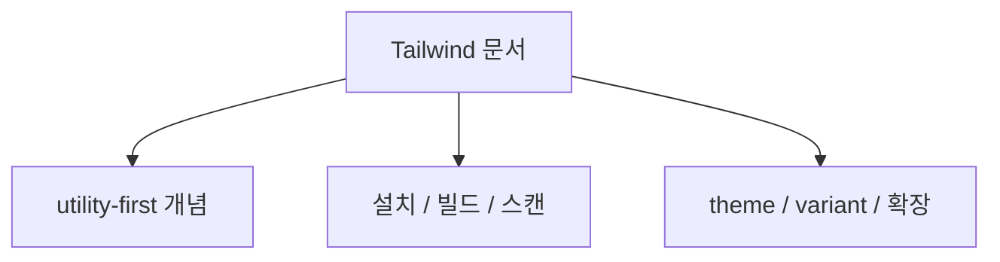
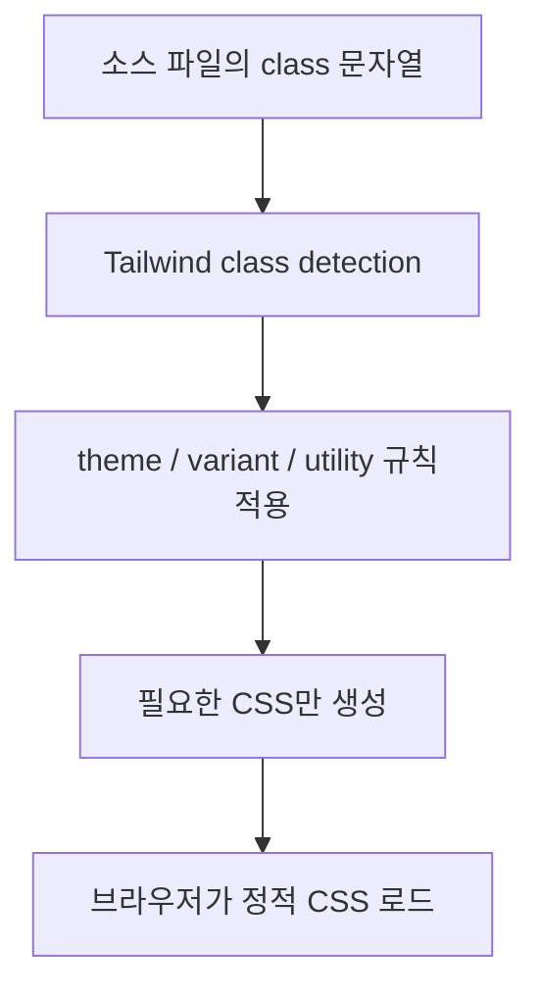
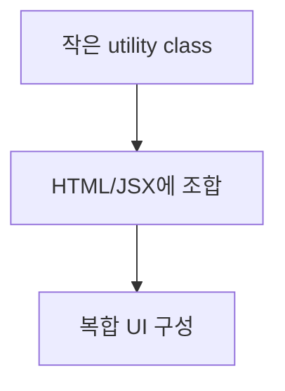
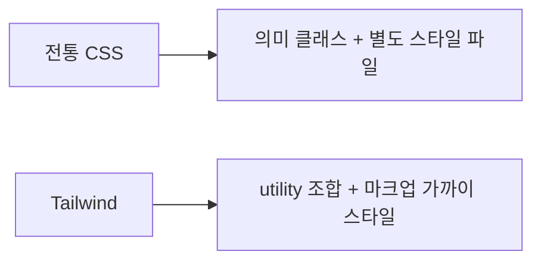
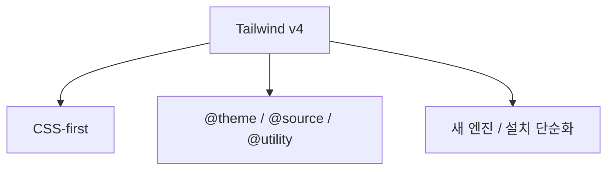
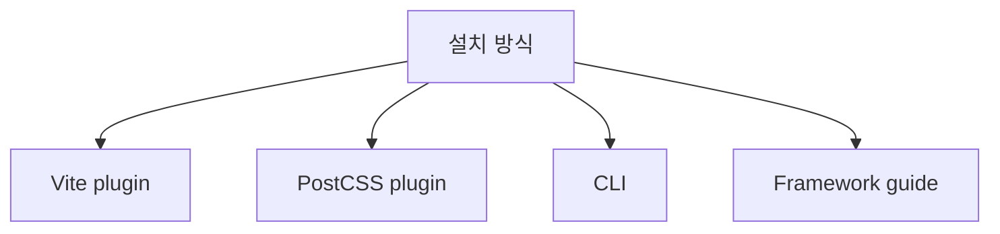
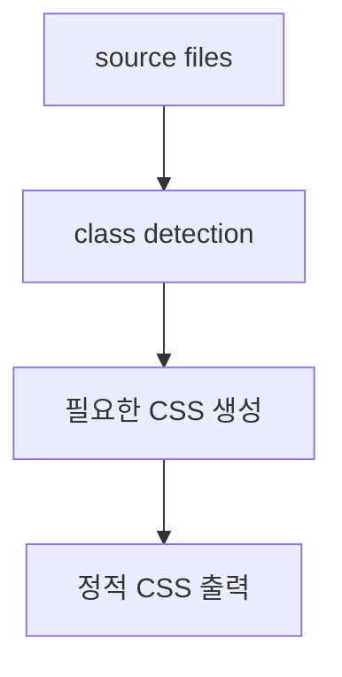

# Tailwind CSS 상세 정리

작성 기준일: 2026-04-19  
조사 방식: 웹검색 기반 최신 조사  
주요 참고: `tailwindcss.com` 공식 Docs / Blog

## 1. 문서 목적



이 문서는 `Tailwind CSS`를 처음 접하는 사람부터 이미 써 본 사람까지, "Tailwind가 정확히 무엇이고 현재 버전 기준으로 어떤 방식으로 쓰는 것이 맞는지"를 한 번에 연결해서 이해할 수 있도록 정리한 학습 문서다.

특히 아래를 함께 설명한다.

- Tailwind CSS가 정확히 무엇인가
- utility-first가 실제로 무슨 뜻인가
- 현재 공식 기준 설치/빌드 흐름은 어떤가
- class scanning은 어떻게 동작하는가
- `@theme`, `@utility`, `@variant`, `@custom-variant`, `@plugin`, `@config`는 무엇인가
- responsive / dark mode / state variant는 어떻게 쓰는가
- Preflight는 무엇이고 왜 놀랄 수 있는가
- v4 기준으로 무엇이 달라졌는가
- Tailwind가 잘 맞는 경우와 안 맞는 경우는 무엇인가

즉 이 문서는 단순 "클래스를 외우는 문서"가 아니라, "`Tailwind를 시스템으로 이해하는 문서`"다.

---

## 2. 먼저 한 줄 요약



Tailwind CSS는 HTML이나 템플릿 안에서 작은 utility class를 조합해 UI를 만드는 utility-first CSS framework다.

Tailwind 공식 docs의 핵심을 풀면:

- 스타일을 컴포넌트 전용 클래스 이름 안에 숨기기보다
- 작은 단일 목적 utility를 조합하고
- 빌드 시 실제 사용한 클래스만 스캔해서 CSS를 생성하는 방식

이다.

즉 아주 단순하게 말하면:

- "미리 정의된 수많은 작은 CSS 조각을 조합해서 화면을 만드는 프레임워크"

라고 볼 수 있다.

---

## 3. Tailwind CSS는 정확히 무엇인가



### 3.1 utility-first framework

Tailwind docs `Styling with utility classes`는 Tailwind를:

- many single-purpose presentational classes를 조합해
- complex components를 만드는 방식

으로 설명한다.

즉 Tailwind의 핵심은:

- `.button-primary` 같은 의미 이름 클래스 중심이 아니라
- `flex`, `p-4`, `bg-blue-500`, `text-sm`, `rounded-lg`

같은 원자적 utility를 직접 조합하는 데 있다.

### 3.2 "inline style"와는 다른가

겉보기에는 HTML class가 길어져서 inline style과 비슷해 보일 수 있다.

하지만 Tailwind는:

- 클래스 이름이 CSS 속성 1:1 대응이긴 해도
- design token 체계와 제약이 있고
- responsive/state variant가 붙고
- 빌드 시 최적화되며
- 재사용 규칙이 존재한다

즉 단순 inline style과는 다르다.

### 3.3 왜 사람들이 선호하나

대표 이유:

- CSS 파일 왔다 갔다 덜 함
- naming 스트레스 감소
- 일관된 spacing/color scale
- 작은 UI를 빠르게 조합 가능
- class 조합만 읽어도 구조가 보임

즉 "스타일 결정이 마크업 가까이 있다"는 점이 핵심 장점이다.

---

## 4. Tailwind의 기본 사고방식



Tailwind를 제대로 이해하려면 먼저 mental model을 바꿔야 한다.

### 4.1 전통 방식

전통적인 CSS/SCSS 감각:

1. 의미 있는 클래스 이름을 만든다
2. CSS 파일에서 그 클래스에 스타일을 쓴다
3. 상태/반응형/변형도 그 클래스 밑에 같이 쓴다

예:

```css
.btn-primary {
  padding: 0.5rem 1rem;
  background: blue;
  color: white;
}

.btn-primary:hover {
  background: navy;
}
```

### 4.2 Tailwind 방식

Tailwind 감각:

```html
<button class="px-4 py-2 bg-blue-500 text-white hover:bg-blue-700 rounded-md">
  Save
</button>
```

즉:

- padding은 `px-4 py-2`
- 기본 색은 `bg-blue-500`
- hover는 `hover:bg-blue-700`
- 모서리 둥글기는 `rounded-md`

처럼 스타일 조각을 바로 조합한다.

### 4.3 중요한 차이

전통 방식은 "한 클래스 안에 여러 상태가 숨어 있는 구조"라면,

Tailwind는:

- 기본 상태 utility
- hover 상태 utility
- 반응형 utility

를 각각 명시적으로 병렬 배치한다.

즉 "상태별 스타일을 클래스 이름 밖 CSS에 숨기지 않는다"는 점이 Tailwind의 중요한 미학이다.

---

## 5. 현재 공식 기준: Tailwind CSS v4



Tailwind 공식 블로그 `Tailwind CSS v4.0`은 2025-01-22에 v4를 공개했다고 설명한다.

공식 설명 기준 핵심 변화:

- 새로운 고성능 엔진
- CSS-first 구성
- 설치 간소화
- first-party Vite plugin
- 최신 웹 플랫폼 기능 활용

### 5.1 왜 중요한가

예전 Tailwind 기억이 있는 사람은 보통 이렇게 기억한다.

- `tailwind.config.js`
- `@tailwind base;`
- `@tailwind components;`
- `@tailwind utilities;`

하지만 v4에서는 감각이 꽤 바뀌었다.

즉 지금은:

- `@import "tailwindcss";`
- CSS 안의 `@theme`, `@utility`, `@source`

중심으로 이해하는 편이 더 맞다.

### 5.2 구형 브라우저 지원

공식 upgrade guide는 v4가:

- Safari 16.4+
- Chrome 111+
- Firefox 128+

기준이라고 설명한다.

즉 더 오래된 브라우저를 지원해야 하면 v3.4를 유지하는 판단도 가능하다.

---

## 6. 설치 방식



Tailwind 공식 installation 문서는 현재 주요 설치 방식으로:

- Vite plugin
- PostCSS plugin
- Tailwind CLI
- Framework guides

를 안내한다.

### 6.1 Vite plugin

공식 installation 페이지는 Vite가 가장 매끄러운 통합 방식이라고 설명한다.

대략 흐름:

1. `tailwindcss`와 `@tailwindcss/vite` 설치
2. `vite.config`에 plugin 추가
3. CSS에서 `@import "tailwindcss";`

즉 최신 프런트엔드 프로젝트에서는 Vite 조합이 매우 자연스럽다.

### 6.2 PostCSS plugin

Next.js나 Angular처럼 PostCSS 흐름이 자연스러운 프로젝트는:

- `@tailwindcss/postcss`

를 쓴다.

### 6.3 Tailwind CLI

공식 CLI 문서는 CLI가:

- 가장 간단하고 빠른 시작 방법
- Node 없이도 standalone executable 가능

하다고 설명한다.

대략:

```bash
npm install tailwindcss @tailwindcss/cli
npx @tailwindcss/cli -i ./src/input.css -o ./src/output.css --watch
```

즉 프레임워크 없이 단순 HTML/CSS 프로젝트라면 CLI도 충분하다.

### 6.4 공식 가이드 우선

실무에서는 프로젝트 환경마다 차이가 크므로:

- React/Vite
- Next.js
- Laravel
- Nuxt

같은 조합별로 공식 framework guide를 먼저 보는 편이 맞다.

즉 블로그 복붙보다 공식 설치 문서를 현재 버전 기준으로 보는 것이 안전하다.

---

## 7. 빌드 방식: 왜 "zero-runtime"인가



Tailwind 설치 문서는 Tailwind가:

- 소스 파일에서 클래스 이름을 스캔하고
- 해당 유틸리티에 필요한 CSS만 생성해
- 정적 CSS 파일로 출력한다고

설명한다.

### 7.1 zero-runtime 의미

이 말은:

- 브라우저에서 런타임에 클래스를 해석하는 JS 엔진이 따로 있는 게 아니라
- 빌드 타임에 CSS가 만들어진다는 뜻

이다.

즉 CSS-in-JS의 일부 런타임 모델과는 다르다.

### 7.2 왜 중요한가

이 구조 덕분에:

- 브라우저 런타임 부담 감소
- 실제 사용한 클래스만 포함
- 빠른 incremental build

가 가능하다.

즉 Tailwind는 클래스 이름을 많이 쓰지만, 결과물은 "정적 CSS"다.

---

## 8. 소스 스캔과 class detection

Tailwind docs `Detecting classes in source files`는 Tailwind가:

- source files를 plain text로 스캔하고
- class name일 수 있는 토큰을 찾아
- 그에 해당하는 CSS를 생성한다고

설명한다.

### 8.1 중요한 포인트

Tailwind는 코드를 parse해서 실행 의미를 이해하는 것이 아니다.

즉:

- JS/TS/JSX 문법을 해석하는 게 아니라
- 문자열 토큰 탐색

에 가깝다.

### 8.2 왜 중요한가

이 사실 때문에 동적 클래스 이름 조합은 매우 자주 문제를 만든다.

공식 문서도 강하게 경고한다.

나쁜 예:

```jsx
<div className={`bg-${color}-500`} />
```

이 경우 `bg-red-500`, `bg-blue-500` 같은 완전한 문자열이 source에 없어서 CSS가 생성되지 않을 수 있다.

### 8.3 권장 방식

공식 문서가 권장하는 방식은:

- props를 완전한 클래스 문자열에 매핑

예:

```jsx
const colorVariants = {
  blue: "bg-blue-600 hover:bg-blue-500",
  red: "bg-red-600 hover:bg-red-500",
}
```

즉 Tailwind는 "항상 완전한 클래스 이름이 소스에 보여야 한다"는 감각이 중요하다.

---

## 9. `@source`

v4 docs에서는 소스 탐지를 제어하기 위해 `@source`를 쓴다.

### 9.1 왜 필요한가

Tailwind는 기본적으로 많은 파일을 자동 탐지하지만, 아래는 추가 제어가 필요할 수 있다.

- monorepo
- 외부 UI 라이브러리
- 무시된 경로
- 다중 stylesheet

### 9.2 예시 감각

공식 문서 예시:

```css
@import "tailwindcss";
@source "../node_modules/@acmecorp/ui-lib";
```

즉 외부 라이브러리 안의 Tailwind 클래스도 스캔 대상으로 포함할 수 있다.

### 9.3 `source(none)`

자동 탐지를 끄고 명시적으로만 등록할 수도 있다.

이건 큰 프로젝트에서 유용하다.

왜냐하면 stylesheet마다 포함 범위를 엄격하게 나누고 싶을 수 있기 때문이다.

### 9.4 safelisting

v4에서는 `@source inline()`을 써서 특정 유틸리티를 강제로 생성하게 할 수 있다.

즉 예전 config 기반 safelist 감각이 CSS 쪽으로 이동했다고 보면 된다.

---

## 10. Utility-first가 실제로 의미하는 것

Tailwind docs `Styling with utility classes`는 UI를 작은 utility의 조합으로 만드는 예시를 보여 준다.

### 10.1 utility 클래스는 단일 목적

예:

- `flex`
- `p-6`
- `rounded-xl`
- `text-gray-500`
- `shadow-lg`

각각이 아주 작은 역할만 가진다.

### 10.2 복잡한 UI는 조합으로 만든다

즉 하나의 카드 컴포넌트도:

- layout
- spacing
- border
- shadow
- color
- state

를 각각 utility로 쪼개 조합한다.

### 10.3 장점

- 클래스 이름 고민 감소
- 디자인 토큰 일관성 유지
- 화면 코드를 보면 스타일도 함께 읽힘

### 10.4 단점

- 마크업이 길어질 수 있음
- 처음엔 class가 "잡음"처럼 느껴질 수 있음
- 팀 합의 없는 컴포넌트 추상화가 어려울 수 있음

즉 Tailwind는 만능이라기보다 trade-off가 분명한 방식이다.

---

## 11. Theme variables와 `@theme`

Tailwind docs `Theme variables`는 v4에서 design token을 CSS 변수 기반으로 관리하는 방식을 설명한다.

### 11.1 핵심 개념

`@theme` 안에 정의한 변수는:

- 색상
- 폰트
- spacing
- breakpoint
- radius
- shadow

같은 유틸리티 API를 결정한다.

예:

```css
@import "tailwindcss";

@theme {
  --color-mint-500: oklch(0.72 0.11 178);
}
```

그러면:

- `bg-mint-500`
- `text-mint-500`

같은 유틸리티가 생긴다.

### 11.2 왜 중요한가

이제 Tailwind v4는 "설정은 JS 파일"보다:

- 설정 자체를 CSS 설계 토큰으로 다루는 감각

이 강하다.

즉 디자이너/프런트엔드가 함께 읽기 쉬운 방향으로 이동했다고 볼 수 있다.

### 11.3 breakpoints도 theme variable

공식 responsive docs는:

- `--breakpoint-*`

변수를 바꿔 breakpoints를 커스터마이즈할 수 있다고 설명한다.

즉 디자인 토큰과 breakpoint도 같은 체계로 들어왔다.

---

## 12. Responsive design

Tailwind docs `Responsive design`은:

- 모든 utility에 breakpoint prefix를 붙일 수 있다고

설명한다.

예:

```html

```

### 12.1 기본 breakpoint

공식 문서 기준 기본 prefix:

- `sm`
- `md`
- `lg`
- `xl`
- `2xl`

### 12.2 mobile-first

공식 문서는 Tailwind가 mobile-first라고 설명한다.

즉:

- prefix 없는 utility는 기본(모바일 포함 전체)
- `md:*`는 md 이상에서 override

다.

### 12.3 흔한 오해

공식 문서도 강조하는 포인트:

- `sm:`은 "작은 화면용"이 아니라
- `sm 이상`에서 적용

이다.

즉 모바일 전용 스타일은 보통 prefix 없는 기본값으로 깔아야 한다.

### 12.4 breakpoint range

v4 docs는 `md:max-lg:*` 같은 범위 타겟도 설명한다.

즉 단일 breakpoint 구간만 스타일링할 수도 있다.

---

## 13. State variants

Tailwind docs `Hover, focus, and other states`는:

- 거의 모든 utility를 조건부로 적용할 수 있다고 설명한다.

대표 예:

- `hover:*`
- `focus:*`
- `active:*`
- `disabled:*`
- `first:*`
- `odd:*`
- `required:*`

### 13.1 핵심 감각

전통 CSS라면:

```css
.btn:hover { ... }
```

처럼 같은 selector의 상태를 확장하지만,

Tailwind는:

```html
<button class="bg-sky-500 hover:bg-sky-700">
```

처럼 "기본 상태용 클래스"와 "hover 상태용 클래스"를 병렬로 둔다.

즉 상태를 selector 안에 숨기지 않고, 마크업에 드러낸다.

### 13.2 variant stacking

공식 문서처럼:

```html
<button class="dark:md:hover:bg-fuchsia-600">
```

같이 여러 variant를 쌓을 수도 있다.

즉:

- dark mode
- md 이상
- hover 시

를 동시에 조합 가능하다.

---

## 14. Dark mode

Tailwind docs `Dark mode`는 기본적으로:

- `prefers-color-scheme: dark`

기반으로 `dark:` variant를 제공한다고 설명한다.

예:

```html
<div class="bg-white dark:bg-gray-800">
```

### 14.1 수동 토글

공식 문서는 `@custom-variant dark`를 써서:

- `.dark`
- `[data-theme=dark]`

같은 selector 기반으로 dark mode를 수동 제어할 수 있다고 설명한다.

즉 운영 방식은 두 가지다.

- OS preference 연동
- 앱 자체 토글

### 14.2 왜 중요한가

Tailwind는 dark mode를 별도 테마 시스템이 아니라:

- 또 하나의 variant

로 처리한다.

즉 utility-first 사고방식이 dark mode까지 그대로 이어진다.

---

## 15. Container queries

Tailwind v4 블로그는 container query support가 core에 들어왔다고 설명한다.

### 15.1 왜 중요한가

이전에는 plugin이 필요했지만,

이제는:

- `@container`
- `@sm`, `@md`

같은 variant로 부모 컨테이너 크기 기준 스타일링이 가능하다.

### 15.2 viewport breakpoints와 차이

- `md:*` = viewport width 기준
- `@md:*` = container width 기준

즉 재사용 가능한 컴포넌트를 만들 때 container query가 더 적합한 경우가 많다.

### 15.3 실무 감각

Tailwind는 이제 반응형을:

- viewport breakpoint
- container query

두 층에서 모두 utility 방식으로 다룰 수 있다.

---

## 16. Arbitrary values

Tailwind의 강한 장점 중 하나는 arbitrary value 지원이다.

예:

```html
<div class="top-[117px] bg-[#bada55] grid-cols-[200px_minmax(900px,_1fr)_100px]">
```

공식 docs도 arbitrary values를 필요한 one-off 값 처리 방식으로 설명한다.

### 16.1 왜 중요한가

utility-first는 제약이 장점이지만, 가끔은 딱 맞는 one-off 값이 필요하다.

Tailwind는 이걸 위해 프레임워크를 버리게 만들지 않고:

- `[]` 문법으로 빠져나갈 구멍

을 준다.

### 16.2 실무 감각

너무 많이 쓰면:

- 디자인 토큰 체계가 무너지고
- class가 난잡해질 수 있다

즉 arbitrary value는 예외 처리 수단이지 기본 전략은 아니다.

---

## 17. Preflight

Tailwind docs `Preflight`는:

- modern-normalize 위에 쌓인
- opinionated base styles

라고 설명한다.

즉 `@import "tailwindcss";`를 하면 utility만 들어가는 것이 아니라 기본 리셋/정리 레이어도 들어간다.

### 17.1 대표 효과

공식 문서 기준:

- 기본 margin 제거
- border reset
- heading 기본 스타일 제거
- list 기본 스타일 제거
- 이미지 block-level 처리

### 17.2 왜 놀라기 쉬운가

Tailwind 처음 쓸 때:

- `h1`가 제목처럼 안 보임
- `ul`에 bullet 없음
- margin이 없어짐

같은 현상이 보일 수 있다.

이건 버그가 아니라 Preflight의 의도다.

### 17.3 장점

- 브라우저 기본 스타일 의존 줄임
- 디자인 시스템 안에서 일관성 유지

### 17.4 단점

- 서드파티 위젯이나 기존 사이트 통합 시 충돌 가능

공식 문서도 Google Maps 같은 일부 라이브러리에서 의외 효과가 날 수 있다고 설명한다.

즉 레거시 프로젝트에 점진 도입할 때는 Preflight를 꼭 의식해야 한다.

---

## 18. Tailwind에서 커스텀 CSS를 넣는 방법

Tailwind는 utility-first지만 "CSS를 아예 쓰지 말라"는 프레임워크가 아니다.

공식 `Adding custom styles`는:

- 필요할 때 plain CSS를 쓰는 것을 막지 않는다고

설명한다.

### 18.1 가장 단순한 방법

```css
@import "tailwindcss";

.my-custom-style {
  /* custom CSS */
}
```

### 18.2 `@layer`

기본 HTML element에 기본 스타일을 주고 싶으면:

```css
@layer base {
  h1 {
    font-size: var(--text-2xl);
  }
}
```

같이 쓸 수 있다.

즉 Tailwind는 유틸리티 조합이 중심이지만, 구조화된 CSS 확장 지점도 제공한다.

---

## 19. `@utility`, `@variant`, `@custom-variant`, `@plugin`, `@config`

Tailwind v4 docs `Functions and directives`는 CSS 안에서 사용할 수 있는 여러 지시어를 설명한다.

### 19.1 `@utility`

커스텀 utility를 추가한다.

예:

```css
@utility content-auto {
  content-visibility: auto;
}
```

장점:

- 기존 Tailwind utility처럼 variant와 함께 쓸 수 있음

### 19.2 `@variant`

커스텀 CSS 블록에 variant를 적용할 수 있다.

예:

```css
.my-element {
  background: white;
  @variant dark {
    background: black;
  }
}
```

### 19.3 `@custom-variant`

새로운 variant selector를 정의할 수 있다.

예:

- dark mode를 `.dark` class 기반으로 바꾸기

### 19.4 `@plugin`

레거시 JS 기반 plugin을 불러올 수 있다.

즉 v4가 CSS-first라고 해서 기존 plugin 생태계를 완전히 버린 것은 아니다.

### 19.5 `@config`

기존 `tailwind.config.js`를 로드할 수 있다.

즉 v3에서 v4로 점진 전환할 때 중요한 브리지 역할을 한다.

### 19.6 왜 중요한가

Tailwind v4는 단순 "설정 없는 유틸리티 프레임워크"가 아니라, CSS 자체를 설정 언어처럼 쓰게 하는 방향으로 진화했다.

---

## 20. 동적 클래스 이름 문제

이건 Tailwind에서 가장 흔한 실수 중 하나다.

공식 `Detecting classes in source files`가 강하게 경고한다.

### 20.1 왜 문제인가

Tailwind는 source를 plain text로 스캔한다.

즉:

```jsx
`bg-${color}-500`
```

같은 문자열 결합 결과를 실제 클래스 후보로 이해하지 못한다.

### 20.2 잘못된 방식

```jsx
function Button({ color }) {
  return <button className={`bg-${color}-600`}>...</button>
}
```

### 20.3 권장 방식

```jsx
const colorVariants = {
  blue: "bg-blue-600 hover:bg-blue-500",
  red: "bg-red-600 hover:bg-red-500",
}
```

즉 props를 완전한 클래스 문자열에 매핑해야 한다.

### 20.4 실무 감각

Tailwind에서는 "클래스 이름은 정적 문자열로 보이게 두는 것"이 빌드 성공의 전제 조건이다.

즉 프레임워크 스타일과 동적 문자열 조합 습관은 잘 맞지 않는다.

---

## 21. Tailwind의 장점

대표 장점:

- 클래스 네이밍 부담 감소
- 디자인 토큰 일관성 유지
- 빠른 화면 조합
- 반응형/상태 스타일을 같은 자리에서 읽기 쉬움
- CSS dead code가 줄어들기 쉬움
- zero-runtime 정적 CSS

### 21.1 팀 생산성 측면

특히 작은/중간 규모 UI를 빠르게 만드는 데 강하다.

왜냐하면:

- spacing
- color
- radius
- shadow

같은 저수준 스타일 결정을 매번 직접 CSS로 쓰지 않아도 되기 때문이다.

### 21.2 디자인 시스템 측면

`@theme`와 utility namespace 구조 덕분에 디자인 토큰과 UI 구현을 연결하기 좋다.

즉 디자인 시스템 친화성이 높다.

---

## 22. Tailwind의 단점과 한계

대표적인 비판/한계:

- 마크업 class가 길어진다
- 처음엔 읽기 어렵다
- 로직과 스타일이 가까워져 JSX/HTML이 복잡해질 수 있다
- 동적 클래스 이름과 잘 안 맞는다
- 추상화 기준이 흔들리면 오히려 중복이 늘 수 있다

### 22.1 "class soup" 문제

Tailwind 코드가 나빠 보일 때는 대개:

- utility 자체가 문제라기보다
- 컴포넌트 경계가 불분명하거나
- variant 조합이 무질서하거나
- 재사용 기준이 약한 경우

가 많다.

즉 Tailwind는 CSS 설계 문제를 완전히 없애 주지 않는다.

### 22.2 언제 덜 맞을 수 있나

- 복잡한 동적 스타일 계산이 많을 때
- HTML을 최대한 깨끗하게 유지하고 싶을 때
- CSS 작성 규율이 이미 매우 잘 잡혀 있을 때

즉 Tailwind는 강력하지만 절대 정답은 아니다.

---

## 23. v3와 v4 감각 차이

Tailwind v4에서 중요한 변화:

- CSS-first 구성
- `@theme`와 CSS 변수 중심
- 간소화된 설치
- 새로운 엔진
- built-in container queries

### 23.1 예전 기억과 비교

예전:

- `tailwind.config.js`
- `content` 배열
- `@tailwind base/components/utilities`

지금:

- `@import "tailwindcss";`
- `@theme`
- `@source`
- `@utility`

### 23.2 업그레이드 시 주의점

공식 upgrade guide는:

- v4가 major release라 변경점이 있고
- upgrade tool이 많은 작업을 자동화하며
- Node.js 20+가 필요하다고

설명한다.

즉 기존 Tailwind 3 프로젝트를 볼 때는 현재 문서 기준과 혼동하지 않아야 한다.

---

## 24. 언제 Tailwind가 잘 맞는가

### 24.1 잘 맞는 경우

- 빠른 제품 프로토타이핑
- design system 기반 앱
- 상태/반응형이 많은 UI
- React/Vue/Svelte 같은 컴포넌트 기반 개발
- 팀이 utility-first에 합의한 경우

### 24.2 덜 맞는 경우

- 매우 복잡한 theme runtime switching
- 템플릿 안 class 길이에 대한 팀 거부감이 클 때
- 기존 CSS architecture가 이미 강하게 자리 잡은 대형 레거시

즉 Tailwind는 기술 문제가 아니라 팀/프로젝트 스타일과의 궁합도 중요하다.

---

## 25. 실무 체크리스트

Tailwind를 도입하거나 운영할 때는 아래를 먼저 보면 좋다.

### 25.1 버전

- 새 프로젝트면 v4 기준으로 볼 것
- 구형 브라우저 지원이면 v3.4 유지 검토

### 25.2 설치 방식

- Vite plugin이 맞는가
- PostCSS가 맞는가
- 단순 프로젝트면 CLI면 충분한가

### 25.3 클래스 작성 방식

- 동적 문자열 조합을 피하고 있는가
- prop를 완전한 클래스 문자열에 매핑하고 있는가

### 25.4 디자인 시스템

- `@theme`로 토큰을 관리할지
- arbitrary value를 남용하고 있지 않은지

### 25.5 레거시 통합

- Preflight가 기존 스타일과 충돌하지 않는가
- `@config`, `@plugin`로 점진 이전이 필요한가

---

## 26. 추천 학습 순서

Tailwind를 처음부터 제대로 익히려면 아래 순서가 좋다.

### 1단계: 기본 철학

- utility-first
- zero-runtime
- source scanning

### 2단계: 기본 유틸리티

- layout
- spacing
- typography
- color
- border
- shadow

### 3단계: variant

- hover
- focus
- dark
- responsive
- container queries

### 4단계: 커스터마이징

- `@theme`
- `@utility`
- `@variant`
- `@custom-variant`

### 5단계: 운영 감각

- dynamic class pitfalls
- Preflight
- v3/v4 차이

이 순서로 보면 "클래스 암기"보다 시스템 전체가 더 빨리 잡힌다.

---

## 27. 한 문장 결론

Tailwind CSS는 작은 utility class를 조합해 UI를 만드는 utility-first 프레임워크이며, 현재 v4 기준으로는 `@import`, `@theme`, `@source`, variant, CSS-first 설정을 중심으로 작동하는 고성능 정적 CSS 생성 시스템으로 이해하는 것이 가장 정확하다.

즉 Tailwind를 잘 쓴다는 것은:

- 유틸리티 조합 감각
- responsive/state variant 활용
- 정적 클래스 탐지 제약 이해
- 디자인 토큰과 커스텀 CSS 확장 규칙

을 함께 이해하는 것을 뜻한다.

---

## 28. 공식 출처

- Tailwind CSS v4.0 announcement: <https://tailwindcss.com/blog/tailwindcss-v4>
- Installation overview: <https://tailwindcss.com/docs/installation>
- Tailwind CLI installation: <https://tailwindcss.com/docs/installation/tailwind-cli>
- PostCSS installation: <https://tailwindcss.com/docs/installation/using-postcss>
- Styling with utility classes: <https://tailwindcss.com/docs/utility-first>
- Detecting classes in source files: <https://tailwindcss.com/docs/detecting-classes-in-source-files>
- Theme variables: <https://tailwindcss.com/docs/theme>
- Functions and directives: <https://tailwindcss.com/docs/functions-and-directives>
- Adding custom styles: <https://tailwindcss.com/docs/adding-custom-styles>
- Hover, focus, and other states: <https://tailwindcss.com/docs/hover-focus-and-other-states>
- Responsive design: <https://tailwindcss.com/docs/responsive-design>
- Dark mode: <https://tailwindcss.com/docs/dark-mode>
- Preflight: <https://tailwindcss.com/docs/preflight>
- Upgrade guide: <https://tailwindcss.com/docs/upgrade-guide>

<!-- study-links:start -->
## 관련 문서

- `react`: [[react/react|React 상세 정리]]
- `vite`: [[vite/vite|Vite]]
<!-- study-links:end -->
