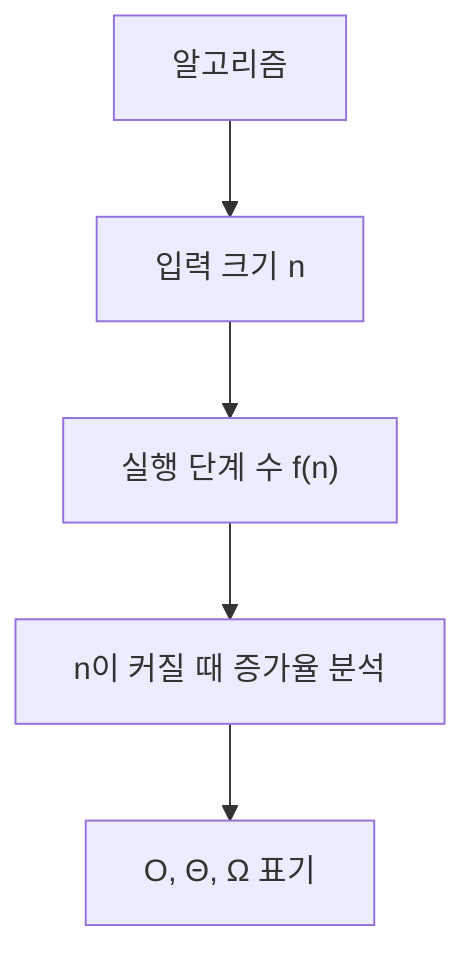
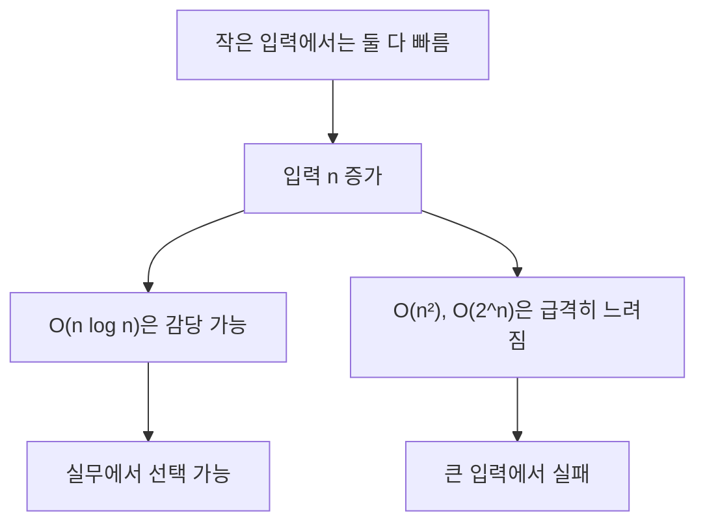
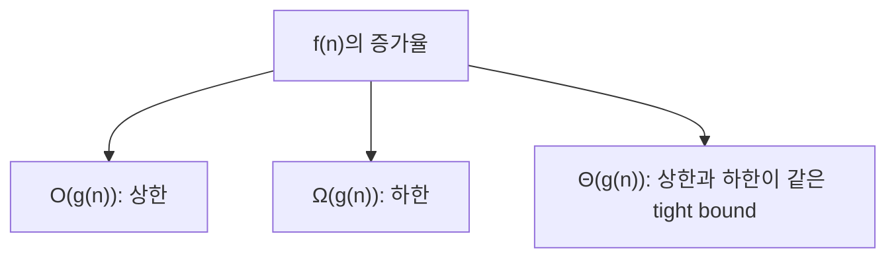
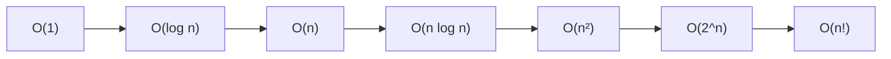
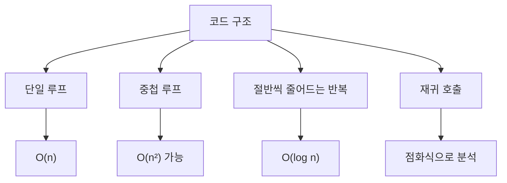
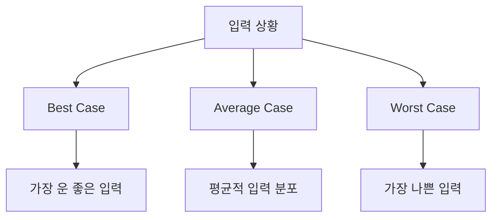
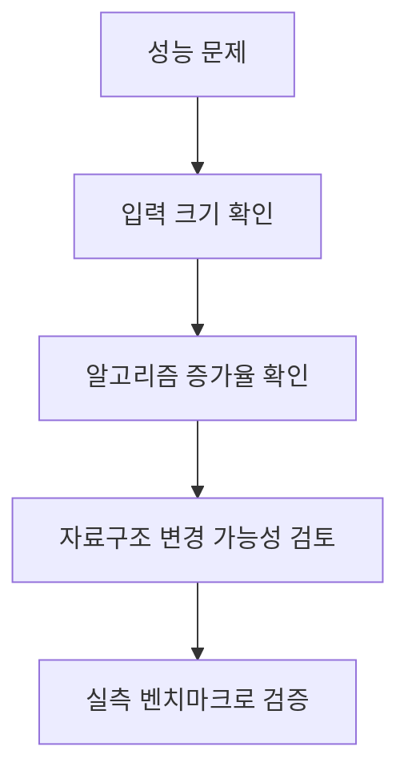

# 시간 복잡도 상세 정리

작성 기준일: 2026-04-21  
조사 방식: 웹검색 기반 최신 조사  
주요 참고: NIST Dictionary of Algorithms and Data Structures, MIT OpenCourseWare 6.006 자료

## 1. 한 줄 요약



`시간 복잡도(time complexity)`는 입력 크기 `n`이 커질 때 알고리즘 실행 시간이 어떤 비율로 증가하는지를 함수 형태로 표현한 것이다.

NIST는 `asymptotic time complexity`를:

- 문제 크기가 무한히 커질 때 알고리즘 실행 시간의 제한적 거동
- 보통 Big-O notation으로 표현

한다고 설명한다.

즉 아주 단순하게 말하면:

- "이 알고리즘이 입력이 커질수록 얼마나 빨리 느려지는가"

를 보는 방법이다.

---

## 2. 왜 시간 복잡도가 중요한가



시간 복잡도는 단순히 "코드가 빠르다/느리다"를 재는 것이 아니다.

중요한 질문은:

- 입력이 10개일 때 괜찮은가?
- 입력이 1만 개일 때도 괜찮은가?
- 입력이 100만 개면 무너지는가?

이다.

NIST Big-O 문서도 예시로:

- 평균 `O(n log n)`인 quicksort가
- `O(n²)`인 bubble sort보다 큰 입력에서 압도적으로 유리하다는 점을 설명한다.

### 2.1 실제 실행 시간과는 다르다

시간 복잡도는 정확한 초 단위 시간이 아니다.

실제 시간은:

- CPU
- 메모리
- 캐시
- 언어 런타임
- I/O
- 구현 방식

에 따라 달라진다.

하지만 시간 복잡도는 이런 상수 요인을 걷어내고 "증가율"을 본다.

즉 작은 입력에서는 느린 알고리즘도 빠를 수 있지만, 큰 입력에서는 증가율이 거의 모든 것을 결정한다.

---

## 3. Big-O, Θ, Ω



시간 복잡도를 말할 때 가장 많이 쓰는 기호는 `Big-O`다.

하지만 엄밀히는 세 가지를 구분해야 한다.

### 3.1 Big-O

NIST는 `f(n) = O(g(n))`을:

- 어떤 상수 `c`, `k`가 있어
- 충분히 큰 `n >= k`에 대해
- `f(n) <= c * g(n)`

이면 성립한다고 설명한다.

즉 Big-O는 상한(upper bound)이다.

실무에서는 보통:

- 최악의 증가율을 대략 설명하는 표기

처럼 많이 쓴다.

### 3.2 Ω(Big-Omega)

NIST는 `Ω(g(n))`을 하한(lower bound)으로 설명한다.

즉 알고리즘이 적어도 이 정도는 걸린다는 의미다.

### 3.3 Θ(Big-Theta)

NIST는 `Θ(g(n))`을:

- 상한과 하한이 같은 tight bound

라고 설명한다.

즉 `f(n)`이 결국 `g(n)`과 같은 차수로 증가한다는 뜻이다.

### 3.4 실무 감각

대화에서는 보통 `O(n)`처럼 말하지만, 엄밀히는:

- `O` = 이보다 더 나쁘지 않다
- `Ω` = 이보다 더 좋을 수 없다
- `Θ` = 정확히 이 차수다

로 구분한다.

---

## 4. 대표 시간 복잡도 계층



자주 보는 시간 복잡도는 아래 순서로 커진다.

### 4.1 O(1)

상수 시간.

입력 크기와 무관하게 일정한 작업만 한다.

예:

- 배열 인덱스 접근
- 해시맵 평균 조회

### 4.2 O(log n)

로그 시간.

입력을 매번 절반 또는 일정 비율로 줄인다.

예:

- 이진 탐색
- 균형 잡힌 트리 탐색

### 4.3 O(n)

선형 시간.

입력을 한 번 훑는다.

예:

- 배열 전체 순회
- 최댓값 찾기

### 4.4 O(n log n)

선형 로그 시간.

정렬 알고리즘에서 자주 본다.

예:

- merge sort
- heap sort
- 평균적인 quicksort

### 4.5 O(n²)

이차 시간.

중첩 루프에서 자주 나온다.

예:

- 모든 쌍 비교
- 단순 bubble sort

### 4.6 O(2^n), O(n!)

지수/팩토리얼 시간.

조합 탐색, 완전 탐색에서 자주 나온다.

입력이 조금만 커져도 현실적으로 어려워질 수 있다.

---

## 5. 코드에서 시간 복잡도 읽는 법



시간 복잡도 분석은 보통 코드 구조를 보고 시작한다.

### 5.1 단일 루프

```js
for (const item of arr) {
  work(item)
}
```

배열 길이가 `n`이면 보통 `O(n)`이다.

### 5.2 중첩 루프

```js
for (const a of arr) {
  for (const b of arr) {
    work(a, b)
  }
}
```

각 루프가 `n`번 돌면 `O(n²)`이다.

### 5.3 입력을 절반씩 줄이는 반복

```js
while (n > 1) {
  n = Math.floor(n / 2)
}
```

이런 구조는 `O(log n)`이다.

### 5.4 순차 루프 두 개

```js
for (...) {}
for (...) {}
```

각각 `O(n)`이면 전체는 `O(n + n) = O(n)`이다.

상수 계수는 버린다.

### 5.5 서로 다른 입력

```js
for (const a of arrA) {}
for (const b of arrB) {}
```

이건 `O(a + b)`라고 보는 게 더 정확할 수 있다.

모든 걸 무조건 `n`으로 뭉개면 분석이 흐려진다.

---

## 6. 최선, 평균, 최악 시간 복잡도



같은 알고리즘도 입력 상태에 따라 실행 시간이 달라질 수 있다.

### 6.1 Best Case

가장 빨리 끝나는 경우다.

예:

- 선형 탐색에서 첫 번째 원소가 target

이면 `O(1)`일 수 있다.

### 6.2 Worst Case

가장 오래 걸리는 경우다.

예:

- 선형 탐색에서 target이 없거나 마지막에 있음

이면 `O(n)`이다.

### 6.3 Average Case

입력 분포를 가정했을 때 평균 시간이다.

예:

- quicksort는 평균 `O(n log n)`
- 하지만 최악은 `O(n²)`

### 6.4 실무에서 가장 많이 보는 것

보통은 worst-case Big-O를 먼저 본다.

왜냐하면:

- 시스템이 터지는 상황은 보통 최악 입력에서 생기기 때문이다.

하지만 성능 튜닝에서는 average case와 실제 데이터 분포도 매우 중요하다.

---

## 7. 실무에서 시간 복잡도를 어떻게 써야 하나



시간 복잡도는 실무에서 다음처럼 쓴다.

### 7.1 입력 크기를 먼저 본다

`n`이 100이면 `O(n²)`도 괜찮을 수 있다.

하지만 `n`이 1,000,000이면 `O(n²)`는 거의 바로 문제가 된다.

즉 복잡도는 항상 입력 크기와 함께 봐야 한다.

### 7.2 알고리즘보다 자료구조가 먼저일 때도 많다

예:

- 배열에서 매번 `includes`로 찾으면 `O(n)`
- Set으로 바꾸면 평균 `O(1)`

즉 자료구조 선택만으로 전체 복잡도가 크게 달라질 수 있다.

### 7.3 Big-O만으로 끝내지 않는다

시간 복잡도는 증가율을 보여 주지만 실제 성능은:

- 상수 계수
- 메모리 locality
- I/O
- GC
- DB index
- 네트워크 latency

에 영향을 받는다.

즉 Big-O 분석 후에는 실제 측정이 필요하다.

### 7.4 자주 하는 실수

- 중첩 루프를 무조건 `O(n²)`라고 단정
- 서로 다른 입력을 하나의 `n`으로 뭉갬
- sort가 들어간 것을 놓침
- `map/filter/reduce` 체인을 모두 공짜처럼 생각
- DB 쿼리나 네트워크 호출을 단순 연산처럼 취급

### 7.5 실무적 결론

시간 복잡도는 "수학 시험용 표기"가 아니라:

- 큰 입력에서 시스템이 터질지
- 어떤 자료구조를 선택할지
- 성능 튜닝의 방향이 알고리즘인지 구현인지

를 결정하는 도구다.

---

## 참고 링크

- NIST DADS `complexity`: [complexity](https://xlinux.nist.gov/dads/HTML/complexity.html)
- NIST DADS `asymptotic time complexity`: [asymptotic time complexity](https://xlinux.nist.gov/dads/HTML/asymptoticTimeComplexity.html)
- NIST DADS `big-O notation`: [big-O notation](https://xlinux.nist.gov/dads/HTML/bigOnotation.html)
- NIST DADS `Θ`: [Theta notation](https://xlinux.nist.gov/dads/HTML/theta.html)
- NIST DADS `Ω`: [Omega notation](https://xlinux.nist.gov/dads/HTML/omegaCapital.html)
- MIT OCW 6.006 Recitation 1: [Asymptotic Complexity, Peak Finding](https://ocw.mit.edu/courses/6-006-introduction-to-algorithms-fall-2011/resources/mit6_006f11_rec01/)

<!-- study-links:start -->
## 관련 문서

- `해시`: [[정보처리기사/5과목 정보시스템 구축 관리/304 해시(Hash)/304 해시(Hash)|304 해시(Hash)]]
<!-- study-links:end -->
