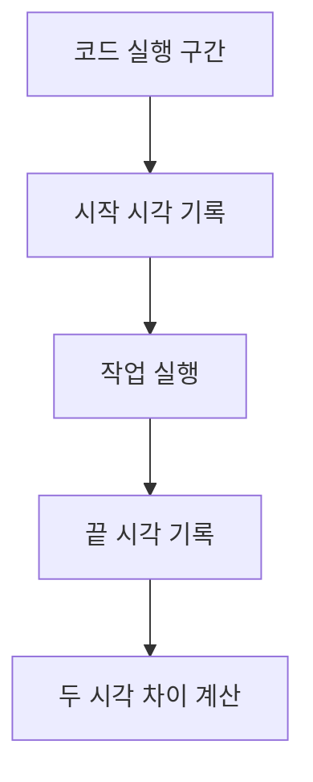
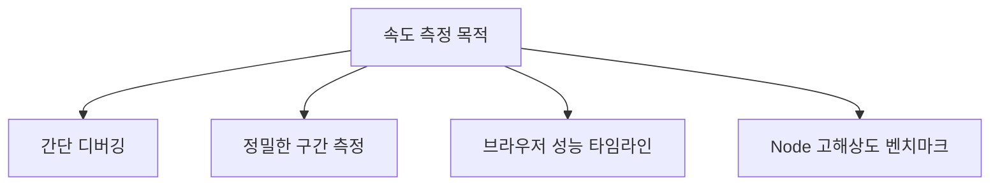
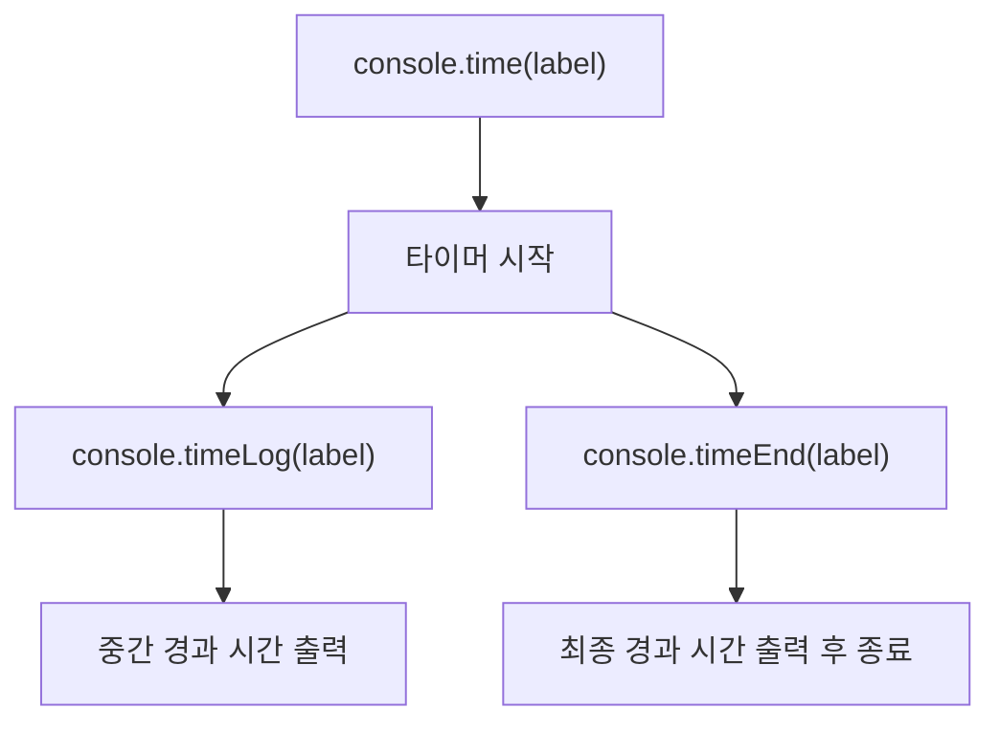
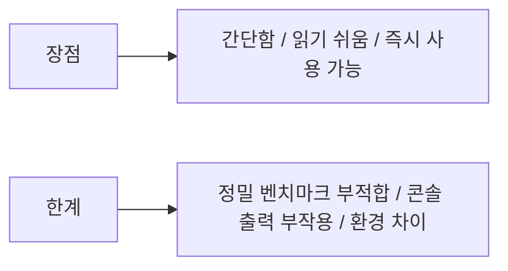
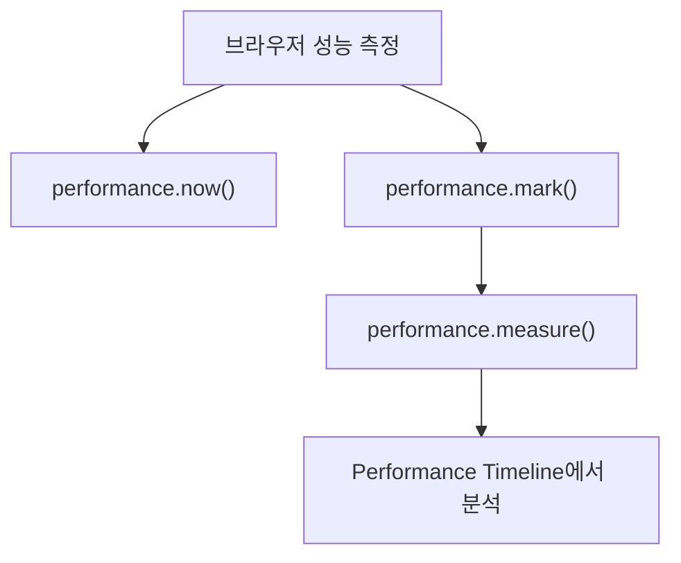
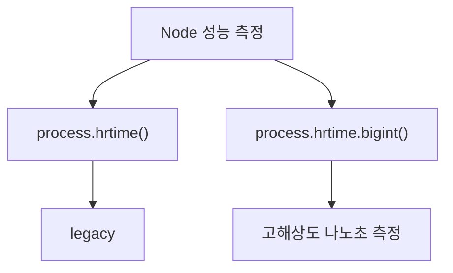
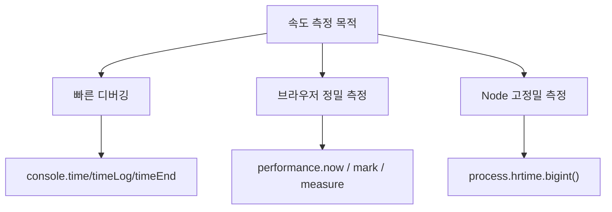

# `console.time()` 계열과 속도 측정 방식 상세 정리

작성 기준일: 2026-04-20  
조사 방식: 웹검색 기반 최신 조사  
주요 참고: MDN `console.time/timeLog/timeEnd`, MDN `performance.now/mark/measure`, Node.js `console` / `process.hrtime.bigint()`

## 1. 한 줄 요약



`console.time() ~ console.timeEnd()`는 특정 코드 구간의 경과 시간을 가장 빠르게 재보는 간편한 타이머 API이고, 더 정확하거나 구조화된 성능 측정이 필요하면 브라우저에서는 `performance.now()` / `performance.mark()` / `performance.measure()`, Node.js에서는 `process.hrtime.bigint()` 같은 고해상도 시간 API를 함께 고려해야 한다.

MDN은 `console.time()`을:

- operation이 얼마나 오래 걸리는지 추적하는 타이머 시작 API

라고 설명하고, Node.js 문서도:

- 라벨 기반 타이머를 시작/종료해 elapsed time을 출력한다고

설명한다.

즉 아주 단순하게 말하면:

- `console.time()` = 시작
- `console.timeLog()` = 중간 체크
- `console.timeEnd()` = 종료 + 출력

이다.

---

## 2. 왜 속도 측정 방식이 여러 가지인가



속도를 재는 목적은 상황마다 다르다.

예:

- "이 함수가 대충 얼마나 걸리지?"를 바로 보고 싶음
- "두 구현 중 어느 쪽이 빠른가?"를 더 정확히 비교하고 싶음
- "브라우저 렌더/네트워크/스크립트 타임라인" 안에서 보고 싶음
- "Node.js에서 아주 짧은 연산도 정밀하게 재고 싶음"

이 상황들은 요구 정밀도와 도구가 다르다.

### 2.1 간단 디버깅

이럴 땐:

- `console.time`
- `console.timeLog`
- `console.timeEnd`

가 가장 빠르고 편하다.

### 2.2 고해상도 측정

MDN `performance.now()`와 Node `process.hrtime.bigint()`는 둘 다:

- wall clock보다는 상대 시간 측정
- 고해상도 경과 시간

에 더 적합하다.

### 2.3 왜 `Date.now()`만 쓰면 부족한가

MDN `Date.now()`는 epoch 기준 millisecond를 준다.

즉:

- 시간대나 실제 시계 시간 의미는 있으나
- 성능 측정 전용으로는 resolution과 stability가 덜 적합할 수 있다

즉 목적에 따라 API를 나눠 써야 한다.

---

## 3. `console.time()`, `console.timeLog()`, `console.timeEnd()`



이 세 개는 한 세트로 이해하면 된다.

### 3.1 `console.time(label)`

MDN은 `console.time()`이:

- 이름(label)을 가진 타이머를 시작한다고

설명한다.

특징:

- label을 생략하면 `"default"`
- 브라우저 기준 한 페이지에서 최대 10,000개의 타이머 가능

예:

```js
console.time("load-users");
```

### 3.2 `console.timeLog(label, ...data)`

MDN은 `console.timeLog()`를:

- 이미 시작된 타이머의 현재 경과 시간을 로그한다고

설명한다.

즉:

- 작업 중간 체크포인트를 찍고 싶을 때

유용하다.

예:

```js
console.time("process");
step1();
console.timeLog("process", "after step1");
step2();
console.timeEnd("process");
```

### 3.3 `console.timeEnd(label)`

MDN은 `console.timeEnd()`가:

- 타이머를 중지하고
- 경과 시간을 출력한다고

설명한다.

Node.js 문서는 추가로:

- v6부터는 `timeEnd()`가 타이머를 삭제한다고

명시한다.

즉 같은 label로 다시 재려면 다시 `console.time()`을 호출해야 한다.

### 3.4 출력 형식

Node.js 문서는 elapsed time을:

- 상황에 맞는 단위로 표시할 수 있다고

설명한다.

즉 항상 똑같이 `ms` 고정 문자열만 나오는 것으로 가정하면 안 된다.

---

## 4. `console.time()` 계열의 장점과 한계



### 4.1 장점

- 어디서나 바로 쓸 수 있음
- 추가 라이브러리 필요 없음
- 코드 블록 앞뒤에 두기 쉬움
- 중간 단계 `timeLog()` 가능

즉 디버깅용으로 매우 좋다.

### 4.2 한계

- 콘솔 출력 자체가 오버헤드가 될 수 있음
- 고해상도 성능 벤치마크에는 충분히 엄밀하지 않을 수 있음
- 브라우저 콘솔과 Node 콘솔의 동작/출력 타이밍이 완전히 같다고 가정하면 안 됨
- 실제 측정 구간 외의 JIT warmup, GC, I/O, 로그 출력 등이 섞일 수 있음

즉 `console.time()`은 "빠른 실무 측정 도구"지, 정교한 벤치마킹 프레임워크는 아니다.

### 4.3 언제 특히 적합한가

- 특정 함수가 대략 몇 ms인지 보고 싶을 때
- API 요청 처리 단계별 시간을 찍을 때
- 개발 중 병목 위치를 빠르게 찾고 싶을 때

### 4.4 언제 덜 적합한가

- 아주 짧은 연산의 미세 비교
- 통계적 벤치마크
- 브라우저 렌더링 이벤트와 결합된 정밀 측정

이런 경우는 다른 도구가 더 맞는다.

---

## 5. 브라우저에서 더 적합한 측정: `performance.now()` / User Timing



MDN `performance.now()`는:

- `DOMHighResTimeStamp`
- `Performance.timeOrigin` 기준 경과 시간

을 반환한다고 설명한다.

즉 wall clock 시간보다 성능 측정에 더 적합한 고해상도 타이머다.

### 5.1 `performance.now()`

예:

```js
const start = performance.now();
doWork();
const end = performance.now();
console.log(end - start);
```

장점:

- 더 고해상도
- 상대 시간 측정에 적합
- `Date.now()`보다 성능 측정 용도에 더 자연스러움

### 5.2 `performance.mark()` / `performance.measure()`

MDN `measure()`는:

- mark 사이 구간을 PerformanceMeasure로 기록한다고

설명한다.

예:

```js
performance.mark("start");
doWork();
performance.mark("end");
performance.measure("doWork duration", "start", "end");
```

### 5.3 왜 중요한가

이 방식은:

- 콘솔 출력용이 아니라
- 성능 타임라인에 구조적으로 남길 수 있다는 점

이 중요하다.

즉 브라우저 DevTools Performance panel, custom instrumentation, Web Vitals 흐름과 더 잘 맞는다.

### 5.4 브라우저 실무 감각

- 간단 확인 -> `console.time`
- 상대 시간 정밀 측정 -> `performance.now`
- 구조화된 마킹/타임라인 -> `mark/measure`

라고 보면 된다.

---

## 6. Node.js에서 더 적합한 측정: `process.hrtime.bigint()`



Node.js `process` 문서는:

- `process.hrtime()`은 legacy
- `process.hrtime.bigint()`를 쓰라고

설명한다.

### 6.1 `process.hrtime.bigint()`

예:

```js
import { hrtime } from "node:process";

const start = hrtime.bigint();
doWork();
const end = hrtime.bigint();

console.log(`took ${end - start}ns`);
```

### 6.2 왜 중요한가

문서 기준:

- arbitrary time origin 기준
- time of day와 무관
- nanoseconds as bigint

즉 아주 짧은 구간을 재거나, clock drift 영향을 피하고 싶을 때 적합하다.

### 6.3 `process.hrtime()`와 차이

구형:

```js
const start = process.hrtime();
const diff = process.hrtime(start);
```

현대 권장:

```js
const start = process.hrtime.bigint();
const diff = process.hrtime.bigint() - start;
```

즉 bigint 버전이 더 단순하다.

### 6.4 Node 실무 감각

- 로그만 빠르게 남김 -> `console.time`
- 마이크로벤치마크 / 고정밀 측정 -> `process.hrtime.bigint()`

라고 정리하면 된다.

---

## 7. 실제로는 어떤 방식을 언제 쓰는가



### 7.1 `console.time()`이 잘 맞는 경우

- 함수 하나가 대충 얼마나 걸리는지 보고 싶다
- 단계별 시간을 로그로 찍고 싶다
- 운영 로그에서 가볍게 시간 추적을 하고 싶다

### 7.2 `performance.now()`가 더 맞는 경우

- 브라우저에서 더 정확한 상대 시간 측정
- 렌더링/입력 반응/네트워크 후처리 측정

### 7.3 `performance.mark/measure`가 더 맞는 경우

- 구간 측정을 성능 타임라인에 남기고 싶다
- 여러 측정값을 구조화해 보고 싶다

### 7.4 `process.hrtime.bigint()`가 더 맞는 경우

- Node에서 고해상도 벤치마크
- 아주 짧은 코드 경로 비교
- 콘솔 출력 오버헤드를 최소화한 측정

### 7.5 `Date.now()`는 어디에 맞나

MDN `Date.now()`는 epoch milliseconds를 반환한다.

즉:

- 현재 시각 기록
- 로그 타임스탬프

에는 적합하지만, 정밀 성능 측정에는 보통 더 나은 대안이 있다.

### 7.6 실무 권장 요약

- 브라우저 빠른 확인 -> `console.time`
- 브라우저 정밀 측정 -> `performance.now`
- 브라우저 구조화된 구간 -> `performance.mark/measure`
- Node 빠른 확인 -> `console.time`
- Node 고정밀 측정 -> `process.hrtime.bigint()`

---

## 참고 링크

- MDN `console.time()`: [console: time()](https://developer.mozilla.org/en-US/docs/Web/API/console/time_static)
- MDN `console.timeLog()`: [console: timeLog()](https://developer.mozilla.org/en-US/docs/Web/API/console/timeLog_static)
- MDN `console.timeEnd()`: [console: timeEnd()](https://developer.mozilla.org/en-US/docs/Web/API/console/timeEnd_static)
- MDN `performance.now()`: [Performance.now()](https://developer.mozilla.org/en-US/docs/Web/API/Performance/now)
- MDN `performance.measure()`: [Performance.measure()](https://developer.mozilla.org/en-US/docs/Web/API/Performance/measure)
- MDN `PerformanceMeasure`: [PerformanceMeasure](https://developer.mozilla.org/en-US/docs/Web/API/PerformanceMeasure)
- MDN `Date.now()`: [Date.now()](https://developer.mozilla.org/en-US/docs/Web/JavaScript/Reference/Global_Objects/Date/now)
- Node.js Console API: [Console](https://nodejs.org/api/console.html)
- Node.js Process API: [process.hrtime.bigint()](https://nodejs.org/api/process.html#processhrtimebigint)
