# Tone.js

## 1. 한 줄 요약

- Tone.js는 브라우저의 Web Audio API 위에 만든 JavaScript/TypeScript 오디오 프레임워크다.
- 낮은 레벨의 `AudioContext`, `AudioNode`, `AudioParam` 그래프를 직접 다루는 대신, synth, sample player, effect, signal, transport, sequencer 같은 음악/오디오 작업 단위를 제공한다.
- `dubright_front`에서는 `ShockWave.js`가 Tone.js를 오디오 파일 재생, effect chain, Web Audio scheduling 용도로 사용한다.
- 2026-05-06 확인 기준 npm registry의 `tone` stable `latest`는 `15.1.22`, `next`는 `15.5.6`이다. `dubright_front/package.json`은 `^15.0.4`를 사용한다.

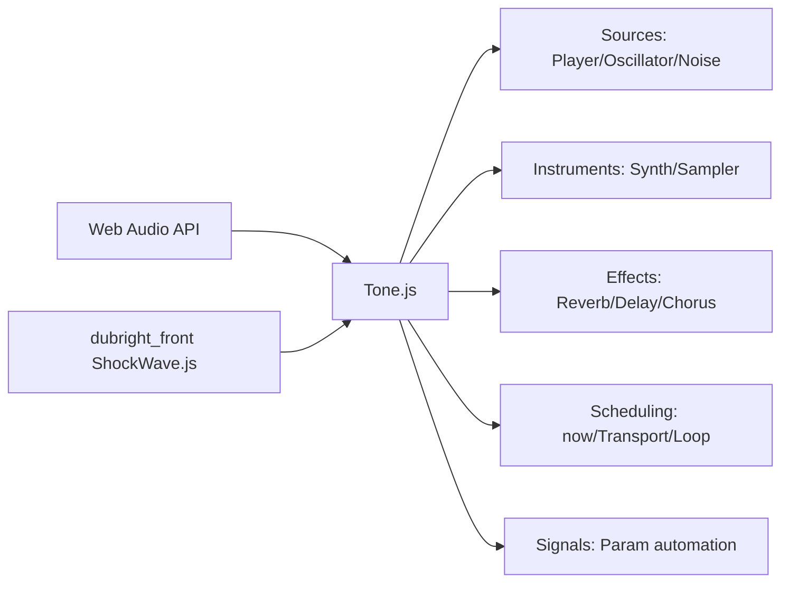

## 2. 왜 중요한가

- Web Audio API는 강력하지만 직접 다루면 다음 부담이 크다.
  - browser autoplay 정책 대응
  - `AudioContext` lifecycle 관리
  - sample-accurate scheduling
  - source/effect/destination graph 연결
  - parameter automation
  - audio buffer load/decode
  - cleanup/dispose
- Tone.js는 이 부담을 음악/오디오 개발자가 쓰기 쉬운 API로 감싼다.
  - `Tone.Player`로 audio file을 로드하고 재생한다.
  - `Tone.Synth`, `Tone.PolySynth`, `Tone.Sampler`로 악기처럼 소리를 만든다.
  - `Tone.Reverb`, `Tone.FeedbackDelay`, `Tone.Chorus`, `Tone.PitchShift` 같은 effect를 연결한다.
  - `Tone.getTransport()`, `Tone.Loop`, `Tone.Sequence`, `Tone.Part`로 beat/timeline 기반 이벤트를 스케줄한다.
  - `Tone.Signal`, `Tone.Param` 계열로 audio-rate 값 변화를 예약한다.
- Dubright 맥락에서는 DAW 전체를 만들기보다, 오디오 clip/hole 단위 재생과 effect preview를 정확한 timing으로 수행하는 데 유용하다.

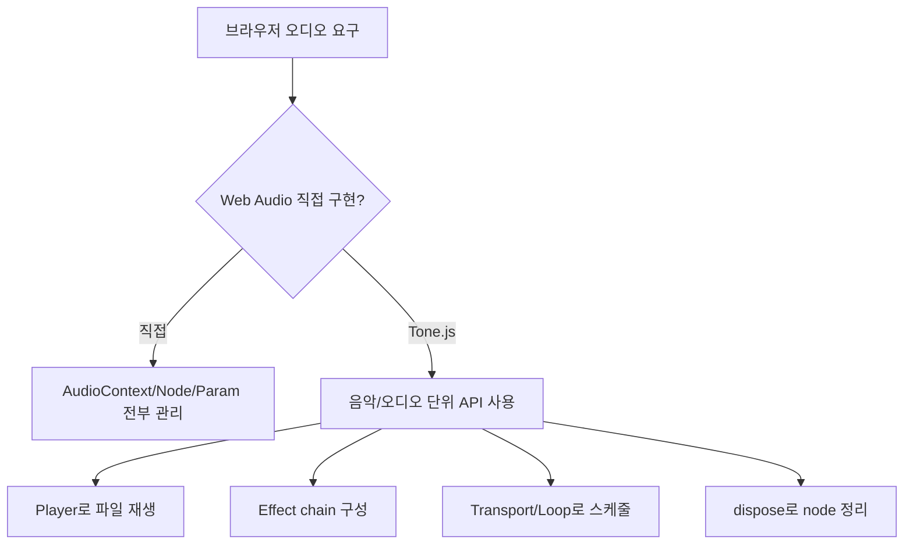

## 3. 버전, 패키지, 배포 구조

- npm registry 확인 결과
  - package name: `tone`
  - stable dist-tag `latest`: `15.1.22`
  - prerelease/개발 dist-tag `next`: `15.5.6`
  - `latest` publish time: `2025-04-27T15:20:00.673Z`
  - registry modified time: `2026-03-01T21:15:48.849Z`
  - license: MIT
  - package type: ESM module
  - main/module/types: `build/esm/index.js`, `build/esm/index.d.ts`
  - unpkg browser build: `build/Tone.js`
  - runtime dependencies: `standardized-audio-context`, `tslib`
- GitHub `dev` branch의 `package.json`은 npm published stable과 다를 수 있다.
  - 조사 시점에 GitHub `dev` branch `package.json`은 `15.5.0`으로 보였다.
  - 실제 설치 기준은 npm registry의 dist-tag를 우선해야 한다.
- `dubright_front` 기준
  - `package.json`에 `"tone": "^15.0.4"`가 있다.
  - semver상 `^15.0.4`는 같은 major `15.x`의 호환 가능한 최신 버전으로 해석될 수 있다.
  - 실제 설치 버전은 lockfile과 설치 시점에 좌우되므로, 런타임 이슈 분석 시 `package-lock.json` 또는 `node_modules/tone/package.json`을 확인해야 한다.

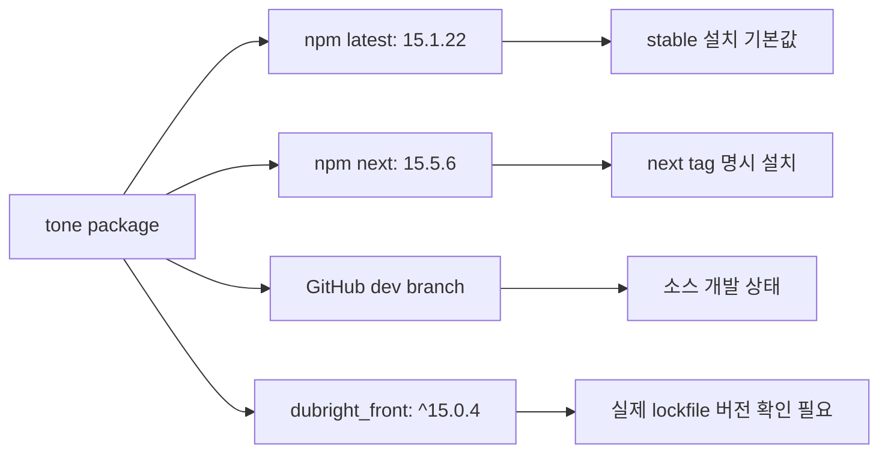

## 4. Web Audio API와 Tone.js의 관계

- Web Audio API의 기본 모델
  - `AudioContext` 안에서 source, effect, destination node를 만든다.
  - node의 input/output을 연결해 audio graph를 구성한다.
  - source는 oscillator, audio buffer, media stream, media element 등이 될 수 있다.
  - effect는 gain, filter, delay, convolver, compressor 등이 될 수 있다.
  - 최종 출력은 보통 `AudioDestinationNode`, 즉 speaker/headphone으로 간다.
- Tone.js가 하는 일
  - native Web Audio node를 직접 쓰되, 음악적 개념과 ergonomic API로 감싼다.
  - `Tone.Gain`은 native `GainNode`의 wrapper다.
  - `Tone.Player`는 audio file buffer를 로드하고 `AudioBufferSourceNode` 계열 playback을 추상화한다.
  - `Tone.Signal`과 `Tone.Param`은 `AudioParam` automation을 더 음악적으로 다룰 수 있게 한다.
  - `Tone.setContext()`로 외부에서 만든 `AudioContext`를 Tone.js의 default context로 지정할 수 있다.
- 중요한 차이
  - Web Audio는 "node graph" 중심이다.
  - Tone.js는 "음악/오디오 객체" 중심이다.
  - Tone.js를 쓰더라도 결국 native audio node가 만들어지므로 cleanup과 routing 비용은 사라지지 않는다.

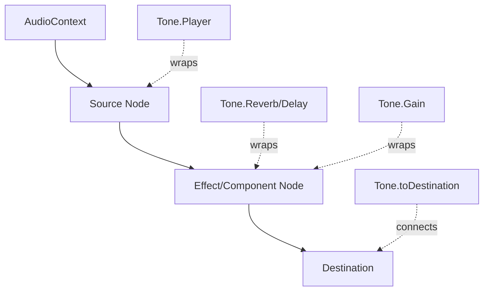

## 5. AudioContext 시작과 browser autoplay 정책

- 브라우저는 사용자 제스처 없이 audio playback을 막는 경우가 많다.
- Tone.js 공식 문서는 click 또는 keydown 같은 사용자 이벤트 안에서 `Tone.start()`를 호출하라고 안내한다.
- `Tone.start()`는 global audio context를 resume하는 promise를 반환한다.
- `Tone.getContext()`
  - Tone.js의 global context를 가져온다.
  - source code 기준, 실제 audio context가 필요해질 때 default context를 만든다.
- `Tone.setContext(context, disposeOld?)`
  - 외부 `AudioContext` 또는 Tone context를 default context로 지정한다.
  - `dubright_front`의 `ShockWave.js`는 공유 `AudioContextManager`가 만든 context를 `Tone.setContext(audioManager.getContext())`로 넘긴다.
- 실무 주의
  - `Tone.start()` 이전에 재생을 예약하면 무음 또는 scheduling 이상이 날 수 있다.
  - 여러 곳에서 context를 따로 만들면 mobile/browser 자원 제한과 메모리 관리 문제가 커진다.
  - Dubright처럼 공유 context를 쓰는 방식은 오디오 node 관리와 latency 일관성에 유리하다.

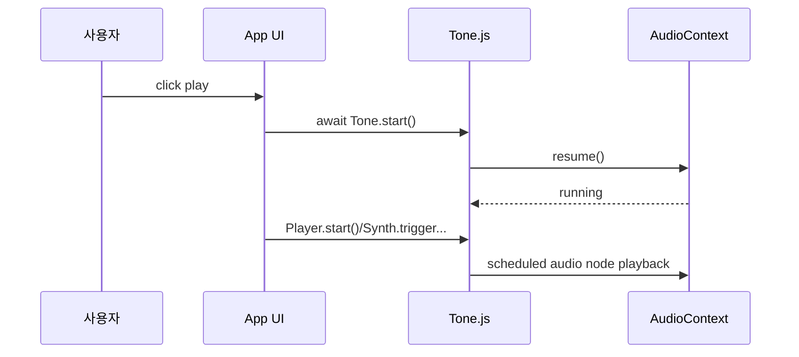

## 6. 시간 모델과 scheduling

- Web Audio의 기준 시간
  - `AudioContext.currentTime`은 context가 시작된 뒤 흐른 초 단위 시간이다.
  - sample-accurate scheduling을 위해 audio event는 이 시간 축에 예약된다.
- Tone.js의 시간 함수
  - `Tone.now()`는 Tone context clock의 현재 시간에 lookAhead를 더한 값을 반환한다.
  - `Tone.immediate()`는 lookAhead 없이 현재 context clock을 반환한다.
  - Tone object의 `toSeconds("4n")`, `toTicks("8n")`, `toFrequency("A4")` 같은 helper는 음악 단위를 초/tick/frequency로 변환한다.
- 시간 문자열
  - `"4n"`: quarter note
  - `"8n"`: eighth note
  - `"8t"`: eighth-note triplet
  - `"1m"`: one measure
  - `"+1"`: 지금부터 1초 뒤 같은 relative time 표현
- scheduling 원칙
  - JavaScript callback 자체는 정확한 audio timing을 보장하지 않는다.
  - Tone.js의 loop/transport callback은 실제 audio event time을 인자로 넘긴다.
  - synth나 player를 그 callback 안에서 실행할 때는 전달받은 `time`을 다시 넘겨야 정확하다.
- Dubright 연결
  - `ShockWave.js`는 `Tone.now() + scheduleDelay`로 `Tone.Player.start()` 시점을 잡는다.
  - 이것은 UI timer가 아니라 Web Audio clock 기준 예약에 가깝다.

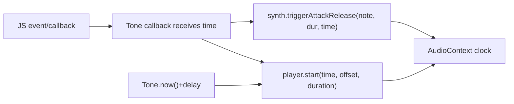

## 7. Sources와 Instruments

- Source 계열
  - `Tone.Player`: audio file 또는 `AudioBuffer` 기반 playback
  - `Tone.Oscillator`: sine/square/triangle/sawtooth 같은 oscillator
  - `Tone.Noise`: white/pink/brown noise generator
  - `Tone.GrainPlayer`: granular playback
  - `Tone.UserMedia`: microphone input helper
- Instrument 계열
  - `Tone.Synth`: oscillator + amplitude envelope로 구성된 기본 monophonic synth
  - `Tone.AMSynth`, `Tone.FMSynth`: AM/FM synthesis 기반 synth
  - `Tone.MonoSynth`: filter/envelope를 포함한 monophonic synth
  - `Tone.PolySynth`: monophonic synth class를 여러 voice로 관리해 polyphonic playback 제공
  - `Tone.Sampler`: note별 sample을 pitch shift해서 instrument처럼 사용
- `Tone.Synth` 구조
  - 공식 문서 기준 `OmniOscillator -> AmplitudeEnvelope -> Output` 형태다.
  - `triggerAttack`, `triggerRelease`, `triggerAttackRelease`로 note lifecycle을 다룬다.
- Dubright와의 관계
  - 현재 `dubright_front/ShockWave.js`는 synth보다는 `Tone.Player`를 핵심으로 쓴다.
  - 즉 음악 생성보다는 이미 존재하는 녹음/클립 파일 재생이 중심이다.

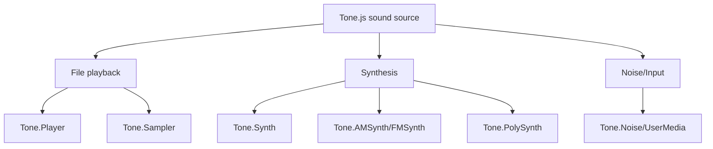

## 8. Tone.Player 상세

- 역할
  - `Tone.Player`는 audio file player다.
  - start, loop, stop, seek, restart, load 기능을 제공한다.
- 생성자
  - URL, `AudioBuffer`, `ToneAudioBuffer` 또는 options object를 받을 수 있다.
  - URL을 생성자에 넘기면 buffer loading을 함께 시작한다.
  - 수동으로 새 URL을 로드하려면 `player.load(url)`을 쓴다.
- 주요 property
  - `buffer`: player가 가진 `ToneAudioBuffer`
  - `loaded`: buffer load 완료 여부
  - `autostart`: load되면 바로 재생할지 여부
  - `loop`: 반복 여부
  - `loopStart`, `loopEnd`: loop 구간
  - `playbackRate`: 재생 속도. 공식 문서 기준 pitch도 함께 바뀐다.
  - `reverse`: buffer를 reverse할지 여부. 같은 buffer를 공유하면 다른 player에도 영향이 갈 수 있다.
  - `fadeIn`, `fadeOut`: 시작/종료 fade time
  - `onstop`: source가 stop될 때 호출되는 callback
- `start(time, offset, duration)`
  - `time`: 언제 시작할지
  - `offset`: buffer의 어느 위치부터 재생할지
  - `duration`: 얼마나 재생할지
  - duration을 생략하면 offset 이후 남은 길이를 재생한다.
- 내부 동작
  - source code 기준 재생마다 `ToneBufferSource`를 새로 만든다.
  - active source set을 관리한다.
  - loop가 아니면 계산된 종료 시점에 state를 stopped로 예약한다.
  - `dispose()`는 active sources, buffer, progress tracker 등을 정리한다.
- Dubright 연결
  - `ShockWave.js`는 `new Tone.Player()`를 만들고, audio file을 직접 fetch/decode한 `AudioBuffer`를 `Tone.ToneAudioBuffer`로 감싸 player buffer에 넣는다.
  - `__tone_player.start(startWhen, position, duration)`로 trim/offset playback을 수행한다.

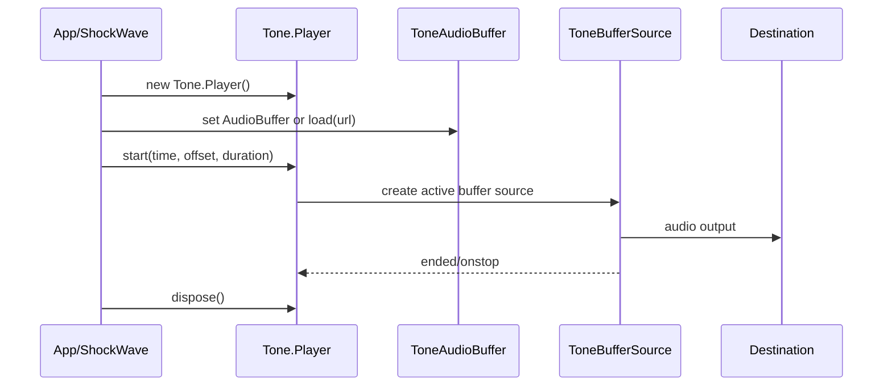

## 9. Effects와 routing

- Tone.js의 routing API
  - `connect(destination)`: 출력 하나를 다음 node로 연결
  - `chain(a, b, c)`: 직렬 연결
  - `fan(a, b)`: 병렬 연결
  - `toDestination()`: context destination으로 연결
  - `disconnect()`: 연결 해제
  - `dispose()`: 내부 Web Audio node를 해제 가능한 상태로 정리
- 대표 effect
  - `Tone.Reverb`: convolution 기반 또는 reverb helper 계열
  - `Tone.FeedbackDelay`: delay output 일부를 다시 input으로 되먹이는 delay
  - `Tone.Chorus`: LFO와 delay를 이용한 chorus
  - `Tone.PitchShift`: pitch shift effect
  - `Tone.Filter`: lowpass/highpass 등 filter
  - `Tone.Distortion`, `Tone.BitCrusher`, `Tone.Phaser`, `Tone.Tremolo` 등
- Dubright의 effect chain
  - EQ
  - Chorus
  - Reverb
  - FeedbackDelay
  - PitchShift
  - Gain
- Dubright가 쓰는 Tone classes
  - `Tone.Gain`
  - `Tone.MultibandSplit`
  - `Tone.Chorus`
  - `Tone.Reverb`
  - `Tone.FeedbackDelay`
  - `Tone.PitchShift`
- 실무 포인트
  - effect node는 playback마다 만들면 정확하지만 비용이 든다.
  - 여러 clip이 동시에 재생되면 node 수가 급격히 늘 수 있다.
  - 재생 종료 시 `disconnect()`와 `dispose()`가 빠지면 phantom connection, memory leak, 중복 출력 문제가 생길 수 있다.

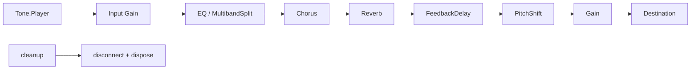

## 10. Transport, Loop, Sequence, Part

- `Tone.getTransport()`
  - global Tone context에 속한 transport object를 가져온다.
  - README는 Transport를 DAW의 arrangement view처럼 생각할 수 있다고 설명한다.
- Transport가 필요한 경우
  - beat grid 기반 sequencer
  - loop playback
  - tempo/bpm 기반 event sync
  - 여러 synth/effect event를 같은 timeline에 맞추는 작업
- `Tone.Loop`
  - 지정 interval마다 callback을 반복한다.
  - callback은 Transport timeline 위에서 start/stop할 수 있다.
- `Tone.Sequence`
  - step sequencer처럼 값 배열을 순서대로 재생하는 데 유용하다.
- `Tone.Part`
  - 시간과 값을 가진 이벤트 집합을 arrangement처럼 배치하는 데 적합하다.
- Dubright와의 구분
  - `ShockWave.js`는 현재 `Transport` 기반 sequencer보다 `Tone.now() + scheduleDelay` 방식의 player scheduling을 쓴다.
  - 오디오 clip timeline 전체를 beat 기반 음악 sequencer로 다루는 요구가 아니라면 Transport 없이도 충분하다.

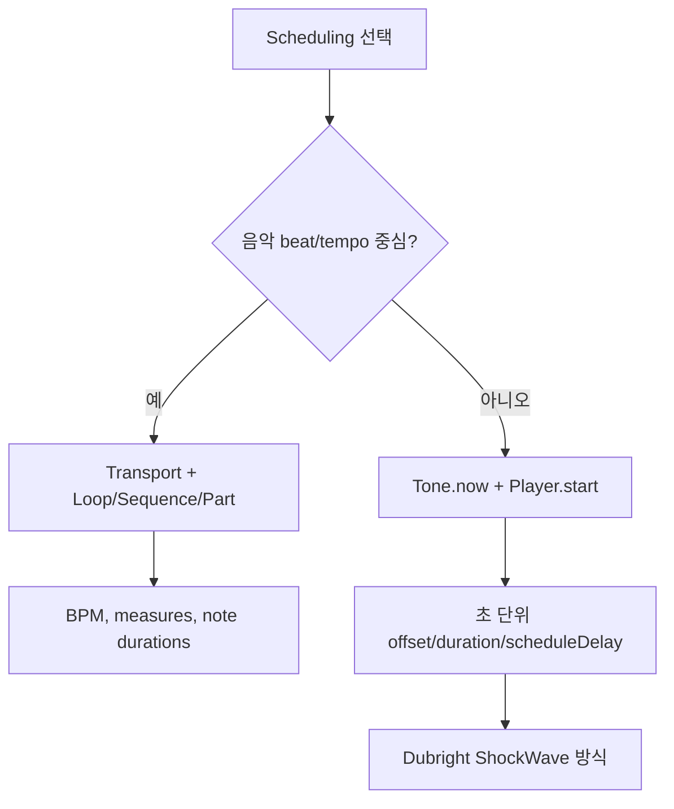

## 11. Signal, Param, automation

- Tone.js는 Web Audio의 `AudioParam` 자동화를 더 쓰기 쉽게 만든다.
- `Tone.Signal`
  - audio-rate 값 control에 쓰인다.
  - frequency, gain, detune 같은 값에 ramp/curve를 걸 수 있다.
- `Tone.Param`
  - 특정 unit을 가진 parameter wrapper다.
  - 예: `"frequency"`, `"decibels"`, `"gain"`, `"normalRange"` 등.
- automation 예시
  - `rampTo(value, time)`
  - `setValueAtTime(value, time)`
  - `linearRampToValueAtTime(value, time)`
  - `exponentialRampToValueAtTime(value, time)`
  - `setValueCurveAtTime(values, startTime, duration)`
- 왜 중요한가
  - UI thread에서 `setInterval`로 값을 바꾸면 jitter가 생긴다.
  - AudioParam automation은 audio clock 기준으로 적용되므로 훨씬 정확하다.
- Dubright 연결
  - 현재 `ShockWave.js`는 volume/gain 값을 `Tone.Gain.gain.value`로 직접 바꾼다.
  - 부드러운 fade나 click noise 방지가 필요하면 `gain.rampTo()` 또는 AudioParam automation을 검토할 수 있다.

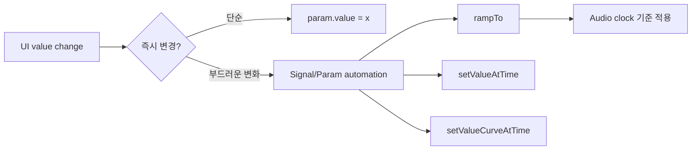

## 12. Loading, buffer, sample playback

- `Tone.loaded()`
  - 공식 README 기준 모든 audio file load가 끝났을 때 resolve되는 promise다.
  - 여러 `Player`, `Sampler`가 동시에 sample을 로드할 때 편하다.
- `Tone.Player.load(url)`
  - audio file을 audio buffer로 로드하고 decode한다.
  - 파일 타입 지원은 브라우저에 의존한다.
- `ToneAudioBuffer`
  - Tone.js 내부 buffer wrapper다.
  - `AudioBuffer`, URL, reverse, onload/onerror 같은 동작을 다룬다.
- Web Audio 원리
  - MDN 기준 `AudioBuffer`는 decoding된 short audio asset을 memory에 보관한다.
  - playback 시 `AudioBufferSourceNode` 같은 source node로 출력한다.
- Dubright 방식의 특징
  - Tone.js의 URL load만 쓰지 않고, 먼저 `fetch()`와 `decodeAudioData()`로 `AudioBuffer`를 만든다.
  - 같은 URL을 `audioBufferCache`에 저장해 중복 decode/download를 줄인다.
  - 이후 `Tone.ToneAudioBuffer(audioBuffer)`로 Tone.Player에 넘긴다.
  - 이 구조는 waveform rendering에 필요한 raw channel sample과 Tone playback buffer를 같은 decode 결과에서 얻기 위해 적합하다.

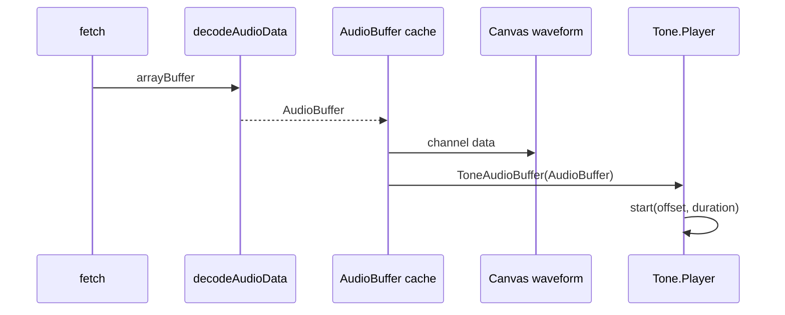

## 13. Cleanup과 lifecycle

- Tone.js object는 대부분 `dispose()`를 제공한다.
- `dispose()`의 의미
  - 내부 Web Audio node를 disconnect한다.
  - 참조를 끊어 garbage collection 가능성을 높인다.
  - 재사용 목적이 아니라 lifecycle 종료 목적이다.
- source playback cleanup
  - `stop()`은 재생을 멈추는 동작이다.
  - `disconnect()`는 routing 연결을 끊는다.
  - `dispose()`는 node 내부 리소스까지 정리한다.
  - 셋은 역할이 다르므로 장시간 앱에서는 모두 구분해야 한다.
- Dubright에서 특히 중요한 이유
  - audio clip/hole이 많다.
  - 동시에 여러 `Tone.Player`, `Tone.Gain`, effect node가 만들어질 수 있다.
  - UI route 이동, dialog close, waveform hide/show, 전체 재생 중 stop 같은 lifecycle이 많다.
- 점검 포인트
  - 재생 종료 시 effect chain node가 모두 dispose되는가
  - player 자체가 필요 없을 때 dispose되는가
  - 같은 URL buffer cache의 refCount가 정상 감소하는가
  - scheduled playback timer가 component unmount 후에도 남지 않는가

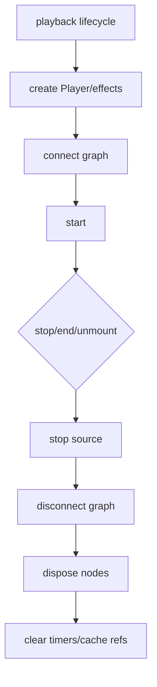

## 14. Dubright ShockWave.js에서의 실제 사용

- import
  - `import * as Tone from "tone";`
- context
  - `Tone.setContext(audioManager.getContext())`
  - Dubright의 singleton `AudioContextManager`와 Tone.js를 같은 context로 맞춘다.
- player
  - `this.tone_player = new Tone.Player()`
  - `AudioBuffer`가 있으면 `new Tone.ToneAudioBuffer(audioBuffer)`로 buffer를 직접 설정한다.
  - URL만 있으면 `player.load(url)`을 쓴다.
- playback
  - `const startWhen = scheduleDelay > 0 ? Tone.now() + scheduleDelay : 0`
  - `player.start(startWhen, position, duration)`
- effect chain
  - `Tone.Gain`: input/output/local gain
  - `Tone.MultibandSplit`: EQ 대역 분리
  - `Tone.Chorus`
  - `Tone.Reverb`
  - `Tone.FeedbackDelay`
  - `Tone.PitchShift`
- cleanup
  - player `stop()`, `disconnect()`, `dispose()`
  - effect nodes `dispose()`
  - `AudioContextManager.unregisterNode(...)`
- Dubright 관점 결론
  - Tone.js는 Dubright의 오디오 재생/effect backend 역할을 한다.
  - waveform drawing, URL cache, trim/margin/scheduleDelay 정책은 Dubright 커스텀 코드가 담당한다.
  - 따라서 Tone.js를 이해하되, 실제 버그는 Tone.js 자체보다 `ShockWave.js`의 lifecycle, effect graph, cache 정책에서 나올 가능성이 크다.

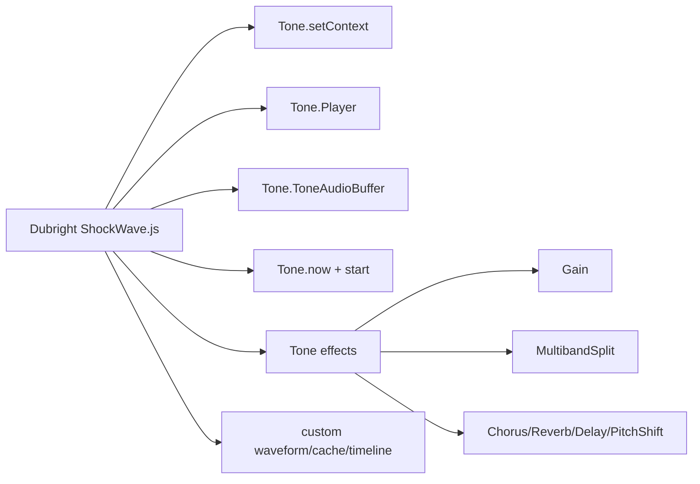

## 15. 실전 예시

- 사용자 제스처에서 context 시작

```ts
import * as Tone from "tone";

button.addEventListener("click", async () => {
  await Tone.start();
});
```

- sample player

```ts
import * as Tone from "tone";

const player = new Tone.Player("/audio/sample.mp3").toDestination();

await Tone.loaded();
player.start(Tone.now(), 0, 2);
```

- effect chain

```ts
const player = new Tone.Player("/audio/voice.webm");
const input = new Tone.Gain(1);
const reverb = new Tone.Reverb({ decay: 2.5, preDelay: 0.1 });
const delay = new Tone.FeedbackDelay({ delayTime: 0.15, feedback: 0.35 });

player.connect(input);
input.chain(reverb, delay, Tone.Destination);

await player.load("/audio/voice.webm");
player.start(Tone.now() + 0.1, 0, 3);
```

- cleanup

```ts
player.stop();
player.disconnect();
reverb.dispose();
delay.dispose();
input.dispose();
player.dispose();
```

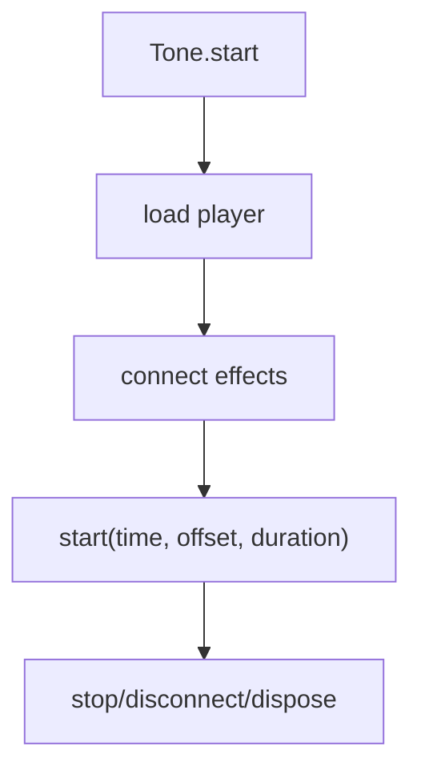

## 16. 빠른 복습

- Tone.js는 Web Audio API를 음악/오디오 앱 개발에 맞게 감싼 framework다.
- 핵심 개념은 `AudioContext`, source, effect, destination, scheduling, signal automation이다.
- `Tone.Player`는 audio file playback에 가장 직접적이다.
- `Tone.Synth`/`Sampler`는 악기 제작에 가깝고, Dubright의 현재 용도와는 거리가 있다.
- `Tone.getTransport()`는 beat/tempo 중심 sequencer가 필요할 때 강력하다.
- `Tone.now()`와 `Player.start(time, offset, duration)`은 Dubright처럼 timeline clip을 정확히 재생할 때 중요하다.
- `dispose()`를 놓치면 장시간 브라우저 오디오 앱에서 node leak과 메모리 문제가 생기기 쉽다.

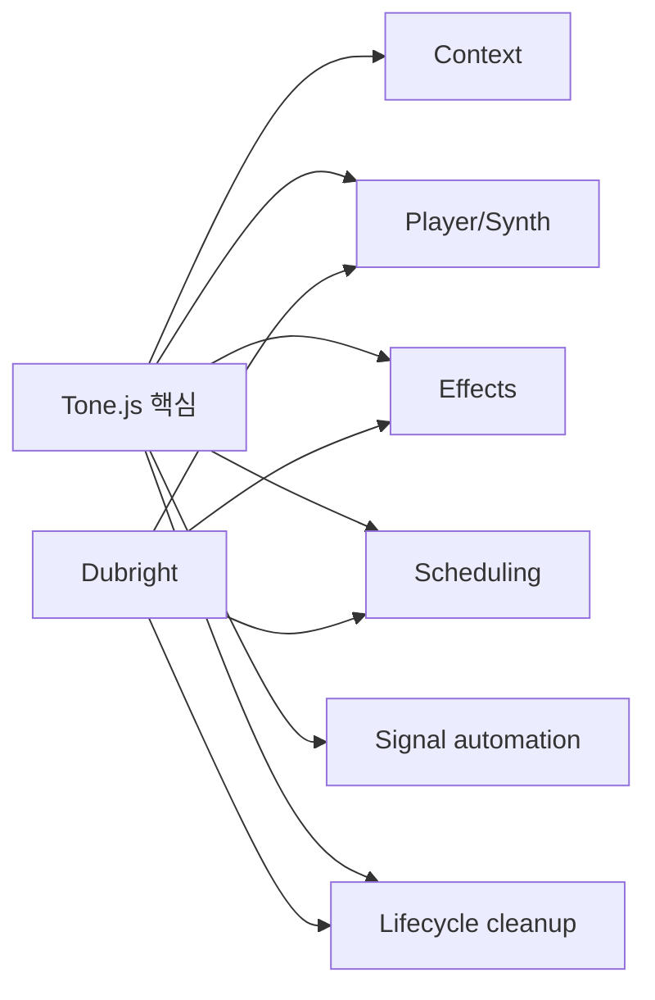

## 참고 링크

- [Tone.js 공식 홈페이지](https://tonejs.github.io/)
- [Tone.js 공식 API 문서 15.1.22 index](https://tonejs.github.io/docs/15.1.22/index.html)
- [Tone.js 공식 API - Player](https://tonejs.github.io/docs/15.1.22/classes/Player.html)
- [Tone.js 공식 API - Synth](https://tonejs.github.io/docs/15.1.22/classes/Synth.html)
- [Tone.js 공식 API - Loop](https://tonejs.github.io/docs/15.1.22/classes/Loop.html)
- [Tone.js 공식 API - getTransport](https://tonejs.github.io/docs/15.1.22/functions/getTransport.html)
- [Tone.js 공식 API - start](https://tonejs.github.io/docs/15.1.22/functions/start.html)
- [Tone.js GitHub repository](https://github.com/Tonejs/Tone.js)
- [Tone.js GitHub README](https://github.com/Tonejs/Tone.js/blob/dev/README.md)
- [Tone.js GitHub source - Player.ts](https://github.com/Tonejs/Tone.js/blob/dev/Tone/source/buffer/Player.ts)
- [Tone.js GitHub source - Global.ts](https://github.com/Tonejs/Tone.js/blob/dev/Tone/core/Global.ts)
- [npm package - tone](https://www.npmjs.com/package/tone)
- [npm registry JSON - tone latest](https://registry.npmjs.org/tone/latest)
- [MDN - Web Audio API](https://developer.mozilla.org/en-US/docs/Web/API/Web_Audio_API)
- [MDN - AudioContext](https://developer.mozilla.org/en-US/docs/Web/API/AudioContext)
- [MDN - AudioBufferSourceNode](https://developer.mozilla.org/en-US/docs/Web/API/AudioBufferSourceNode)
- [MDN - AudioParam](https://developer.mozilla.org/en-US/docs/Web/API/AudioParam)
- [dubright_front ShockWave.js](/Users/nes0903/Documents/dobedub/dubright_front/src/components/js/ShockWave.js)
- [dubright_front package.json](/Users/nes0903/Documents/dobedub/dubright_front/package.json)
