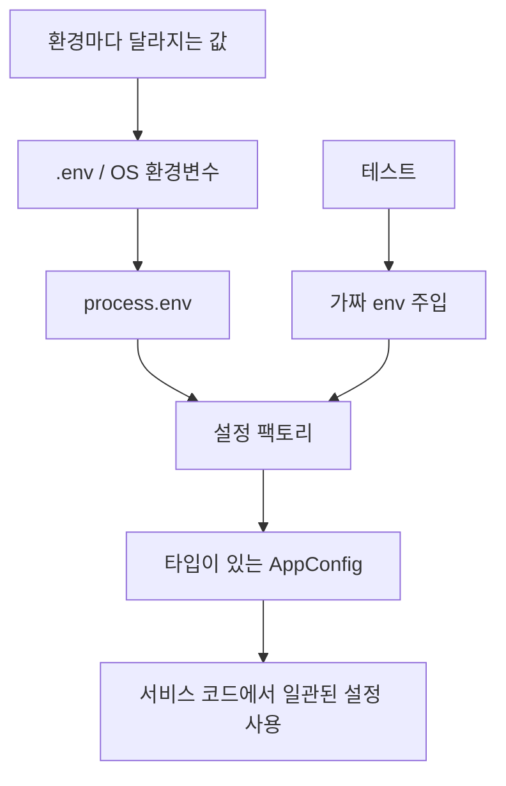
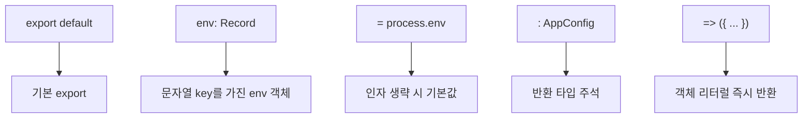
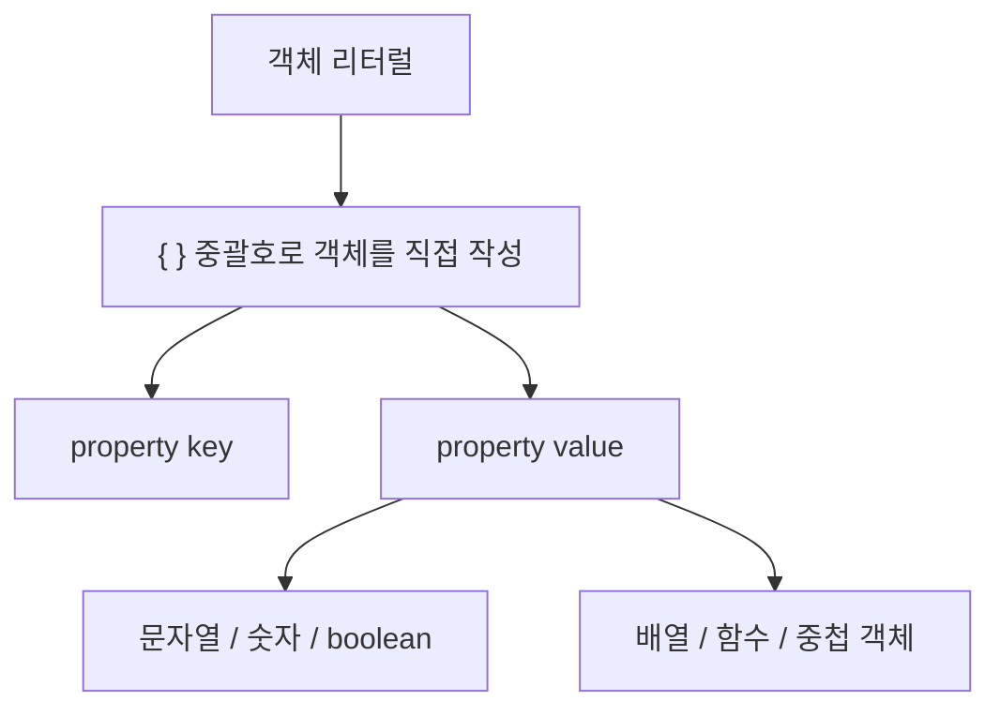
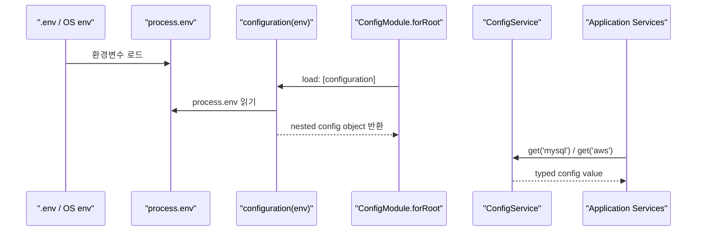
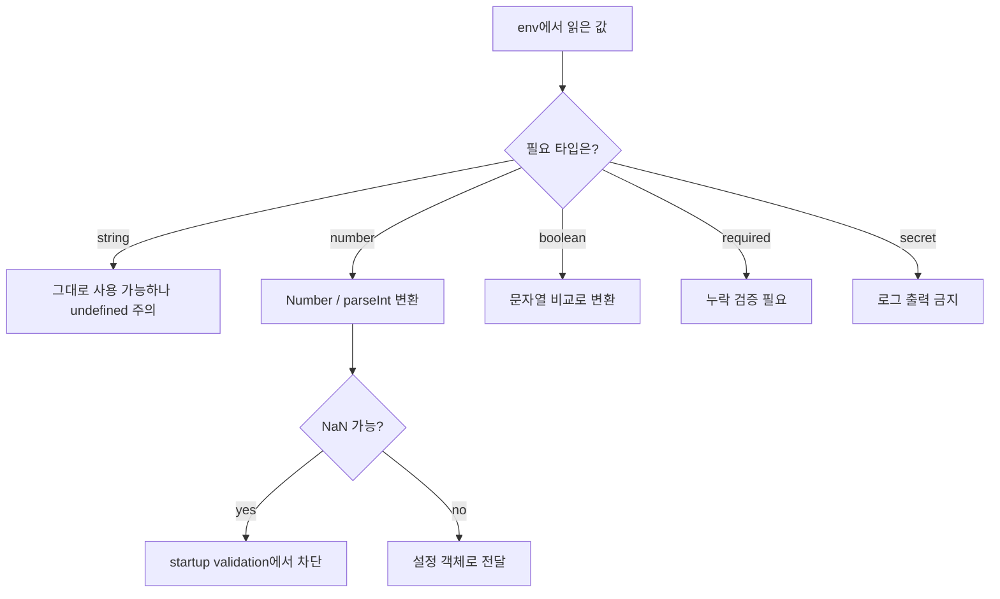
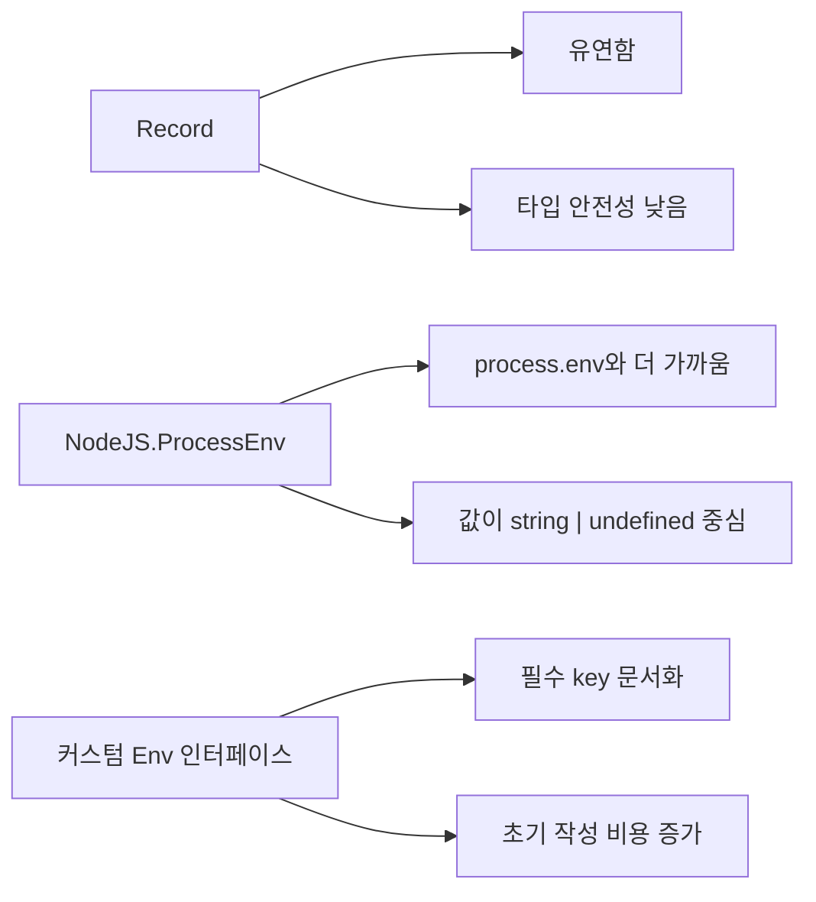
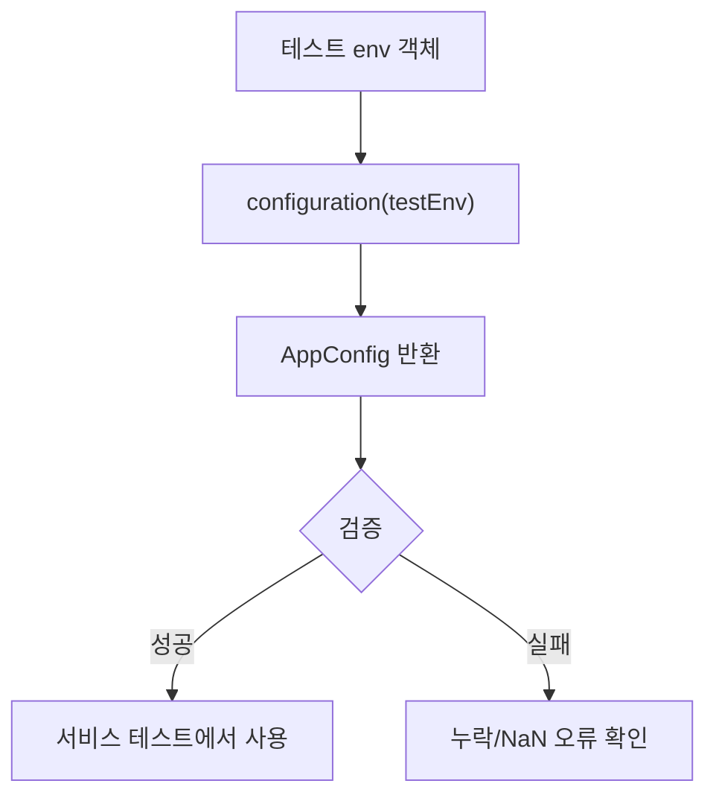
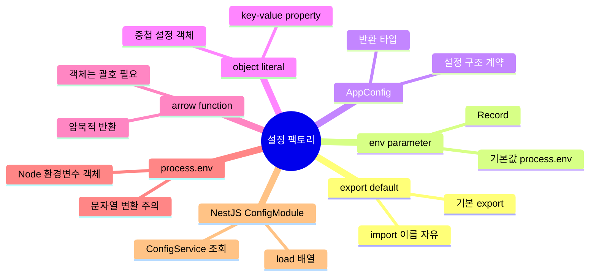

# TypeScript 환경변수 설정 팩토리 함수 정리

작성 기준일: 2026-05-11  
조사 방식: 웹검색 기반 공식 문서 확인  
주요 참고: TypeScript 공식 문서, Node.js 공식 문서, NestJS 공식 문서, MDN JavaScript 문서

## 1. 한 줄 요약


- `export default (env: Record<string, any> = process.env): AppConfig => ({ ... })`는 환경변수 객체를 입력받아 애플리케이션 설정 객체를 만들어 반환하는 **설정 팩토리 함수**다.
- 인자를 생략하면 Node.js의 `process.env`를 사용하고, 테스트나 검증 코드에서는 별도 `env` 객체를 주입할 수 있다.
- 반환 타입을 `AppConfig`로 고정해서 설정 객체가 기대 구조를 따르는지 TypeScript가 검사하게 만든다.
- `=> ({ ... })`처럼 객체를 괄호로 감싸는 이유는 arrow function에서 객체 리터럴을 바로 반환하기 위해서다.

질문에 나온 코드의 핵심 형태:

```ts
export default (env: Record<string, any> = process.env): AppConfig => ({
  mysql: {
    host: env.MYSQL_HOST,
    username: env.MYSQL_USERNAME,
    password: env.MYSQL_PASSWORD,
    database: env.MYSQL_DATABASE,
  },
});
```

## 2. 왜 중요한가



- 백엔드 애플리케이션은 로컬, 개발, 운영 환경에서 DB 주소, Redis 주소, JWT secret, 외부 API URL, AWS 키 등이 달라진다.
- 이런 값을 코드에 직접 박아두면 배포 환경 변경, 보안 관리, 테스트 격리가 어려워진다.
- NestJS 공식 문서는 복잡한 프로젝트에서 관련 설정을 nested object로 묶어 반환하는 custom configuration file 패턴을 안내한다.
- `configuration(env)`처럼 환경변수 읽기와 설정 객체 생성을 분리하면 다음 장점이 있다.
  - 환경변수 이름은 한 곳에서 관리된다.
  - 숫자, boolean 등 필요한 타입 변환을 중앙화할 수 있다.
  - 필수 값 누락 검증을 설정 로딩 시점에 수행할 수 있다.
  - 테스트에서 `process.env`를 직접 오염시키지 않고 가짜 env를 넘길 수 있다.

## 3. 핵심 문법 분해



### 3.1 `export default`

- 이 파일의 기본 export를 의미한다.
- import하는 쪽에서는 원하는 이름을 붙일 수 있다.

```ts
import configuration from './configuration';
import makeConfig from './configuration';
```

### 3.2 `env: Record<string, any>`

- `Record<Keys, Type>`은 TypeScript의 utility type이다.
- `Record<string, any>`는 대략 "문자열 key를 가지고, 값은 아무 타입이나 가능한 객체"라는 뜻이다.

```ts
type EnvLike = Record<string, any>;

const env: EnvLike = {
  MYSQL_HOST: 'localhost',
  SMTP_PORT: '587',
};
```

- 다만 `any`를 쓰면 타입 안전성이 낮아진다.
- 실제 Node.js `process.env`는 보통 문자열 기반 값으로 다뤄지므로 더 엄격하게는 `NodeJS.ProcessEnv`나 별도 인터페이스를 고려할 수 있다.

### 3.3 `= process.env`

- 파라미터 기본값이다.
- 호출자가 `env`를 넘기지 않으면 `process.env`를 사용한다.
- JavaScript/TypeScript에서 기본 파라미터는 인자가 없거나 `undefined`일 때 적용된다.

```ts
configuration(); // process.env 사용
configuration(undefined); // process.env 사용
configuration({ MYSQL_HOST: '127.0.0.1' }); // 주입된 객체 사용
```

### 3.4 `: AppConfig`

- 함수 반환 타입 주석이다.
- TypeScript 공식 문서 기준으로 반환 타입 주석은 필수는 아니지만, 문서화와 실수 방지에 유용하다.
- 이 코드에서는 설정 객체 구조가 `AppConfig`와 맞지 않으면 컴파일 단계에서 잡히도록 하는 역할을 한다.

```ts
interface AppConfig {
  mysql: DataSourceOptions;
  redis: RedisOptions;
}
```

### 3.5 객체 리터럴



- 객체 리터럴(object literal)은 `{ key: value }` 형태로 객체를 코드에 직접 작성하는 JavaScript 문법이다.
- 여기서 객체는 여러 값을 이름 붙은 property로 묶어 둔 자료 구조다.
- `literal`은 값을 변수나 계산 결과로 간접 생성하는 것이 아니라 코드에 직접 적은 표현이라는 뜻이다.
- 예를 들어 `'localhost'`는 문자열 리터럴, `3000`은 숫자 리터럴, `{ host: 'localhost' }`는 객체 리터럴이다.

```ts
const mysqlConfig = {
  host: 'localhost',
  port: 3306,
  ssl: false,
};
```

- 위 코드에서 `{ ... }` 부분이 객체 리터럴이다.
- `host`, `port`, `ssl`은 property key다.
- `'localhost'`, `3306`, `false`는 property value다.
- 객체 리터럴의 value에는 문자열, 숫자, boolean뿐 아니라 배열, 함수, 다른 객체도 들어갈 수 있다.

```ts
const appConfig = {
  mysql: {
    host: env.MYSQL_HOST,
    username: env.MYSQL_USERNAME,
  },
  redis: {
    host: env.REDIS_HOST,
  },
};
```

- 위 예시에서 `appConfig`에 할당된 바깥 `{ ... }`도 객체 리터럴이다.
- `mysql` 값으로 들어간 `{ ... }`도 객체 리터럴이고, `redis` 값으로 들어간 `{ ... }`도 객체 리터럴이다.
- 즉 설정 파일에서는 객체 리터럴을 중첩해서 `mysql`, `redis`, `email` 같은 설정 묶음을 표현한다.
- 객체 리터럴은 JSON과 비슷해 보이지만 완전히 같지는 않다.
- JavaScript 객체 리터럴은 key에 따옴표를 생략할 수 있고, 변수 참조나 함수도 value로 넣을 수 있다.
- JSON은 데이터 교환 형식이라 key에 반드시 큰따옴표를 써야 하고, 함수나 `undefined` 같은 JavaScript 전용 값은 넣을 수 없다.

### 3.6 `=> ({ ... })`

- arrow function의 expression body는 값을 암묵적으로 반환한다.
- 그런데 `{ ... }`를 바로 쓰면 JavaScript가 객체 리터럴이 아니라 함수 본문 block으로 해석할 수 있다.
- 그래서 객체를 바로 반환하려면 `({ ... })`처럼 괄호로 감싼다.

```ts
const wrong = () => { value: 1 }; // 객체 반환 의도가 있어도 undefined가 될 수 있음
const right = () => ({ value: 1 }); // 객체 리터럴 반환
```

### 3.7 arrow function 자체 이해


- arrow function은 `function` 키워드 대신 `=>`를 사용해서 함수를 만드는 JavaScript 문법이다.
- 기본 구조는 `파라미터 => 반환값`이다.

```ts
const add = (a: number, b: number): number => a + b;
```

- 위 코드는 아래 일반 함수 표현식과 거의 같은 일을 한다.

```ts
const add = function (a: number, b: number): number {
  return a + b;
};
```

- arrow function의 본문은 크게 두 가지 방식으로 쓸 수 있다.
  - expression body: 중괄호 없이 표현식 하나를 쓰고, 그 값이 자동으로 반환된다.
  - block body: 중괄호를 열고 여러 문장을 쓴 뒤, 직접 `return`해야 한다.

```ts
const expressionBody = (env: Env) => ({
  host: env.MYSQL_HOST,
});

const blockBody = (env: Env) => {
  const host = env.MYSQL_HOST;

  return {
    host,
  };
};
```

- 설정 팩토리 코드에서 arrow function을 쓰는 이유는 함수가 하는 일이 단순하기 때문이다.
- `env`를 받아서 `AppConfig` 객체를 바로 만들어 반환하므로 `function configuration(...) { return ... }`보다 짧고 읽기 쉽다.
- 반대로 중간 계산, 조건 분기, 로깅, 복잡한 검증이 많아지면 block body나 일반 함수 선언이 더 읽기 쉬울 수 있다.
- arrow function은 일반 함수와 달리 자기만의 `this`를 만들지 않는다.
- 이 설정 팩토리처럼 `this`를 쓰지 않는 순수 변환 함수에 가깝다면 이 차이는 거의 문제가 되지 않는다.
- 다만 class method, 객체 method, 생성자 함수처럼 `this` 동작이 중요한 곳에서는 arrow function을 습관적으로 쓰기보다 의도를 확인해야 한다.

## 4. NestJS 설정 로딩 흐름



- NestJS의 `ConfigModule.forRoot({ load: [configuration] })`는 custom configuration factory를 로드한다.
- custom configuration file은 plain JavaScript object를 반환하는 함수로 작성할 수 있다.
- 반환 객체는 nested structure를 가질 수 있고, `ConfigService#get`에서 dot notation이나 key 단위로 꺼낼 수 있다.
- 질문 코드가 있는 프로젝트에서는 다음 흐름이다.

```ts
ConfigModule.forRoot({
  envFilePath: [`.env.${process.env.NODE_ENV || 'local'}`],
  load: [configuration],
  validate: validateConfigObject,
});
```

- `validateConfigObject`는 `configuration(envConfig)`를 직접 호출해서 최종 설정 객체를 만든 뒤, `undefined` 또는 `NaN` 값을 찾아 시작 시점에 오류를 던진다.
- 이 구조에서는 `configuration` 함수가 두 역할을 한다.
  - NestJS가 실제 설정을 로드할 때 쓰는 factory
  - validation 함수가 env 객체를 검증 가능한 최종 config로 바꿀 때 쓰는 pure function에 가까운 변환기

## 5. 세부 주의점과 트레이드오프



- `process.env`는 Node.js 프로세스의 사용자 환경변수를 담은 객체다.
- 환경변수 값은 기본적으로 문자열 중심으로 다루는 것이 안전하다.
- 숫자 설정은 직접 변환해야 한다.

```ts
smtpPort: Number(env.SMTP_PORT || 587)
```

- boolean 설정도 직접 변환해야 한다.

```ts
smtpSecure: env.SMTP_SECURE === 'true'
```

- `Record<string, any>`는 편하지만 다음 문제가 있다.
  - 없는 key를 읽어도 TypeScript가 막지 못한다.
  - value가 문자열인지 숫자인지 모호하다.
  - `any` 때문에 잘못된 타입 변환을 놓칠 수 있다.

대안 비교:



- NestJS 공식 문서도 설정 객체 내부에서 타입 변환과 기본값 처리를 할 수 있다고 설명한다.
- 중요한 값은 `configuration` 내부 또는 `validate` 단계에서 누락과 형식 오류를 확실히 막는 편이 좋다.
- secret 값은 검증 오류나 디버그 로그에 원문이 노출되지 않도록 조심해야 한다.

## 6. 실전 예시



### 6.1 기본 사용

```ts
const appConfig = configuration();

console.log(appConfig.mysql.host);
```

- 인자를 생략했으므로 `process.env`를 읽는다.
- 실제 앱 실행 시 일반적인 사용 방식이다.

### 6.2 테스트에서 env 주입

```ts
const testConfig = configuration({
  MYSQL_HOST: '127.0.0.1',
  MYSQL_USERNAME: 'test',
  MYSQL_PASSWORD: 'test',
  MYSQL_DATABASE: 'test_db',
  REDIS_HOST: 'localhost',
  SMTP_PORT: '2525',
  SMTP_SECURE: 'false',
});

expect(testConfig.mysql.host).toBe('127.0.0.1');
expect(testConfig.email.smtpPort).toBe(2525);
expect(testConfig.email.smtpSecure).toBe(false);
```

- `process.env`를 직접 바꾸지 않아도 설정 변환 로직을 테스트할 수 있다.
- 숫자/boolean 변환이 기대대로 되는지도 확인할 수 있다.

### 6.3 더 엄격한 타입 예시

```ts
type Env = NodeJS.ProcessEnv;

export default (env: Env = process.env): AppConfig => ({
  email: {
    smtpPort: Number(env.SMTP_PORT || 587),
    smtpSecure: env.SMTP_SECURE === 'true',
  },
});
```

- `Record<string, any>`보다 `process.env`의 실제 성격에 더 가깝다.
- 다만 `env.MY_KEY`가 여전히 `string | undefined`일 수 있으므로 필수값 검증은 별도로 필요하다.

### 6.4 객체 반환 문법 비교

```ts
const configA = () => ({
  port: 3000,
});

const configB = () => {
  return {
    port: 3000,
  };
};
```

- 두 코드는 결과적으로 객체를 반환한다.
- `configA`는 짧고 설정 파일에서 자주 쓰기 좋다.
- `configB`는 중간 계산, 조건 분기, 복잡한 검증이 많을 때 읽기 쉽다.

## 7. 용어 정리와 빠른 복습



- `configuration`
  - 환경변수를 애플리케이션 설정 객체로 바꾸는 함수다.

- `factory function`
  - 어떤 객체를 만들어 반환하는 함수다.
  - 여기서는 `AppConfig` 객체를 만든다.

- `Record<string, any>`
  - 문자열 key를 가진 객체 타입이다.
  - 편하지만 타입 검사가 느슨하다.

- `process.env`
  - Node.js 프로세스가 볼 수 있는 환경변수 객체다.
  - 앱 바깥의 OS 또는 `.env`에서 들어온 값을 코드 안에서 읽는 진입점이다.

- `default parameter`
  - 인자가 없거나 `undefined`일 때 쓰는 기본값이다.
  - 이 코드에서는 `env` 기본값이 `process.env`다.

- `return type annotation`
  - 함수가 반환해야 하는 타입을 명시하는 문법이다.
  - 이 코드에서는 `AppConfig`다.

- `object literal`
  - `{ key: value }` 형태로 객체를 코드에 직접 작성하는 문법이다.
  - 설정 팩토리에서는 `mysql`, `redis`, `email` 같은 설정 묶음을 표현할 때 쓰인다.

- `=> ({ ... })`
  - arrow function에서 객체 리터럴을 암묵적으로 반환하는 문법이다.

- 빠른 해석:

```ts
export default (env: Record<string, any> = process.env): AppConfig => ({ ... });
```

- "기본으로 export되는 함수이며, `env`라는 객체를 받되 기본값은 `process.env`이고, `AppConfig` 모양의 객체를 바로 반환한다."

## 참고 링크

- [NestJS 공식 문서 - Configuration](https://docs.nestjs.com/techniques/configuration)
- [TypeScript 공식 문서 - Everyday Types: Functions](https://www.typescriptlang.org/docs/handbook/2/everyday-types.html#functions)
- [TypeScript 공식 문서 - More on Functions: Optional Parameters and Defaults](https://www.typescriptlang.org/docs/handbook/2/functions.html#optional-parameters)
- [TypeScript 공식 문서 - Utility Types: Record](https://www.typescriptlang.org/docs/handbook/utility-types.html#recordkeys-type)
- [Node.js 공식 문서 - process.env](https://nodejs.org/docs/latest/api/process.html#processenv)
- [MDN - Arrow function expressions](https://developer.mozilla.org/en-US/docs/Web/JavaScript/Reference/Functions/Arrow_functions)
- [MDN - Object initializer](https://developer.mozilla.org/en-US/docs/Web/JavaScript/Reference/Operators/Object_initializer)
