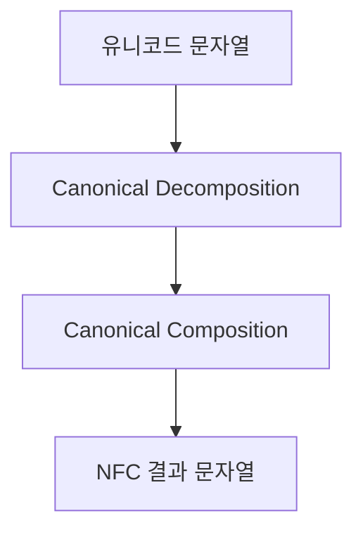
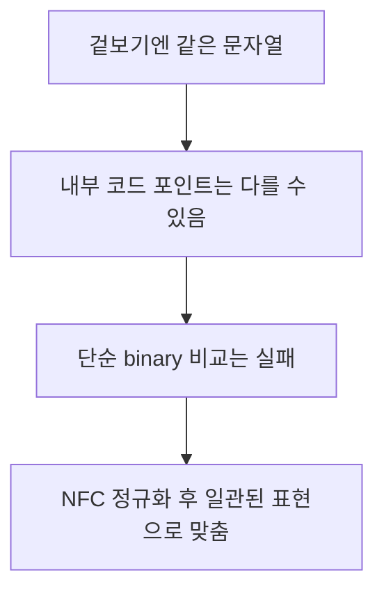
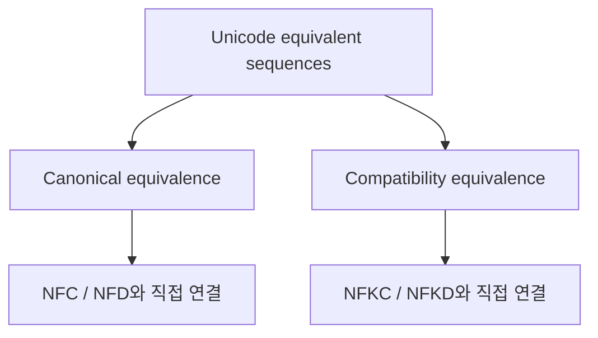
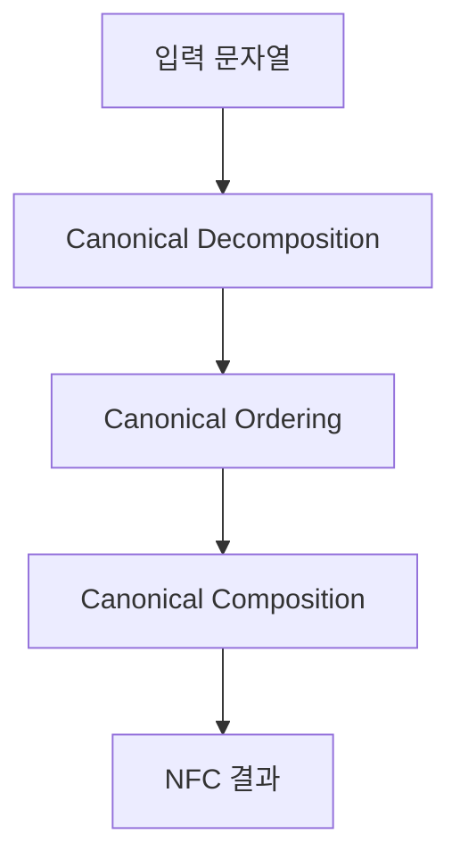
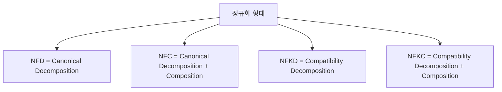
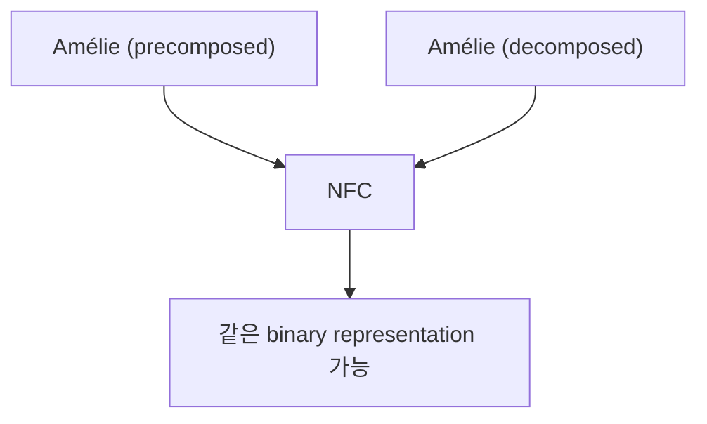
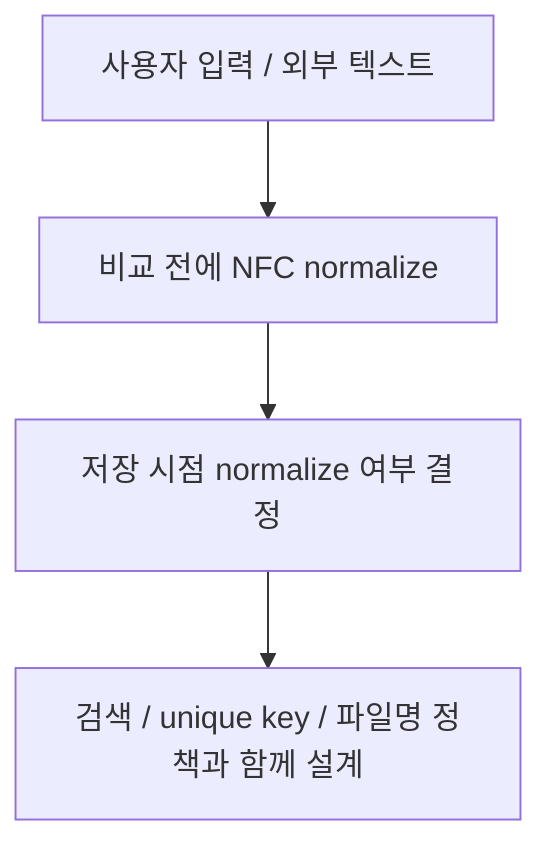

# NFC 정규화 상세 정리

작성 기준일: 2026-04-20  
조사 방식: 웹검색 기반 최신 조사  
주요 참고: Unicode Standard Annex #15, MDN `String.prototype.normalize()`

## 1. 한 줄 요약



`NFC(Normalization Form C)`는 유니코드 문자열을 `canonical decomposition`한 뒤 다시 `canonical composition`해서, 같은 글자를 여러 코드 포인트 조합으로 표현하더라도 가능한 한 표준적인 composed 형태로 맞추는 정규화 방식이다.

Unicode UAX #15는 NFC를 정확히:

- `Canonical Decomposition`
- followed by `Canonical Composition`

이라고 정의한다.

즉 아주 단순하게 말하면:

- "겉으로 같은 문자라도 내부 코드 포인트 표현이 다를 수 있는데"
- "그걸 비교와 저장에 유리한 표준 형태로 맞추는 것"

이다.

---

## 2. 왜 NFC 정규화가 필요한가



유니코드는 같은 사람이 보기엔 같은 글자가 여러 코드 포인트 조합으로 표현될 수 있다.

대표 예:

- `é`
- `e` + `◌́`(combining acute accent)

이 둘은 화면상 거의 같은 글자로 보일 수 있다.

하지만 내부적으로는:

- 하나는 precomposed character
- 다른 하나는 base character + combining mark

형태다.

즉 그냥 문자열을 바이트/코드포인트 그대로 비교하면:

- "겉은 같은데 다르다"고 나올 수 있다.

### 2.1 어디서 문제 되나

- 문자열 equality 비교
- 파일명 비교
- 검색 인덱싱
- DB unique key
- 사용자 입력 정리
- URL slug / 태그 / ID 비교

즉 정규화는 국제화(i18n)에서 매우 실용적인 기초 문제다.

### 2.2 한 줄 감각

NFC는 "문자열을 예쁘게 바꾸는 포맷팅"이 아니라:

- 같은 의미의 유니코드 문자열을 더 일관된 내부 표현으로 맞추는 표준 절차

다.

---

## 3. NFC를 이해하려면 먼저 알아야 하는 것



UAX #15는 정규화를 설명하기 전에 먼저 `canonical equivalence`와 `compatibility equivalence`를 구분한다.

### 3.1 canonical equivalence

이건 "의미상 완전히 같은 문자 표현"이라고 보면 된다.

예:

- precomposed `é`
- decomposed `e + ◌́`

이 둘은 canonical equivalent다.

즉 정규화해도 원래 텍스트의 문자 의미를 바꾸지 않는 수준의 차이다.

### 3.2 compatibility equivalence

이건 canonical보다 더 넓다.

예:

- 서식 차이
- 호환용 문자
- 전각/반각 일부

등이 포함될 수 있다.

즉 compatibility normalization은 canonical보다 더 공격적으로 형태를 단순화할 수 있다.

### 3.3 왜 이 구분이 중요하나

NFC는 canonical 쪽 문제를 푼다.

즉:

- 겉으로 같은데 내부 표기가 다른 canonical equivalent strings를 맞춘다

반면:

- 더 강한 호환 정리는 NFKC/NFKD 쪽 문제다.

즉 NFC는 "안전한 기본 정규화"에 더 가깝다.

---

## 4. NFC는 실제로 어떻게 만들어지나



UAX #15를 구현 감각으로 읽으면 NFC는 크게 세 단계로 이해할 수 있다.

### 4.1 Canonical Decomposition

먼저 가능한 문자를 canonical decomposition한다.

즉 precomposed 문자를:

- base character
- combining marks

형태로 풀어 쓴다.

예:

```text
é -> e + ◌́
```

### 4.2 Canonical Ordering

그 다음 combining mark 순서를 canonical order로 정렬한다.

즉 결합 부호 여러 개가 섞였을 때 표준 순서를 맞춘다.

왜냐하면 같은 글자라도 combining mark 순서 차이로 binary representation이 달라질 수 있기 때문이다.

### 4.3 Canonical Composition

그 다음 다시 가능한 조합은 composed form으로 합친다.

즉:

- decomposition 후
- 다시 표준적으로 합칠 수 있는 것은 합친다

그래서 결과적으로 "가능한 composed canonical form"이 된다.

### 4.4 왜 decomposition만으로 끝나지 않나

NFD는 decomposition까지만 하고 끝난다.

NFC는:

- decomposition으로 여러 표현을 공통 기반으로 맞춘 뒤
- 다시 composed representation으로 정리한다

즉 "비교 일관성 + composed form 유지"를 같이 노린다고 보면 된다.

---

## 5. NFC와 NFD/NFKC/NFKD 차이



UAX #15는 네 가지 정규화 형태를 정의한다.

### 5.1 NFD

- Canonical Decomposition

즉 precomposed 문자를 분해형으로 푼 상태다.

### 5.2 NFC

- Canonical Decomposition
- followed by Canonical Composition

즉 canonical equivalence를 유지하면서 composed form으로 맞춘다.

### 5.3 NFKD

- Compatibility Decomposition

즉 더 넓은 호환성 관점까지 분해한다.

### 5.4 NFKC

- Compatibility Decomposition
- followed by Canonical Composition

즉 호환 문자까지 더 적극적으로 정리한다.

### 5.5 실무 감각

대체로:

- "문자열을 안전하게 표준 비교 형태로 맞추고 싶다" -> NFC
- "검색/식별/정규화에서 더 공격적으로 호환 차이까지 접고 싶다" -> NFKC 검토

즉 NFC는 보존적이고, NFKC는 더 공격적이다.

---

## 6. 예시로 보는 NFC



MDN `String.prototype.normalize()`는 아주 좋은 예시를 준다.

### 6.1 같은 글자, 다른 내부 표현

예:

```js
const name1 = "\u0041\u006d\u00e9\u006c\u0069\u0065";
const name2 = "\u0041\u006d\u0065\u0301\u006c\u0069\u0065";
```

둘 다 사람이 보면 `Amélie`다.

하지만:

```js
name1 === name2 // false
```

일 수 있다.

### 6.2 NFC 후 비교

```js
name1.normalize("NFC") === name2.normalize("NFC") // true
```

즉 NFC를 거치면:

- canonical equivalent strings를
- 동일 binary representation 쪽으로 맞출 수 있다

### 6.3 길이도 달라질 수 있다

precomposed와 decomposed는 코드포인트 수가 다를 수 있다.

즉 normalize 전후에:

- `length`
- substring
- 문자 인덱스

체감이 달라질 수 있다.

이건 문자열 처리에서 매우 중요하다.

---

## 7. 실무에서 NFC를 어떻게 써야 하나



NFC는 "무조건 전부 NFC로 바꿔라"보다, 문자열 정책의 일부로 봐야 한다.

### 7.1 비교 전에 normalize

가장 기본적인 원칙:

- 사용자 입력 비교
- 키 비교
- 이름 비교

를 할 때는 먼저 같은 normalization form으로 맞추는 것이 안전하다.

즉:

```js
normalize("NFC")
```

를 비교 전 처리로 두는 것이 흔하다.

### 7.2 저장 시 normalize

데이터 저장 시점에 NFC로 정규화해 두면:

- 나중 비교가 쉬워지고
- 중복 저장을 줄이고
- unique key 충돌을 더 예측 가능하게 할 수 있다

하지만 주의점도 있다.

- 원본 표현을 그대로 보존해야 하는 도메인인지
- 사용자 입력의 조합형 표현 자체가 의미 있는지

를 먼저 봐야 한다.

즉 "저장 전에 normalize"는 정책 문제다.

### 7.3 검색 인덱스

검색 인덱스 구축에서는:

- 검색 대상
- 검색어

둘 다 같은 normalization form으로 맞추는 것이 일반적으로 유리하다.

### 7.4 파일명과 경로

파일시스템/OS는 normalization 정책이 제각각일 수 있다.

즉:

- macOS
- Linux
- Windows

사이에 파일명 비교/동기화 문제가 생길 수 있다.

그래서 파일명 처리에서도 normalization 감각이 중요하다.

### 7.5 식별자/slug

사용자 이름, 태그, 키 같은 "중복되면 안 되는 문자열"은 normalization 정책을 안 잡으면 나중에 중복/비교 버그가 나기 쉽다.

즉 NFC는 단순 i18n 미학이 아니라 데이터 무결성 문제와 연결된다.

---

## 참고 링크

- Unicode Standard Annex #15: [Unicode Normalization Forms](https://www.unicode.org/reports/tr15/)
- UAX #15 current version: [Unicode Normalization Forms, Revision 57](https://www.unicode.org/reports/tr15/tr15-57.html)
- MDN `String.prototype.normalize()`: [String.prototype.normalize()](https://developer.mozilla.org/en-US/docs/Web/JavaScript/Reference/Global_Objects/String/normalize)
