# Uvicorn

- 작성일: 2026-06-29
- 범위: Uvicorn, ASGI, FastAPI/Starlette 실행 구조, 설정, 개발/운영 실행, 배포, 워커, 프록시, WebSocket, 장애 포인트
- 현재성: 2026-06-29 기준 PyPI 최신 버전은 `0.49.0`이다.

## 1. 한 줄 요약

- Uvicorn은 Python ASGI 애플리케이션을 실제 네트워크 서버로 실행해 주는 고성능 ASGI 서버다.
- FastAPI, Starlette, Django Channels 같은 ASGI 앱은 직접 TCP 포트를 열고 HTTP 요청을 처리하지 않는다. Uvicorn이 소켓을 열고, HTTP/WebSocket 요청을 ASGI 이벤트로 바꿔 애플리케이션에 전달한다.
- 한마디로 Uvicorn은 "브라우저/클라이언트와 Python 비동기 웹 애플리케이션 사이의 실행 서버"다.

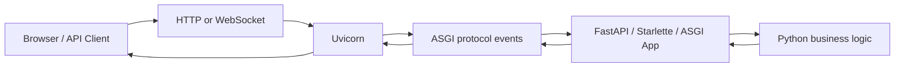

## 2. 왜 중요한가

- FastAPI 앱을 `python main.py`로만 실행하면 웹 서버가 자동으로 생기는 것이 아니다. Uvicorn 같은 ASGI 서버가 앱을 로드해야 외부 요청을 받을 수 있다.
- Uvicorn은 HTTP 요청, WebSocket 연결, lifespan 이벤트, keep-alive, timeout, logging, worker process, reload, proxy header 처리 같은 실행 계층을 담당한다.
- 프레임워크와 서버를 분리하면 같은 FastAPI 앱을 Uvicorn, Hypercorn, Daphne 같은 다른 ASGI 서버에서도 실행할 수 있다.
- 개발에서는 `--reload`로 빠른 피드백을 얻고, 운영에서는 worker, reverse proxy, graceful shutdown, proxy header 신뢰 범위 같은 설정이 안정성에 직접 영향을 준다.

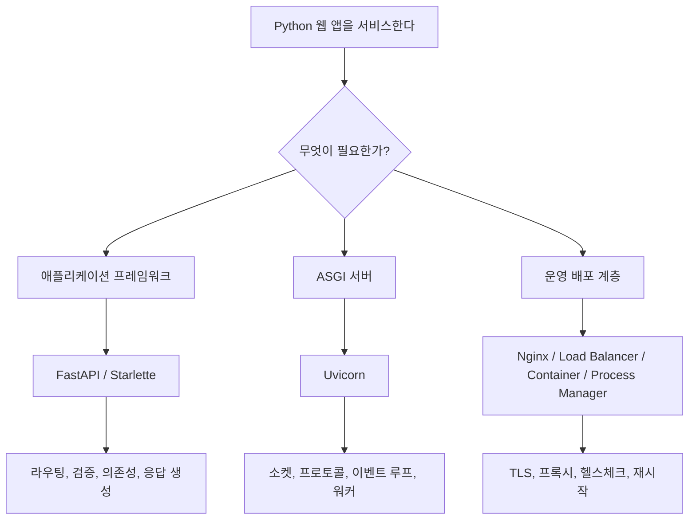

## 3. 핵심 개념

- `ASGI`: Asynchronous Server Gateway Interface의 약자다. Python 비동기 웹 서버와 애플리케이션 사이의 표준 인터페이스다.
- `Uvicorn`: ASGI 서버 구현체다. HTTP/1.1과 WebSocket을 지원하며, async framework를 실행한다.
- `ASGI application`: `scope`, `receive`, `send`를 받는 async callable이다. FastAPI 앱 객체도 내부적으로 ASGI callable이다.
- `scope`: 연결의 메타데이터다. HTTP 요청이면 path, method, headers 같은 정보가 들어간다. WebSocket이면 연결 타입과 경로가 들어간다.
- `receive`: 서버에서 앱으로 들어오는 이벤트를 기다리는 async callable이다. 요청 body chunk, WebSocket message, disconnect 이벤트가 여기로 온다.
- `send`: 앱에서 서버로 이벤트를 보내는 async callable이다. response start, response body, WebSocket accept/send/close 이벤트를 보낸다.
- `lifespan`: 앱 시작과 종료 시점에 DB connection, cache client, background task 같은 리소스를 준비하거나 정리하는 ASGI 이벤트 흐름이다.

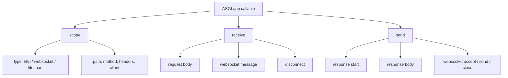

### Uvicorn이 아닌 것

| 오해 | 실제 |
| --- | --- |
| Uvicorn은 FastAPI 같은 웹 프레임워크다 | 아니다. Uvicorn은 ASGI 서버다 |
| Uvicorn이 라우팅과 데이터 검증을 한다 | 보통 FastAPI/Starlette 같은 프레임워크가 한다 |
| Uvicorn만 있으면 운영 배포가 끝난다 | 보통 reverse proxy, process manager, container orchestration이 함께 필요하다 |
| Uvicorn이 모든 HTTP 버전을 지원한다 | 공식 설명 기준 핵심 지원은 HTTP/1.1과 WebSocket이다 |

### 최소 ASGI 앱 예시

```python
async def app(scope, receive, send):
    assert scope["type"] == "http"

    await send({
        "type": "http.response.start",
        "status": 200,
        "headers": [(b"content-type", b"text/plain")],
    })
    await send({
        "type": "http.response.body",
        "body": b"Hello, Uvicorn",
    })
```

```bash
uvicorn example:app
```

## 4. 아키텍처와 요청 처리 흐름

- Uvicorn은 네트워크 소켓을 열고 클라이언트 연결을 받는다.
- HTTP parser가 요청 라인, header, body를 해석한다.
- Uvicorn은 해석한 요청을 ASGI `scope`와 `receive` 이벤트로 변환한다.
- 애플리케이션은 `send`로 응답 이벤트를 반환한다.
- Uvicorn은 ASGI 응답 이벤트를 HTTP response bytes로 바꿔 클라이언트에 전송한다.

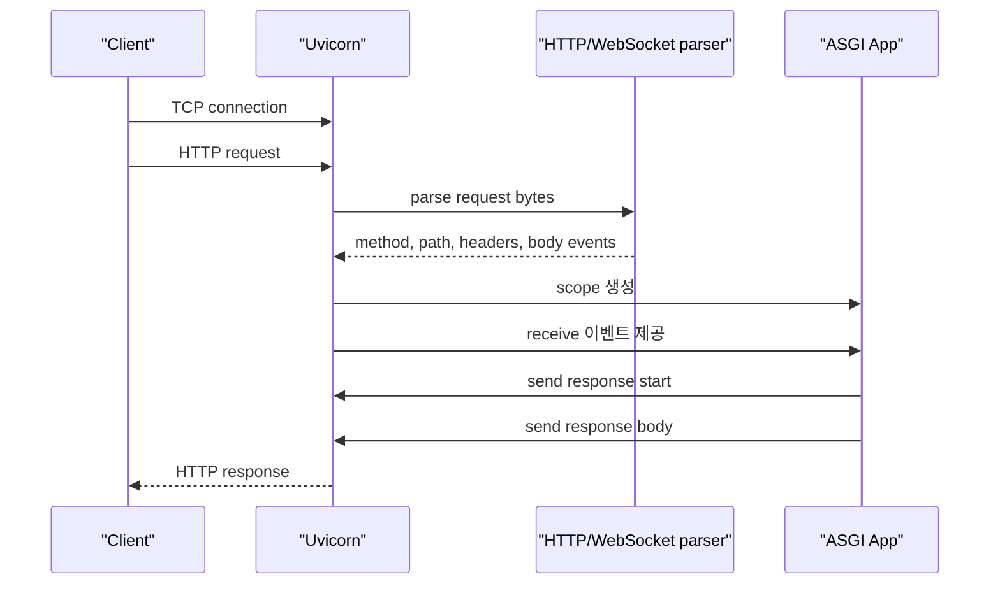

### 내부 구성 요소

| 계층 | 역할 | 예시 옵션 |
| --- | --- | --- |
| Event loop | 비동기 I/O 스케줄링 | `--loop auto`, `asyncio`, `uvloop` |
| HTTP protocol | HTTP/1.1 parsing과 response 처리 | `--http auto`, `h11`, `httptools` |
| WebSocket protocol | WebSocket handshake와 message 처리 | `--ws auto`, `websockets`, `wsproto` |
| Lifespan | 앱 startup/shutdown 이벤트 처리 | `--lifespan auto`, `on`, `off` |
| Worker manager | 여러 프로세스 실행과 상태 확인 | `--workers` |
| Reload watcher | 개발 중 파일 변경 감지 | `--reload`, `watchfiles` |

### 프레임워크와의 관계

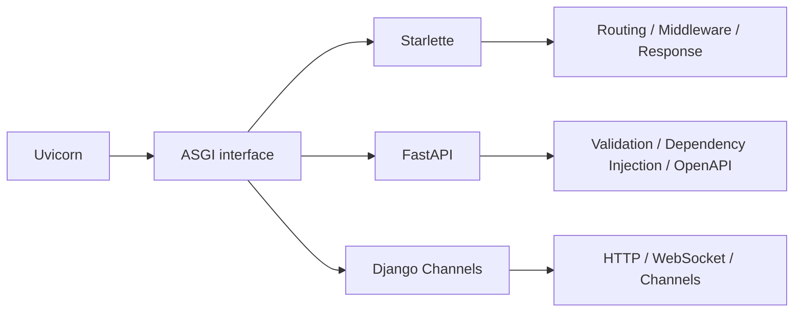

## 5. 설정, 옵션, 엣지 케이스, 트레이드오프

- Uvicorn 설정은 크게 CLI 옵션, `uvicorn.run()` 인자, `UVICORN_*` 환경 변수로 줄 수 있다.
- 공식 문서 기준 CLI 옵션과 `uvicorn.run()` 인자가 환경 변수보다 우선한다.
- `--env-file`은 ASGI 애플리케이션의 환경 변수를 로드하기 위한 용도다. `UVICORN_*` 자체 설정을 `--env-file`에 넣는 방식은 적용 대상으로 보지 않는 것이 안전하다.
- `--reload`와 `--workers`는 동시에 쓸 수 없다. 개발은 `--reload`, 운영은 `--workers`로 분리해서 생각한다.
- `uvicorn.run()`에 앱 객체를 직접 넘기면서 `reload=True` 또는 `workers`를 쓰려면 `if __name__ == "__main__"` 가드가 필요하다.
- 운영에서 `--host 0.0.0.0`은 외부 접속을 허용한다. 로컬 개발 기본값 `127.0.0.1`과 의미가 다르다.
- 프록시 뒤에서 실행할 때는 `--proxy-headers`와 `--forwarded-allow-ips`를 신중히 설정해야 한다. 신뢰하지 않는 IP의 forwarded header를 믿으면 client IP나 scheme 판단이 왜곡될 수 있다.

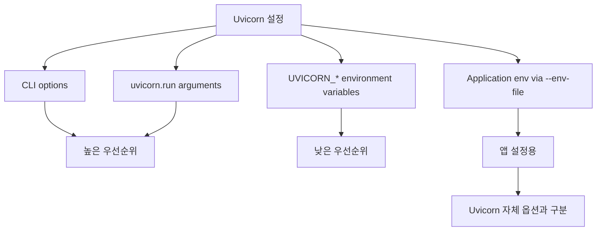

### 설치 옵션

```bash
# 최소 설치
pip install uvicorn

# 성능과 편의 기능을 위한 표준 extras 설치
pip install "uvicorn[standard]"
```

| 설치 방식 | 포함 성격 | 언제 쓰나 |
| --- | --- | --- |
| `uvicorn` | 최소 의존성 | 의존성을 엄격히 통제해야 할 때 |
| `uvicorn[standard]` | `uvloop`, `httptools`, `websockets`, `watchfiles`, `python-dotenv`, `PyYAML` 등 선택 의존성 포함 | 일반 개발/운영에서 권장되는 출발점 |

### 자주 쓰는 CLI 옵션

| 옵션 | 의미 | 주의점 |
| --- | --- | --- |
| `main:app` | `main.py`의 `app` 객체를 import | 현재 작업 디렉터리와 import path가 맞아야 한다 |
| `--host 0.0.0.0` | 모든 네트워크 인터페이스에 bind | 운영/컨테이너에서 흔함 |
| `--port 8000` | listen port 지정 | 포트 충돌 확인 필요 |
| `--reload` | 파일 변경 시 재시작 | 개발 전용, `--workers`와 동시 사용 불가 |
| `--workers 4` | 여러 worker process 실행 | 운영용, 앱 상태 공유 방식 주의 |
| `--app-dir src` | import 기준 디렉터리 추가 | `src/main.py` 구조에서 유용 |
| `--factory` | app factory callable을 호출 | `create_app()` 패턴에서 사용 |
| `--root-path /api` | 프록시 mount prefix 반영 | reverse proxy 경로와 맞아야 한다 |
| `--proxy-headers` | forwarded headers 사용 | 신뢰 IP 범위 설정 필요 |
| `--log-level debug` | 로그 레벨 조정 | 운영에서는 너무 verbose할 수 있다 |

### 개발과 운영 옵션 선택

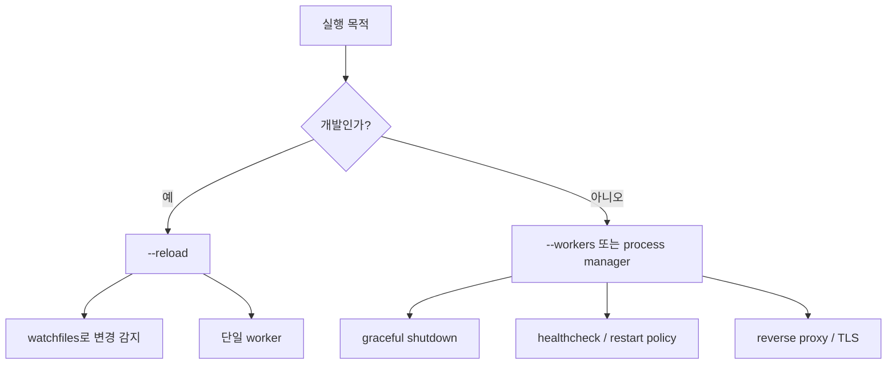

### 주요 엣지 케이스

| 상황 | 원인 | 해결 방향 |
| --- | --- | --- |
| `Error loading ASGI app` | import string이 틀림 | `uvicorn src.main:app --app-dir .`처럼 import 기준 확인 |
| reload가 동작하지 않음 | `watchfiles` 미설치 또는 감시 경로 문제 | `uvicorn[standard]` 설치, `--reload-dir` 확인 |
| worker를 늘렸는데 상태가 꼬임 | 프로세스별 메모리가 분리됨 | 전역 변수 상태 공유 금지, Redis/DB 사용 |
| 프록시 뒤에서 URL scheme이 `http`로 나옴 | forwarded header 미신뢰 | `--proxy-headers`, `--forwarded-allow-ips` 설정 |
| WebSocket이 끊김 | proxy timeout, ping 설정, load balancer 문제 | proxy WebSocket 지원과 timeout 확인 |
| 앱 종료 시 작업 유실 | graceful shutdown 시간 부족 | lifespan 정리 로직과 shutdown timeout 조정 |

## 6. 실무 예시

### FastAPI 개발 서버 실행

```python
# main.py
from fastapi import FastAPI

app = FastAPI()

@app.get("/")
async def read_root():
    return {"message": "Hello Uvicorn"}
```

```bash
uvicorn main:app --reload
```

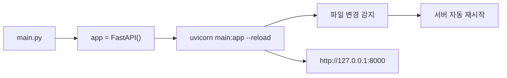

### src 구조에서 실행

```text
project/
  src/
    app/
      main.py
```

```bash
uvicorn app.main:app --app-dir src --reload
```

### Python 코드에서 실행

```python
import uvicorn

if __name__ == "__main__":
    uvicorn.run(
        "main:app",
        host="127.0.0.1",
        port=8000,
        reload=True,
    )
```

### 운영에서 여러 worker 실행

```bash
uvicorn main:app --host 0.0.0.0 --port 8000 --workers 4
```

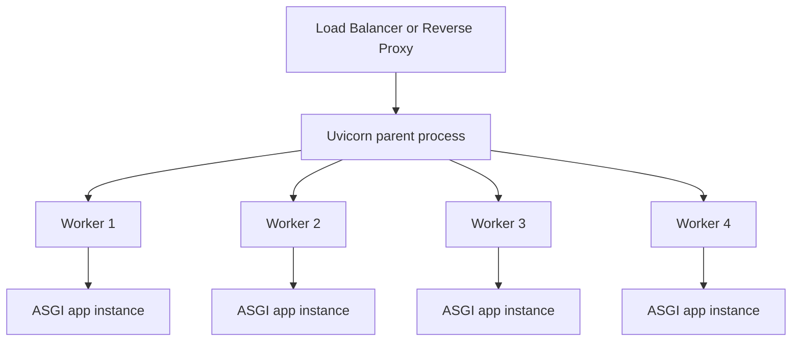

### Gunicorn과 함께 실행할 때

- 전통적으로는 Gunicorn process manager와 Uvicorn worker class를 조합해 운영했다.
- 공식 배포 문서는 `uvicorn.workers` 모듈이 deprecated라고 설명하며, 별도 `uvicorn-worker` 패키지를 사용하라고 안내한다.
- 새 배포에서는 Uvicorn 자체 `--workers`, 컨테이너 오케스트레이터, systemd, supervisor, 또는 `uvicorn-worker` 조합 중 운영 환경에 맞게 선택한다.

```bash
pip install uvicorn-worker
gunicorn main:app -w 4 -k uvicorn_worker.UvicornWorker
```

### 프록시 뒤에서 실행

```bash
uvicorn main:app \
  --host 127.0.0.1 \
  --port 8000 \
  --proxy-headers \
  --forwarded-allow-ips 127.0.0.1
```

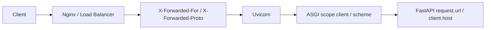

### WebSocket 실행 흐름

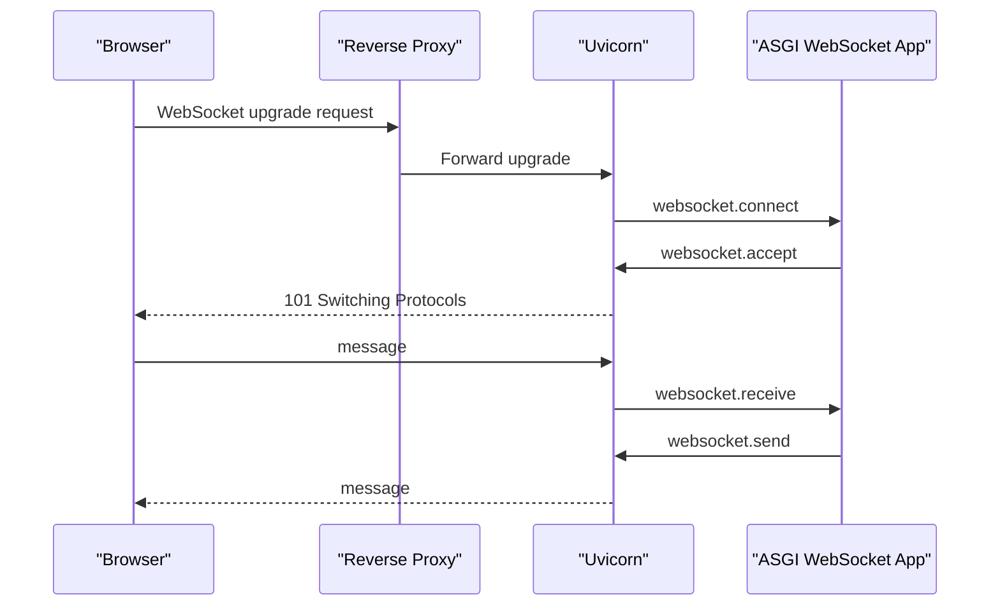

## 7. 용어 정리와 빠른 복습

- `Uvicorn`: Python ASGI 서버 구현체다.
- `ASGI`: 비동기 Python 웹 서버와 애플리케이션 사이의 표준 인터페이스다.
- `FastAPI`: ASGI 위에서 동작하는 웹 프레임워크다. Uvicorn과 역할이 다르다.
- `Starlette`: ASGI toolkit/framework다. FastAPI의 기반 계층이다.
- `scope`: 요청 또는 연결의 메타데이터다.
- `receive`: 서버에서 앱으로 이벤트를 전달하는 함수다.
- `send`: 앱에서 서버로 이벤트를 반환하는 함수다.
- `lifespan`: startup/shutdown 이벤트를 처리하는 ASGI 흐름이다.
- `worker`: 요청을 처리하는 별도 프로세스다.
- `reload`: 개발 중 파일 변경을 감지해 서버를 재시작하는 기능이다.
- `proxy headers`: reverse proxy가 원래 client IP, protocol, host 정보를 전달하기 위해 붙이는 header다.

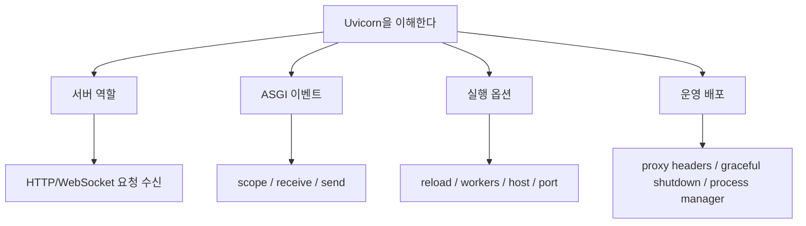

### 빠른 판단표

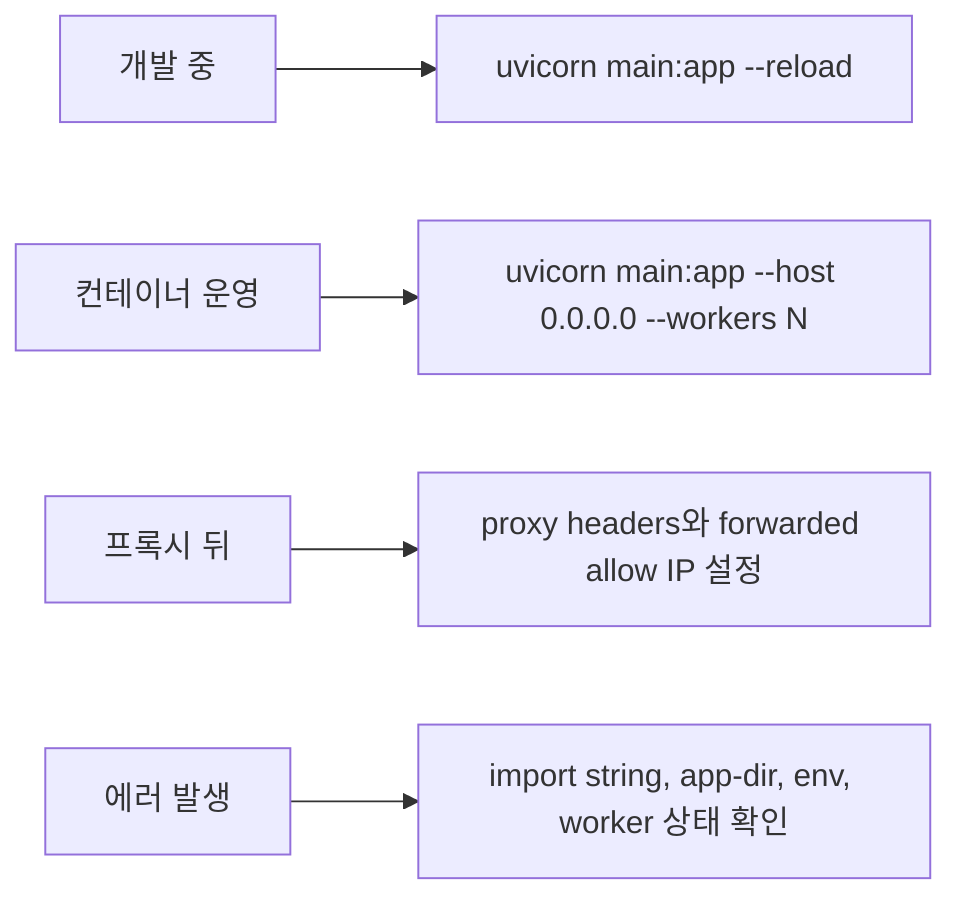

- Uvicorn은 프레임워크가 아니라 서버다.
- FastAPI 앱을 실행할 때 가장 흔한 명령은 `uvicorn main:app --reload`다.
- `main:app`은 `main` 모듈의 `app` 변수를 뜻한다.
- 개발에서는 `--reload`, 운영에서는 `--workers`를 생각한다.
- worker마다 메모리가 분리되므로 전역 변수로 상태를 공유하면 안 된다.
- reverse proxy 뒤에서는 `--proxy-headers`와 신뢰 IP 설정을 함께 봐야 한다.
- Gunicorn 조합이 필요하면 deprecated된 `uvicorn.workers` 대신 `uvicorn-worker` 패키지를 확인한다.

## 8. 참고 링크

- [Uvicorn 공식 문서](https://www.uvicorn.org/)
- [Uvicorn Settings](https://www.uvicorn.org/settings/)
- [Uvicorn Deployment](https://www.uvicorn.org/deployment/)
- [Uvicorn Server Behavior](https://www.uvicorn.org/server-behavior/)
- [Uvicorn Concepts - ASGI](https://www.uvicorn.org/concepts/asgi/)
- [Uvicorn Concepts - Lifespan](https://www.uvicorn.org/concepts/lifespan/)
- [Uvicorn GitHub](https://github.com/Kludex/uvicorn)
- [Uvicorn Worker GitHub](https://github.com/Kludex/uvicorn-worker)
- [Uvicorn PyPI](https://pypi.org/project/uvicorn/)
- [ASGI Specification](https://asgi.readthedocs.io/en/latest/specs/main.html)

<!-- study-links:start -->
## 관련 문서

- `websocket`: [[websocket/websocket|WebSocket 상세 정리]]
- `redis`: [[redis/redis|Redis 상세 정리]]
- `스케줄링`: [[정보처리기사/4과목 프로그래밍 언어 활용/204 스케줄링 - SJF/204 스케줄링 - SJF|204 스케줄링 - SJF]]
<!-- study-links:end -->
