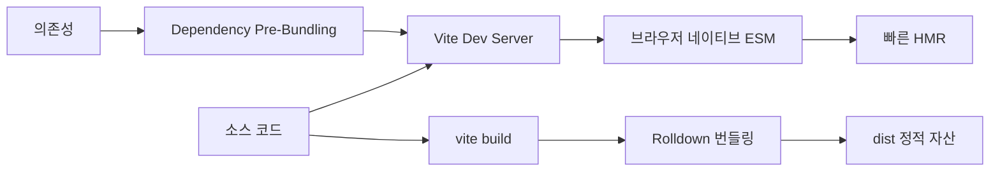
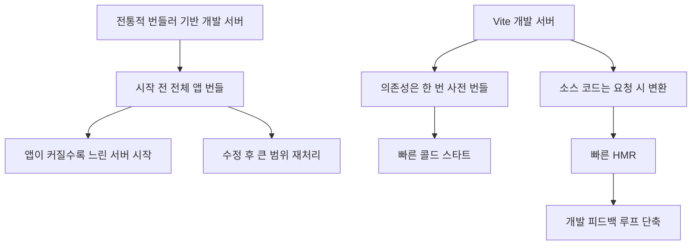
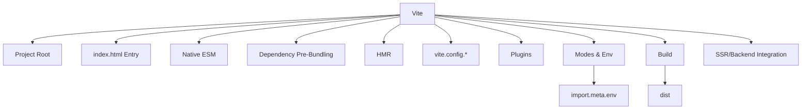
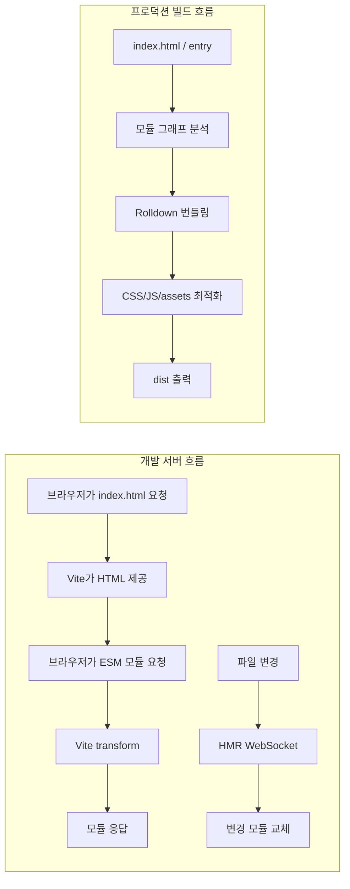
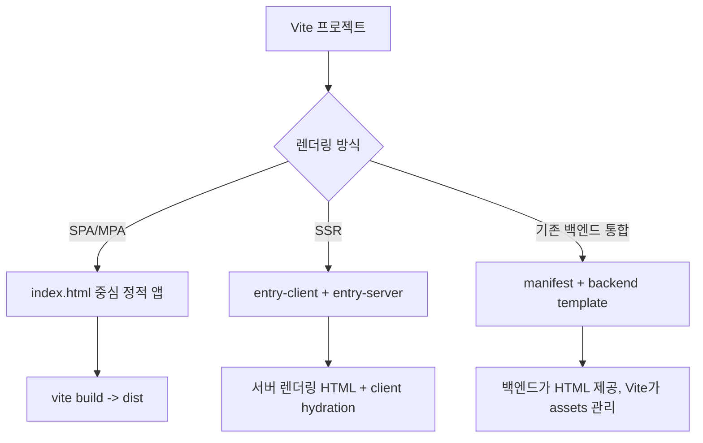
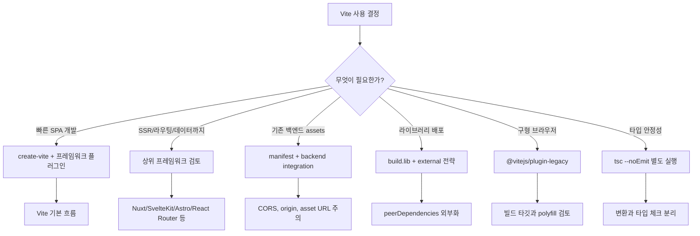
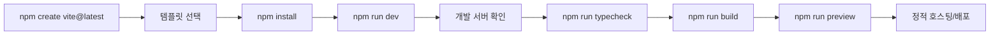
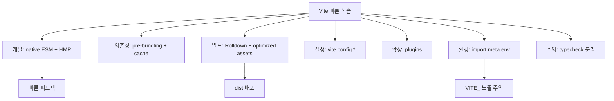

# Vite

- 검색일: 2026-07-03
- 기준: 공식 Vite 문서 사이트에 표시된 `v8.1.2` 문서와 Vite 8 마이그레이션 문서 기준
- 요약: Vite는 개발 중에는 브라우저의 네이티브 ES Modules를 활용해 필요한 모듈만 빠르게 제공하고, 배포 시에는 Rolldown 기반 번들링으로 최적화된 정적 자산을 만드는 프런트엔드 빌드 도구다.

## 1. 한 줄 요약



- Vite는 "개발 서버"와 "프로덕션 빌드"를 함께 제공하는 프런트엔드 툴링이다.
- 개발 중에는 전체 앱을 먼저 번들링하지 않고, 브라우저가 요청하는 모듈을 그때그때 변환해서 제공한다.
- 자주 바뀌지 않는 라이브러리 의존성은 미리 묶어 두고, 자주 바뀌는 애플리케이션 소스는 네이티브 ESM으로 온디맨드 제공한다.
- 파일을 수정하면 전체 페이지를 새로고침하지 않고 바뀐 모듈 중심으로 갱신하는 HMR을 제공한다.
- 배포할 때는 `vite build`로 HTML, JS, CSS, 이미지 같은 자산을 최적화된 정적 파일로 만든다.
- Vite 8부터 공식 문서 기준 핵심 변화는 Rolldown과 Oxc 기반의 통합 툴체인이다.
- 예전 Vite 설명에서는 "개발 변환은 esbuild, 프로덕션 번들은 Rollup"이라고 설명하는 경우가 많지만, Vite 8 공식 문서 기준으로는 Rolldown/Oxc 기반 흐름으로 이해하는 것이 맞다.

## 2. 왜 중요한가



- Vite가 중요한 이유는 프런트엔드 개발의 피드백 루프를 크게 줄이기 때문이다.
- 대형 프런트엔드 프로젝트에서는 개발 서버 시작, 파일 수정 후 반영, 전체 리빌드 시간이 생산성을 직접 깎는다.
- 전통적인 번들러 기반 개발 서버는 브라우저에 앱을 보여주기 전에 전체 모듈 그래프를 처리하는 방식이 많았다.
- Vite는 개발 중 전체 앱을 먼저 묶지 않는다.
- 브라우저가 `index.html`과 `<script type="module">`을 통해 필요한 모듈을 요청하면, Vite가 해당 파일을 즉시 변환해서 응답한다.
- 이 방식은 앱이 커져도 서버 시작 자체가 비교적 빠르게 유지되는 장점이 있다.
- Vite는 의존성과 소스 코드를 다르게 취급한다.
- 의존성은 보통 자주 바뀌지 않으므로 사전 번들링하고 강하게 캐시한다.
- 애플리케이션 소스는 자주 바뀌므로 번들 없이 ESM 단위로 제공하고, 수정된 모듈 중심으로 HMR을 적용한다.
- 개발 중에는 비번들 ESM 방식이 좋지만, 프로덕션에서는 네트워크 왕복과 중첩 import 비용 때문에 번들링이 여전히 필요하다.
- 그래서 Vite는 개발 서버에서는 빠른 온디맨드 제공을, 빌드에서는 최적화된 번들 출력을 담당한다.
- Vite는 단독 앱뿐 아니라 Vue, React, Svelte, Solid, Preact, Lit, Qwik 같은 생태계 템플릿과 프레임워크 기반 도구의 빌드 레이어로 널리 사용된다.
- Vite 자체는 라우팅, 데이터 패칭, 서버 렌더링 정책까지 모두 제공하는 풀스택 프레임워크가 아니다.
- 대신 빠른 개발 서버, 빌드 파이프라인, 플러그인 API를 제공하는 기반 도구로 보는 것이 정확하다.

## 3. 핵심 개념



- `index.html`은 Vite 프로젝트에서 중심 엔트리다.
- 일부 툴처럼 `public/index.html`을 숨겨진 템플릿으로 취급하는 것이 아니라, Vite는 `index.html`을 소스 코드이자 모듈 그래프의 일부로 본다.
- `index.html` 안의 `<script type="module" src="/src/main.ts">` 같은 참조가 애플리케이션 진입점이 된다.
- 프로젝트 루트는 Vite가 파일을 제공하고 절대 경로를 해석하는 기준 디렉터리다.
- 기본 개발 서버 포트는 `5173`이다.
- Vite 8.1 문서 기준 Node.js 요구 버전은 `20.19+` 또는 `22.12+`다.
- 네이티브 ESM은 브라우저가 JavaScript 모듈을 직접 import할 수 있는 웹 플랫폼 기능이다.
- Vite는 개발 중 네이티브 ESM을 활용해 소스 파일을 필요한 시점에 개별 요청으로 제공한다.
- bare import는 `import react from 'react'`처럼 브라우저가 그대로 해석할 수 없는 패키지 이름 import다.
- Vite는 bare import를 브라우저가 접근 가능한 URL 형태로 재작성하고, 의존성을 미리 번들링해 요청 수와 CommonJS/UMD 호환 문제를 줄인다.
- HMR은 Hot Module Replacement의 약자다.
- HMR은 파일 변경 시 전체 페이지 새로고침 대신 바뀐 모듈을 교체해 상태 손실을 줄인다.
- Vue SFC, React Fast Refresh 같은 프레임워크별 HMR은 보통 템플릿이나 공식 플러그인이 미리 설정한다.
- `vite.config.js` 또는 `vite.config.ts`는 Vite 설정 파일이다.
- Vite 설정은 `defineConfig`를 통해 타입 추론을 받을 수 있고, `command`, `mode`, `isSsrBuild`, `isPreview`에 따라 조건부 설정을 반환할 수 있다.
- 플러그인은 Vite 확장 포인트다.
- Vite 플러그인 API는 Rollup 플러그인 인터페이스에 기반하고, Vite 전용 옵션과 dev server/SSR 확장 지점을 추가한다.
- 모드와 환경 변수는 `import.meta.env`를 통해 애플리케이션 코드에 노출된다.
- 기본적으로 클라이언트 번들에 노출되는 사용자 정의 환경 변수는 `VITE_` 접두사를 가져야 한다.
- TypeScript는 기본적으로 변환만 수행된다.
- Vite는 타입 체크를 개발 변환 파이프라인에 넣지 않는다.
- 타입 검사는 IDE, `tsc --noEmit`, 별도 watch 프로세스, 또는 `vite-plugin-checker` 같은 플러그인으로 분리하는 것이 공식 문서의 권장 방향이다.

| 개념 | 의미 | 실무 포인트 |
| --- | --- | --- |
| Dev Server | 개발 중 파일을 제공하는 서버 | `npm run dev`, `vite`, `vite dev` |
| Native ESM | 브라우저 모듈 시스템 | 개발 중 전체 번들링을 피하는 기반 |
| Pre-Bundling | 의존성 사전 번들링 | CommonJS/UMD 변환과 요청 수 감소 |
| HMR | 변경 모듈만 교체 | 상태 보존과 빠른 피드백 |
| Build | 배포용 정적 자산 생성 | `vite build`, 기본 출력 `dist` |
| Preview | 빌드 결과 로컬 확인 | 운영 서버 용도가 아님 |
| Plugin | Vite 확장 단위 | 프레임워크, 변환, 가상 모듈, SSR 확장 |
| Mode | 실행 환경 구분 | `development`, `production`, 커스텀 mode |
| Env | 빌드 시 주입되는 상수 | `VITE_` 접두사 노출 주의 |

## 4. 구조와 흐름



- Vite 개발 서버의 핵심은 요청 기반 변환이다.
- 브라우저가 특정 모듈을 요청하면 Vite가 그 파일을 변환하고 응답한다.
- 이때 TypeScript, JSX, CSS import, asset import 같은 기능이 브라우저가 이해할 수 있는 형태로 바뀐다.
- 개발 중 Vite는 소스 코드를 가능한 한 원본에 가깝게 제공한다.
- Vite 8 문서 기준 TypeScript 변환에는 Oxc Transformer가 쓰이며, 개발 중 transform target은 최신 브라우저를 전제로 한다.
- 의존성 최적화는 개발 서버 시작 전후에 자동으로 일어난다.
- Vite는 `node_modules` 의존성을 사전 번들링하고 캐시한다.
- Vite 8 문서 기준 의존성 최적화도 Rolldown 기반으로 설명된다.
- `vite --force`를 사용하면 의존성 최적화 캐시를 무시하고 다시 번들링할 수 있다.
- HMR은 Vite dev server와 브라우저 클라이언트 사이의 연결을 통해 동작한다.
- 프레임워크 플러그인은 변경된 모듈을 어떻게 교체해야 상태를 유지할 수 있는지 알고 있다.
- HMR이 처리할 수 없는 변경이면 전체 페이지 reload로 fallback될 수 있다.
- 프로덕션 빌드는 개발 서버와 목적이 다르다.
- 개발 서버는 빠른 피드백이 목표이고, 프로덕션 빌드는 네트워크 효율, 캐싱, 코드 분할, minification, asset hashing이 목표다.
- `vite build`는 기본적으로 `<root>/index.html`을 엔트리로 보고 `dist` 디렉터리에 배포 가능한 정적 파일을 만든다.
- `vite preview`는 `dist` 결과를 로컬에서 확인하는 용도다.
- 공식 문서가 명시하듯, `vite preview`는 운영 서버로 쓰기 위한 명령이 아니다.



- Vite는 SPA만 위한 도구가 아니다.
- 여러 HTML 엔트리를 둔 MPA도 가능하고, SSR도 지원하며, Rails/Laravel 같은 기존 백엔드와 asset pipeline처럼 통합할 수도 있다.
- SSR에서 Vite는 낮은 수준의 API를 제공한다.
- 일반 앱 개발자는 보통 React Router, SvelteKit, Nuxt, Astro 같은 상위 프레임워크나 SSR 플러그인을 쓰는 편이 낫다.
- 직접 SSR을 구성하는 경우 보통 `entry-client`, `entry-server`, 공통 앱 코드, 서버 파일을 나누고, 서버에서 HTML placeholder에 렌더링 결과를 주입한다.
- 기존 백엔드 통합에서는 `build.manifest`를 켜고, 백엔드 템플릿이 빌드된 asset 이름을 manifest로 찾는 구조를 쓴다.
- 개발 중에는 백엔드 HTML 템플릿에 `http://localhost:5173/@vite/client`와 앱 entry script를 주입해 Vite dev server의 HMR을 활용할 수 있다.

## 5. 중요한 디테일, 엣지 케이스, 트레이드오프



- Vite 8의 가장 큰 맥락 변화는 Rolldown/Oxc 기반 통합 툴체인이다.
- Vite 7 이하 또는 오래된 블로그를 보면 esbuild와 Rollup 중심으로 설명된 자료가 많다.
- 그런 자료는 역사적 이해에는 유용하지만, 2026-07-03 기준 최신 공식 문서를 정리할 때는 Vite 8의 Rolldown 전환을 반영해야 한다.
- Vite 플러그인 API는 여전히 Rollup 생태계와 호환되는 방향을 유지한다.
- 따라서 "내부 번들러가 Rolldown으로 바뀌었다"와 "플러그인 API가 Rollup 기반 관례를 따른다"를 구분해야 한다.
- TypeScript 타입 체크가 자동으로 빌드 파이프라인에서 수행된다고 생각하면 안 된다.
- Vite는 속도를 위해 파일 단위 변환에 집중한다.
- 배포 전에는 `tsc --noEmit`을 별도로 실행하는 스크립트를 두는 것이 안전하다.
- 예를 들어 `npm run typecheck && npm run build`처럼 CI에서 분리 실행한다.
- 환경 변수는 보안상 매우 중요하다.
- `VITE_` 접두사가 붙은 변수는 클라이언트 코드에 노출될 수 있다.
- `DB_PASSWORD`, `SECRET_KEY` 같은 서버 비밀값에 `VITE_`를 붙이면 안 된다.
- Vite 설정 파일을 평가하는 시점에는 `.env` 파일이 자동으로 `process.env`에 주입되지 않는다.
- `.env` 값을 설정 계산에 써야 한다면 공식 문서의 `loadEnv` 흐름을 별도로 사용해야 한다.
- 정적 자산은 위치에 따라 처리 방식이 달라진다.
- `src` 내부에서 import한 이미지, 폰트, 미디어는 모듈 그래프에 포함되어 빌드 시 해시 파일명, base64 inline, 플러그인 처리 대상이 될 수 있다.
- `public` 디렉터리의 자산은 루트 경로로 그대로 제공되며 변환되지 않는다.
- 즉, 빌드 최적화와 해시 캐시 전략을 원하면 `src`에서 import하는 편이 낫고, 파일명을 그대로 유지해야 하는 외부 참조 자산은 `public`이 적합하다.
- `vite preview`는 운영 서버가 아니다.
- 실제 배포에서는 Nginx, CDN, 정적 호스팅, 애플리케이션 서버 등 운영 환경에 맞는 서버가 필요하다.
- 브라우저 DevTools에서 "Disable cache"를 켜두면 Vite 개발 서버의 캐싱 이점을 깨서 느리게 느껴질 수 있다.
- 성능 문제가 있을 때는 Vite 자체보다 플러그인, 브라우저 확장, 대형 의존성, monorepo 파일 감시, devtools 캐시 설정을 먼저 확인하는 것이 좋다.
- 라이브러리 모드에서는 의존성 처리 전략이 중요하다.
- 라이브러리를 만들 때 React, Vue 같은 peer dependency를 번들에 넣어버리면 사용처에서 중복 로딩이나 버전 충돌이 생길 수 있다.
- 보통 라이브러리 모드에서는 `external` 설정으로 peer dependency를 외부화한다.
- SSR은 가능하지만 낮은 수준의 API다.
- 직접 SSR 서버를 만들면 HTML 변환, manifest, preload, hydration, 서버 전용 모듈, 외부화, 런타임 환경 차이를 직접 다뤄야 한다.
- 앱 프레임워크가 이미 해결한 문제라면 직접 조립보다 프레임워크를 쓰는 편이 낫다.
- Vite의 기본 브라우저 타깃은 최신 웹 플랫폼 기준에 맞춰 움직인다.
- Vite 8 마이그레이션 문서는 `baseline-widely-available`의 기준 브라우저 버전이 Vite 7 대비 올라간 점을 명시한다.
- 레거시 브라우저 지원이 필요하면 `@vitejs/plugin-legacy`와 별도 테스트가 필요하다.
- Vite 릴리스는 고정 주기가 아니다.
- 공식 릴리스 문서 기준 patch는 필요 시, minor는 필요 시 베타를 거쳐, major는 대체로 Node.js EOL 일정과 맞물려 논의된다.
- 2026-07-03 기준 공식 릴리스 문서의 지원 범위는 정기 패치가 `vite@8.1`, 중요 수정/보안 백포트가 `vite@7.3`과 `vite@8.0`, 보안 패치가 `vite@6.4`까지다.

## 6. 실전 예시



- 새 프로젝트 생성은 다음처럼 시작한다.

```bash
npm create vite@latest
```

- 프로젝트 이름과 템플릿을 한 번에 지정할 수도 있다.

```bash
npm create vite@latest my-react-app -- --template react-ts
cd my-react-app
npm install
npm run dev
```

- 스캐폴딩된 프로젝트의 기본 스크립트는 보통 다음 형태다.

```json
{
  "scripts": {
    "dev": "vite",
    "build": "vite build",
    "preview": "vite preview"
  }
}
```

- TypeScript 프로젝트라면 타입 체크를 분리해 두는 편이 안전하다.

```json
{
  "scripts": {
    "dev": "vite",
    "typecheck": "tsc --noEmit",
    "build": "vite build",
    "preview": "vite preview"
  }
}
```

- 기본 설정 파일은 다음처럼 작성할 수 있다.

```ts
// vite.config.ts
import { defineConfig } from 'vite'
import react from '@vitejs/plugin-react'

export default defineConfig(({ command, mode }) => {
  return {
    plugins: [react()],
    server: {
      port: 5173,
      strictPort: true,
    },
    build: {
      outDir: 'dist',
      sourcemap: mode !== 'production' ? true : false,
      manifest: true,
    },
    resolve: {
      alias: {
        '@': '/src',
      },
    },
  }
})
```

- 환경 변수는 클라이언트 노출 여부를 기준으로 이름을 나눈다.

```bash
# .env
VITE_PUBLIC_API_BASE_URL=https://api.example.com
DB_PASSWORD=do-not-expose-this
```

```ts
// src/config.ts
export const apiBaseUrl = import.meta.env.VITE_PUBLIC_API_BASE_URL

if (import.meta.env.DEV) {
  console.log('development mode')
}
```

- 위 예시에서 `VITE_PUBLIC_API_BASE_URL`은 클라이언트 코드에서 접근 가능하다.
- `DB_PASSWORD`는 클라이언트에서 `import.meta.env.DB_PASSWORD`로 접근할 수 없다.
- 다만 이름만으로 보안이 완성되는 것은 아니다. 클라이언트 번들에 들어가는 값은 모두 공개 정보라고 봐야 한다.
- asset import는 다음처럼 쓴다.

```ts
import logoUrl from './assets/logo.svg'

const img = document.createElement('img')
img.src = logoUrl
document.body.append(img)
```

- 개발 중에는 `/src/assets/logo.svg`처럼 제공될 수 있고, 빌드 후에는 해시가 붙은 `/assets/logo.[hash].svg` 형태가 될 수 있다.
- Vite의 HMR API는 프레임워크 플러그인이 주로 사용하지만, 직접 모듈 수준 갱신을 다룰 수도 있다.

```ts
if (import.meta.hot) {
  import.meta.hot.accept((newModule) => {
    console.log('module updated', newModule)
  })
}
```

- 라이브러리 모드 예시는 다음처럼 잡을 수 있다.

```ts
// vite.config.ts
import { defineConfig } from 'vite'

export default defineConfig({
  build: {
    lib: {
      entry: 'src/index.ts',
      name: 'MyLibrary',
      fileName: 'my-library',
      formats: ['es', 'umd'],
    },
    rolldownOptions: {
      external: ['react', 'react-dom'],
    },
  },
})
```

- 기존 백엔드와 통합할 때는 `manifest: true`를 켜고, 백엔드가 manifest를 읽어 실제 해시 파일명을 템플릿에 주입하는 구조를 만든다.

```ts
// vite.config.ts
import { defineConfig } from 'vite'

export default defineConfig({
  build: {
    manifest: true,
    rolldownOptions: {
      input: '/src/main.ts',
    },
  },
})
```

- 실무에서는 다음 흐름으로 점검하는 것이 좋다.
- 개발 서버가 느리면 브라우저 캐시 비활성화, 확장 프로그램, 플러그인 hook 비용, 대형 dependency를 먼저 확인한다.
- 빌드 결과가 이상하면 `vite preview`로 정적 결과를 먼저 확인하고, 이후 배포 서버의 rewrite/base path/asset cache 설정을 본다.
- 환경 변수가 안 보이면 변수명 접두사, mode, `.env.[mode]`, config 평가 시점의 `loadEnv` 필요 여부를 확인한다.
- 타입 오류가 배포 후 발견되면 `tsc --noEmit`이 CI에 들어가 있는지 확인한다.

## 7. 용어집과 빠른 복습



| 용어 | 설명 | 기억할 점 |
| --- | --- | --- |
| Vite | 빠른 개발 서버와 빌드 명령을 제공하는 프런트엔드 도구 | 프레임워크가 아니라 빌드 기반 도구 |
| create-vite | Vite 프로젝트 스캐폴딩 도구 | `npm create vite@latest` |
| Native ESM | 브라우저가 직접 JavaScript 모듈을 import하는 기능 | 개발 중 온디맨드 제공의 기반 |
| Bare Import | `import x from 'pkg'` 형태의 패키지 import | 브라우저가 직접 해석 못 해서 Vite가 재작성 |
| Dependency Pre-Bundling | 의존성을 사전에 묶고 변환하는 단계 | Vite 8 기준 Rolldown 기반 |
| HMR | 변경 모듈만 교체하는 개발 기능 | 상태 보존과 빠른 반영 |
| Rolldown | Vite 8의 핵심 번들러 | Rust 기반, Vite 툴체인 통합 방향 |
| Oxc | Vite 8 문서에서 언급되는 파서/변환/minify 기반 도구 | TypeScript 변환과 툴체인 성능에 관련 |
| vite.config.ts | Vite 설정 파일 | `defineConfig` 사용 권장 |
| Plugin | Vite 확장 단위 | Rollup 기반 관례 + Vite 전용 기능 |
| Mode | 실행 모드 | `development`, `production`, 커스텀 mode |
| import.meta.env | Vite가 주입하는 환경 상수 | `VITE_` 접두사만 기본 클라이언트 노출 |
| build.target | 빌드 출력 브라우저 타깃 | 기본값은 버전에 따라 바뀔 수 있음 |
| vite preview | 빌드 결과 로컬 확인 서버 | 운영 서버로 쓰지 않는다 |
| SSR | 서버에서 HTML을 먼저 렌더링하고 클라이언트에서 hydrate | Vite는 낮은 수준의 SSR API 제공 |
| Manifest | 빌드 산출물 매핑 JSON | 백엔드 통합과 preload에 유용 |

- Vite를 한 문장으로 기억하면 "개발 중에는 번들링을 미루고, 배포 시에는 제대로 번들링하는 도구"다.
- Vite 8 기준으로는 Rolldown/Oxc 전환을 반드시 기억해야 한다.
- Vite는 TypeScript를 빠르게 변환하지만 타입 체크를 대신하지 않는다.
- Vite는 환경 변수를 편하게 주입하지만, `VITE_` 접두사가 붙은 값은 클라이언트에 노출될 수 있다.
- Vite는 SSR을 지원하지만, 앱 레벨 SSR을 직접 만들기보다 프레임워크가 제공하는 통합을 쓰는 편이 보통 더 안전하다.
- Vite는 `index.html`을 프로젝트 중심 엔트리로 다룬다.
- Vite는 작은 프로젝트에서는 거의 설정 없이 시작할 수 있고, 큰 프로젝트에서는 플러그인, alias, proxy, manifest, build target, dependency optimization을 조정하며 확장한다.
- Vite 학습 순서는 `create-vite -> index.html과 src/main 이해 -> dev/build/preview -> config -> env -> assets -> plugins -> SSR/Backend Integration -> migration/performance` 순서가 적당하다.

## 8. 참고 링크

- [Vite - Getting Started](https://vite.dev/guide/)
- [Vite - Why Vite](https://vite.dev/guide/why)
- [Vite - Features](https://vite.dev/guide/features)
- [Vite - Command Line Interface](https://vite.dev/guide/cli)
- [Vite - Configuring Vite](https://vite.dev/config/)
- [Vite - Using Plugins](https://vite.dev/guide/using-plugins)
- [Vite - Dependency Pre-Bundling](https://vite.dev/guide/dep-pre-bundling)
- [Vite - Static Asset Handling](https://vite.dev/guide/assets)
- [Vite - Building for Production](https://vite.dev/guide/build)
- [Vite - Env Variables and Modes](https://vite.dev/guide/env-and-mode)
- [Vite - Server-Side Rendering](https://vite.dev/guide/ssr)
- [Vite - Backend Integration](https://vite.dev/guide/backend-integration)
- [Vite - Performance](https://vite.dev/guide/performance)
- [Vite - Troubleshooting](https://vite.dev/guide/troubleshooting)
- [Vite - Migration from v7](https://vite.dev/guide/migration)
- [Vite - Releases](https://vite.dev/releases)
- [Vite - Vite 8.0 is out](https://vite.dev/blog/announcing-vite8)

<!-- study-links:start -->
## 관련 문서

- `react`: [[react/react|React 상세 정리]]
- `css`: [[tailwindcss/tailwindcss|Tailwind CSS 상세 정리]]
- `파이프`: [[정보처리기사/1과목 소프트웨어 설계/029 파이프 - 필터 패턴/029 파이프 - 필터 패턴|029 파이프 - 필터 패턴]]
- `스택`: [[정보처리기사/2과목 소프트웨어 개발/057 스택(Stack)/057 스택(Stack)|057 스택(Stack)]]
- `해시`: [[정보처리기사/5과목 정보시스템 구축 관리/304 해시(Hash)/304 해시(Hash)|304 해시(Hash)]]
<!-- study-links:end -->
