# Vue 부모/자식 컴포넌트 정리

작성 기준일: 2026-05-08  
조사 방식: Vue 공식 가이드 중심 조사  
가정: Vue 3, Single File Component, `<script setup>` 문맥 기준

관련 로컬 노트:

- [Vue props와 emit 상세 정리](../vue-props-emit/props-emit.md)
- [Vue Slots 정리](../vue-slots/vue-slots.md)

## 1. 한 줄 요약

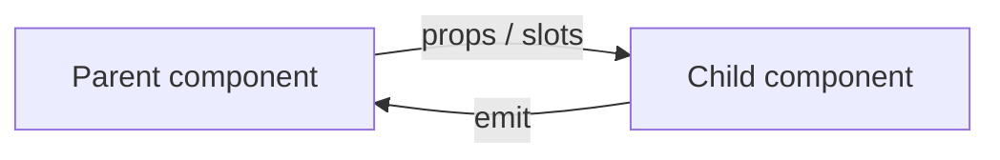

- Vue에서 `부모`와 `자식`은 파일 이름이나 폴더 위치가 아니라, 컴포넌트가 다른 컴포넌트를 템플릿 안에서 사용해 만들어지는 상대적 관계다.
- 부모 컴포넌트는 자식 컴포넌트를 배치하고, 필요한 값을 `props`로 내려주며, 자식이 보낸 이벤트를 듣는다.
- 자식 컴포넌트는 부모에게 받은 값을 읽고 화면을 만들며, 변경 의도나 사용자 액션은 `emit`으로 부모에게 알린다.
- 슬롯을 쓰면 부모가 자식 내부에 들어갈 템플릿 조각을 넘길 수 있다.
- `provide/inject`를 쓰면 직접 부모/자식이 아니어도 상위 컴포넌트가 깊은 하위 컴포넌트에 값을 제공할 수 있다.

---

## 2. 왜 중요한가

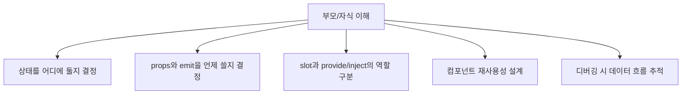

- Vue 앱은 보통 작은 컴포넌트를 중첩해서 큰 화면을 만든다.
- 그래서 어떤 컴포넌트가 `부모`이고 어떤 컴포넌트가 `자식`인지 이해해야 데이터 흐름을 제대로 잡을 수 있다.
- 부모/자식 관계를 모르면 다음 문제가 자주 생긴다.
  - 자식이 `props`를 직접 바꾸려 한다.
  - 형제 컴포넌트끼리 직접 값을 바꾸려 한다.
  - 어디에 `state`를 둬야 하는지 헷갈린다.
  - `slot`, `emit`, `provide/inject`, `store`를 구분하지 못한다.
- Vue의 기본 설계 감각은 아래처럼 보면 된다.
  - 값은 위에서 아래로 내려간다.
  - 행동이나 변경 요청은 아래에서 위로 올라간다.
  - 깊은 트리 공유는 필요할 때만 `provide/inject`나 store로 분리한다.

---

## 3. 핵심 개념

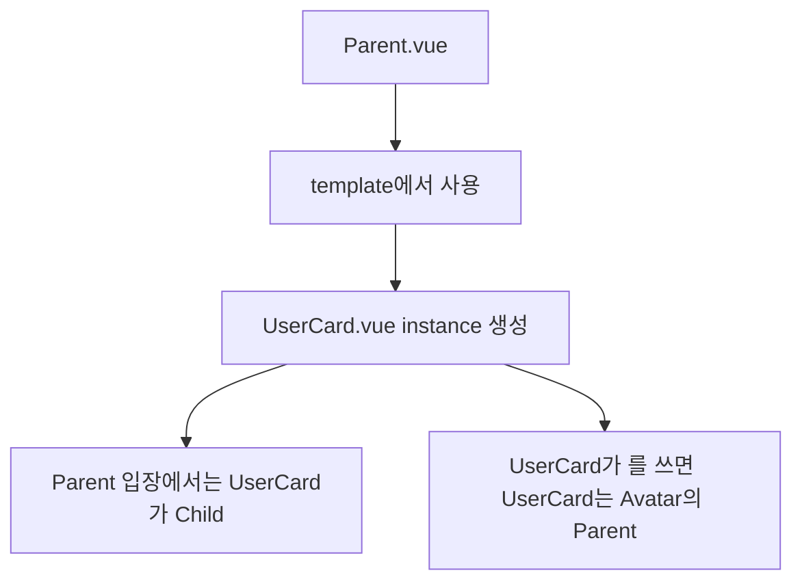

### 3.1 컴포넌트란

- Vue 공식 가이드는 컴포넌트를 UI를 독립적이고 재사용 가능한 조각으로 나누는 단위로 설명한다.
- 예를 들어 한 화면은 다음 컴포넌트들로 나눌 수 있다.
  - `PageHeader`
  - `UserProfile`
  - `UserCard`
  - `Avatar`
  - `FollowButton`
- 이 컴포넌트들이 서로 중첩되면 컴포넌트 트리가 된다.

### 3.2 부모 컴포넌트란

- 부모 컴포넌트는 다른 컴포넌트를 자신의 템플릿 안에서 사용하는 컴포넌트다.
- 예를 들어 `Parent.vue`에서 `<Child />`를 사용하면, 그 렌더링 관계 안에서는 `Parent.vue`가 부모이고 `Child.vue`가 자식이다.

```vue
<!-- Parent.vue -->
<script setup>
import Child from './Child.vue'
</script>

<template>
  <Child />
</template>
```

- 부모가 주로 하는 일:
  - 자식을 화면 어디에 둘지 정한다.
  - 자식에게 필요한 데이터를 `props`로 넘긴다.
  - 자식 안에 들어갈 콘텐츠를 `slot`으로 넘긴다.
  - 자식이 `emit`한 이벤트를 듣고 상태를 바꾼다.

### 3.3 자식 컴포넌트란

- 자식 컴포넌트는 부모 템플릿 안에서 사용되어 렌더링되는 컴포넌트다.
- 자식은 부모에게서 받은 입력을 바탕으로 자기 UI를 만든다.
- 자식이 주로 하는 일:
  - `props`를 읽는다.
  - 내부 UI 상태를 관리한다.
  - 사용자 액션이 생기면 `emit`으로 부모에게 알린다.
  - `<slot />` 위치에 부모가 넘긴 콘텐츠를 렌더링한다.

### 3.4 부모/자식은 상대적 관계다

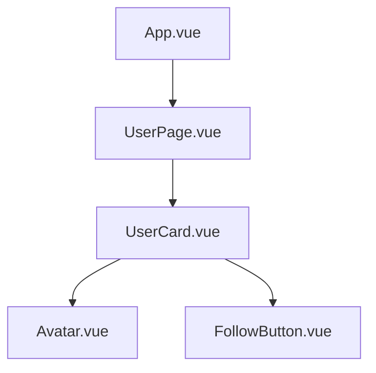

- `UserPage.vue`는 `App.vue` 입장에서는 자식이다.
- 같은 `UserPage.vue`도 `UserCard.vue` 입장에서는 부모다.
- 즉 부모/자식은 컴포넌트 자체의 고정 속성이 아니라, 현재 컴포넌트 트리에서의 위치 관계다.

---

## 4. 구조와 데이터 흐름

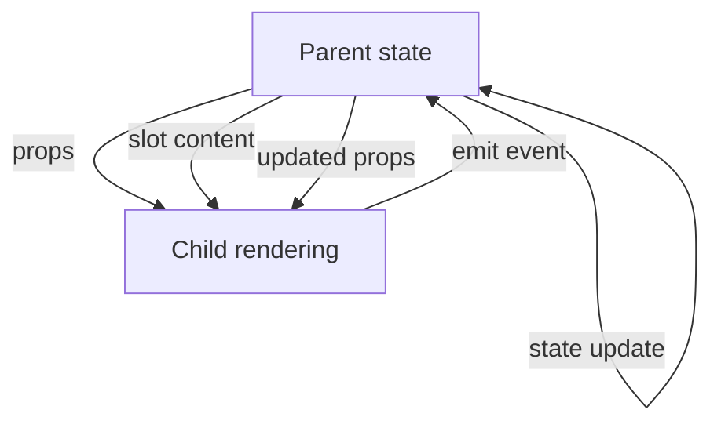

### 4.1 부모에서 자식으로: props

- `props`는 부모가 자식에게 데이터를 넘기는 공식 입력 통로다.
- Vue 공식 문서는 `props`를 부모와 자식 사이의 `one-way-down binding`으로 설명한다.
- 의미는 다음과 같다.
  - 부모의 값이 바뀌면 자식의 prop도 갱신된다.
  - 자식이 prop 자체를 직접 바꾸면 안 된다.
  - 자식은 prop을 읽어서 렌더링하거나 계산에 사용한다.

```vue
<!-- Parent.vue -->
<script setup>
import UserCard from './UserCard.vue'

const user = {
  id: 1,
  name: 'Yuna'
}
</script>

<template>
  <UserCard :user="user" />
</template>
```

```vue
<!-- UserCard.vue -->
<script setup>
defineProps({
  user: {
    type: Object,
    required: true
  }
})
</script>

<template>
  <article>
    <h2>{{ user.name }}</h2>
  </article>
</template>
```

### 4.2 자식에서 부모로: emit

- 자식은 부모의 상태를 직접 바꾸는 대신 이벤트를 올린다.
- 부모는 자식 컴포넌트에 `@event-name` 형태로 리스너를 붙인다.
- 이 패턴은 "자식이 부모에게 명령한다"기보다 "자식이 어떤 일이 일어났다고 알린다"에 가깝다.

```vue
<!-- Parent.vue -->
<script setup>
import UserCard from './UserCard.vue'

function renameUser(nextName) {
  console.log('rename:', nextName)
}
</script>

<template>
  <UserCard @rename="renameUser" />
</template>
```

```vue
<!-- UserCard.vue -->
<script setup>
const emit = defineEmits(['rename'])

function handleClick() {
  emit('rename', 'New name')
}
</script>

<template>
  <button type="button" @click="handleClick">
    Rename
  </button>
</template>
```

### 4.3 부모에서 자식 내부 콘텐츠로: slots

- `slot`은 부모가 자식 컴포넌트 태그 사이에 템플릿 콘텐츠를 넣는 방식이다.
- 자식은 `<slot />`을 통해 그 콘텐츠가 들어갈 위치를 정한다.
- 이때 콘텐츠를 작성하는 주체는 부모이고, 콘텐츠가 놓일 구조를 정하는 주체는 자식이다.

```vue
<!-- Parent.vue -->
<template>
  <Panel>
    <strong>사용자 정보</strong>
  </Panel>
</template>
```

```vue
<!-- Panel.vue -->
<template>
  <section class="panel">
    <slot />
  </section>
</template>
```

### 4.4 상위에서 깊은 하위로: provide/inject

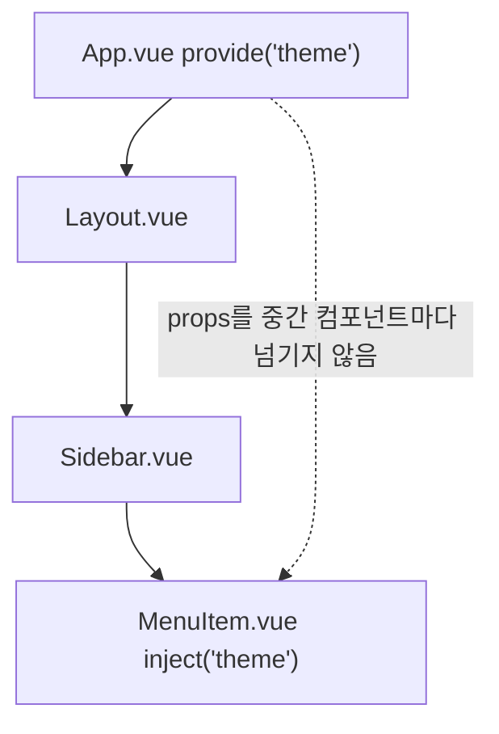

- `provide/inject`는 직접 부모/자식 사이만을 위한 도구가 아니다.
- 상위 컴포넌트가 값을 제공하고, 깊은 하위 컴포넌트가 그 값을 주입받는 방식이다.
- 중간 컴포넌트들이 실제로 쓰지 않는 값을 계속 `props`로 전달하는 `prop drilling`을 줄일 때 유용하다.
- 다만 가까운 부모/자식 사이의 명확한 입력은 먼저 `props`로 표현하는 편이 이해하기 쉽다.

---

## 5. 중요한 세부사항과 판단 기준

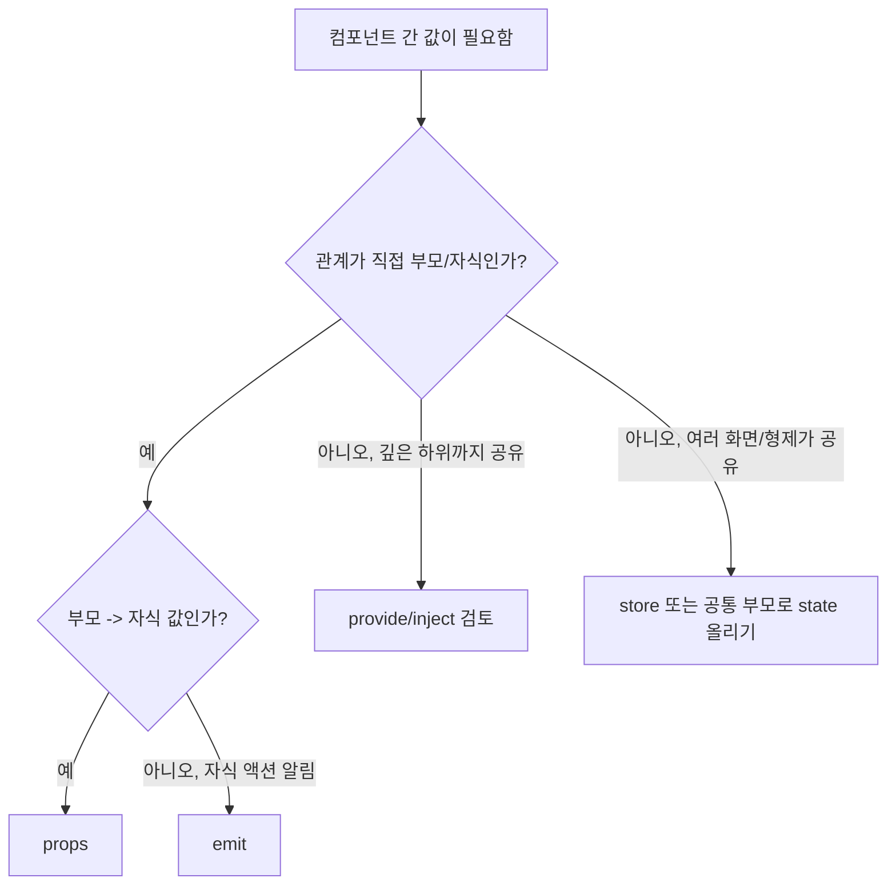

### 5.1 부모/자식은 파일 구조가 아니라 렌더링 구조다

- 같은 폴더에 있어도 부모/자식이 아닐 수 있다.
- 다른 폴더에 있어도 부모가 자식을 import해서 템플릿에서 사용하면 부모/자식 관계가 된다.
- 핵심 질문은 "누가 누구를 템플릿에서 사용하고 있는가?"다.

### 5.2 자식은 props를 직접 바꾸지 않는다

- Vue는 prop 자체를 직접 바꾸는 것을 막는다.
- 자식이 받은 값으로 로컬 상태를 만들고 싶다면 별도 state를 만들거나 computed 값을 사용한다.
- 부모 상태를 바꿔야 한다면 `emit`으로 요청하고 부모가 갱신한다.

```vue
<script setup>
const props = defineProps(['title'])

// 피해야 하는 방식
// props.title = 'changed'
</script>
```

### 5.3 객체/배열 props는 특히 조심한다

- 객체나 배열을 prop으로 받으면, 자식이 그 내부 속성을 변경할 수 있는 경우가 있다.
- 하지만 그렇게 하면 부모 상태를 자식이 몰래 바꾸는 모양이 되어 데이터 흐름이 흐려진다.
- 공식 문서의 권장 감각은 부모/자식이 명시적으로 긴밀히 묶인 경우가 아니라면 자식에서 직접 mutate하지 않는 것이다.
- 더 안전한 방식은 이벤트를 올리고 부모가 새 값을 만드는 것이다.

### 5.4 component event는 DOM event처럼 자동 전파되지 않는다

- Vue의 component event는 기본적으로 직접 자식에게서 발생한 이벤트를 부모가 듣는 구조다.
- 공식 문서는 component emitted event가 bubble되지 않는다고 설명한다.
- 그래서 손자 컴포넌트의 이벤트를 조상에서 바로 듣는 방식으로 설계하면 안 된다.
- 필요한 경우:
  - 중간 컴포넌트가 이벤트를 다시 emit한다.
  - 상태를 공통 부모로 올린다.
  - `provide/inject`나 store를 검토한다.

### 5.5 v-model도 부모/자식 통신이다

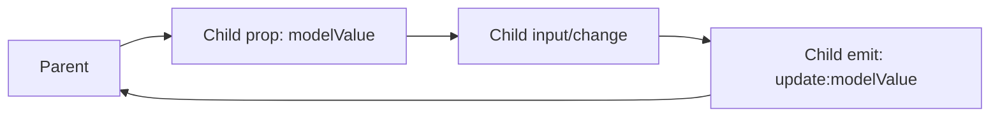

- Vue 컴포넌트의 `v-model`은 결국 `props + emit` 패턴이다.
- 기본적으로 부모 값은 `modelValue` prop으로 내려가고, 자식은 `update:modelValue` 이벤트로 변경 요청을 올린다.
- 그래서 `v-model`도 "자식이 부모 상태를 직접 바꾼다"가 아니라 "부모에게 업데이트 이벤트를 보낸다"로 이해하는 편이 정확하다.

### 5.6 slot은 props와 다르게 "템플릿 조각"을 넘긴다

- `props`는 값이나 데이터 입력이다.
- `slot`은 렌더링할 템플릿 콘텐츠 입력이다.
- 단순 텍스트, 아이콘, 버튼, 목록 아이템 레이아웃처럼 부모가 표시 내용을 커스터마이즈해야 할 때 slot이 자연스럽다.

---

## 6. 실전 예시

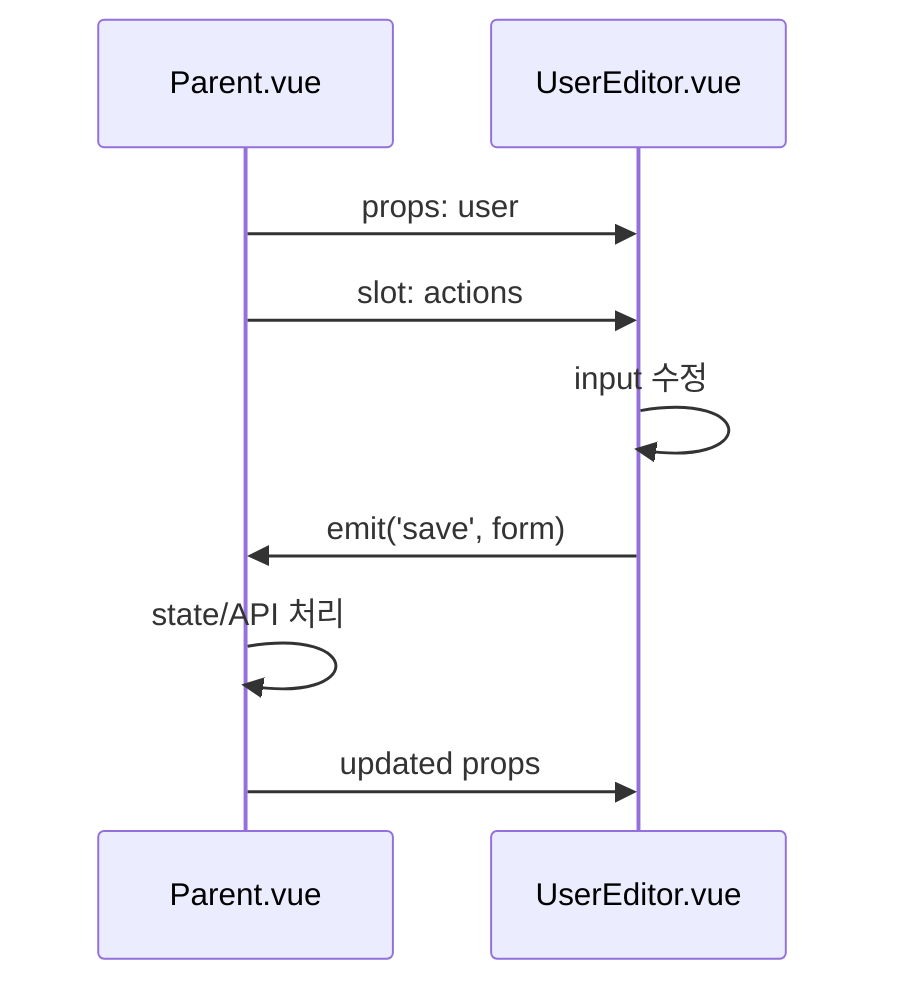

### 6.1 부모가 데이터 소유, 자식이 입력 UI 담당

```vue
<!-- Parent.vue -->
<script setup>
import { ref } from 'vue'
import UserEditor from './UserEditor.vue'

const user = ref({
  id: 1,
  name: 'Yuna'
})

function saveUser(nextUser) {
  user.value = nextUser
}
</script>

<template>
  <UserEditor :user="user" @save="saveUser">
    <template #actions>
      <span>Profile settings</span>
    </template>
  </UserEditor>
</template>
```

```vue
<!-- UserEditor.vue -->
<script setup>
import { ref, watch } from 'vue'

const props = defineProps({
  user: {
    type: Object,
    required: true
  }
})

const emit = defineEmits(['save'])
const draftName = ref(props.user.name)

watch(
  () => props.user.name,
  (name) => {
    draftName.value = name
  }
)

function submit() {
  emit('save', {
    ...props.user,
    name: draftName.value
  })
}
</script>

<template>
  <form @submit.prevent="submit">
    <header>
      <slot name="actions" />
    </header>

    <input v-model="draftName" />
    <button type="submit">Save</button>
  </form>
</template>
```

- 이 예시에서 부모는 `user` 상태를 소유한다.
- 자식은 `user`를 prop으로 받아 초기값처럼 사용하고, 편집 중인 값은 로컬 state인 `draftName`으로 관리한다.
- 저장 버튼을 누르면 자식이 `save` 이벤트를 올린다.
- 최종적으로 부모가 `user`를 갱신한다.

### 6.2 형제 컴포넌트는 직접 부모/자식이 아니다

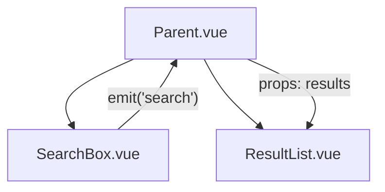

- `SearchBox`와 `ResultList`는 형제다.
- 형제끼리는 직접 부모/자식 관계가 아니다.
- `SearchBox`의 입력 결과를 `ResultList`에 보여주려면 보통 공통 부모가 상태를 소유한다.
- 흐름은 다음처럼 잡는다.
  - `SearchBox`가 검색어를 `emit`한다.
  - 부모가 검색 결과 상태를 만든다.
  - 부모가 `ResultList`에 결과를 `props`로 내려준다.

### 6.3 깊은 하위 컴포넌트에는 provide/inject를 검토한다

```vue
<!-- App.vue -->
<script setup>
import { provide, ref } from 'vue'

const theme = ref('dark')

provide('theme', theme)
</script>
```

```vue
<!-- DeepChild.vue -->
<script setup>
import { inject } from 'vue'

const theme = inject('theme')
</script>
```

- `theme`, `locale`, form context처럼 여러 단계 아래에서 필요하지만 중간 컴포넌트들이 직접 쓰지 않는 값은 `provide/inject`가 더 깔끔할 수 있다.
- 단, 가까운 부모가 바로 자식에게 명시적으로 넘기는 데이터라면 `props`가 더 단순하다.

---

## 7. 용어 정리와 빠른 복습

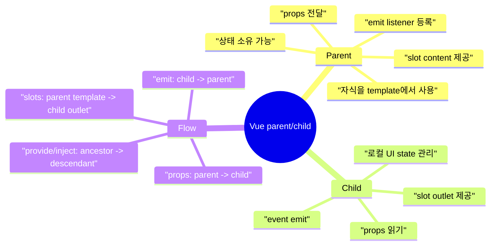

- `Parent component`
  - 다른 컴포넌트를 자신의 템플릿에서 사용하는 컴포넌트.
  - 자식에게 값을 주고, 자식의 이벤트를 들으며, 상태를 소유하는 경우가 많다.

- `Child component`
  - 부모 템플릿 안에서 사용되는 컴포넌트.
  - 부모에게 받은 입력으로 UI를 만들고, 변경 의도는 이벤트로 올린다.

- `props`
  - 부모가 자식에게 값을 내려주는 입력 API.
  - Vue에서는 one-way-down 흐름으로 이해한다.

- `emit`
  - 자식이 부모에게 이벤트를 올리는 출력 API.
  - 부모는 `@event-name`으로 듣는다.

- `slot`
  - 부모가 자식 내부 특정 위치에 들어갈 템플릿 콘텐츠를 넘기는 방식.
  - 자식은 `<slot />`으로 콘텐츠가 들어갈 자리를 만든다.

- `provide/inject`
  - 상위 컴포넌트가 깊은 하위 컴포넌트에 값을 제공하는 방식.
  - 단순한 직접 부모/자식 통신보다 넓은 범위의 의존성 공유에 가깝다.

- 빠른 판단:
  - 부모가 자식에게 값 전달: `props`
  - 자식이 부모에게 액션 알림: `emit`
  - 부모가 자식 내부 콘텐츠 제공: `slot`
  - 깊은 하위 컴포넌트까지 공유: `provide/inject`
  - 여러 화면이나 멀리 떨어진 컴포넌트 공유: store 검토

---

## 참고 링크

- [Vue Guide - Components Basics](https://vuejs.org/guide/essentials/component-basics)
- [Vue Guide - Props](https://vuejs.org/guide/components/props)
- [Vue Guide - Component Events](https://vuejs.org/guide/components/events)
- [Vue Guide - Slots](https://vuejs.org/guide/components/slots)
- [Vue Guide - Provide / Inject](https://vuejs.org/guide/components/provide-inject)
- [Vue Guide - Component v-model](https://vuejs.org/guide/components/v-model)
- [Vue Guide - Fallthrough Attributes](https://vuejs.org/guide/components/attrs)

<!-- study-links:start -->
## 관련 문서

- `emit 상세 정리`: [[vue-props-emit/props-emit|Vue `props`와 `emit` 상세 정리]]
- `vue slots`: [[vue-slots/vue-slots|Vue Slots: `ToonBox`처럼 자식 화면을 끼워 그리는 법]]
<!-- study-links:end -->
