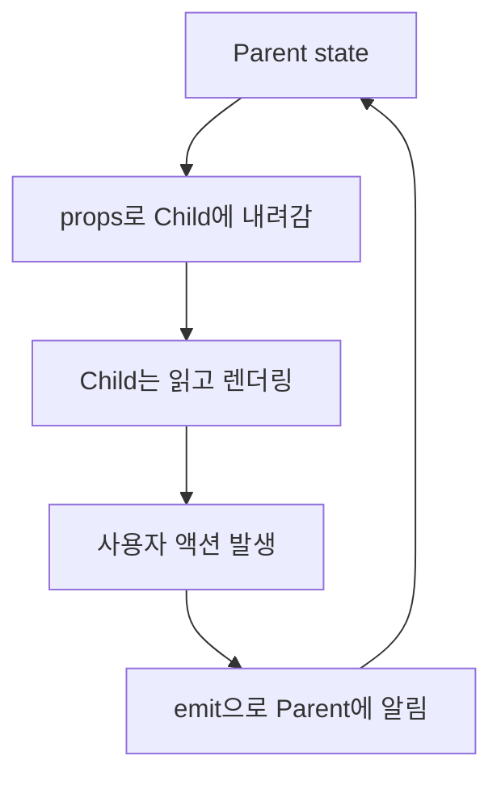
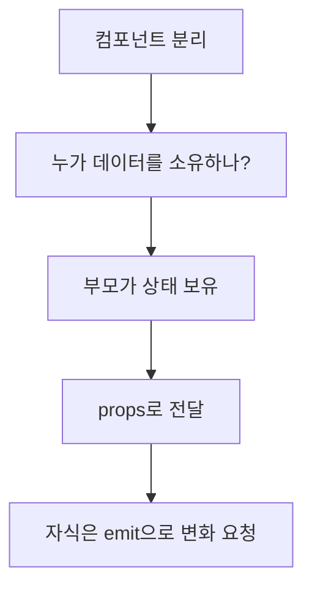
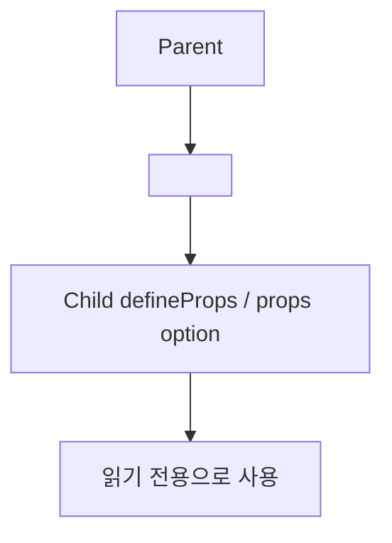
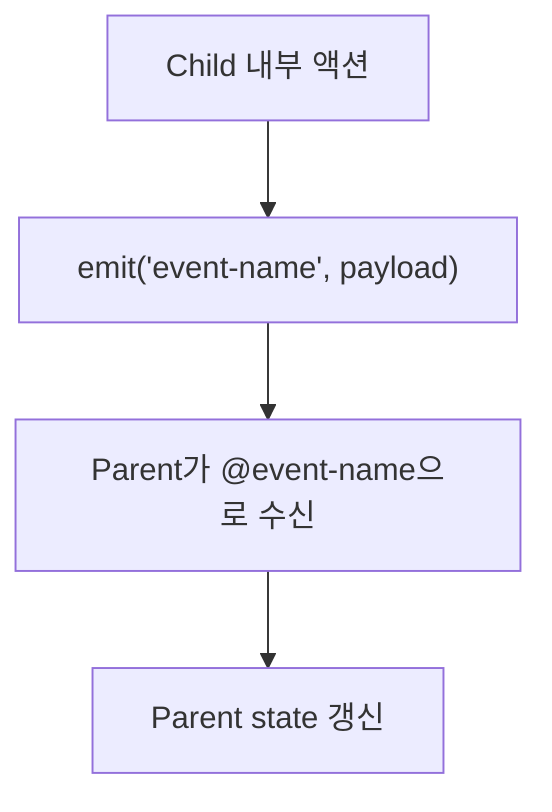
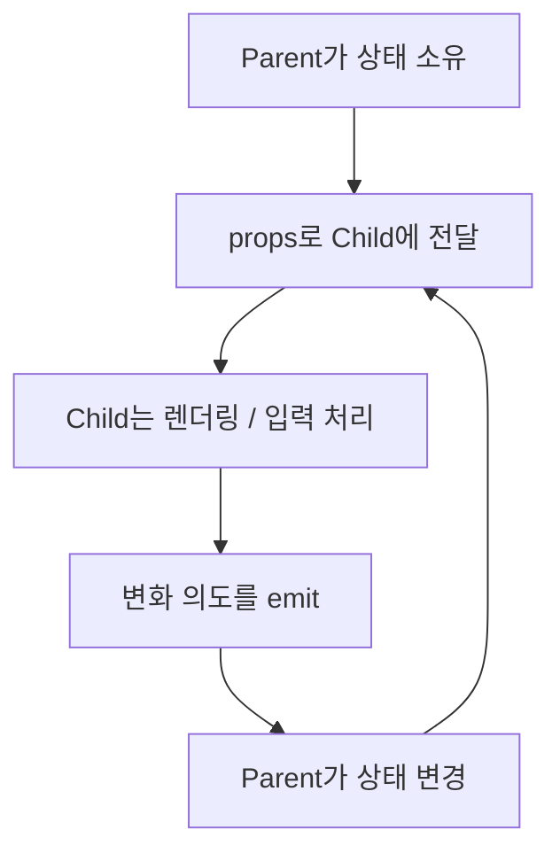
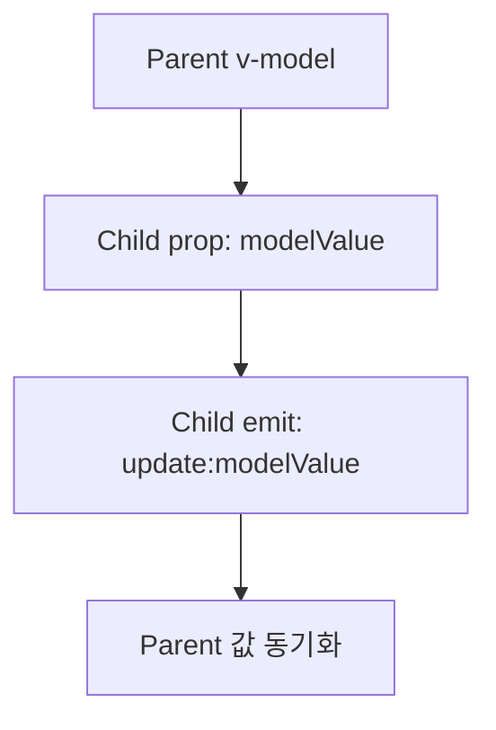
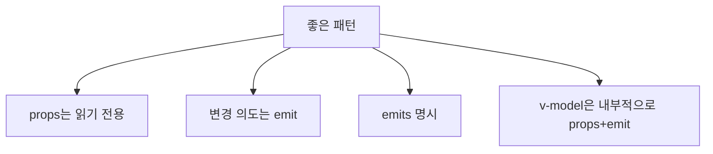

# Vue `props`와 `emit` 상세 정리

작성 기준일: 2026-04-21  
조사 방식: 웹검색 기반 최신 조사  
가정: `props`와 `emit`은 Vue 컴포넌트 문맥으로 해석함  
주요 참고: `vuejs.org` 공식 문서

## 1. 한 줄 요약



Vue에서 `props`는 부모 컴포넌트가 자식 컴포넌트에 데이터를 내려주는 입력 통로이고, `emit`은 자식이 부모에게 "이런 일이 일어났다"라고 이벤트를 올려 보내는 출력 통로다.

Vue 공식 문서는:

- props는 one-way-down binding
- component events는 child가 parent에 custom event를 올리는 방식

이라고 설명한다.

즉 아주 단순하게 말하면:

- `props` = 부모 -> 자식 데이터 전달
- `emit` = 자식 -> 부모 이벤트 알림

이다.

---

## 2. 왜 중요한가



컴포넌트 기반 UI에서는 항상 이 질문이 생긴다.

- 이 값은 누가 갖고 있지?
- 누가 이 값을 바꿀 수 있지?
- 자식이 부모 상태를 직접 바꿔도 되나?

Vue는 이 문제를 매우 명확하게 푼다.

### 2.1 핵심 원칙

Vue 공식 Props 문서는:

- 모든 props는 one-way-down binding이라고

설명한다.

즉:

- 부모 상태가 자식으로 내려가지만
- 자식이 props를 직접 바꾸는 방식으로 부모 상태를 거슬러 올라가면 안 된다

### 2.2 왜 이렇게 설계했나

공식 문서도 설명하듯 이건:

- 부모 상태를 자식이 몰래 바꾸는 것을 막고
- 데이터 흐름을 이해하기 쉽게 하고
- 디버깅을 쉽게 하기 위해서다

즉 Vue는 "상태 소유권"을 명확하게 유지하려고 `props + emit` 패턴을 기본으로 둔다.

### 2.3 한 줄 감각

Vue 컴포넌트 통신은:

- 값은 내려오고(props)
- 행동/의도는 올라간다(emit)

로 기억하면 거의 맞다.

---

## 3. `props`



Vue `Props` 문서는 props를:

- component에 전달되는 사용자 지정 속성(custom attributes)
- parent에서 child로 전달되는 입력

이라고 설명한다.

### 3.1 가장 기본 사용

`<script setup>` 기준:

```vue
<script setup>
const props = defineProps(['foo'])
</script>
```

또는 object syntax:

```vue
<script setup>
defineProps({
  title: String,
  count: Number
})
</script>
```

### 3.2 읽는 법

부모:

```vue
<Child :title="pageTitle" :count="totalCount" />
```

자식:

```vue
const props = defineProps({
  title: String,
  count: Number
})
```

즉 부모가 값을 내려주고 자식은 그 값을 읽는다.

### 3.3 one-way-down binding

Vue 공식 문서가 가장 강조하는 포인트:

- parent가 바뀌면 child props는 최신 값으로 갱신된다
- child가 props를 직접 mutate하면 안 된다

예:

```js
const props = defineProps(['foo'])
props.foo = 'bar' // 경고
```

즉 props는 자식 입장에선 읽기 전용 입력이다.

### 3.4 prop validation

Vue는 prop 타입, required, default, custom validator도 지원한다.

예:

```js
defineProps({
  size: {
    type: String,
    required: true
  },
  count: {
    type: Number,
    default: 0
  }
})
```

즉 props는 단순 전달 통로가 아니라, 컴포넌트 API 계약을 문서화하는 수단이기도 하다.

### 3.5 흔한 props 사용 케이스

- 텍스트/숫자/불리언 값 전달
- 리스트 데이터 전달
- 초기 설정값 전달
- callback 대신 event listener를 붙이기 전 입력 전달

즉 child가 스스로 소유하지 않는 대부분의 입력값은 props로 받는다.

---

## 4. `emit`



Vue `Component Events` 문서는:

- component가 custom event를 emit할 수 있고
- parent는 `v-on`으로 들을 수 있다고

설명한다.

### 4.1 가장 기본 사용

자식:

```vue
<script setup>
const emit = defineEmits(['submit'])

function onClick() {
  emit('submit')
}
</script>
```

부모:

```vue
<Child @submit="handleSubmit" />
```

즉 자식은 이벤트를 발생시키고, 부모는 그 이벤트를 듣는다.

### 4.2 payload 전달

Vue 문서는 `$emit()` 뒤에 추가 인자를 넘기면 listener가 받는다고 설명한다.

예:

```vue
emit('increaseBy', 1)
```

부모:

```vue
<MyButton @increase-by="(n) => count += n" />
```

즉 `emit`은 단순 신호만이 아니라 데이터도 같이 전달할 수 있다.

### 4.3 `defineEmits`

`<script setup>`에서는 `defineEmits()`를 써서:

- 어떤 이벤트를 내보낼지 명시
- TypeScript 타입 지정
- payload validation

을 할 수 있다.

예:

```ts
const emit = defineEmits<{
  (e: 'change', id: number): void
  (e: 'update', value: string): void
}>()
```

### 4.4 왜 선언이 중요한가

공식 문서가 설명하듯 emits를 명시하면:

- 컴포넌트가 어떤 이벤트를 내보내는지 문서화되고
- fallthrough attributes 관련 edge case를 줄이며
- TS/런타임 검증도 쉬워진다

즉 큰 프로젝트일수록 `emit`도 API 계약으로 명시하는 편이 좋다.

---

## 5. `props`와 `emit`의 관계



Vue 컴포넌트 통신의 핵심은 `props`와 `emit`이 짝이라는 점이다.

### 5.1 데이터는 내려온다

- parent -> child = props

### 5.2 이벤트는 올라간다

- child -> parent = emit

### 5.3 왜 중요한가

이 구조 덕분에:

- 상태 소유권이 명확하고
- 자식은 재사용 가능한 "입력/출력 API"로 보이며
- 데이터 흐름이 예측 가능하다

즉 Vue 컴포넌트 설계는 사실상:

- "이 값은 prop인가?"
- "이 변화는 emit으로 올려야 하나?"

를 구분하는 일이다.

### 5.4 안티패턴

가장 흔한 나쁜 패턴:

- child가 props를 직접 mutate하려는 것

즉:

```js
props.value = "new"
```

같은 코드는 Vue가 경고하는 대표 안티패턴이다.

### 5.5 올바른 감각

자식은:

- 부모 상태를 직접 바꾸는 주체가 아니라
- "이런 일이 있었으니 바꿀지 말지는 부모가 결정해 달라"고 알리는 주체

라고 보면 된다.

---

## 6. `v-model`은 결국 `props + emit`



Vue 공식 `Component v-model` 문서는:

- `defineModel()`은 편의 macro이고
- 내부적으로는 prop + emit 패턴으로 확장된다고

설명한다.

### 6.1 기본 구조

Vue 3.4 이전/내부 감각으로 보면:

- prop 이름: `modelValue`
- event 이름: `update:modelValue`

다.

즉:

```vue
<Child v-model="count" />
```

는 사실상:

```vue
<Child
  :model-value="count"
  @update:model-value="count = $event"
/>
```

감각이다.

### 6.2 왜 중요한가

많은 사람들이 `v-model`을 별도 마법처럼 느끼지만, 사실은:

- `props`
- `emit`

패턴의 문법 설탕(syntax sugar)에 가깝다.

즉 `props/emit`을 이해하면 `v-model`도 자연스럽게 이해된다.

### 6.3 여러 `v-model`

Vue 문서는:

- `v-model:title`
- `v-model:first-name`

같이 여러 모델도 가능하다고 설명한다.

즉 이것도 결국:

- prop 이름
- `update:<prop>` 이벤트

를 쌍으로 확장한 것에 불과하다.

### 6.4 실무 감각

입력형 컴포넌트, 폼 컴포넌트, 토글/셀렉트류를 만들 때:

- 값은 prop
- 변경은 emit
- 양방향처럼 쓰고 싶으면 `v-model`

이 세트로 생각하면 거의 다 맞는다.

---

## 7. 실무 패턴과 자주 하는 실수



### 7.1 props는 입력, emit은 출력

이 원칙을 계속 유지해야 컴포넌트가 안정적이다.

### 7.2 child가 prop를 직접 바꾸지 말 것

가장 흔한 실수다.

필요하면:

- local ref로 복사해 초기값처럼 쓰거나
- computed getter/setter로 다루거나
- parent에게 emit해서 변경하게 해야 한다

### 7.3 emit 이름은 의도가 드러나게

예:

- `submit`
- `close`
- `change`
- `select`
- `update:modelValue`

즉 "무슨 일이 일어났는가"가 이름에 보여야 한다.

### 7.4 payload는 안정적으로

emit payload는 컴포넌트 API 일부다.

즉:

- shape를 자주 바꾸면 부모들이 다 깨질 수 있다

그래서 TypeScript + `defineEmits` 선언이 특히 유용하다.

### 7.5 깊은 계층 통신에는 한계

Vue 공식 events 문서도:

- component emitted events는 bubble되지 않고
- direct child에게만 듣는다고

설명한다.

즉 sibling이나 깊은 트리 통신은:

- provide/inject
- global state management
- 외부 이벤트 버스

같은 다른 도구가 더 맞을 수 있다.

### 7.6 실무 요약

- 단순 부모-자식 값 전달 -> props
- 자식의 사용자 액션 알림 -> emit
- 입력 컴포넌트 동기화 -> `v-model`
- 깊은 트리 상태 공유 -> store/pinia 등 검토

즉 `props + emit`은 컴포넌트 API의 기본이고, 모든 상태 관리 문제의 만능 해답은 아니다.

---

## 참고 링크

- Vue Props: [Props](https://vuejs.org/guide/components/props)
- Vue Component Events: [Component Events](https://vuejs.org/guide/components/events)
- Vue Component v-model: [Component v-model](https://vuejs.org/guide/components/v-model.html)
