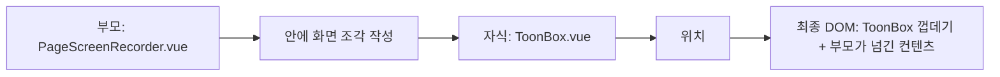
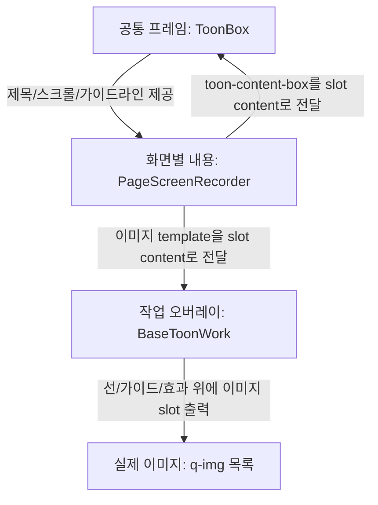
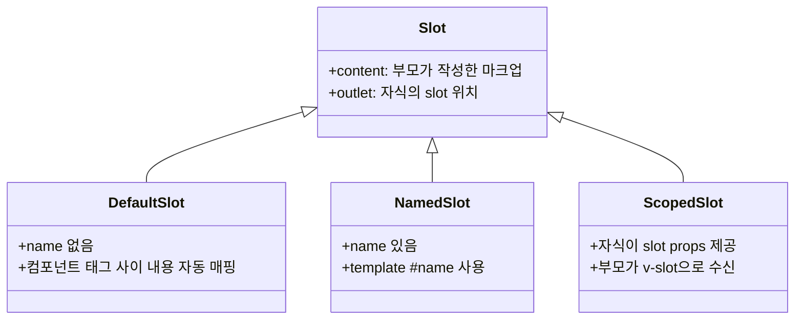
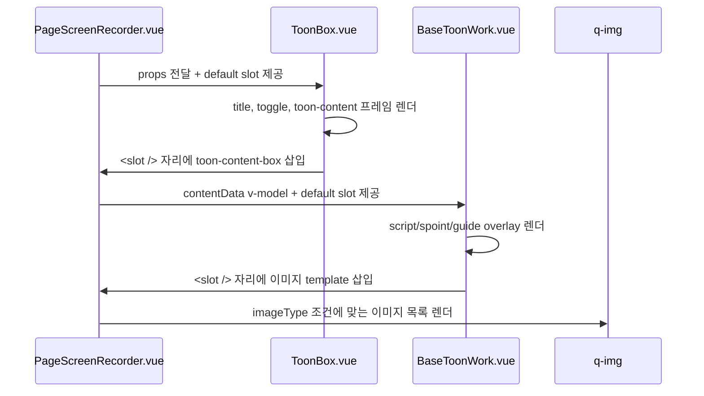
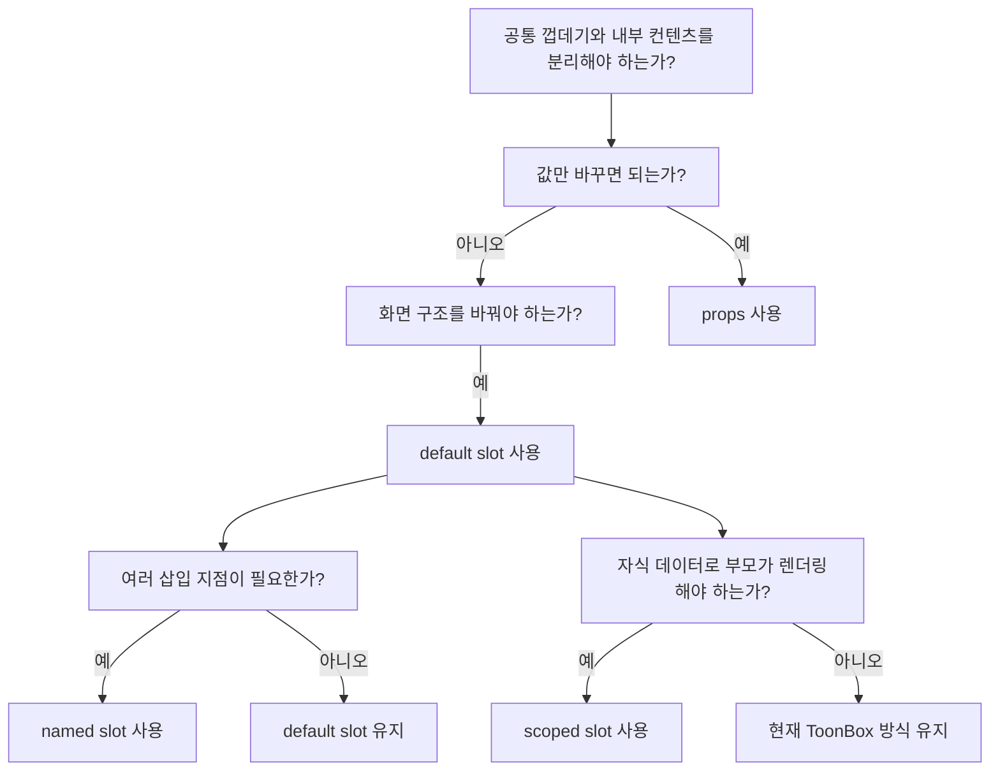
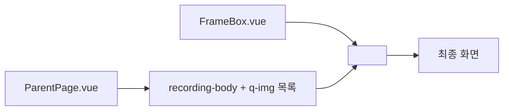
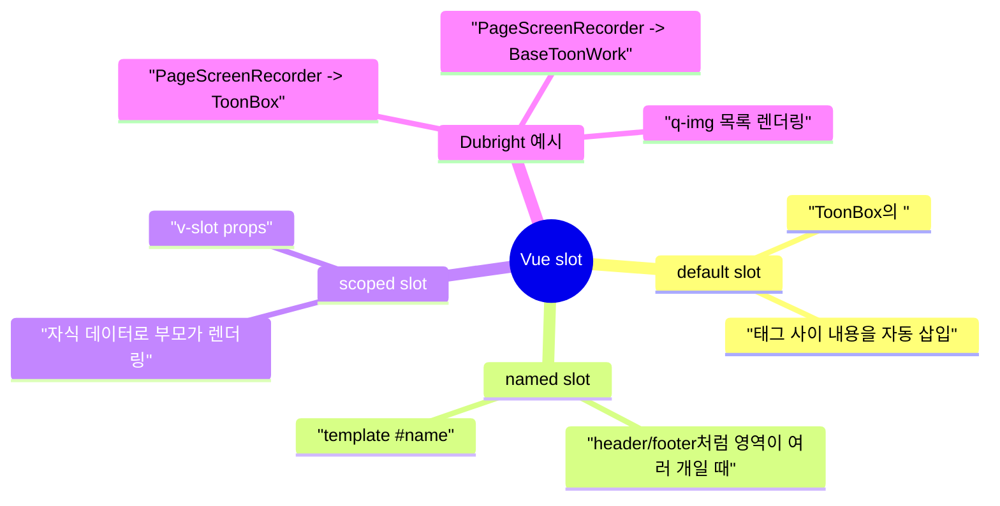

# Vue Slots: `ToonBox`처럼 자식 화면을 끼워 그리는 법

## 1. 한 줄 요약

- `PageScreenRecorder.vue`의 `<ToonBox> ... </ToonBox>`처럼 컴포넌트 태그 안에 화면 조각을 넣고, 자식 컴포넌트가 자기 템플릿의 `<slot />` 위치에 그 조각을 렌더링하는 Vue 용법은 **slot**, 이 경우에는 이름 없는 **default slot**이다.
- 사용자가 말한 "view 용법"은 문맥상 Vue의 "view를 그리는 문법"이라기보다, Vue 컴포넌트 합성에서 **부모가 slot content를 제공하고 자식이 slot outlet으로 받아 그리는 방식**에 가깝다.



## 2. 왜 중요한가

- `ToonBox`는 제목, 스크롤 영역, 중앙 가이드 라인, 토글 박스 같은 **공통 프레임**을 담당한다.
- `PageScreenRecorder.vue`는 실제 웹툰 이미지 목록과 녹화용 `BaseToonWork`를 **페이지별 내용물**로 제공한다.
- 이 분리가 가능해지는 이유가 slot이다. 공통 레이아웃 컴포넌트가 "어떤 내용을 넣을지"까지 알 필요 없이, `<slot />` 자리만 열어두면 부모가 원하는 화면을 끼워 넣을 수 있다.
- Dubright 코드 기준으로는 `ToonBox`가 1차 슬롯 프레임이고, `BaseToonWork`가 2차 슬롯 프레임이다. 즉, `PageScreenRecorder.vue`의 이미지 렌더링은 두 번의 default slot을 통과한다.



## 3. 핵심 개념

- **Slot content**
  - 부모 컴포넌트가 자식 컴포넌트 태그 사이에 작성한 마크업이다.
  - 예: `PageScreenRecorder.vue`의 `<ToonBox> ... </ToonBox>` 내부 `div.toon-content-box`.
- **Slot outlet**
  - 자식 컴포넌트가 자기 템플릿에 둔 `<slot />` 자리다.
  - 예: `ToonBox.vue`의 `.toon-content` 내부 `<slot />`.
- **Default slot**
  - `<slot />`처럼 `name`이 없는 슬롯이다.
  - 부모도 `<template #default>`를 명시하지 않고 태그 사이에 바로 내용을 넣을 수 있다.
- **Named slot**
  - `<slot name="header" />`처럼 이름 있는 영역을 여러 개 열 때 쓴다.
  - 부모는 `<template #header>` 또는 `<template v-slot:header>`로 특정 슬롯에 내용을 보낸다.
- **Scoped slot**
  - 자식이 `<slot :item="item" />`처럼 데이터를 넘기고, 부모가 `v-slot="{ item }"`으로 받아 렌더링을 커스터마이즈하는 방식이다.
  - 현재 `ToonBox`의 `<slot />`은 slot props를 넘기지 않으므로 scoped slot이 아니다.



## 4. `PageScreenRecorder.vue` 렌더링 흐름

- `PageScreenRecorder.vue`는 `ToonBox`에 props를 넘긴다.
  - `:title`
  - `:gap`
  - `:scale`
  - `:workspace_options`
- `ToonBox.vue`는 이 props로 공통 UI를 그리고, `.toon-content` 안의 `<slot />` 위치에 부모가 넘긴 `div.toon-content-box`를 삽입한다.
- `div.toon-content-box` 내부의 `BaseToonWork`도 같은 방식으로 동작한다.
- `BaseToonWork.vue`는 script line, spoint line, guide box, fade effect 같은 오버레이 구조를 그리고, 자기 `<slot />` 위치에 부모가 넘긴 이미지 template을 삽입한다.
- 이미지 template은 `imageType`에 따라 `contentData.images` 또는 `contentData.replace_images`를 `v-for`로 순회하면서 `q-img`를 그린다.



### 실제 코드 구조

```vue
<ToonBox :title="episodeInfo?.title" :gap="false" :workspace_options="workspace_options">
  <div class="toon-content-box">
    <BaseToonWork v-model:contentData="contentData" :workspace_options="workspace_options">
      <template v-if="imageType === 'original'">
        <q-img v-for="image in contentData?.images" :key="image" :src="$utils.get_image_url(image)" />
      </template>
    </BaseToonWork>
  </div>
</ToonBox>
```

```vue
<!-- ToonBox.vue -->
<div class="toon-content scroll col">
  <slot />
</div>
```

```vue
<!-- BaseToonWork.vue -->
<div id="toon-overlay">
  <!-- 선/가이드/오버레이 렌더 -->
  <slot />
  <div id="toon-overlay-fade-effect" />
</div>
```

## 5. 중요 세부 사항과 트레이드오프

- **props와 slot의 역할을 구분해야 한다.**
  - props는 자식 컴포넌트의 상태나 옵션을 바꾼다.
  - slot은 자식 컴포넌트 내부의 특정 위치에 들어갈 "화면 조각"을 바꾼다.
- **slot content의 데이터 스코프는 부모 쪽이다.**
  - `PageScreenRecorder.vue` 안에서 작성한 slot content는 `contentData`, `imageType`, `$utils`, `$ui` 같은 부모 인스턴스의 값을 본다.
  - `ToonBox.vue` 내부 데이터에 직접 접근하는 구조가 아니다.
- **`<template v-if>`는 실제 DOM 래퍼를 만들지 않는 조건 그룹이다.**
  - `imageType === 'original'`일 때만 원본 이미지용 `q-img` 목록을 만든다.
  - `imageType === 'replace' || imageType === 'replaced'`일 때만 교체 이미지 목록을 만든다.
- **`v-for`에는 안정적인 `:key`가 필요하다.**
  - 여기서는 이미지 경로 문자열을 key로 쓴다.
  - 이미지 목록에 중복 경로가 생길 수 있다면 더 안정적인 key를 고민해야 한다.
- **`q-img loading="eager"`는 즉시 로딩 의도를 드러낸다.**
  - 화면 녹화용 페이지에서는 lazy loading보다 즉시 로딩이 맞을 수 있다.
  - 일반 사용자 스크롤 화면이라면 lazy loading이 더 적합할 수 있다.



## 6. 실전 예시

- `ToonBox` 같은 공통 박스 컴포넌트는 아래처럼 설계할 수 있다.
- 자식 컴포넌트는 "레이아웃과 공통 기능"만 알고, 내부 컨텐츠는 `<slot />`로 받는다.

```vue
<!-- FrameBox.vue -->
<template>
  <section class="frame-box">
    <header v-if="title">{{ title }}</header>
    <main class="frame-body">
      <slot />
    </main>
  </section>
</template>

<script>
export default {
  name: "FrameBox",
  props: {
    title: {
      type: String,
      default: "",
    },
  },
};
</script>
```

```vue
<!-- ParentPage.vue -->
<template>
  <FrameBox title="녹화 화면">
    <div class="recording-body">
      <q-img v-for="image in images" :key="image" :src="image" loading="eager" />
    </div>
  </FrameBox>
</template>
```



- 이름 있는 영역이 필요하면 named slot으로 확장한다.

```vue
<!-- LayoutBox.vue -->
<template>
  <section>
    <header><slot name="header" /></header>
    <main><slot /></main>
    <footer><slot name="footer" /></footer>
  </section>
</template>
```

```vue
<!-- ParentPage.vue -->
<template>
  <LayoutBox>
    <template #header>제목 영역</template>
    본문 영역
    <template #footer>하단 버튼 영역</template>
  </LayoutBox>
</template>
```

## 7. 용어와 빠른 정리

- **이 패턴의 이름**
  - Vue 공식 용어: slot
  - 현재 코드에 더 정확한 표현: default slot
  - 일반 UI 설계 용어: component composition, content projection
- **현재 `ToonBox` 사용은 scoped slot이 아니다.**
  - `ToonBox.vue`가 `<slot :something="value" />`처럼 데이터를 넘기지 않기 때문이다.
- **현재 `ToonBox` 사용은 named slot도 아니다.**
  - `<slot name="...">`가 아니라 `<slot />`만 있으므로 이름 없는 default slot이다.
- **`BaseToonWork`도 같은 패턴이다.**
  - `BaseToonWork.vue`가 오버레이를 먼저 그리고, `<slot />` 위치에 `q-img` 목록을 삽입한다.
- **props, event, v-model, slot은 같이 쓰이는 경우가 많다.**
  - `PageScreenRecorder.vue`는 `ToonBox`에는 props를 넘기고, `BaseToonWork`에는 `v-model:contentData`와 slot을 함께 쓴다.



## 8. 참고 링크

- [Vue 공식 가이드 - Slots](https://vuejs.org/guide/components/slots)
- [Vue 공식 가이드 - Component Basics](https://vuejs.org/guide/essentials/component-basics)
- [Vue 공식 가이드 - Conditional Rendering](https://vuejs.org/guide/essentials/conditional)
- [Vue 공식 가이드 - List Rendering](https://vuejs.org/guide/essentials/list)
- [Vue 공식 가이드 - Props](https://vuejs.org/guide/components/props)
- [Quasar 공식 문서 - QImg](https://quasar.dev/vue-components/img)
- [PageScreenRecorder.vue](/Users/nes0903/Documents/dobedub/dubright_front/src/components/screenRecorder/PageScreenRecorder.vue)
- [ToonBox.vue](/Users/nes0903/Documents/dobedub/dubright_front/src/components/toon/ToonBox.vue)
- [BaseToonWork.vue](/Users/nes0903/Documents/dobedub/dubright_front/src/components/base/BaseToonWork.vue)

