# Web Audio API

## 1. 한 줄 요약

- Web Audio API는 브라우저에서 오디오를 재생만 하는 수준을 넘어, 오디오 소스 선택, mixing, effect, 분석, 시각화, 공간화, 녹음/stream 연동, 커스텀 DSP까지 구성할 수 있게 해주는 low-level 오디오 그래프 API다.
- 핵심 모델은 `AudioContext` 안에서 `AudioNode`들을 연결해 audio routing graph를 만들고, `AudioParam`으로 node의 값을 시간 축에 맞춰 제어하는 것이다.
- `<audio>` element가 "미디어 파일을 재생하는 UI/플레이어"에 가깝다면, Web Audio API는 "브라우저 안의 오디오 엔진"에 가깝다.
- Tone.js 같은 라이브러리는 Web Audio API를 직접 감싼 상위 추상화이며, `dubright_front`의 ShockWave도 결과적으로 이 브라우저 오디오 모델 위에서 동작한다.

### `low-level 오디오 그래프 API`의 의미

- `low-level`
  - 완성된 플레이어 UI나 음악 제작 기능을 바로 제공한다는 뜻이 아니다.
  - 개발자가 `AudioContext`, `AudioNode`, `AudioParam` 같은 기본 부품을 직접 조립한다는 뜻이다.
  - 예를 들어 "파일을 재생해줘"가 아니라, "파일을 decode해서 source node에 넣고, gain node와 filter node를 거쳐 destination에 연결해줘"에 가깝다.
- `오디오 그래프`
  - 오디오 신호가 흐르는 node 연결 구조를 뜻한다.
  - source node가 소리를 만들거나 가져오고, processing node가 소리를 바꾸고, destination node가 최종 출력한다.
  - 이 연결 구조가 그래프처럼 생겼기 때문에 audio graph라고 부른다.
- `API`
  - 브라우저가 JavaScript에게 제공하는 프로그래밍 인터페이스다.
  - 개발자는 이 API를 호출해서 브라우저 내부의 오디오 엔진에 source 생성, node 연결, gain 조절, filter 적용, scheduling 같은 작업을 요청한다.
- 한 문장으로 풀면
  - `low-level 오디오 그래프 API`는 "브라우저가 제공하는 오디오 기본 부품들을 JavaScript로 직접 연결하고 제어해서, 원하는 재생/효과/분석 흐름을 만드는 API"라는 뜻이다.

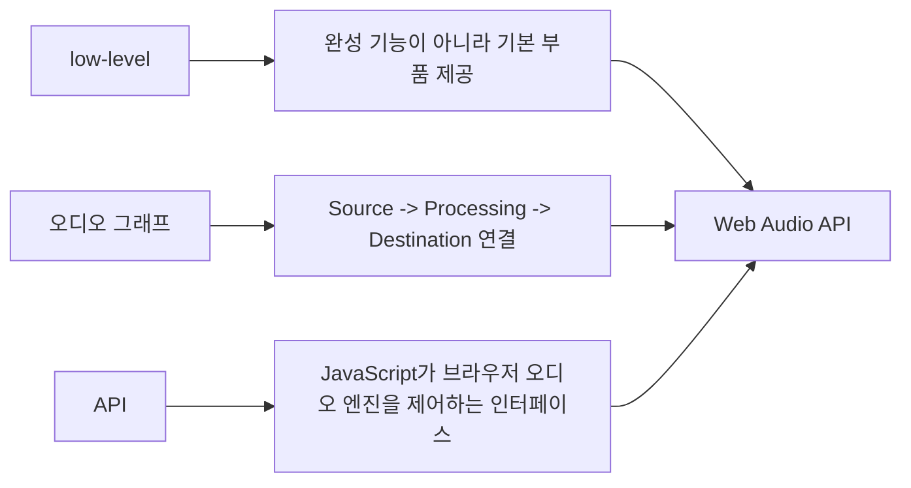

### `AudioNode`의 의미

- `AudioNode`는 Web Audio API에서 오디오 그래프를 구성하는 하나의 처리 단위다.
- 여기서 `Node`는 HTML DOM의 `div`, `button` 같은 DOM node를 뜻하지 않는다.
- 오디오 신호가 들어오거나, 만들어지거나, 변형되거나, 최종 출력되는 "오디오 부품"을 뜻한다.
- 쉽게 말하면 `AudioNode`는 오디오 회로의 부품 하나다.
  - 파일을 재생하는 부품
  - 마이크 입력을 받는 부품
  - 볼륨을 조절하는 부품
  - 필터를 거는 부품
  - 소리를 분석하는 부품
  - 스피커로 내보내는 부품
- `AudioNode`는 보통 input과 output을 가진다.
  - source node는 소리를 만들거나 가져오므로 output 중심이다.
  - effect/processing node는 입력을 받아 처리한 뒤 output으로 내보낸다.
  - destination node는 최종 출력 지점이므로 input 중심이다.
- node들은 `connect()`로 서로 연결된다.
  - `source.connect(gain)`
  - `gain.connect(filter)`
  - `filter.connect(audioContext.destination)`
- 이 연결 결과가 audio graph다.
- 그래서 `AudioNode`를 이해하면 Web Audio API의 전체 구조를 이해하기 쉬워진다.

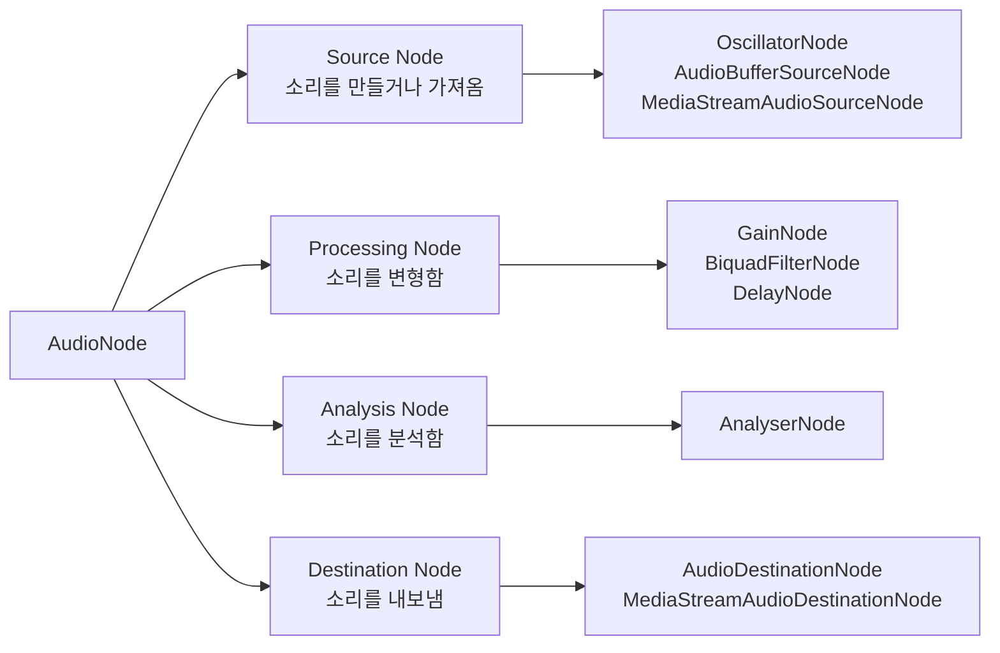

### `connect()`를 실제 코드로 보면

- 아래 코드는 `source -> gain -> filter -> destination` 순서로 `AudioNode`를 연결하는 예시다.
- `source`는 소리를 만든다.
- `gain`은 볼륨을 조절한다.
- `filter`는 특정 주파수 대역을 깎거나 통과시킨다.
- `destination`은 최종 스피커/헤드폰 출력이다.

```js
const audioContext = new AudioContext();

const source = audioContext.createOscillator(); // AudioNode: source
const gain = audioContext.createGain(); // AudioNode: processing
const filter = audioContext.createBiquadFilter(); // AudioNode: processing
const destination = audioContext.destination; // AudioNode: destination

source.type = "sine";
source.frequency.setValueAtTime(440, audioContext.currentTime);

gain.gain.setValueAtTime(0.5, audioContext.currentTime);

filter.type = "lowpass";
filter.frequency.setValueAtTime(1000, audioContext.currentTime);

source.connect(gain);
gain.connect(filter);
filter.connect(destination);

source.start();
source.stop(audioContext.currentTime + 1);
```

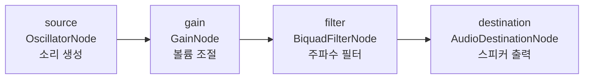

### `gain`의 의미

- `gain`은 오디오 신호의 크기를 곱하는 배율이다.
- 쉽게 말하면 volume을 조절하는 값에 가깝지만, 정확히는 "소리 sample의 amplitude에 곱하는 숫자"다.
- Web Audio API에서는 보통 `GainNode`의 `gain`이라는 `AudioParam`으로 제어한다.
- 기본 감각
  - `gain = 1`: 원래 크기 그대로.
  - `gain = 0`: 무음.
  - `gain = 0.5`: sample amplitude를 절반으로 줄임.
  - `gain = 2`: sample amplitude를 2배로 키움.
- 주의할 점
  - `gain`은 사람이 느끼는 체감 음량과 1:1로 대응하지 않는다.
  - 사람의 loudness 체감은 대체로 logarithmic하게 느껴진다.
  - 그래서 `gain = 0.5`가 "체감상 정확히 절반의 소리"라는 뜻은 아니다.
  - `gain`을 1보다 크게 올리면 clipping/distortion이 생길 수 있다.
- 여기서 `logarithmic`의 의미
  - 한국어로는 보통 "로그적", "로그 함수적"이라고 옮긴다.
  - 핵심은 사람이 소리 크기를 단순한 덧셈 차이보다 "비율"이나 "몇 배 차이"에 가깝게 느낀다는 뜻이다.
  - linear한 감각이면 `0.1 -> 0.2`와 `0.8 -> 0.9`가 비슷한 차이로 느껴져야 한다.
  - logarithmic한 감각에서는 `0.1 -> 0.2`처럼 2배가 되는 변화가 크게 느껴지고, `0.8 -> 0.9`처럼 비율 차이가 작은 변화는 상대적으로 덜 크게 느껴질 수 있다.
  - 그래서 audio UI에서는 내부 `gain` 값을 그대로 slider에 매핑하지 않고, dB나 log curve를 써서 사람이 자연스럽게 느끼는 volume 조절감을 만들기도 한다.
  - 단, 실제 인간의 loudness 지각은 완벽한 수학적 log 함수 하나로만 설명되지는 않는다. 여기서는 "대체로 선형보다는 비율 중심으로 느낀다"는 실무적 의미로 이해하면 된다.
- Web Audio에서 gain이 중요한 이유
  - 전체 master volume을 조절할 수 있다.
  - clip별 volume을 다르게 줄 수 있다.
  - fade-in/fade-out을 만들 수 있다.
  - 여러 소리를 mix할 때 너무 커져서 깨지는 것을 막을 수 있다.
  - effect chain 앞뒤의 입력/출력 레벨을 맞출 수 있다.

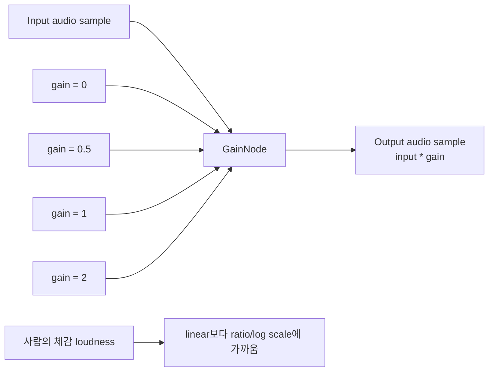

### `gain`을 실제 코드로 보면

- `gain.gain`처럼 같은 단어가 두 번 나와 헷갈릴 수 있다.
- 첫 번째 `gain`은 JavaScript 변수명이다.
- 두 번째 `.gain`은 `GainNode` 안에 들어 있는 `AudioParam` 이름이다.

```js
const audioContext = new AudioContext();

const source = audioContext.createBufferSource();
const gain = audioContext.createGain();

source.buffer = audioBuffer;

gain.gain.setValueAtTime(0.5, audioContext.currentTime);

source.connect(gain);
gain.connect(audioContext.destination);

source.start();
```

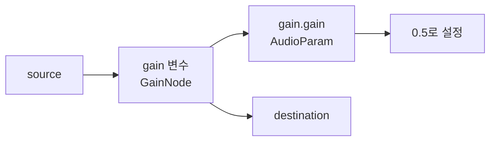

### `scheduling`의 의미

- `scheduling`은 오디오 이벤트를 "지금 즉시 실행"하는 대신, Web Audio의 시간 축에 맞춰 "언제 실행할지 예약"하는 것이다.
- 여기서 시간 기준은 `AudioContext.currentTime`이다.
- Web Audio에서 scheduling하는 대표 대상은 두 가지다.
  - source 재생/정지 시점
  - `AudioParam` 값 변화 시점
- source scheduling 예시
  - `source.start(audioContext.currentTime + 0.1)`
  - 현재 Web Audio clock 기준 0.1초 뒤에 source를 시작한다.
- parameter scheduling 예시
  - `gain.gain.linearRampToValueAtTime(1, audioContext.currentTime + 0.5)`
  - 현재 시점부터 0.5초 뒤까지 gain 값을 부드럽게 1로 올린다.
- `setTimeout()`과의 차이
  - `setTimeout()`은 JavaScript main thread timer다.
  - main thread가 바쁘면 callback 실행이 늦을 수 있다.
  - Web Audio scheduling은 audio clock 기준으로 미리 예약해두기 때문에, 재생 timing이 더 안정적이다.
- 실무적으로 scheduling은 다음 상황에서 중요하다.
  - 여러 clip을 정확한 타이밍에 동시에 시작해야 할 때.
  - metronome, sequencer, drum machine을 만들 때.
  - fade-in/fade-out을 click noise 없이 처리할 때.
  - Dubright ShockWave처럼 timeline 위치에 맞춰 오디오 clip을 재생해야 할 때.

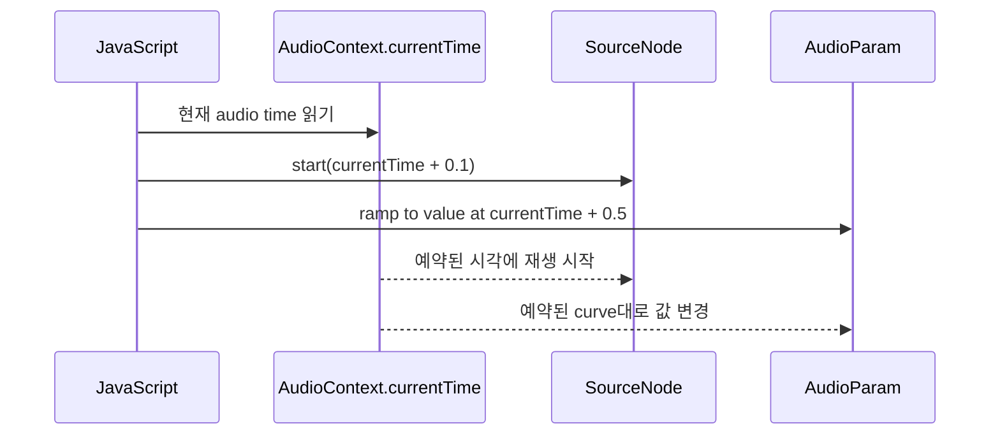

### `scheduling`을 실제 코드로 보면

- 아래 예시는 재생 시작과 fade-out을 모두 미리 예약한다.
- JavaScript가 나중에 다시 정확한 순간에 개입하지 않아도, Web Audio clock이 예약된 이벤트를 처리한다.

```js
const audioContext = new AudioContext();

const source = audioContext.createBufferSource();
const gain = audioContext.createGain();
const now = audioContext.currentTime;

source.buffer = audioBuffer;

source.connect(gain);
gain.connect(audioContext.destination);

gain.gain.setValueAtTime(1, now + 0.1);
gain.gain.linearRampToValueAtTime(0, now + 1.1);

source.start(now + 0.1);
source.stop(now + 1.1);
```

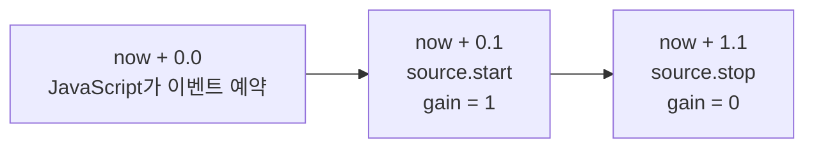

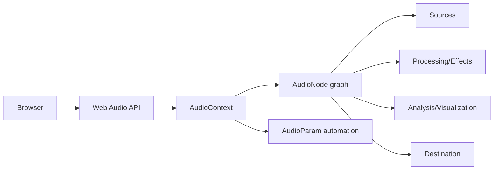

## 2. 왜 중요한가

- 일반적인 `<audio>`/`<video>` element만으로도 재생, 일시정지, seek, volume 조절은 가능하다.
- 하지만 다음 요구사항이 생기면 Web Audio API가 필요해진다.
  - 여러 음원을 동시에 섞어야 한다.
  - gain, filter, compressor, delay, reverb 같은 effect chain이 필요하다.
  - waveform, spectrum, meter 같은 실시간 시각화가 필요하다.
  - 음악 sequencer, drum machine, metronome처럼 정확한 timing이 중요하다.
  - 마이크 입력을 분석하거나 가공해야 한다.
  - WebRTC, MediaRecorder, Canvas와 오디오를 연결해야 한다.
  - 게임/인터랙티브 UI처럼 낮은 latency의 음향 반응이 필요하다.
- MDN은 Web Audio API가 audio source 선택, effect 추가, visualization, spatial effect 등을 제공한다고 설명한다.
- W3C 사양은 이 API의 기본 패러다임을 `AudioNode`들이 연결된 audio routing graph로 정의한다.

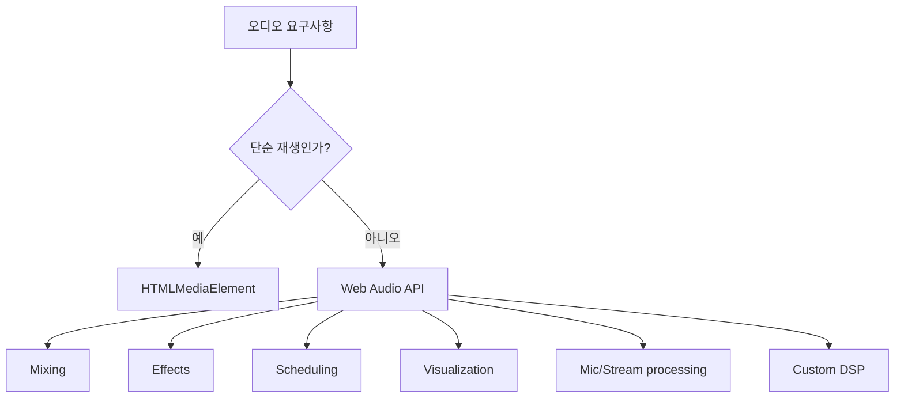

## 3. 핵심 구성 요소

- `AudioContext`
  - Web Audio 작업의 root object다.
  - `AudioNode` 생성, audio graph 실행, audio decoding을 관리한다.
  - `currentTime`이라는 audio clock을 제공한다.
  - MDN은 매번 새로 만들기보다 하나의 `AudioContext`를 재사용하는 방식을 권장한다.
- `OfflineAudioContext`
  - speaker로 실시간 출력하지 않고, 빠르게 오디오를 렌더링해 `AudioBuffer`로 얻는 context다.
  - export, preview rendering, offline normalization, effect baking 같은 작업에 적합하다.
- `AudioNode`
  - Web Audio graph의 단위 module이다.
  - source, effect, analyser, channel splitter/merger, destination 모두 `AudioNode` 모델에 속한다.
  - `connect()`로 다른 node와 연결하고, `disconnect()`로 해제한다.
- `AudioParam`
  - `GainNode.gain`, `BiquadFilterNode.frequency`, `DelayNode.delayTime` 같은 node parameter다.
  - 단순히 `.value`를 바꿀 수도 있고, `setValueAtTime()`, `linearRampToValueAtTime()` 등으로 정확한 시간에 변화하도록 예약할 수도 있다.
- Source node
  - `OscillatorNode`: sine/square/triangle/sawtooth 같은 주기파 생성.
  - `AudioBufferSourceNode`: memory 안의 `AudioBuffer`를 재생.
  - `MediaElementAudioSourceNode`: `<audio>`/`<video>` element를 graph 입력으로 사용.
  - `MediaStreamAudioSourceNode`: microphone, webcam, remote stream 같은 `MediaStream`을 입력으로 사용.
  - `ConstantSourceNode`: 일정한 값을 audio-rate signal처럼 공급.
- Processing/effect node
  - `GainNode`: volume/gain 조절.
  - `BiquadFilterNode`: lowpass, highpass, peaking, notch 등 기본 filter.
  - `DelayNode`: 지연.
  - `DynamicsCompressorNode`: compressor/limiter 성격의 dynamic range 제어.
  - `ConvolverNode`: impulse response 기반 convolution, reverb 구현에 자주 사용.
  - `StereoPannerNode`, `PannerNode`: 좌우/3D 공간화.
  - `WaveShaperNode`: distortion/waveshaping.
  - `AnalyserNode`: waveform/frequency data 추출.
- Destination node
  - `AudioDestinationNode`: 최종 speaker/headphone 출력.
  - `MediaStreamAudioDestinationNode`: 처리된 audio graph 출력을 `MediaStream`으로 만들어 녹음/전송에 사용.

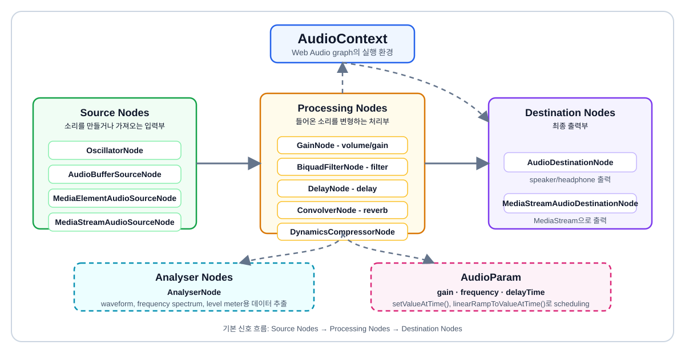

## 4. 오디오 그래프와 신호 흐름

- Web Audio API의 가장 중요한 사고방식은 "오디오는 node 사이를 흐르는 signal"이라는 점이다.
- 일반적인 흐름은 다음과 같다.
  - source가 sample stream을 만든다.
  - effect/processing node가 signal을 바꾸거나 섞는다.
  - analyser node가 signal을 읽어 시각화용 데이터를 만든다.
  - destination node가 speaker나 stream으로 내보낸다.
- `AudioNode.connect(otherNode)`는 audio signal을 다음 node의 input으로 보낸다.
- 하나의 node output을 여러 node input으로 보낼 수 있다.
  - 예: 하나의 source를 speaker로 보내면서 동시에 `AnalyserNode`로 보내기.
- 여러 node output을 하나의 input으로 보낼 수도 있다.
  - 예: 여러 clip/player를 하나의 master gain으로 모으기.
- 이 구조 때문에 Web Audio API는 fan-out, fan-in, parallel processing, serial effect chain을 모두 표현할 수 있다.
- 모든 graph가 반드시 speaker로 연결될 필요는 없다.
  - 분석만 하거나, `MediaStreamAudioDestinationNode`로 보내거나, offline rendering만 할 수 있다.

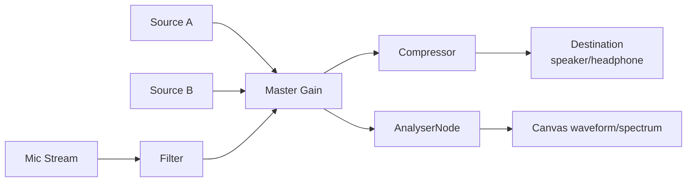

## 5. 시간 모델과 스케줄링

- Web Audio API는 browser main thread의 `setTimeout()`/`setInterval()` 시간 감각과 별개의 audio clock을 가진다.
- `AudioContext.currentTime`
  - context가 실행된 뒤 흐른 시간을 초 단위로 나타낸다.
  - source 시작, source 정지, parameter automation의 기준 시간이다.
- `AudioScheduledSourceNode`
  - `OscillatorNode`, `AudioBufferSourceNode` 같은 scheduled source 계열의 공통 부모 interface다.
  - `start(when)`과 `stop(when)`으로 시작/정지 시간을 예약한다.
- `AudioParam` automation
  - `setValueAtTime(value, time)`: 특정 시각에 값을 즉시 변경.
  - `linearRampToValueAtTime(value, endTime)`: 선형 ramp.
  - `exponentialRampToValueAtTime(value, endTime)`: 지수 ramp.
  - `setTargetAtTime(target, startTime, timeConstant)`: 목표값으로 부드럽게 접근.
  - `setValueCurveAtTime(values, startTime, duration)`: 배열 curve를 시간 구간에 매핑.
  - `cancelScheduledValues(time)`: 특정 시점 이후 예약 제거.
  - `cancelAndHoldAtTime(time)`: 예약을 취소하되 해당 시점 값을 유지.
- 중요한 원칙
  - UI event는 "언제 예약할지"를 결정하는 trigger로 쓰고, 실제 재생 timing은 `currentTime` 기반으로 예약해야 한다.
  - 음악 sequencer, metronome, clip launcher는 JS timer만 믿으면 jitter가 생기기 쉽다.
  - 보통은 약간 미래 시점에 audio event를 미리 예약하는 lookahead 전략을 쓴다.

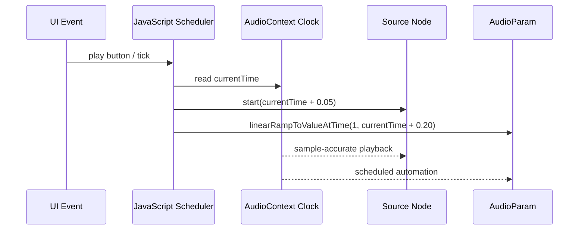

## 6. AudioBuffer, 디코딩, 파일 재생

- `AudioBuffer`
  - 메모리 안에 저장된 PCM audio data다.
  - channel별 sample data를 가진다.
  - 짧은 sound effect, sample, clip, waveform 분석 대상에 적합하다.
- 일반적인 decode flow
  - `fetch(url)`로 파일을 가져온다.
  - `response.arrayBuffer()`로 binary data를 얻는다.
  - `audioContext.decodeAudioData(arrayBuffer)`로 browser가 decode한다.
  - 결과로 받은 `AudioBuffer`를 `AudioBufferSourceNode`에 넣어 재생한다.
- `AudioBufferSourceNode`
  - `buffer` property에 `AudioBuffer`를 넣는다.
  - `start(when, offset, duration)`으로 특정 시각, 특정 offset, 특정 길이만 재생할 수 있다.
  - one-shot source다. 한 번 `start()`한 node를 다시 재사용하는 방식이 아니라, 재생할 때마다 새 source node를 만드는 모델로 보는 것이 안전하다.
- 파일 크기와 전략
  - 짧고 반복 재생되는 효과음/clip은 `AudioBuffer` caching이 유리하다.
  - 긴 음악/영상 audio track은 `<audio>`/`<video>` element를 `MediaElementAudioSourceNode`로 연결하는 방식이 더 자연스러울 수 있다.
  - waveform 분석이나 clip 단위 편집이 필요하면 decode된 sample 접근이 유용하다.

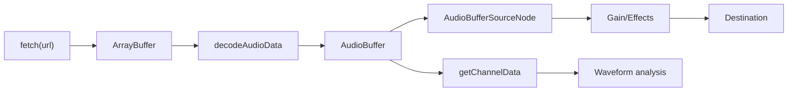

### 짧은 파일 재생 예시

- 아래 코드는 가장 기본적인 decode/play 흐름이다.
- 실무에서는 context resume, error handling, cache, cleanup을 함께 넣어야 한다.

```js
const audioContext = new AudioContext();

async function loadBuffer(url) {
  const response = await fetch(url);
  const arrayBuffer = await response.arrayBuffer();
  return audioContext.decodeAudioData(arrayBuffer);
}

function playBuffer(buffer, when = audioContext.currentTime) {
  const source = audioContext.createBufferSource();
  const gain = audioContext.createGain();

  source.buffer = buffer;
  gain.gain.setValueAtTime(0.8, when);

  source.connect(gain);
  gain.connect(audioContext.destination);
  source.start(when);
}
```

## 7. 입력, 녹음, MediaStream 연동

- Web Audio API는 파일 재생뿐 아니라 live input도 graph에 넣을 수 있다.
- microphone 입력의 기본 흐름
  - `navigator.mediaDevices.getUserMedia({ audio: true })`로 사용자의 microphone 권한을 요청한다.
  - 받은 `MediaStream`을 `audioContext.createMediaStreamSource(stream)`에 넣는다.
  - source를 `AnalyserNode`, effect node, destination 등에 연결한다.
- 녹음과의 관계
  - 원본 `MediaStream`은 `MediaRecorder`로 녹음할 수 있다.
  - Web Audio에서 처리한 결과를 녹음하려면 `createMediaStreamDestination()`으로 graph output을 stream으로 바꾼 뒤 `MediaRecorder`에 넘기는 패턴을 쓴다.
- 보안/권한 제약
  - microphone은 사용자 권한이 필요하다.
  - `getUserMedia()`는 secure context 조건의 영향을 받는다.
  - browser autoplay 정책 때문에 output이 있는 graph는 사용자 gesture 이후 `AudioContext.resume()`이 필요할 수 있다.
- 실무 주의
  - microphone stream track은 사용이 끝나면 `track.stop()`으로 정리한다.
  - `MediaStreamAudioSourceNode`만 disconnect해도 실제 microphone capture가 끝나는 것은 아니므로 stream track lifecycle을 따로 관리해야 한다.

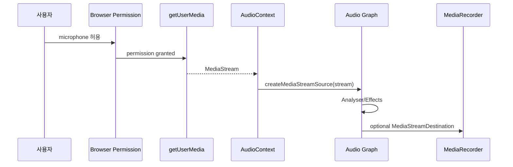

### microphone 분석 예시

- 이 패턴은 waveform meter, voice activity detection, 녹음 중 level 표시의 기본이다.

```js
const audioContext = new AudioContext();
const stream = await navigator.mediaDevices.getUserMedia({ audio: true });

const source = audioContext.createMediaStreamSource(stream);
const analyser = audioContext.createAnalyser();
analyser.fftSize = 2048;

source.connect(analyser);

const data = new Float32Array(analyser.fftSize);
analyser.getFloatTimeDomainData(data);
```

## 8. 분석과 시각화

- `AnalyserNode`는 audio signal을 통과시키면서 time-domain/frequency-domain 데이터를 읽을 수 있게 해준다.
- time-domain data
  - waveform, level meter, clipping 감지에 사용한다.
  - `getFloatTimeDomainData()` 또는 `getByteTimeDomainData()`로 읽는다.
- frequency-domain data
  - spectrum analyzer, EQ visualizer, beat/energy 분석에 사용한다.
  - `getFloatFrequencyData()` 또는 `getByteFrequencyData()`로 읽는다.
- `fftSize`
  - FFT 분석 window 크기다.
  - 클수록 frequency resolution은 좋아지지만 시간 반응은 둔해질 수 있다.
- `smoothingTimeConstant`
  - frequency data가 급격히 변하지 않도록 smoothing을 적용한다.
- Canvas와의 관계
  - Web Audio가 sample/frequency data를 제공하고, Canvas/SVG/WebGL은 그 데이터를 시각적으로 그린다.
  - Web Audio API 자체가 waveform UI를 그려주는 것은 아니다.

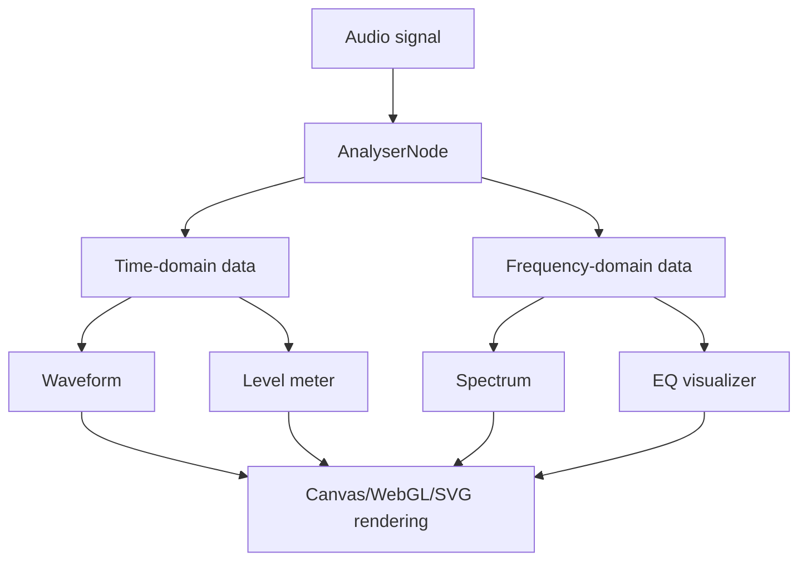

## 9. AudioWorklet와 커스텀 DSP

- `AudioWorklet`은 JavaScript 또는 WebAssembly로 custom audio processing node를 만들기 위한 Web Audio 기능이다.
- 기존 `ScriptProcessorNode`는 main thread에서 audio callback을 실행하기 때문에 성능과 안정성 문제가 있었고 deprecated 상태다.
- `AudioWorklet` 모델
  - main thread에서 `audioContext.audioWorklet.addModule()`로 processor module을 등록한다.
  - `AudioWorkletProcessor`는 audio rendering thread 쪽의 `AudioWorkletGlobalScope`에서 실행된다.
  - main thread에서는 `AudioWorkletNode`를 만들어 graph에 연결한다.
  - `MessagePort`를 통해 main thread와 processor가 control message를 주고받을 수 있다.
- 적합한 용도
  - custom synth oscillator
  - custom filter/effect
  - low-latency voice processing
  - sample-level analysis
  - WebAssembly DSP engine 연결
- 주의점
  - audio thread에서는 blocking 작업, 무거운 allocation, network 요청 같은 일을 피해야 한다.
  - UI 상태와 직접 공유하지 말고 message passing이나 `AudioParam`을 통해 제어해야 한다.
  - secure context 요구사항을 고려해야 한다.

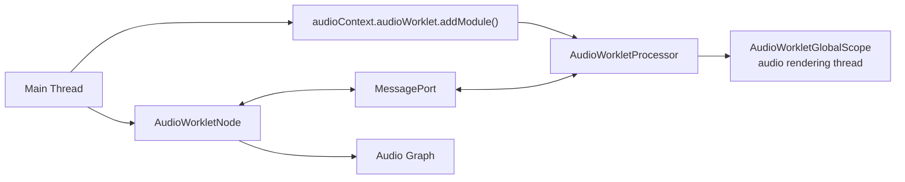

### AudioWorklet 구조 예시

- 실제 프로젝트에서는 processor 파일을 별도 module로 두고 build/dev server가 해당 파일을 제공해야 한다.

```js
// main thread
await audioContext.audioWorklet.addModule("/processors/gain-processor.js");

const node = new AudioWorkletNode(audioContext, "gain-processor", {
  parameterData: { gain: 0.5 },
});

source.connect(node);
node.connect(audioContext.destination);
```

```js
// /processors/gain-processor.js
class GainProcessor extends AudioWorkletProcessor {
  static get parameterDescriptors() {
    return [{ name: "gain", defaultValue: 1, minValue: 0, maxValue: 2 }];
  }

  process(inputs, outputs, parameters) {
    const input = inputs[0];
    const output = outputs[0];
    const gain = parameters.gain;

    for (let channel = 0; channel < output.length; channel += 1) {
      const inputChannel = input[channel] || [];
      const outputChannel = output[channel];

      for (let i = 0; i < outputChannel.length; i += 1) {
        const value = inputChannel[i] || 0;
        outputChannel[i] = value * (gain.length > 1 ? gain[i] : gain[0]);
      }
    }

    return true;
  }
}

registerProcessor("gain-processor", GainProcessor);
```

## 10. lifecycle, autoplay, 성능

- `AudioContext` lifecycle
  - `suspended`: 시간이 멈춘 상태. autoplay 정책이나 명시적 suspend로 발생할 수 있다.
  - `running`: audio graph가 처리되는 상태.
  - `closed`: context가 닫혀 system audio resource가 해제된 상태.
- 사용자 gesture
  - 많은 브라우저는 사용자 gesture 없이 audio output을 시작하지 못하게 제한한다.
  - play button click 같은 event 안에서 `audioContext.resume()`을 호출하는 흐름이 필요하다.
- context 재사용
  - 여러 source가 있어도 하나의 `AudioContext` 안에서 graph를 구성하는 편이 일반적으로 안정적이다.
  - 너무 많은 context를 만들면 browser/mobile resource 제한, latency 편차, cleanup 문제가 커질 수 있다.
- node cleanup
  - 더 이상 쓰지 않는 node는 `disconnect()`한다.
  - source node의 `onended`에서 연결을 끊거나 참조를 제거한다.
  - library wrapper를 쓰는 경우 wrapper의 `dispose()`/`disconnect()` 규칙을 따른다.
- scheduling 성능
  - audio event는 `currentTime` 기준으로 약간 미래에 예약한다.
  - 매 animation frame마다 node를 새로 만들기보다, 필요한 시점에만 만들고 재사용 가능한 buffer/data는 cache한다.
- main thread 부하
  - main thread가 막히면 UI와 scheduling 코드가 늦게 실행될 수 있다.
  - 이미 예약된 audio event는 audio thread에서 더 안정적으로 처리되지만, 너무 늦게 예약한 event는 놓칠 수 있다.
  - custom DSP는 `AudioWorklet`으로 분리하는 편이 적합하다.

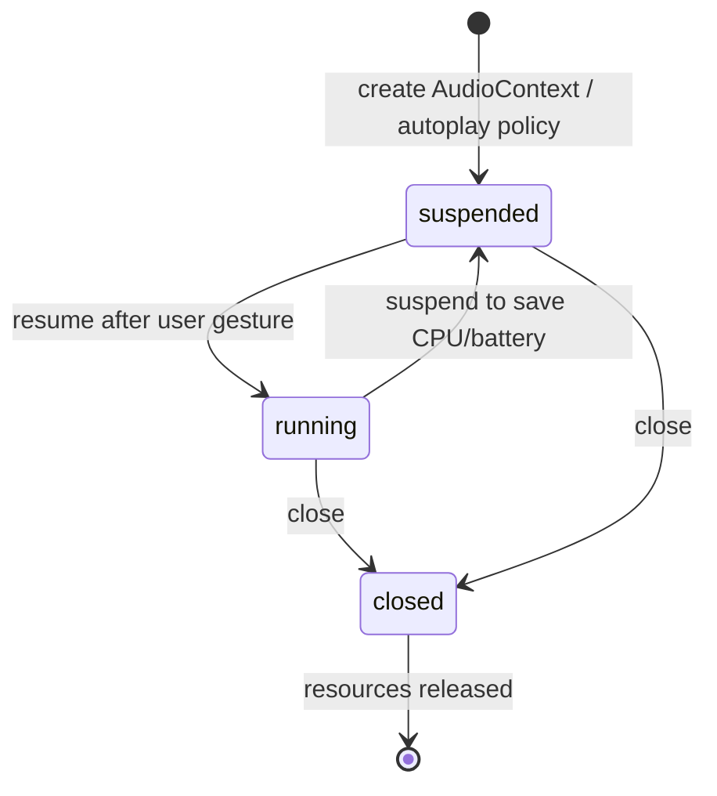

## 11. Tone.js, Dubright ShockWave와의 연결

- Tone.js와 Web Audio API
  - Tone.js는 Web Audio API 위에 만들어진 음악/오디오 프레임워크다.
  - `AudioContext`, `AudioNode`, `AudioParam`을 직접 쓰는 대신 `Tone.Player`, `Tone.Gain`, `Tone.Reverb`, `Tone.Transport` 같은 상위 API를 제공한다.
  - 그래도 내부적으로는 browser의 Web Audio graph가 만들어지므로 context lifecycle, scheduling, cleanup 원칙은 그대로 중요하다.
- `dubright_front` ShockWave와 Web Audio API
  - `AudioContextManager.js`
    - 공유 `AudioContext`를 관리한다.
    - Web Audio API의 "context 재사용" 원칙과 맞닿아 있다.
  - `ShockWave.js`
    - `fetch -> arrayBuffer -> decodeAudioData -> AudioBuffer` 흐름으로 audio file을 decode/cache한다.
    - decoded sample을 `getChannelData()`로 읽어 waveform drawing에 사용한다.
    - playback은 Tone.js `Tone.Player`를 통해 실행하지만, 본질적으로 Web Audio source/effect/destination graph를 쓰는 구조다.
    - `Tone.now() + scheduleDelay`는 Web Audio clock 기반 scheduling 개념과 연결된다.
  - `ShockWaveMic.js`
    - `getUserMedia()`로 microphone stream을 얻는다.
    - `createMediaStreamSource()`와 `AnalyserNode`로 입력 분석을 구성한다.
    - `MediaRecorder`로 녹음 chunk를 수집한다.
- 결론적으로 Dubright의 ShockWave를 이해하려면 다음 순서가 가장 좋다.
  - Web Audio API의 context/node/param/clock 개념을 먼저 이해한다.
  - 그 위에 Tone.js가 어떤 wrapper를 제공하는지 본다.
  - 마지막으로 ShockWave가 audio buffer cache, Tone player, effect chain, waveform rendering을 어떻게 조합했는지 본다.

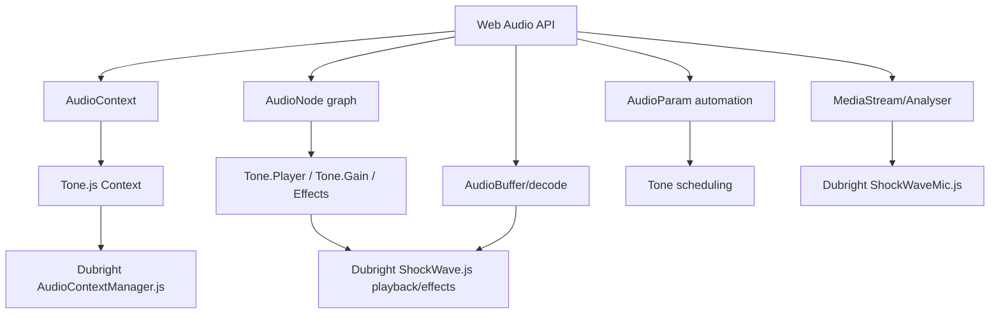

## 12. 실무 예시 패턴

- 간단한 oscillator + gain
  - 사용자가 버튼을 누른 뒤 context를 resume한다.
  - oscillator source를 만든다.
  - gain node로 volume을 조절한다.
  - destination에 연결한다.
  - `start()`와 `stop()`을 audio clock 기준으로 예약한다.

```js
const audioContext = new AudioContext();

async function beep() {
  await audioContext.resume();

  const oscillator = audioContext.createOscillator();
  const gain = audioContext.createGain();
  const now = audioContext.currentTime;

  oscillator.type = "sine";
  oscillator.frequency.setValueAtTime(440, now);

  gain.gain.setValueAtTime(0, now);
  gain.gain.linearRampToValueAtTime(0.5, now + 0.02);
  gain.gain.exponentialRampToValueAtTime(0.001, now + 0.5);

  oscillator.connect(gain);
  gain.connect(audioContext.destination);

  oscillator.start(now);
  oscillator.stop(now + 0.55);
}
```

- 실무적으로 이 패턴은 button click, notification sound, metronome tick의 최소 모델이다.
- `AudioParam` ramp를 쓰면 click/pop noise를 줄이는 fade-in/fade-out을 만들 수 있다.

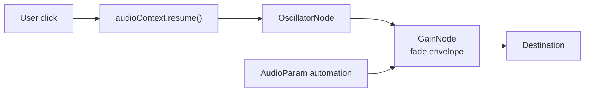

## 13. 빠른 복습

- `AudioContext`
  - Web Audio graph의 실행 환경.
  - 하나 만들고 재사용하는 전략이 일반적으로 좋다.
- `AudioNode`
  - source, effect, analyser, destination을 모두 표현하는 graph node.
- `AudioParam`
  - node의 parameter를 audio clock에 맞춰 제어하는 값.
- `gain`
  - 오디오 sample amplitude에 곱하는 배율.
  - `1`은 원래 크기, `0`은 무음, `0.5`는 amplitude 절반, `2`는 amplitude 2배를 뜻한다.
- `scheduling`
  - `AudioContext.currentTime` 기준으로 source 시작/정지나 `AudioParam` 변화를 미리 예약하는 것.
  - `setTimeout()`보다 audio timing에 적합하다.
- `AudioBuffer`
  - decode된 PCM audio data.
  - clip/sample/waveform 분석에 적합하다.
- `AudioBufferSourceNode`
  - `AudioBuffer`를 재생하는 source node.
  - 재생마다 새 node를 만드는 one-shot 모델로 이해하는 것이 안전하다.
- `MediaStreamAudioSourceNode`
  - microphone/WebRTC stream을 Web Audio graph에 넣는 source node.
- `AnalyserNode`
  - waveform/frequency data를 읽어 시각화와 분석에 사용한다.
- `AudioWorklet`
  - custom DSP를 main thread 밖에서 낮은 latency로 처리하기 위한 구조.
- `AudioDestinationNode`
  - speaker/headphone으로 나가는 최종 output.
- `MediaStreamAudioDestinationNode`
  - 처리된 audio graph 출력을 녹음/전송 가능한 `MediaStream`으로 바꾸는 output.

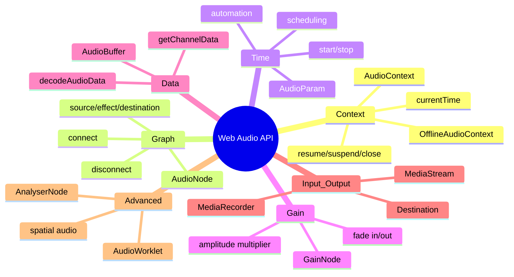

## 참고 링크

- [MDN - Web Audio API](https://developer.mozilla.org/en-US/docs/Web/API/Web_Audio_API)
- [MDN - AudioContext](https://developer.mozilla.org/en-US/docs/Web/API/AudioContext)
- [MDN - AudioNode](https://developer.mozilla.org/en-US/docs/Web/API/AudioNode)
- [MDN - AudioParam](https://developer.mozilla.org/en-US/docs/Web/API/AudioParam)
- [MDN - AudioBuffer](https://developer.mozilla.org/en-US/docs/Web/API/AudioBuffer)
- [MDN - BaseAudioContext.decodeAudioData()](https://developer.mozilla.org/en-US/docs/Web/API/BaseAudioContext/decodeAudioData)
- [MDN - AudioBufferSourceNode](https://developer.mozilla.org/en-US/docs/Web/API/AudioBufferSourceNode)
- [MDN - AudioScheduledSourceNode](https://developer.mozilla.org/en-US/docs/Web/API/AudioScheduledSourceNode)
- [MDN - GainNode](https://developer.mozilla.org/en-US/docs/Web/API/GainNode)
- [MDN - AnalyserNode](https://developer.mozilla.org/en-US/docs/Web/API/AnalyserNode)
- [MDN - AudioWorklet](https://developer.mozilla.org/en-US/docs/Web/API/AudioWorklet)
- [MDN - AudioWorkletNode](https://developer.mozilla.org/en-US/docs/Web/API/AudioWorkletNode)
- [MDN - MediaDevices.getUserMedia()](https://developer.mozilla.org/en-US/docs/Web/API/MediaDevices/getUserMedia)
- [MDN - MediaStreamAudioSourceNode](https://developer.mozilla.org/en-US/docs/Web/API/MediaStreamAudioSourceNode)
- [MDN - MediaStreamAudioDestinationNode](https://developer.mozilla.org/en-US/docs/Web/API/MediaStreamAudioDestinationNode)
- [W3C - Web Audio API](https://www.w3.org/TR/webaudio/)
- [Web Audio API Editor's Draft](https://webaudio.github.io/web-audio-api/)
- [Tone.js 문서](https://tonejs.github.io/docs/)
- [로컬 노트 - Tone.js](/Users/nes0903/Documents/study/tone-js/tone-js.md)
- [로컬 노트 - Dubright ShockWave](/Users/nes0903/Documents/study/dubright-shockwave/dubright-shockwave.md)
- [Dubright source - AudioContextManager.js](/Users/nes0903/Documents/dobedub/dubright_front/src/components/js/AudioContextManager.js)
- [Dubright source - ShockWave.js](/Users/nes0903/Documents/dobedub/dubright_front/src/components/js/ShockWave.js)
- [Dubright source - ShockWaveMic.js](/Users/nes0903/Documents/dobedub/dubright_front/src/components/js/ShockWaveMic.js)
