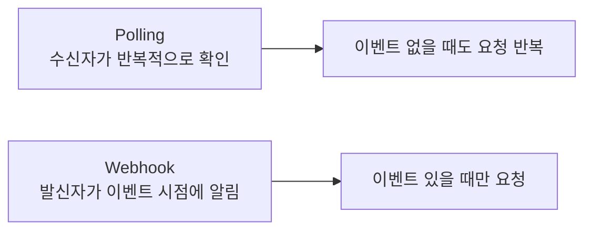
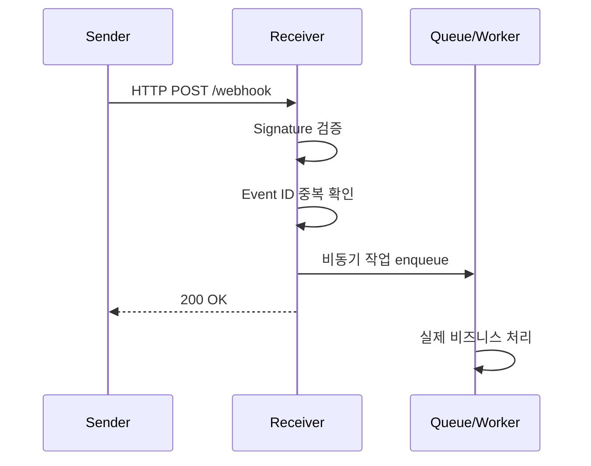

# Webhook 상세 정리

작성 기준일: 2026-04-13  
주요 참고:

- GitHub Docs, `About webhooks`
- GitHub Docs, `Best practices for using webhooks`
- Stripe Docs, `Handle payment events with webhooks`
- Stripe Docs, `Resolve webhook signature verification errors`
- Stripe Docs, `Process undelivered webhook events`

## 1. 한 줄 요약

`Webhook`은 어떤 시스템에서 이벤트가 발생했을 때, 그 사실을 다른 시스템의 HTTP endpoint로 즉시 알려주는 방식이다.

조금 더 정확히 말하면:

- `A 시스템`에서 이벤트 발생
- `A 시스템`이 미리 등록된 URL로 HTTP 요청 전송
- `B 시스템`이 그 요청을 받아 처리

하는 구조다.

즉, webhook은 "상대가 알아서 와서 물어보게 두는 방식"이 아니라, "이벤트가 생기면 내가 먼저 알려주는 방식"이다.

---

## 2. 왜 이름이 webhook인가

이름을 풀면:

- `web`
- `hook`

이다.

여기서 `hook`은 소프트웨어에서 자주 쓰는 의미로:

- 특정 이벤트 지점에 걸어두는 연결점
- 어떤 일이 일어났을 때 자동으로 호출되는 확장 포인트

를 뜻한다.

그래서 webhook은:

- 웹(HTTP) 기반으로
- 이벤트에 걸어둔 hook

정도로 이해하면 된다.

---

## 3. 가장 쉬운 예시

예를 들어 GitHub 저장소에 push가 일어났다고 하자.

이때 GitHub에 webhook URL을 등록해 두면:

1. 누군가 push
2. GitHub가 그 이벤트를 감지
3. GitHub가 네 서버의 `/github/webhook` 같은 URL로 POST 요청 전송
4. 네 서버는 payload를 읽고
5. 배포, Slack 알림, CI 트리거 같은 후속 작업 수행

이 흐름이 된다.

즉:

- GitHub는 `sender`
- 네 서버는 `receiver`

다.

---

## 4. Webhook가 필요한 이유

Webhook가 필요한 핵심 이유는 `이벤트 기반 통합` 때문이다.

서로 다른 시스템이 연결될 때 흔한 요구는 이렇다.

- 주문이 생성되면 물류 시스템에 알려야 한다
- 결제가 성공하면 내부 DB를 갱신해야 한다
- Git push가 일어나면 CI를 시작해야 한다
- 새 폼 제출이 오면 CRM에 저장해야 한다
- Slack 메시지가 오면 봇이 반응해야 한다

이런 상황에서 webhook은 매우 자연스럽다.

이유:

- 이벤트가 생긴 시점에 바로 전달 가능
- polling보다 낭비가 적음
- 느슨한 결합(loose coupling)을 만들기 쉬움

---

## 5. Polling과의 차이

Webhook를 이해하려면 `polling`과 비교해야 한다.

### 5.1 Polling이란

Polling은 수신자가 주기적으로 질문하는 방식이다.

예:

- "새 이벤트 있나요?"
- 5초 뒤 다시
- "새 이벤트 있나요?"
- 또 5초 뒤 다시

즉 수신자가 계속 체크한다.

### 5.2 Webhook란

Webhook는 발신자가 이벤트가 생길 때 밀어넣는 방식이다.

즉:

- "이벤트 생겼다, 지금 알려준다"

가 된다.

### 5.3 핵심 비교



### 5.4 Polling의 장점

- 구현이 단순한 경우가 많다
- 발신자 시스템이 webhook 기능을 제공하지 않아도 가능하다
- 수신자가 제어권을 많이 가진다

### 5.5 Polling의 단점

- 이벤트가 없을 때도 요청 낭비
- 지연(latency)이 polling interval에 묶인다
- 대규모 시스템에선 비효율적일 수 있다

### 5.6 Webhook의 장점

- 거의 실시간으로 전달 가능
- 불필요한 요청이 적다
- 이벤트 중심 아키텍처에 잘 맞는다

### 5.7 Webhook의 단점

- receiver endpoint를 안정적으로 운영해야 한다
- 보안 검증을 잘못하면 위험하다
- 재시도, 중복, 순서 뒤집힘을 고려해야 한다
- 방화벽/NAT/로컬 개발 환경에서 다루기 까다로울 수 있다

---

## 6. Webhook의 기본 구조

Webhook는 단순해 보이지만, 실제로는 몇 가지 구성요소가 있다.

### 6.1 Sender

이벤트를 발생시키는 쪽이다.

예:

- GitHub
- Stripe
- Shopify
- Slack
- Twilio
- 내부 주문 시스템

### 6.2 Event

Sender가 "전달할 가치가 있다"고 판단하는 사건이다.

예:

- `push`
- `payment_intent.succeeded`
- `invoice.paid`
- `issue.opened`
- `user.created`

### 6.3 Endpoint URL

Receiver가 제공하는 HTTP endpoint다.

예:

- `https://example.com/webhooks/github`
- `https://api.example.com/integrations/stripe`

### 6.4 Payload

이벤트 상세 데이터를 담은 요청 본문이다.

보통 JSON이 많다.

예:

- event type
- event id
- timestamp
- object id
- 관련 리소스 데이터

### 6.5 Headers

발신자는 요청 헤더에도 중요한 정보를 넣는다.

예:

- signature
- event id
- event type
- delivery id
- retry count

### 6.6 Receiver

요청을 받고 검증하고 처리하는 시스템이다.

이 receiver가 단순히 business logic만 처리하면 안 되고, 아래를 같이 책임져야 한다.

- 요청 진위 검증
- 빠른 ACK 응답
- 비동기 후속 처리
- 중복 방지
- 로그/관측성

---

## 7. 전형적인 요청/응답 흐름

Webhook는 보통 아래 순서로 동작한다.



이 흐름이 중요하다.

많은 초보 구현이 실수하는 부분은:

- webhook 요청 처리 안에서
- 오래 걸리는 비즈니스 로직을 바로 수행하려는 것

이다.

실전에서는 거의 항상:

- `빠르게 검증`
- `빠르게 저장/큐잉`
- `빠르게 2xx 응답`
- `실제 처리는 백그라운드`

가 권장된다.

---

## 8. Webhook는 사실상 HTTP POST 기반 이벤트 알림이다

Webhook를 너무 거창하게 생각할 필요는 없다.

대부분 webhook는 다음에 불과하다.

- 특정 URL로
- JSON body를 담은
- POST 요청을 보내는 것

하지만 실전 난이도는 이 HTTP POST 자체가 아니라:

- 보안
- 신뢰성
- 재처리
- 운영

쪽에서 생긴다.

즉 webhook의 본질은 단순하지만, production-grade webhook 시스템은 단순하지 않다.

---

## 9. Webhook payload에는 보통 무엇이 들어가나

서비스마다 다르지만 공통 패턴이 있다.

### 9.1 Event ID

이벤트를 고유하게 식별하는 ID다.

이 값은 매우 중요하다.

왜냐하면:

- 중복 수신 방지
- 재시도 식별
- 로그 연계

에 쓰이기 때문이다.

### 9.2 Event Type

무슨 사건인지 나타낸다.

예:

- `push`
- `invoice.paid`
- `customer.created`

### 9.3 Created Timestamp

이벤트 생성 시각이다.

### 9.4 Resource ID

실제 주체 객체의 ID다.

예:

- order id
- payment id
- repository id

### 9.5 Snapshot or reference

payload는 보통 두 종류 중 하나다.

1. `snapshot형`
2. `reference형`

#### snapshot형

리소스의 전체 또는 많은 부분이 payload에 포함된다.

장점:

- receiver가 추가 API 호출 없이 처리 가능

단점:

- payload가 커짐
- 오래된 snapshot일 가능성

#### reference형

객체 ID만 전달하고 receiver가 sender API를 다시 조회한다.

장점:

- payload 작음
- 최신 상태 재조회 가능

단점:

- 추가 API 호출 필요
- sender API 가용성에 의존

실제 서비스들은 두 방식을 적절히 섞는다.

---

## 10. Webhook를 사용하는 대표 사례

### 10.1 결제 시스템

Stripe 같은 서비스가 대표적이다.

예:

- 결제 성공
- 환불 생성
- 구독 만료
- 인보이스 결제 완료

여기서 webhook는 사실상 필수다.

왜냐하면 사용자가 브라우저 창을 닫아도 결제 상태 변화는 계속 일어나기 때문이다.

### 10.2 코드 호스팅 / DevOps

GitHub, GitLab, Bitbucket 등에서 흔하다.

예:

- push
- PR opened
- issue commented
- release published

### 10.3 SaaS 간 연동

예:

- 폼 서비스 -> CRM
- 쇼핑몰 -> ERP
- 협업 도구 -> 알림 시스템

### 10.4 내부 시스템 이벤트 통합

외부 SaaS가 아니어도 내부 서비스 간 통합에 webhook 패턴을 쓸 수 있다.

예:

- 주문 서비스 -> 재고 서비스
- 회원 서비스 -> 메일 발송기

다만 내부 시스템에서는 메시지 큐가 더 적합한 경우도 많다.

---

## 11. Webhook 구현에서 가장 중요한 설계 포인트

아래 항목들은 webhook를 "대충 받는" 수준에서 "운영 가능한 시스템"으로 올리는 데 핵심이다.

### 11.1 Receiver는 빠르게 응답해야 한다

GitHub docs는 `10초 이내 응답`을 권장한다.

이 말의 의미:

- sender는 receiver가 오래 붙잡고 있기를 기대하지 않는다
- 응답이 늦으면 timeout/retry로 이어질 수 있다

따라서 webhook endpoint는:

- 느린 DB 작업
- 외부 API 연쇄 호출
- 대량 파일 처리

를 요청-응답 경로 안에서 직접 오래 수행하면 안 된다.

### 11.2 최소 이벤트만 구독해야 한다

GitHub docs는 필요한 최소 이벤트만 구독하라고 권장한다.

이유:

- receiver 부하 감소
- 노이즈 감소
- 보안 표면 감소
- 운영 단순화

Webhook는 "일단 다 받자"가 아니라 "진짜 필요한 것만 받자"가 맞다.

### 11.3 Event filtering이 필요하다

payload를 받았다고 곧바로 처리하지 말고:

- event type
- action
- object kind

를 먼저 분기해야 한다.

예:

- GitHub의 경우 event type + action
- Stripe의 경우 event type

을 기준으로 라우팅한다.

---

## 12. 보안: Webhook에서 제일 중요한 부분

Webhook receiver는 인터넷에 노출되는 경우가 많다.

즉, 아무나 그 URL에 요청을 보낼 수 있다.

그래서 `이 요청이 진짜 sender가 보낸 것인지` 검증하는 것이 가장 중요하다.

### 12.1 HTTPS는 기본이다

GitHub docs는 HTTPS + SSL verification을 권장한다.

평문 HTTP는 다음 문제가 있다.

- 도청
- 변조
- 중간자 공격

즉 production webhook는 기본적으로 HTTPS여야 한다.

### 12.2 Secret 기반 서명 검증

가장 널리 쓰이는 패턴이다.

흐름:

1. sender와 receiver가 shared secret을 가진다
2. sender는 payload 원문으로 HMAC 등을 계산한다
3. signature를 header에 담아 보낸다
4. receiver는 같은 secret으로 다시 계산한다
5. 값이 같으면 진짜로 간주

Stripe는 `Stripe-Signature` 헤더를 사용하고, GitHub도 webhook secret을 통한 서명 검증을 지원한다.

### 12.3 Raw body를 기준으로 검증해야 한다

이건 매우 중요하다.

많은 프레임워크에서 JSON parse 후 다시 stringify한 값을 검증에 쓰면 깨진다.

왜냐하면:

- 공백
- 순서
- 인코딩

이 달라질 수 있기 때문이다.

즉 signature verification은 보통:

- 파싱 전의 `raw body bytes`

를 기준으로 해야 한다.

Stripe docs도 이 문제를 강하게 다룬다.

### 12.4 Timestamp tolerance

많은 서비스는 signature와 함께 timestamp도 보낸다.

이걸 쓰는 이유:

- replay attack 완화

즉 아주 오래된 payload를 재전송하는 공격을 막기 위해:

- 헤더 timestamp가 너무 오래됐으면 거부

하는 방식이다.

### 12.5 IP allowlisting

GitHub docs는 GitHub의 IP 주소 allowlist도 언급한다.

다만 이건 보조 수단이다.

이유:

- IP range 변경 가능
- 프록시/CDN 환경
- 클라우드 네트워크 구성

등 때문에 완전한 1차 보안 수단으로 보기 어렵다.

따라서 우선순위는 보통:

1. HTTPS
2. Signature verification
3. optional IP allowlist

다.

### 12.6 URL에 비밀값을 넣지 말아야 한다

GitHub docs는 payload URL에 API key 같은 자격 증명을 넣지 말라고 경고한다.

이유:

- 로그
- 설정 화면
- 실수로 노출되는 스크린샷

등에서 유출되기 쉽기 때문이다.

보안값은:

- header
- secret store
- config

로 다뤄야 한다.

---

## 13. 신뢰성: Webhook는 절대 한 번만 온다고 가정하면 안 된다

Webhook 시스템에서 아주 중요한 현실:

- `at least once delivery`로 동작하는 경우가 많다

즉:

- 한 번은 올 것이다
- 하지만 중복될 수 있다

로 생각해야 한다.

### 13.1 왜 중복이 생기나

- receiver가 timeout
- sender가 2xx를 못 받음
- 네트워크 오류
- sender의 retry 정책
- 수동 redelivery

### 13.2 결과

같은 이벤트가 여러 번 올 수 있다.

그래서 business logic가 아래처럼 되면 위험하다.

- webhook 올 때마다 무조건 재고 차감
- webhook 올 때마다 무조건 포인트 지급

이런 건 중복 처리 시 사고가 난다.

---

## 14. Idempotency는 왜 필수인가

중복 delivery를 안전하게 처리하려면 `idempotency`가 필요하다.

즉 같은 이벤트를 두 번 받아도 결과가 한 번 처리한 것과 같아야 한다.

### 14.1 가장 흔한 구현 방식

- 이벤트 ID를 저장
- 이미 처리한 event id면 skip

예:

```text
if event_id already processed:
    return 200
else:
    mark processing
    do work
    mark done
```

### 14.2 저장 위치

보통:

- DB 테이블
- Redis
- durable KV

같은 곳에 저장한다.

### 14.3 주의점

`이미 처리했는지 확인`과 `처리 완료 마킹` 사이의 race condition도 고려해야 한다.

실전에서는:

- unique key
- transaction
- insert-if-not-exists

같은 패턴이 필요하다.

---

## 15. 순서(ordering)는 보장되지 않을 수 있다

Webhook를 처음 쓰는 사람들이 자주 놓치는 부분이다.

이벤트는 보통:

- 늦게 온 이벤트가 먼저 도착할 수 있고
- retry된 오래된 이벤트가 나중에 도착할 수 있다

즉 ordering이 완벽하다고 가정하면 안 된다.

### 15.1 왜 문제인가

예:

1. `customer.updated`
2. `customer.deleted`

가 발생했는데,

receiver는

1. `customer.deleted`
2. `customer.updated`

순으로 받을 수 있다.

### 15.2 대응 방법

- created timestamp 비교
- current state 재조회
- version number 사용
- event sourcing 방식 적용

즉 payload arrival order보다 domain state를 우선해야 한다.

---

## 16. Retry는 누가 하나

대부분 sender가 retry한다.

예:

- 5xx 응답
- timeout
- 네트워크 오류
- 2xx가 아닌 응답

이면 sender가 일정 정책에 따라 다시 전송한다.

### 16.1 Sender retry 정책은 서비스마다 다르다

예:

- 몇 초 뒤 재시도
- 지수 백오프
- 일정 시간 동안 반복
- 수동 redelivery 제공

Stripe docs는 `undelivered webhook events`를 다루는 운영 페이지가 있다.

GitHub도 missed deliveries redelivery를 지원한다.

즉 운영자는:

- 자동 retry
- 수동 재전송

둘 다 고려해야 한다.

### 16.2 Receiver는 retry를 어떻게 바라봐야 하나

Receiver 입장에서는 retry가 오류가 아니라 정상 현상이다.

즉 webhook 설계는 애초에:

- retry-friendly
- duplicate-safe

해야 한다.

---

## 17. 응답 코드는 어떻게 설계해야 하나

Webhook receiver는 응답 코드를 신중하게 선택해야 한다.

### 17.1 2xx

보통 sender에게:

- "받았다"
- "더 이상 retry 안 해도 된다"

는 뜻으로 해석된다.

중요:

- 꼭 business logic 전체가 끝났다는 의미일 필요는 없다
- queue에 안전하게 적재됐다면 200/202로 충분한 경우가 많다

### 17.2 4xx

보통:

- 요청이 잘못됐음
- 이 payload는 재시도해도 의미 없음

으로 해석될 수 있다.

예:

- signature invalid
- malformed payload
- unsupported event type

단, sender마다 retry 정책은 다를 수 있으므로 문서를 봐야 한다.

### 17.3 5xx

보통:

- receiver 일시 장애
- 나중에 다시 보내라

로 해석된다.

즉 5xx를 던지면 retry를 유도할 가능성이 크다.

---

## 18. Sync 처리 vs Async 처리

Webhook 설계에서 매우 중요한 선택이다.

### 18.1 Sync 처리

요청을 받는 동안 바로 비즈니스 처리까지 끝낸다.

장점:

- 구조가 단순
- 작은 시스템에서는 빠르게 구현 가능

단점:

- timeout 위험
- 외부 서비스 연쇄 실패 위험
- sender retry 증가

### 18.2 Async 처리

요청을 받으면:

1. 검증
2. 저장/큐잉
3. 빠른 2xx 응답
4. 백그라운드 worker 처리

장점:

- 안정성 높음
- sender timeout 방지
- burst 트래픽 흡수

단점:

- 큐/worker 운영 필요
- 디버깅 복잡도 증가

실전에서는 거의 항상 async 쪽이 더 낫다.

---

## 19. Webhook receiver의 권장 내부 구조

권장 구조를 계층적으로 보면:

### 19.1 Ingress layer

역할:

- raw body 읽기
- header 읽기
- signature 검증
- basic schema validation

### 19.2 Dedup layer

역할:

- event id 확인
- 이미 처리한 이벤트인지 판별

### 19.3 Persistence / Queue layer

역할:

- 이벤트 안전 저장
- worker enqueue

### 19.4 Worker layer

역할:

- 비즈니스 로직 실행
- 외부 API 호출
- DB 상태 갱신

### 19.5 Observability layer

역할:

- request id / delivery id 로그
- success/failure 추적
- retry count 추적
- alerting

---

## 20. 관측성(Observability)이 왜 중요한가

Webhook는 조용히 실패하기 쉽다.

예:

- sender는 보내고 있음
- receiver는 500을 내고 있음
- retry는 돌고 있음
- 사람은 몇 시간 뒤에야 안다

그래서 observability가 중요하다.

### 20.1 꼭 남겨야 하는 로그

- received at
- sender name
- event type
- event id
- delivery id
- signature verification result
- dedup result
- enqueue result
- final worker status

### 20.2 지표로 보면 좋은 것

- total deliveries
- success rate
- 2xx / 4xx / 5xx 비율
- average ack latency
- duplicate rate
- retry rate
- dead-letter count

### 20.3 알람 조건 예시

- 5xx 비율 급증
- 특정 sender의 delivery 실패 급증
- queue backlog 증가
- signature invalid 비율 증가

---

## 21. Dead Letter Queue가 필요한 경우

규모가 커지면 실패 이벤트를 그냥 버리면 안 된다.

이때 쓰는 개념이 `DLQ(Dead Letter Queue)`다.

즉:

- 여러 번 재시도해도 처리 못한 이벤트
- 사람이 나중에 조사해야 하는 이벤트

를 따로 모으는 곳이다.

Webhook 시스템이 business-critical하다면 DLQ 설계가 매우 중요하다.

예:

- 결제 이벤트
- 주문 상태 이벤트
- 정산 이벤트

---

## 22. Versioning은 어떻게 해야 하나

Webhook payload format도 진화한다.

그래서 versioning이 중요하다.

### 22.1 흔한 방식

- event type version 분리
- payload schema version 필드
- API version header
- endpoint 별 version

### 22.2 주의점

Webhook는 발신자가 주도권을 가지는 경우가 많기 때문에:

- 문서 변경을 추적해야 하고
- sender의 version upgrade 정책을 알아야 하며
- backward compatibility를 확보해야 한다

Stripe처럼 event/version 체계가 잘 문서화된 서비스는 운영이 쉽지만, 내부 시스템에서는 직접 규칙을 정해야 한다.

---

## 23. Webhook payload는 신뢰하면 안 된다

매우 중요하다.

Webhook payload는 내부 시스템 이벤트처럼 보여도 외부에서 온 입력이다.

즉:

- validation 필요
- sanitization 필요
- authorization logic 분리 필요

예:

- payload field가 있다고 바로 DB update
- payload 안 URL을 그대로 fetch
- payload 안 파일 경로를 그대로 사용

이런 건 위험하다.

특히 SSRF나 command injection 같은 2차 취약점으로 이어질 수 있다.

---

## 24. Sender가 준 데이터와 최신 상태가 다를 수 있다

이벤트는 보통 발생 순간의 snapshot을 담는다.

하지만 receiver가 처리할 때는 이미 상태가 달라졌을 수 있다.

예:

- 주문 생성 후 즉시 수정됨
- 결제 상태가 추가로 변함
- GitHub PR 상태가 이미 업데이트됨

그래서 webhook 설계에서는 자주 아래 판단이 필요하다.

### 24.1 payload만으로 처리할 것인가

적합:

- 단순 알림
- immutable event 기록

### 24.2 sender API를 재조회할 것인가

적합:

- 최신 상태가 중요할 때
- ordering 문제가 있을 때

즉 webhook는 trigger일 뿐, 진실은 sender API 또는 domain state에 있을 수 있다.

---

## 25. 내부 이벤트 시스템과 Webhook의 차이

Webhook는 외부 HTTP 기반 이벤트 전달 방식이다.

반면 내부 시스템에서는:

- Kafka
- RabbitMQ
- SQS
- Redis Streams

같은 메시지 브로커를 쓰는 경우가 많다.

### 25.1 Webhook가 적합한 경우

- 외부 시스템과 통합
- SaaS 연동
- 단순 callback

### 25.2 메시지 브로커가 더 적합한 경우

- 고처리량 내부 이벤트
- ordering이 중요
- 소비자 그룹이 많음
- 정확한 delivery semantics가 중요

즉 webhook는 "인터넷을 통한 시스템 간 callback"으로 이해하는 게 맞다.

---

## 26. Local 개발은 왜 어려운가

Webhook는 sender가 네 endpoint를 호출해야 하므로, 로컬 개발 환경에서 어려워진다.

왜냐하면:

- 로컬 `localhost`는 외부 sender가 접근 못 함

때문이다.

### 26.1 흔한 해결 방식

- ngrok
- Cloudflare Tunnel
- localtunnel
- Stripe CLI 같은 전용 relay

### 26.2 Stripe CLI 예시

Stripe docs는 CLI 기반 local testing 흐름을 제공한다.

이런 전용 도구는:

- 로컬 endpoint에 webhook relay
- mock event trigger
- signature test

를 쉽게 해준다.

즉 local 개발에서 webhook는 보통 "공개 URL" 또는 "relay 도구"가 필요하다.

---

## 27. 보안 체크리스트

Webhook receiver를 운영할 때 최소 체크리스트:

- HTTPS 사용
- webhook secret 기반 signature verification
- raw body 기준 검증
- replay 완화용 timestamp/tolerance 확인
- URL에 자격증명 미포함
- 필요 최소 이벤트만 구독
- event type/action 필터링
- idempotency key(event id) 저장
- async queue 기반 처리
- observability/logging/alerting 구축

이 정도는 사실상 기본이다.

---

## 28. 실전 설계 체크리스트

Webhook 기능을 만들거나 붙일 때 아래 질문에 답해야 한다.

### 28.1 이벤트 정의

- 어떤 이벤트를 받을 것인가
- 각 이벤트의 의미는 무엇인가
- business impact는 얼마나 큰가

### 28.2 Receiver 책임

- 단순 저장만 하는가
- 후속 자동화를 트리거하는가
- 최신 상태를 재조회하는가

### 28.3 신뢰성

- duplicate-safe한가
- retry-safe한가
- out-of-order-safe한가

### 28.4 보안

- signature 검증하는가
- invalid request를 차단하는가
- least privilege로 운영하는가

### 28.5 운영

- 실패를 어디서 보는가
- 재처리 방법이 있는가
- DLQ가 필요한가

---

## 29. 대표적인 안티패턴

Webhook 구현에서 자주 보이는 나쁜 패턴들이다.

### 29.1 검증 없이 payload를 신뢰

문제:

- 위조 요청 처리 가능

### 29.2 요청 안에서 오래 걸리는 작업 수행

문제:

- timeout
- sender retry
- 중복 처리

### 29.3 event id dedup 미구현

문제:

- 포인트 중복 지급
- 재고 중복 차감
- 메일 중복 발송

### 29.4 ordering을 당연하게 가정

문제:

- 오래된 이벤트가 최신 상태를 덮어씀

### 29.5 2xx를 너무 늦게 반환

문제:

- sender 입장에서는 실패처럼 보일 수 있음

### 29.6 observability가 없음

문제:

- 실패를 모르고 지나감

---

## 30. Webhook가 잘 맞는 사고방식

Webhook를 잘 다루려면 다음 관점이 필요하다.

### 30.1 요청이 아니라 이벤트다

이건 단순 API request-response가 아니다.

즉:

- 사용자가 즉시 결과를 보는 인터랙션이 아니라
- 비동기 이벤트 처리

로 생각해야 한다.

### 30.2 성공 조건은 빠른 ACK + 안전한 후처리다

"모든 작업을 요청 안에서 다 끝내는 것"이 성공이 아니다.

성공은:

- 요청이 진짜인지 확인
- 안전하게 보관/큐잉
- sender에 빠르게 ACK
- 후처리 안정성 확보

다.

### 30.3 정확한 한 번(exactly once)은 어렵다

대부분의 webhook는 실전에서:

- at least once
- duplicate possible

로 받아들여야 한다.

따라서 설계는 idempotent해야 한다.

---

## 31. GitHub와 Stripe가 보여주는 대표 패턴

Webhook를 공부할 때 GitHub와 Stripe가 좋은 예시인 이유는 둘 다 webhook 문서가 잘 정리돼 있기 때문이다.

### 31.1 GitHub가 보여주는 패턴

- 필요한 최소 이벤트만 구독
- secret 사용
- HTTPS 사용
- 10초 이내 응답
- event type/action 확인
- missed delivery redelivery
- delivery id 활용

즉 GitHub는 운영 관점 best practice를 잘 보여준다.

### 31.2 Stripe가 보여주는 패턴

- event object 기반 payload
- `Stripe-Signature` 헤더
- endpoint secret 기반 검증
- local CLI 테스트
- undelivered event 처리 문서
- duplicate/retry 현실을 전제로 한 운영

즉 Stripe는 payment-critical webhook 설계에서 중요한 포인트를 잘 보여준다.

---

## 32. 한 문장으로 다시 요약

Webhook는:

- `어떤 시스템의 이벤트를`
- `다른 시스템의 HTTP endpoint로`
- `거의 실시간에 가깝게 전달하는 방식`

이고,

실전에서 핵심은:

- `보안 검증`
- `빠른 ACK`
- `중복 방지`
- `비동기 처리`
- `운영 관측성`

이다.

---

## 33. 참고 링크

- GitHub Docs, About webhooks: [링크](https://docs.github.com/webhooks/about-webhooks)
- GitHub Docs, Best practices for using webhooks: [링크](https://docs.github.com/webhooks/using-webhooks/best-practices-for-using-webhooks)
- Stripe Docs, Handle payment events with webhooks: [링크](https://docs.stripe.com/webhooks/handling-payment-events)
- Stripe Docs, Resolve webhook signature verification errors: [링크](https://docs.stripe.com/webhooks/signature)
- Stripe Docs, Process undelivered webhook events: [링크](https://docs.stripe.com/webhooks/process-undelivered-events)

<!-- study-links:start -->
## 관련 문서

- `kafka`: [[kafka/kafka|Kafka 상세 정리]]
- `응답 코드`: [[nestjs-httpcode/nestjs-httpcode|NestJS @HttpCode(HttpStatus.OK)와 POST 응답 코드]]
- `redis`: [[redis/redis|Redis 상세 정리]]
- `트리거`: [[정보처리기사/3과목 데이터베이스 구축/158 트리거(Trigger)/158 트리거(Trigger)|158 트리거(Trigger)]]
<!-- study-links:end -->
