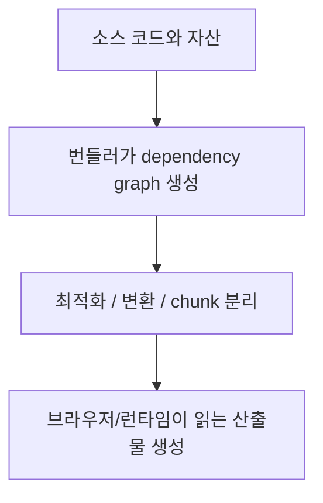
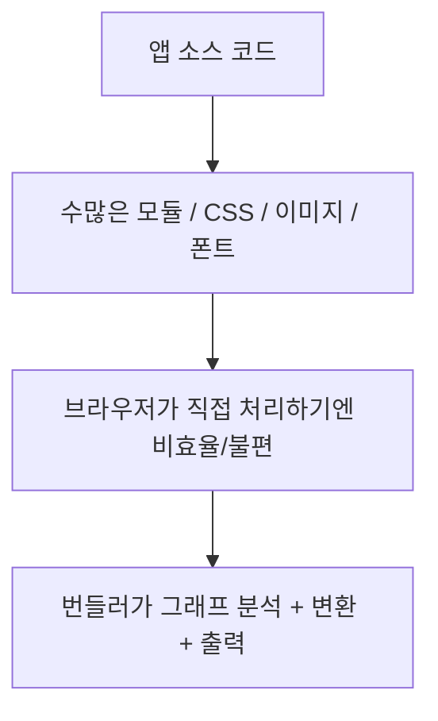
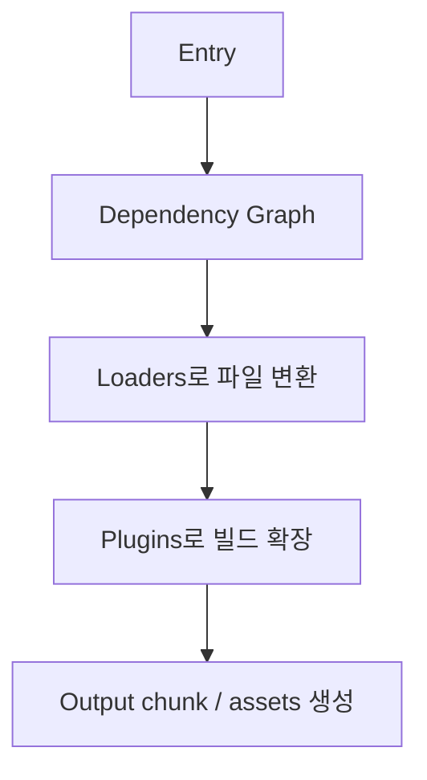
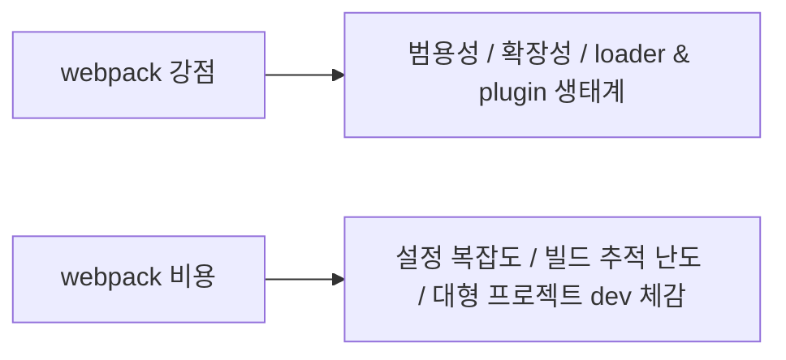
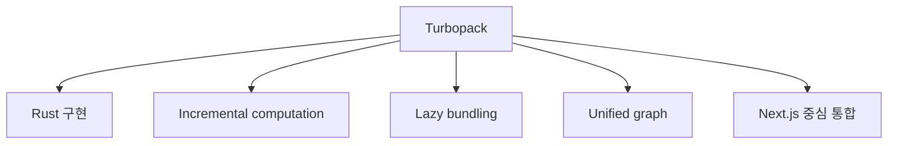
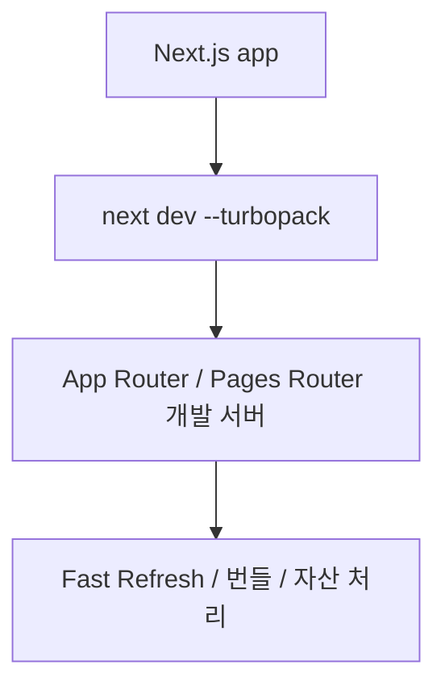
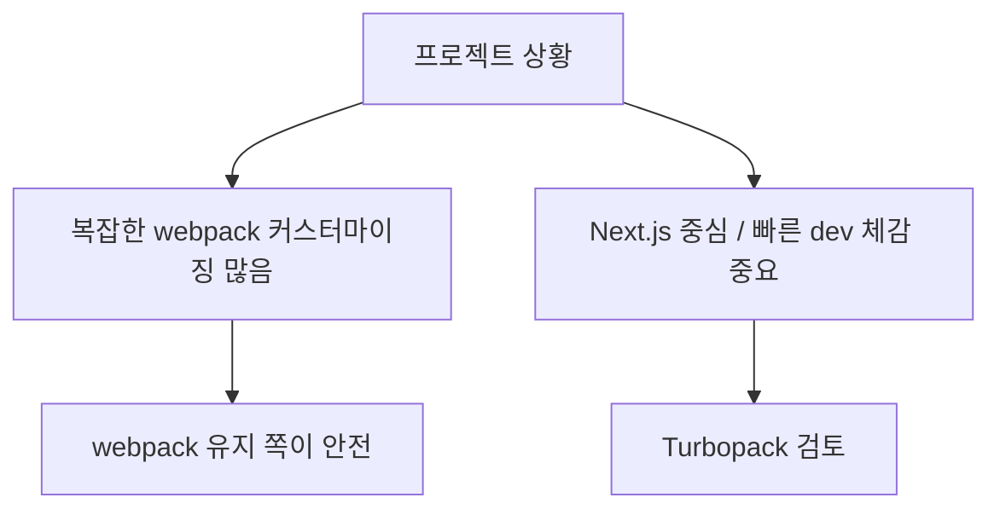

# webpack과 Turbopack 상세 정리

작성 기준일: 2026-04-19  
조사 방식: 웹검색 기반 최신 조사  
주요 참고: `webpack.js.org` 공식 문서, `nextjs.org` Turbopack 문서

## 1. 한 줄 요약

`webpack`과 `Turbopack`은 둘 다 JavaScript/TypeScript 애플리케이션의 모듈과 자산을 그래프로 분석해서 실행 가능한 산출물로 만드는 번들러이지만, webpack은 범용성과 생태계가 강한 전통적 번들러이고, Turbopack은 Rust로 작성된 incremental bundler로 특히 Next.js 개발 경험을 빠르게 만들기 위해 설계된 최신 번들러다.

공식 문서 기준으로:

- webpack은 "static module bundler for modern JavaScript applications"다.
- Turbopack은 "incremental bundler optimized for JavaScript and TypeScript"이며 Next.js에 내장되어 있다.

즉 둘은 같은 문제를 풀지만, 설계 우선순위와 강점이 다르다.

---

## 2. 왜 번들러가 필요한가

webpack 공식 Concepts 문서는 webpack의 핵심을 다음처럼 설명한다.

- 하나 이상의 entry point에서 시작
- 애플리케이션의 dependency graph를 재귀적으로 구성
- 필요한 모든 모듈을 하나 이상 번들로 결합

즉 번들러는 단순 파일 합치기 도구가 아니다.

주요 역할:

- dependency graph 분석
- JS/TS/JSX/TSX 변환
- CSS와 자산 처리
- code splitting
- tree shaking
- dev server / HMR 지원

### 2.1 왜 예전보다 더 중요해졌나

현대 프런트엔드는 보통:

- 수백 개 이상의 모듈
- TypeScript
- CSS modules / Sass
- 이미지 / 폰트
- React / Vue / Server Components

를 동시에 다룬다.

즉 브라우저가 그냥 `<script>` 몇 개로 로딩하던 시절과는 문제가 다르다.

### 2.2 "Native ESM이 있으면 번들러가 필요 없지 않나?"

부분적으로는 맞지만, 공식 Turbopack 문서가 지적하듯:

- 작은 앱에는 native ESM dev 방식이 괜찮을 수 있으나
- 큰 앱은 네트워크 요청 수가 너무 많아져 dev가 느려질 수 있다

즉 번들러는 여전히:

- 대규모 앱 개발 속도
- 자산/변환/최적화

문제에서 중요하다.

---

## 3. webpack는 어떻게 동작하나

webpack 공식 Concepts 문서는 webpack의 core concepts를:

- Entry
- Output
- Loaders
- Plugins
- Mode

로 설명한다.

### 3.1 Entry

entry는 그래프 탐색 시작점이다.

즉 webpack에게:

- "어디서부터 의존성을 따라가야 하는지"

를 알려 준다.

### 3.2 Dependency Graph

webpack 공식 Dependency Graph 문서는:

- 파일이 다른 파일에 의존하면 dependency로 보고
- entry에서 시작해 필요한 모든 모듈을 그래프에 포함

한다고 설명한다.

즉 CSS, 이미지 같은 비코드 자산도 모듈 그래프의 일부로 다룰 수 있다.

### 3.3 Loaders

loader는 "파일을 다른 형태로 변환하는 규칙"이다.

대표 예:

- `babel-loader`
- `ts-loader`
- `css-loader`
- `sass-loader`

즉 webpack이 기본으로 이해하지 못하는 파일도 loader를 통해 그래프에 편입할 수 있다.

### 3.4 Plugins

plugin은 loader보다 더 넓은 빌드 확장 지점이다.

예:

- 번들 분석
- HTML 생성
- 환경변수 주입
- HMR 지원

즉 webpack 생태계의 강력함은 plugin 시스템에 크게 기대고 있다.

### 3.5 Output

output은 최종 산출물이:

- 어디에
- 어떤 이름 규칙으로
- 어떤 publicPath로

나갈지를 정한다.

즉 webpack는 highly configurable bundler라는 표현이 잘 맞는다.

---

## 4. webpack의 강점과 비용

webpack의 가장 큰 장점은 범용성이다.

### 4.1 강점

- 오랜 생태계
- loader/plugin 수가 많음
- 다양한 자산 형식 처리 가능
- 프레임워크 비종속
- 세밀한 제어 가능

즉 "웬만한 빌드 요구사항은 어떻게든 맞출 수 있는 툴"이다.

### 4.2 HMR

webpack 공식 HMR 문서는:

- 전체 새로고침 없이 모듈을 교체/추가/제거할 수 있다고

설명한다.

즉 개발 생산성에 매우 중요하다.

### 4.3 tree shaking

webpack 공식 tree shaking 문서는:

- ES module의 정적 구조를 기반으로 unused export 제거

를 설명한다.

즉 production optimization도 강하다.

### 4.4 비용

다만 대가도 있다.

- 설정이 복잡해지기 쉬움
- plugin/loader 조합이 많아 디버깅이 어려울 수 있음
- 대형 프로젝트 dev 빌드가 느려질 수 있음

즉 webpack은 강력하지만 복잡성을 팀이 감당해야 하는 도구다.

---

## 5. Turbopack은 어떻게 다른가

Next.js 공식 Turbopack 문서는 Turbopack을:

- Rust로 작성된 incremental bundler
- JavaScript/TypeScript 최적화
- Next.js에 내장

이라고 설명한다.

### 5.1 왜 만들었나

공식 문서가 제시하는 핵심 이유:

- Unified Graph
- Bundling vs Native ESM trade-off 해결
- Incremental Computation
- Lazy Bundling

### 5.2 Unified Graph

Next.js는:

- client bundle
- server bundle
- React Server Components 관련 산출물

등 여러 출력 환경이 생길 수 있다.

공식 문서는 Turbopack이 이를 single unified graph로 관리한다고 설명한다.

즉 여러 컴파일러를 억지로 이어 붙이는 구조보다 더 일관된 모델을 지향한다.

### 5.3 Incremental Computation

공식 문서 핵심:

- 함수 수준까지 결과 캐시
- 한 번 계산한 작업을 재계산하지 않음
- 코어 간 병렬화

즉 큰 프로젝트에서 dev iteration 속도를 높이려는 설계다.

### 5.4 Lazy Bundling

공식 문서는 Turbopack이 dev server가 실제로 요청한 것만 번들링한다고 설명한다.

즉 처음부터 전체를 다 묶기보다:

- 지금 필요한 페이지/모듈만
- 지연 평가/지연 번들링

하는 감각이다.

이게 초기 dev compile 시간과 메모리 사용량에 유리하다.

---

## 6. Next.js에서 Turbopack의 위치

현재 공개 문서 기준 Turbopack은 Next.js 문맥에서 가장 강하게 설명된다.

### 6.1 현재 상태

Next.js API reference는 2026-02-27 기준:

- `dev`는 stable
- `build`는 alpha

라고 설명한다.

즉 오늘 기준 실무 감각은:

- 로컬 개발 가속용으로는 상당히 현실적
- production build까지 전면 전환은 아직 환경에 따라 검토 필요

다.

### 6.2 지원 범위

공식 문서 기준:

- JavaScript / TypeScript
- React / RSC
- CSS / PostCSS / Sass
- static assets
- path alias

등은 대부분 잘 맞춰져 있다.

### 6.3 known gaps

공식 문서는 명시적으로:

- 기존 `webpack()` 설정은 Turbopack에서 인식되지 않음
- 일부 실험 플래그 미지원
- 커스텀 Sass functions 등 일부 기능은 webpack 필요

하다고 설명한다.

즉 Next.js 프로젝트라도 "기존 webpack 커스텀에 얼마나 의존하는가"가 전환 판단 핵심이다.

---

## 7. 언제 webpack을 유지하고, 언제 Turbopack을 고려하나

### 7.1 webpack이 더 맞는 경우

- 프레임워크 비종속 빌드 파이프라인
- 복잡한 custom loader/plugin 생태계
- 기존 `webpack.config.js`가 매우 중요함
- Turbopack 미지원 기능에 의존

즉 "내 빌드 시스템이 이미 webpack 생태계에 깊게 묶여 있다"면 당장 갈아타는 것이 비용이 클 수 있다.

### 7.2 Turbopack이 잘 맞는 경우

- Next.js 프로젝트
- 로컬 개발 속도가 매우 중요
- 커스텀 webpack 설정이 많지 않음
- App Router / modern React stack

즉 "Next.js 공식 통합된 dev bundler"가 필요하다면 Turbopack이 매력적이다.

### 7.3 한 줄 기준

- 범용성과 확장성 최우선 -> webpack
- Next.js에서 빠른 dev iteration 최우선 -> Turbopack

### 7.4 실무 결론

둘은 완전한 상하위 관계가 아니라:

- `webpack`은 범용 강자
- `Turbopack`은 Next.js 중심 차세대 고속 개발 번들러

로 보는 편이 맞다.

---

## 참고 링크

- webpack Concepts: [Concepts](https://webpack.js.org/concepts/)
- webpack Dependency Graph: [Dependency Graph](https://webpack.js.org/concepts/dependency-graph/)
- webpack Output: [Output](https://webpack.js.org/concepts/output/)
- webpack Hot Module Replacement (concept): [Hot Module Replacement](https://webpack.js.org/concepts/hot-module-replacement)
- webpack HMR guide: [HMR Guide](https://webpack.js.org/guides/hot-module-replacement/)
- webpack Tree Shaking: [Tree Shaking](https://webpack.js.org/guides/tree-shaking/)
- Next.js Turbopack docs: [Turbopack](https://nextjs.org/docs/app/api-reference/turbopack)
- Next.js Architecture - Turbopack: [Turbopack Architecture](https://nextjs.org/docs/architecture/turbopack)
