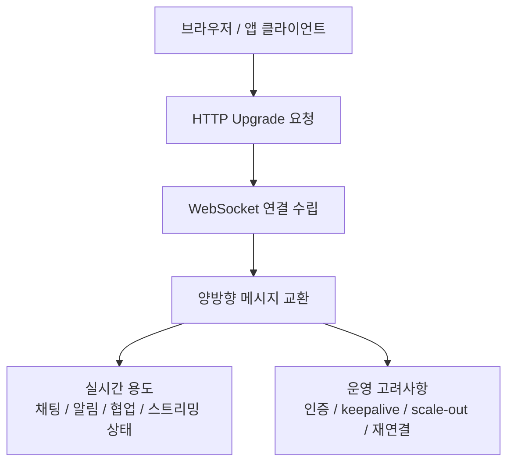
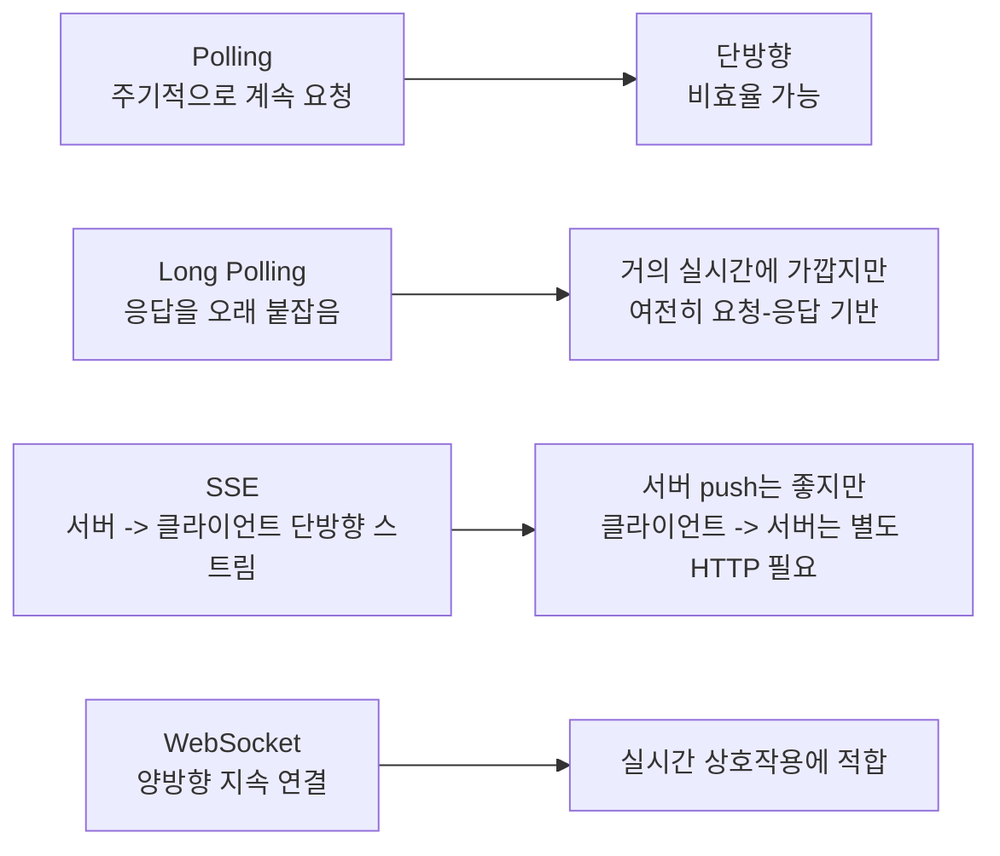
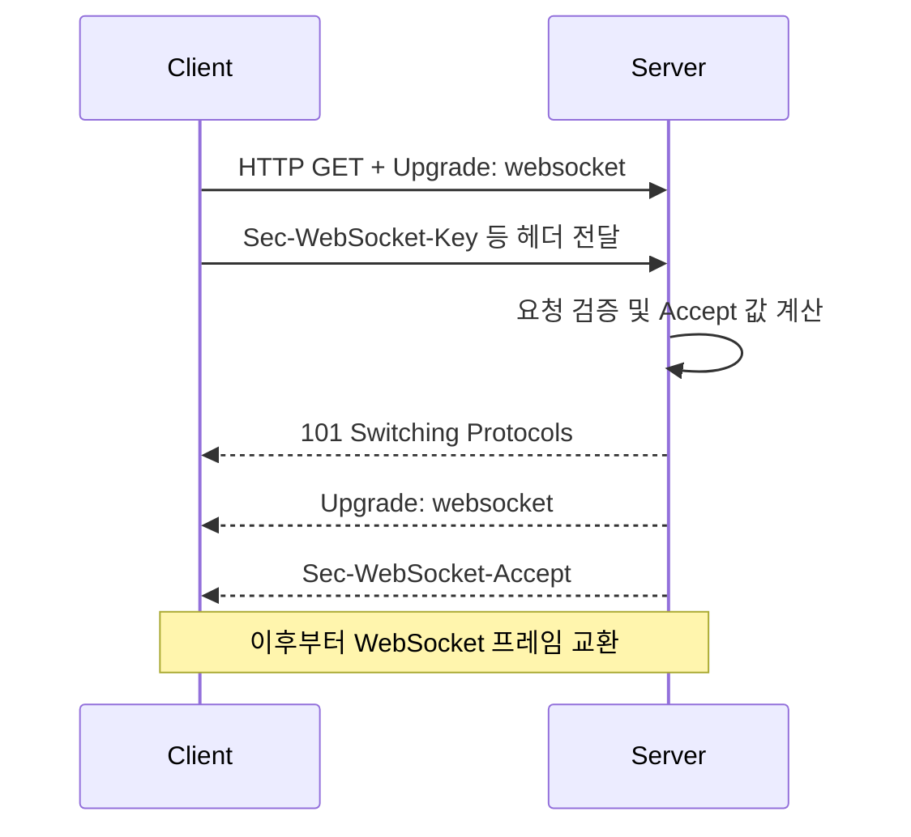
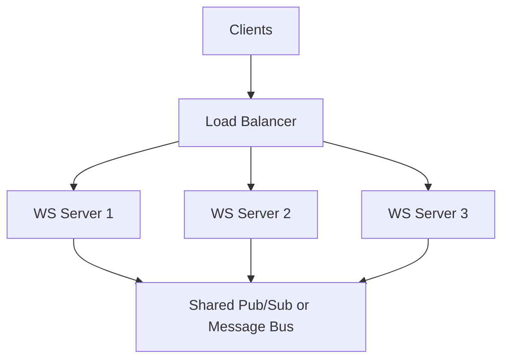

# WebSocket 상세 정리

작성 기준일: 2026-04-13  
주요 참고: `RFC 6455`, `WHATWG WebSockets`, `MDN WebSocket API`

## 1. 한 줄 요약

`WebSocket`은 클라이언트와 서버가 한 번 연결을 맺은 뒤, 같은 TCP 연결을 유지하면서 양방향으로 데이터를 계속 주고받을 수 있게 해주는 프로토콜이다.

짧게 말하면:

- HTTP처럼 요청-응답 한 번으로 끝나는 구조가 아니라
- 연결을 오래 유지하고
- 클라이언트와 서버가 서로 먼저 메시지를 보낼 수 있는
- `실시간 통신용 프로토콜`

이다.

---

## 2. 먼저 큰 그림



이 다이어그램에서 중요한 포인트는 두 가지다.

- 시작은 보통 `HTTP 업그레이드`로 한다
- 연결이 수립되면 이후는 `메시지 기반 양방향 통신`이 된다

---

## 3. WebSocket이 필요한 이유

WebSocket은 "실시간성"과 "양방향성"이 동시에 필요한 문제를 풀기 위해 등장했다.

예전 웹은 기본적으로:

- 브라우저가 요청하고
- 서버가 응답하는

일방향 요청-응답 모델이었다.

이 구조는 다음 상황에서 불편했다.

- 채팅
- 주식/가격 실시간 갱신
- 협업 편집
- 게임 상태 동기화
- 실시간 모니터링 대시보드
- 서버가 먼저 알려줘야 하는 알림

이런 경우 HTTP polling만으로 구현하면:

- 지연이 생기고
- 불필요한 요청이 많고
- 구현이 지저분해진다

그래서 WebSocket이 등장했다.

---

## 4. Polling, SSE와 비교하면

WebSocket을 이해하려면 `Polling`, `Long Polling`, `SSE`와 비교하는 것이 가장 쉽다.



### 4.1 Polling

- 클라이언트가 주기적으로 새 데이터가 있는지 묻는다
- 구현은 쉽지만 요청 낭비가 많다

### 4.2 Long Polling

- 서버가 응답을 오래 붙잡다가 이벤트 생기면 응답한다
- Polling보다 낫지만 여전히 HTTP 요청-응답 모델이다

### 4.3 SSE

- `Server-Sent Events`
- 서버에서 클라이언트로 보내는 단방향 스트림에는 좋다
- 하지만 클라이언트가 서버로 보내는 방향은 별도 요청이 필요하다

### 4.4 WebSocket

- 한 연결에서 양방향
- 클라이언트도 먼저 보낼 수 있고 서버도 먼저 보낼 수 있다
- 실시간 상호작용 구조에 가장 자연스럽다

---

## 5. WebSocket의 핵심 특징

### 5.1 양방향(full-duplex)

가장 중요한 특징이다.

- 서버가 먼저 메시지를 보낼 수 있다
- 클라이언트도 동시에 보낼 수 있다

즉 단순 push가 아니라 상호작용 채널이다.

### 5.2 지속 연결(persistent connection)

한 번 연결되면 매 요청마다 TCP 연결을 새로 만들지 않는다.

### 5.3 메시지 기반

HTTP는 request/response 단위가 핵심이지만, WebSocket은 `frame`과 `message`가 핵심이다.

### 5.4 저지연

연결이 이미 열려 있으므로:

- 매번 handshake할 필요가 없고
- RTT 낭비가 적다

### 5.5 브라우저 친화적

브라우저에서 표준 API로 사용할 수 있다.

예:

```js
const ws = new WebSocket("wss://example.com/socket");
```

---

## 6. WebSocket은 어떻게 시작되는가

WebSocket은 보통 처음부터 완전히 별도 프로토콜로 시작하지 않는다.

일반적으로:

- 클라이언트가 HTTP 요청을 보낸 뒤
- `Upgrade: websocket`

헤더로 프로토콜 업그레이드를 요청한다.

즉, 처음 진입은 HTTP 문맥을 활용한다.

---

## 7. Handshake 개념

WebSocket 연결 수립 과정을 `handshake`라고 한다.

흐름은 대략 아래와 같다.



### 7.1 왜 이렇게 복잡한가

이 handshake는 단순 형식이 아니라:

- 진짜 WebSocket upgrade 요청인지 확인하고
- 중간 프록시나 잘못된 구현과 구분하고
- 보안적으로 의도된 연결인지 검증하기 위한 절차

다.

### 7.2 중요한 헤더들

대표적으로 아래를 자주 본다.

- `Upgrade: websocket`
- `Connection: Upgrade`
- `Sec-WebSocket-Key`
- `Sec-WebSocket-Version`
- `Sec-WebSocket-Accept`
- 필요 시 `Sec-WebSocket-Protocol`
- 필요 시 `Sec-WebSocket-Extensions`

---

## 8. ws와 wss

WebSocket URL 스킴은 보통 두 가지다.

- `ws://`
- `wss://`

### 8.1 ws

- 평문 WebSocket
- 보안이 없는 HTTP와 비슷한 위치

### 8.2 wss

- TLS가 적용된 WebSocket
- HTTPS에 대응하는 보안 버전

실전에서는 거의 항상 `wss://`를 써야 한다.

이유:

- 브라우저 보안 정책
- 인증 정보 보호
- 중간자 공격 방지

때문이다.

---

## 9. WebSocket 연결 후에는 무슨 일이 일어나나

Handshake가 끝나면 이후 통신은 HTTP body가 아니라 WebSocket frame 단위로 이뤄진다.

즉:

- 텍스트 메시지
- 바이너리 메시지
- ping/pong
- close

같은 프레임이 오간다.

### 9.1 주요 프레임 타입

RFC 6455 기준으로 실무에서 중요한 것은 아래다.

- Text frame
- Binary frame
- Close frame
- Ping frame
- Pong frame

### 9.2 왜 ping/pong이 필요한가

연결이 열려 있다고 해서 실제 네트워크 경로가 살아 있다는 뜻은 아니다.

따라서:

- keepalive
- half-open connection 탐지
- idle timeout 방지

를 위해 ping/pong을 쓴다.

---

## 10. 메시지와 프레임은 같은가

엄밀히는 다르다.

### 10.1 Frame

전송 단위다.

### 10.2 Message

애플리케이션이 의미 있게 다루는 단위다.

하나의 메시지가 여러 프레임으로 나뉠 수도 있다.

즉:

- 개발자는 보통 `메시지`를 의식하지만
- 프로토콜 수준에서는 `프레임`이 오간다

고 이해하면 된다.

---

## 11. Client와 Server의 역할 차이

### 11.1 클라이언트

브라우저나 앱에서:

- 연결 시작
- 메시지 송신
- 서버 메시지 수신
- 재연결 로직 수행

### 11.2 서버

서버는 보통:

- upgrade handshake 처리
- 연결별 상태 관리
- 브로드캐스트
- 인증/권한 검증
- room/channel 관리

를 한다.

### 11.3 중요한 차이: masking

RFC 6455에서는 클라이언트에서 서버로 보내는 프레임은 `masking` 처리된다.

이건 브라우저 기반 공격 시나리오를 줄이기 위한 규칙이다.

시험/기초 개념 수준에서는:

- "클라이언트 -> 서버 프레임은 mask"

정도로 기억해도 충분하다.

---

## 12. 브라우저에서 WebSocket API는 어떻게 쓰나

MDN 기준 기본 사용 패턴은 매우 단순하다.

```js
const socket = new WebSocket("wss://example.com/socket");

socket.addEventListener("open", () => {
  socket.send("hello");
});

socket.addEventListener("message", (event) => {
  console.log(event.data);
});

socket.addEventListener("close", () => {
  console.log("closed");
});

socket.addEventListener("error", (err) => {
  console.error(err);
});
```

### 12.1 주요 이벤트

- `open`
- `message`
- `close`
- `error`

### 12.2 send

연결이 열린 뒤에 `send()`로 메시지를 보낸다.

---

## 13. WebSocket의 상태(state)

브라우저 API에는 readyState 개념이 있다.

대략 이런 상태로 이해하면 된다.

- 연결 중
- 연결됨
- 종료 중
- 종료됨

즉 WebSocket은 단발 요청이 아니라 상태를 갖는 연결 객체다.

이 점이 HTTP 요청 객체와 다르다.

---

## 14. WebSocket이 잘 맞는 대표 용도

### 14.1 채팅

가장 대표적이다.

- 클라이언트도 메시지를 보내고
- 서버도 상대방 메시지를 바로 push해야 한다

### 14.2 협업 편집

예:

- 문서 공동 편집
- 커서 위치 동기화
- presence

### 14.3 실시간 대시보드

예:

- 서버 상태
- 거래 데이터
- 실시간 로그

### 14.4 게임 / 실시간 상호작용

- 빠른 상태 갱신
- 이벤트 교환

### 14.5 알림 + 제어가 동시에 필요한 앱

SSE는 알림에는 좋지만, 사용자의 즉시 액션을 같은 채널로 보내는 데는 WebSocket이 더 자연스럽다.

---

## 15. WebSocket이 항상 정답은 아닌 이유

많은 사람이 "실시간 = 무조건 WebSocket"으로 생각하는데, 그렇지는 않다.

### 15.1 SSE가 더 나은 경우

- 서버 -> 클라이언트 단방향 알림이면 충분할 때
- 브라우저 구현 단순성이 중요할 때

### 15.2 Polling이 더 단순한 경우

- 이벤트 빈도가 낮을 때
- 실시간성이 아주 중요하지 않을 때
- 운영 복잡도를 줄이고 싶을 때

### 15.3 메시지 브로커가 더 적합한 경우

내부 시스템 간 이벤트 전달이라면:

- Kafka
- RabbitMQ
- NATS

같은 것이 더 적합할 수 있다.

즉 WebSocket은 `브라우저/클라이언트와의 실시간 연결` 문제에 특히 강한 도구다.

---

## 16. WebSocket vs HTTP

| 비교 항목 | HTTP | WebSocket |
|---|---|---|
| 기본 통신 방식 | 요청-응답 | 지속 연결 양방향 |
| 연결 수명 | 보통 짧음 | 보통 길게 유지 |
| 서버가 먼저 보낼 수 있는가 | 기본적으로 어려움 | 가능 |
| 용도 | 일반 웹/API 요청 | 실시간 상호작용 |
| 메시지 형태 | request/response | frame/message |

핵심:

- HTTP는 문서/리소스 요청에 강하고
- WebSocket은 실시간 상호작용에 강하다

---

## 17. WebSocket vs SSE

| 비교 항목 | SSE | WebSocket |
|---|---|---|
| 방향 | 서버 -> 클라이언트 | 양방향 |
| 구현 단순성 | 비교적 단순 | 더 복잡 |
| 브라우저 지원 | 좋음 | 좋음 |
| 클라이언트 -> 서버 메시지 | 별도 HTTP 필요 | 같은 연결로 가능 |
| 실시간 상호작용 | 제한적 | 매우 적합 |

즉:

- `알림`이면 SSE도 충분할 수 있고
- `상호작용`이면 WebSocket이 더 자연스럽다

---

## 18. 인증은 어떻게 처리하나

WebSocket에서 인증은 생각보다 자주 헷갈린다.

왜냐하면:

- handshake는 HTTP 기반
- 이후는 장기 연결

이기 때문이다.

### 18.1 흔한 방식

- 쿠키 기반 세션
- URL query token
- Authorization 헤더 대체 패턴
- handshake 후 첫 메시지에서 auth

### 18.2 보안상 주의점

- URL query에 토큰을 넣으면 로그에 남을 수 있다
- 장기 연결이므로 연결 후 권한 변경/만료를 어떻게 다룰지 생각해야 한다

즉 WebSocket 인증은 "한 번 인증하고 끝"이 아니라:

- 연결 수명
- 재연결
- 권한 만료

까지 같이 설계해야 한다.

---

## 19. 재연결(reconnect)은 왜 중요한가

현실의 네트워크는 자주 끊긴다.

따라서 실전 클라이언트는 거의 항상:

- 연결 실패
- 일시 네트워크 장애
- 모바일 네트워크 전환
- 탭 background

같은 상황을 고려해야 한다.

### 19.1 흔한 전략

- 지수 백오프
- 최대 재시도 간격 제한
- 연결 복구 후 state sync

### 19.2 중요한 점

연결만 다시 붙으면 끝나는 것이 아니다.

다시 붙은 뒤에:

- 놓친 메시지 복구
- 현재 상태 재동기화

가 필요할 수 있다.

즉 WebSocket 시스템은 종종 `재연결 + 재동기화`를 한 세트로 설계한다.

---

## 20. 서버에서 어려운 점

WebSocket 서버는 단순 REST API 서버와 다르게 운영 이슈가 많다.

### 20.1 연결 수 관리

동시에 많은 연결을 오래 유지해야 한다.

### 20.2 메모리 사용

각 연결마다 상태가 생긴다.

### 20.3 브로드캐스트

많은 클라이언트에 동시에 보내야 할 수 있다.

### 20.4 scale-out

서버가 여러 대면:

- 어떤 서버에 어떤 클라이언트가 붙어 있는지
- 다른 서버의 이벤트를 어떻게 전달할지

문제가 생긴다.

### 20.5 sticky session 여부

로드밸런서 환경에서는:

- 같은 클라이언트가 계속 같은 서버로 가야 할지
- 아니면 외부 pub/sub 레이어를 둘지

같은 결정이 필요하다.

---

## 21. Scale-out 시 흔한 구조

WebSocket 서버가 여러 대일 때는 보통 아래처럼 간다.



의미:

- 각 서버는 자기 연결을 관리
- 서버 간 메시지 전달은 별도 pub/sub 계층 사용

이 구조를 안 쓰면:

- 서버 1에 붙은 사용자에게
- 서버 2에서 발생한 이벤트를 전달하기 어렵다

---

## 22. Keepalive가 왜 필요한가

중간 프록시, NAT, LB, 모바일 네트워크는 idle connection을 끊을 수 있다.

그래서 WebSocket 시스템은 보통:

- ping/pong
- application-level heartbeat

를 쓴다.

### 22.1 목적

- 죽은 연결 감지
- idle timeout 방지
- latency/health 측정

즉 keepalive는 선택이 아니라 실전에서는 거의 필수다.

---

## 23. Backpressure 문제

WebSocket은 빠르지만, 항상 receiver가 sender 속도를 따라갈 수 있는 건 아니다.

예:

- 서버가 초당 수천 이벤트를 밀어 넣음
- 클라이언트 UI는 다 못 그린다

이런 경우 backpressure가 생긴다.

### 23.1 문제

- 메모리 누적
- 지연 증가
- 브라우저 탭 멈춤

### 23.2 대응

- 메시지 드롭 전략
- 샘플링
- 배치화
- 최신 상태만 유지
- diff만 전송

즉 "모든 이벤트를 그대로 다 보내자"는 종종 잘못된 설계다.

---

## 24. Close와 종료 처리

WebSocket 연결은 명시적으로 close할 수 있다.

종료 시에는 close frame과 close code 개념이 있다.

### 24.1 왜 중요한가

종료 원인을 구분할 수 있기 때문이다.

예:

- 정상 종료
- 프로토콜 오류
- 정책 위반
- 메시지 너무 큼

### 24.2 실무적으로 중요한 것

- close event 로그 남기기
- 이유 코드 기록
- 재연결 여부 판단

즉 종료 처리도 운영의 일부다.

---

## 25. WebSocket과 보안

WebSocket은 HTTP보다 자동으로 더 안전하지 않다.

오히려 장기 연결이라 더 신경 쓸 부분이 많다.

### 25.1 기본 원칙

- `wss://` 사용
- origin 검증 필요 시 수행
- 인증/인가 명확화
- 입력 검증
- 메시지 크기 제한
- rate limiting

### 25.2 흔한 위험

- 인증 없는 공개 소켓
- 메시지 flood
- 큰 payload 공격
- 권한 없는 room 구독
- 재연결 abuse

### 25.3 Origin 체크

브라우저 기반 WebSocket에서는 Origin을 통해 요청 출처를 확인할 수 있다.

이는 특히:

- 브라우저 문맥
- 쿠키 인증 문맥

에서 중요하다.

---

## 26. 시험/면접/실무에서 자주 묻는 포인트

### 26.1 "WebSocket은 왜 필요하죠?"

좋은 답:

- HTTP의 request-response 한계를 넘어서
- 연결을 유지한 채
- 서버와 클라이언트가 양방향 실시간 통신을 할 수 있게 해준다

### 26.2 "SSE와 차이는?"

좋은 답:

- SSE는 서버 -> 클라이언트 단방향
- WebSocket은 양방향

### 26.3 "언제 쓰면 안 되죠?"

좋은 답:

- 실시간성이 약하거나
- 단방향 알림이면
- SSE나 polling이 더 단순할 수 있다

### 26.4 "운영에서 뭐가 어렵죠?"

좋은 답:

- 장기 연결 관리
- scale-out
- 재연결
- keepalive
- 인증/인가
- backpressure

---

## 27. 자주 하는 오해

### 27.1 "WebSocket = 무조건 빠름"

아니다.

프로토콜 자체가 저지연에 유리할 뿐, 시스템 전체가 잘 설계돼야 빠르다.

### 27.2 "실시간이면 무조건 WebSocket"

아니다.

알림 위주면 SSE가 더 단순할 수 있다.

### 27.3 "연결만 맺으면 끝"

아니다.

실전에서는:

- 재연결
- 인증
- 상태 복구
- heartbeat

가 더 중요하다.

### 27.4 "REST를 대체한다"

보통은 아니다.

실제 서비스는 자주:

- 일반 CRUD는 HTTP/REST
- 실시간 이벤트는 WebSocket

처럼 병행한다.

---

## 28. 빠른 복습

- WebSocket은 장기 연결 기반 `양방향 실시간 통신` 프로토콜이다.
- 시작은 보통 `HTTP Upgrade` handshake로 한다.
- 이후에는 frame/message 단위로 데이터를 주고받는다.
- 실시간 채팅, 협업, 대시보드, 게임 등에 적합하다.
- SSE는 단방향, WebSocket은 양방향이다.
- 실전 핵심은 `인증`, `재연결`, `keepalive`, `scale-out`, `backpressure`다.

---

## 29. 참고 링크

- RFC 6455 - The WebSocket Protocol: [링크](https://datatracker.ietf.org/doc/html/rfc6455)
- WHATWG WebSockets Standard: [링크](https://websockets.spec.whatwg.org/)
- MDN WebSocket API: [링크](https://developer.mozilla.org/en-US/docs/Web/API/WebSocket)
- MDN Writing WebSocket client applications: [링크](https://developer.mozilla.org/en-US/docs/Web/API/WebSockets_API/Writing_WebSocket_client_applications)
- MDN The WebSocket API (WebSockets / WebSocketStream): [링크](https://developer.mozilla.org/en-US/docs/Web/API/WebSockets_API)

<!-- study-links:start -->
## 관련 문서

- `kafka`: [[kafka/kafka|Kafka 상세 정리]]
- `sse`: [[SSE/SSE|SSE 상세 정리]]
<!-- study-links:end -->
