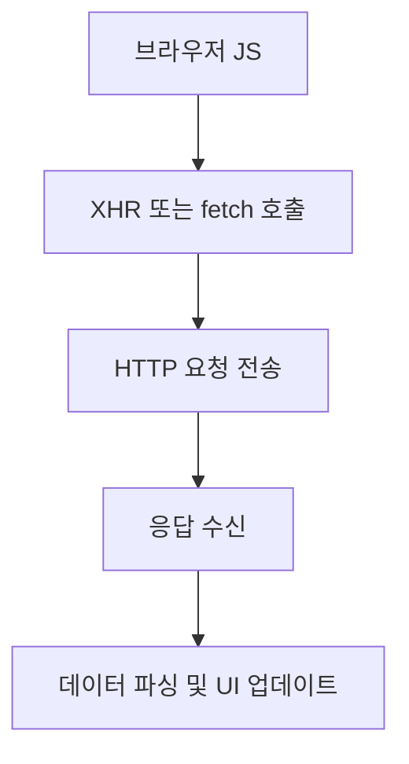
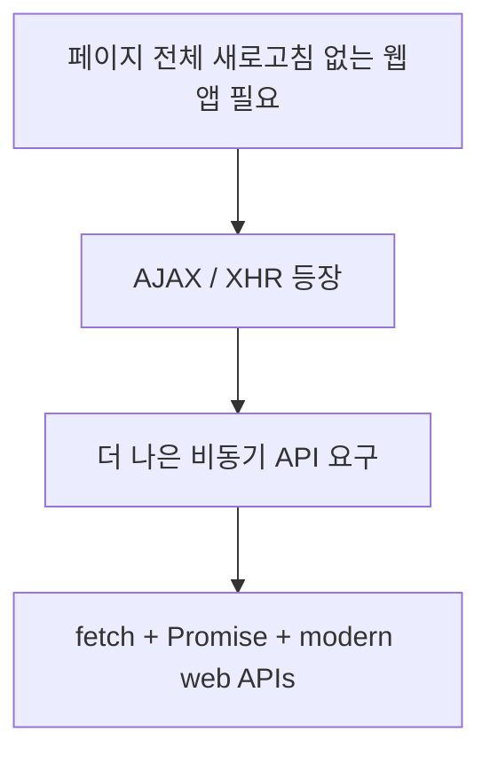
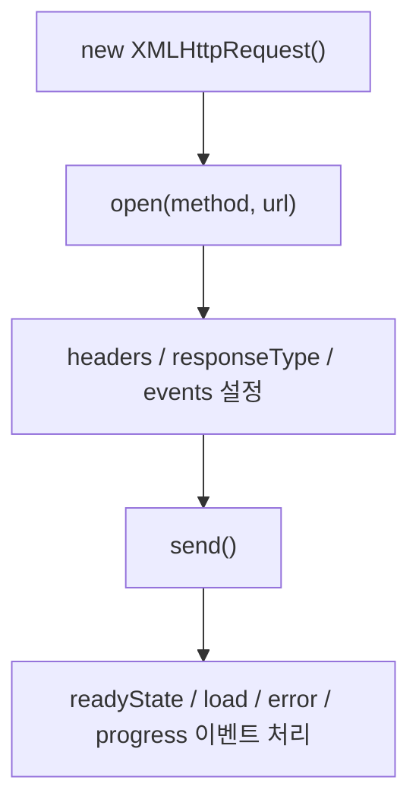
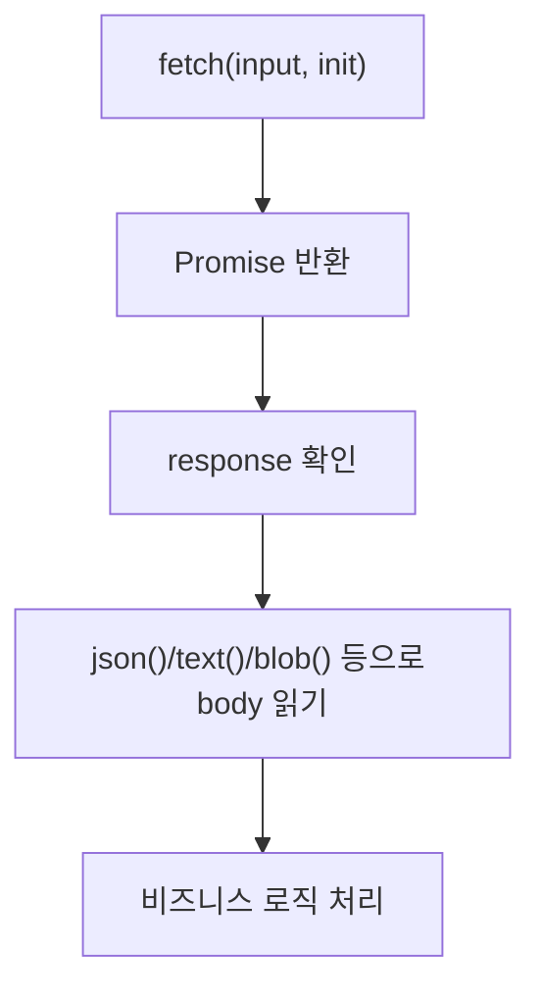
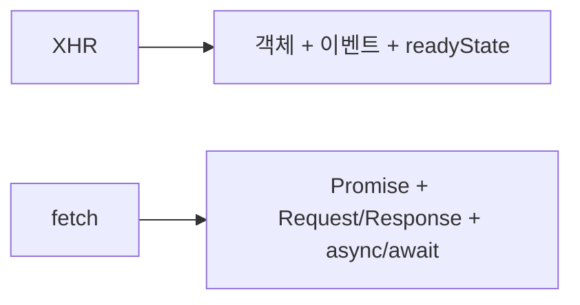
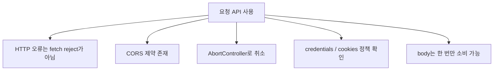
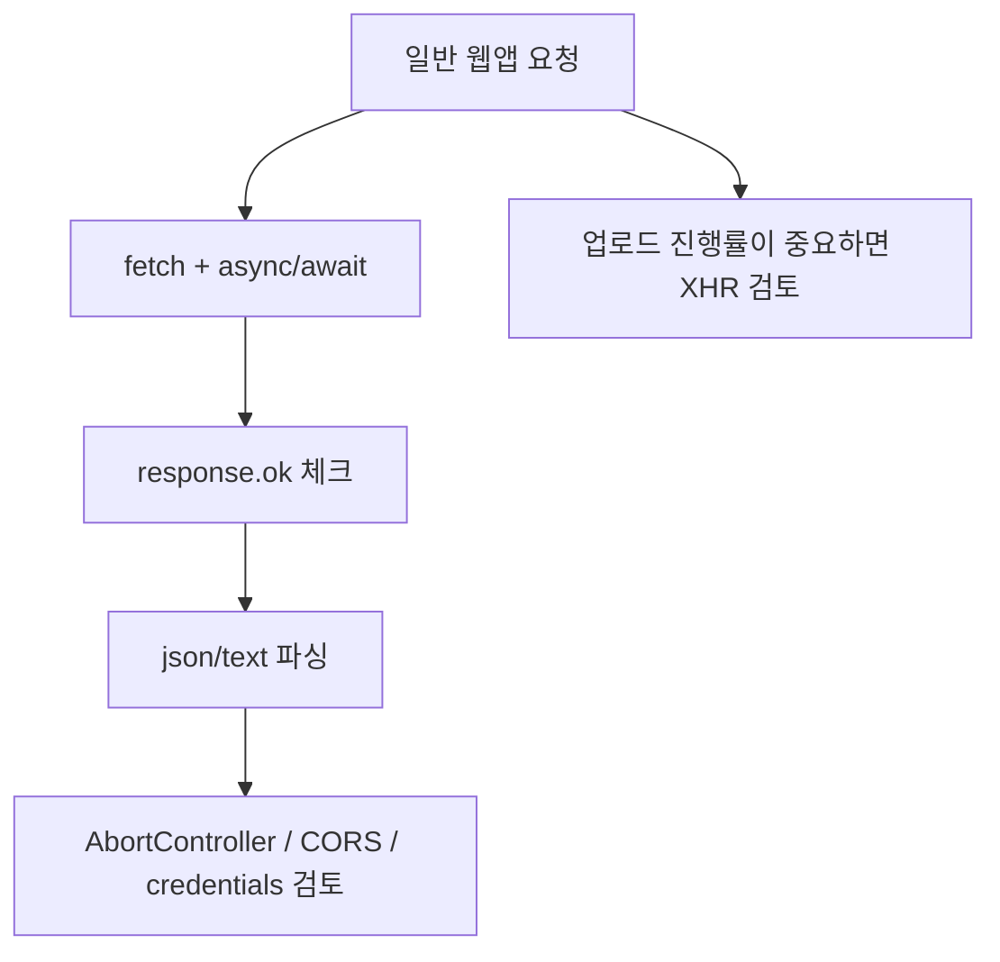

# XHR와 Fetch 상세 정리

작성 기준일: 2026-04-19  
조사 방식: 웹검색 기반 최신 조사  
주요 참고: `developer.mozilla.org` 공식 MDN 문서, WHATWG `fetch` / `XMLHttpRequest` 표준

## 1. 한 줄 요약



`XMLHttpRequest(XHR)`와 `fetch()`는 둘 다 브라우저 JavaScript가 HTTP 요청을 보내고 응답을 받아오는 API지만, XHR은 전통적인 이벤트/상태 기반 API이고 `fetch()`는 Promise 기반의 현대 API다.

MDN은 Fetch API를 "`XMLHttpRequest`의 더 강력하고 더 유연한 대체재"라고 설명한다. 즉 둘은 경쟁 관계라기보다, 같은 문제를 서로 다른 시대의 설계 방식으로 푸는 API라고 보면 된다.

---

## 2. 왜 중요한가



브라우저 앱은 종종:

- 페이지 전체를 다시 로드하지 않고
- 서버에 데이터를 요청하고
- 일부 UI만 갱신해야 한다

예:

- 로그인 요청
- 게시글 목록 로딩
- 무한 스크롤
- 검색 자동완성
- 파일 업로드/다운로드

이런 요구 때문에 브라우저 네트워크 API가 중요해졌다.

### 2.1 XHR의 역사적 위치

MDN `XMLHttpRequest`는 XHR이:

- full page refresh 없이 URL에서 데이터를 가져오고
- 웹 페이지 일부만 업데이트할 수 있게 해 준다고

설명한다.

즉 예전 AJAX 시대의 핵심 API였다.

### 2.2 Fetch가 왜 나왔나

MDN `Using Fetch`는 Fetch가:

- Promise 기반이고
- service workers, CORS 같은 modern web feature와 잘 통합된다고

설명한다.

즉 XHR의 기능 부족이라기보다, 현대 JavaScript와 맞는 API 디자인이 필요해서 `fetch()`가 중심이 된 것이다.

---

## 3. XHR(XMLHttpRequest)



MDN `XMLHttpRequest`는 XHR 객체를:

- 서버와 상호작용하는 데 사용하는 객체

라고 설명한다.

즉 전통적인 브라우저 HTTP 클라이언트 객체다.

### 3.1 기본 흐름

가장 기본 XHR 패턴은 보통 이렇다.

```js
const xhr = new XMLHttpRequest();
xhr.open("GET", "/api/data");
xhr.onload = () => {
  console.log(xhr.status, xhr.responseText);
};
xhr.onerror = () => {
  console.error("network error");
};
xhr.send();
```

### 3.2 핵심 특징

- 객체를 먼저 만든다
- `open()`으로 요청 설정
- 이벤트 핸들러를 붙인다
- `send()`로 전송
- 상태/이벤트를 보고 후속 처리

즉 imperative하고 상태 기반인 API다.

### 3.3 `readyState`

XHR은 `readyState`라는 상태 머신 개념을 가진다.

즉 개발자는:

- 아직 안 열렸는지
- 헤더를 받았는지
- 완료됐는지

를 상태값과 이벤트를 통해 확인할 수 있다.

### 3.4 장점

XHR의 강점:

- 오래된 브라우저 호환성
- upload/download progress 이벤트
- abort 지원
- 비교적 세밀한 요청 제어

### 3.5 약점

현대 JavaScript 기준 단점:

- 코드가 장황함
- callback/event 기반이라 읽기 복잡함
- Request/Response abstraction이 빈약함

즉 기능은 충분하지만 개발자 경험이 현대적이지 않다.

---

## 4. Fetch API



MDN `Fetch API`는 Fetch를:

- 네트워크를 포함한 리소스를 가져오는 인터페이스
- `XMLHttpRequest`의 더 강력하고 유연한 대체재

라고 설명한다.

### 4.1 가장 기본 형태

```js
const response = await fetch("/api/data");
const data = await response.json();
```

또는:

```js
fetch("/api/data")
  .then((response) => response.json())
  .then((data) => console.log(data));
```

### 4.2 핵심 특징

- 전역 함수 `fetch()`
- `Promise<Response>` 반환
- `Request`, `Response`, `Headers` 객체 모델
- body 소비 메서드 제공

즉 요청과 응답을 객체적으로 다룬다.

### 4.3 중요한 포인트

MDN `Window.fetch()`는 `fetch()` Promise가:

- 네트워크 오류나 잘못된 URL 같은 경우에만 reject되고
- HTTP 404, 500 같은 응답은 reject되지 않는다고

설명한다.

즉:

```js
const response = await fetch("/not-found");
```

은 404라도 Promise 자체는 resolve될 수 있다.

그래서:

```js
if (!response.ok) {
  throw new Error(`HTTP ${response.status}`);
}
```

같은 체크가 중요하다.

### 4.4 왜 현대 웹에서 기본이 되었나

- Promise/async-await와 잘 맞음
- Request/Response abstraction이 깔끔함
- service worker, streams, AbortController와 연결됨

즉 브라우저 네트워크 API의 현대 표준 감각으로 이해하면 된다.

---

## 5. XHR와 fetch 비교



둘 다 HTTP 요청을 보내지만 개발 감각이 꽤 다르다.

### 5.1 코드 스타일

- XHR = 상태 변화와 이벤트 처리 중심
- fetch = Promise 체인 또는 `async/await` 중심

### 5.2 응답 모델

- XHR = `responseText`, `responseXML`, `responseType`
- fetch = `Response` 객체 + `json()`, `text()`, `blob()`, `arrayBuffer()`

### 5.3 오류 처리

- XHR = `load`, `error`, `timeout`, `abort` 이벤트를 조합
- fetch = 네트워크 실패만 reject, HTTP error는 `response.ok` 확인

### 5.4 진행률(progress)

XHR는 upload/download progress 이벤트가 강점이다.

반면 fetch는 전통적인 XHR progress 이벤트 모델과는 다르다.

즉 파일 업로드 진행률 UI가 매우 중요하면 여전히 XHR가 실용적인 경우가 있다.

### 5.5 스트리밍

fetch는 modern `ReadableStream`과 자연스럽게 연결된다.

즉 큰 응답을 점진적으로 처리하는 방향은 fetch가 더 현대적이다.

### 5.6 한 줄 요약

- 레거시/진행률/이벤트 중심 -> XHR
- 현대 웹앱 / Promise / async-await 중심 -> fetch

---

## 6. 중요한 세부사항과 함정



이 주제는 실무에서 자주 함정이 생긴다.

### 6.1 fetch는 404를 reject하지 않는다

위에서 본 것처럼 `fetch()`는 네트워크 레벨 실패만 reject한다.

즉:

```js
const response = await fetch("/api");
if (!response.ok) { ... }
```

패턴이 거의 기본이다.

### 6.2 XHR와 fetch 모두 브라우저 보안 정책을 따른다

MDN CORS 문서는 cross-origin 요청이:

- 서버가 허용해야 하고
- 브라우저가 preflight를 할 수도 있으며
- 헤더 기반 정책을 검사한다고

설명한다.

즉:

- "브라우저에서 요청을 보내는 것"
- "서버가 실제로 허용하는 것"

은 별개다.

### 6.3 `credentials`

fetch에서 cookie, HTTP auth 같은 credential을 cross-origin 요청에 어떻게 보낼지는 `credentials` 옵션이 중요하다.

즉 same-origin 기본값, `include`, `omit` 같은 설정을 이해해야 한다.

### 6.4 Abort

MDN `AbortController`는 fetch 요청과 body consumption, stream을 abort할 수 있다고 설명한다.

즉 modern fetch 취소는:

```js
const controller = new AbortController();
fetch(url, { signal: controller.signal });
controller.abort();
```

형태다.

### 6.5 body는 한 번만 소비

fetch의 `Response` body는 stream 기반이라:

- `response.json()`
- `response.text()`

를 둘 다 연달아 바로 쓰는 식은 안 된다.

즉 응답 body는 보통 한 번 읽으면 끝이라고 이해하는 게 안전하다.

### 6.6 XHR는 Worker에서 되지만 Service Worker에선 제한

MDN `XMLHttpRequest`는:

- Web Worker에서는 가능
- Service Worker에서는 불가

라고 설명한다.

즉 service worker 문맥에선 fetch가 사실상 기본이다.

---

## 7. 실무 패턴과 권장 사용법



### 7.1 일반 API 호출

현대 웹앱에서는 보통:

```js
const response = await fetch("/api/items", {
  method: "GET",
  headers: { Accept: "application/json" },
});

if (!response.ok) {
  throw new Error(`HTTP ${response.status}`);
}

const data = await response.json();
```

패턴이 기본이다.

### 7.2 POST 요청

```js
const response = await fetch("/api/items", {
  method: "POST",
  headers: {
    "Content-Type": "application/json",
  },
  body: JSON.stringify({ name: "item" }),
});
```

즉 `init` 객체 안에서:

- method
- headers
- body
- signal
- credentials

같은 설정을 넣는다.

### 7.3 취소 가능한 요청

사용자가 페이지를 벗어나거나 검색어를 연속 입력하는 경우:

- `AbortController`

는 거의 필수 패턴이다.

### 7.4 업로드 진행률이 중요한 경우

파일 업로드 UI처럼 진행률 바가 정말 중요하면:

- XHR를 여전히 쓰는 경우가 있다

왜냐하면 XHR의 event model이 이 use case에 잘 맞기 때문이다.

### 7.5 실무 권장 정리

- 기본은 `fetch`
- `async/await` 사용
- `response.ok` 확인 습관화
- `AbortController` 사용
- CORS / credentials 명확히 이해
- 업로드 progress가 핵심이면 XHR 검토

즉 "무조건 fetch만"이 아니라, 목적에 따라 고르는 것이 맞다.

---

## 참고 링크

- MDN Fetch API: [Fetch API](https://developer.mozilla.org/en-US/docs/Web/API/Fetch_API)
- MDN Using Fetch: [Using the Fetch API](https://developer.mozilla.org/en-US/docs/Web/API/Fetch_API/Using_Fetch)
- MDN Window.fetch(): [Window: fetch() method](https://developer.mozilla.org/en-US/docs/Web/API/Window/fetch)
- MDN XMLHttpRequest: [XMLHttpRequest](https://developer.mozilla.org/en-US/docs/Web/API/XMLHttpRequest)
- MDN XHR Glossary: [XMLHttpRequest (XHR)](https://developer.mozilla.org/en-US/docs/Glossary/XMLHttpRequest)
- MDN CORS Guide: [Cross-Origin Resource Sharing (CORS)](https://developer.mozilla.org/en-US/docs/Web/HTTP/Guides/CORS)
- MDN AbortController: [AbortController](https://developer.mozilla.org/en-US/docs/Web/API/AbortController)
- MDN AbortSignal: [AbortSignal](https://developer.mozilla.org/en-US/docs/Web/API/AbortSignal)
- WHATWG Fetch Standard: [Fetch Standard](https://fetch.spec.whatwg.org/)
- WHATWG XMLHttpRequest Standard: [XMLHttpRequest Standard](https://xhr.spec.whatwg.org/)

<!-- study-links:start -->
## 관련 문서

- `ajax`: [[정보처리기사/2과목 소프트웨어 개발/097 AJAX(Asynchronous JavaScript and XML)/097 AJAX(Asynchronous JavaScript and XML)|097 AJAX(Asynchronous JavaScript and XML)]]
<!-- study-links:end -->
