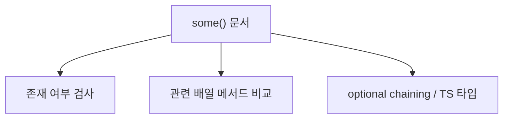
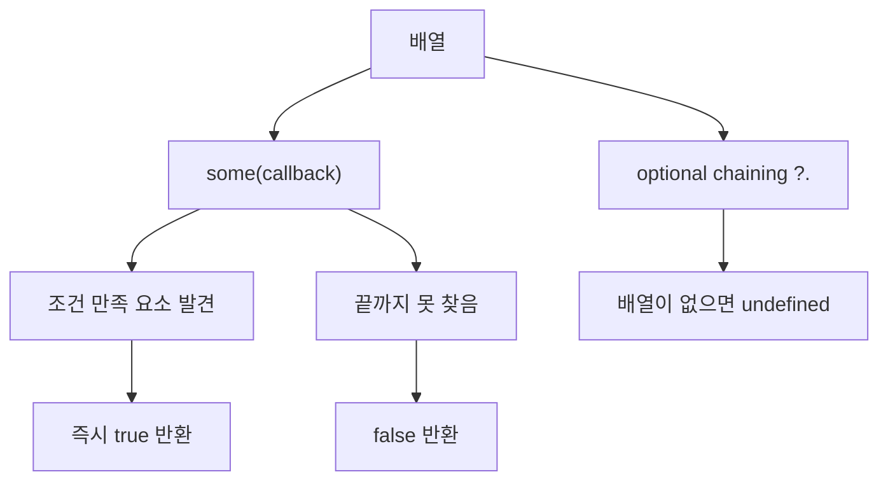
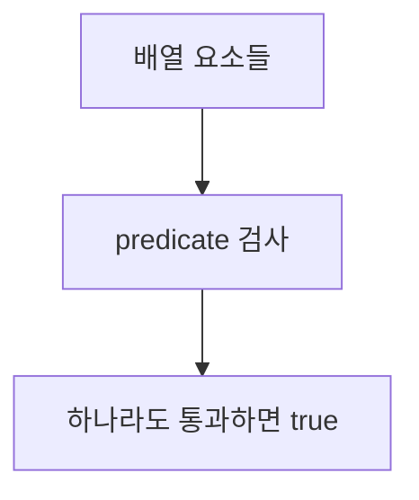
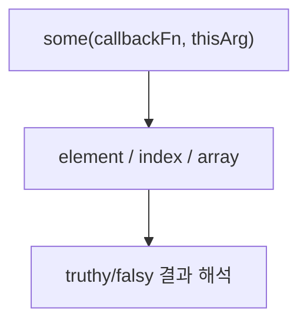
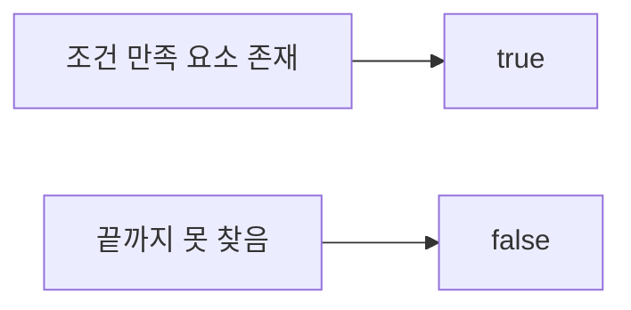
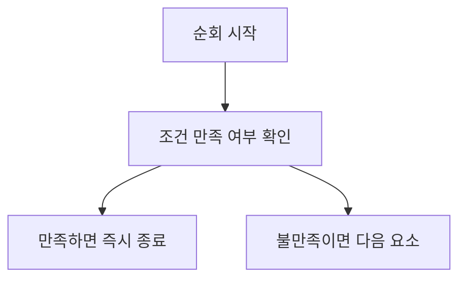
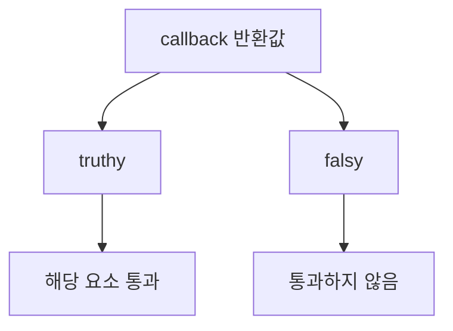

# Array.prototype.some()와 관련 개념 정리

작성 기준일: 2026-04-16  
조사 방식: 웹검색 기반 최신 조사  
주요 참고: `developer.mozilla.org` 공식 MDN 문서

## 1. 문서 목적


이 문서는 JavaScript의 `Array.prototype.some()`을 중심으로, 함께 자주 헷갈리는 관련 개념들을 한 파일에 묶어 정리한 학습 문서다.

특히 아래를 함께 설명한다.

- `some()`의 정확한 의미
- callback이 언제 멈추는가
- `some()`이 반환하는 값
- `optional chaining`과 같이 쓰면 결과 타입이 어떻게 달라지는가
- `every()`, `find()`, `filter()`, `includes()`와는 무엇이 다른가
- sparse array와 빈 배열에서 어떻게 동작하는가
- `some()`을 언제 쓰면 좋고, 언제 다른 메서드가 더 맞는가

즉 이 문서는 단순히 "`some()`은 하나라도 있으면 true"라는 한 줄 설명에서 멈추지 않고, "`배열 조건 검사 메서드들 사이의 차이`"를 같이 정리하려는 문서다.

---

## 2. 먼저 예시 코드부터 읽기



질문에 나온 코드:

```ts
isRecording: e.holes?.some((hole) => hole.isRecordingSection)
```

이 코드를 JavaScript/TypeScript 관점에서 읽으면:

- `e.holes`가 존재하면
- 배열의 각 `hole`을 검사해서
- `hole.isRecordingSection`이 truthy인 요소가 하나라도 있으면 `true`
- 하나도 없으면 `false`
- 그런데 `e.holes` 자체가 `null` 또는 `undefined`면
- `?.` 때문에 `some()`을 아예 호출하지 않고 `undefined`

가 된다.

즉 이 표현식의 결과는 문맥상:

- `true`
- `false`
- `undefined`

중 하나일 수 있다.

### 2.1 핵심 의미를 자연어로 바꾸면

이 코드는 사실상:

- "`holes`가 있으면, 그 중 녹화 구간(`isRecordingSection`)인 항목이 하나라도 있는지 검사"

라는 뜻이다.

### 2.2 왜 `some()`이 잘 맞나

검사 목표가:

- "모든 요소"가 아니라
- "하나라도 있는가"

이기 때문이다.

즉 이 문제는 `some()`이 가장 자연스럽다.

---

## 3. `some()`이란 무엇인가


MDN `Array.prototype.some()`은 `some()`을:

- 배열 요소 중
- 제공된 테스트 함수를 만족하는 요소가 하나라도 있는지 검사하는 메서드

라고 설명한다.

### 3.1 한 줄 정의

`some()`은:

- "존재 여부(existence check)"

를 묻는 배열 메서드다.

즉:

- 조건을 만족하는 것이 하나라도 있으면 `true`
- 없으면 `false`

다.

### 3.2 수학적 감각

`some()`은 수학의 "there exists"와 비슷한 감각이다.

즉:

- "어떤 원소 하나라도 조건을 만족하는가?"

를 묻는다.

반대로 `every()`는:

- "모든 원소가 조건을 만족하는가?"

를 묻는다.

즉 `some`과 `every`는 서로 짝을 이루는 경우가 많다.

---

## 4. 기본 문법


MDN 기준 문법:

```js
some(callbackFn)
some(callbackFn, thisArg)
```

### 4.1 `callbackFn`

배열 요소마다 실행할 함수다.

보통 인자는 아래를 받는다.

- `element`
- `index`
- `array`

즉:

```js
arr.some((element, index, array) => {
  // ...
})
```

형태다.

### 4.2 `thisArg`

callback 실행 시 `this`로 쓸 값을 넘길 수 있다.

다만 화살표 함수에서는 `thisArg`가 사실상 의미가 없다.

즉 일반 함수 callback일 때만 주로 의미가 있다.

---

## 5. 반환값


MDN은 `some()`의 반환값을 다음처럼 설명한다.

- 조건을 만족하는 요소를 찾으면 즉시 `true`
- 끝까지 못 찾으면 `false`

### 5.1 중요한 점

`some()`은:

- `map()`처럼 새 배열을 만들지 않고
- `find()`처럼 요소를 반환하지도 않고
- 오직 `boolean`

을 반환한다.

즉 이 메서드의 목적은 "조건 만족 여부" 하나다.

### 5.2 예시

```js
[1, 2, 3, 4].some((x) => x % 2 === 0) // true
[1, 3, 5].some((x) => x % 2 === 0)    // false
```

---

## 6. short-circuit: 하나 찾으면 바로 멈춘다


MDN은 `some()`이 조건을 만족하는 요소를 찾으면 즉시 `true`를 반환하고 순회를 멈춘다고 설명한다.

### 6.1 왜 중요한가

즉 `some()`은:

- 끝까지 항상 다 도는 것이 아니라
- 답이 정해지는 순간 멈춘다

이건 성능과 의미 둘 다 중요하다.

### 6.2 예시

```js
[10, 20, 30, 40].some((x) => {
  console.log(x)
  return x > 15
})
```

이 코드는:

- `10` 검사
- `20` 검사 후 `true`
- 그 뒤 `30`, `40`는 검사하지 않을 수 있다

즉 존재 확인에 적합한 이유가 여기에 있다.

### 6.3 실무 감각

질문 코드:

```ts
e.holes?.some((hole) => hole.isRecordingSection)
```

도 마찬가지다.

첫 번째 녹화 구간을 찾는 순간:

- 더 이상 나머지 `hole`들을 볼 필요가 없으므로
- 검사 비용을 줄일 수 있다

즉 이 문제는 `filter().length > 0`보다 `some()`이 더 의도에 맞고 덜 낭비적이다.

---

## 7. callback은 무엇을 반환해야 하나


MDN은 `callbackFn`이:

- truthy면 통과
- falsy면 미통과

로 해석된다고 설명한다.

즉 꼭 `true`/`false`만 반환할 필요는 없다.

### 7.1 예시

```js
["", "", "x"].some((x) => x)
// true
```

왜냐하면:

- `""`는 falsy
- `"x"`는 truthy

기 때문이다.

### 7.2 하지만 실무에서는 명시성이 중요하다

보통은 아래처럼 쓰는 편이 더 읽기 쉽다.

```js
users.some((user) => user.age >= 18)
```

즉 callback은 truthy/falsy로 해석되지만, 가능한 한 boolean 의미가 분명한 식으로 쓰는 편이 좋다.

### 7.3 질문 코드와 연결

```ts
e.holes?.some((hole) => hole.isRecordingSection)
```

여기서 `hole.isRecordingSection`이 이미 boolean이라면 매우 자연스럽다.

즉 callback이 바로 "이 요소가 조건을 만족하는가"를 반환하고 있다.

---

## 8. 빈 배열에서는 어떻게 되나

MDN은 `some()`이 빈 배열에 대해서는 어떤 조건이든 `false`를 반환한다고 설명한다.

예:

```js
[].some(() => true)  // false
[].some(() => false) // false
```

### 8.1 왜 그런가

빈 배열에는:

- 조건을 만족하는 요소가 "하나라도" 존재할 수 없기 때문이다

즉 존재성 검사 관점에서 자연스럽다.

### 8.2 `every()`와 대비

반대로 `every()`는 빈 배열에 대해 `true`를 반환한다.

즉:

- `some([])` -> false
- `every([])` -> true

이 차이는 자주 헷갈린다.

---

## 9. sparse array에서는 어떻게 되나

MDN은 `some()`이 sparse array의 empty slot에 대해서는 callback을 호출하지 않는다고 설명한다.

예:

```js
[1, , 3].some((x) => x === undefined) // false
```

왜냐하면:

- 가운데 empty slot은 실제 값 `undefined`가 아니라
- "비어 있는 슬롯"이라 callback 대상이 아니기 때문이다

### 9.1 `undefined`와 empty slot은 다르다

예:

```js
[1, undefined, 3].some((x) => x === undefined) // true
```

즉:

- `undefined` 값은 실제 요소라 검사 대상
- empty slot은 검사 자체 안 함

이다.

### 9.2 실무 감각

보통 일반 애플리케이션 배열은 sparse array가 드물어서 크게 신경 안 쓸 수 있다.

하지만 배열 구멍(hole)이 생길 수 있는 코드라면:

- `some`
- `map`
- `filter`

같은 메서드가 empty slot을 어떻게 다루는지 알아야 한다.

---

## 10. `some()`은 generic이다

MDN은 `some()`이 generic이라고 설명한다.

즉 실제 Array 인스턴스가 아니어도:

- `length`
- 정수 키

만 있으면 쓸 수 있다.

예:

```js
const arrayLike = {
  length: 3,
  0: "a",
  1: "b",
  2: "c",
};

Array.prototype.some.call(arrayLike, (x) => x === "b") // true
```

### 10.1 왜 중요한가

즉 `some()`은 "배열 메서드"이지만, 더 정확히는:

- array-like object를 대상으로도 동작 가능한 iterative method

다.

### 10.2 실무에서는?

실무에서는 주로:

- 배열
- NodeList를 배열로 바꾼 뒤
- 혹은 직접 `call/apply`

하는 식으로 가끔 쓴다.

다만 요즘은 `Array.from()`이나 spread로 먼저 배열화하는 편이 더 읽기 쉬운 경우가 많다.

---

## 11. 질문 예시를 정확히 해석하기

다시 예시:

```ts
isRecording: e.holes?.some((hole) => hole.isRecordingSection)
```

### 11.1 `e.holes`

이건 배열일 가능성이 높다.

예:

```ts
type Hole = { isRecordingSection: boolean }
type E = { holes?: Hole[] }
```

### 11.2 `?.`

MDN `Optional chaining`은 `?.`가:

- 왼쪽이 `null` 또는 `undefined`면
- short-circuit해서 `undefined`를 반환한다고

설명한다.

즉:

- `e.holes`가 있으면 `some()` 호출
- 없으면 `undefined`

다.

### 11.3 `some(...)`

배열 요소 중:

- `hole.isRecordingSection`이 truthy인 것이 하나라도 있으면 `true`
- 전부 falsy면 `false`

### 11.4 최종 결과 타입

즉 이 표현식의 결과는 보통:

```ts
boolean | undefined
```

가 된다.

### 11.5 만약 항상 boolean이 필요하면

예:

```ts
isRecording: !!e.holes?.some((hole) => hole.isRecordingSection)
```

또는

```ts
isRecording: e.holes?.some((hole) => hole.isRecordingSection) ?? false
```

처럼 쓸 수 있다.

### 11.6 둘의 차이

```ts
!!e.holes?.some(...)
```

는 최종적으로 무조건 boolean으로 강제한다.

```ts
e.holes?.some(...) ?? false
```

는 `undefined`일 때만 `false`를 넣는다.

이 문맥에서는 보통 둘 다 같은 결과를 만들 수 있지만, 의도 표현은 `?? false`가 더 직접적일 때가 많다.

---

## 12. `some()`과 `every()`의 차이

MDN `every()`는:

- 하나라도 실패하면 `false`
- 전부 통과하면 `true`

라고 설명한다.

즉 둘은 서로 반대 방향의 질문이다.

### 12.1 `some`

- 하나라도 만족하면 `true`

### 12.2 `every`

- 모두 만족해야 `true`

### 12.3 예시

```js
const holes = [
  { isRecordingSection: false },
  { isRecordingSection: true },
];

holes.some((hole) => hole.isRecordingSection)  // true
holes.every((hole) => hole.isRecordingSection) // false
```

### 12.4 빈 배열에서의 차이

이건 꼭 같이 기억해야 한다.

- `[].some(...)` -> false
- `[].every(...)` -> true

즉 존재성 검사와 전체 검사는 빈 배열에서 서로 다르게 동작한다.

---

## 13. `some()`과 `find()`의 차이

MDN `find()`는:

- 조건을 만족하는 첫 번째 요소 자체를 반환하고
- 없으면 `undefined`

라고 설명한다.

즉:

- `some()`은 boolean
- `find()`는 요소 자체

를 반환한다.

### 13.1 예시

```js
const found = holes.find((hole) => hole.isRecordingSection)
const hasRecording = holes.some((hole) => hole.isRecordingSection)
```

결과:

- `found`는 객체 또는 `undefined`
- `hasRecording`은 `true`/`false`

### 13.2 언제 무엇을 쓰나

- 존재 여부만 필요 -> `some()`
- 실제 그 요소가 필요 -> `find()`

즉 질문 코드처럼 최종 상태 플래그를 만들 때는 `some()`이 더 자연스럽다.

---

## 14. `some()`과 `filter()`의 차이

MDN `filter()`는:

- 조건을 만족하는 모든 요소를 새 배열로 반환한다고

설명한다.

즉:

- `some()` = boolean
- `filter()` = 새 배열

이다.

### 14.1 왜 `filter().length > 0`보다 `some()`이 좋은가

예:

```js
holes.filter((hole) => hole.isRecordingSection).length > 0
```

도 가능하다.

하지만:

- 끝까지 다 순회할 수 있고
- 새 배열을 만들고
- 의도가 덜 직접적이다

반면:

```js
holes.some((hole) => hole.isRecordingSection)
```

는:

- 하나 찾으면 멈추고
- 새 배열 안 만들고
- 존재 여부라는 의도가 직접적이다

즉 존재성 질문에는 `some()`이 더 적절하다.

---

## 15. `some()`과 `includes()`의 차이

MDN `includes()`는:

- 배열에 특정 값이 존재하는지를 equality 기반으로 검사한다

즉:

- `includes()` = 값 자체 비교
- `some()` = callback 조건 비교

### 15.1 예시

```js
[1, 2, 3].includes(2) // true
[1, 2, 3].some((x) => x > 2) // true
```

### 15.2 언제 무엇을 쓰나

- 특정 원시값/참조가 배열에 있는가 -> `includes`
- 조건을 만족하는 요소가 있는가 -> `some`

즉 질문 코드처럼 객체 배열에서 특정 속성 조건을 보는 경우는 `includes()`가 아니라 `some()`이 맞다.

---

## 16. callback 인자: `element`, `index`, `array`

MDN `some()`은 callback이 아래 인자를 받는다고 설명한다.

- `element`
- `index`
- `array`

### 16.1 `element`

현재 요소다.

예:

```js
holes.some((hole) => hole.isRecordingSection)
```

여기서 `hole`이 `element`다.

### 16.2 `index`

현재 인덱스다.

예:

```js
arr.some((value, index) => index > 3 && value > 10)
```

### 16.3 `array`

원래 배열 자체다.

MDN의 예시처럼 중간 배열 상태를 보고 싶을 때 쓸 수 있다.

예:

```js
numbers.some((num, idx, arr) => {
  if (idx === 0) return false;
  return num <= arr[idx - 1];
});
```

즉 callback은 단순 요소뿐 아니라 배열 문맥도 볼 수 있다.

---

## 17. `thisArg`

`some(callbackFn, thisArg)` 형태도 있다.

### 17.1 의미

일반 함수 callback을 실행할 때 `this`로 사용할 값을 줄 수 있다.

### 17.2 예시

```js
const checker = {
  min: 10,
};

[5, 12, 3].some(function (x) {
  return x > this.min;
}, checker);
```

### 17.3 화살표 함수에서는 대개 의미 없다

화살표 함수는 lexical `this`를 가지므로, `thisArg`로 바꾸는 감각이 잘 맞지 않는다.

즉 현대 코드에서는 `thisArg`보다:

- 화살표 함수
- 클로저 변수 캡처

를 더 자주 쓴다.

---

## 18. 비동기와 `some()`

이건 매우 중요한 함정이다.

`some()`은 synchronous iterative method다.

즉 callback이 `async`여도:

- promise를 기다려서 참/거짓을 판단하는 메서드가 아니다

### 18.1 잘못 기대하기 쉬운 코드

```js
const result = arr.some(async (item) => {
  return await check(item);
});
```

이 코드는 보통 의도대로 "비동기 조건 검사"가 되지 않는다.

왜냐하면 `async` callback은 Promise를 반환하고, `some()`은 그 Promise를 기다리지 않기 때문이다.

### 18.2 실무 감각

비동기 조건 검사가 필요하면 보통:

- `Promise.all(...)` 후 결과 배열에 `some`
- `for...of` + `await`

같은 구조가 더 맞다.

즉 `some()`은 기본적으로 동기 predicate용이다.

---

## 19. TypeScript에서 `some()` 결과 타입

TypeScript에서는 일반적으로:

```ts
some(...)
```

의 결과는 `boolean`이다.

### 19.1 optional chaining과 결합하면

질문 코드처럼:

```ts
e.holes?.some(...)
```

을 쓰면 `holes`가 없을 수 있기 때문에 결과 타입은 대개:

```ts
boolean | undefined
```

가 된다.

### 19.2 항상 boolean이 필요하면

다음처럼 정리할 수 있다.

```ts
const isRecording = e.holes?.some((hole) => hole.isRecordingSection) ?? false;
```

이 패턴이 실무에서 특히 자주 보인다.

즉:

- 데이터 없으면 false
- 있으면 실제 some 결과

라는 의미를 분명히 할 수 있다.

---

## 20. 자주 하는 실수

### 20.1 `filter(...).length > 0`로 존재 여부 검사

가능하지만 비효율적이고 의도가 덜 직접적이다.

존재 여부만 보면 `some()`이 더 맞다.

### 20.2 `find()`와 헷갈림

`find()`는 요소를 주고, `some()`은 boolean을 준다.

### 20.3 빈 배열에서 `true`를 기대

`some()`은 빈 배열에 대해 무조건 `false`다.

### 20.4 `optional chaining` 결과를 항상 boolean이라고 착각

```ts
e.holes?.some(...)
```

은 `undefined`가 나올 수 있다.

### 20.5 `async some`을 기대

`some()`은 Promise-aware 조건 검사기가 아니다.

---

## 21. 실무 체크리스트

`some()`을 쓰기 전에 아래를 보면 된다.

### 21.1 내가 묻는 게 "하나라도 있는가"인가

그렇다면 `some()`이 맞다.

### 21.2 실제 요소가 필요한가

그렇다면 `find()`가 맞을 수 있다.

### 21.3 모두 만족하는지 검사하는가

그렇다면 `every()`가 맞다.

### 21.4 새 배열이 필요한가

그렇다면 `filter()`가 맞다.

### 21.5 값 자체 존재 여부인가

그렇다면 `includes()`가 맞을 수 있다.

### 21.6 optional chaining 때문에 `undefined`가 섞이나

그렇다면 `?? false` 같은 후처리가 필요한지 봐야 한다.

---

## 22. 한 문장 결론

`some()`은 배열 요소 중 조건을 만족하는 것이 하나라도 있는지 확인하는 존재성 검사 메서드이고, 짧게 끝나는 short-circuit 특성과 boolean 반환이 핵심이기 때문에, 실제 요소가 필요할 때는 `find()`, 모두 검사할 때는 `every()`, 새 배열이 필요할 때는 `filter()`, 값 자체 포함 여부를 볼 때는 `includes()`와 구분해서 써야 한다.

즉 질문의 예시처럼:

- "`holes`가 있으면"
- "그 안에 녹화 구간이 하나라도 있는가"

를 묻는 문제에는 `e.holes?.some((hole) => hole.isRecordingSection)`가 가장 자연스럽다.

---

## 23. 공식 출처

- MDN Array.prototype.some(): <https://developer.mozilla.org/en-US/docs/Web/JavaScript/Reference/Global_Objects/Array/some>
- MDN Array.prototype.every(): <https://developer.mozilla.org/en-US/docs/Web/JavaScript/Reference/Global_Objects/Array/every>
- MDN Array.prototype.find(): <https://developer.mozilla.org/en-US/docs/Web/JavaScript/Reference/Global_Objects/Array/find>
- MDN Array.prototype.filter(): <https://developer.mozilla.org/en-US/docs/Web/JavaScript/Reference/Global_Objects/Array/filter>
- MDN Array.prototype.includes(): <https://developer.mozilla.org/en-US/docs/Web/JavaScript/Reference/Global_Objects/Array/includes>
- MDN Optional chaining (`?.`): <https://developer.mozilla.org/en-US/docs/Web/JavaScript/Reference/Operators/Optional_chaining>
