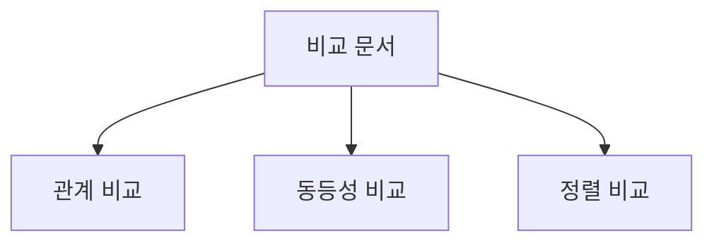
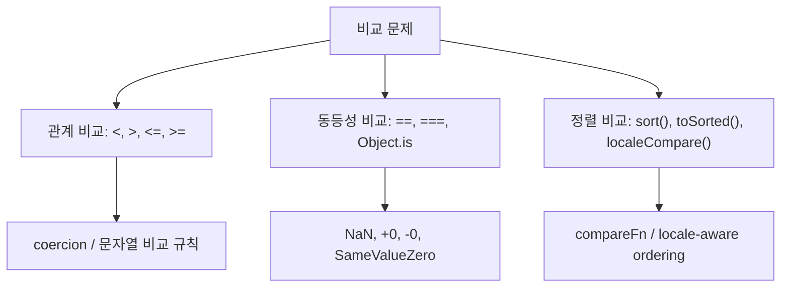
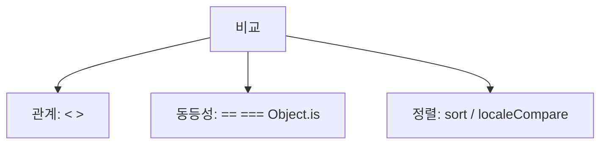
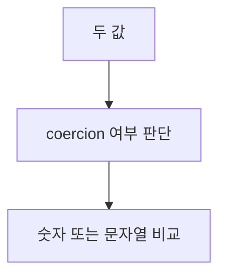
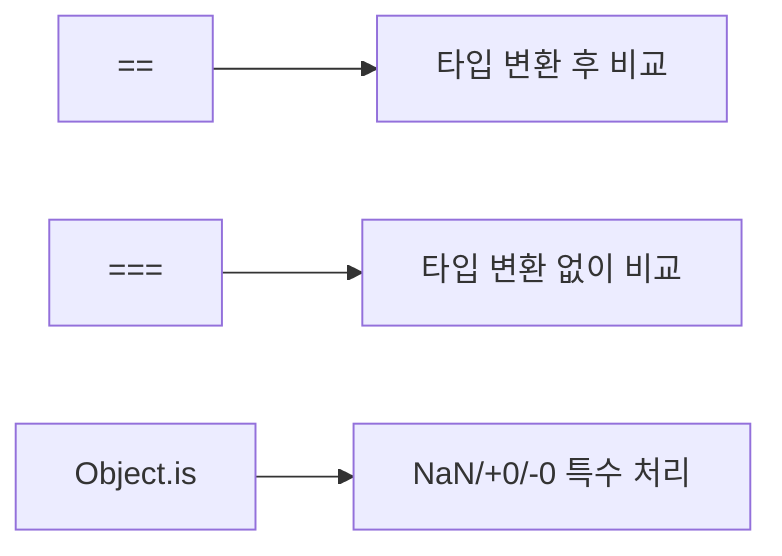
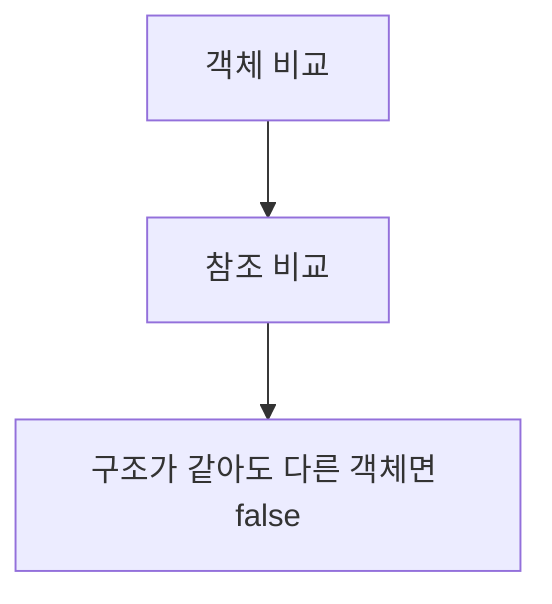
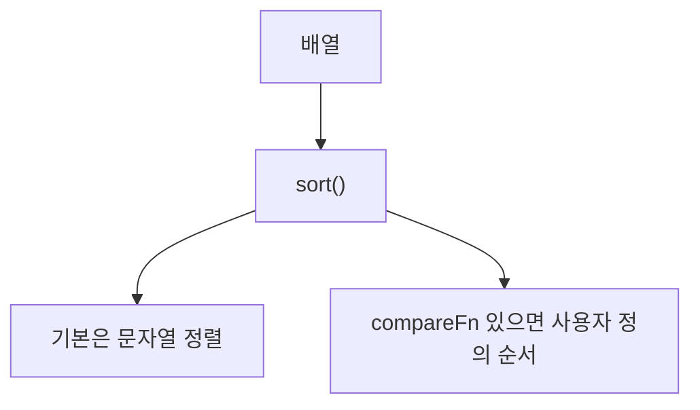

# 비교 로직과 정렬 관련 문법 정리

작성 기준일: 2026-04-14  
조사 방식: 웹검색 기반 최신 조사  
주요 참고: `developer.mozilla.org` 공식 MDN 문서

## 1. 문서 목적


이 문서는 JavaScript에서 자주 쓰는 `비교 관련 로직`을 한 파일로 묶어 정리한 학습 문서다.

특히 아래 주제를 중심으로 설명한다.

- `<`, `>`, `<=`, `>=` 같은 관계 비교
- `==`, `===`, `Object.is()` 같은 동등성 비교
- `Array.prototype.sort()`
- `Array.prototype.toSorted()`
- `String.prototype.localeCompare()`
- `Intl.Collator`
- 실무에서 자주 쓰는 comparator 패턴

즉 이 문서는 단순히 `localeCompare`나 `sort` 예제를 모은 문서가 아니라, "JavaScript가 값을 어떻게 비교하고, 어떤 규칙으로 정렬하는가"를 한 번에 이해하려는 문서다.

---

## 2. 먼저 한 줄 요약



JavaScript의 비교 로직은 크게 세 층으로 나뉜다.

- 값이 크냐 작으냐를 보는 `관계 비교`
- 값이 같으냐를 보는 `동등성 비교`
- 여러 값을 순서대로 재배열하는 `정렬 비교`

그리고 이 세 층은 서로 연결돼 있다.

- `<`, `>`는 coercion과 문자열 비교 규칙을 가진다
- `==`, `===`, `Object.is()`는 서로 다른 equality semantics를 가진다
- `sort()`는 compare function이 negative / positive / zero를 어떻게 반환하느냐에 따라 순서를 만든다

즉 `localeCompare`, `sort`, `===`는 따로따로 외우기보다 "`비교 규칙이 다르다`"는 관점으로 묶어 이해해야 한다.

---

## 3. 비교 로직 전체 지도


JavaScript에서 자주 만나는 비교는 아래처럼 나눌 수 있다.

### 3.1 관계 비교

- `<`
- `>`
- `<=`
- `>=`

질문:

- 누가 더 큰가
- 누가 더 작은가
- 순서를 정할 수 있는가

### 3.2 동등성 비교

- `==`
- `===`
- `Object.is()`
- SameValueZero 기반 비교 (`includes`, `Map`, `Set`)

질문:

- 두 값이 같은가
- 같은 타입까지 요구하는가
- `NaN`, `+0`, `-0`은 어떻게 볼 것인가

### 3.3 정렬 비교

- `sort()`
- `toSorted()`
- `localeCompare()`
- `Intl.Collator().compare`

질문:

- 배열을 어떤 순서로 재배열할 것인가
- 문자열을 어떤 언어 규칙으로 비교할 것인가
- 원본 배열을 바꿀 것인가

---

## 4. 관계 비교: `<`, `>`, `<=`, `>=`


### 4.1 기본 감각

MDN `Less than (<)`와 `Greater than (>)` 문서는 이 연산들이 단순 숫자 비교기처럼 보여도 실제로는 여러 단계 coercion을 거친다고 설명한다.

즉:

- 숫자끼리는 숫자 비교
- 문자열끼리는 문자열 비교
- 타입이 다르면 primitive 변환과 숫자 변환을 시도

라는 흐름이다.

### 4.2 숫자 비교

```js
5 < 10   // true
10 > 5   // true
3 <= 3   // true
3 >= 4   // false
```

이건 가장 직관적이다.

### 4.3 문자열 비교

문자열끼리는 숫자가 아니라 문자열 순서로 비교한다.

```js
"aa" < "ab"   // true
"b" > "a"     // true
"a" > "3"     // true
```

MDN은 문자열 비교가 UTF-16 code unit 기준이라고 설명한다.

즉 "사람이 기대하는 가나다/사전식"과 항상 일치하는 것은 아니다.

### 4.4 숫자처럼 보이는 문자열

```js
"5" > 3   // true
"3" > 5   // false
"3" < 5   // true
```

이 경우는 문자열이 숫자로 변환되어 비교된다.

즉 타입이 다를 때는 coercion이 들어갈 수 있다.

### 4.5 `NaN`과 `undefined`

MDN은 비교 과정에서 어느 한쪽이 `NaN`이 되면 결과가 `false`라고 설명한다.

```js
3 < NaN          // false
NaN < 3          // false
undefined < 3    // false
3 < undefined    // false
```

즉 비교가 "에러"가 아니라 `false`가 되는 경우가 많다.

### 4.6 중요한 예외 감각

```js
null < 1    // true
null > 0    // false
null == 0   // false
```

이런 결과는 처음 보면 이상하다.

왜냐하면:

- 관계 비교
- 동등성 비교

가 서로 다른 알고리즘을 쓰기 때문이다.

즉 비교 관련 버그를 줄이려면 "`같다`와 `크다/작다`는 다른 규칙"이라는 점을 기억해야 한다.

### 4.7 실무 권장

관계 비교는:

- 숫자는 number 상태로 만든 뒤 비교
- 문자열 정렬은 `localeCompare` / `Intl.Collator` 사용
- mixed type 비교는 피하기

가 기본 원칙이다.

---

## 5. 동등성 비교: `==`, `===`, `Object.is()`


### 5.1 세 가지 비교

MDN `Equality comparisons and sameness`는 JavaScript가 세 가지 주요 value-comparison operation을 제공한다고 설명한다.

- `===`
- `==`
- `Object.is()`

그리고 built-in 일부는 `SameValueZero`라는 또 다른 규칙을 쓴다.

### 5.2 `===`

MDN `Strict equality` 문서는 `===`가 타입 변환 없이 비교한다고 설명한다.

```js
1 === 1        // true
"1" === 1      // false
0 === false    // false
null === undefined // false
```

대부분의 애플리케이션 코드에서는 이 연산자를 기본으로 쓰는 것이 맞다.

### 5.3 `==`

MDN `Equality (==)`는 `==`가 타입이 다를 때 변환을 시도한 뒤 비교한다고 설명한다.

```js
"1" == 1          // true
0 == false        // true
"" == 0           // true
null == undefined // true
```

즉 읽는 사람이 예측하기 어려운 결과가 많다.

실무에서는 특별한 이유가 없으면 피하는 편이 안전하다.

### 5.4 `Object.is()`

MDN `Object.is()`는 two values가 same value인지 판단한다고 설명한다.

중요한 차이:

- `Object.is(NaN, NaN)`는 `true`
- `Object.is(+0, -0)`는 `false`

반면:

- `NaN === NaN`는 `false`
- `+0 === -0`는 `true`

### 5.5 SameValueZero

MDN equality guide는 SameValueZero가 `includes`, `Map`, `Set` 같은 built-in에서 쓰인다고 설명한다.

핵심 차이:

- `NaN`을 같다고 본다
- `+0`과 `-0`도 같다고 본다

즉:

```js
[NaN].includes(NaN) // true
[NaN].indexOf(NaN)  // -1
```

이 차이가 생긴다.

### 5.6 실무 결론

- 일반 비교: `===`
- `NaN`과 signed zero까지 특별히 다뤄야 함: `Object.is()`
- 배열 검색에서 `NaN` 포함 여부: `includes()`

정도로 기억하면 된다.

---

## 6. 객체 비교는 내용 비교가 아니다


이건 반드시 알고 있어야 한다.

```js
{ a: 1 } === { a: 1 }      // false
Object.is({ a: 1 }, { a: 1 }) // false
```

왜냐하면 객체 비교는 구조가 아니라 참조를 보기 때문이다.

즉:

- 같은 모양의 객체 두 개
- 같은 메모리의 객체 한 개를 가리키는 두 변수

는 전혀 다르다.

```js
const a = { x: 1 }
const b = a

a === b // true
```

즉 객체의 "내용 비교"가 필요하면:

- 직접 필드 비교
- 커스텀 comparator
- deep-equal 유틸

이 필요하다.

---

## 7. `Array.prototype.sort()` 기본 규칙


### 7.1 가장 중요한 사실

MDN `Array.prototype.sort()`는 `sort()`가 배열을 `in place`로 정렬하고, 같은 배열 참조를 반환한다고 설명한다.

즉:

- 원본 배열이 바뀐다
- 새 배열을 만들어 주지 않는다

예:

```js
const numbers = [3, 1, 4]
const sorted = numbers.sort()

console.log(numbers === sorted) // true
```

### 7.2 기본 정렬은 숫자 정렬이 아니다

MDN은 compareFn이 없으면 요소를 문자열로 바꾼 뒤 UTF-16 code unit 순서로 비교한다고 설명한다.

즉:

```js
[1, 30, 4, 21, 100000].sort()
// [1, 100000, 21, 30, 4]
```

왜냐하면:

- `"100000"`
- `"21"`
- `"30"`
- `"4"`

를 문자열로 비교하기 때문이다.

### 7.3 `undefined`와 빈 슬롯

MDN은 `undefined` 요소와 sparse array의 empty slot이 뒤로 간다고 설명한다.

즉:

- `undefined`는 맨 뒤
- compareFn은 `undefined`에 대해 호출되지 않을 수 있음

을 기억하면 좋다.

### 7.4 시간 복잡도는 보장되지 않는다

MDN은 `sort()`의 시간/공간 복잡도가 구현에 따라 달라 보장되지 않는다고 설명한다.

즉 엔진 구현 세부사항을 전제로 성능을 단정하면 안 된다.

---

## 8. compare function 규칙

### 8.1 기본 시그니처

MDN 기준 `compareFn`은 아래처럼 동작한다.

```js
arr.sort((a, b) => {
  // a가 b보다 앞이면 음수
  // a가 b보다 뒤면 양수
  // 같으면 0 또는 NaN
})
```

즉 핵심은:

- 음수 -> `a` 먼저
- 양수 -> `b` 먼저
- 0 -> 순서 유지 가능

이다.

### 8.2 숫자 정렬 기본형

```js
numbers.sort((a, b) => a - b)
```

이건 오름차순 숫자 정렬의 대표 패턴이다.

```js
numbers.sort((a, b) => b - a)
```

는 내림차순이다.

### 8.3 꼭 `-1`, `0`, `1`만 반환할 필요는 없다

MDN은 음수/양수/0만 중요하다고 설명한다.

즉 아래도 가능하다.

```js
(a, b) => a - b
```

굳이:

```js
if (a < b) return -1
if (a > b) return 1
return 0
```

로만 쓸 필요는 없다.

### 8.4 compareFn이 지켜야 할 성질

MDN은 comparator가 잘 동작하려면 아래 성질을 기대한다고 설명한다.

- pure
- stable result
- reflexive
- anti-symmetric
- transitive

즉 compareFn은 대충 만들어도 되는 함수가 아니다.

### 8.5 잘못된 comparator 예시

예를 들어:

```js
(a, b) => (a > b ? 1 : 0)
```

같은 함수는 anti-symmetry를 깨뜨릴 수 있다.

즉 comparator가 "정렬 규칙"으로서 일관적이어야 한다.

### 8.6 compareFn 안에서 부수효과를 넣지 말 것

정렬 엔진은 compareFn을 언제 몇 번 호출할지 보장하지 않는다.

즉 아래 같은 코드는 위험하다.

```js
arr.sort((a, b) => {
  console.log(a, b)
  externalState++
  return a - b
})
```

로그 정도는 디버깅용으로 쓸 수 있지만, 외부 상태를 바꾸는 로직은 comparator 안에 두지 않는 편이 좋다.

---

## 9. `sort()`는 안정 정렬인가

### 9.1 현재 기준

MDN은 ECMAScript 2019부터 `Array.prototype.sort()`가 stable이라고 설명한다.

즉 비교 결과가 같은 요소끼리는 원래 순서가 유지된다.

### 9.2 왜 중요한가

예:

```js
const students = [
  { name: "Alex", grade: 15 },
  { name: "Devlin", grade: 15 },
  { name: "Eagle", grade: 13 },
]

students.sort((a, b) => a.grade - b.grade)
```

grade가 같은 `Alex`, `Devlin`은 기존 순서를 유지한다.

즉 multi-step 정렬, secondary key 보존에 중요하다.

### 9.3 실무 감각

stable sort가 있더라도:

- secondary key를 명시하면 더 읽기 쉽고
- 엔진 동작 가정 없이 의도를 드러낼 수 있다

즉 안정 정렬을 "보너스"로 보고, 필요한 정렬 기준은 코드에 직접 쓰는 편이 좋다.

---

## 10. `toSorted()`는 언제 써야 하나

### 10.1 정체

MDN `toSorted()`는 `sort()`의 copying version이라고 설명한다.

즉:

- `sort()`는 원본 변경
- `toSorted()`는 새 배열 반환

이다.

### 10.2 예시

```js
const values = [3, 1, 4]
const sorted = values.toSorted((a, b) => a - b)

console.log(values) // [3, 1, 4]
console.log(sorted) // [1, 3, 4]
```

### 10.3 언제 유리한가

- React/Vue 상태를 불변적으로 다룰 때
- 원본 배열을 보존해야 할 때
- 함수형 스타일을 유지하고 싶을 때

즉 현대 프런트엔드 코드에서는 `toSorted()`가 더 안전한 경우가 많다.

### 10.4 구형 런타임 대응

`toSorted()`는 비교적 최근 메서드이므로, 런타임 호환성이 문제라면 아래처럼 shallow copy 후 `sort()`를 쓸 수 있다.

```js
const sorted = [...values].sort((a, b) => a - b)
```

---

## 11. 문자열 정렬과 `localeCompare()`

### 11.1 왜 기본 `sort()`만으로는 부족한가

MDN `sort()`는 비 ASCII 문자열 정렬에는 `localeCompare()` 사용을 권장한다.

즉 아래처럼 단순 `sort()`는 언어 감각과 어긋날 수 있다.

```js
["réservé", "Premier", "café"].sort()
```

### 11.2 `localeCompare()` 기본 규칙

MDN `String.prototype.localeCompare()`는 문자열이 sort order상 앞/뒤/같음을 나타내는 number를 반환한다고 설명한다.

즉:

- 음수면 앞
- 양수면 뒤
- 0이면 같음

이다.

```js
"a".localeCompare("c")   // negative
"c".localeCompare("a")   // positive
"a".localeCompare("a")   // 0
```

### 11.3 중요한 포인트: 정확히 `-1`, `1`이라고 가정하면 안 된다

MDN은 exact return values of `-1` or `1`에 의존하지 말라고 경고한다.

즉:

```js
if (a.localeCompare(b) === -1) { ... }
```

처럼 쓰면 안 된다.

올바른 감각:

```js
if (a.localeCompare(b) < 0) { ... }
if (a.localeCompare(b) > 0) { ... }
```

### 11.4 정렬에 바로 쓰기

```js
items.sort((a, b) => a.localeCompare(b))
```

이 패턴은 문자열 정렬에서 매우 흔하다.

### 11.5 locale과 options를 주는 이유

MDN은 `locales`와 `options`로 언어와 비교 정책을 조정할 수 있다고 설명한다.

예:

```js
"ä".localeCompare("z", "de") // German
"ä".localeCompare("z", "sv") // Swedish
```

즉 같은 문자열도 locale에 따라 순서가 달라질 수 있다.

### 11.6 대표 옵션

자주 쓰는 옵션:

- `sensitivity`
- `ignorePunctuation`
- `numeric`
- `caseFirst`

예:

```js
a.localeCompare(b, "en", { sensitivity: "base" })
```

이건 대소문자/악센트 차이를 덜 민감하게 볼 때 자주 쓴다.

### 11.7 `numeric: true`

이 옵션도 중요하다.

```js
["2", "10", "1"].sort((a, b) =>
  a.localeCompare(b, "en", { numeric: true })
)
// ["1", "2", "10"]
```

즉 문자열이지만 "자연스러운 숫자 순서"처럼 보이게 만들 수 있다.

---

## 12. `Intl.Collator`

### 12.1 정체

MDN `Intl.Collator`는 language-sensitive string comparison을 가능하게 하는 객체라고 설명한다.

즉 문자열 비교를 위한 "설정 가능한 비교기"라고 보면 된다.

### 12.2 왜 `localeCompare`만으로 충분하지 않을 때가 있나

MDN은 대량 문자열 비교에서는 `Intl.Collator`를 한 번 만들고 그 `compare()`를 쓰는 편이 좋다고 설명한다.

즉:

- 한 번만 비교 -> `localeCompare()`
- 대량 정렬 / 반복 비교 -> `Intl.Collator().compare`

가 더 적합할 수 있다.

### 12.3 예시

```js
const collator = new Intl.Collator("ko", {
  sensitivity: "base",
  numeric: true,
})

items.sort(collator.compare)
```

### 12.4 장점

- locale 설정 재사용
- 옵션 재사용
- 대량 정렬에서 성능상 이점 가능
- 코드 의도 명확

즉 문자열 정렬 정책이 자주 반복되면 `Intl.Collator`를 쓰는 편이 더 좋다.

---

## 13. 숫자 정렬 패턴

### 13.1 오름차순

```js
numbers.sort((a, b) => a - b)
```

### 13.2 내림차순

```js
numbers.sort((a, b) => b - a)
```

### 13.3 `NaN`이 섞이면

`a - b`는 `NaN`이 끼면 comparator 결과도 `NaN`이 될 수 있다.

MDN은 `0` 또는 `NaN`이면 equal로 간주된다고 설명한다.

즉 `NaN`이 섞인 데이터는 정렬 결과가 애매해질 수 있으므로, 먼저 필터링하거나 명시적으로 처리하는 편이 좋다.

### 13.4 null/undefined가 섞인 경우

실무에서는 다음처럼 별도 처리하는 패턴이 자주 나온다.

```js
items.sort((a, b) => {
  if (a == null && b == null) return 0
  if (a == null) return 1
  if (b == null) return -1
  return a - b
})
```

즉 null-last / null-first 정책을 코드에 직접 쓰는 편이 안전하다.

---

## 14. 문자열 정렬 패턴

### 14.1 단순 ASCII 느낌

```js
words.sort()
```

이건 code unit 기준이다.

영어 소문자/대문자 섞임, 악센트, 한글/다국어에는 부자연스러울 수 있다.

### 14.2 대소문자 무시 느낌

```js
words.sort((a, b) =>
  a.localeCompare(b, "en", { sensitivity: "base" })
)
```

### 14.3 사용자 locale 반영

앱 UI 언어가 정해져 있다면 그 locale을 명시하는 편이 좋다.

```js
words.sort((a, b) => a.localeCompare(b, "ko"))
```

### 14.4 성능과 재사용이 중요할 때

```js
const compareKo = new Intl.Collator("ko", {
  sensitivity: "base",
  numeric: true,
}).compare

words.sort(compareKo)
```

---

## 15. 객체 배열 정렬 패턴

### 15.1 숫자 필드 기준

```js
users.sort((a, b) => a.age - b.age)
```

### 15.2 문자열 필드 기준

```js
users.sort((a, b) => a.name.localeCompare(b.name, "ko"))
```

### 15.3 다중 키 정렬

실무에서 매우 흔하다.

```js
users.sort((a, b) => {
  const ageDiff = a.age - b.age
  if (ageDiff !== 0) return ageDiff
  return a.name.localeCompare(b.name, "ko")
})
```

즉:

- 1차 키: age
- 2차 키: name

정렬을 명시한다.

### 15.4 날짜 정렬

```js
posts.sort((a, b) =>
  new Date(a.createdAt) - new Date(b.createdAt)
)
```

다만 `Date` 객체를 comparator 안에서 계속 만드는 것은 비용이 있을 수 있다.

값이 많으면 미리 timestamp로 바꾸는 편이 좋다.

### 15.5 boolean 정렬

```js
items.sort((a, b) => Number(b.isPinned) - Number(a.isPinned))
```

즉 true를 앞으로 보내려면 숫자로 바꾸는 패턴도 자주 쓴다.

---

## 16. 정렬 성능과 map-sort 패턴

MDN `sort()`는 compareFn이 요소당 여러 번 호출될 수 있으므로, compareFn이 무거우면 `map()`으로 미리 정렬 키를 추출하는 방식이 더 효율적일 수 있다고 설명한다.

### 16.1 문제 상황

```js
items.sort((a, b) => expensive(a) - expensive(b))
```

이 경우 `expensive()`가 매우 많이 호출될 수 있다.

### 16.2 개선 패턴

```js
const mapped = items.map((item, index) => ({
  index,
  sortKey: expensive(item),
}))

mapped.sort((a, b) => a.sortKey - b.sortKey)

const result = mapped.map(({ index }) => items[index])
```

즉:

- 정렬 키를 한 번 계산하고
- 그 키로만 정렬

하는 방식이다.

이건 Schwartzian transform 비슷한 패턴으로 이해하면 된다.

---

## 17. 자주 하는 실수

### 17.1 숫자 배열에 그냥 `sort()`

```js
[1, 30, 4].sort()
```

이건 숫자 오름차순이 아니다.

### 17.2 `sort()`가 원본을 바꾸는 걸 잊음

```js
const sorted = items.sort(...)
```

이 코드는 `items`도 같이 바뀐다.

상태 관리 코드에서는 특히 위험하다.

### 17.3 `localeCompare()`가 꼭 `-1`, `1`을 준다고 가정

```js
if (a.localeCompare(b) === 1) ...
```

이건 브라우저/엔진에 따라 틀릴 수 있다.

### 17.4 comparator가 boolean을 반환

```js
arr.sort((a, b) => a > b)
```

이 코드는 `true`/`false`를 반환하므로 comparator 계약에 맞지 않는다.

일부 상황에서는 얼핏 동작해 보여도 신뢰할 수 없다.

### 17.5 mixed type 정렬을 대충 처리

```js
[1, "2", null, undefined, "10"].sort(...)
```

이런 데이터는 먼저 타입 정책부터 정해야 한다.

정렬은 결국 "순서를 정의하는 일"이므로, 순서 정의가 불명확하면 버그가 난다.

---

## 18. 실무 체크리스트

### 18.1 숫자 배열인가

- 그렇다면 `a - b` / `b - a`
- `NaN`, `null`, `undefined` 처리 정책 필요 여부 확인

### 18.2 문자열 배열인가

- 영어만인가
- 다국어/악센트/숫자 포함 문자열인가
- 그럼 `localeCompare` 또는 `Intl.Collator`

### 18.3 객체 배열인가

- 1차 키, 2차 키를 명시했는가
- null-last / null-first 정책을 적었는가

### 18.4 원본 보존이 필요한가

- 필요하면 `toSorted()`
- 또는 `[...arr].sort(...)`

### 18.5 비교 연산 자체가 필요한가

- 대부분은 `===`
- 특별한 signed zero / NaN semantics가 필요하면 `Object.is()`
- `NaN` 포함 검색은 `includes()`

---

## 19. 추천 mental model

헷갈리지 않으려면 아래 순서로 생각하면 좋다.

### 19.1 지금 내가 묻는 게 "같은가"인가, "순서가 앞인가"인가

- 같음 -> equality
- 순서 -> relational / sort

### 19.2 정렬 기준이 숫자인가 문자열인가

- 숫자 -> `a - b`
- 문자열 -> `localeCompare` / `Intl.Collator`

### 19.3 원본을 바꿔도 되는가

- 바꿔도 되면 `sort()`
- 안 되면 `toSorted()`

### 19.4 locale이 중요한가

- 사용자 언어/다국어가 중요하면 locale-aware 비교가 필요하다

### 19.5 comparator가 일관적인가

- 같은 입력에 같은 결과
- 반대 순서면 반대 부호
- 다중 키가 필요하면 직접 명시

즉 비교 로직의 핵심은 "문법 암기"보다 "`어떤 순서를 정의하는가`를 명확히 하는 것"이다.

---

## 20. 한 문장 결론

JavaScript의 비교 로직은 `===`와 같은 동등성 비교, `<`와 같은 관계 비교, `sort()/localeCompare()` 같은 정렬 비교가 각각 다른 규칙을 갖기 때문에, 값을 비교할 때는 "무엇을 비교하는가", "타입이 무엇인가", "문자열이면 locale이 중요한가", "원본을 바꿔도 되는가"를 먼저 구분하는 것이 핵심이다.

즉 실무에서 중요한 것은 단순히 `sort` 문법을 아는 것이 아니라:

- 어떤 equality를 쓸지
- 어떤 comparator를 만들지
- 어떤 정렬 정책을 선언할지

를 일관되게 결정하는 감각이다.

---

## 21. 공식 출처

- MDN Array.prototype.sort(): <https://developer.mozilla.org/en-US/docs/Web/JavaScript/Reference/Global_Objects/Array/sort>
- MDN Array.prototype.toSorted(): <https://developer.mozilla.org/en-US/docs/Web/JavaScript/Reference/Global_Objects/Array/toSorted>
- MDN String.prototype.localeCompare(): <https://developer.mozilla.org/en-US/docs/Web/JavaScript/Reference/Global_Objects/String/localeCompare>
- MDN Intl.Collator: <https://developer.mozilla.org/en-US/docs/Web/JavaScript/Reference/Global_Objects/Intl/Collator>
- MDN Equality comparisons and sameness: <https://developer.mozilla.org/en-US/docs/Web/JavaScript/Guide/Equality_comparisons_and_sameness>
- MDN Equality (`==`): <https://developer.mozilla.org/en-US/docs/Web/JavaScript/Reference/Operators/Equality>
- MDN Strict equality (`===`): <https://developer.mozilla.org/en-US/docs/Web/JavaScript/Reference/Operators/Strict_equality>
- MDN Object.is(): <https://developer.mozilla.org/en-US/docs/Web/JavaScript/Reference/Global_Objects/Object/is>
- MDN Less than (`<`): <https://developer.mozilla.org/en-US/docs/Web/JavaScript/Reference/Operators/Less_than>
- MDN Greater than (`>`): <https://developer.mozilla.org/en-US/docs/Web/JavaScript/Reference/Operators/Greater_than>
