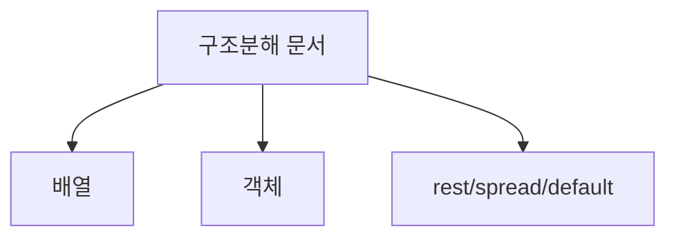
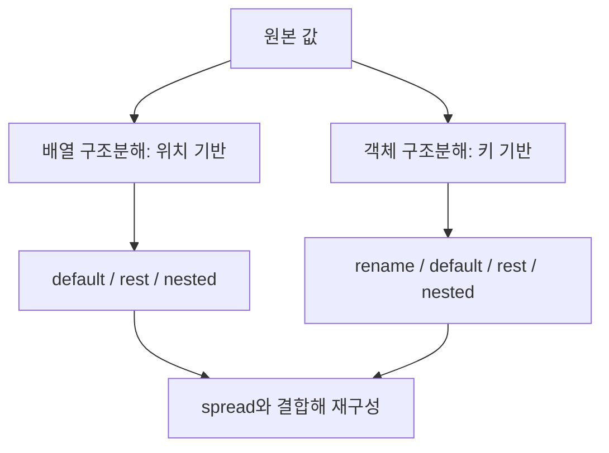
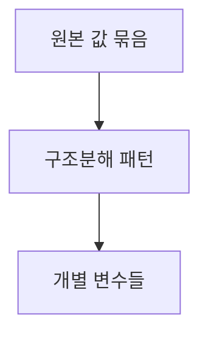
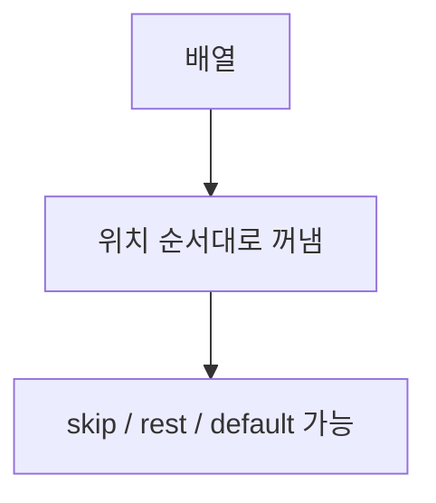
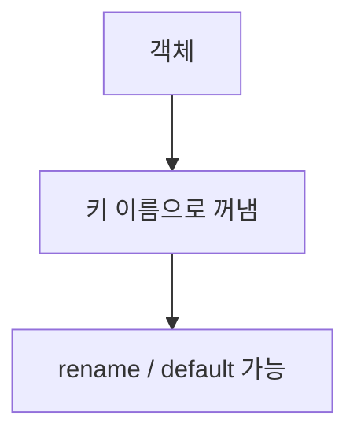
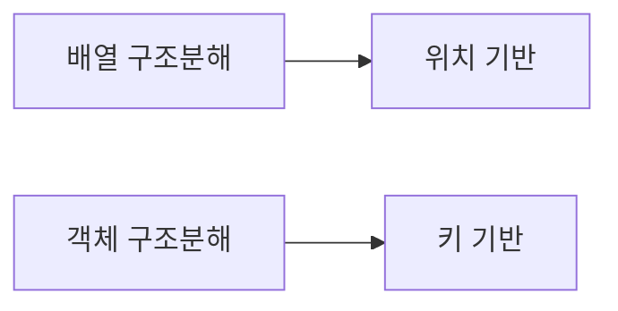
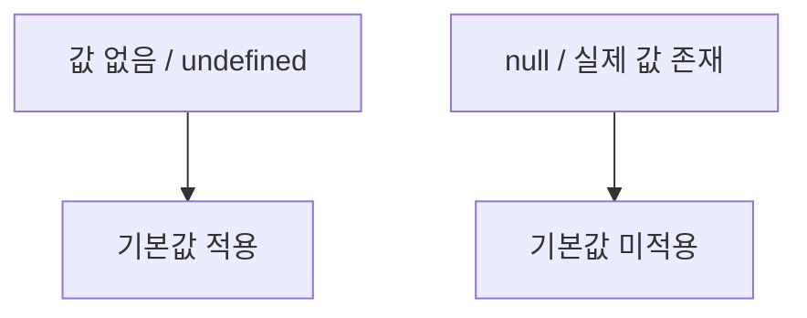

# 구조분해할당과 비슷한 개념 정리

작성 기준일: 2026-04-14  
조사 방식: 웹검색 기반 최신 조사  
주요 참고: `developer.mozilla.org` 공식 MDN 문서

## 1. 문서 목적


이 문서는 JavaScript의 `구조분해할당(destructuring)`을 중심으로, 실무에서 자주 같이 헷갈리는 비슷한 개념들을 한 파일에 묶어 정리한 학습 문서다.

핵심 질문은 아래와 같다.

- 구조분해할당은 정확히 무엇을 하는가
- 배열 구조분해와 객체 구조분해는 어떻게 다른가
- `rest`와 `spread`는 왜 생김새는 같은데 역할이 다른가
- 기본값은 언제 적용되는가
- 함수 매개변수 구조분해는 왜 편하고 왜 위험할 수 있는가
- 객체 축약 속성명은 구조분해와 어떻게 다르고 왜 자주 헷갈리는가

즉 이 문서는 단순 문법 목록이 아니라, "`데이터를 꺼내고`, `나머지를 모으고`, `값을 펼치고`, `기본값을 채우는` 문법"을 하나의 흐름으로 이해하려는 문서다.

---

## 2. 먼저 한 줄 요약



`구조분해할당`은 배열이나 객체에서 값을 꺼내 개별 변수로 나누어 받는 문법이다.

예:

```js
const [first, second] = [10, 20]
const { name, age } = { name: "Kim", age: 30 }
```

즉:

- 배열은 "위치"로 꺼내고
- 객체는 "프로퍼티 이름"으로 꺼낸다

그리고 비슷한 개념인:

- `rest`
- `spread`
- `default value`
- `parameter destructuring`
- `object shorthand`

를 같이 이해해야 구조분해 문법이 덜 헷갈린다.

---

## 3. 구조분해할당이란 무엇인가


### 3.1 MDN 정의

MDN `Destructuring` 문서는 구조분해 문법을 배열의 값 또는 객체의 프로퍼티를 distinct variables로 unpack하는 문법이라고 설명한다.

즉 핵심은:

- 하나의 값 묶음에서
- 여러 조각을 꺼내
- 개별 변수에 나눠 담는 것

이다.

### 3.2 왜 유용한가

구조분해할당이 없으면 보통 이렇게 쓴다.

```js
const user = { id: 1, name: "Kim", age: 30 }

const id = user.id
const name = user.name
const age = user.age
```

구조분해를 쓰면:

```js
const user = { id: 1, name: "Kim", age: 30 }

const { id, name, age } = user
```

즉:

- 코드가 짧아지고
- 데이터 구조가 한눈에 보이고
- 필요한 값만 명시적으로 꺼내기 쉬워진다

### 3.3 "assignment"라고 부르는 이유

이 문법은:

- 새 변수를 선언하면서 쓸 수도 있고
- 이미 있는 변수에 다시 할당할 수도 있다

예:

```js
const [a, b] = [1, 2]
```

또는

```js
let a, b
[a, b] = [1, 2]
```

즉 "binding"과 "assignment" 두 느낌 모두 가진다.

MDN도 구조분해 패턴을 `binding pattern`과 `assignment pattern`으로 구분해 설명한다.

---

## 4. 배열 구조분해


### 4.1 가장 기본 형태

```js
const colors = ["red", "green", "blue"]
const [first, second, third] = colors

console.log(first)  // "red"
console.log(second) // "green"
console.log(third)  // "blue"
```

배열 구조분해의 핵심은 "순서"다.

- 첫 번째 변수는 첫 번째 값
- 두 번째 변수는 두 번째 값
- 세 번째 변수는 세 번째 값

즉 이름보다 위치가 중요하다.

### 4.2 일부만 받고 싶을 때

```js
const [first] = colors
```

처럼 일부만 받을 수 있다.

### 4.3 건너뛰기

```js
const [first, , third] = colors
```

이건 두 번째 값을 건너뛴다.

즉 배열 구조분해에서는 쉼표 위치 자체가 의미를 가진다.

### 4.4 원본보다 변수 개수가 많으면

MDN 예시처럼 왼쪽 변수가 더 많으면 남는 값은 `undefined`가 된다.

```js
const [a, b, c] = [1, 2]

console.log(a) // 1
console.log(b) // 2
console.log(c) // undefined
```

즉 구조분해가 실패하는 것이 아니라, 없는 자리만 `undefined`가 된다.

### 4.5 변수 교환

구조분해의 유명한 예시다.

```js
let a = 1
let b = 2

[a, b] = [b, a]
```

이 문법은 임시 변수 없이 값을 바꾸는 데 자주 쓰인다.

---

## 5. 객체 구조분해


### 5.1 가장 기본 형태

```js
const user = {
  id: 1,
  name: "Kim",
  age: 30,
}

const { id, name, age } = user
```

객체 구조분해의 핵심은 "프로퍼티 이름"이다.

배열과 달리:

- 순서는 중요하지 않고
- 어떤 이름의 프로퍼티를 꺼낼지가 중요하다

### 5.2 순서는 중요하지 않다

```js
const { age, id, name } = user
```

처럼 써도 결과는 같다.

즉 객체 구조분해는 위치가 아니라 key 기반이다.

### 5.3 없는 프로퍼티를 꺼내면

```js
const { email } = user

console.log(email) // undefined
```

즉 없는 키도 에러가 아니라 `undefined`가 된다.

### 5.4 왜 많이 쓰나

객체 구조분해는 특히 아래에서 자주 쓴다.

- 함수 인자에서 필요한 값만 꺼낼 때
- React/Vue props에서 필요한 필드만 쓸 때
- API 응답에서 일부 값만 꺼낼 때
- config 객체를 읽을 때

---

## 6. 배열과 객체 구조분해의 차이


### 6.1 배열은 위치 기반

```js
const [a, b] = [10, 20]
```

### 6.2 객체는 이름 기반

```js
const { a, b } = { a: 10, b: 20 }
```

### 6.3 왜 헷갈리나

둘 다 비슷한 대괄호/중괄호 모양을 쓰기 때문이다.

하지만 mental model은 다르다.

- 배열 구조분해: "몇 번째 값을 꺼낸다"
- 객체 구조분해: "어떤 이름의 프로퍼티를 꺼낸다"

이 차이를 먼저 잡아야 rest/spread/default까지 덜 꼬인다.

---

## 7. 기본값과 함께 쓰기


### 7.1 배열 기본값

MDN `Destructuring` 문서는 구조분해 자리마다 기본값을 넣을 수 있다고 설명한다.

```js
const [a = 1, b = 2] = [10]

console.log(a) // 10
console.log(b) // 2
```

즉 값이 없거나 `undefined`일 때만 기본값이 적용된다.

### 7.2 객체 기본값

```js
const user = { name: "Kim" }

const { name, age = 20 } = user

console.log(name) // "Kim"
console.log(age)  // 20
```

### 7.3 중요한 포인트: `undefined`일 때만 동작

이건 매우 중요하다.

```js
const [a = 100] = [null]
console.log(a) // null
```

즉:

- 값이 `undefined`면 기본값 사용
- 값이 `null`이면 기본값 사용 안 함

이 차이를 이해하지 못하면 `??`와 혼동하기 쉽다.

### 7.4 함수 기본값과도 연결된다

구조분해 기본값은 뒤에서 볼 `default parameters`와 성격이 비슷하다.

공통점:

- `undefined`일 때만 기본값을 적용한다

즉 JS 기본값 시스템은 대체로 "`undefined`를 비어 있음으로 본다"는 감각을 갖고 있다.

---

## 8. 변수 이름 바꾸기

### 8.1 객체 구조분해에서 자주 쓰는 패턴

```js
const user = { id: 1, name: "Kim" }

const { name: userName } = user

console.log(userName) // "Kim"
```

여기서 중요한 점:

- 원래 프로퍼티 이름은 `name`
- 새 변수 이름은 `userName`

이다.

즉 객체 구조분해는 "꺼내기"와 "이름 바꾸기"를 동시에 할 수 있다.

### 8.2 왜 유용한가

- 이미 같은 이름의 변수가 있을 때
- 의미를 더 분명하게 하고 싶을 때
- 충돌을 피하고 싶을 때

예:

```js
const response = { data: [1, 2, 3] }
const { data: items } = response
```

### 8.3 기본값과 같이 쓰기

```js
const { theme: currentTheme = "light" } = config
```

즉:

- `theme`를 꺼내고
- 변수명은 `currentTheme`
- 없으면 `"light"`

라는 뜻이다.

---

## 9. 중첩 구조분해

### 9.1 객체 안의 객체

```js
const user = {
  name: "Kim",
  address: {
    city: "Seoul",
    zip: "12345",
  },
}

const {
  address: { city, zip },
} = user
```

즉 중첩된 구조에서도 필요한 값만 바로 꺼낼 수 있다.

### 9.2 배열 안의 객체

```js
const users = [
  { id: 1, name: "Kim" },
  { id: 2, name: "Lee" },
]

const [{ name: firstUserName }] = users
```

### 9.3 편하지만 주의점도 있다

구조가 깊어질수록:

- 읽기 어려워지고
- 중간 값이 없을 때 에러가 날 수 있다

예:

```js
const {
  profile: { name },
} = user
```

이 코드는 `user.profile`이 `undefined`면 에러가 날 수 있다.

즉 깊은 중첩 구조분해는 강력하지만, 데이터 모양을 확신할 수 있을 때 쓰는 편이 좋다.

---

## 10. rest element / rest property

### 10.1 정체

구조분해 문법에서 `...rest`는 "남은 것들을 모으는" 역할을 한다.

예:

```js
const [first, ...rest] = [1, 2, 3, 4]

console.log(first) // 1
console.log(rest)  // [2, 3, 4]
```

### 10.2 객체에서도 가능하다

```js
const user = {
  id: 1,
  name: "Kim",
  age: 30,
}

const { id, ...rest } = user

console.log(id)   // 1
console.log(rest) // { name: "Kim", age: 30 }
```

즉:

- 배열에서는 남은 요소를 배열로 모으고
- 객체에서는 남은 프로퍼티를 객체로 모은다

### 10.3 왜 유용한가

- 일부만 분리하고 나머지를 유지하고 싶을 때
- props forwarding
- 옵션 객체 분리

예:

```js
const { password, ...safeUser } = user
```

### 10.4 제한 사항

rest는 보통 마지막에 와야 한다.

배열 예시:

```js
const [a, ...rest] = [1, 2, 3]
```

는 가능하지만,

```js
const [...rest, last] = [1, 2, 3]
```

는 허용되지 않는다.

즉 rest는 "남은 것 전부"를 받기 때문에 구조상 마지막 위치여야 한다.

---

## 11. spread syntax

### 11.1 왜 rest와 헷갈리나

MDN `Spread syntax (...)`는 spread가 iterable이나 객체의 값을 펼치는 문법이라고 설명한다.

생김새는 rest와 똑같이 `...`지만 역할은 반대다.

- rest: 여러 값을 모은다
- spread: 묶인 값을 펼친다

### 11.2 함수 호출에서 spread

```js
const nums = [1, 2, 3]

Math.max(...nums)
```

즉 배열을 개별 인자로 펼친다.

### 11.3 배열 literal에서 spread

```js
const arr1 = [1, 2]
const arr2 = [...arr1, 3, 4]
```

이건 배열 복사/결합에 자주 쓴다.

### 11.4 객체 literal에서 spread

```js
const base = { a: 1, b: 2 }
const next = { ...base, c: 3 }
```

즉 객체 프로퍼티를 펼쳐 새 객체를 만든다.

### 11.5 rest와 spread 차이 한 번에 보기

```js
const [first, ...rest] = [1, 2, 3]
const copy = [...rest]
```

여기서:

- 왼쪽 `...rest`는 모으기
- 오른쪽 `...rest`는 펼치기

즉 위치와 문맥이 의미를 바꾼다.

### 11.6 주의점: 얕은 복사

spread는 깊은 복사가 아니다.

```js
const original = { nested: { a: 1 } }
const copy = { ...original }

copy.nested.a = 999
console.log(original.nested.a) // 999
```

즉 nested object는 여전히 같은 참조를 공유한다.

이건 구조분해와 spread를 실무에서 쓸 때 매우 중요한 포인트다.

---

## 12. 함수 매개변수 구조분해

### 12.1 매우 자주 쓰는 패턴

```js
function printUser({ name, age }) {
  console.log(name, age)
}
```

즉 함수 안에서:

```js
const { name, age } = user
```

를 따로 쓰지 않고, 매개변수 단계에서 바로 꺼낸다.

### 12.2 왜 편한가

- 함수가 어떤 필드를 기대하는지 즉시 보인다
- 필요한 값만 바로 받는다
- 코드가 짧아진다

### 12.3 기본값과 함께 쓰기

```js
function greet({ name = "Guest" } = {}) {
  console.log(name)
}
```

이 패턴은 매우 중요하다.

왜냐하면 단순히:

```js
function greet({ name = "Guest" }) {}
```

만 쓰면 함수 호출 시 인자를 아예 안 넘겼을 때 에러가 날 수 있기 때문이다.

즉:

- 바깥 `= {}`는 인자 자체가 없을 때 대비
- 안쪽 `= "Guest"`는 프로퍼티가 없을 때 대비

이다.

### 12.4 실무에서 자주 보는 예시

```js
function createUser({ name, email, role = "user" }) {
  return { name, email, role }
}
```

이 패턴은 옵션 객체 API에서 자주 쓰인다.

---

## 13. default parameters

### 13.1 정체

MDN `Default parameters`는 매개변수에 값이 없거나 `undefined`가 들어오면 기본값으로 초기화하는 기능이라고 설명한다.

예:

```js
function multiply(a, b = 1) {
  return a * b
}
```

### 13.2 구조분해 기본값과 연결

구조분해 기본값과 함수 기본값은 많이 닮아 있다.

둘 다:

- 값이 `undefined`일 때 기본값 적용

이라는 공통점이 있다.

예:

```js
function connect(url = "/api") {}

const { theme = "light" } = settings
```

### 13.3 구조분해와 함께 쓸 때

```js
function setup({ retry = 3, timeout = 1000 } = {}) {
  console.log(retry, timeout)
}
```

이 패턴은 거의 템플릿처럼 알아두는 편이 좋다.

---

## 14. rest parameters

### 14.1 정체

MDN `Rest parameters`는 함수가 가변 인자를 배열로 받게 해 주는 문법이라고 설명한다.

예:

```js
function sum(...args) {
  return args.reduce((acc, cur) => acc + cur, 0)
}
```

### 14.2 구조분해의 rest와 닮았지만 위치가 다르다

```js
function log(first, ...rest) {
  console.log(first)
  console.log(rest)
}
```

이건 함수 선언 문맥에서:

- 첫 번째 인자는 `first`
- 나머지는 `rest` 배열

로 모은다.

### 14.3 중요한 규칙

MDN이 설명하는 핵심 규칙:

- rest parameter는 하나만 가능
- 마지막 파라미터여야 함
- 기본값을 가질 수 없음

즉 문법상 제약이 있다.

### 14.4 `arguments`와 차이

rest parameters는:

- 실제 배열이고
- named parameter와 분리되어 있고
- 더 예측 가능하다

반면 `arguments`는 array-like object다.

즉 현대 JavaScript에서는 가변 인자를 받을 때 rest parameter를 우선 생각하는 편이 맞다.

---

## 15. object shorthand

### 15.1 왜 구조분해와 헷갈리나

중괄호를 쓰고 이름도 비슷해서 자주 헷갈린다.

예:

```js
const name = "Kim"
const age = 30

const user = { name, age }
```

이건 구조분해가 아니다.

MDN `Object initializer` 문서는 이 문법을 shorthand property names라고 설명한다.

즉:

- 왼쪽에서 값을 꺼내는 문법이 아니라
- 오른쪽에서 객체를 만드는 문법

이다.

### 15.2 구조분해와 비교

객체 생성:

```js
const name = "Kim"
const user = { name }
```

객체 구조분해:

```js
const user = { name: "Kim" }
const { name } = user
```

즉 비슷해 보여도 방향이 반대다.

- shorthand: 변수 -> 객체
- destructuring: 객체 -> 변수

### 15.3 같이 많이 쓰이는 이유

아래 코드가 대표적이다.

```js
const { name, age } = user
const nextUser = { name, age }
```

즉:

- 먼저 객체에서 꺼내고
- 다시 shorthand로 새 객체를 만든다

그래서 두 문법을 세트처럼 보게 된다.

---

## 16. computed property names와의 관계

### 16.1 객체 생성 쪽 문법

MDN `Object initializer`는 computed property names도 설명한다.

예:

```js
const key = "email"
const user = {
  [key]: "kim@example.com",
}
```

이건 구조분해가 아니라 "객체를 만들 때 key를 계산하는 문법"이다.

### 16.2 구조분해 쪽과 비교

구조분해도 computed property name을 사용할 수 있다.

```js
const key = "email"
const user = { email: "kim@example.com" }

const { [key]: value } = user
```

즉:

- 객체 생성에서도 계산 가능
- 구조분해에서도 계산 가능

하지만 실무에서는 가독성 때문에 computed destructuring은 필요한 경우에만 쓰는 편이 좋다.

---

## 17. binding pattern vs assignment pattern

### 17.1 binding pattern

새 변수를 선언하면서 구조분해하는 경우다.

```js
const { name } = user
let [a, b] = arr
```

### 17.2 assignment pattern

이미 있는 변수에 다시 대입하는 경우다.

```js
let name
({ name } = user)
```

```js
let a, b
[a, b] = [1, 2]
```

### 17.3 왜 괄호가 필요한가

객체 assignment pattern은 종종 괄호가 필요하다.

```js
let name
({ name } = user)
```

이유는 JS 파서가:

```js
{ name } = user
```

를 블록문으로 오해할 수 있기 때문이다.

즉 객체 구조분해를 선언 없이 재할당할 때는 괄호를 기억해야 한다.

---

## 18. 자주 나오는 실전 패턴

### 18.1 API 응답에서 필요한 값만 꺼내기

```js
const response = {
  data: {
    user: { id: 1, name: "Kim" },
  },
}

const {
  data: {
    user: { id, name },
  },
} = response
```

### 18.2 배열 첫 값과 나머지 분리

```js
const [head, ...tail] = list
```

이 패턴은:

- parser
- recursive logic
- queue/stack 처리

같은 곳에서 자주 쓴다.

### 18.3 props에서 일부만 분리

```js
const { className, ...restProps } = props
```

이건 UI 컴포넌트에서 매우 흔하다.

### 18.4 함수 옵션 객체

```js
function fetchUsers({ page = 1, limit = 20, sort = "desc" } = {}) {
  // ...
}
```

이건 실무에서 가장 많이 보게 되는 구조분해 패턴 중 하나다.

### 18.5 이름 바꾸기 + 기본값

```js
const {
  title: pageTitle = "Untitled",
} = config
```

이 패턴은 API 응답/설정 객체에서 자주 나온다.

---

## 19. 구조분해를 쓸 때 장점

### 19.1 데이터 모양이 드러난다

```js
const { id, name, email } = user
```

를 보면 어떤 필드를 쓰는지 즉시 보인다.

### 19.2 반복 코드가 줄어든다

```js
const id = user.id
const name = user.name
```

같은 반복이 줄어든다.

### 19.3 불변 스타일 코드와 잘 맞는다

rest/spread와 같이 쓰면:

- 일부 값만 분리하고
- 나머지는 새 배열/새 객체로 만들고
- 원본을 직접 수정하지 않는 스타일

과 잘 맞는다.

---

## 20. 구조분해를 쓸 때 주의점

### 20.1 너무 깊으면 가독성이 나빠진다

```js
const {
  a: {
    b: {
      c: {
        d,
      },
    },
  },
} = obj
```

이 코드는 가능하지만 읽기 어렵다.

깊은 구조는 보통:

- 중간 변수로 나누거나
- optional chaining과 함께 단계적으로 접근하는 편이 낫다

### 20.2 존재하지 않는 중간 객체는 에러를 낼 수 있다

```js
const {
  profile: { name },
} = user
```

에서 `user.profile`이 없으면 런타임 에러가 날 수 있다.

즉 데이터 모양이 불확실한 경우엔 방어 로직이 필요하다.

### 20.3 기본값이 `null`에는 적용되지 않는다

이건 자주 실수한다.

```js
const { count = 0 } = { count: null }
console.log(count) // null
```

즉 기본값은 `undefined`용이라는 점을 기억해야 한다.

### 20.4 spread는 깊은 복사가 아니다

구조분해와 함께 spread를 쓸 때 흔한 오해다.

```js
const next = { ...state }
```

는 nested 구조까지 독립 복사하지 않는다.

### 20.5 "짧다"가 항상 "좋다"는 아니다

구조분해는 편하지만:

- 데이터 구조가 불명확하거나
- 변수명이 오히려 헷갈리거나
- 깊이가 지나치게 깊으면

코드를 더 읽기 어렵게 만들 수 있다.

즉 문법 가능성과 코드 품질은 다르다.

---

## 21. 비슷하지만 다른 개념 한 번에 비교

### 21.1 destructuring

객체/배열에서 값을 꺼내 변수에 넣는다.

```js
const { name } = user
const [first] = arr
```

### 21.2 rest

남은 값을 하나로 모은다.

```js
const [first, ...rest] = arr
function fn(...args) {}
```

### 21.3 spread

묶인 값을 펼친다.

```js
fn(...arr)
const next = { ...obj }
```

### 21.4 default

값이 `undefined`일 때 대체값을 넣는다.

```js
const { age = 20 } = user
function fn(x = 1) {}
```

### 21.5 object shorthand

변수 이름으로 객체를 만든다.

```js
const user = { name, age }
```

즉 이 다섯 개는 실무에서 자주 한 화면에 같이 나온다.

---

## 22. 추천 mental model

헷갈리지 않으려면 아래 순서로 생각하면 좋다.

### 22.1 지금 왼쪽에서 꺼내는 중인가, 오른쪽에서 만드는 중인가

- 왼쪽에서 꺼내면 destructuring
- 오른쪽에서 만들면 object literal / spread / shorthand

### 22.2 남은 값을 모으는가, 묶인 값을 펼치는가

- 모으기면 rest
- 펼치기면 spread

### 22.3 값이 없을 때만 채우고 싶은가

- 그러면 default value다

### 22.4 함수가 많은 인자를 받을 수 있어야 하나

- 그러면 rest parameters다

즉 이 문법들은 모두 비슷한 기호를 쓰지만 방향과 목적이 다르다.

---

## 23. 실무 체크리스트

### 23.1 구조분해를 쓰기 전에

- 데이터 구조가 안정적인가
- 너무 깊어지지 않는가
- 변수명이 더 분명해지는가

### 23.2 기본값을 넣을 때

- `undefined`일 때만 동작한다는 점을 기억하고 있는가
- `null`까지 처리하려면 다른 로직이 필요한가

### 23.3 rest/spread를 쓸 때

- 내가 지금 값을 모으는 중인가, 펼치는 중인가
- 얕은 복사라는 점을 알고 있는가

### 23.4 함수 인자 구조분해를 쓸 때

- 인자를 아예 안 넘겼을 때를 대비했는가
- 필요하면 `= {}`를 함께 붙였는가

---

## 24. 한 문장 결론

구조분해할당은 단순히 코드를 짧게 만드는 문법이 아니라, 배열과 객체에서 필요한 값을 선언적으로 꺼내고, rest/spread/default와 결합해 데이터를 더 구조적으로 다루게 해 주는 JavaScript 핵심 문법이다.

즉 이 주제의 핵심은 "`중괄호와 대괄호 문법`"이 아니라:

- 어떤 값을 꺼낼지
- 어떤 값을 모을지
- 어떤 값을 펼칠지
- 값이 없을 때 무엇을 채울지

를 읽기 좋게 표현하는 감각에 있다.

---

## 25. 공식 출처

- MDN Destructuring: <https://developer.mozilla.org/en-US/docs/Web/JavaScript/Reference/Operators/Destructuring>
- MDN Spread syntax: <https://developer.mozilla.org/en-US/docs/Web/JavaScript/Reference/Operators/Spread_syntax>
- MDN Rest parameters: <https://developer.mozilla.org/en-US/docs/Web/JavaScript/Reference/Functions/rest_parameters>
- MDN Default parameters: <https://developer.mozilla.org/en-US/docs/Web/JavaScript/Reference/Functions/Default_parameters>
- MDN Object initializer: <https://developer.mozilla.org/docs/Web/JavaScript/Reference/Operators/Object_initializer>

<!-- study-links:start -->
## 관련 문서

- `비슷한 개념 정리`: [[각종 논리 연산 논법/double-negation|`!!` 이중 부정 연산자와 비슷한 개념 정리]]
- `react`: [[react/react|React 상세 정리]]
- `개념 정리`: [[각종 논리 연산 논법/array-some|Array.prototype.some()와 관련 개념 정리]]
<!-- study-links:end -->
