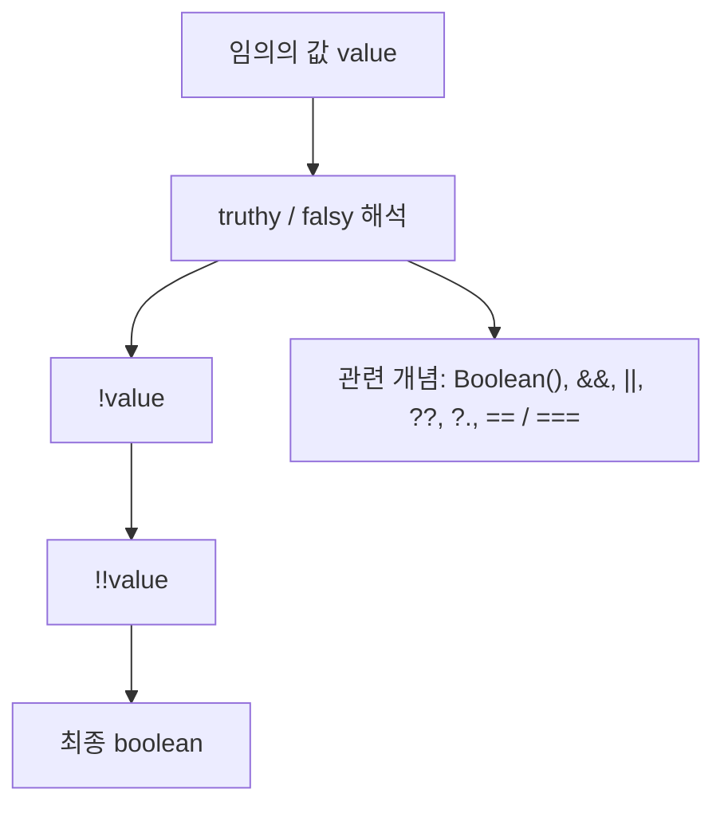

# `!!` 이중 부정 연산자와 비슷한 개념 정리

작성 기준일: 2026-04-14  
조사 방식: 웹검색 기반 최신 조사  
주요 참고: `developer.mozilla.org` 공식 MDN 문서

## 1. 문서 목적

이 문서는 JavaScript의 `!!` 이중 부정 연산자를 출발점으로, 함께 알아두면 좋은 비슷한 개념들을 한 파일에 묶어 정리한 학습 문서다.

핵심 질문은 아래와 같다.

- `!!value`는 정확히 무엇을 하는가
- `!value`와 `!!value`는 어떻게 다른가
- `Boolean(value)`와는 무슨 관계인가
- truthy / falsy는 정확히 무엇인가
- `&&`, `||`, `??`, `?.`는 왜 자꾸 같이 헷갈리는가
- `==`와 `===`는 왜 coercion과 함께 이해해야 하는가

즉 이 문서는 단순히 "`!!`가 불리언 변환이다"라는 한 줄 설명에서 멈추지 않고, JavaScript의 `boolean coercion` 주변 개념을 한 흐름으로 정리하려는 문서다.

---

## 2. 먼저 한 줄 요약



`!!value`는 `value`를 JavaScript의 boolean 문맥 기준으로 강제 변환해서 `true` 또는 `false`라는 primitive boolean 값으로 만드는 관용 표현이다.

즉:

- 첫 번째 `!`는 값을 boolean으로 해석한 뒤 뒤집고
- 두 번째 `!`는 그 boolean을 다시 뒤집는다

결과적으로:

- 원래 값의 truthy / falsy 여부만 남고
- 실제 값 자체는 버려진다

예:

```js
!!0           // false
!!1           // true
!!""          // false
!!"hello"     // true
!!null        // false
!!undefined   // false
!![]          // true
!!{}          // true
```

---

## 3. `!`부터 정확히 이해해야 한다

### 3.1 `!`는 무엇인가

MDN `Logical NOT (!)` 문서는 `!`가 operand를 boolean 문맥으로 해석한 뒤 반대로 뒤집는 연산자라고 설명한다.

즉:

- truthy면 `false`
- falsy면 `true`

를 반환한다.

예:

```js
!true        // false
!false       // true
!1           // false
!0           // true
!"hello"     // false
!""          // true
!null        // true
```

여기서 중요한 점은 `!`가 단순히 "not"이 아니라, 먼저 boolean coercion을 수행한다는 것이다.

즉:

```js
!123
```

은 내부 감각으로 보면:

1. `123`을 boolean 문맥으로 해석한다 -> `true`
2. 그 결과를 뒤집는다 -> `false`

라고 이해하면 된다.

### 3.2 `!`는 항상 boolean을 반환한다

이 점도 중요하다.

```js
typeof !123      // "boolean"
typeof !"hello"  // "boolean"
```

즉 `!`를 통과한 순간 값은 원래 타입을 잃고 boolean이 된다.

---

## 4. `!!`는 어떻게 동작하는가

### 4.1 첫 번째 `!`

예를 들어:

```js
!!"hello"
```

를 보면,

첫 번째 `!`는:

```js
!"hello" // false
```

가 된다.

왜냐하면 `"hello"`는 truthy이기 때문이다.

### 4.2 두 번째 `!`

그 다음 두 번째 `!`는:

```js
!false // true
```

가 된다.

즉 최종적으로:

```js
!!"hello" // true
```

### 4.3 결국 남는 것

`!!`를 거치면 원래 값의 "내용"은 사라지고, 오직 boolean 문맥에서의 해석 결과만 남는다.

예:

```js
const a = "0"
const b = []
const c = {}

!!a // true
!!b // true
!!c // true
```

즉 `"0"`이든 `[]`든 `{}`든 모두 truthy이므로 결국 `true`만 남는다.

### 4.4 왜 쓰는가

주된 목적은 두 가지다.

- 어떤 값이 truthy인지 falsy인지 명시적으로 boolean으로 확정하고 싶을 때
- 다른 연산의 결과가 boolean이 아닐 수 있는데 boolean 타입으로 맞추고 싶을 때

예:

```js
const hasName = !!user.name
const isLoggedIn = !!session
const canSubmit = !!title && !!content
```

---

## 5. `!!`와 `Boolean()`의 관계

### 5.1 거의 같은 역할

MDN `Boolean()` 문서는 `Boolean(value)`를 함수로 호출하면 value를 boolean primitive로 강제 변환한다고 설명한다.

즉 아래 둘은 실질적으로 같은 목적이다.

```js
!!value
Boolean(value)
```

예:

```js
!!0 === Boolean(0)           // true
!!"hello" === Boolean("hello") // true
!!null === Boolean(null)     // true
```

### 5.2 어떤 것을 써야 하나

둘 다 가능하지만 읽기 쉬움은 상황에 따라 다르다.

```js
const isActive = !!user
```

는 짧고 흔한 idiom이다.

반면:

```js
const isActive = Boolean(user)
```

는 의도가 더 직접적으로 보일 때가 있다.

실무에서는 보통:

- 짧은 조건식 안에서는 `!!`
- 명시성이 중요하면 `Boolean()`

정도로 취향이 갈린다.

### 5.3 중요한 함정: `new Boolean()`

이건 반드시 알아야 한다.

MDN은 `Boolean`을 constructor로 쓰는 일은 드물어야 한다고 강하게 경고한다.

즉:

```js
Boolean(false)      // false
new Boolean(false)  // Boolean object
```

는 완전히 다르다.

### 5.4 왜 위험한가

```js
const flag = new Boolean(false)

if (flag) {
  console.log("실행됨")
}
```

이 코드는 `"실행됨"`을 출력한다.

왜냐하면:

- `flag`는 boolean primitive가 아니라 object
- object는 truthy

이기 때문이다.

즉:

```js
Boolean(new Boolean(false)) // true
```

가 된다.

### 5.5 결론

실무에서는:

- `Boolean(value)`는 괜찮다
- `new Boolean(value)`는 피하는 것이 맞다

라고 기억하면 된다.

---

## 6. truthy / falsy

### 6.1 truthy란 무엇인가

MDN Glossary `Truthy`는 boolean 문맥에서 `true`로 간주되는 값을 truthy라고 설명한다.

즉:

- `if (value)`
- `while (value)`
- `value && other`
- `value || other`

같은 곳에서 `true`처럼 동작하면 truthy다.

### 6.2 falsy란 무엇인가

MDN Glossary `Falsy`는 boolean 문맥에서 `false`로 간주되는 값을 falsy라고 설명한다.

JavaScript의 falsy 값은 사실상 외워야 한다.

### 6.3 falsy 전체 목록

MDN 기준 falsy는 아래다.

- `false`
- `0`
- `-0`
- `0n`
- `""`
- `null`
- `undefined`
- `NaN`
- `document.all`

즉 이 목록 외에는 기본적으로 truthy라고 생각하면 된다.

### 6.4 자주 헷갈리는 truthy 예시

이건 실무에서 자주 실수한다.

```js
!!"false"   // true
!!"0"       // true
!![]        // true
!!{}        // true
!!function(){} // true
```

왜냐하면:

- `"false"`는 문자열이고 빈 문자열이 아니므로 truthy
- `"0"`도 빈 문자열이 아니므로 truthy
- 배열과 객체는 비어 있어도 object라 truthy

즉 "사람 눈에 false처럼 보이는 것"과 "JS가 falsy로 취급하는 것"은 다르다.

### 6.5 `document.all`은 왜 특별한가

MDN은 `document.all`을 역사적이고 비표준적인 예외로 설명한다.

즉 일반적인 앱 코드에서는 거의 신경 쓰지 않아도 되지만, "falsy 값이 딱 8개"라고 단정하면 틀릴 수 있다는 점만 기억하면 된다.

---

## 7. boolean 문맥이란 무엇인가

### 7.1 조건문

가장 흔한 boolean 문맥이다.

```js
if (user) {
  // user가 truthy면 실행
}
```

즉 `if`는 boolean이 아닌 값을 만나도 내부적으로 coercion해서 판단한다.

### 7.2 반복문

```js
while (items.length) {
  // items.length가 0이면 종료
}
```

여기서 `items.length`는 number지만 boolean 문맥에서 쓰이므로:

- `0`이면 falsy
- 0이 아니면 truthy

가 된다.

### 7.3 삼항 연산자 조건식

```js
const label = user ? user.name : "Guest"
```

여기서도 `user`는 boolean으로 강제 해석된다.

### 7.4 논리 연산자 내부

`&&`, `||`, `!`도 boolean coercion과 관련이 깊다.

다만 여기서 중요한 점은:

- `!`는 boolean을 반환
- `&&`, `||`는 보통 operand 자체를 반환

라는 차이다.

이걸 이해하지 못하면 `!!`와 `&&`, `||`를 한꺼번에 헷갈리기 쉽다.

---

## 8. `&&`와 `||`는 boolean만 반환하는 것이 아니다

### 8.1 `&&`

MDN `Logical AND (&&)`는 `&&`가 왼쪽에서 오른쪽으로 평가하면서, 첫 번째 falsy operand를 반환하거나 모두 truthy면 마지막 operand를 반환한다고 설명한다.

예:

```js
true && "dog"   // "dog"
0 && "dog"      // 0
[] && "dog"     // "dog"
```

즉 결과는 boolean이 아닐 수 있다.

### 8.2 `||`

MDN `Logical OR (||)`는 `||`가 첫 번째 truthy operand를 반환하거나, 모두 falsy면 마지막 operand를 반환한다고 설명한다.

예:

```js
"cat" || "dog"   // "cat"
"" || "dog"      // "dog"
0 || 123         // 123
```

즉 `||`도 boolean이 아니라 operand 값을 그대로 반환할 수 있다.

### 8.3 왜 이게 중요하나

아래 코드가 자주 등장한다.

```js
const displayName = user.name || "Anonymous"
```

이때 `displayName`은 boolean이 아니라:

- `user.name`이 truthy면 그 문자열 자체
- falsy면 `"Anonymous"`

가 된다.

즉 `||`는 "boolean OR"라기보다 "default value operator처럼 자주 쓰이는 logical operator"라고 이해해야 한다.

### 8.4 `!!`가 필요한 순간

```js
const result = user.name || "Anonymous"
```

여기서 `result`는 string이다.

만약 boolean이 필요하면:

```js
const hasName = !!user.name
```

처럼 명시적으로 boolean으로 바꿔야 한다.

즉 `&&`, `||`는 종종 boolean 문맥과 관련 있지만, 결과 타입까지 boolean이라고 생각하면 안 된다.

---

## 9. short-circuit evaluation

### 9.1 의미

MDN은 `&&`, `||`, `?.` 모두 short-circuit 성질이 있다고 설명한다.

즉 평가 도중 결과가 결정되면 나머지를 계산하지 않는다.

### 9.2 `&&` short-circuit

```js
false && doSomething()
```

는 `doSomething()`을 실행하지 않는다.

왜냐하면 왼쪽이 이미 falsy라 결과가 정해졌기 때문이다.

### 9.3 `||` short-circuit

```js
true || doSomething()
```

는 `doSomething()`을 실행하지 않는다.

왜냐하면 왼쪽이 이미 truthy라 결과가 정해졌기 때문이다.

### 9.4 왜 중요한가

이 성질 때문에 아래 같은 코드가 자주 나온다.

```js
isReady && submit()
```

```js
const name = userInput || "Anonymous"
```

즉 logical operator는 단순 계산기라기보다 "조건부 실행"과 "fallback"에도 자주 쓰인다.

---

## 10. `||`와 `??`의 차이

### 10.1 왜 헷갈리나

둘 다 기본값을 넣는 데 자주 쓰이기 때문이다.

```js
const a = value || "default"
const b = value ?? "default"
```

겉으로는 비슷해 보이지만 기준이 다르다.

### 10.2 `||`는 falsy 기준

```js
0 || 10        // 10
"" || "x"      // "x"
false || true  // true
```

즉 왼쪽이 falsy면 오른쪽으로 넘어간다.

그래서 "정말 값이 없을 때만 default"를 원할 때는 위험할 수 있다.

### 10.3 `??`는 nullish 기준

MDN `Nullish coalescing (??)`는 왼쪽이 `null` 또는 `undefined`일 때만 오른쪽을 반환한다고 설명한다.

```js
0 ?? 10         // 0
"" ?? "x"       // ""
false ?? true   // false
null ?? "x"     // "x"
undefined ?? "x" // "x"
```

즉:

- `0`
- `""`
- `false`

같은 유효한 값은 그대로 살리고 싶을 때 `??`가 맞다.

### 10.4 실무 예시

나쁜 예:

```js
const page = inputPage || 1
```

`inputPage`가 `0`이면 의도와 다르게 `1`이 된다.

더 적절한 예:

```js
const page = inputPage ?? 1
```

### 10.5 `!!`와의 관계

`||`와 `??`는 기본값 선택 도구고, `!!`는 boolean 강제 변환 도구다.

즉 같은 boolean coercion 주변 개념이지만 목적이 다르다.

---

## 11. `&&`와 `?.`의 차이

### 11.1 예전 패턴

optional chaining이 없던 시절에는 아래 같은 guard 패턴을 많이 썼다.

```js
const city = user && user.address && user.address.city
```

### 11.2 문제점

이 패턴은 동작할 때도 있지만 한계가 있다.

- 중간 값이 `0`, `""`, `false` 같은 falsy면 거기서 멈춘다
- 의도가 길어질수록 읽기 어렵다

즉 `&&`는 truthy/falsy 기준 short-circuit다.

### 11.3 `?.`는 nullish 기준

MDN `Optional chaining (?.)`는 왼쪽이 `null` 또는 `undefined`일 때만 short-circuit해서 `undefined`를 반환한다고 설명한다.

```js
const city = user?.address?.city
```

이 패턴은 아래 상황만 끊는다.

- `user === null`
- `user === undefined`
- `user.address === null`
- `user.address === undefined`

즉 `0`, `""`, `false`는 끊는 기준이 아니다.

### 11.4 왜 중요한가

이 차이를 모르고 `&&`를 계속 쓰면:

- 값이 "없어서" 멈춘 것인지
- 값이 falsy라서 멈춘 것인지

구분이 흐려진다.

### 11.5 추천 패턴

보통 속성 접근에는:

```js
user?.profile?.name
```

기본값까지 필요하면:

```js
user?.profile?.name ?? "Anonymous"
```

처럼 쓰는 것이 더 읽기 쉽다.

---

## 12. `==`와 `===`

### 12.1 왜 `!!`와 같이 봐야 하나

`!!`와 `==`/`===`는 모두 type coercion 혼란과 연결된다.

즉 `!!`를 이해했다면 "JavaScript는 값이 필요한 문맥에 따라 coercion을 한다"는 사실을 같이 이해해야 한다.

### 12.2 `==`

MDN `Equality (==)`는 `==`가 타입이 다를 때 변환을 시도한 뒤 비교한다고 설명한다.

예:

```js
"1" == 1        // true
0 == false      // true
"" == 0         // true
null == undefined // true
```

즉 사람 눈에는 이상하지만 JS 규칙상 참인 경우가 많다.

### 12.3 `===`

`===`는 strict equality다.

즉 타입 변환 없이 비교한다.

```js
"1" === 1       // false
0 === false     // false
null === undefined // false
```

### 12.4 실무 권장

대부분의 애플리케이션 코드에서는:

- `===`
- `!==`

를 기본으로 쓰는 것이 맞다.

`==`는 언어 규칙을 아주 명확히 이해한 뒤 제한적으로 쓰는 편이 안전하다.

### 12.5 `!!`와 차이

`!!value`는:

- 비교가 아니라
- boolean 강제 변환

이다.

즉:

```js
!!value
```

는 "이 값이 truthy냐 falsy냐"만 묻고,

```js
value === something
```

은 "이 값이 저 값과 같은가"를 묻는다.

같은 coercion 세계에 있지만 목적은 다르다.

---

## 13. `!!`를 써도 좋은 경우

### 13.1 존재 여부를 boolean으로 명시하고 싶을 때

```js
const hasToken = !!token
const hasItems = !!items.length
```

이런 경우는 흔하고 읽기도 비교적 쉽다.

### 13.2 UI 상태 계산

```js
const isDisabled = !!error || !title
```

이런 식으로 최종 boolean flag를 만들 때 유용하다.

### 13.3 라이브러리 옵션에 명시적 boolean을 넘길 때

```js
modal.open({
  closable: !!config.closable,
})
```

처럼 "정말 true/false로 맞춰 넘기고 싶다"는 의도가 있을 때 괜찮다.

---

## 14. `!!`를 남용하면 안 되는 경우

### 14.1 정보 손실이 생길 때

```js
const hasValue = !!value
```

는 boolean만 남기므로:

- 원래 값이 `0`인지
- `""`인지
- `null`인지

구분이 사라진다.

즉 실제 값이 중요하면 `!!`는 너무 공격적인 변환일 수 있다.

### 14.2 기본값 선택 문제를 `!!`로 풀려고 할 때

```js
const name = !!input ? input : "Anonymous"
```

이건 가능하지만 보통:

```js
const name = input || "Anonymous"
```

또는

```js
const name = input ?? "Anonymous"
```

가 더 적절하다.

즉 `!!`는 fallback operator가 아니다.

### 14.3 코드 가독성을 해칠 때

아래 코드는 짧지만 처음 읽는 사람은 잠깐 멈출 수 있다.

```js
const enabled = !!config?.features?.chat
```

이럴 때는 때로:

```js
const enabled = Boolean(config?.features?.chat)
```

가 더 읽기 쉬울 수 있다.

즉 무조건 짧은 표현이 더 좋은 것은 아니다.

---

## 15. 자주 나오는 실전 예제

### 15.1 폼 입력값 존재 여부

```js
const canSubmit = !!title && !!content
```

의미:

- `title`도 truthy
- `content`도 truthy

일 때만 제출 가능

### 15.2 배열 길이 확인

```js
const hasItems = !!items.length
```

여기서 `items.length`는 number다.

- `0`이면 falsy -> `false`
- `1` 이상이면 truthy -> `true`

### 15.3 API 응답 존재 여부

```js
const hasUser = !!response?.user
```

이건 `optional chaining + !!` 조합의 대표 패턴이다.

### 15.4 DOM element 존재 여부

```js
const exists = !!document.querySelector("#app")
```

`querySelector`는:

- 찾으면 element object
- 못 찾으면 `null`

을 반환하므로 `!!`와 잘 맞는다.

### 15.5 위험한 예: 숫자 0도 의미 있는 경우

```js
const hasPrice = !!price
```

이건 `price = 0`인 무료 상품을 `false`로 취급한다.

즉 "존재 여부"와 "값이 0인지"를 구분해야 한다면:

```js
const hasPrice = price != null
```

처럼 nullish 여부를 보는 것이 더 적절할 수 있다.

---

## 16. 헷갈리기 쉬운 비교 예시

아래는 실무에서 꼭 한 번 정리해 둘 만한 예시다.

```js
!!"false"        // true
!!"0"            // true
!![]             // true
!!{}             // true
!!0              // false
!!""             // false
!!null           // false
!!undefined      // false
```

```js
"1" == 1         // true
"1" === 1        // false
0 == false       // true
0 === false      // false
null == undefined // true
null === undefined // false
```

```js
0 || 10          // 10
0 ?? 10          // 0
"" || "x"        // "x"
"" ?? "x"        // ""
false || true    // true
false ?? true    // false
```

```js
user && user.name
user?.name
```

위 둘은 비슷해 보이지만 short-circuit 기준이 다르다.

---

## 17. 추천 mental model

이 주제를 헷갈리지 않으려면 아래 순서로 생각하면 좋다.

### 17.1 1단계: 이 문맥이 boolean을 요구하는가

예:

- `if (...)`
- `while (...)`
- `!value`
- 삼항 조건식

그렇다면 JS는 coercion을 한다.

### 17.2 2단계: truthy/falsy 기준이 필요한가

그렇다면 `!!value`나 `Boolean(value)`가 나올 수 있다.

### 17.3 3단계: 기본값을 넣고 싶은가

그렇다면 `||` 또는 `??`를 생각해야 한다.

- falsy 전체를 비어 있음으로 볼 것인가 -> `||`
- nullish만 비어 있음으로 볼 것인가 -> `??`

### 17.4 4단계: 안전한 속성 접근이 필요한가

그렇다면 `?.`가 더 적합하다.

### 17.5 5단계: 값 비교가 필요한가

그렇다면 `===`를 기본으로 생각해야 한다.

즉 `!!`, `||`, `??`, `?.`, `===`는 같은 레벨의 대체 문법이 아니라, 서로 목적이 다르다.

---

## 18. 실무 체크리스트

### 18.1 `!!`를 쓰기 전에

- 내가 정말 boolean이 필요한가
- 원래 값 정보가 사라져도 괜찮은가
- `Boolean(value)`가 더 읽기 쉬운가

### 18.2 `||`를 쓰기 전에

- `0`, `""`, `false`도 유효한 값인가
- 그렇다면 `??`가 더 맞지 않는가

### 18.3 `&&`를 쓰기 전에

- 내가 guard pattern을 원하는가
- 속성 접근이라면 `?.`가 더 읽기 쉽지 않은가

### 18.4 `==`를 쓰기 전에

- 타입 변환 비교가 정말 필요한가
- 대부분은 `===`가 더 안전하지 않은가

---

## 19. 한 문장 결론

`!!`는 단순 트릭이 아니라, JavaScript가 값을 boolean 문맥에서 어떻게 해석하는지를 드러내는 대표 표현이다.

그래서 `!!`를 제대로 이해하려면:

- truthy / falsy
- `Boolean()`
- `&&`, `||`
- `??`
- `?.`
- `==`와 `===`

까지 함께 이해해야 한다.

즉 이 주제의 핵심은 "`!!` 문법"이 아니라 "`JavaScript coercion 감각`"이다.

---

## 20. 공식 출처

- MDN Logical NOT (`!`): <https://developer.mozilla.org/en-US/docs/Web/JavaScript/Reference/Operators/Logical_NOT>
- MDN Boolean(): <https://developer.mozilla.org/en-US/docs/Web/JavaScript/Reference/Global_Objects/Boolean/Boolean>
- MDN Truthy: <https://developer.mozilla.org/en-US/docs/Glossary/Truthy>
- MDN Falsy: <https://developer.mozilla.org/en-US/docs/Glossary/Falsy>
- MDN Logical AND (`&&`): <https://developer.mozilla.org/en-US/docs/Web/JavaScript/Reference/Operators/Logical_AND>
- MDN Logical OR (`||`): <https://developer.mozilla.org/en-US/docs/Web/JavaScript/Reference/Operators/Logical_OR>
- MDN Nullish coalescing (`??`): <https://developer.mozilla.org/en-US/docs/Web/JavaScript/Reference/Operators/Nullish_coalescing>
- MDN Optional chaining (`?.`): <https://developer.mozilla.org/en-US/docs/Web/JavaScript/Reference/Operators/Optional_chaining>
- MDN Equality (`==`): <https://developer.mozilla.org/en-US/docs/Web/JavaScript/Reference/Operators/Equality>
- MDN Strict equality (`===`): <https://developer.mozilla.org/en-US/docs/Web/JavaScript/Reference/Operators/Strict_equality>
