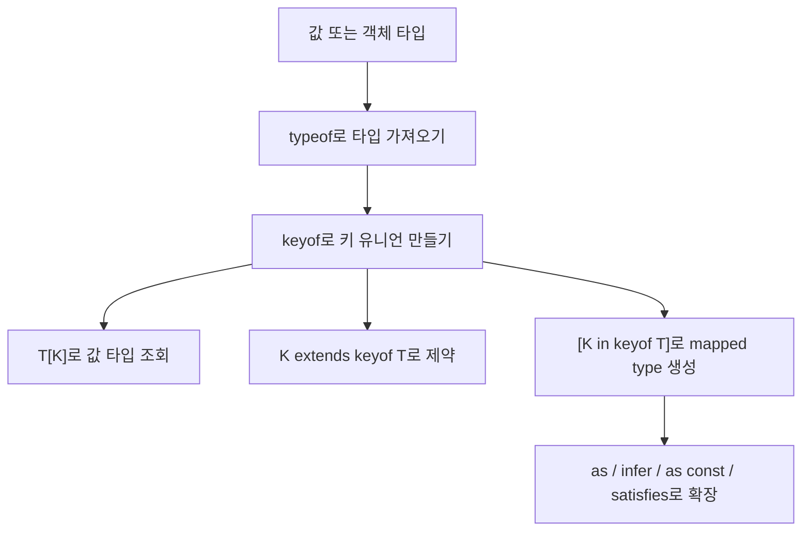

# TypeScript `keyof`와 관련 타입 연산 정리

작성 기준일: 2026-04-16  
조사 방식: 웹검색 기반 최신 조사  
주요 참고: `typescriptlang.org` 공식 Handbook / Release Notes

## 1. 문서 목적

이 문서는 TypeScript에서 자주 보이는 `keyof`와, 그와 함께 거의 세트처럼 등장하는 관련 타입 연산/문법을 한 파일에 묶어 정리한 학습 문서다.

특히 아래를 함께 설명한다.

- `keyof`
- 타입 문맥의 `typeof`
- indexed access type `T[K]`
- `K extends keyof T`
- mapped type의 `[K in keyof T]`
- mapped type의 key remapping `as`
- conditional type의 `extends`
- `infer`
- `as const`
- `satisfies`

즉 이 문서는 단순히 "`keyof`는 키 유니언을 만든다"는 한 줄 설명에서 멈추지 않고, "`TypeScript가 값 구조를 타입으로 조작하는 흐름`"을 이해하게 만드는 데 목적이 있다.

---

## 2. 먼저 예시 코드부터 읽기



질문에 나온 코드:

```ts
const selectFields: (keyof DubrightEpisode)[] = [
  "id",
  "version",
  "no",
  "productNo",
  "productTitle",
  "coverImage",
  "index",
  "title",
  "subtitle",
  "applyArtistData",
  "syncStatus",
];
```

이 코드를 TypeScript 관점에서 읽으면:

- `DubrightEpisode`는 객체 타입
- `keyof DubrightEpisode`는 그 타입의 키들만 뽑은 문자열 리터럴 유니언
- `(keyof DubrightEpisode)[]`는 "그 키들만 담을 수 있는 배열"

이라는 뜻이다.

즉:

```ts
type EpisodeKeys = keyof DubrightEpisode;
```

를 먼저 만들고,

```ts
const selectFields: EpisodeKeys[] = [...]
```

라고 쓴 것과 같은 감각이다.

이 패턴의 핵심 장점은:

- 오타를 컴파일 타임에 잡을 수 있고
- 타입이 바뀌면 자동으로 영향을 받고
- 문자열 목록을 타입과 동기화할 수 있다는 점

이다.

즉 이 코드에서 `keyof`는 단순 문법이 아니라 "타입 안전한 필드 선택 목록"을 만드는 역할을 한다.

---

## 3. `keyof`란 무엇인가

### 3.1 공식 정의

TypeScript 공식 문서는 `keyof`를:

- 객체 타입을 받아
- 그 키들을 문자열 또는 숫자 리터럴 유니언으로 만드는 타입 연산자

라고 설명한다.

예:

```ts
type Point = { x: number; y: number };
type P = keyof Point; // "x" | "y"
```

즉 `keyof T`는 "`T`에 허용된 프로퍼티 이름들"을 타입으로 만든 것이다.

### 3.2 왜 중요한가

실무에서 자주 필요한 요구:

- 객체 키 이름을 안전하게 제한하고 싶다
- 어떤 프로퍼티만 선택하게 하고 싶다
- 키 목록을 순회하며 새 타입을 만들고 싶다

이걸 가능하게 하는 출발점이 `keyof`다.

즉 TypeScript 타입 조작의 입구라고 봐도 된다.

### 3.3 가장 기본 예시

```ts
interface User {
  id: number;
  name: string;
  email: string;
}

type UserKey = keyof User;
// "id" | "name" | "email"
```

즉 `UserKey`는 문자열 전체가 아니라 딱 저 세 값만 허용한다.

---

## 4. `keyof`가 실제로 유용한 이유

### 4.1 문자열 오타 방지

예:

```ts
function pick<T, K extends keyof T>(obj: T, key: K) {
  return obj[key];
}

pick(user, "name"); // OK
pick(user, "naem"); // Error
```

즉 `keyof`는 "문자열인데 사실상 enum처럼 안전한 값 집합"을 만든다.

### 4.2 객체 구조 변경 추적

예를 들어 `DubrightEpisode`에서 `subtitle`이 사라지면:

```ts
const selectFields: (keyof DubrightEpisode)[] = [
  "subtitle"
]
```

이런 코드가 바로 깨진다.

즉 하드코딩된 문자열 리스트를 타입 시스템에 연결할 수 있다.

### 4.3 mapped type의 출발점

뒤에서 보겠지만:

```ts
type Flags<T> = {
  [K in keyof T]: boolean;
}
```

같은 패턴은 `keyof`가 없으면 시작할 수 없다.

즉 `keyof`는 단독으로도 유용하고, 더 큰 타입 조작의 재료이기도 하다.

---

## 5. `keyof`의 결과가 항상 문자열 리터럴만은 아니다

이 부분은 매우 중요하다.

공식 문서는 index signature가 있으면 `keyof` 결과가 달라질 수 있다고 설명한다.

### 5.1 number index signature

```ts
type Arrayish = { [n: number]: unknown };
type A = keyof Arrayish; // number
```

즉 숫자 인덱스 시그니처를 가진 타입이면 `keyof`는 `number`가 된다.

### 5.2 string index signature

```ts
type Mapish = { [k: string]: boolean };
type M = keyof Mapish; // string | number
```

여기서 공식 문서가 강조하는 포인트:

- JavaScript 객체 키는 결국 문자열 강제 변환이 일어나므로
- `obj[0]`와 `obj["0"]`가 같은 키가 될 수 있다

즉 `string | number`가 된다.

### 5.3 실무 감각

즉 `keyof`를 볼 때는:

- 일반 object literal 타입인지
- index signature가 있는 dictionary 타입인지

를 먼저 봐야 한다.

이 차이를 모르면 `keyof T` 결과가 예상보다 넓어져서 당황하게 된다.

---

## 6. `keyof`와 배열

공식 release notes 예시를 보면:

```ts
type K2 = keyof Person[];
```

같은 것도 가능하다.

즉 배열에 `keyof`를 쓰면 단순히 `0 | 1 | 2` 같은 게 아니라:

- `length`
- `push`
- `pop`
- `concat`

같은 배열 메서드 이름까지 포함된 키 집합이 된다.

### 6.1 왜 그런가

배열도 결국 객체 타입이기 때문이다.

즉:

- 인덱스 접근
- length
- 메서드들

을 가진 특수 객체로 보면 된다.

### 6.2 실무 포인트

그래서 "배열 요소 타입"을 얻고 싶은데 `keyof SomeArray`를 쓰면 대개 의도와 다르다.

배열 요소 타입을 얻고 싶다면 보통:

```ts
type Item = typeof arr[number];
```

처럼 indexed access를 쓴다.

즉 `keyof`는 "키 집합", 요소 타입은 `T[number]` 쪽이라는 감각을 구분해야 한다.

---

## 7. 타입 문맥의 `typeof`

### 7.1 왜 `typeof`가 같이 나오나

`keyof`는 보통 타입에 대해 쓰는데, 실제 코드에는 값이 먼저 존재하는 경우가 많다.

예:

```ts
const episode = {
  id: 1,
  title: "hello",
  syncStatus: "READY",
};
```

여기서 이 값의 타입을 다시 타입 문맥으로 끌어오려면 `typeof`가 필요하다.

### 7.2 공식 정의

TypeScript 공식 문서는 타입 문맥의 `typeof`를:

- 변수나 프로퍼티의 타입을 참조하는 타입 연산자

라고 설명한다.

예:

```ts
const user = { name: "Kim", age: 30 };
type User = typeof user;
```

즉 값에서 타입으로 올라가는 다리다.

### 7.3 `keyof typeof` 패턴

이 둘은 매우 자주 같이 쓴다.

```ts
const STATUS = {
  READY: "READY",
  SYNCING: "SYNCING",
  FAILED: "FAILED",
} as const;

type StatusKey = keyof typeof STATUS;
// "READY" | "SYNCING" | "FAILED"
```

즉:

- `typeof STATUS`로 값의 타입을 얻고
- `keyof`로 그 키 집합을 얻는다

### 7.4 실무 감각

`keyof SomeType`는 "이미 타입이 있을 때" 쓰고,

`keyof typeof someValue`는 "실제 값에서 타입을 끌어와 키를 뽑고 싶을 때" 쓴다고 보면 된다.

---

## 8. Indexed Access Type `T[K]`

공식 문서는 indexed access types를:

- 다른 타입의 특정 프로퍼티 타입을 조회하는 방식

이라고 설명한다.

### 8.1 가장 기본 형태

```ts
type Person = {
  age: number;
  name: string;
  alive: boolean;
};

type Age = Person["age"]; // number
```

즉 타입에 대해 프로퍼티 조회를 하는 것이다.

### 8.2 `keyof`와 결합

```ts
type ValueUnion = Person[keyof Person];
// string | number | boolean
```

즉:

- `keyof Person`으로 키 유니언을 만들고
- `Person[...]`로 그 키들의 값 타입 유니언을 얻는다

### 8.3 질문 코드와 연결

질문 예시를 타입 조작 관점으로 이어 쓰면:

```ts
type EpisodeField = keyof DubrightEpisode;
type EpisodeFieldValue = DubrightEpisode[EpisodeField];
```

즉:

- 첫 줄은 필드 이름 유니언
- 둘째 줄은 모든 필드 값 타입 유니언

이다.

### 8.4 배열 요소 타입

공식 문서가 특히 자주 보여 주는 패턴:

```ts
const MyArray = [
  { name: "Alice", age: 15 },
  { name: "Bob", age: 23 },
];

type Person = typeof MyArray[number];
type Age = typeof MyArray[number]["age"];
```

즉:

- `number`로 배열 인덱싱
- 요소 타입 얻기

라는 감각이다.

---

## 9. `K extends keyof T`

이 패턴은 `keyof` 실전 사용의 핵심이다.

공식 TypeScript 2.1 release notes 예시도 바로 이 패턴을 보여 준다.

### 9.1 기본 형태

```ts
function getProperty<T, K extends keyof T>(obj: T, key: K) {
  return obj[key];
}
```

의미:

- `T`는 어떤 객체 타입
- `K`는 `T`의 키 집합 안에 있는 값만 허용

즉 `key`는 반드시 `obj`에 실제로 존재하는 키여야 한다.

### 9.2 왜 `extends`를 쓰나

여기서 `extends`는 상속만 뜻하는 것이 아니다.

타입 시스템에서는:

- "이 타입 변수는 이 제약(constraint)을 만족해야 한다"

는 뜻으로 자주 쓴다.

즉:

```ts
K extends keyof T
```

는:

- "`K`는 `keyof T`에 할당 가능한 타입만 가능"

이라는 제약이다.

### 9.3 실무적으로 왜 중요한가

이 패턴 덕분에:

- 존재하지 않는 키 접근 방지
- 반환 타입 자동 추론
- set/get helper 타입 안전화

가 가능하다.

### 9.4 setter 예시

공식 예시 확장:

```ts
function setProperty<T, K extends keyof T>(obj: T, key: K, value: T[K]) {
  obj[key] = value;
}
```

이 함수는:

- key와 value 타입이 연결되어 있다

즉 `"foo"`를 넣으면 `foo` 필드 타입만 value로 허용한다.

---

## 10. Mapped Types와 `in`

공식 문서는 mapped type을:

- `PropertyKey` 유니언을 순회해
- 새 타입을 만드는 generic type

이라고 설명한다.

### 10.1 기본 형태

```ts
type OptionsFlags<Type> = {
  [Property in keyof Type]: boolean;
};
```

여기서:

- `keyof Type`는 키 유니언
- `in`은 그 유니언을 순회
- 각 키에 대해 새 프로퍼티 생성

이다.

즉 `in`은 JavaScript 런타임 `in`과 비슷해 보이지만, 여기서는 타입 레벨 반복 문법이다.

### 10.2 예시

```ts
type Features = {
  darkMode: () => void;
  newUserProfile: () => void;
};

type FeatureOptions = {
  [K in keyof Features]: boolean;
};
```

결과:

```ts
type FeatureOptions = {
  darkMode: boolean;
  newUserProfile: boolean;
}
```

### 10.3 왜 중요한가

이 패턴은 TypeScript 내장 유틸리티 타입의 핵심이다.

예:

- `Partial<T>`
- `Readonly<T>`
- `Required<T>`
- `Record<K, V>`

같은 것들이 전부 이 흐름과 연결된다.

즉 `keyof`를 실전적으로 쓴다는 것은 결국 mapped type을 이해하는 일이다.

---

## 11. Mapped Type modifier: `readonly`, `?`, `-?`, `-readonly`

공식 문서는 mapped type에서 modifier를 추가/제거할 수 있다고 설명한다.

### 11.1 `readonly` 추가/제거

```ts
type CreateMutable<Type> = {
  -readonly [Property in keyof Type]: Type[Property];
};
```

즉:

- 기존 타입의 readonly를 제거할 수 있다

### 11.2 optional 추가/제거

```ts
type Concrete<Type> = {
  [Property in keyof Type]-?: Type[Property];
};
```

즉:

- optional(`?`)을 제거할 수 있다

### 11.3 왜 중요한가

즉 mapped type은 단순히 "값 타입 바꾸기"만이 아니라:

- readonly 여부
- optional 여부

까지 조작할 수 있다.

---

## 12. Key Remapping의 `as`

공식 문서는 TypeScript 4.1부터 mapped type 안에서 `as`를 써서 키를 remap할 수 있다고 설명한다.

### 12.1 기본 형태

```ts
type MappedTypeWithNewProperties<Type> = {
  [Properties in keyof Type as NewKeyType]: Type[Properties];
};
```

즉:

- 원래 키를 그대로 쓰는 게 아니라
- 새 키 이름으로 바꿀 수 있다

### 12.2 예시

```ts
type Getters<Type> = {
  [Property in keyof Type as `get${Capitalize<string & Property>}`]: () => Type[Property];
};
```

즉:

- `name` -> `getName`
- `age` -> `getAge`

같이 새 키 이름을 만들 수 있다.

### 12.3 키 제거도 가능하다

공식 문서는 `never`를 만들어 특정 키를 필터링할 수도 있다고 설명한다.

```ts
type RemoveKindField<Type> = {
  [Property in keyof Type as Exclude<Property, "kind">]: Type[Property];
};
```

즉 `as`는:

- 이름 바꾸기
- 일부 키 제거

둘 다 가능하다.

### 12.4 질문 코드와 연결

`selectFields` 같은 목록에서 특정 prefix를 가진 키만 다시 뽑아 새 타입을 만들고 싶다면, 결국 이런 key remapping 패턴까지 가게 된다.

즉 `keyof`는 시작점이고 `as`는 후속 가공 도구다.

---

## 13. Conditional Types와 `extends`

공식 문서는 conditional type을:

- 입력 타입에 따라 결과 타입을 나누는 타입 표현식

이라고 설명한다.

### 13.1 기본 형태

```ts
type Example1 = Dog extends Animal ? number : string;
```

즉:

- 타입 수준의 if문

이다.

### 13.2 왜 `extends`가 여기서 또 나오나

TypeScript에서 `extends`는 문맥에 따라 두 역할을 한다.

1. generic constraint  
예: `K extends keyof T`

2. conditional type의 조건 비교  
예: `T extends U ? X : Y`

즉 같은 키워드지만 문맥이 다르다.

### 13.3 `T[K]`와 함께 자주 쓰이는 패턴

공식 mapped type 예시도:

```ts
type ExtractPII<Type> = {
  [Property in keyof Type]: Type[Property] extends { pii: true } ? true : false;
};
```

즉:

- `keyof`
- mapped type
- indexed access
- conditional type

이 한 줄에 다 같이 등장할 수 있다.

### 13.4 왜 중요한가

고급 유틸 타입 대부분은 결국 이 조합으로 만들어진다.

즉 `keyof`만 따로 배우면 반쪽이고, conditional type까지 봐야 타입 조작 흐름이 완성된다.

---

## 14. `infer`

공식 문서는 conditional type의 true branch 안에서 `infer`로 타입 일부를 추론해 꺼낼 수 있다고 설명한다.

### 14.1 기본 예시

```ts
type Flatten<Type> = Type extends Array<infer Item> ? Item : Type;
```

의미:

- `Type`이 배열이면 내부 요소 타입을 `Item`으로 뽑고
- 아니면 그대로 둔다

### 14.2 return type 추출

공식 예시:

```ts
type GetReturnType<Type> =
  Type extends (...args: never[]) => infer Return
    ? Return
    : never;
```

즉 `infer`는:

- 특정 위치의 타입을 직접 수작업 인덱싱하지 않고
- 패턴 매칭처럼 뽑아내는 방식

이다.

### 14.3 왜 `keyof`와 같이 배우는가

실무에서 복잡한 유틸 타입은 자주 이렇게 흘러간다.

- `keyof`로 키 집합 생성
- mapped type으로 순회
- conditional type으로 분기
- `infer`로 내부 타입 추출

즉 `infer`는 `keyof`의 "다음 단계"쯤 되는 감각이다.

---

## 15. `as const`

공식 TypeScript 3.4 release notes는 `const assertions`를 설명한다.

`as const`를 쓰면:

- literal type widening을 막고
- object는 `readonly` property가 되고
- array는 `readonly tuple`이 된다

### 15.1 왜 중요한가

`keyof typeof`와 자주 같이 쓴다.

예:

```ts
const FIELD_MAP = {
  id: "id",
  title: "title",
  subtitle: "subtitle",
} as const;

type FieldKey = keyof typeof FIELD_MAP;
// "id" | "title" | "subtitle"
```

### 15.2 없으면 어떻게 되나

`as const`가 없으면 값들이 더 넓은 타입으로 추론될 수 있다.

즉 literal 기반 타입 설계에서는 `as const`가 매우 자주 필요하다.

### 15.3 배열 예시

```ts
const fields = ["id", "title", "subtitle"] as const;
type Field = typeof fields[number];
// "id" | "title" | "subtitle"
```

이 패턴은 질문의 `selectFields` 같은 코드와 매우 가깝다.

즉:

- 값 배열을 만들고
- 그 배열의 요소 리터럴 유니언 타입을 뽑아낼 수 있다

---

## 16. `satisfies`

공식 TypeScript 4.9 release notes는 `satisfies`를:

- 어떤 표현식이 특정 타입 요구사항을 만족하는지 검증하면서도
- 표현식 자체의 더 구체적인 타입 정보는 유지하게 해 주는 연산자

라고 설명한다.

### 16.1 왜 필요한가

보통 이 딜레마가 있다.

```ts
const palette: Record<Colors, string | RGB> = { ... }
```

처럼 타입 주석을 주면 검사는 되지만, 각 프로퍼티의 구체적인 타입 정보가 넓어질 수 있다.

### 16.2 `satisfies` 예시

공식 예시 감각:

```ts
const palette = {
  red: [255, 0, 0],
  green: "#00ff00",
  blue: [0, 0, 255],
} satisfies Record<Colors, string | RGB>;
```

효과:

- 키 오타 검증
- 값 타입 검증
- 동시에 `palette.green`은 여전히 `string`으로 유지

### 16.3 `keyof`와 연결

`satisfies`는 `keyof` 기반 객체 목록 검증에 특히 잘 맞는다.

예:

```ts
type EpisodeField = keyof DubrightEpisode;

const fieldLabels = {
  id: "ID",
  title: "제목",
  subtitle: "부제",
} satisfies Partial<Record<EpisodeField, string>>;
```

즉:

- 허용 가능한 키는 `keyof DubrightEpisode`로 제한하고
- 실제 객체의 구체성은 잃지 않는다

### 16.4 언제 좋은가

- config object 검증
- key set 검증
- value type 검증
- inference는 최대한 보존하고 싶을 때

즉 최신 TypeScript에서 매우 실용적인 도구다.

---

## 17. 질문 예시를 더 타입 안전하게 만드는 패턴

질문 코드:

```ts
const selectFields: (keyof DubrightEpisode)[] = [...]
```

이건 충분히 좋은 패턴이다.

다만 더 타입 안전한 변형도 있다.

### 17.1 `as const` 배열 + 요소 타입 추출

```ts
const selectFields = [
  "id",
  "version",
  "no",
  "productNo",
] as const satisfies readonly (keyof DubrightEpisode)[];
```

이 패턴의 장점:

- 배열 각 요소가 literal로 유지됨
- 오타 검사 가능
- 나중에 `typeof selectFields[number]`로 요소 유니언 타입 추출 가능

### 17.2 요소 유니언 타입 만들기

```ts
type SelectedField = typeof selectFields[number];
```

즉 실제 배열과 타입을 따로 중복 선언하지 않아도 된다.

### 17.3 `Pick`과 연결

```ts
type EpisodePreview = Pick<DubrightEpisode, typeof selectFields[number]>;
```

즉:

- 필드 목록 값
- 필드 목록 타입
- 실제 선택된 부분 타입

을 한 흐름으로 연결할 수 있다.

이게 `keyof` 계열 문법의 실무적 재미있는 지점이다.

---

## 18. 자주 하는 실수

### 18.1 값과 타입 문맥을 섞음

잘못된 예:

```ts
const key = "age";
type Age = Person[key];
```

공식 indexed access 문서도 이게 안 된다고 설명한다.

왜냐하면 `key`는 값이고, 타입 위치에는 타입이 와야 한다.

필요하면:

```ts
type Key = "age";
type Age = Person[Key];
```

또는

```ts
const key = "age" as const;
type Key = typeof key;
type Age = Person[Key];
```

처럼 가야 한다.

### 18.2 `keyof`를 배열 요소 타입처럼 착각

```ts
type K = keyof SomeArray;
```

이건 배열 메서드 키까지 포함할 수 있다.

요소 타입을 원하면 `SomeArray[number]` 쪽이다.

### 18.3 `as const` 없이 literal 유니언을 기대

배열이나 객체 리터럴에서 literal 보존이 중요하면 `as const`를 고려해야 한다.

### 18.4 `satisfies`와 타입 주석을 같은 것으로 생각

둘은 비슷해 보여도 결과 타입 보존 측면에서 다르다.

즉:

- 타입 주석 = 표현식 타입을 넓힐 수 있음
- `satisfies` = 검사는 하되 더 구체적인 타입 유지

### 18.5 `extends`를 항상 상속으로만 이해

타입 시스템에서 `extends`는:

- generic constraint
- conditional type 조건

이라는 두 가지 중요한 역할이 있다.

---

## 19. 이 주제의 전체 흐름

이 문맥을 한 줄 흐름으로 보면:

1. 값이 있다
2. `typeof`로 타입을 가져온다
3. `keyof`로 키 집합을 뽑는다
4. `T[K]`로 값 타입을 조회한다
5. `K extends keyof T`로 안전한 제약을 건다
6. `[K in keyof T]`로 새 타입을 만든다
7. `as`로 키를 재매핑한다
8. `extends ? :`로 조건부 분기를 만든다
9. `infer`로 내부 타입을 뽑는다
10. `as const`, `satisfies`로 값-타입 연결을 더 정교하게 만든다

즉 `keyof`는 단독 기능이라기보다 TypeScript 타입 조작의 중심축 중 하나다.

---

## 20. 추천 학습 순서

이 주제를 처음부터 다시 잡으려면 아래 순서가 좋다.

### 1단계: 기본 타입 연산

- `keyof`
- 타입 문맥의 `typeof`
- `T[K]`

### 2단계: 제너릭 제약

- `K extends keyof T`
- get/set helper 패턴

### 3단계: mapped types

- `[K in keyof T]`
- `readonly`, `?`, `-readonly`, `-?`
- key remapping `as`

### 4단계: 조건부 타입

- `T extends U ? X : Y`
- `infer`

### 5단계: 값과 타입 연결

- `as const`
- `satisfies`
- 실제 배열/객체에서 타입 추론 연결

이 순서로 가면 질문의 예시 코드가 왜 그렇게 쓰이는지 자연스럽게 보이기 시작한다.

---

## 21. 한 문장 결론

`keyof`는 객체 타입의 키 집합을 타입으로 꺼내는 출발점이고, TypeScript의 실제 타입 조작은 여기에 `typeof`, `T[K]`, `K extends keyof T`, `[K in keyof T]`, `as`, `infer`, `as const`, `satisfies`가 연쇄적으로 붙으면서 값 구조와 타입 구조를 안전하게 연결하는 방식으로 발전한다.

즉 이 주제의 핵심은 개별 연산자를 따로 외우는 것이 아니라:

- 키를 뽑고
- 값을 조회하고
- 순회하며 변형하고
- 조건부로 분기하고
- 실제 값과 타입을 다시 묶는

하나의 흐름으로 이해하는 것이다.

---

## 22. 공식 출처

- TypeScript Handbook - Keyof Type Operator: <https://www.typescriptlang.org/docs/handbook/2/keyof-types.html>
- TypeScript Handbook - Typeof Type Operator: <https://www.typescriptlang.org/docs/handbook/2/typeof-types.html>
- TypeScript Handbook - Indexed Access Types: <https://www.typescriptlang.org/docs/handbook/2/indexed-access-types.html>
- TypeScript Handbook - Mapped Types: <https://www.typescriptlang.org/docs/handbook/2/mapped-types.html>
- TypeScript Handbook - Conditional Types: <https://www.typescriptlang.org/docs/handbook/2/conditional-types.html>
- TypeScript Handbook - Release Notes 2.1 (`keyof` and lookup types): <https://www.typescriptlang.org/docs/handbook/release-notes/typescript-2-1.html>
- TypeScript Handbook - Release Notes 3.4 (`as const`): <https://www.typescriptlang.org/docs/handbook/release-notes/typescript-3-4>
- TypeScript Handbook - Release Notes 4.1 (key remapping with `as`): <https://www.typescriptlang.org/docs/handbook/release-notes/typescript-4-1.html>
- TypeScript Handbook - Release Notes 4.9 (`satisfies`): <https://www.typescriptlang.org/docs/handbook/release-notes/typescript-4-9.html>
