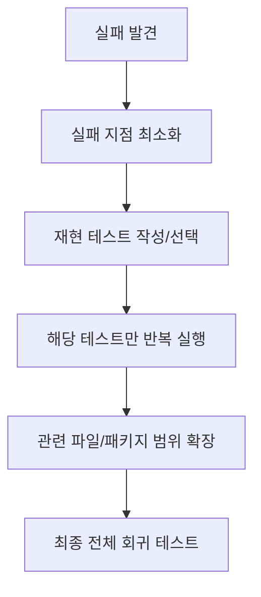

# 부분 테스트 전략 상세 정리

작성 기준일: 2026-04-13  
주요 참고: `pytest`, `Vitest`, `Jest`, `Go testing`, `cargo test` 공식 문서

## 1. 한 줄 요약

개발자들은 문제되는 부분만 테스트할 때 보통 `전체 테스트를 매번 다 돌리지 않고`, `실패 지점에 가장 가까운 단위만 빠르게 반복 실행`하는 전략을 쓴다.

짧게 말하면:

- `작게 자르고`
- `빠르게 반복하고`
- `문제 재현용 케이스를 만들고`
- `수정 후 범위를 조금씩 넓혀가며`
- 마지막에 전체 테스트로 확인한다

는 흐름이다.

---

## 2. 먼저 큰 그림


이 흐름이 중요하다.

초보자는 자주:

- 버그 하나 고치면서
- 전체 테스트를 매번 다 돌리거나
- 반대로 부분 테스트만 하다가 전체 회귀를 안 돌린다

실무에서는 보통 이 둘의 균형을 잡는다.

---

## 3. 개발자들이 왜 부분 테스트를 하나

### 3.1 속도

가장 큰 이유다.

테스트가 커질수록:

- 한 번 돌리는 데 오래 걸리고
- 집중력이 끊기고
- 수정-확인 루프가 느려진다

문제 부위만 돌리면:

- 피드백 루프가 빨라진다

### 3.2 재현성

버그는 `재현 가능한 최소 단위`로 줄여야 고치기 쉽다.

즉:

- 문제를 일으키는 함수
- 문제를 일으키는 모듈
- 문제를 일으키는 시나리오

까지 좁히는 것이 핵심이다.

### 3.3 디버깅 비용 절감

전체 테스트를 돌리면 noise가 많아진다.

부분 테스트는:

- 로그 양을 줄이고
- 원인 추적을 쉽게 하고
- 실패 지점을 명확하게 한다

---

## 4. 부분 테스트의 기본 전략

실무적으로는 아래 순서가 가장 흔하다.

### 4.1 1단계: 가장 작은 실패 단위 찾기

예:

- 특정 test file
- 특정 test case
- 특정 describe block
- 특정 subtest

### 4.2 2단계: 재현 테스트를 만든다

단순히 기존 테스트를 보는 것이 아니라:

- 버그를 정확히 재현하는 테스트

를 만드는 경우가 많다.

이 테스트는 보통:

- 실패를 분명하게 보여주고
- 수정 후 성공해야 한다

### 4.3 3단계: watch / filter / rerun failed

수정 중에는:

- file 단위
- test name 단위
- failed-only rerun

같은 필터링을 쓴다.

### 4.4 4단계: 인접 범위 확장

문제가 고쳐졌다고 바로 끝내지 않고:

- 관련 모듈
- 관련 feature
- 관련 integration

정도까지 범위를 넓혀 다시 본다.

### 4.5 5단계: 마지막에 전체 테스트

이건 매우 중요하다.

부분 테스트는 빠른 개발 루프용이고,

최종 안전성 확인은:

- 전체 테스트
- 최소한 관련 패키지 전체

까지 가야 한다.

---

## 5. "문제되는 부분만 잘라 테스트"의 대표 패턴

### 5.1 파일 단위 실행

가장 흔하다.

예:

- `foo.test.ts`만 실행
- `service_spec.rb`만 실행
- `test_api.py`만 실행

장점:

- 가장 단순
- CI보다 빠름

### 5.2 테스트 이름/패턴 단위 실행

특정 `test()` 이름, `describe()` 이름, 함수명, regex에 맞는 것만 돌린다.

장점:

- 파일 안에서도 더 좁힐 수 있음

### 5.3 failed-only rerun

직전 실패한 케이스만 다시 돌리는 방식이다.

장점:

- 디버깅 속도가 빠름

단점:

- 실패 기록이 stale해질 수 있음

### 5.4 changed-files 기반 실행

현재 수정한 파일과 관련된 테스트만 돌린다.

장점:

- 큰 monorepo에서 유용

단점:

- 관련성 추정이 틀릴 수 있음

### 5.5 subtest / parameterized test 선택 실행

하나의 테스트 함수 안에 여러 케이스가 있는 경우, 특정 케이스만 골라 돌린다.

이건 Go, Python, Jest/Vitest 등에서 특히 유용하다.

---

## 6. 핵심 사고방식: 전체 테스트를 안 돌리는 게 아니라, 순서를 나눈다

부분 테스트 전략을 잘못 이해하면:

- "전체 테스트는 안 돌려도 된다"

로 오해하기 쉽다.

하지만 실무에선 보통:

1. `부분 테스트`로 빠르게 고친다
2. `관련 범위 테스트`로 확인한다
3. `최종적으로 전체 테스트`나 최소 회귀 테스트를 돈다

이 흐름이다.

즉 부분 테스트는 전체 테스트의 대체재가 아니라 `앞단 최적화`다.

---

## 7. pytest 문맥

공식 pytest 문서의 `How to invoke pytest`, `How to mark tests`, `How to use fixtures`, test selection 문서를 보면 부분 테스트 전략이 잘 드러난다.

### 7.1 파일 단위 실행

```bash
pytest tests/test_api.py
```

### 7.2 특정 테스트 함수 실행

```bash
pytest tests/test_api.py::test_login
```

### 7.3 클래스 안 특정 테스트 실행

```bash
pytest tests/test_api.py::TestAuth::test_login
```

### 7.4 이름 패턴으로 필터

```bash
pytest -k login
```

즉 `-k`는 이름 기반 부분 실행에서 매우 많이 쓴다.

### 7.5 실패한 것만 재실행

pytest는 캐시를 기반으로 `실패한 테스트만` 다시 돌리는 흐름도 자주 쓴다.

이건 디버깅 속도를 매우 높여준다.

### 7.6 실무 팁

pytest에서 개발자들이 자주 하는 루프:

1. failing test 하나 선택
2. `-k` 또는 node id로 재현
3. fixture 최소화
4. 수정
5. 관련 file 전체 실행

---

## 8. Vitest / Jest 문맥

프론트엔드/Node 생태계에서 매우 흔하다.

### 8.1 파일 단위

```bash
vitest run src/foo.test.ts
jest src/foo.test.ts
```

### 8.2 테스트 이름 기반

```bash
vitest -t "login flow"
jest -t "login flow"
```

### 8.3 watch mode

공식 문서에서 watch mode는 매우 중요한 개발 루프다.

예:

```bash
vitest
jest --watch
```

watch mode에서 개발자는:

- 파일 저장
- 해당 테스트만 즉시 재실행

같은 흐름을 만든다.

### 8.4 changed files 기반

Jest는 공식 CLI에 `--findRelatedTests`, `-o` 같은 옵션이 있다.

예:

```bash
jest --findRelatedTests src/foo.ts
```

이건 monorepo나 규모 큰 프론트엔드에서 실전성이 높다.

---

## 9. Go test 문맥

Go는 부분 테스트 전략이 아주 깔끔하게 드러나는 도구다.

### 9.1 특정 테스트만 실행

```bash
go test -run TestLogin
```

### 9.2 서브테스트 선택

Go 공식 `testing` 패키지 문서에서 `-run`으로 subtest 선택도 설명한다.

예:

```bash
go test -run Foo/A=
```

이건 특정 테스트 계층만 재현하고 싶을 때 매우 유용하다.

### 9.3 패키지 단위 실행

```bash
go test ./pkg/auth
```

즉 Go 개발자들은:

- 특정 test
- 특정 subtest
- 특정 package

단위로 매우 자주 좁혀서 본다.

---

## 10. Rust cargo test 문맥

Rust의 `cargo test`도 부분 실행이 강하다.

대표 패턴:

```bash
cargo test login
cargo test auth::
cargo test --package my_crate
```

즉 테스트 이름 필터와 crate 단위 실행이 자주 쓰인다.

Rust 개발자들도 보통:

- failing test 좁히기
- 관련 crate 전체 실행
- 마지막에 workspace 전체

순으로 간다.

---

## 11. Java / JUnit 문맥

Java 생태계는 빌드도구와 같이 본다.

예:

- Maven Surefire
- Gradle test filtering

대표 패턴:

- 특정 테스트 클래스만 실행
- 특정 메서드만 실행

즉 대규모 백엔드에서도 부분 테스트는 흔한 실무 습관이다.

---

## 12. 프론트엔드에서의 실무 루프

프론트엔드 개발자들은 보통 이렇게 한다.

1. 깨지는 컴포넌트 test 하나만 실행
2. snapshot이나 DOM assertion 재현
3. watch mode로 저장할 때마다 재실행
4. 해당 feature 폴더 전체 테스트
5. 마지막에 전체 run

즉 `watch + file/test filter`가 핵심이다.

---

## 13. 백엔드에서의 실무 루프

백엔드 쪽은 보통 아래처럼 나뉜다.

### 13.1 Unit test

- 가장 먼저
- 가장 빠른 루프

### 13.2 Integration test

- DB, API, queue 등과 붙는 범위만 점진적으로 확대

### 13.3 E2E / system test

- 마지막에만

즉 백엔드도 결국:

- 좁은 단위
- 중간 범위
- 전체 범위

의 단계적 확장이 핵심이다.

---

## 14. "문제되는 부분만"의 기준은 무엇인가

이건 매우 중요하다.

개발자들이 문제 범위를 좁힐 때 보통 아래 기준을 쓴다.

### 14.1 에러 로그 기준

- stack trace
- failing assertion
- exception 발생 파일

### 14.2 변경 파일 기준

- 지금 수정한 파일
- 그 파일과 직접 연결된 테스트

### 14.3 기능 기준

- 로그인
- 결제
- 검색
- 캐시

처럼 기능 단위로 좁힌다.

### 14.4 재현 시나리오 기준

- 특정 입력
- 특정 브랜치
- 특정 데이터셋

즉 단순히 "파일 하나"가 아니라, `재현 가능한 최소 문제 단위`를 찾는 것이 진짜 목표다.

---

## 15. 개발자들이 자주 하는 좋은 습관

### 15.1 실패를 재현하는 테스트부터 만든다

버그를 고치기 전에:

- 먼저 실패하는 테스트를 만든다

이 습관이 강하다.

왜냐하면:

- 수정 전 실패
- 수정 후 성공

이 명확해지기 때문이다.

### 15.2 watch mode를 적극 활용한다

특히 프론트/Node 쪽에서 강하다.

### 15.3 test name filtering을 쓴다

파일 단위만으로도 느리면:

- 테스트 이름
- describe 블록
- subtest

단위까지 줄인다.

### 15.4 마지막엔 꼭 범위를 넓힌다

부분 테스트로 끝내지 않는다.

### 15.5 flaky 테스트와 진짜 버그를 구분한다

부분 테스트만 돌릴수록 flaky 현상을 오해할 수 있기 때문에:

- 반복 실행
- seed 고정
- isolate

같은 조치를 한다.

---

## 16. 개발자들이 자주 하는 나쁜 습관

### 16.1 처음부터 전체 테스트만 돌린다

느리고 디버깅이 어렵다.

### 16.2 부분 테스트만 돌리고 전체 회귀를 안 본다

빠르지만 위험하다.

### 16.3 재현 테스트 없이 코드부터 고친다

고쳤는지 확인이 애매해진다.

### 16.4 로그만 보고 감으로 수정한다

최소 재현 케이스를 안 만들면 같은 문제가 다시 나온다.

---

## 17. 실전적으로 가장 좋은 패턴

실무적으로 가장 좋은 흐름은 보통 이렇다.



이 패턴을 기억하면 된다.

즉 핵심은:

- `좁게 시작`
- `재현 보장`
- `빠르게 반복`
- `천천히 넓힘`

이다.

---

## 18. 언제 부분 테스트가 특히 중요해지나

### 18.1 테스트 수가 많을 때

수천 개 테스트를 매번 돌리면 너무 느리다.

### 18.2 flaky 테스트가 있을 때

문제 재현을 작은 범위로 줄여야 원인을 찾기 쉽다.

### 18.3 CI가 오래 걸릴 때

로컬에서 부분 테스트로 충분히 좁힌 뒤 CI에 올리는 게 효율적이다.

### 18.4 디버깅 비용이 큰 통합 시스템일 때

전체 시스템을 매번 재현하기 어렵기 때문에, 가장 작은 부분부터 잡는다.

---

## 19. 도구별 대표 명령 한 번에 보기

### pytest

```bash
pytest tests/test_api.py
pytest tests/test_api.py::test_login
pytest -k login
```

### Vitest

```bash
vitest run src/foo.test.ts
vitest -t "login flow"
```

### Jest

```bash
jest src/foo.test.ts
jest -t "login flow"
jest --findRelatedTests src/foo.ts
```

### Go

```bash
go test -run TestLogin
go test ./pkg/auth
```

### Rust

```bash
cargo test login
cargo test --package my_crate
```

이걸 보면 실무 도구들이 공통적으로 지원하는 건 거의 같다.

- 파일
- 이름
- 패키지
- 변경 파일
- watch

즉 "부분 테스트"는 예외적 요령이 아니라, 대부분 도구가 공식적으로 지원하는 핵심 개발 루프다.

---

## 20. 빠른 복습

- 개발자들은 버그를 고칠 때 `전체 테스트`부터 돌리지 않는다
- 먼저 `문제되는 최소 단위`를 찾는다
- `파일`, `테스트 이름`, `서브테스트`, `패키지` 기준으로 줄인다
- `watch mode`와 `failed-only rerun`을 많이 쓴다
- 수정 후에는 `관련 범위 -> 전체 범위`로 점진적으로 넓혀 확인한다

---

## 21. 참고 링크

- pytest docs: [링크](https://docs.pytest.org/)
- pytest test selection examples: [링크](https://docs.pytest.org/en/stable/example/markers.html)
- Vitest guide: [링크](https://vitest.dev/guide/)
- Jest CLI: [링크](https://jestjs.io/docs/cli)
- Go testing package: [링크](https://pkg.go.dev/testing/)
- Rust cargo test: [링크](https://doc.rust-lang.org/cargo/commands/cargo-test.html)
- Microsoft Learn fan-out/fan-in: [링크](https://learn.microsoft.com/azure/azure-functions/durable/durable-functions-fan-in-fan-out)

