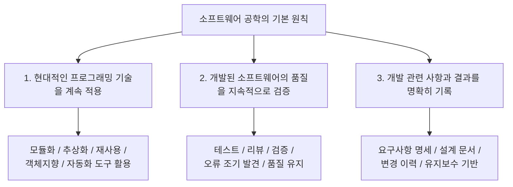

# 001 소프트웨어 공학의 기본 원칙

작성 기준일: 2026-04-13  
과목: `1과목 소프트웨어 설계`  
기준 PDF: `/Users/nes0903/Documents/study/정보처리기사/핵심요약집_2026_정보처리기사필기핵심요약.pdf`  
PDF 확인 위치: `1페이지`

## 1. 한 줄 요약

`소프트웨어 공학의 기본 원칙`은 소프트웨어를 감(感)으로 만드는 것이 아니라, `현대적인 개발기술 적용`, `지속적인 품질 검증`, `명확한 기록 유지`라는 세 축 위에서 체계적으로 개발하라는 원칙이다.

---

## 2. 한눈에 보는 구조

이 챕터에서 시험이 보고 싶은 핵심은 단순 암기보다도:

- 왜 이 세 가지가 필요한지
- 각각이 어떤 실무 활동과 연결되는지
- 서로 어떻게 이어지는지

를 이해하는 것이다.

---

## 3. PDF 기준 핵심 문장

기준 PDF에는 이 챕터가 다음 세 줄로 요약되어 있다.

- 현대적인 프로그래밍 기술을 계속적으로 적용해야 한다.
- 개발된 소프트웨어의 품질이 유지되도록 지속적으로 검증해야 한다.
- 소프트웨어 개발 관련 사항 및 결과에 대한 명확한 기록을 유지해야 한다.

이 세 줄이 사실상 시험용 정답 골격이다.

따라서 문제에서 `소프트웨어 공학의 기본 원칙`을 물으면 가장 먼저 이 3개를 떠올려야 한다.

---

## 4. 왜 이런 원칙이 나왔는가

소프트웨어 공학은 단순히 코딩 기술이 아니라, `소프트웨어 위기(software crisis)`를 해결하기 위해 발전한 분야로 이해하는 것이 좋다.

과거에는:

- 규모가 커질수록 일정 지연
- 요구사항 누락
- 버그 폭증
- 유지보수 비용 급증
- 문서 부재

같은 문제가 계속 생겼다.

그래서 소프트웨어 공학은 다음 방향으로 발전했다.

- 우연이나 개인 역량 의존을 줄이고
- 절차와 원칙을 세우고
- 결과물을 검증 가능하게 만들고
- 다른 사람이 이어받아도 유지 가능한 형태로 남기는 것

즉 `기본 원칙 3가지`는 전부 같은 목적을 향한다.

- `품질 있는 소프트웨어를 예측 가능하게 만들기`

---

## 5. 원칙 1: 현대적인 프로그래밍 기술을 계속적으로 적용해야 한다

### 5.1 의미

이 원칙은 단순히 "최신 언어만 써라"는 뜻이 아니다.

정확한 의미는:

- 시대에 맞는 개발 기법과 구조화된 방법을 사용해서
- 코드 품질, 생산성, 유지보수성을 높여야 한다

는 뜻이다.

### 5.2 여기서 말하는 현대적인 기술의 예

시험 관점에서 연결할 수 있는 개념은 아래다.

- 구조적 프로그래밍
- 모듈화
- 추상화
- 정보 은닉
- 객체지향 개념
- 재사용
- 설계 패턴
- 형상관리 도구
- 테스트 자동화

즉 이 원칙은 나중 챕터에서 나오는 개념들과 연결된다.

### 5.3 왜 중요한가

개발 기술이 낡거나 비체계적이면 아래 문제가 생긴다.

- 중복 코드 증가
- 수정 시 영향 범위 예측 어려움
- 테스트 어려움
- 협업 품질 저하

반대로 현대적인 프로그래밍 기술을 적용하면:

- 코드 구조가 명확해지고
- 재사용성이 좋아지고
- 결함을 줄이기 쉬워진다

### 5.4 시험 포인트

문제에서는 아래 식으로 바뀌어 나올 수 있다.

- "최신의 구조적 기법을 적용한다"
- "현대적인 개발 기술을 지속 적용한다"
- "효율적이고 유지보수 가능한 개발기법을 쓴다"

즉 표현이 조금 바뀌어도 본질은 동일하다.

### 5.5 헷갈리면 안 되는 점

이 원칙은 `폭포수 모형`, `나선형 모형`, `애자일` 같은 `개발 모형` 자체와는 다르다.

- 개발 모형은 `절차 프레임워크`
- 기본 원칙은 `모든 개발에 공통으로 깔리는 원리`

라고 구분해야 한다.

---

## 6. 원칙 2: 개발된 소프트웨어의 품질이 유지되도록 지속적으로 검증해야 한다

### 6.1 의미

이 원칙의 핵심은:

- 소프트웨어는 만들고 끝나는 것이 아니라
- 계속 검증되어야 한다

는 것이다.

즉:

- 요구사항을 만족하는지
- 오류가 없는지
- 성능/보안/품질 수준이 유지되는지

를 지속적으로 확인해야 한다.

### 6.2 검증과 연결되는 활동

실무와 시험 모두에서 아래 개념과 연결된다.

- 테스트
- 리뷰
- 검토
- 품질 보증(QA)
- 검증(Verification)
- 확인(Validation)

### 6.3 왜 "지속적으로"가 중요한가

많은 오답은 여기서 나온다.

검증은:

- 맨 마지막에 한 번 하는 것이 아니라
- 요구사항 단계부터 설계, 구현, 테스트, 유지보수까지 계속 일어나야 한다

즉 소프트웨어 공학은 `끝에서만 검사`가 아니라 `전 과정 품질 관리`를 지향한다.

### 6.4 시험에서 연결될 수 있는 키워드

- 단위 테스트
- 통합 테스트
- 시스템 테스트
- 인수 테스트
- 동료검토
- 워크스루
- 인스펙션
- 품질 특성

이런 챕터와 자연스럽게 이어진다.

### 6.5 자주 나오는 함정

아래 표현은 틀린 방향이다.

- 빠른 개발을 위해 테스트를 최소화한다
- 구현 후 마지막에만 검증하면 된다
- 품질은 개발자 경험으로 보장된다

소프트웨어 공학의 기본 원칙과 정반대다.

### 6.6 암기 포인트

이 원칙은 `품질 확보 = 지속적 검증`으로 기억하면 편하다.

즉:

- `현대적 기술`은 만드는 방식
- `지속적 검증`은 품질 보장 방식

이다.

---

## 7. 원칙 3: 개발 관련 사항 및 결과에 대한 명확한 기록을 유지해야 한다

### 7.1 의미

이 원칙은 `문서화`와 `기록 관리`의 중요성을 말한다.

핵심은:

- 무엇을 왜 만들었는지
- 어떻게 설계했는지
- 어떤 변경이 있었는지
- 테스트 결과가 어땠는지

를 남겨야 한다는 것이다.

### 7.2 왜 기록이 중요할까

소프트웨어는 혼자 한 번 만들고 끝나는 물건이 아니다.

현실에서는:

- 팀원이 바뀌고
- 기능이 바뀌고
- 버그가 생기고
- 유지보수가 길게 이어진다

그래서 기록이 없으면:

- 요구사항 근거를 알 수 없고
- 설계 의도를 파악하기 어렵고
- 변경 영향 분석이 힘들다

### 7.3 어떤 기록이 포함될 수 있나

실무적으로는 아래를 떠올리면 된다.

- 요구사항 명세서
- 설계 문서
- 인터페이스 정의서
- 데이터 모델
- 테스트 결과서
- 변경 이력
- 형상관리 기록
- 운영 기록

### 7.4 시험 포인트

이 원칙은 종종 아래 개념과 묶인다.

- 요구사항 명세
- 자료 사전
- UML
- 설계 문서화
- 형상관리

즉 `기록 유지`는 나중 챕터들에서 더 구체적 도구와 기법으로 확장된다.

### 7.5 자주 나오는 함정

다음 같은 생각은 오답 방향이다.

- 잘 짠 코드는 문서가 필요 없다
- 개발자는 기억하고 있으니 기록이 없어도 된다
- 구현만 되면 문서는 중요하지 않다

정보처리기사 기준으로는 전부 틀린 방향이다.

소프트웨어 공학은 `문서화와 기록`을 매우 중요하게 본다.

---

## 8. 세 원칙은 서로 어떻게 연결되는가

이 3가지는 서로 따로 노는 개념이 아니다.

해석:

- 현대적인 기술을 써야 구조가 좋아진다
- 구조가 좋아야 검증이 쉬워진다
- 검증 결과를 기록해야 나중에 유지보수가 가능하다

즉 이 3가지는 사실상 `좋은 개발의 선순환 구조`다.

---

## 9. 시험에서 어떻게 물어볼 수 있는가

### 9.1 직접 암기형

예:

- 소프트웨어 공학의 기본 원칙 3가지는?

이 경우 정답은 거의 그대로 쓰면 된다.

### 9.2 옳은/틀린 설명 고르기

예:

- 개발 결과의 문서화는 중요하지 않다
- 검증은 최종 단계에서만 한다
- 현대적인 프로그래밍 기술을 지속적으로 적용한다

이런 식이면 정답 방향은 세 원칙과 얼마나 일치하는지 보면 된다.

### 9.3 관련 개념 연결형

예:

- 기본 원칙 중 품질과 가장 직접 관련된 것
- 기록 유지 원칙과 연결되는 활동
- 현대적 기술 적용과 가까운 개념

즉 단순 문장 암기만이 아니라, 연결고리도 물을 수 있다.

---

## 10. 자주 헷갈리는 비교

| 비교 항목 | 소프트웨어 공학의 기본 원칙 | 개발 모형 |
|---|---|---|
| 의미 | 모든 개발에 공통으로 적용되는 기본 방향 | 개발 절차를 어떤 방식으로 진행할지에 대한 틀 |
| 예 | 현대적 기술 적용, 지속적 검증, 명확한 기록 | 폭포수, 나선형, 애자일 |
| 성격 | 원리/철학 | 프로세스/방법론 |

| 비교 항목 | 기본 원칙의 `지속적 검증` | 테스트 단계 |
|---|---|---|
| 의미 | 전 개발 과정에서 품질을 계속 확인 | 구현 후 특정 시험 활동 |
| 범위 | 요구사항 ~ 유지보수 전체 | 보통 테스트 프로세스 중심 |

| 비교 항목 | 기본 원칙의 `기록 유지` | 단순 문서 작성 |
|---|---|---|
| 의미 | 개발 관련 과정과 결과를 명확하게 남김 | 문서 몇 개 만드는 행위 자체 |
| 핵심 | 유지보수와 추적 가능성 | 형식적 작성일 수도 있음 |

---

## 11. 외워둘 문장형 정리

시험 직전 빠르게 떠올릴 수 있게 문장형으로 정리하면 아래와 같다.

- 소프트웨어 공학은 현대적인 프로그래밍 기술을 지속 적용해야 한다.
- 개발된 소프트웨어의 품질이 유지되도록 지속적으로 검증해야 한다.
- 개발 관련 사항과 결과에 대한 명확한 기록을 유지해야 한다.

이 세 문장을 그대로 말할 수 있으면 기본 암기 축은 잡힌다.

---

## 12. 암기 포인트

### 12.1 3단어 키워드로 외우기

- `기술`
- `검증`
- `기록`

### 12.2 더 길게 외우기

- `현대적 기술 적용`
- `품질의 지속 검증`
- `명확한 기록 유지`

### 12.3 기억 연결법

좋은 소프트웨어를 만들려면:

1. 좋은 방식으로 만들고
2. 계속 검사하고
3. 나중에 볼 수 있게 남겨야 한다

이 흐름으로 기억하면 된다.

---

## 13. 빠른 복습

- 소프트웨어 공학의 기본 원칙은 `현대적 기술`, `지속 검증`, `명확한 기록` 3개다.
- 이 원칙은 개발 모형(폭포수/나선형/애자일)과 다르다.
- `지속적 검증`은 전 과정 품질 확인이라는 뜻이다.
- `명확한 기록 유지`는 문서화, 변경 이력, 유지보수 기반과 연결된다.
- 시험에서는 문장 암기형 + 연결형 + 옳은/틀린 설명형으로 나올 수 있다.

---

## 14. 참고 링크

- Q-Net 정보처리기사 종목 페이지: [시험 구조와 출제 범위 큰 틀](https://www.q-net.or.kr/crf005.do?id=crf00503s02&jmCd=1320&jmInfoDivCcd=B0)
- IBM, What is software engineering?: [소프트웨어 공학의 목적과 품질/협업 관점](https://www.ibm.com/think/topics/software-engineering)
- GeeksforGeeks, Introduction to Software Engineering: [소프트웨어 공학의 기본 개념과 원칙 정리](https://www.geeksforgeeks.org/software-engineering-introduction-to-software-engineering/)

<!-- study-links:start -->
## 관련 문서

- `폭포수 모형`: [[정보처리기사/1과목 소프트웨어 설계/002 폭포수 모형/002 폭포수 모형|002 폭포수 모형]]
- `나선형 모형`: [[정보처리기사/1과목 소프트웨어 설계/003 나선형 모형/003 나선형 모형|003 나선형 모형]]
- `단위 테스트`: [[정보처리기사/2과목 소프트웨어 개발/084 단위 테스트(Unit Test)/084 단위 테스트(Unit Test)|084 단위 테스트(Unit Test)]]
- `통합 테스트`: [[정보처리기사/2과목 소프트웨어 개발/087 통합 테스트(Integration Test)/087 통합 테스트(Integration Test)|087 통합 테스트(Integration Test)]]
- `품질 특성`: [[정보처리기사/1과목 소프트웨어 설계/024 ISO IEC 9126의 품질 특성/024 ISO IEC 9126의 품질 특성|024 ISO/IEC 9126의 품질 특성]]
- `정보 은닉`: [[정보처리기사/1과목 소프트웨어 설계/028 정보 은닉/028 정보 은닉|028 정보 은닉]]
- `uml`: [[정보처리기사/1과목 소프트웨어 설계/013 UML/013 UML|013 UML]]
- `모듈화`: [[정보처리기사/1과목 소프트웨어 설계/026 모듈화/026 모듈화|026 모듈화]]
<!-- study-links:end -->
