# 002 폭포수 모형

작성 기준일: 2026-05-02  
과목: `1과목 소프트웨어 설계`  
기준 PDF: `/Users/nes0903/Documents/study/정보처리기사/핵심요약집_2026_정보처리기사필기핵심요약.pdf`  
PDF 확인 위치: `1페이지`  
검색 보강: Royce 1970 논문, IBM SDLC/Waterfall 설명, IEEE/ISO/IEC 12207 생명주기 표준 설명

---

## 1. 한 줄 요약

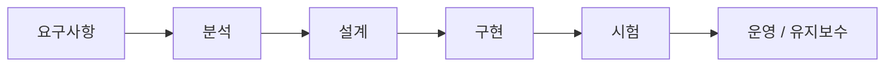

- `폭포수 모형(Waterfall Model)`은 소프트웨어 개발 단계를 위에서 아래로 떨어지는 폭포처럼 `순차적으로` 진행하는 전통적 생명주기 모형이다.
- 핵심은 다음이다.
  - 한 단계가 끝나야 다음 단계로 넘어간다.
  - 각 단계의 산출물을 명확히 남긴다.
  - 단계별 검토와 승인을 거친다.
  - 이전 단계로 되돌아가기 어렵다는 전제를 가진다.
- 정보처리기사 시험에서는 보통 아래 키워드로 잡으면 된다.
  - `선형 순차적`
  - `고전적 생명 주기 모형`
  - `단계별 산출물 명확`
  - `문서화 중요`
  - `요구사항 변경 반영 어려움`
  - `애자일과 대조`

---

## 2. 한눈에 보는 흐름

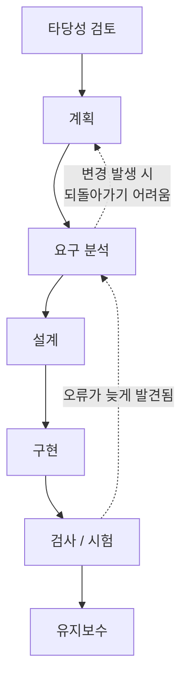

- 시험 교재와 자료마다 단계명은 조금씩 다르다.
- 정보처리기사에서 자주 보는 흐름은 아래처럼 이해하면 된다.
  - `타당성 검토`
  - `계획`
  - `요구 분석`
  - `설계`
  - `구현`
  - `검사 / 시험`
  - `유지보수`
- IBM의 SDLC 설명에서는 일반적인 생명주기 단계를 다음처럼 설명한다.
  - `Planning`
  - `Analysis`
  - `Design`
  - `Coding`
  - `Testing`
  - `Deployment`
  - `Maintenance`
- Royce의 1970년 논문에서 보이는 고전적 흐름은 다음 계열이다.
  - `System Requirements`
  - `Software Requirements`
  - `Analysis`
  - `Program Design`
  - `Coding`
  - `Testing`
  - `Operations`
- 이름은 조금씩 달라도 시험 관점의 핵심은 동일하다.
  - `앞 단계 완료 -> 산출물 검토 -> 다음 단계 진행`

---

## 3. PDF 기준 핵심 문장

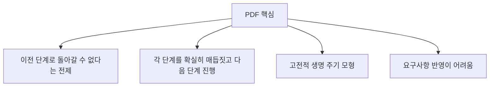

- 기준 PDF의 `폭포수 모형002`에서 잡아야 할 핵심은 세 가지다.
  - 이전 단계로 돌아가기 어렵다는 전제 아래 진행한다.
  - 각 단계를 확실히 끝내고 다음 단계로 넘어간다.
  - 요구사항 변경을 반영하기 어렵다.
- 이 세 문장이 시험용 정답 골격이다.
- 특히 `요구사항 반영이 어렵다`는 단점은 매우 중요하다.
  - 요구사항을 초기에 확정하고 출발하기 때문이다.
  - 개발 중간이나 후반에 요구사항이 바뀌면 앞 단계 산출물을 다시 고쳐야 한다.
  - 설계, 구현, 테스트 계획까지 연쇄적으로 변경되므로 비용이 커진다.

### 인물 관련 주의

- 기준 PDF에는 `보헴` 관련 표현이 들어 있다.
- 다만 일반 소프트웨어공학 문헌과 IBM 설명에서는 `Winston W. Royce`의 1970년 논문을 폭포수 접근의 대표적 기원으로 설명한다.
- 정보처리기사 문제풀이에서는 다음처럼 구분해서 외우는 것이 안전하다.
  - `폭포수 모형`: 고전적, 선형 순차적, 요구사항 변경 어려움
  - `나선형 모형`: 보헴, 위험 분석, 반복적/점진적
- 객관식에서 `보헴이 제안`, `위험 분석`, `나선을 따라 반복`이 같이 나오면 보통 `나선형 모형`을 의심해야 한다.

---

## 4. 개념 설명

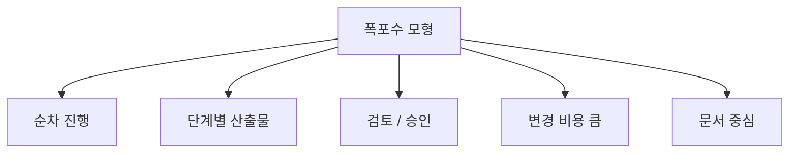

### 4.1 폭포수 모형이란

- 폭포수 모형은 소프트웨어 개발을 여러 단계로 나누고, 각 단계를 순서대로 진행하는 개발 모형이다.
- 물이 위에서 아래로 흐르듯이:
  - 요구사항에서 설계로
  - 설계에서 구현으로
  - 구현에서 시험으로
  - 시험에서 운영/유지보수로
  흐른다고 해서 `waterfall`이라고 부른다.
- 가장 오래되고 전통적인 소프트웨어 생명주기 모형으로 설명된다.
- `고전적 생명 주기 모형`이라는 표현이 나오면 폭포수 모형을 떠올리면 된다.

### 4.2 왜 선형 순차적 모형인가

- 폭포수 모형은 단계가 병렬적으로 섞이는 방식이 아니다.
- 보통 한 단계의 결과물을 확정해야 다음 단계로 넘어간다.
- 예:
  - 요구사항 명세서가 확정되어야 설계가 가능하다.
  - 설계 문서가 확정되어야 구현이 가능하다.
  - 구현이 완료되어야 본격적인 시스템 테스트가 가능하다.
- 그래서 `선형 순차적 모형`이라고 한다.

### 4.3 산출물이 중요한 이유

- 폭포수 모형은 문서화와 산출물을 중요하게 본다.
- 각 단계는 다음 단계의 입력이 된다.
- 예:
  - 요구사항 명세서 -> 설계의 입력
  - 설계 명세서 -> 구현의 입력
  - 구현 결과물 -> 시험의 입력
  - 시험 결과서 -> 인수/운영 판단의 근거
- 즉 한 단계 산출물이 부실하면 뒤 단계가 모두 흔들린다.

### 4.4 검토와 승인

- 폭포수 모형에서는 단계가 끝날 때 검토와 승인을 거친다.
- 승인된 산출물은 다음 단계의 기준선, 즉 baseline 역할을 한다.
- 이 구조는 관리가 쉽다는 장점이 있지만, 변경에는 약하다.

---

## 5. 단계별 정리

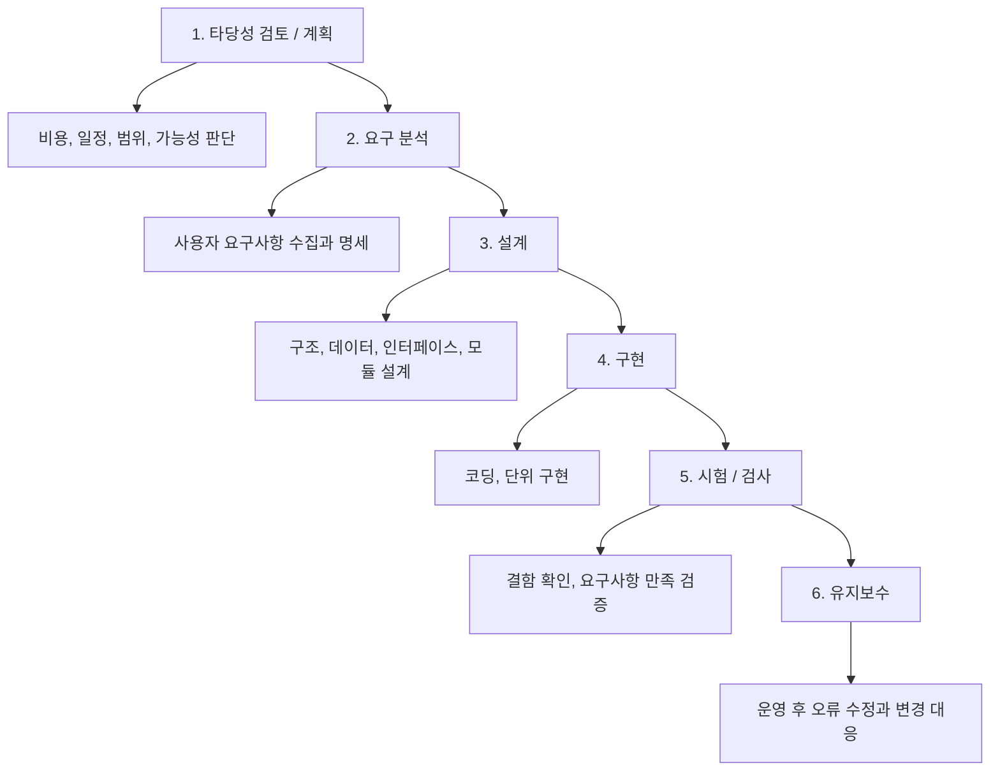

| 단계 | 핵심 활동 | 대표 산출물 | 시험 포인트 |
|---|---|---|---|
| 타당성 검토 | 개발 가능성, 비용, 일정, 효과 검토 | 타당성 검토서 | 할지 말지 판단 |
| 계획 | 범위, 일정, 인력, 위험, 관리 계획 수립 | 프로젝트 계획서 | 전체 개발 기준 |
| 요구 분석 | 사용자 요구 파악, 기능/비기능 요구 정의 | 요구사항 명세서 | 변경이 어려우므로 초기에 중요 |
| 설계 | 시스템 구조, 모듈, DB, 인터페이스 설계 | 설계 명세서 | 구현 전 구조 확정 |
| 구현 | 설계에 따라 코드 작성 | 프로그램 코드 | 설계 산출물 기반 |
| 시험/검사 | 오류 발견, 요구사항 만족 확인 | 테스트 결과서 | 오류가 늦게 발견될 수 있음 |
| 유지보수 | 운영 후 수정, 개선, 환경 변화 대응 | 변경 이력, 패치 | 폭포수에도 유지보수 단계가 있음 |

### 단계별 암기 감각

- `요구 분석`: 무엇을 만들 것인가
- `설계`: 어떻게 만들 것인가
- `구현`: 실제로 만든다
- `시험`: 제대로 만들었는지 확인한다
- `유지보수`: 운영 중 고친다

---

## 6. 장점과 단점

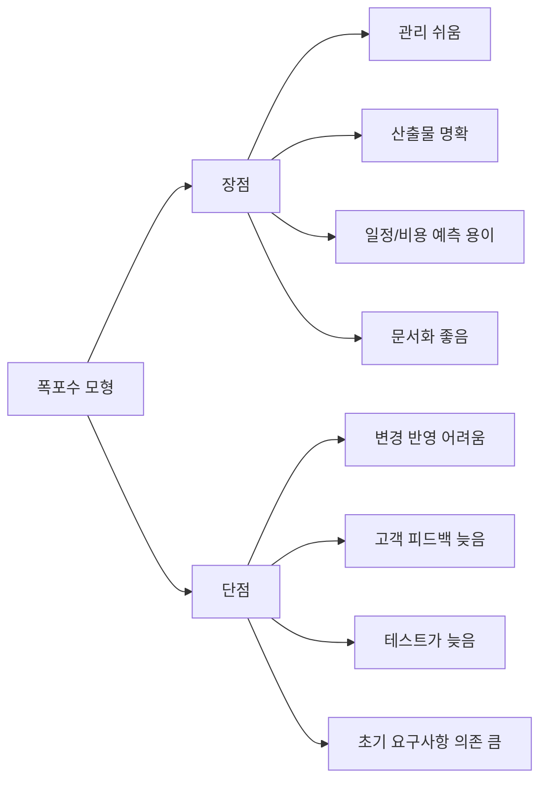

### 6.1 장점

- 절차가 단순하고 이해하기 쉽다.
- 단계별 산출물이 명확하다.
- 관리와 통제가 쉽다.
- 일정과 비용 예측이 비교적 쉽다.
- 문서가 잘 남기 때문에 인수인계와 유지보수 근거가 생긴다.
- 요구사항이 안정적인 프로젝트에 적합하다.
- 규제, 승인, 감사가 중요한 프로젝트에서는 단계별 문서와 승인 절차가 장점이 될 수 있다.

### 6.2 단점

- 요구사항 변경에 약하다.
- 개발 후반에야 실제 동작하는 소프트웨어를 확인할 수 있다.
- 고객 피드백이 늦게 들어온다.
- 테스트가 뒤쪽에 몰리면 결함 발견도 늦어진다.
- 앞 단계 오류가 뒤 단계로 전파될 수 있다.
- 한 단계 지연이 전체 일정 지연으로 이어지기 쉽다.
- 불확실성이 큰 프로젝트에는 적합하지 않다.

### 6.3 시험에서 가장 중요한 단점

- `요구사항 변경 반영 어려움`
- `초기 단계 오류가 뒤늦게 발견됨`
- `개발 중간에 사용자 피드백 반영이 어려움`

이 세 가지는 폭포수 모형의 약점으로 자주 나온다.

---

## 7. 언제 적합하고 언제 부적합한가

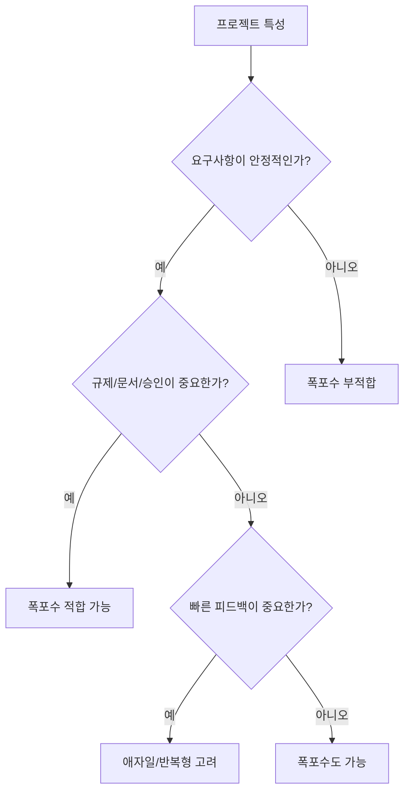

### 7.1 적합한 경우

- 요구사항이 명확하고 변경 가능성이 낮다.
- 산출물과 문서 승인이 중요하다.
- 계약 범위가 고정되어 있다.
- 일정, 비용, 범위를 초기에 예측해야 한다.
- 규제 산업, 공공 프로젝트, 외주 계약처럼 단계별 검수와 문서가 중요한 상황이다.

### 7.2 부적합한 경우

- 요구사항이 계속 바뀐다.
- 사용자가 직접 써보며 요구사항을 구체화해야 한다.
- 시장 반응을 빠르게 확인해야 한다.
- UI/UX처럼 피드백 기반 개선이 중요하다.
- 기술 불확실성이 크다.
- 리스크가 크고 반복적인 위험 분석이 필요하다.

### 7.3 실무 감각

- 폭포수는 나쁜 모형이 아니라, `변경이 적고 통제가 중요한 상황`에 맞는 모형이다.
- 반대로 요구사항이 불명확한 서비스 제품 개발에는 애자일/반복형 접근이 더 자연스럽다.

---

## 8. 시험에서 헷갈리는 비교

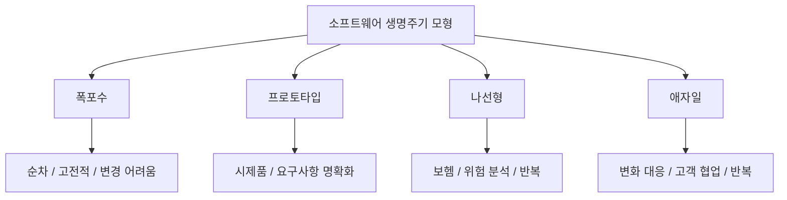

| 구분 | 핵심 키워드 | 장점 | 단점/주의 |
|---|---|---|---|
| 폭포수 모형 | 선형 순차, 고전적, 단계별 산출물 | 관리 쉬움, 문서 명확 | 요구사항 변경 어려움 |
| 프로토타입 모형 | 시제품, 사용자 요구 구체화 | 요구사항 이해 도움 | 시제품이 실제 제품으로 오해될 수 있음 |
| 나선형 모형 | 보헴, 위험 분석, 반복/점진 | 위험 관리에 강함 | 비용과 관리 복잡도 큼 |
| 애자일 모형 | 반복, 고객 협업, 변화 대응 | 요구사항 변화에 유연 | 문서/계약/예측 관리가 약할 수 있음 |

### 8.1 폭포수 vs 프로토타입

- 폭포수:
  - 처음에 요구사항을 확정하려고 한다.
  - 그 요구사항을 기준으로 설계와 구현을 진행한다.
- 프로토타입:
  - 요구사항이 불명확할 때 시제품을 만들어 사용자 반응을 본다.
  - 요구사항을 더 정확히 파악하는 데 유리하다.
- 시험 포인트:
  - `요구사항 파악용 시제품`이 나오면 프로토타입이다.
  - `단계별로 확실히 매듭`이 나오면 폭포수다.

### 8.2 폭포수 vs 나선형

- 폭포수:
  - 순차 진행
  - 변경에 약함
  - 위험 분석이 핵심은 아님
- 나선형:
  - 계획 수립 -> 위험 분석 -> 개발 및 검증 -> 고객 평가 반복
  - 위험 분석이 핵심
  - 보헴이 제안
- 시험 포인트:
  - `위험 분석`이 나오면 거의 나선형이다.
  - `보헴`이 나오면 나선형을 먼저 의심한다.

### 8.3 폭포수 vs 애자일

- 폭포수:
  - 계획과 문서 중심
  - 초기 요구사항 확정 중시
  - 변화 대응이 어려움
- 애자일:
  - 고객 협업과 작동 소프트웨어 중심
  - 짧은 주기로 반복 개발
  - 요구사항 변화에 유연
- 시험 포인트:
  - `계획을 따르기보다 변화에 반응`은 애자일 가치다.
  - `이전 단계로 돌아가기 어렵다`는 폭포수 특징이다.

---

## 9. 자주 나오는 함정

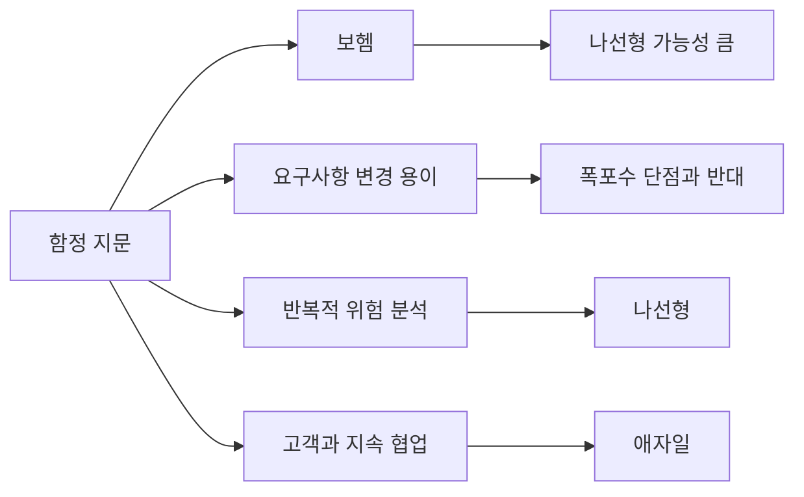

- `폭포수 모형은 요구사항 변경 반영이 쉽다`
  - 틀린 설명이다.
  - 폭포수는 요구사항 변경 반영이 어렵다.
- `폭포수 모형은 위험 분석을 반복한다`
  - 나선형 모형 설명에 가깝다.
- `폭포수 모형은 고객 평가를 반복한다`
  - 나선형 또는 애자일 계열 설명에 가깝다.
- `폭포수 모형은 시제품을 만들어 요구사항을 명확히 한다`
  - 프로토타입 모형 설명이다.
- `폭포수 모형은 요구사항 변화에 유연하게 대응한다`
  - 애자일 모형 설명이다.
- `보헴이 제안한 위험 분석 중심 모형`
  - 나선형 모형이다.
- `고전적 생명 주기 모형`
  - 폭포수 모형이다.

---

## 10. 예시로 이해하기

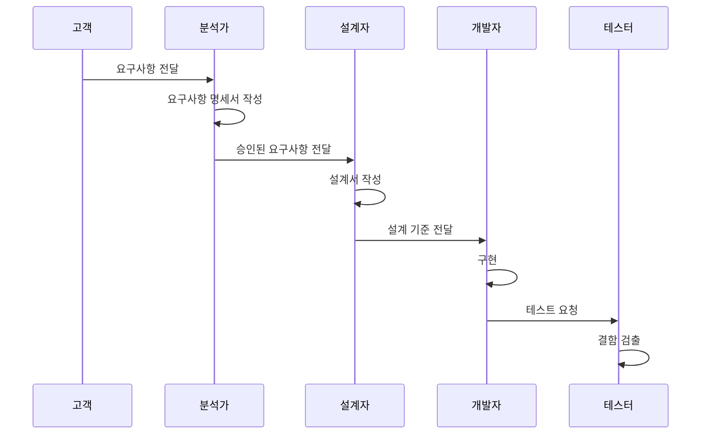

### 10.1 폭포수에 잘 맞는 예

- 회사 내부의 급여 계산 시스템을 만든다고 하자.
- 규칙이 명확하다.
  - 근무시간
  - 세금 계산
  - 공제 항목
  - 급여 지급일
  - 보고서 양식
- 법/규정이 정해져 있고 변경이 잦지 않다면:
  - 요구사항을 문서로 확정하고
  - 설계하고
  - 구현하고
  - 테스트하고
  - 운영하는 방식이 비교적 잘 맞을 수 있다.

### 10.2 폭포수에 잘 안 맞는 예

- 새로운 모바일 앱을 만든다고 하자.
- 사용자가 어떤 UI를 좋아할지 모른다.
- 핵심 기능도 시장 반응을 보며 바뀔 가능성이 크다.
- 이 경우 처음에 모든 요구사항을 확정하기 어렵다.
- 폭포수로 하면:
  - 개발 후반에야 사용자가 실제 화면을 본다.
  - 피드백 반영 비용이 커진다.
  - 시장 변화에 늦게 대응한다.
- 이런 상황은 애자일이나 프로토타입 접근이 더 적합하다.

---

## 11. 암기 포인트

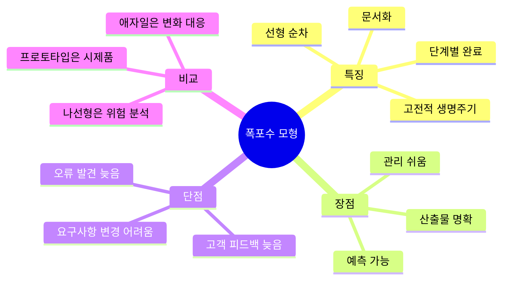

- 한 문장 암기:
  - `폭포수 모형은 각 단계를 확실히 끝낸 뒤 다음 단계로 진행하는 선형 순차적 고전 생명주기 모형이다.`
- 장점 암기:
  - `문서`
  - `관리`
  - `예측`
  - `산출물`
- 단점 암기:
  - `변경 어려움`
  - `피드백 늦음`
  - `오류 발견 늦음`
- 비교 암기:
  - `폭포수 = 순차`
  - `프로토타입 = 시제품`
  - `나선형 = 보헴 + 위험 분석`
  - `애자일 = 변화 대응 + 고객 협업`

---

## 12. 빠른 복습

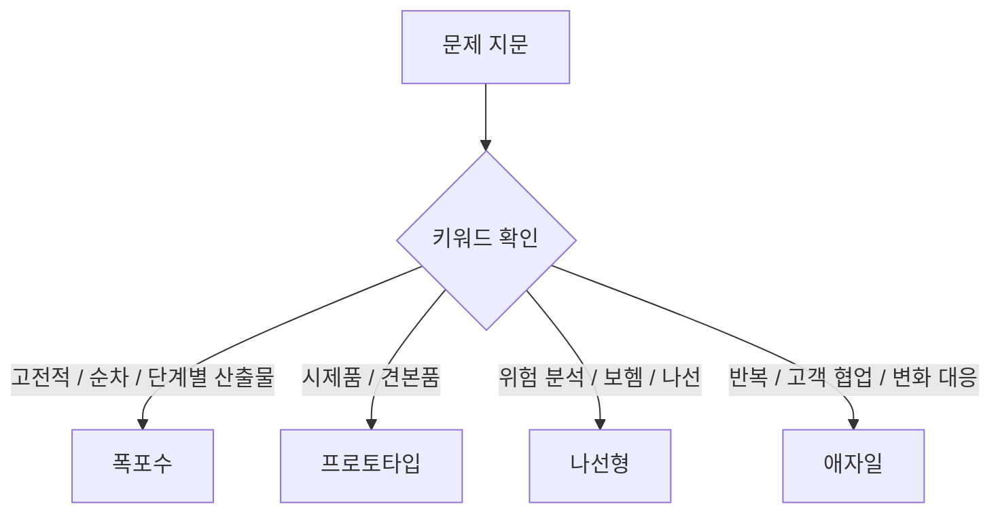

- `고전적 생명주기 모형`이라고 하면 폭포수다.
- `이전 단계로 돌아가기 어렵다`고 하면 폭포수다.
- `요구사항 변경 반영이 어렵다`고 하면 폭포수의 단점이다.
- `단계별 산출물이 명확하다`고 하면 폭포수의 특징/장점이다.
- `위험 분석`이 나오면 나선형이다.
- `시제품`이 나오면 프로토타입이다.
- `변화에 유연`, `고객과 협업`, `짧은 반복`이 나오면 애자일이다.

---

## 13. 참고 링크

- 기준 PDF: `/Users/nes0903/Documents/study/정보처리기사/핵심요약집_2026_정보처리기사필기핵심요약.pdf`
- [IBM - Agile vs. Waterfall](https://www.ibm.com/think/topics/agile-vs-waterfall)
- [IBM - What is the Software Development Lifecycle?](https://www.ibm.com/think/topics/sdlc)
- [IEEE SA - IEEE/ISO/IEC 12207-2026](https://standards.ieee.org/ieee/12207/11416/)
- [Royce 1970 - Managing the Development of Large Software Systems](https://www.praxisframework.org/files/royce1970.pdf)
- [Atlassian - Waterfall Methodology](https://www.atlassian.com/agile/project-management/waterfall-methodology)
