# 003 나선형 모형

작성 기준일: 2026-05-02  
과목: `1과목 소프트웨어 설계`  
기준 PDF: `/Users/nes0903/Documents/study/정보처리기사/핵심요약집_2026_정보처리기사필기핵심요약.pdf`  
PDF 확인 위치: `1페이지`  
검색 보강: Boehm 1988 논문 정보, IBM SDLC/Spiral 설명, SEBoK/IEEE Xplore 서지 정보

---

## 1. 한 줄 요약

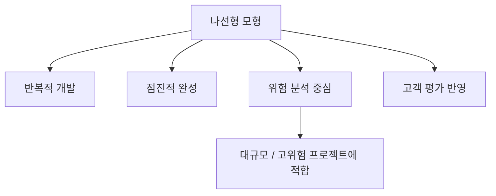

- `나선형 모형(Spiral Model)`은 소프트웨어를 한 번에 완성하는 것이 아니라, `계획 수립 -> 위험 분석 -> 개발 및 검증 -> 고객 평가`를 반복하면서 점진적으로 완성도를 높이는 개발 모형이다.
- 가장 중요한 키워드는 `위험 분석`이다.
- 정보처리기사 시험에서는 다음 표현이 나오면 거의 나선형 모형을 의심하면 된다.
  - `보헴(Boehm)`
  - `위험 분석`
  - `나선을 따라 반복`
  - `점진적 개발`
  - `고객 평가 반복`
  - `대규모 시스템`

---

## 2. PDF 기준 핵심

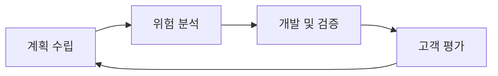

- 기준 PDF의 `나선형 모형003`은 아래 두 문장으로 요약된다.
  - 나선을 따라 돌듯이 점진적으로 완벽한 최종 소프트웨어를 개발한다.
  - `계획 수립 -> 위험 분석 -> 개발 및 검증 -> 고객 평가` 과정이 반복적으로 수행된다.
- 이 두 문장이 시험용 기본 골격이다.
- 즉, 나선형 모형은:
  - `한 번의 직선형 절차`가 아니라
  - `반복되는 순환 구조`이고
  - 매 반복마다 `위험을 식별/분석/대응`하면서
  - 점점 완성도 높은 소프트웨어로 발전한다.

---

## 3. 개념 설명

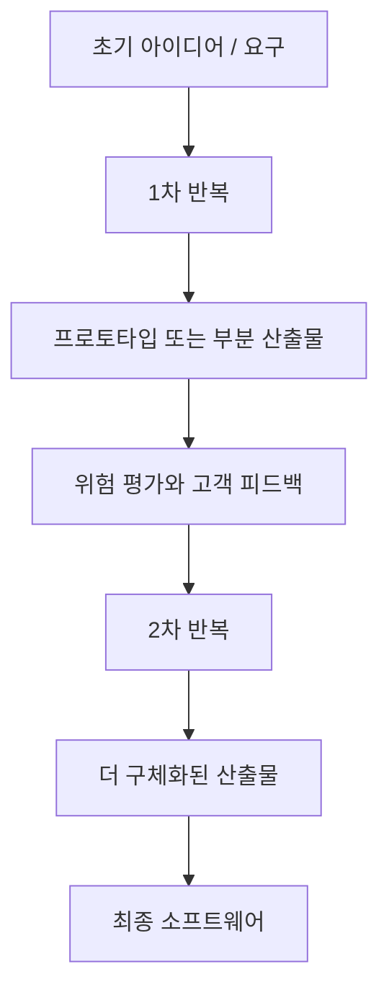

### 3.1 나선형 모형이란

- 나선형 모형은 `반복형 개발`과 `위험 관리`를 결합한 소프트웨어 생명주기 모형이다.
- Barry W. Boehm이 1988년 IEEE Computer에 발표한 `A Spiral Model of Software Development and Enhancement`가 대표적인 원전으로 언급된다.
- IBM의 소프트웨어 개발 모형 설명도 Spiral을 `Waterfall`의 단계성, `Iterative`의 반복성을 함께 갖는 방식으로 설명한다.
- 나선형이라는 이름은 개발이 중심에서 바깥쪽으로 돌며 확장되는 형태에서 나온다.
  - 중심에 가까운 초기 반복은 요구와 가능성을 탐색한다.
  - 바깥쪽 반복으로 갈수록 비용, 산출물, 기능, 검증 수준이 커진다.

### 3.2 핵심은 위험 주도 개발

- 나선형 모형은 단순히 "반복한다"가 핵심이 아니다.
- 진짜 핵심은 `위험이 큰 부분을 먼저 식별하고 줄인다`는 것이다.
- 예:
  - 새로운 기술을 써야 하는가?
  - 성능 목표를 달성할 수 있는가?
  - 고객 요구가 불명확한가?
  - 일정과 비용이 현실적인가?
  - 보안/안정성 요구가 높은가?
- 이런 위험을 매 반복마다 분석하고, 필요한 경우 prototype, simulation, proof of concept, 검토, 테스트로 위험을 줄인다.

### 3.3 왜 점진적인가

- 반복을 한 번 돌 때마다 산출물이 조금씩 더 구체화된다.
- 초기에는 요구사항 개념, 가능성 검토, prototype 수준일 수 있다.
- 뒤로 갈수록 설계, 구현, 테스트, 운영 가능한 제품에 가까워진다.
- 그래서 `점진적으로 완벽한 최종 소프트웨어를 개발`한다고 설명한다.

---

## 4. 단계별 흐름

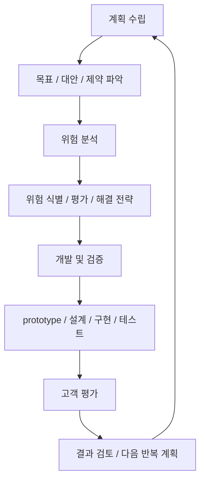

### 4.1 계획 수립

- 이번 반복에서 달성할 목표를 정한다.
- 요구사항, 대안, 제약조건을 정리한다.
- 시험용 표현:
  - `계획 수립`
  - `목표 설정`
  - `대안 검토`
  - `제약 조건 확인`

### 4.2 위험 분석

- 나선형 모형의 가장 중요한 단계다.
- 목표 달성을 방해할 수 있는 위험을 찾고, 그 영향을 평가한다.
- 위험을 줄이기 위한 전략을 세운다.
- 예:
  - 기술 검증 prototype 제작
  - 성능 benchmark
  - 보안 검토
  - 일정/비용 재추정
  - 사용자 요구사항 재확인

### 4.3 개발 및 검증

- 위험 대응 결과를 바탕으로 실제 개발 산출물을 만든다.
- 산출물은 반복 단계에 따라 달라질 수 있다.
  - 개념 prototype
  - 요구사항 명세
  - 설계안
  - 부분 기능
  - 테스트 가능한 build
  - 최종 제품
- 만든 산출물이 목표를 만족하는지 검증한다.

### 4.4 고객 평가

- 개발 및 검증 결과를 고객 또는 사용자 관점에서 평가한다.
- 고객 평가 결과는 다음 반복의 입력이 된다.
- 이 단계 때문에 나선형 모형은 폭포수보다 요구사항 변화와 피드백 반영에 유리하다.
- 다만 애자일처럼 짧고 가벼운 반복만을 의미하는 것은 아니다.

---

## 5. Boehm 원 논문 기준으로 이해하기

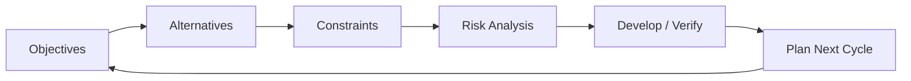

- Boehm의 Spiral Model은 흔히 `risk-driven approach`로 설명된다.
- 1988년 IEEE Computer 논문 정보:
  - 저자: Barry W. Boehm
  - 제목: `A Spiral Model of Software Development and Enhancement`
  - 게재: `Computer`, 21권 5호, 61-72쪽
  - DOI: `10.1109/2.59`
- 원 논문 계열 설명을 시험식 표현으로 바꾸면 다음처럼 대응된다.

| 원 논문식 관점 | 정보처리기사식 표현 | 의미 |
|---|---|---|
| 목표, 대안, 제약 결정 | 계획 수립 | 이번 반복에서 무엇을 할지 정함 |
| 대안 평가와 위험 해결 | 위험 분석 | 가장 큰 불확실성과 위험을 먼저 줄임 |
| 다음 수준 제품 개발/검증 | 개발 및 검증 | 산출물을 만들고 검증함 |
| 다음 단계 계획과 이해관계자 검토 | 고객 평가 | 결과를 평가하고 다음 반복에 반영함 |

- 즉, 시험에서는 간단히 `계획 -> 위험 -> 개발/검증 -> 고객 평가`로 외우되, 실제 의미는 `위험이 큰 결정을 반복적으로 줄여 가는 개발 방식`으로 이해하면 된다.

---

## 6. 장점과 단점

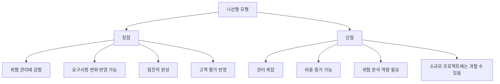

### 6.1 장점

- 위험을 초기에 발견하고 대응하기 좋다.
- 고객 평가를 반복하므로 요구사항 변경을 어느 정도 반영할 수 있다.
- prototype이나 부분 산출물을 통해 불확실성을 줄일 수 있다.
- 대규모, 고비용, 고위험 프로젝트에 적합하다.
- 반복할수록 제품 완성도가 높아진다.

### 6.2 단점

- 프로젝트 관리가 복잡하다.
- 반복마다 계획, 위험 분석, 검증, 평가가 필요하므로 비용이 커질 수 있다.
- 위험 분석을 제대로 할 전문가가 필요하다.
- 작은 프로젝트에는 절차가 과하게 무거울 수 있다.
- 위험을 잘못 식별하면 나선형 모형의 장점이 줄어든다.

### 6.3 시험에서 자주 나오는 장단점

- 장점:
  - 위험 분석에 강하다.
  - 점진적 개발이 가능하다.
  - 고객 평가를 반영할 수 있다.
- 단점:
  - 비용이 많이 들 수 있다.
  - 관리가 어렵다.
  - 위험 분석 전문가가 필요하다.

---

## 7. 적합한 경우와 부적합한 경우

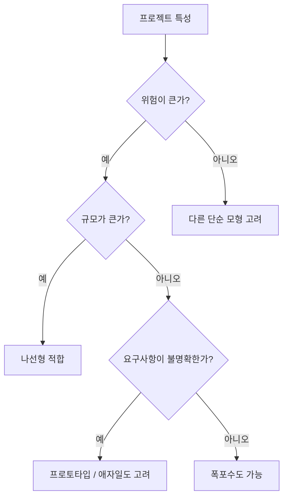

### 7.1 적합한 경우

- 프로젝트 규모가 크다.
- 기술적 불확실성이 크다.
- 비용 실패 위험이 크다.
- 요구사항이 완전히 명확하지 않다.
- 고객 평가를 반복적으로 반영해야 한다.
- 보안, 성능, 안정성처럼 위험을 조기에 검증해야 하는 품질 요구가 크다.

### 7.2 부적합한 경우

- 프로젝트가 작고 단순하다.
- 요구사항이 이미 명확하고 거의 변하지 않는다.
- 위험 분석을 할 역량이나 시간이 부족하다.
- 빠른 납품이 우선이고 정교한 위험 관리 절차를 적용하기 어렵다.

---

## 8. 시험에서 헷갈리는 비교

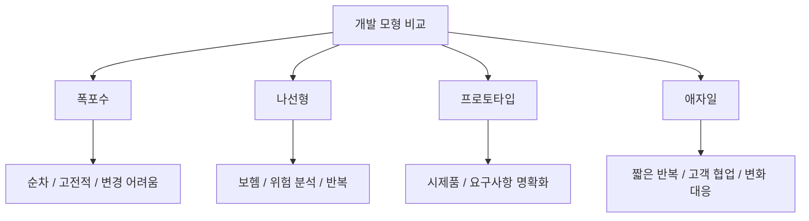

| 구분 | 핵심 단서 | 특징 | 시험 함정 |
|---|---|---|---|
| 폭포수 모형 | `순차`, `고전적`, `단계별 완료` | 한 단계 완료 후 다음 단계 | 요구사항 변경에 약함 |
| 나선형 모형 | `보헴`, `위험 분석`, `반복`, `나선` | 위험을 분석하며 점진 개발 | 단순 반복이 아니라 위험 중심 |
| 프로토타입 모형 | `시제품`, `견본`, `사용자 요구 파악` | 시제품으로 요구사항 구체화 | 최종 제품이 아니라 이해 도구 |
| 애자일 모형 | `변화 대응`, `고객 협업`, `짧은 주기` | 빠른 반복과 피드백 | 문서/계획을 완전히 버리는 뜻 아님 |

### 8.1 폭포수와 나선형

- 폭포수:
  - 순차적이다.
  - 이전 단계로 돌아가기 어렵다.
  - 요구사항 변경 반영이 어렵다.
- 나선형:
  - 반복적이다.
  - 위험 분석을 매 반복의 핵심으로 둔다.
  - 고객 평가를 다음 반복에 반영한다.

### 8.2 프로토타입과 나선형

- 프로토타입:
  - 요구사항을 명확히 하기 위해 시제품을 만든다.
  - 사용자가 요구를 더 잘 이해하도록 돕는 데 초점이 있다.
- 나선형:
  - prototype을 사용할 수는 있지만, 핵심 목적은 위험 분석과 위험 감소다.
  - prototype은 위험 대응 수단 중 하나일 뿐이다.

### 8.3 애자일과 나선형

- 공통점:
  - 반복적이다.
  - 피드백을 반영한다.
- 차이점:
  - 나선형은 `위험 분석`과 `대규모/고위험 프로젝트 관리` 색채가 강하다.
  - 애자일은 `짧은 반복`, `작동 소프트웨어`, `고객 협업`, `변화 대응` 색채가 강하다.

---

## 9. 자주 나오는 함정

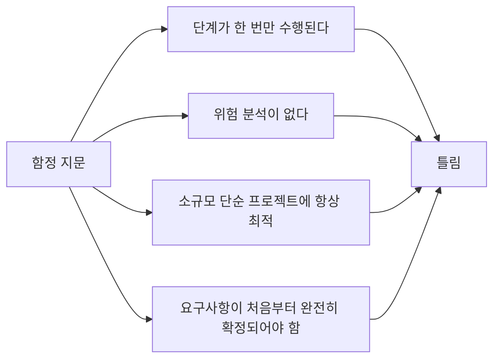

- `나선형 모형은 순차적으로 한 번만 수행된다`
  - 틀리다.
  - 나선형 모형은 반복 수행된다.
- `나선형 모형은 위험 분석과 관계가 없다`
  - 틀리다.
  - 위험 분석이 가장 중요한 특징이다.
- `나선형 모형은 폭포수보다 항상 단순하다`
  - 틀리다.
  - 일반적으로 관리가 더 복잡하다.
- `나선형 모형은 소규모 프로젝트에 항상 적합하다`
  - 틀리다.
  - 소규모 프로젝트에는 비용과 절차가 과할 수 있다.
- `나선형 모형은 요구사항 변경 반영이 폭포수보다 어렵다`
  - 일반적으로 틀린 설명이다.
  - 반복과 고객 평가가 있어 폭포수보다 변경 반영이 유리한 편이다.

---

## 10. 예시로 이해하기

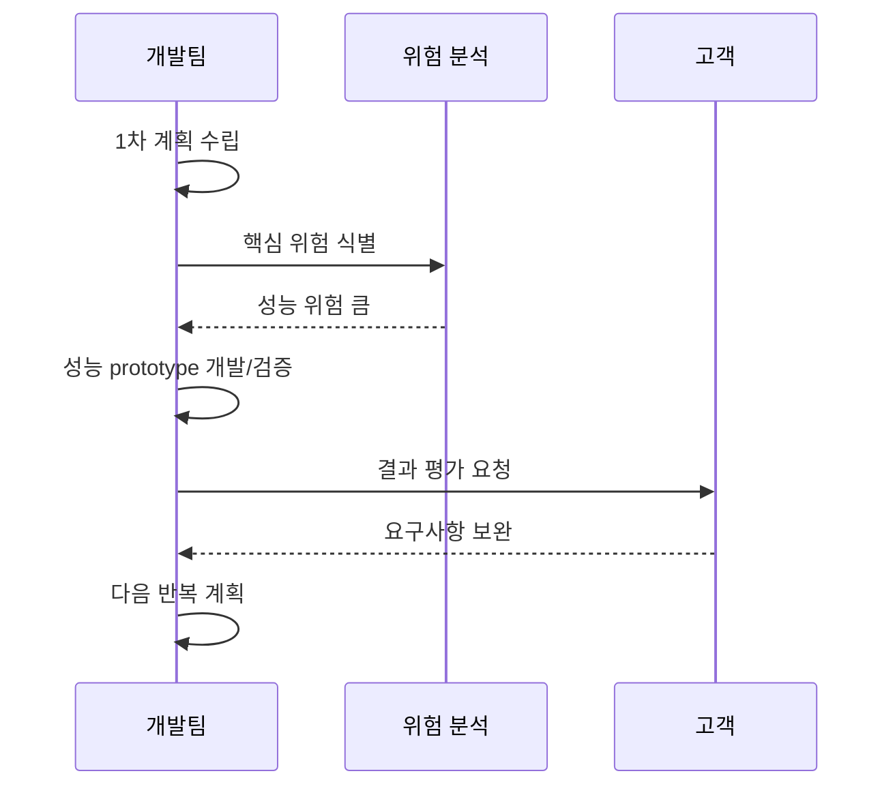

### 10.1 예시 상황

- 금융 거래 시스템을 개발한다고 하자.
- 초기에 다음 위험이 있다.
  - 초당 거래량을 처리할 수 있는가?
  - 보안 요구사항을 만족할 수 있는가?
  - 장애 발생 시 복구가 가능한가?
  - 고객이 원하는 업무 흐름이 정확한가?
- 나선형 모형에서는 이런 위험을 뒤로 미루지 않는다.
- 초기 반복에서:
  - 성능 prototype을 만들고
  - 보안 구조를 검토하고
  - 고객에게 업무 흐름을 평가받고
  - 다음 반복에서 더 구체적인 설계와 구현으로 넘어간다.

### 10.2 단순 게시판 프로젝트라면

- 요구사항이 명확하고 위험이 작다면 나선형 모형은 과할 수 있다.
- 이런 경우에는 단순 폭포수, 반복형, 애자일 방식이 더 실용적일 수 있다.
- 즉 나선형 모형은 모든 프로젝트의 정답이 아니라 `위험이 큰 프로젝트`에 특히 적합한 선택지다.

---

## 11. 암기 포인트

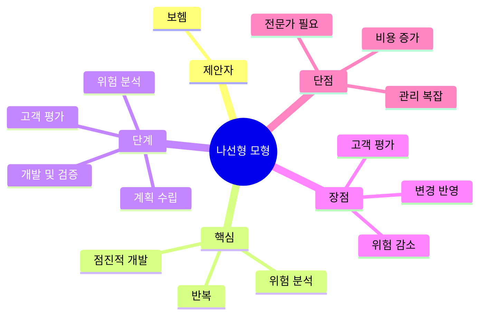

- 한 문장 암기:
  - `나선형 모형은 보헴이 제안한 위험 분석 중심의 반복적, 점진적 개발 모형이다.`
- 단계 암기:
  - `계-위-개-고`
  - `계획 수립 -> 위험 분석 -> 개발 및 검증 -> 고객 평가`
- 단서어 암기:
  - `보헴`
  - `위험 분석`
  - `나선`
  - `반복`
  - `점진적`
  - `고객 평가`
- 비교 암기:
  - `폭포수 = 순차`
  - `프로토타입 = 시제품`
  - `나선형 = 위험 분석`
  - `애자일 = 변화 대응`

---

## 12. 빠른 복습

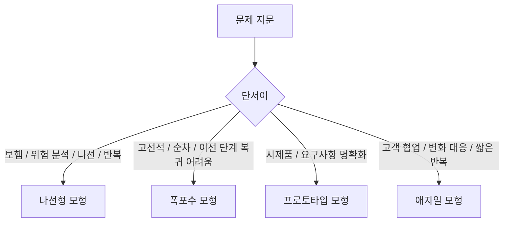

- 나선형 모형은 `반복적`이고 `점진적`이다.
- 핵심 단계는 `계획 수립 -> 위험 분석 -> 개발 및 검증 -> 고객 평가`다.
- 가장 중요한 단어는 `위험 분석`이다.
- `보헴`이 나오면 나선형 모형을 먼저 떠올린다.
- 대규모/고위험 프로젝트에 적합하다.
- 단점은 비용과 관리 복잡도, 위험 분석 전문가 필요성이다.
- 폭포수와 달리 고객 평가와 반복이 있다.
- 프로토타입과 달리 시제품 자체가 목적이 아니라 위험 감소가 핵심이다.

---

## 13. 참고 링크

- 기준 PDF: `/Users/nes0903/Documents/study/정보처리기사/핵심요약집_2026_정보처리기사필기핵심요약.pdf`
- [Q-Net 정보처리기사 종목 페이지](https://www.q-net.or.kr/crf005.do?id=crf00503s02&jmCd=1320&jmInfoDivCcd=B0)
- [Boehm 1988 - A Spiral Model of Software Development and Enhancement 서지/초록](https://docs.edtechhub.org/lib/A29EGW7U)
- [IEEE Xplore - A Spiral Model of Software Development and Enhancement](https://ieeexplore.ieee.org/document/59)
- [IBM - What is software development? Spiral 설명](https://www.ibm.com/think/topics/software-development)
- [ScienceDirect - A Spiral Model of Software Development and Enhancement](https://www.sciencedirect.com/science/article/abs/pii/B9780080515748500315)
- [SEBoK - A Spiral Model of Software Development and Enhancement](https://sebokwiki.org/w/index.php?title=A_Spiral_Model_of_Software_Development_and_Enhancement)
