# 004 애자일 모형의 주요 방법론

작성 기준일: 2026-05-02  
과목: `1과목 소프트웨어 설계`  
기준 PDF: `/Users/nes0903/Documents/study/정보처리기사/핵심요약집_2026_정보처리기사필기핵심요약.pdf`  
PDF 확인 위치: `1페이지`  
검색 보강: Agile Manifesto, Scrum Guide 2020, Agile Alliance XP, Kanban Guide 2025, Scrum Alliance Lean, FDD 자료

---

## 1. 한 줄 요약

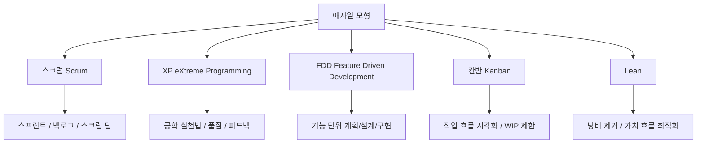

- `애자일 모형`은 변화에 빠르게 대응하기 위해 짧은 반복, 고객 협업, 작동 소프트웨어, 빠른 피드백을 중시하는 개발 접근이다.
- PDF에서 제시한 주요 방법론은 다음 5개다.
  - `스크럼(Scrum)`
  - `XP(eXtreme Programming)`
  - `기능 중심 개발(FDD; Feature Driven Development)`
  - `칸반(Kanban)`
  - `Lean`
- 시험에서는 보통 아래 두 방식으로 나온다.
  - `애자일 방법론에 해당하는 것`을 고르는 문제
  - 각 방법론의 핵심 키워드를 섞어 놓고 구분하는 문제

---

## 2. PDF 기준 핵심

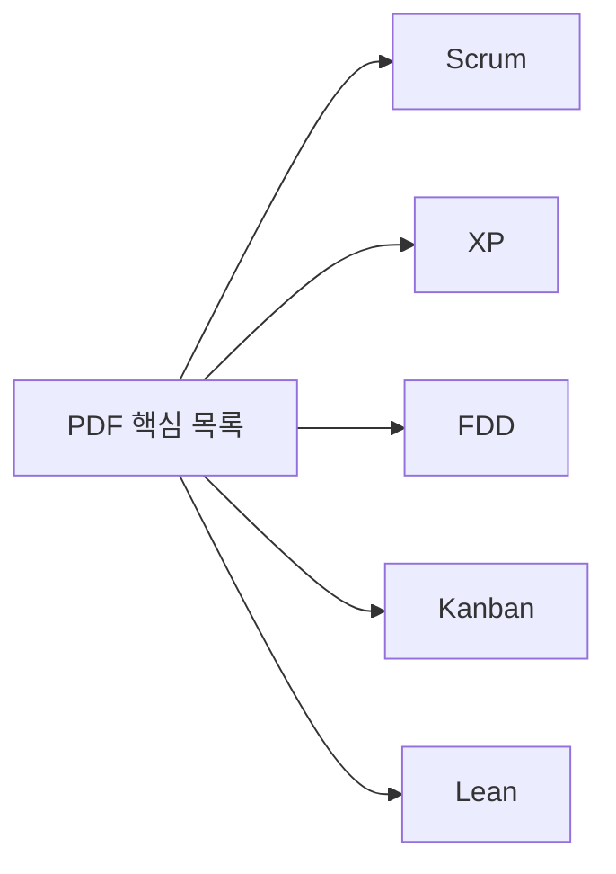

- 기준 PDF의 `애자일 모형의 주요 방법론004`은 아래 항목을 제시한다.
  - 스크럼(Scrum)
  - XP(eXtreme Programming)
  - 기능 중심 개발(FDD; Feature Driven Development)
  - 칸반(Kanban)
  - Lean
- PDF는 목록 중심으로 짧게 제시한다.
- 따라서 실제 시험 대비에서는 각 방법론의 `대표 단서어`를 붙여 외워야 한다.

| 방법론 | 반드시 붙여 외울 단서 |
|---|---|
| `Scrum` | 스프린트, 제품 백로그, 스크럼 마스터, 제품 책임자, 개발자 |
| `XP` | 의사소통, 단순성, 용기, 존중, 피드백, 짝 프로그래밍, 테스트 우선 |
| `FDD` | 기능 중심, feature list, feature별 설계/구현 |
| `Kanban` | 칸반 보드, 작업 흐름 시각화, WIP 제한, flow |
| `Lean` | 낭비 제거, 품질 내재화, 빠른 전달, 전체 최적화 |

---

## 3. 애자일의 기본 관점

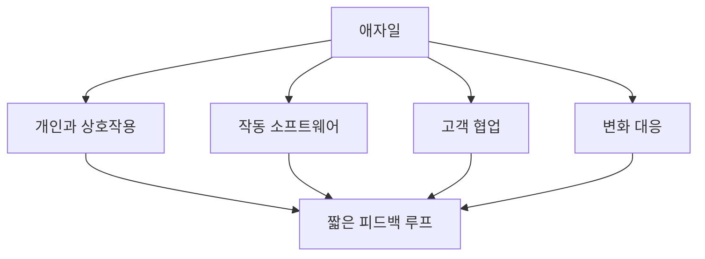

### 3.1 애자일은 단일 방법론이 아니다

- 애자일은 하나의 구체적인 절차라기보다 여러 경량 개발 방식의 공통 철학과 실천을 묶는 말이다.
- `Scrum`, `XP`, `FDD`, `Kanban`, `Lean`은 모두 애자일 계열로 묶어 볼 수 있지만, 강조점이 다르다.
- 공통점:
  - 반복과 점진적 개발
  - 고객/사용자 피드백 반영
  - 변화 대응
  - 작동하는 소프트웨어 중시
  - 팀 협업 중시

### 3.2 애자일 선언문의 핵심

- Agile Manifesto는 다음 4가지를 더 가치 있게 본다.
  - 프로세스와 도구보다 `개인과 상호작용`
  - 방대한 문서보다 `작동하는 소프트웨어`
  - 계약 협상보다 `고객과 협업`
  - 계획을 따르기보다 `변화에 대응`
- 중요한 점:
  - 오른쪽 항목을 버린다는 뜻이 아니다.
  - 오른쪽에도 가치가 있지만, 왼쪽에 더 높은 가치를 둔다는 뜻이다.
- 시험 함정:
  - `애자일은 문서를 작성하지 않는다`
  - `애자일은 계획을 세우지 않는다`
  - `애자일은 계약이 필요 없다`
  - 이런 식의 극단 표현은 틀린 설명으로 보는 것이 안전하다.

---

## 4. 스크럼(Scrum)

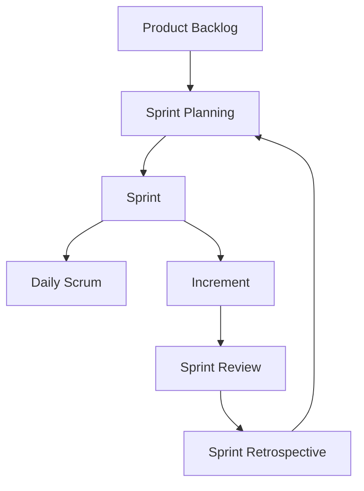

### 4.1 정의

- Scrum Guide는 스크럼을 복잡한 문제에 대해 적응형 해법으로 가치를 만들도록 돕는 `lightweight framework`로 설명한다.
- 시험에서는 보통 `애자일 방법론`으로 분류하지만, 공식 문서 표현은 `framework`다.
- 스크럼의 핵심은 짧은 반복 단위인 `스프린트(Sprint)` 안에서 계획, 개발, 검토, 회고를 수행하는 것이다.

### 4.2 스크럼의 이론적 기반

- Scrum Guide 기준 스크럼은 다음에 기반한다.
  - `경험주의(Empiricism)`
  - `Lean thinking`
- 경험주의의 핵심 축:
  - `투명성(Transparency)`
  - `검사(Inspection)`
  - `적응(Adaptation)`
- 시험용으로 바꾸면:
  - 작업 상태와 산출물을 투명하게 보고
  - 자주 검사하고
  - 결과에 맞춰 다음 행동을 조정하는 방식이다.

### 4.3 스크럼 팀

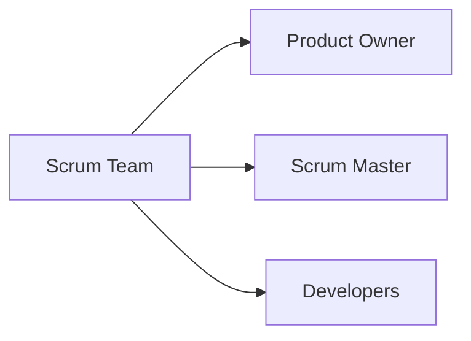

- `Product Owner`
  - 제품 가치 극대화 책임
  - 제품 백로그 관리
  - 우선순위 결정
- `Scrum Master`
  - 스크럼이 제대로 이해되고 실행되도록 돕는 책임
  - 장애물 제거 지원
  - 팀과 조직을 코칭
- `Developers`
  - 매 스프린트마다 사용 가능한 Increment를 만드는 사람들
  - Sprint Backlog 계획, 품질 준수, 일일 적응 책임

### 4.4 스크럼 이벤트

| 이벤트 | 핵심 의미 |
|---|---|
| `Sprint` | 모든 스크럼 이벤트를 담는 고정 길이 반복 주기 |
| `Sprint Planning` | 이번 스프린트의 목표와 작업 계획 수립 |
| `Daily Scrum` | 매일 진행 상황 점검과 계획 조정 |
| `Sprint Review` | 산출물 검토, 이해관계자 피드백 반영 |
| `Sprint Retrospective` | 팀의 프로세스와 품질 개선 방안 논의 |

- Scrum Guide 기준 스프린트는 `1개월 이하`의 고정 길이 이벤트다.
- Daily Scrum은 보통 `15분` 이벤트로 알려져 있다.
- 시험에서는 숫자보다 역할/이벤트/산출물 매칭이 더 자주 나온다.

### 4.5 스크럼 산출물

| 산출물 | 의미 | Commitment |
|---|---|---|
| `Product Backlog` | 제품에 필요한 작업의 정렬된 목록 | Product Goal |
| `Sprint Backlog` | 이번 스프린트에서 수행할 작업 계획 | Sprint Goal |
| `Increment` | 완료 기준을 만족하는 사용 가능한 증가분 | Definition of Done |

### 4.6 시험 포인트

- `스크럼 = 스프린트 + 백로그 + 스크럼 팀`
- 역할:
  - Product Owner
  - Scrum Master
  - Developers
- 이벤트:
  - Sprint Planning
  - Daily Scrum
  - Sprint Review
  - Sprint Retrospective
- 산출물:
  - Product Backlog
  - Sprint Backlog
  - Increment
- 함정:
  - Scrum Master는 전통적 프로젝트 관리자처럼 명령/통제하는 사람이 아니다.
  - Product Owner는 제품 가치와 백로그 책임자다.
  - Sprint Review와 Sprint Retrospective를 구분해야 한다.
    - Review: 제품/결과 검토
    - Retrospective: 팀의 일하는 방식 개선

---

## 5. XP(eXtreme Programming)

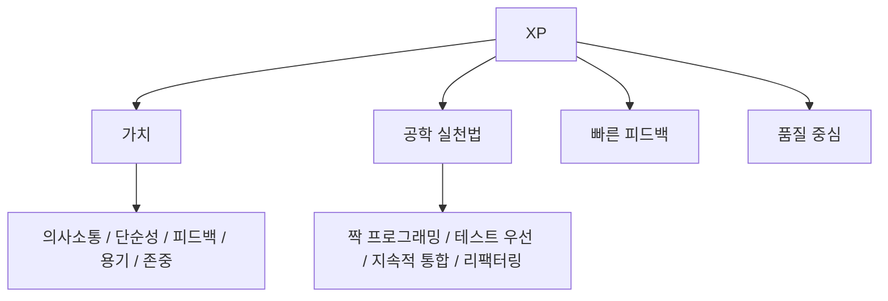

### 5.1 정의

- XP는 애자일 방법론 중에서도 `개발 실천법`과 `소프트웨어 품질`을 강하게 강조하는 방법론이다.
- Agile Alliance는 XP를 고품질 소프트웨어와 개발팀의 삶의 질을 목표로 하는 애자일 프레임워크로 설명한다.
- 다른 애자일 방법론보다 구체적인 공학 실천법이 많이 제시된다.

### 5.2 XP의 핵심 가치

- 별도 챕터 `006 XP의 핵심 가치`와 직접 연결된다.
- 핵심 가치:
  - `의사소통(Communication)`
  - `단순성(Simplicity)`
  - `피드백(Feedback)`
  - `용기(Courage)`
  - `존중(Respect)`
- 시험에서는 이 5개를 그대로 묻는 경우가 많다.

### 5.3 XP의 대표 실천법

| 실천법 | 의미 |
|---|---|
| `Pair Programming` | 두 사람이 한 컴퓨터에서 함께 개발하여 지속적 리뷰 효과를 얻음 |
| `Test-First Programming` | 실패하는 자동 테스트를 먼저 만들고, 통과하도록 코드를 작성 |
| `Continuous Integration` | 변경 코드를 자주 통합하고 즉시 테스트 |
| `Refactoring` | 외부 동작은 유지하면서 내부 구조 개선 |
| `Small Releases` | 작은 단위로 자주 배포/전달 |
| `Collective Ownership` | 코드 전체에 대한 공동 책임 |
| `Coding Standard` | 팀 차원의 코딩 규칙 유지 |

### 5.4 시험 포인트

- `XP = 개발 실천법이 강한 애자일`
- 키워드:
  - 짝 프로그래밍
  - 테스트 우선 개발
  - 지속적 통합
  - 리팩터링
  - 작은 릴리스
  - 고객 상주 또는 적극적 고객 참여
- 함정:
  - XP의 핵심 가치를 애자일 4대 가치와 섞지 않는다.
  - XP는 단순히 빠르게 코딩하는 방식이 아니라, 테스트/통합/피드백으로 품질을 유지하는 방식이다.

---

## 6. FDD(Feature Driven Development)

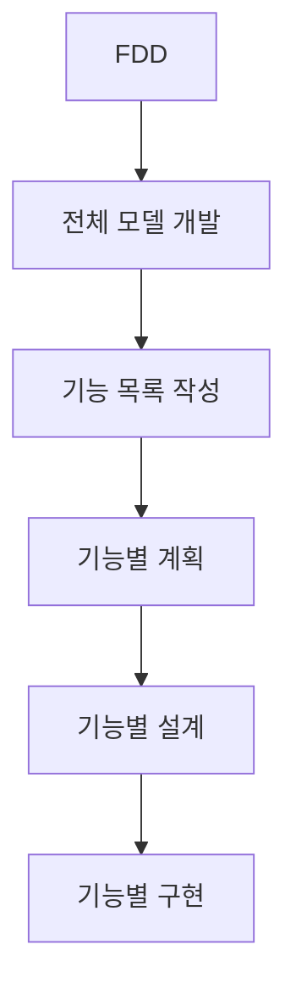

### 6.1 정의

- `FDD`는 `Feature Driven Development`, 즉 `기능 중심 개발`이다.
- 작업 단위를 사용자에게 가치 있는 `기능(feature)` 중심으로 나누고, 기능별로 계획/설계/구현을 반복한다.
- TechTarget의 FDD 설명은 FDD를 제품 기능 중심으로 일을 조직하는 애자일 프레임워크로 설명한다.

### 6.2 FDD의 기본 단계

- FDD는 일반적으로 다음 5단계로 설명된다.
  - `전체 모델 개발`
  - `기능 목록 작성`
  - `기능별 계획`
  - `기능별 설계`
  - `기능별 구현`
- 시험식 암기:
  - `모-목-계-설-구`
  - 모델 -> 목록 -> 계획 -> 설계 -> 구현

### 6.3 FDD의 특징

- 기능 단위로 개발 진척을 관리한다.
- 비교적 큰 개발팀에서 작업을 나눠 진행하기 좋다.
- 도메인 모델과 기능 목록을 초기에 정리하는 편이다.
- 각 기능은 작고, 구현 가능하고, 고객 가치와 연결되어야 한다.
- 빠른 릴리스와 기능별 가시성을 중시한다.

### 6.4 시험 포인트

- `FDD = 기능 중심 개발`
- `Feature`는 단순 코드 함수가 아니라 사용자/고객에게 의미 있는 작은 기능 단위로 이해한다.
- 함정:
  - FDD를 `기능 점수(Function Point, FP)`와 혼동하지 않는다.
  - FDD는 비용 산정 기법이 아니라 개발 방법론이다.
  - `Feature list`, `feature별 계획/설계/구현`이 나오면 FDD다.

---

## 7. 칸반(Kanban)

### 7.1 정의

- Kanban Guide는 칸반을 프로세스를 통해 가치 흐름을 최적화하기 위한 전략으로 설명한다.
- 핵심은 작업 흐름을 정의하고 시각화하여 병목을 발견하고, 진행 중인 작업 수를 통제하며, 흐름을 지속적으로 개선하는 것이다.
- 스크럼처럼 반드시 고정 길이 스프린트를 요구하지 않는다.

### 7.2 칸반의 3가지 실천

- Kanban Guide 기준 핵심 실천:
  - `Workflow 정의와 시각화`
  - `Workflow 안의 작업 항목을 적극적으로 관리`
  - `Workflow 개선`
- 쉽게 말하면:
  - 일의 흐름을 보드에 보이게 만들고
  - 진행 중인 일을 너무 많이 벌리지 않으며
  - 병목을 찾아 계속 개선한다.

### 7.3 WIP 제한

- `WIP`는 `Work In Progress`, 즉 진행 중인 작업이다.
- 칸반에서는 진행 중인 작업 수를 제한하여 흐름을 안정화한다.
- WIP가 너무 많으면:
  - 문맥 전환 증가
  - 대기 시간 증가
  - 완료 지연
  - 병목 은폐
- WIP 제한은 팀이 일을 `시작`하는 것보다 `끝내는 것`에 집중하게 만든다.

### 7.4 칸반의 흐름 지표

| 지표 | 의미 |
|---|---|
| `WIP` | 시작했지만 끝나지 않은 작업 수 |
| `Throughput` | 단위 시간당 완료된 작업 수 |
| `Work Item Age` | 작업이 시작된 뒤 현재까지 지난 시간 |
| `Cycle Time` | 작업 시작부터 완료까지 걸린 시간 |

### 7.5 시험 포인트

- `칸반 = 보드 + 흐름 + WIP 제한`
- 지문에 `작업 흐름 시각화`, `진행 중 작업 제한`, `flow`, `pull system`이 나오면 칸반을 떠올린다.
- 함정:
  - 칸반은 단순 TODO 목록이 아니다.
  - 칸반 보드는 도구이고, 핵심은 흐름 최적화와 WIP 통제다.
  - 칸반은 스크럼의 스프린트 구조와 다르다.

---

## 8. Lean

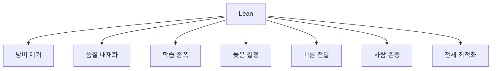

### 8.1 정의

- Lean은 제조업의 Lean 사고를 소프트웨어 개발에 적용한 접근이다.
- Scrum Alliance 설명에 따르면 Lean Software Development는 고품질 소프트웨어를 최소 낭비로 효율적으로 만들기 위한 접근이다.
- Mary Poppendieck, Tom Poppendieck의 `Lean Software Development: An Agile Toolkit`이 대표적으로 언급된다.

### 8.2 Lean의 7가지 원칙

- 자주 쓰이는 Lean Software Development 원칙:
  - `낭비 제거(Eliminate waste)`
  - `품질 내재화(Build quality in)`
  - `학습 증폭(Amplify learning / Create knowledge)`
  - `가능한 늦게 결정(Decide as late as possible / Defer commitment)`
  - `빠른 전달(Deliver fast)`
  - `사람 존중(Respect people / Empower the team)`
  - `전체 최적화(Optimize the whole / See the whole)`

### 8.3 소프트웨어 개발에서의 낭비 예

- 불필요한 기능
- 완료되지 않은 작업
- 대기 시간
- 불명확한 요구사항
- 과도한 문서
- 중복 코드
- 결함과 재작업
- 잦은 문맥 전환

### 8.4 시험 포인트

- `Lean = 낭비 제거 + 가치 중심 + 전체 최적화`
- 함정:
  - Lean은 단순히 인력을 줄이는 방식이 아니다.
  - Lean은 품질을 나중에 검사하는 것이 아니라 과정 안에 품질을 넣는다는 관점이다.
  - 부분 최적화보다 전체 흐름 최적화를 중시한다.

---

## 9. 방법론별 비교표

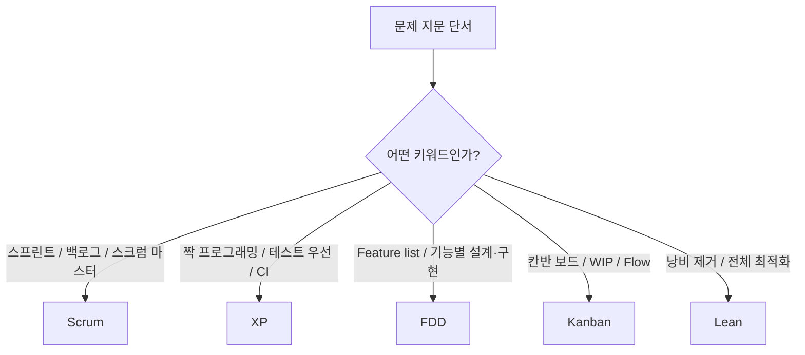

| 구분 | 핵심 목적 | 대표 키워드 | 헷갈리기 쉬운 점 |
|---|---|---|---|
| `Scrum` | 반복 개발 관리 프레임워크 | Sprint, Product Backlog, Scrum Master | Scrum Master를 관리자처럼 이해하면 안 됨 |
| `XP` | 개발 실천법과 품질 강화 | Pair Programming, Test-First, CI, Refactoring | 애자일 4대 가치와 XP 5대 가치 혼동 |
| `FDD` | 기능 단위 계획/설계/구현 | Feature list, Design by feature, Build by feature | 기능 점수 FP와 혼동 |
| `Kanban` | 작업 흐름 최적화 | Kanban board, WIP, Cycle Time, Flow | 단순 보드가 아니라 흐름 관리 |
| `Lean` | 낭비 제거와 전체 최적화 | Waste, Value, Build quality in | 단순 비용 절감으로 오해 |

---

## 10. 폭포수/나선형과의 비교

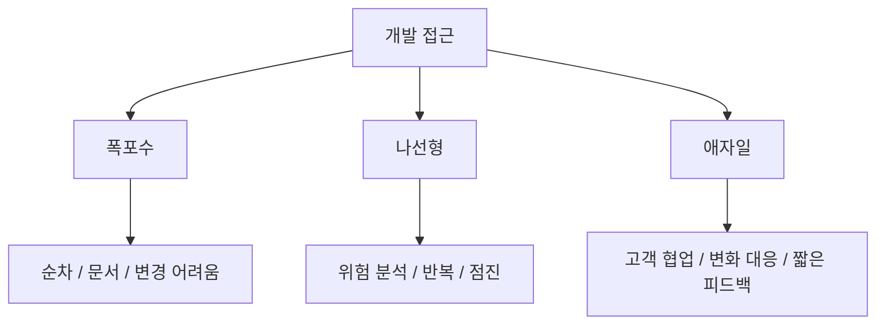

| 구분 | 핵심 | 적합한 상황 |
|---|---|---|
| `폭포수` | 순차적 단계 진행 | 요구사항이 명확하고 변경이 적은 경우 |
| `나선형` | 위험 분석 중심 반복 | 대규모, 고위험 프로젝트 |
| `애자일` | 변화 대응과 고객 협업 | 요구사항 변화가 크고 빠른 피드백이 필요한 경우 |

- 시험에서 자주 나오는 구분:
  - `고전적`, `선형`, `이전 단계로 돌아가기 어려움` -> 폭포수
  - `보헴`, `위험 분석`, `나선` -> 나선형
  - `개인과 상호작용`, `작동 소프트웨어`, `변화 대응` -> 애자일
  - `스프린트`, `백로그`, `스크럼 마스터` -> 스크럼
  - `짝 프로그래밍`, `테스트 우선`, `지속적 통합` -> XP
  - `WIP 제한`, `칸반 보드` -> 칸반

---

## 11. 자주 나오는 함정

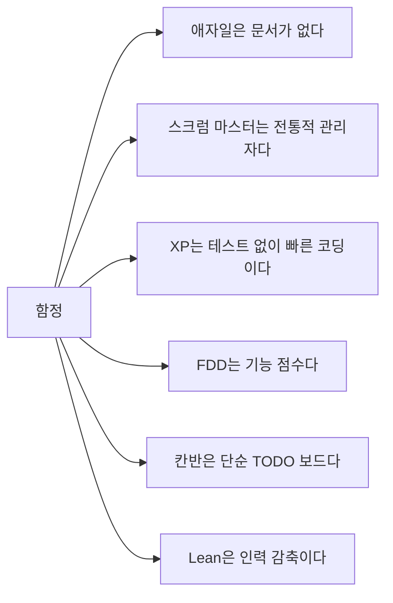

- `애자일은 문서를 만들지 않는다`
  - 틀린 설명이다.
  - 문서보다 작동 소프트웨어에 더 가치를 둔다는 뜻이다.
- `애자일은 계획을 세우지 않는다`
  - 틀린 설명이다.
  - 계획은 세우되 변화 대응을 더 중시한다.
- `스크럼 마스터는 팀장처럼 명령한다`
  - 틀린 설명이다.
  - 스크럼 마스터는 스크럼 이해와 실행을 돕고 장애물 제거를 지원한다.
- `XP는 테스트보다 빠른 코딩을 중시한다`
  - 틀린 설명이다.
  - XP는 테스트 우선, 지속적 통합, 리팩터링 등 품질 실천을 중시한다.
- `FDD는 기능 점수(Function Point)와 같은 말이다`
  - 틀린 설명이다.
  - FDD는 기능 중심 개발 방법론이고, FP는 규모/비용 산정과 연결된다.
- `칸반은 보드만 만들면 된다`
  - 틀린 설명이다.
  - 칸반은 workflow 정의, WIP 통제, 흐름 개선이 핵심이다.
- `Lean은 사람을 줄여 비용을 줄이는 방식이다`
  - 틀린 설명이다.
  - Lean은 고객 가치에 기여하지 않는 낭비를 줄이고 전체 흐름을 최적화하는 접근이다.

---

## 12. 암기 포인트

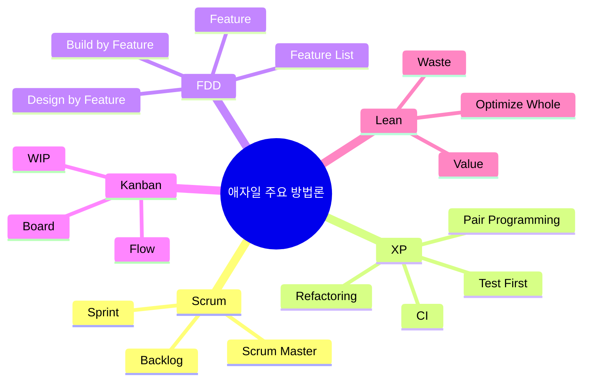

- 목록 암기:
  - `스-X-F-칸-린`
  - 스크럼, XP, FDD, 칸반, Lean
- 단서 암기:
  - `스크럼 = 스프린트 + 백로그 + 스크럼 팀`
  - `XP = 짝 프로그래밍 + 테스트 우선 + 지속적 통합`
  - `FDD = 기능 목록 + 기능별 설계/구현`
  - `칸반 = 보드 + WIP 제한 + 흐름`
  - `Lean = 낭비 제거 + 전체 최적화`
- 애자일 공통 감각:
  - `짧게 만들고`
  - `자주 확인하고`
  - `고객 피드백을 반영하고`
  - `변화에 대응한다`

---

## 13. 빠른 복습

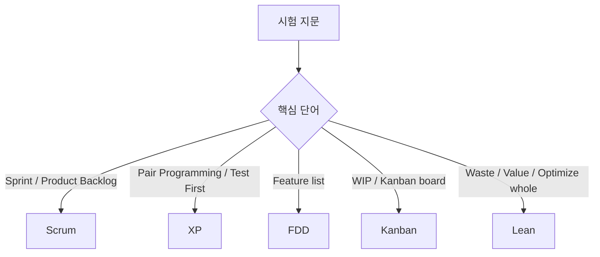

- PDF 핵심 목록:
  - Scrum
  - XP
  - FDD
  - Kanban
  - Lean
- 애자일은 방법론 하나가 아니라 여러 방법론의 철학적 묶음이다.
- Scrum은 반복 개발을 관리하는 프레임워크다.
- XP는 공학 실천법과 품질을 강하게 강조한다.
- FDD는 기능 중심으로 계획하고 개발한다.
- Kanban은 흐름을 시각화하고 WIP를 제한한다.
- Lean은 낭비를 제거하고 고객 가치와 전체 흐름을 최적화한다.

---

## 14. 참고 링크

- 기준 PDF: `/Users/nes0903/Documents/study/정보처리기사/핵심요약집_2026_정보처리기사필기핵심요약.pdf`
- [Q-Net 정보처리기사 종목 페이지](https://www.q-net.or.kr/crf005.do?id=crf00503s02&jmCd=1320&jmInfoDivCcd=B0)
- [Manifesto for Agile Software Development](https://agilemanifesto.org/)
- [Scrum Guides - The 2020 Scrum Guide](https://scrumguides.org/scrum-guide.html)
- [Agile Alliance - Extreme Programming](https://agilealliance.org/glossary/xp/)
- [Kanban Guides - The Kanban Guide 2025](https://kanbanguides.org/the-kanban-guide/2025.5/)
- [Scrum Alliance - Lean Software Development](https://resources.scrumalliance.org/Article/lean-software-development)
- [TechTarget - Feature-Driven Development](https://www.techtarget.com/searchsoftwarequality/definition/feature-driven-development)

<!-- study-links:start -->
## 관련 문서

- `xp의 핵심 가치`: [[정보처리기사/1과목 소프트웨어 설계/006 XP의 핵심 가치/006 XP의 핵심 가치|006 XP의 핵심 가치]]
- `비용 산정 기법`: [[정보처리기사/5과목 정보시스템 구축 관리/229 비용 산정 기법 - LOC 기법/229 비용 산정 기법 - LOC 기법|229 비용 산정 기법 - LOC 기법]]
- `핵심 가치`: [[정보처리기사/1과목 소프트웨어 설계/005 애자일 개발 4가지 핵심 가치/005 애자일 개발 4가지 핵심 가치|005 애자일 개발 4가지 핵심 가치]]
<!-- study-links:end -->
