# 005 애자일 개발 4가지 핵심 가치

작성 기준일: 2026-05-02  
과목: `1과목 소프트웨어 설계`  
기준 PDF: `/Users/nes0903/Documents/study/정보처리기사/핵심요약집_2026_정보처리기사필기핵심요약.pdf`  
PDF 확인 위치: `1페이지`  
검색 보강: 애자일 선언문 공식 원문, 공식 12원칙, Q-Net 정보처리기사 시험 정보를 함께 확인하여 시험 중심으로 확장 정리

---

## 1. 한 줄 요약

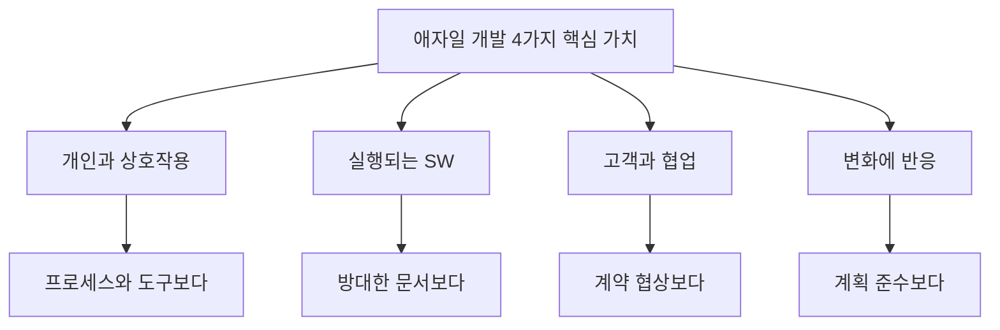

- 애자일 4대 핵심 가치는 `프로세스와 도구`, `방대한 문서`, `계약 협상`, `계획 준수`를 버리라는 뜻이 아니다.
- 시험에서 가장 중요한 표현은 `오른쪽을 폐기`가 아니라 `왼쪽도 가치가 있지만 상대적으로 더 중시하는 것`이다.
- PDF 기준 표현으로 외우면 다음 4개다.
  - 프로세스와 도구보다 `개인과 상호작용`
  - 방대한 문서보다 `실행되는 SW`
  - 계약 협상보다 `고객과 협업`
  - 계획을 따르기보다 `변화에 반응`
- 암기 축약어는 `개-실-고-변`으로 잡으면 빠르다.

---

## 2. PDF 기준 핵심

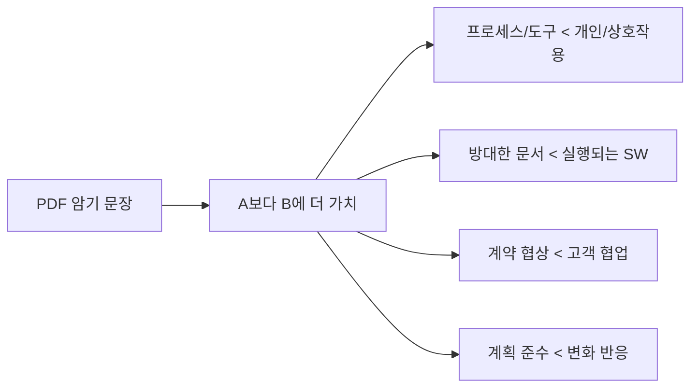

- PDF에 제시된 핵심 문장은 다음과 같다.
  - 프로세스와 도구보다는 개인과 상호작용에 더 가치를 둔다.
  - 방대한 문서보다는 실행되는 SW에 더 가치를 둔다.
  - 계약 협상보다는 고객과 협업에 더 가치를 둔다.
  - 계획을 따르기보다는 변화에 반응하는 것에 더 가치를 둔다.

- 이 챕터의 출제 포인트는 단순 암기만이 아니다.
  - `무엇보다 무엇을 더 중시하는가`
  - `무엇을 완전히 부정하는 것은 아닌가`
  - `애자일 방법론`, `XP 가치`, `폭포수 모형`과 어떻게 다른가
  - `고객`, `변화`, `작동 소프트웨어`, `피드백`이라는 단서어가 어떤 가치로 연결되는가

- 용어 대응:

| PDF 표현 | 공식 애자일 선언문에서 자주 쓰는 표현 | 시험상 의미 |
|---|---|---|
| 실행되는 SW | 작동하는 소프트웨어, Working Software | 실제로 동작해 검증 가능한 결과물 |
| 고객과 협업 | 고객과의 협력, Customer Collaboration | 계약서만이 아니라 지속적인 피드백과 의사결정 참여 |
| 변화에 반응 | Responding to Change | 요구사항 변경을 위험이 아니라 학습 기회로 수용 |
| 개인과 상호작용 | Individuals and Interactions | 도구보다 사람 사이의 소통과 협력 우선 |

---

## 3. 애자일 선언문을 읽는 방법

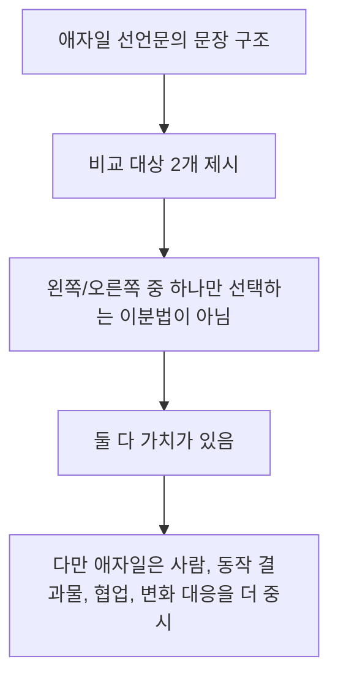

- 애자일 선언문은 소프트웨어 개발에서 더 나은 방식을 찾기 위해 정리된 가치 선언이다.
- 중요한 해석 원칙:
  - `프로세스와 도구`도 필요하다.
  - `문서`도 필요하다.
  - `계약`도 필요하다.
  - `계획`도 필요하다.
  - 하지만 변화가 잦고 불확실성이 큰 소프트웨어 개발에서는 `사람의 상호작용`, `작동 결과물`, `고객 피드백`, `변화 대응력`이 더 직접적으로 성공에 영향을 준다.

- 시험에서는 이 균형 문장을 흔히 왜곡한다.
  - `애자일은 문서를 작성하지 않는다` → 틀림
  - `애자일은 계획을 세우지 않는다` → 틀림
  - `애자일은 계약을 무시한다` → 틀림
  - `애자일은 도구를 사용하지 않는다` → 틀림

- 올바른 이해:
  - 애자일은 무계획 개발이 아니다.
  - 애자일은 무문서 개발이 아니다.
  - 애자일은 고객 요구를 아무 검토 없이 모두 수용하는 방식이 아니다.
  - 애자일은 짧은 주기로 결과를 확인하며 계획을 조정하는 방식이다.

---

## 4. 가치 1: 프로세스와 도구보다 개인과 상호작용

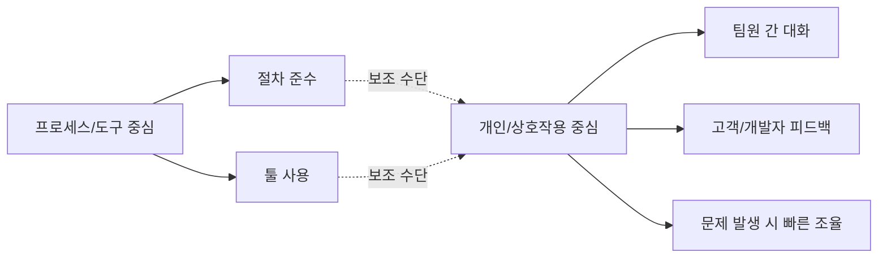

- 의미:
  - 프로세스와 도구는 개발을 돕는 수단이다.
  - 실제 문제를 이해하고 해결하는 주체는 사람이다.
  - 애자일은 팀원, 고객, 사용자, 이해관계자 사이의 직접적이고 빠른 소통을 중시한다.

- 시험 키워드:
  - `개인`
  - `상호작용`
  - `의사소통`
  - `협업`
  - `자기조직화 팀`
  - `피드백`

- 구체적 예시:
  - 이슈 관리 도구에 상태만 바꾸고 아무도 논의하지 않는 것보다, 필요한 사람이 바로 모여 요구사항을 확인하는 것이 더 애자일에 가깝다.
  - 형식적 승인 절차를 기다리기보다, 개발자와 고객이 짧은 주기로 결과를 확인하고 오해를 줄이는 방식이 더 애자일에 가깝다.

- 오답 함정:
  - `프로세스가 전혀 없어야 한다`는 뜻이 아니다.
  - `도구를 사용하지 않아야 한다`는 뜻이 아니다.
  - `개인의 영웅적 역량만 믿는다`는 뜻도 아니다.
  - 애자일에서 개인과 상호작용은 `협력하는 팀`을 전제로 한다.

- 문제 지문 판별:

| 지문 단서 | 판단 |
|---|---|
| 절차와 도구보다 팀원 간 소통을 중시한다 | 애자일 4대 가치 |
| 개발 도구를 쓰지 않아야 애자일이다 | 오답 |
| 정해진 절차가 사람의 판단보다 항상 우선한다 | 애자일과 거리가 멂 |
| 고객, 개발자, 사용자가 자주 대화한다 | 애자일적 |

---

## 5. 가치 2: 방대한 문서보다 실행되는 SW

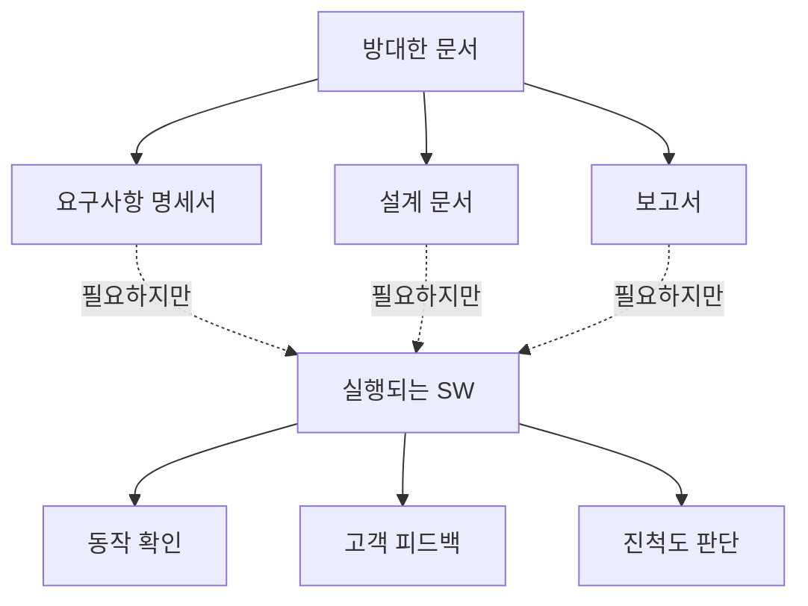

- 의미:
  - 문서만 잘 작성되어 있어도 실제 프로그램이 동작하지 않으면 소프트웨어 개발의 진척으로 보기 어렵다.
  - 애자일은 짧은 주기로 동작 가능한 소프트웨어를 만들고, 이를 통해 요구사항 이해가 맞는지 검증한다.
  - 공식 12원칙에서도 `작동 소프트웨어`를 진척 측정의 중요한 기준으로 본다.

- 시험 키워드:
  - `실행되는 SW`
  - `작동하는 소프트웨어`
  - `동작 가능한 결과물`
  - `짧은 반복`
  - `점진적 인도`
  - `고객 검증`

- 구체적 예시:
  - 100쪽짜리 설계 문서를 작성했지만 동작하는 화면이 하나도 없으면 고객은 요구사항 충족 여부를 확인하기 어렵다.
  - 반대로 간단한 기능이라도 실제로 실행되는 형태로 제공하면 고객은 빠르게 피드백을 줄 수 있다.

- 오답 함정:
  - `문서는 필요 없다`는 뜻이 아니다.
  - `분석과 설계를 생략한다`는 뜻이 아니다.
  - `코딩부터 무작정 시작한다`는 뜻이 아니다.
  - 필요한 문서는 작성하되, 문서 자체가 목적이 되지 않도록 한다.

- 시험에서 자주 바뀌는 표현:

| 표현 | 같은 의미로 볼 수 있는가 | 이유 |
|---|---:|---|
| 실행되는 SW | O | PDF 표현 |
| 작동하는 소프트웨어 | O | 애자일 선언문 표현 |
| 동작 가능한 제품 증가분 | O | 스크럼의 Increment 관점과 연결 가능 |
| 완성된 최종 산출물만 인정 | X | 애자일은 점진적 결과 확인을 중시 |
| 상세 문서가 가장 중요한 진척 기준 | X | 문서보다 작동 결과물을 더 중시 |

---

## 6. 가치 3: 계약 협상보다 고객과 협업

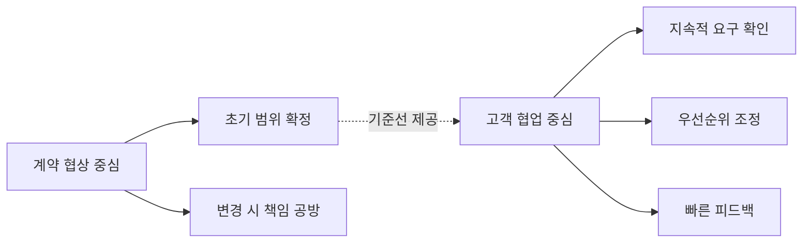

- 의미:
  - 계약은 프로젝트 범위, 비용, 책임을 정하는 중요한 기준이다.
  - 하지만 소프트웨어 개발에서는 고객도 프로젝트 진행 중에 요구사항을 더 잘 이해하게 되는 경우가 많다.
  - 애자일은 계약서 문구만 고집하기보다 고객과 협업해 실제 가치가 높은 결과물을 만드는 것을 중시한다.

- 시험 키워드:
  - `고객`
  - `협업`
  - `피드백`
  - `참여`
  - `우선순위 조정`
  - `요구사항 변화`

- 구체적 예시:
  - 계약서에 적힌 기능을 모두 만들었지만 고객 업무에 맞지 않는다면 성공한 개발이라고 보기 어렵다.
  - 고객이 반복 주기마다 결과물을 확인하고, 비즈니스 가치가 높은 기능부터 조정하는 방식이 애자일에 가깝다.

- 오답 함정:
  - `계약이 필요 없다`는 뜻이 아니다.
  - `고객이 말하는 대로 무조건 변경한다`는 뜻이 아니다.
  - `범위, 비용, 일정 관리를 하지 않는다`는 뜻이 아니다.
  - 애자일에서도 변경은 우선순위, 비용, 위험, 품질을 고려해 관리한다.

- 고객 협업의 핵심:

| 관점 | 계약 협상 중심 | 고객 협업 중심 |
|---|---|---|
| 요구사항 | 초기에 확정하려는 경향 | 진행 중 학습과 조정 허용 |
| 고객 역할 | 계약 당사자, 승인자 | 지속적 피드백 제공자 |
| 변경 | 분쟁 또는 추가 비용 중심 | 가치와 우선순위 중심 |
| 성공 기준 | 계약 범위 이행 | 고객 가치 실현 |

---

## 7. 가치 4: 계획을 따르기보다 변화에 반응

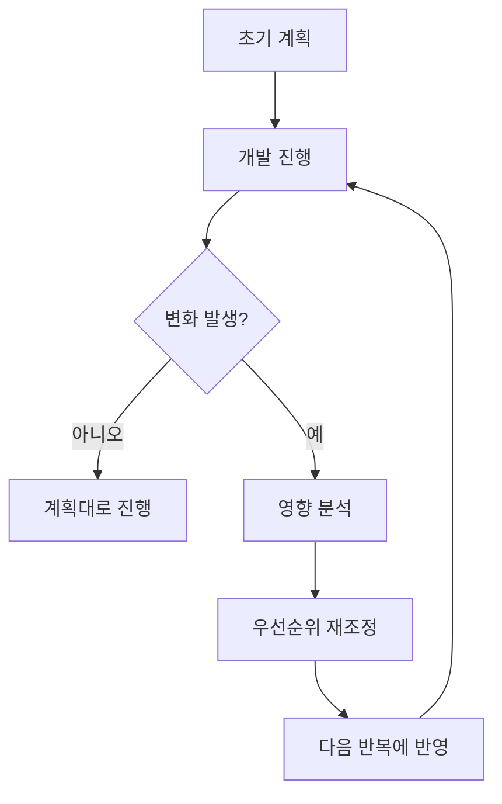

- 의미:
  - 계획은 필요하지만, 소프트웨어 개발에서는 기술, 시장, 사용자 요구, 법규, 운영 환경이 바뀔 수 있다.
  - 애자일은 처음 세운 계획을 무조건 지키기보다 변화의 의미를 분석하고 더 나은 결과를 위해 계획을 조정한다.
  - 변화 대응은 무질서가 아니라 `짧은 주기`, `피드백`, `우선순위 조정`을 통해 관리된다.

- 시험 키워드:
  - `변화`
  - `대응`
  - `반응`
  - `요구사항 변경 수용`
  - `반복 개발`
  - `점진적 개선`

- 구체적 예시:
  - 출시 직전 고객 업무 규칙이 바뀌었는데 초기 계획만 고집하면 실제 현장에 맞지 않는 소프트웨어가 될 수 있다.
  - 애자일에서는 변경 요청의 가치와 영향을 검토해 다음 반복 계획에 반영한다.

- 오답 함정:
  - `계획을 세우지 않는다`는 뜻이 아니다.
  - `모든 변경을 즉시 반영한다`는 뜻이 아니다.
  - `일정 관리를 하지 않는다`는 뜻이 아니다.
  - 변화 대응은 계획을 없애는 것이 아니라 계획을 현실에 맞게 갱신하는 것이다.

- 폭포수식 사고와의 차이:

| 구분 | 계획 준수 중심 | 변화 대응 중심 |
|---|---|---|
| 전제 | 요구사항이 비교적 안정적 | 요구사항이 변할 수 있음 |
| 변경 인식 | 예외, 위험, 지연 요인 | 학습, 가치 조정 기회 |
| 관리 방식 | 변경 통제 중심 | 반복 계획과 우선순위 조정 |
| 적합 환경 | 안정적, 명확한 프로젝트 | 불확실성 높은 프로젝트 |

---

## 8. 4대 가치와 애자일 12원칙의 연결

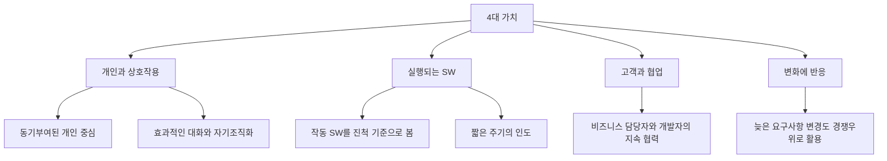

- 애자일 공식 12원칙은 4대 가치를 실천 관점으로 풀어낸 것이다.
- 시험에 12원칙 전문이 자세히 나오지 않더라도, 다음 연결은 기억해두면 보기 판별에 도움이 된다.

| 4대 가치 | 연결되는 12원칙의 방향 | 시험 단서 |
|---|---|---|
| 개인과 상호작용 | 동기부여된 개인, 직접 대화, 자기조직화 팀 | `팀`, `대화`, `자율`, `협력` |
| 실행되는 SW | 가치 있는 소프트웨어의 조기·지속 전달, 작동 SW 중심 진척 측정 | `작동`, `인도`, `진척` |
| 고객과 협업 | 비즈니스 담당자와 개발자의 지속 협력 | `고객 참여`, `업무 담당자`, `피드백` |
| 변화에 반응 | 늦은 요구사항 변경도 수용, 정기적 회고와 조정 | `요구 변경`, `조정`, `반복` |

- 핵심 연결:
  - `작동하는 소프트웨어`는 문서보다 가치 있는 산출물이라는 가치와 연결된다.
  - `고객 만족`, `조기 인도`, `지속 전달`은 고객 협업과 실행되는 SW의 결합이다.
  - `늦은 요구사항 변경 수용`은 변화 대응의 대표 단서다.
  - `정기적 회고`는 팀이 스스로 더 나은 방식으로 조정한다는 점에서 개인과 상호작용, 변화 대응 모두와 연결된다.

---

## 9. 시험에서 보는 단서어

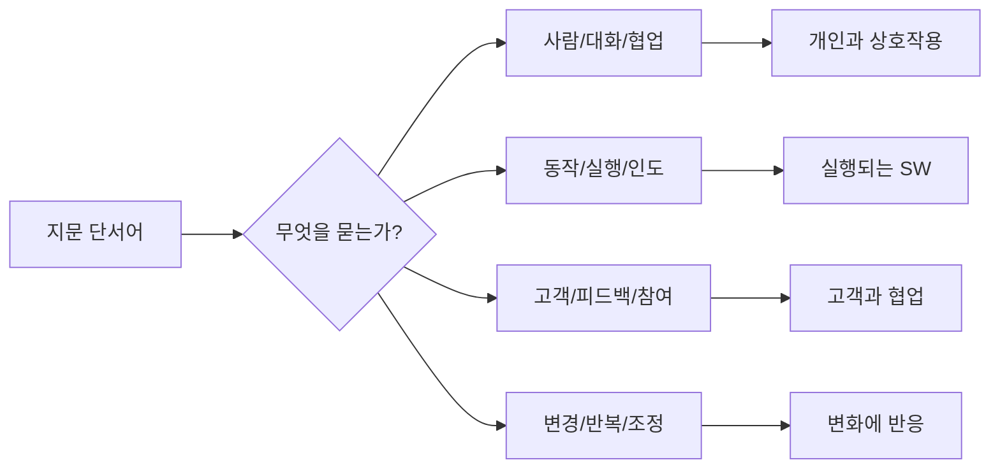

- 단서어별 빠른 매칭:

| 지문 단서어 | 연결할 가치 |
|---|---|
| 사람, 대화, 커뮤니케이션, 협력, 팀워크 | 개인과 상호작용 |
| 실행, 작동, 동작 가능한 결과물, 제품 증가분 | 실행되는 SW |
| 고객, 사용자, 업무 담당자, 피드백, 참여 | 고객과 협업 |
| 요구사항 변경, 유연성, 반복, 조정, 적응 | 변화에 반응 |

- 문제 풀이 순서:
  1. 지문에서 비교 대상이 있는지 본다.
  2. `A보다 B` 구조를 찾는다.
  3. B가 `개인`, `실행 SW`, `고객 협업`, `변화 대응` 중 어디에 해당하는지 연결한다.
  4. `무조건`, `전혀`, `항상`, `완전히 배제` 같은 극단 표현이 있으면 오답 가능성을 먼저 의심한다.

- 보기 판별 예시:

| 보기 | 판단 | 이유 |
|---|---|---|
| 프로세스와 도구보다 개인과 상호작용을 중시한다 | O | PDF 핵심 그대로 |
| 방대한 문서보다 실행되는 소프트웨어를 중시한다 | O | 작동 결과물 중심 |
| 계약 협상보다 고객과의 협업을 중시한다 | O | 지속 피드백 중심 |
| 계획보다 변화 대응을 중시하므로 계획을 세우면 안 된다 | X | 계획 자체를 부정하지 않음 |
| 문서보다 실행 SW가 중요하므로 요구사항 명세는 작성하지 않는다 | X | 필요한 문서는 작성함 |

---

## 10. 폭포수 모형과의 비교

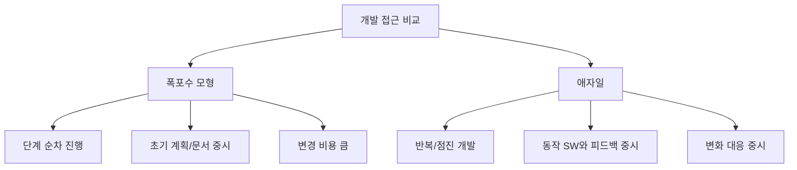

- 폭포수 모형과 애자일은 시험에서 자주 비교된다.
- 폭포수는 요구사항이 명확하고 안정적일 때 이해하기 쉽고 관리가 쉽다.
- 애자일은 요구사항이 변할 가능성이 높고 고객 피드백을 자주 받아야 할 때 적합하다.

| 구분 | 폭포수 모형 | 애자일 4대 가치 |
|---|---|---|
| 진행 방식 | 분석 → 설계 → 구현 → 테스트 등 순차 진행 | 짧은 반복과 점진적 개선 |
| 요구사항 | 초기에 명확히 정의하려는 경향 | 변경 가능성을 인정 |
| 산출물 | 문서와 단계별 산출물 비중 큼 | 실행되는 SW와 피드백 비중 큼 |
| 고객 참여 | 주요 단계 검토 중심 | 지속적 협업 중심 |
| 변경 대응 | 후반 변경 비용 큼 | 반복 주기에서 조정 |
| 시험 단서 | 계획, 문서, 순차, 단계 | 개인, 실행 SW, 고객, 변화 |

- 주의:
  - 폭포수는 나쁘고 애자일은 좋다는 식으로 외우면 안 된다.
  - 시험에서는 `상황에 맞는 개발 모형`을 묻기도 한다.
  - 요구사항이 명확하고 안정적인 프로젝트는 폭포수도 적합할 수 있다.
  - 요구사항 변동이 많고 빠른 피드백이 필요한 프로젝트는 애자일이 적합하다.

---

## 11. 주변 챕터와의 구분

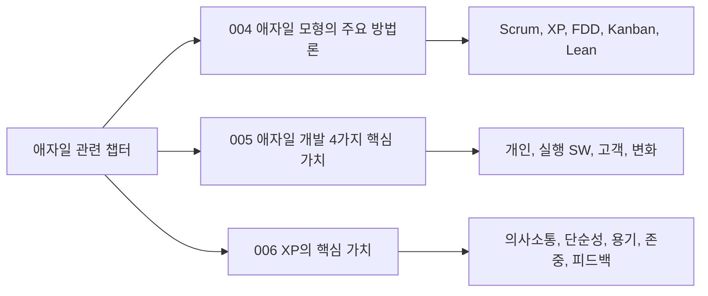

- `004 애자일 모형의 주요 방법론`과의 구분:
  - 004는 애자일을 구현하는 여러 방법론의 종류를 묻는다.
  - 예: `Scrum`, `XP`, `FDD`, `Kanban`, `Lean`
  - 005는 방법론 이름이 아니라 애자일 선언문의 핵심 가치 4개를 묻는다.

- `006 XP의 핵심 가치`와의 구분:
  - 006은 XP라는 특정 애자일 방법론의 가치 5개를 묻는다.
  - 예: `의사소통`, `단순성`, `용기`, `존중`, `피드백`
  - 005는 애자일 전체의 상위 가치 4개를 묻는다.

| 구분 | 암기 목록 | 헷갈리는 지점 |
|---|---|---|
| 애자일 4대 가치 | 개인과 상호작용, 실행되는 SW, 고객 협업, 변화 대응 | `피드백`은 직접 목록에는 없지만 고객 협업/변화 대응과 관련 |
| XP 5대 가치 | 의사소통, 단순성, 용기, 존중, 피드백 | `의사소통`은 애자일 가치의 개인과 상호작용과 의미상 연결 |
| 애자일 방법론 | Scrum, XP, FDD, Kanban, Lean | 방법론 이름과 가치 항목을 섞은 오답 주의 |

- 대표 오답 구성:
  - 애자일 4대 가치 보기에 `의사소통`, `단순성`, `용기`를 섞는다.
  - XP 핵심 가치 보기에 `고객 협업`, `실행되는 SW`를 섞는다.
  - 애자일 방법론 보기에 `개인과 상호작용` 같은 가치 항목을 섞는다.

---

## 12. 자주 나오는 함정

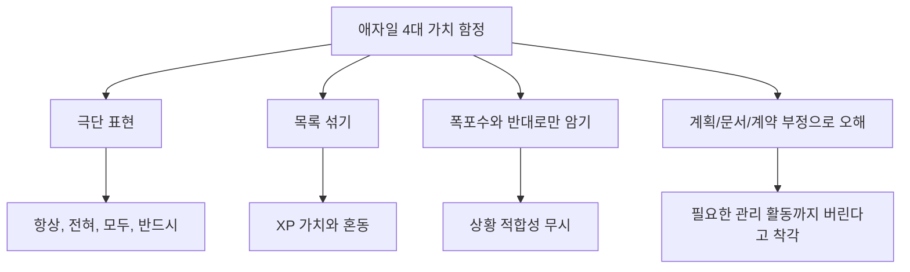

- 함정 1: `문서 작성 금지`
  - 틀린 설명이다.
  - 애자일은 방대한 문서보다 실행되는 SW를 더 중시하지만, 필요한 문서는 작성한다.

- 함정 2: `계획 수립 금지`
  - 틀린 설명이다.
  - 애자일은 계획을 세우되, 피드백과 변화에 따라 계획을 갱신한다.

- 함정 3: `계약 무시`
  - 틀린 설명이다.
  - 계약은 필요하지만, 계약 협상만으로 성공을 판단하지 않고 고객 협업을 중시한다.

- 함정 4: `도구 사용 배제`
  - 틀린 설명이다.
  - 이슈 트래커, CI 도구, 협업 도구는 얼마든지 사용할 수 있다.
  - 다만 도구 사용 자체가 의사소통과 협업을 대체할 수는 없다.

- 함정 5: `XP 가치와 혼동`
  - `의사소통`, `단순성`, `용기`, `존중`, `피드백`은 XP의 핵심 가치다.
  - 애자일 4대 가치를 묻는 문제에서는 `개인`, `실행 SW`, `고객`, `변화`를 먼저 떠올려야 한다.

- 함정 6: `애자일은 항상 모든 프로젝트에 최선`
  - 틀린 설명이다.
  - 요구사항이 매우 안정적이고 규제 문서가 중요한 프로젝트에서는 문서와 계획 중심 접근이 필요할 수 있다.
  - 애자일은 변화와 피드백이 중요한 환경에서 특히 강점을 가진다.

---

## 13. 암기 포인트

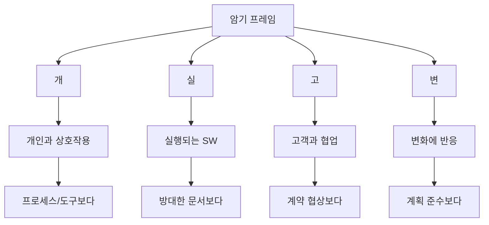

- 1차 암기:
  - `개-실-고-변`
  - 개인과 상호작용
  - 실행되는 SW
  - 고객과 협업
  - 변화에 반응

- 2차 암기:
  - `프로세스/도구 < 개인/상호작용`
  - `방대한 문서 < 실행 SW`
  - `계약 협상 < 고객 협업`
  - `계획 준수 < 변화 대응`

- 3차 암기:
  - `버리는 것이 아니라 더 중시한다`
  - `문서, 계약, 계획, 도구도 가치가 있다`
  - `애자일은 변화가 많은 프로젝트에서 빠른 피드백을 얻기 위한 접근이다`

- 말로 풀어 외우기:
  - `도구보다 사람`
  - `문서보다 동작`
  - `계약보다 협업`
  - `계획보다 적응`

- 시험 직전 10초 복습:
  - 애자일 4대 가치 = `사람`, `동작`, `고객`, `변화`
  - XP 5대 가치 = `의사소통`, `단순성`, `용기`, `존중`, `피드백`
  - 애자일 방법론 = `Scrum`, `XP`, `FDD`, `Kanban`, `Lean`

---

## 14. 빠른 복습

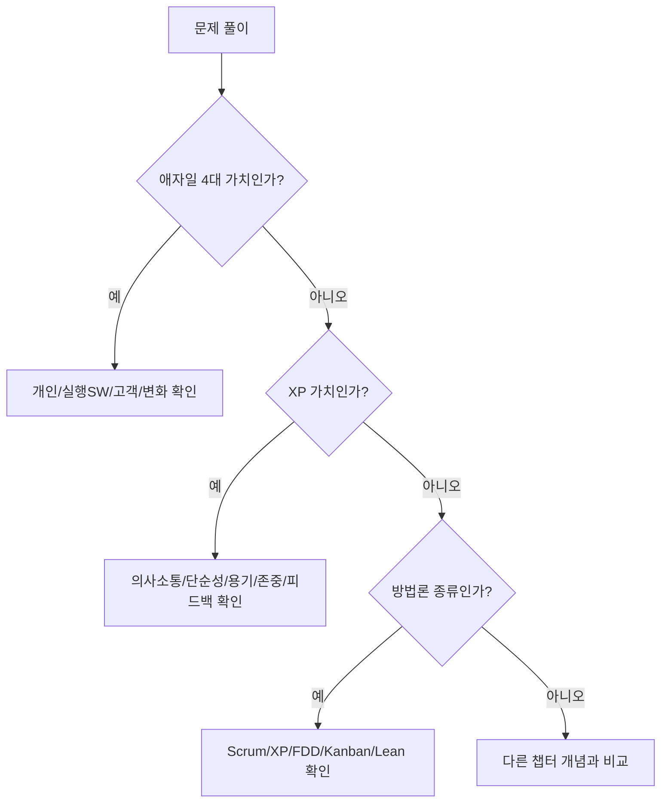

- 챕터명:
  - `005 애자일 개발 4가지 핵심 가치`

- 소속 영역:
  - `1과목 소프트웨어 설계`
  - `소프트웨어 개발 모형`
  - `애자일`

- 반드시 외울 목록:
  - `개인과 상호작용`
  - `실행되는 SW`
  - `고객과 협업`
  - `변화에 반응`

- 가장 중요한 해석:
  - 애자일은 문서, 도구, 계약, 계획을 제거하는 방식이 아니다.
  - 애자일은 변화가 잦은 개발 환경에서 더 빠르게 학습하고 조정하기 위해 사람, 작동 결과물, 고객 협업, 변화 대응을 더 중시한다.

- 자주 나오는 문제 유형:
  - 애자일 4대 가치에 해당하지 않는 것을 고르는 문제
  - PDF 문장의 빈칸을 채우는 문제
  - XP 가치와 애자일 4대 가치를 섞어 구분하는 문제
  - 폭포수 모형과 애자일 모형의 차이를 묻는 문제
  - `문서/계획/계약을 완전히 배제한다`는 극단 표현의 옳고 그름을 묻는 문제

- 최종 암기 문장:
  - `애자일은 프로세스보다 개인, 문서보다 실행 SW, 계약보다 고객 협업, 계획보다 변화 대응을 더 중시한다.`

---

## 15. 참고 링크

- 기준 PDF: `/Users/nes0903/Documents/study/정보처리기사/핵심요약집_2026_정보처리기사필기핵심요약.pdf`
- [Q-Net 정보처리기사 종목 페이지](https://www.q-net.or.kr/crf005.do?id=crf00503s02&jmCd=1320&jmInfoDivCcd=B0)
- [Manifesto for Agile Software Development](https://agilemanifesto.org/)
- [애자일 소프트웨어 개발 선언 - 공식 한국어 번역](https://agilemanifesto.org/iso/ko/manifesto.html)
- [Principles behind the Agile Manifesto](https://agilemanifesto.org/principles.html)
