# 006 XP의 핵심 가치

작성 기준일: 2026-05-02  
과목: `1과목 소프트웨어 설계`  
기준 PDF: `/Users/nes0903/Documents/study/정보처리기사/핵심요약집_2026_정보처리기사필기핵심요약.pdf`  
PDF 확인 위치: `1페이지`  
검색 보강: Agile Alliance의 XP 설명, 애자일 선언문, Q-Net 정보처리기사 시험 정보를 함께 확인하여 시험 중심으로 확장 정리

---

## 1. 한 줄 요약

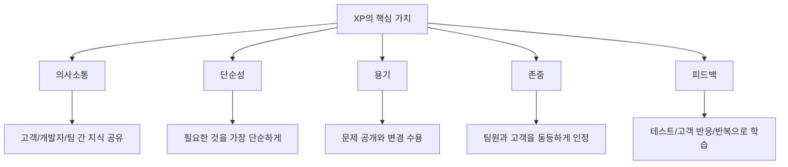

- XP의 핵심 가치는 `의사소통`, `단순성`, `용기`, `존중`, `피드백`이다.
- XP는 애자일 방법론 중에서도 `개발 실천법`을 가장 구체적으로 강조하는 방법론이다.
- 시험에서는 XP의 5대 가치를 애자일 4대 가치, 애자일 방법론 종류, XP 실천법과 섞어서 출제하기 쉽다.
- PDF 기준 암기 순서는 `의-단-용-존-피`로 잡는다.
- Agile Alliance 설명에서는 5개 가치의 나열 순서가 다르게 소개되기도 하지만, 정보처리기사 필기 암기는 PDF 순서를 우선한다.

---

## 2. PDF 기준 핵심

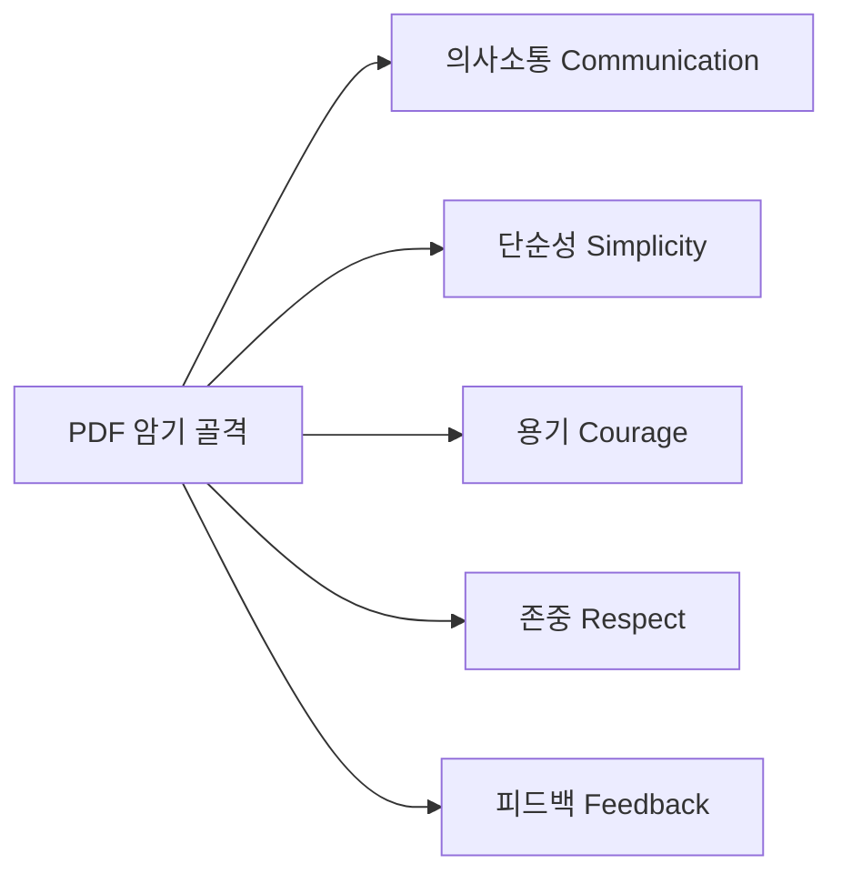

- PDF에 제시된 XP 핵심 가치는 다음 5개다.
  - `의사소통(Communication)`
  - `단순성(Simplicity)`
  - `용기(Courage)`
  - `존중(Respect)`
  - `피드백(Feedback)`

- 이 챕터의 최소 암기 목표:
  - XP의 핵심 가치가 5개라는 점
  - 각 가치의 한글/영문 대응
  - XP가 애자일 방법론 중 하나라는 점
  - XP가 `개발자 중심의 공학적 실천`을 강하게 포함한다는 점

- 주의할 점:
  - `애자일 4대 가치`와 `XP 5대 가치`는 다르다.
  - `Scrum`, `Kanban`, `FDD`, `Lean`은 애자일 방법론 이름이고 XP 가치 목록이 아니다.
  - `짝 프로그래밍`, `테스트 우선 개발`, `리팩토링`, `지속적 통합`은 XP의 대표 실천법이지 핵심 가치 5개 자체는 아니다.

---

## 3. XP의 개념과 위치

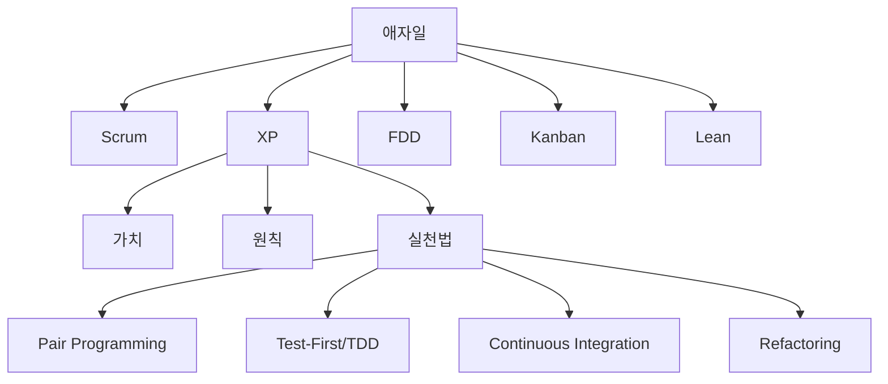

- XP는 `eXtreme Programming`의 약자다.
- XP는 애자일 개발 방법론 중 하나이며, 소프트웨어 품질과 개발팀의 지속 가능한 작업 방식을 함께 중시한다.
- Agile Alliance는 XP를 애자일 프레임워크 중에서도 소프트웨어 개발을 위한 적절한 공학적 실천법을 매우 구체적으로 제시하는 접근으로 설명한다.
- 정보처리기사에서는 XP를 다음 관점으로 기억하면 안정적이다.
  - 애자일 계열이다.
  - 요구사항 변경에 대응한다.
  - 고객과 개발자의 빠른 피드백을 중시한다.
  - 개발 실천법이 구체적이다.
  - 품질 확보를 위해 테스트, 리팩토링, 지속적 통합 같은 활동을 강조한다.

- XP가 적합한 상황:
  - 요구사항이 동적으로 변하는 프로젝트
  - 새 기술 사용 등으로 위험이 있는 프로젝트
  - 작은 규모의 밀접한 개발팀
  - 자동화된 단위 테스트와 기능 테스트를 적용할 수 있는 환경

- 시험 포인트:
  - XP는 단순한 관리 프레임워크라기보다 `프로그래밍 실천법`의 색채가 강하다.
  - Scrum은 역할, 이벤트, 산출물 중심으로 묻기 쉽고, XP는 가치와 개발 실천법 중심으로 묻기 쉽다.

---

## 4. XP 가치 체계 한눈에 보기

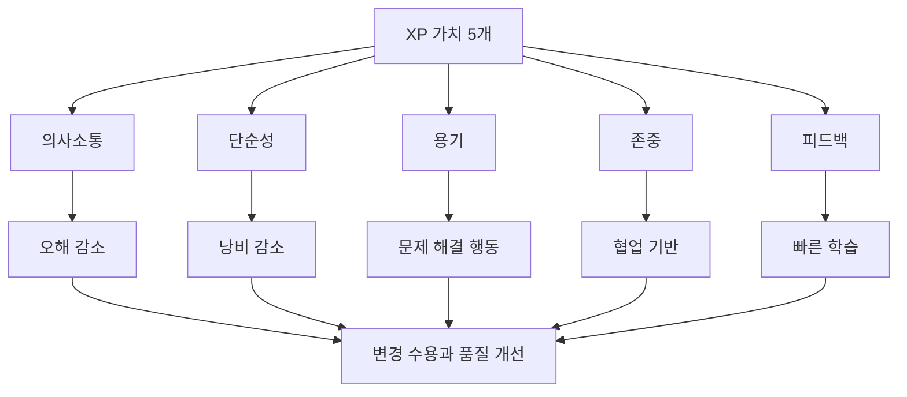

- XP의 5대 가치는 서로 따로 노는 암기 항목이 아니다.
- 각 가치는 XP 실천법을 가능하게 하는 기반이다.

| 가치 | 핵심 의미 | 대표 실천과 연결 |
|---|---|---|
| 의사소통 | 지식을 팀 전체가 공유 | 짝 프로그래밍, 온사이트 고객, 전체 팀 |
| 단순성 | 지금 필요한 것을 단순하게 설계 | 단순 설계, YAGNI, 리팩토링 |
| 용기 | 문제를 드러내고 변경을 수용 | 리팩토링, 테스트 우선 개발, 실패 공개 |
| 존중 | 팀원과 고객의 역할 인정 | 공동 코드 소유, 지속 가능한 속도 |
| 피드백 | 결과를 빠르게 확인하고 조정 | 테스트, CI, 작은 릴리스, 고객 검토 |

- `의사소통`과 `피드백`은 비슷해 보이지만 구분해야 한다.
  - 의사소통: 사람 사이의 정보 전달과 이해 공유
  - 피드백: 실행 결과, 테스트 결과, 고객 반응을 통해 다시 조정하는 순환

- `단순성`과 `용기`도 함께 나온다.
  - 단순성: 불필요한 복잡성을 만들지 않음
  - 용기: 이미 생긴 복잡성이나 잘못된 설계를 고칠 수 있는 태도

---

## 5. 가치 1: 의사소통 Communication

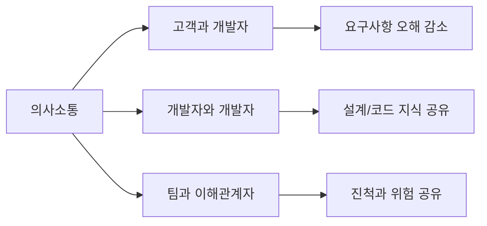

- 의미:
  - 소프트웨어 개발은 혼자 하는 작업이 아니라 팀 작업이다.
  - XP에서 의사소통은 요구사항, 설계 의도, 코드 지식, 위험, 일정, 품질 이슈를 공유하는 핵심 수단이다.
  - Agile Alliance도 XP에서 적절한 의사소통, 특히 직접적인 논의를 강조한다.

- 시험 키워드:
  - `Communication`
  - `의사소통`
  - `대화`
  - `협업`
  - `고객과 개발자`
  - `팀 간 지식 전달`

- 구체적 예시:
  - 고객이 원하는 기능을 개발자가 직접 확인한다.
  - 두 개발자가 함께 코드를 작성하며 설계 의도를 공유한다.
  - 테스트 실패 원인을 팀 전체가 공유해 같은 문제가 반복되지 않게 한다.

- 의사소통과 연결되는 XP 실천법:
  - `Pair Programming`: 두 사람이 함께 코드를 작성하며 실시간으로 지식 공유
  - `On-site Customer`: 고객 또는 고객 대표가 개발팀과 밀접하게 협업
  - `Whole Team`: 필요한 역할을 한 팀으로 묶어 매일 협력
  - `Informative Workspace`: 현재 작업 상태가 팀에 드러나도록 함

- 오답 함정:
  - 단순히 문서를 많이 작성하는 것이 XP의 의사소통은 아니다.
  - 도구에 이슈를 등록했다고 의사소통이 끝나는 것도 아니다.
  - XP는 직접적이고 빠른 소통을 중시하지만, 필요한 기록까지 부정하지는 않는다.

---

## 6. 가치 2: 단순성 Simplicity

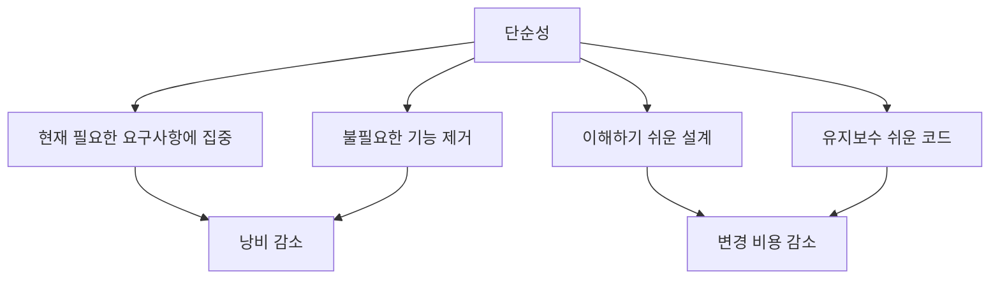

- 의미:
  - 단순성은 `아무렇게나 간단히 만든다`가 아니다.
  - 현재 알고 있는 요구사항을 만족하는 가장 단순하고 유지보수 가능한 설계를 선택하는 것이다.
  - 미래에 필요할지도 모르는 기능을 과하게 예측해 복잡한 구조를 만들지 않는 태도와 연결된다.

- 시험 키워드:
  - `Simplicity`
  - `단순성`
  - `단순 설계`
  - `불필요한 기능 배제`
  - `낭비 제거`
  - `유지보수성`

- 구체적 예시:
  - 아직 요구되지 않은 확장 기능을 미리 복잡하게 만들지 않는다.
  - 현재 사용자 스토리를 통과하는 가장 단순한 설계를 선택한다.
  - 코드 중복이 생기면 리팩토링으로 구조를 단순하게 유지한다.

- 단순성과 연결되는 XP 실천법:
  - `Simple Design`: 현재 요구를 만족하는 단순한 설계
  - `Refactoring`: 외부 동작을 유지하면서 내부 구조 개선
  - `Test-First Programming`: 필요한 동작을 테스트로 먼저 명확히 함
  - `Incremental Design`: 처음부터 모든 것을 설계하지 않고 필요한 만큼 점진적으로 설계

- 오답 함정:
  - `단순성 = 분석 생략`은 틀림
  - `단순성 = 품질 낮은 임시 구현`은 틀림
  - `단순성 = 설계를 하지 않음`은 틀림
  - XP의 단순성은 변경 가능한 좋은 구조를 유지하기 위한 실용적 설계 원칙이다.

---

## 7. 가치 3: 용기 Courage

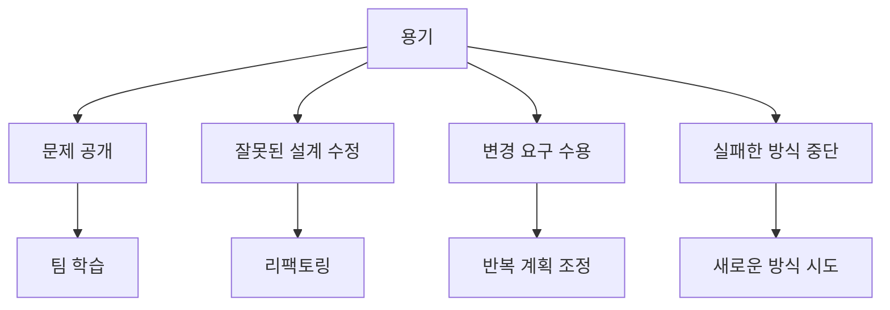

- 의미:
  - XP에서 용기는 무모함이 아니다.
  - 문제가 보이면 숨기지 않고 드러내며, 필요한 변경을 받아들이고, 잘못된 설계나 코드를 고칠 수 있는 태도다.
  - 테스트와 피드백이 있기 때문에 팀은 더 자신 있게 수정하고 개선할 수 있다.

- 시험 키워드:
  - `Courage`
  - `용기`
  - `변경 수용`
  - `문제 제기`
  - `리팩토링`
  - `피드백 수용`

- 구체적 예시:
  - 이미 작성한 코드라도 설계가 나쁘면 리팩토링한다.
  - 테스트가 실패하면 숨기지 않고 원인을 공유한다.
  - 고객 피드백이 어렵게 느껴져도 제품에 필요하면 반영 방향을 논의한다.
  - 효과가 없는 프로세스나 실천법을 계속 고집하지 않는다.

- 용기와 연결되는 XP 실천법:
  - `Refactoring`: 기존 코드를 과감히 개선
  - `Continuous Integration`: 통합 문제를 늦추지 않고 자주 드러냄
  - `Test-First Programming`: 변경해도 테스트로 검증 가능
  - `Collective Ownership`: 특정 코드가 특정 개인에게만 묶이지 않게 함

- 오답 함정:
  - `용기 = 계획 없이 위험 감수`가 아니다.
  - `용기 = 개인이 마음대로 코드 변경`이 아니다.
  - XP의 용기는 테스트, 의사소통, 존중을 바탕으로 한 책임 있는 행동이다.

---

## 8. 가치 4: 존중 Respect

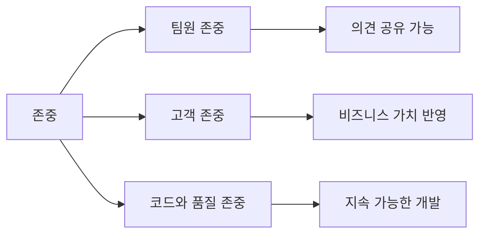

- 의미:
  - XP에서 존중은 팀원이 서로의 역할, 전문성, 한계, 의견을 인정하는 것이다.
  - 고객의 요구와 비즈니스 판단도 존중해야 한다.
  - 개발자는 코드 품질과 사용자에게 전달될 가치를 존중해야 한다.

- 시험 키워드:
  - `Respect`
  - `존중`
  - `상호 존중`
  - `협력`
  - `팀워크`
  - `책임`

- 구체적 예시:
  - 코드 리뷰에서 사람을 공격하지 않고 코드와 설계를 논의한다.
  - 고객의 업무 지식을 개발자가 존중한다.
  - 개발자의 기술 판단을 고객과 관리자가 존중한다.
  - 팀원이 지속 가능한 속도로 일할 수 있도록 과도한 초과근무를 당연시하지 않는다.

- 존중과 연결되는 XP 실천법:
  - `Pair Programming`: 두 사람이 동등하게 문제를 해결
  - `Collective Ownership`: 코드를 함께 책임짐
  - `Sustainable Pace`: 무리한 장시간 노동으로 품질과 팀 건강을 해치지 않음
  - `Whole Team`: 고객, 개발자, 기타 역할이 하나의 목표를 공유

- 오답 함정:
  - 존중은 단순히 분위기를 좋게 하는 추상적 덕목만이 아니다.
  - XP에서는 존중이 의사소통과 피드백을 가능하게 하는 실질적 조건이다.
  - 서로 존중하지 않으면 짝 프로그래밍, 공동 코드 소유, 피드백 수용이 제대로 작동하기 어렵다.

---

## 9. 가치 5: 피드백 Feedback

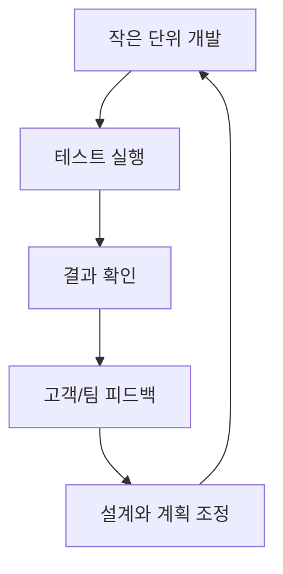

- 의미:
  - 피드백은 결과를 확인하고 다음 행동을 조정하는 순환이다.
  - XP는 고객 피드백, 테스트 피드백, 통합 피드백, 팀 회고를 통해 문제를 빨리 발견한다.
  - 피드백이 빠를수록 오류 수정 비용과 요구사항 오해를 줄일 수 있다.

- 시험 키워드:
  - `Feedback`
  - `피드백`
  - `테스트`
  - `반복`
  - `고객 검토`
  - `지속적 통합`
  - `작은 릴리스`

- 구체적 예시:
  - 테스트를 먼저 작성해 구현이 요구사항을 만족하는지 바로 확인한다.
  - 코드를 자주 통합해 통합 오류를 조기에 발견한다.
  - 작은 기능 단위로 고객에게 보여주고 우선순위를 조정한다.

- 피드백과 연결되는 XP 실천법:
  - `Test-First Programming`: 실패하는 테스트를 먼저 만들고 통과하도록 구현
  - `Continuous Integration`: 변경을 자주 통합하고 즉시 검증
  - `Small Releases`: 작은 단위로 릴리스해 고객 반응 확인
  - `Weekly Cycle`: 짧은 주기로 작업을 계획하고 검토

- 오답 함정:
  - 피드백은 개발 완료 후 마지막에 한 번 받는 것이 아니다.
  - 피드백은 고객 의견만 의미하지 않는다.
  - 테스트 결과, 빌드 결과, 통합 결과, 팀의 작업 방식 점검도 피드백에 포함된다.

---

## 10. XP 가치와 대표 실천법 연결

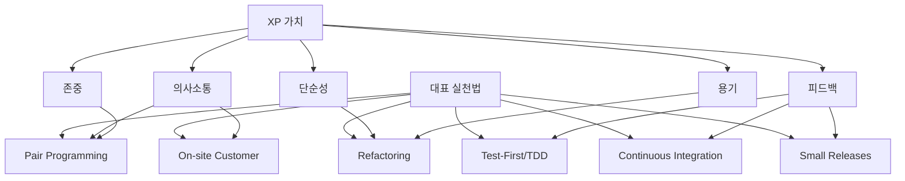

- XP는 가치만 외우면 절반만 이해한 것이다.
- 정보처리기사에서는 가치와 실천법을 직접 연결하는 문제가 자주 나오지는 않더라도, 실천법의 성격을 알면 오답 제거가 쉬워진다.

| XP 실천법 | 핵심 의미 | 연결 가치 |
|---|---|---|
| Pair Programming | 두 개발자가 함께 코드 작성 | 의사소통, 존중, 피드백 |
| Test-First Programming | 테스트를 먼저 작성하고 구현 | 피드백, 용기, 단순성 |
| Continuous Integration | 코드를 자주 통합하고 즉시 검증 | 피드백, 용기 |
| Refactoring | 외부 동작은 유지하며 내부 구조 개선 | 단순성, 용기 |
| Small Releases | 작은 단위로 자주 배포/검토 | 피드백, 고객 협업 |
| On-site Customer | 고객이 팀과 밀접하게 요구 결정 | 의사소통, 피드백 |
| Collective Ownership | 팀 전체가 코드에 책임 | 존중, 의사소통, 용기 |
| Coding Standard | 코드 작성 규칙 통일 | 의사소통, 존중 |

- 실천법을 외울 때의 기준:
  - `두 명이 함께` → Pair Programming
  - `테스트 먼저` → Test-First, TDD
  - `자주 통합` → Continuous Integration
  - `구조 개선` → Refactoring
  - `작게 자주 인도` → Small Releases
  - `고객 상주/밀접 참여` → On-site Customer

---

## 11. XP와 애자일 4대 가치 비교

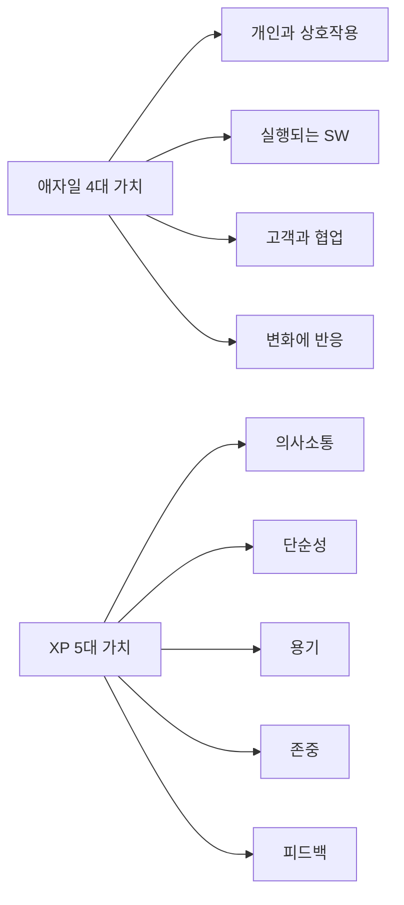

- `애자일 4대 가치`는 애자일 전체의 상위 가치다.
- `XP 5대 가치`는 XP라는 특정 방법론의 가치다.
- 두 목록은 의미상 연결되지만 시험에서는 구분해서 외워야 한다.

| 구분 | 암기 목록 | 특징 |
|---|---|---|
| 애자일 4대 가치 | 개인과 상호작용, 실행되는 SW, 고객 협업, 변화 대응 | 애자일 선언문 기반 |
| XP 5대 가치 | 의사소통, 단순성, 용기, 존중, 피드백 | XP 방법론의 가치 |
| 애자일 방법론 | Scrum, XP, FDD, Kanban, Lean | 방법론 이름 |
| XP 실천법 | Pair Programming, TDD, CI, Refactoring 등 | XP를 실제 개발에 적용하는 기법 |

- 연결해서 이해:
  - 애자일의 `개인과 상호작용`은 XP의 `의사소통`, `존중`과 연결된다.
  - 애자일의 `실행되는 SW`는 XP의 `테스트`, `작은 릴리스`, `지속적 통합`과 연결된다.
  - 애자일의 `고객과 협업`은 XP의 `피드백`, `온사이트 고객`과 연결된다.
  - 애자일의 `변화에 반응`은 XP의 `용기`, `단순성`, `리팩토링`과 연결된다.

- 오답 예시:
  - `개인과 상호작용`을 XP 5대 가치로 묻는 보기 → 애자일 4대 가치에 가까움
  - `피드백`을 애자일 4대 가치의 직접 항목으로 묻는 보기 → XP 가치에 가까움
  - `Scrum`을 XP 가치로 묻는 보기 → 방법론 이름이므로 오답

---

## 12. XP와 Scrum 비교

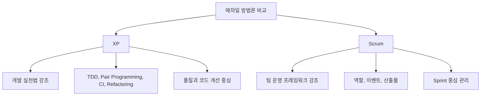

- XP와 Scrum은 둘 다 애자일 계열이다.
- 하지만 시험에서는 다음 차이를 기준으로 구분하면 된다.

| 구분 | XP | Scrum |
|---|---|---|
| 초점 | 공학적 개발 실천법 | 프로젝트/팀 운영 프레임워크 |
| 대표 요소 | TDD, 짝 프로그래밍, CI, 리팩토링 | Product Owner, Scrum Master, Sprint |
| 가치/원칙 | 의사소통, 단순성, 용기, 존중, 피드백 | 투명성, 점검, 적응 등 경험주의 기반 |
| 산출물 | 테스트된 코드, 작은 릴리스, 단순 설계 | Product Backlog, Sprint Backlog, Increment |
| 출제 단서 | 개발자 실천, 코드 품질, 테스트 | 역할, 이벤트, 스프린트 |

- 시험 함정:
  - `스프린트`, `제품 책임자`, `스크럼 마스터`가 나오면 Scrum 쪽 단서다.
  - `짝 프로그래밍`, `테스트 우선 개발`, `리팩토링`, `지속적 통합`이 나오면 XP 쪽 단서다.
  - `피드백`은 애자일 전반에서도 중요하지만, XP의 핵심 가치 목록에도 포함된다.

---

## 13. 시험에서 보는 단서어

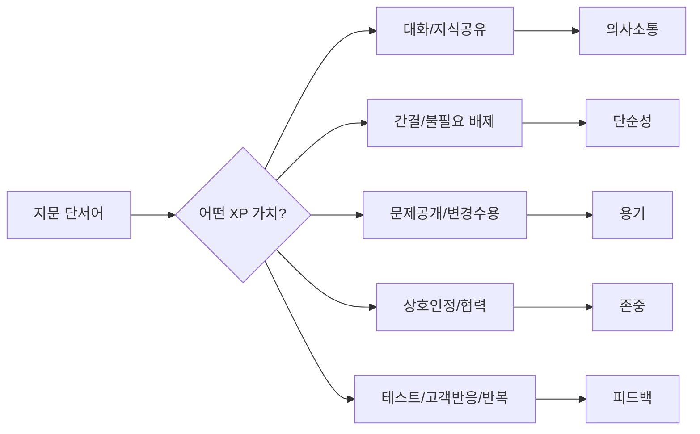

- 단서어별 빠른 매칭:

| 지문 단서어 | 연결 가치 |
|---|---|
| 대화, 직접 소통, 지식 공유, 고객과 개발자 대화 | 의사소통 |
| 단순 설계, 불필요한 기능 제거, 현재 필요한 것만 구현 | 단순성 |
| 문제를 드러냄, 변경 수용, 리팩토링 결단, 실패 인정 | 용기 |
| 팀원 의견 인정, 고객과 개발자 상호 신뢰, 공동 책임 | 존중 |
| 테스트 결과, 고객 반응, 반복 검토, 지속적 통합 | 피드백 |

- 보기 판별 예시:

| 보기 | 판단 | 이유 |
|---|---|---|
| XP는 의사소통, 단순성, 용기, 존중, 피드백을 핵심 가치로 한다 | O | PDF 핵심 그대로 |
| XP의 핵심 가치는 개인과 상호작용, 실행 SW, 고객 협업, 변화 대응이다 | X | 애자일 4대 가치 |
| XP는 테스트 우선 개발과 지속적 통합 같은 개발 실천법을 강조한다 | O | XP의 대표 특징 |
| XP는 문서 작성을 금지하고 테스트도 생략한다 | X | 극단 표현, XP는 테스트를 강하게 중시 |
| XP는 개발자가 고객과 격리되어 명세서만 보고 개발하는 방식이다 | X | 의사소통, 피드백과 반대 |

- 문제 풀이 순서:
  1. 지문이 `가치`, `방법론`, `실천법` 중 무엇을 묻는지 먼저 본다.
  2. `XP의 핵심 가치`라면 `의-단-용-존-피`를 떠올린다.
  3. `애자일의 핵심 가치`라면 `개-실-고-변`을 떠올린다.
  4. `XP 실천법`이라면 `짝 프로그래밍`, `TDD`, `CI`, `리팩토링` 등을 떠올린다.

---

## 14. 자주 나오는 함정

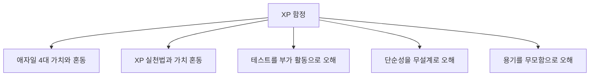

- 함정 1: 애자일 4대 가치와 섞기
  - `개인과 상호작용`, `실행되는 SW`, `고객 협업`, `변화 대응`은 애자일 4대 가치다.
  - XP의 핵심 가치는 `의사소통`, `단순성`, `용기`, `존중`, `피드백`이다.

- 함정 2: 실천법을 가치로 섞기
  - `짝 프로그래밍`, `테스트 우선 개발`, `리팩토링`, `지속적 통합`은 XP의 대표 실천법이다.
  - 가치 목록을 묻는 문제에서는 직접 답이 아니다.

- 함정 3: 단순성을 대충 만드는 것으로 오해
  - 단순성은 낮은 품질이 아니라 불필요한 복잡성을 줄이는 것이다.
  - 좋은 단순성은 테스트, 리팩토링, 명확한 요구사항 이해와 함께 작동한다.

- 함정 4: 용기를 개인 마음대로 변경하는 것으로 오해
  - XP의 용기는 팀 합의, 테스트, 피드백, 존중을 기반으로 한다.
  - 아무 검증 없이 코드를 바꾸는 것은 XP의 용기가 아니다.

- 함정 5: 피드백을 고객 의견으로만 한정
  - 피드백은 고객 반응뿐 아니라 테스트 결과, 빌드 결과, 통합 결과, 팀 작업 방식 검토를 포함한다.

- 함정 6: XP를 문서 없는 개발로 오해
  - XP는 문서보다 소통과 작동 소프트웨어를 중시하지만, 필요한 기록과 기준은 유지할 수 있다.

---

## 15. 암기 포인트

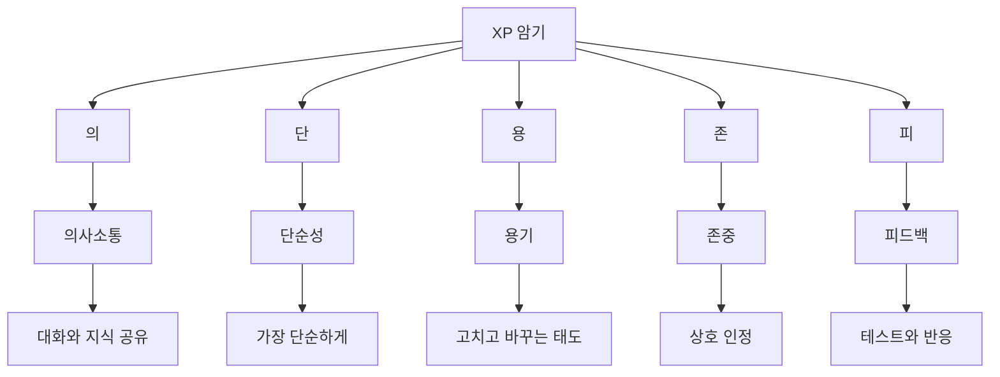

- 1차 암기:
  - `의-단-용-존-피`
  - 의사소통, 단순성, 용기, 존중, 피드백

- 2차 암기:
  - 의사소통 = 대화와 지식 공유
  - 단순성 = 불필요한 복잡성 제거
  - 용기 = 문제를 드러내고 변경 수용
  - 존중 = 팀원과 고객의 역할 인정
  - 피드백 = 테스트와 고객 반응으로 빠른 학습

- 3차 암기:
  - XP = 애자일 방법론 중 개발 실천법이 강함
  - XP 실천법 = 짝 프로그래밍, TDD, 지속적 통합, 리팩토링, 작은 릴리스
  - XP 가치와 애자일 4대 가치를 구분

- 말로 풀어 외우기:
  - `소통하고, 단순하게 만들고, 고칠 용기를 갖고, 서로 존중하며, 빠르게 피드백 받는다.`

- 시험 직전 10초 복습:
  - 애자일 4대 가치 = `개-실-고-변`
  - XP 5대 가치 = `의-단-용-존-피`
  - XP 실천법 = `짝-TDD-CI-리팩토링`

---

## 16. 빠른 복습

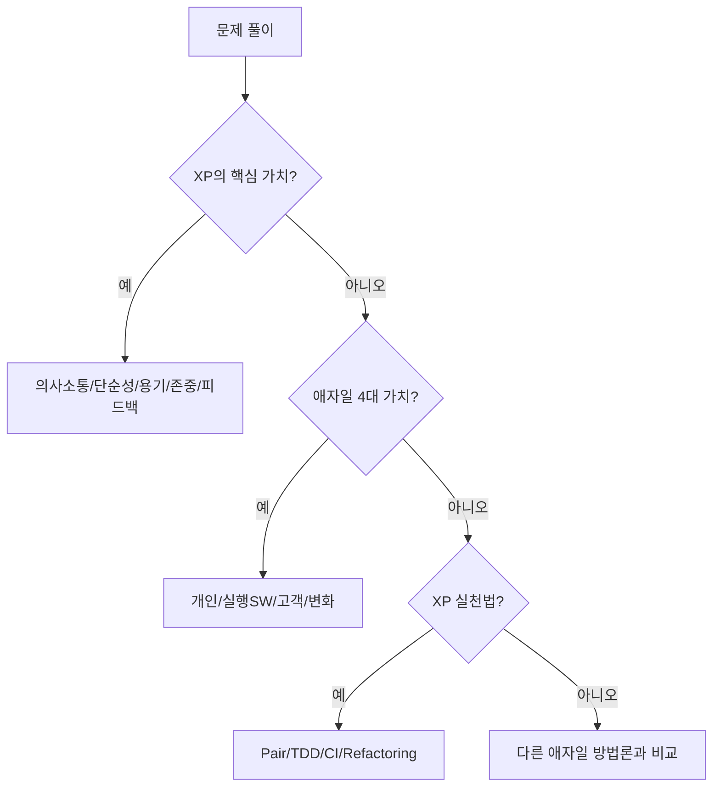

- 챕터명:
  - `006 XP의 핵심 가치`

- 소속 영역:
  - `1과목 소프트웨어 설계`
  - `소프트웨어 개발 모형`
  - `애자일`
  - `XP`

- 반드시 외울 목록:
  - `의사소통(Communication)`
  - `단순성(Simplicity)`
  - `용기(Courage)`
  - `존중(Respect)`
  - `피드백(Feedback)`

- 가장 중요한 해석:
  - XP는 빠른 피드백과 협업을 통해 변화에 대응하는 애자일 방법론이다.
  - XP는 특히 테스트, 리팩토링, 짝 프로그래밍, 지속적 통합 같은 개발 실천법을 강조한다.
  - XP의 가치는 추상적 구호가 아니라 실천법을 가능하게 하는 행동 기준이다.

- 자주 나오는 문제 유형:
  - XP의 핵심 가치가 아닌 것을 고르는 문제
  - 애자일 4대 가치와 XP 5대 가치를 구분하는 문제
  - XP 실천법을 묻는 문제
  - Scrum과 XP의 차이를 묻는 문제
  - `단순성`, `용기`, `피드백`의 의미를 왜곡한 보기를 판별하는 문제

- 최종 암기 문장:
  - `XP의 핵심 가치는 의사소통, 단순성, 용기, 존중, 피드백이며, 개발 실천법을 통해 빠른 피드백과 품질 개선을 추구한다.`

---

## 17. 참고 링크

- 기준 PDF: `/Users/nes0903/Documents/study/정보처리기사/핵심요약집_2026_정보처리기사필기핵심요약.pdf`
- [Q-Net 정보처리기사 종목 페이지](https://www.q-net.or.kr/crf005.do?id=crf00503s02&jmCd=1320&jmInfoDivCcd=B0)
- [Agile Alliance - Extreme Programming](https://agilealliance.org/glossary/xp/)
- [Manifesto for Agile Software Development](https://agilemanifesto.org/)
- [Principles behind the Agile Manifesto](https://agilemanifesto.org/principles.html)

<!-- study-links:start -->
## 관련 문서

- `단위 테스트`: [[정보처리기사/2과목 소프트웨어 개발/084 단위 테스트(Unit Test)/084 단위 테스트(Unit Test)|084 단위 테스트(Unit Test)]]
- `핵심 가치`: [[정보처리기사/1과목 소프트웨어 설계/005 애자일 개발 4가지 핵심 가치/005 애자일 개발 4가지 핵심 가치|005 애자일 개발 4가지 핵심 가치]]
<!-- study-links:end -->
