# 007 주요 비기능 요구사항

작성 기준일: 2026-05-02  
과목: `1과목 소프트웨어 설계`  
기준 PDF: `/Users/nes0903/Documents/study/정보처리기사/핵심요약집_2026_정보처리기사필기핵심요약.pdf`  
PDF 확인 위치: `1페이지`  
검색 보강: IREB CPRE 요구공학 용어집, ISO/IEC 25010:2023 품질모델, Q-Net 정보처리기사 시험 정보를 함께 확인하여 시험 중심으로 확장 정리

---

## 1. 한 줄 요약

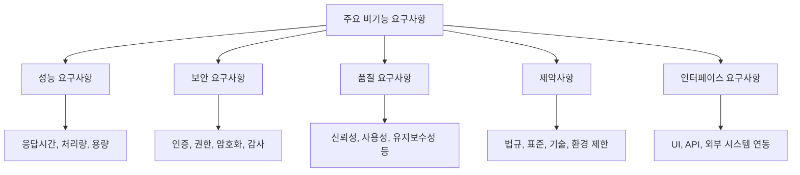

- 비기능 요구사항은 시스템이 `무엇을 수행하는가`보다 `얼마나 잘`, `어떤 조건에서`, `어떤 제약을 지키며` 동작해야 하는지를 정의하는 요구사항이다.
- PDF 기준 주요 비기능 요구사항은 `성능`, `보안`, `품질`, `제약사항`, `인터페이스` 5개로 외운다.
- 요구공학 관점에서는 비기능 요구사항을 크게 `품질 요구사항`과 `제약사항`으로 설명하는 경우가 많다.
- 시험에서는 `기능 요구사항`과 `비기능 요구사항`의 구분, 그리고 비기능 요구사항의 예시 판별이 자주 나온다.
- 암기 축약어는 `성-보-품-제-인`으로 잡으면 빠르다.

---

## 2. PDF 기준 핵심

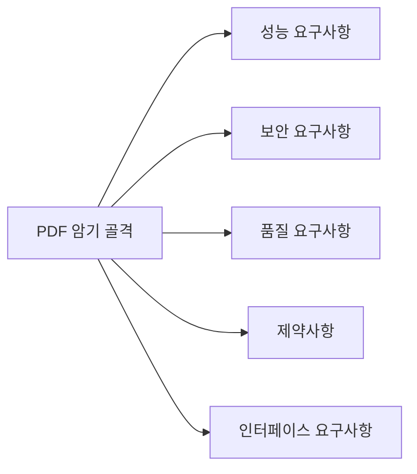

- PDF에 제시된 주요 비기능 요구사항은 다음 5개다.
  - `성능 요구사항`
  - `보안 요구사항`
  - `품질 요구사항`
  - `제약사항`
  - `인터페이스 요구사항`

- 이 챕터의 최소 암기 목표:
  - 비기능 요구사항의 정의
  - 주요 항목 5개
  - 기능 요구사항과의 차이
  - 각 항목의 대표 예시
  - 모호한 표현을 측정 가능한 요구사항으로 바꾸는 방법

- 시험에서 중요한 표현:
  - `무엇을 할 것인가` → 기능 요구사항
  - `얼마나 빠르게/안전하게/안정적으로/쉽게/제약 내에서 할 것인가` → 비기능 요구사항
  - `기능의 품질과 조건` → 비기능 요구사항
  - `아키텍처, 설계, 기술 선택에 큰 영향` → 비기능 요구사항

---

## 3. 비기능 요구사항의 위치

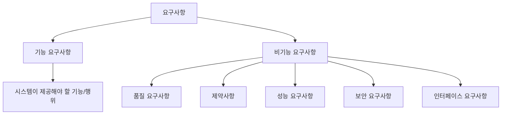

- 기능 요구사항은 시스템이 수행해야 할 `행위`나 `결과`를 말한다.
  - 예: 회원은 로그인할 수 있어야 한다.
  - 예: 사용자는 주문 내역을 조회할 수 있어야 한다.
  - 예: 관리자는 상품 정보를 등록할 수 있어야 한다.

- 비기능 요구사항은 기능이 만족해야 하는 `품질`, `조건`, `제약`, `운영 특성`을 말한다.
  - 예: 로그인 응답은 95% 요청에서 2초 이내여야 한다.
  - 예: 비밀번호는 안전한 해시 알고리즘으로 저장해야 한다.
  - 예: 서비스는 월 가용률 99.9% 이상이어야 한다.
  - 예: 시스템은 기관 표준 DBMS를 사용해야 한다.

- IREB CPRE 용어집 기준으로 보면:
  - 비기능 요구사항은 `품질 요구사항` 또는 `제약사항`으로 설명된다.
  - 성능 요구사항은 품질 요구사항의 하위 범주로 보기도 하고, 별도 비기능 요구사항 범주로 보기도 한다.
  - 따라서 시험에서는 PDF의 5개 목록을 우선하고, 개념 이해는 `품질 + 제약` 구조로 잡으면 안정적이다.

- 비기능 요구사항이 중요한 이유:
  - 아키텍처 선택에 영향을 준다.
  - 기술 스택 선택에 영향을 준다.
  - 테스트 기준과 인수 기준이 된다.
  - 운영 비용과 확장성에 영향을 준다.
  - 기능이 맞아도 비기능이 실패하면 사용자는 시스템을 실패로 인식할 수 있다.

---

## 4. 기능 요구사항과 비기능 요구사항 비교

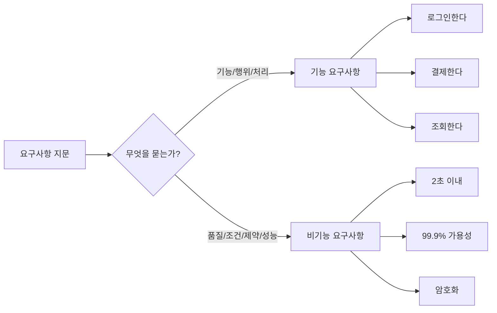

- 기능 요구사항:
  - 시스템이 제공해야 하는 기능 자체를 정의한다.
  - 사용자의 업무 절차와 직접 연결된다.
  - 동사 중심으로 표현되는 경우가 많다.
  - 예: 등록한다, 조회한다, 수정한다, 삭제한다, 계산한다, 알림을 보낸다.

- 비기능 요구사항:
  - 기능을 수행할 때 지켜야 하는 품질과 조건을 정의한다.
  - 시스템 전체 품질, 운영 환경, 보안, 성능, 표준 준수와 연결된다.
  - 수치, 기준, 제약, 품질 속성 중심으로 표현되는 경우가 많다.
  - 예: 2초 이내, 동시 사용자 1,000명, TLS 적용, 99.9% 가용성, 모바일 브라우저 지원.

| 구분 | 기능 요구사항 | 비기능 요구사항 |
|---|---|---|
| 핵심 질문 | 시스템이 무엇을 해야 하는가 | 시스템이 어떻게, 어느 수준으로 동작해야 하는가 |
| 관심사 | 기능, 행위, 결과 | 품질, 제약, 성능, 보안, 인터페이스 |
| 예시 | 로그인 기능 제공 | 로그인 응답 2초 이내 |
| 예시 | 결제 승인 처리 | 결제 정보 암호화 저장 |
| 예시 | 보고서 다운로드 | 10만 건 기준 5초 이내 생성 |
| 검증 방식 | 기능 테스트, 시나리오 테스트 | 성능 테스트, 보안 점검, 가용성 측정, 호환성 테스트 |

- 핵심 판별법:
  - `할 수 있어야 한다`만 있으면 기능 요구사항일 가능성이 크다.
  - `얼마나`, `어느 수준`, `어떤 조건`, `어떤 표준`, `몇 초`, `몇 명`, `몇 %`가 나오면 비기능 요구사항일 가능성이 크다.

---

## 5. 성능 요구사항

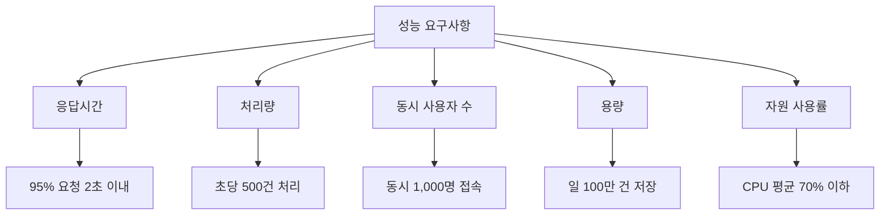

- 의미:
  - 성능 요구사항은 시스템이 정해진 시간, 부하, 자원 조건에서 어느 정도의 처리 능력을 보여야 하는지를 정의한다.
  - IREB 용어집도 성능 요구사항을 시간, 속도, 용량, 처리량 등의 성능 특성을 설명하는 요구사항으로 본다.

- 대표 항목:
  - `응답시간`: 요청 후 응답까지 걸리는 시간
  - `처리량`: 단위 시간당 처리 가능한 작업량
  - `동시 사용자 수`: 동시에 접속하거나 작업할 수 있는 사용자 수
  - `용량`: 저장 가능한 데이터량, 파일 크기, 트랜잭션 수
  - `자원 사용률`: CPU, 메모리, 네트워크, 디스크 사용량
  - `확장성`: 사용량 증가 시 성능을 유지하거나 확장할 수 있는 능력

- 좋은 성능 요구사항 예시:
  - `상품 검색 API는 동시 사용자 500명 조건에서 95% 요청을 2초 이내에 응답해야 한다.`
  - `주문 생성 요청은 정상 부하에서 초당 200건 이상 처리되어야 한다.`
  - `보고서 생성 기능은 10만 건 데이터 기준 5초 이내에 결과 파일을 생성해야 한다.`

- 나쁜 성능 요구사항 예시:
  - `시스템은 빨라야 한다.`
  - `대용량 데이터를 잘 처리해야 한다.`
  - `사용자가 불편하지 않을 정도로 응답해야 한다.`

- 시험 포인트:
  - `응답시간`, `처리량`, `동시 사용자`, `용량`, `속도`가 나오면 성능 요구사항이다.
  - 성능 요구사항은 가능한 한 수치화되어야 한다.
  - 성능 요구사항은 아키텍처, 캐시, DB 설계, 인프라 규모 산정에 직접 영향을 준다.

---

## 6. 보안 요구사항

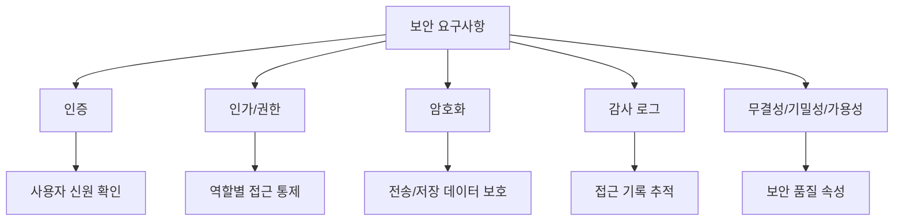

- 의미:
  - 보안 요구사항은 시스템의 데이터와 자원을 권한 없는 접근, 사용, 변경, 노출, 방해로부터 보호하기 위한 요구사항이다.
  - IREB 용어집은 보안을 시스템이 데이터와 자원을 무단 접근/사용으로부터 보호하고, 정당한 사용자에게 방해 없는 접근과 사용을 보장하는 정도로 설명한다.

- 대표 항목:
  - `인증(Authentication)`: 사용자가 누구인지 확인
  - `인가/권한(Authorization)`: 사용자가 무엇을 할 수 있는지 제한
  - `암호화(Encryption)`: 전송 또는 저장 데이터 보호
  - `감사 로그(Audit Log)`: 누가 언제 무엇을 했는지 추적
  - `무결성(Integrity)`: 데이터가 허가 없이 변경되지 않도록 보장
  - `기밀성(Confidentiality)`: 민감 정보가 노출되지 않도록 보호
  - `가용성(Availability)`: 정당한 사용자가 필요한 때 사용할 수 있도록 보장

- 좋은 보안 요구사항 예시:
  - `관리자 기능은 관리자 권한을 가진 사용자만 접근할 수 있어야 한다.`
  - `사용자 비밀번호는 평문으로 저장하지 않고 안전한 해시 방식으로 저장해야 한다.`
  - `개인정보가 포함된 API 통신은 TLS를 사용해야 한다.`
  - `관리자 로그인 실패 기록은 사용자 ID, 시각, IP 주소와 함께 감사 로그로 남겨야 한다.`

- 나쁜 보안 요구사항 예시:
  - `시스템은 안전해야 한다.`
  - `해킹을 막아야 한다.`
  - `중요 정보는 잘 보호해야 한다.`

- 시험 포인트:
  - `인증`, `권한`, `암호화`, `접근 제어`, `감사`, `개인정보`, `무결성`, `기밀성`이 나오면 보안 요구사항이다.
  - 보안 요구사항은 기능 요구사항과 섞일 수 있다.
  - 예를 들어 `로그인 기능 제공`은 기능 요구사항이고, `로그인 실패 5회 시 계정 잠금`은 보안 정책이 포함된 요구사항이다.

---

## 7. 품질 요구사항

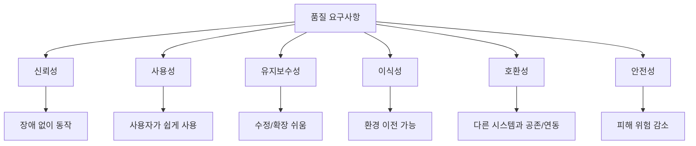

- 의미:
  - 품질 요구사항은 기능 요구사항으로 직접 표현되지 않는 품질 관심사를 다룬다.
  - IREB 용어집은 품질 요구사항을 기능 요구사항으로 덮이지 않는 품질 관심사에 관한 요구사항으로 설명한다.
  - ISO/IEC 25010:2023은 ICT 및 소프트웨어 제품의 품질 특성을 명세, 측정, 평가하기 위한 품질모델을 정의한다.

- 대표 품질 속성:
  - `신뢰성`: 정해진 조건과 기간 동안 지정된 기능을 수행하는 정도
  - `가용성`: 필요한 때 사용할 수 있는 정도
  - `사용성`: 사용자가 목표를 쉽고 효율적으로 달성할 수 있는 정도
  - `유지보수성`: 결함 수정, 기능 변경, 확장이 쉬운 정도
  - `이식성`: 다른 환경으로 옮겨도 동작할 수 있는 정도
  - `호환성`: 다른 시스템과 데이터를 교환하거나 같은 환경에서 공존할 수 있는 정도
  - `안전성`: 사람, 재산, 환경에 피해를 주지 않도록 위험을 낮추는 정도

- 좋은 품질 요구사항 예시:
  - `서비스는 월간 가용률 99.9% 이상을 만족해야 한다.`
  - `신규 사용자는 별도 교육 없이 10분 이내에 기본 주문 조회를 수행할 수 있어야 한다.`
  - `주요 비즈니스 규칙 변경 시 관련 설정 변경만으로 적용할 수 있어야 한다.`
  - `시스템은 Chrome, Edge, Safari 최신 2개 주 버전에서 정상 동작해야 한다.`

- 나쁜 품질 요구사항 예시:
  - `사용하기 쉬워야 한다.`
  - `장애가 없어야 한다.`
  - `유지보수가 편해야 한다.`
  - `다양한 환경에서 잘 돌아가야 한다.`

- 시험 포인트:
  - 품질 요구사항은 `좋다/빠르다/쉽다/안정적이다` 같은 형용사로 끝나면 모호하다.
  - 실제 요구사항 명세에서는 측정 기준, 조건, 목표값을 넣어야 한다.
  - ISO/IEC 9126 품질 특성 챕터와 연결될 수 있으므로 `기능성`, `신뢰성`, `사용성`, `효율성`, `유지보수성`, `이식성`도 함께 떠올리면 좋다.

---

## 8. 제약사항

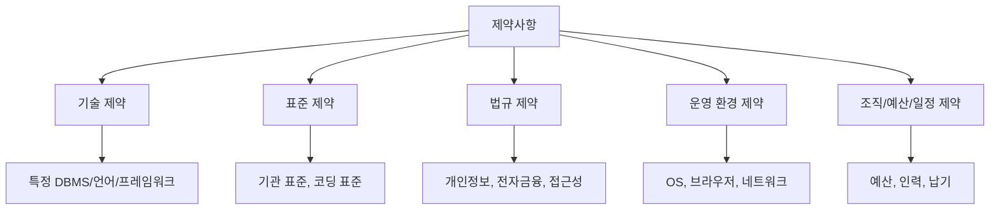

- 의미:
  - 제약사항은 시스템이 기능과 품질 요구사항을 만족하기 위해 선택할 수 있는 해결 공간을 제한하는 조건이다.
  - IREB 용어집은 제약사항을 기능 요구사항과 품질 요구사항을 만족하는 데 필요한 범위를 넘어 해결 공간을 제한하는 요구사항으로 설명한다.

- 대표 항목:
  - `기술 제약`: 반드시 특정 언어, DBMS, 프레임워크, 클라우드, 미들웨어를 사용해야 함
  - `표준 제약`: 기관 표준, 산업 표준, 코딩 규칙, 보안 기준 준수
  - `법규 제약`: 개인정보 보호, 전자서명, 금융 규제, 접근성 기준 등
  - `운영 환경 제약`: 특정 OS, 브라우저, 네트워크, 장비, 데이터센터 환경
  - `조직 제약`: 개발 인력, 일정, 예산, 납품 방식, 운영 조직 구조

- 좋은 제약사항 예시:
  - `DBMS는 기관 표준인 PostgreSQL 16을 사용해야 한다.`
  - `웹 화면은 공공 웹 접근성 기준을 준수해야 한다.`
  - `시스템은 사내 폐쇄망 환경에서 설치 및 운영 가능해야 한다.`
  - `배포 산출물은 고객사의 표준 컨테이너 이미지 정책을 따라야 한다.`

- 나쁜 제약사항 예시:
  - `최신 기술을 사용해야 한다.`
  - `좋은 DB를 써야 한다.`
  - `법규를 잘 지켜야 한다.`

- 시험 포인트:
  - `반드시`, `특정`, `표준`, `법규`, `환경`, `제한`, `준수`가 나오면 제약사항 가능성이 크다.
  - 제약사항은 성능이나 품질을 직접 높이는 요구사항이라기보다 설계 선택지를 제한한다.
  - 제약사항은 기능 요구사항보다 아키텍처와 구현 기술에 더 직접적인 영향을 줄 수 있다.

---

## 9. 인터페이스 요구사항

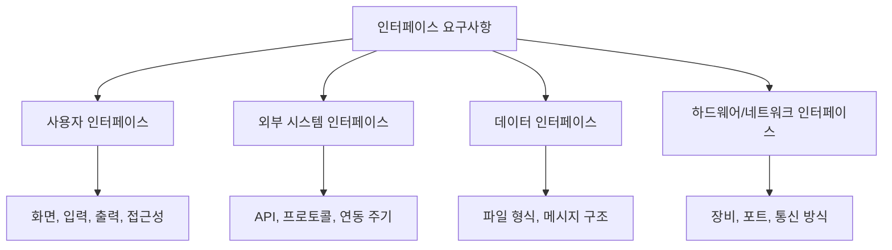

- 의미:
  - 인터페이스 요구사항은 시스템이 사용자, 외부 시스템, 장비, 데이터 교환 대상과 어떻게 연결되고 상호작용해야 하는지를 정의한다.
  - PDF는 인터페이스 요구사항을 주요 비기능 요구사항 목록에 포함한다.
  - 요구공학에서는 인터페이스 요구사항이 기능 요구사항과 비기능 요구사항 양쪽 성격을 가질 수 있으므로, 정보처리기사 문제에서는 PDF 기준 분류를 우선한다.

- 대표 항목:
  - `사용자 인터페이스`: 화면 구성, 입력 방식, 출력 형식, 접근성, 다국어 지원
  - `외부 시스템 인터페이스`: API 명세, 요청/응답 형식, 프로토콜, 연동 주기
  - `데이터 인터페이스`: CSV, XML, JSON, 전문 형식, 문자 인코딩, 파일명 규칙
  - `하드웨어 인터페이스`: 장비 연결 방식, 포트, 센서, 단말기
  - `네트워크 인터페이스`: 통신 프로토콜, 포트, 방화벽, 대역폭, 보안 채널

- 좋은 인터페이스 요구사항 예시:
  - `외부 결제 시스템과의 연동은 HTTPS 기반 REST API로 수행해야 하며, 요청/응답 본문은 JSON 형식을 사용해야 한다.`
  - `회계 시스템으로 전송하는 정산 파일은 UTF-8 인코딩의 CSV 형식이어야 한다.`
  - `관리자 화면은 1920x1080 해상도 기준 주요 업무 메뉴가 첫 화면에 표시되어야 한다.`
  - `장비 연동은 TCP 9000 포트를 사용하며, 메시지 구분자는 CRLF로 한다.`

- 나쁜 인터페이스 요구사항 예시:
  - `외부 시스템과 잘 연동되어야 한다.`
  - `사용하기 좋은 화면이어야 한다.`
  - `데이터를 적절한 형식으로 주고받아야 한다.`

- 시험 포인트:
  - `API`, `프로토콜`, `화면`, `파일 형식`, `연동`, `입출력 형식`, `외부 시스템`이 나오면 인터페이스 요구사항을 의심한다.
  - `사용자 인터페이스`는 다음 챕터의 UI 개념과 연결된다.
  - `외부 시스템 인터페이스`는 설계 단계에서 연동 방식과 오류 처리까지 영향을 준다.

---

## 10. 비기능 요구사항은 왜 수치화해야 하는가

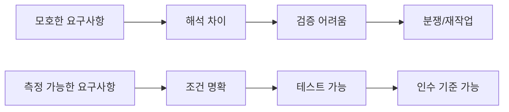

- 비기능 요구사항은 모호하게 쓰면 검증하기 어렵다.
- `빠르게`, `안전하게`, `쉽게`, `안정적으로`, `효율적으로` 같은 표현은 그대로는 시험 답안의 개념 판별에는 도움이 되지만 실제 명세로는 부족하다.
- 좋은 비기능 요구사항은 보통 다음 요소를 가진다.
  - 측정 대상
  - 측정 조건
  - 목표 수치
  - 측정 방법
  - 예외 조건

- 문장 개선 예시:

| 모호한 표현 | 개선된 요구사항 |
|---|---|
| 시스템은 빨라야 한다 | 상품 검색은 동시 사용자 500명 조건에서 95% 요청을 2초 이내 응답해야 한다 |
| 시스템은 안전해야 한다 | 개인정보 조회 API는 인증된 사용자만 접근 가능하며, 모든 접근 기록을 감사 로그로 저장해야 한다 |
| 사용하기 쉬워야 한다 | 신규 사용자는 도움말 없이 10분 이내에 주문 조회를 완료할 수 있어야 한다 |
| 장애가 없어야 한다 | 서비스는 월간 가용률 99.9% 이상을 만족해야 한다 |
| 여러 환경에서 동작해야 한다 | Chrome, Edge, Safari 최신 2개 주 버전을 지원해야 한다 |

- 시험 포인트:
  - 비기능 요구사항은 `측정 가능성`이 중요하다.
  - 측정 가능한 비기능 요구사항은 테스트 케이스와 인수 기준으로 연결된다.
  - 측정 조건 없이 목표 수치만 있으면 여전히 불완전할 수 있다.

---

## 11. ISO 품질모델과의 연결

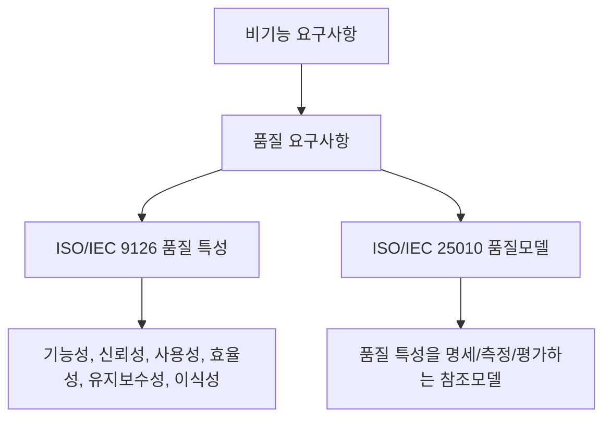

- 정보처리기사 필기에서는 뒤쪽 챕터에서 `ISO/IEC 9126의 품질 특성`이 별도 출제된다.
- 따라서 이 챕터의 `품질 요구사항`을 공부할 때 다음 연결을 잡아두면 좋다.
  - 기능성
  - 신뢰성
  - 사용성
  - 효율성
  - 유지보수성
  - 이식성

- ISO/IEC 25010:2023은 ICT 및 소프트웨어 제품의 품질 속성을 명세, 측정, 평가하기 위한 제품 품질모델을 정의한다.
- ISO/IEC 25010의 관점은 시험의 세부 암기 범위와 완전히 같지는 않지만, 비기능 요구사항이 왜 `품질 속성`으로 정리되는지 이해하는 데 도움이 된다.

- 시험용 연결:

| 이 챕터의 항목 | 품질모델과 연결되는 관점 | 예시 |
|---|---|---|
| 성능 요구사항 | 효율성, 성능 효율성 | 응답시간, 처리량, 자원 사용률 |
| 보안 요구사항 | 보안성 | 인증, 접근제어, 암호화 |
| 품질 요구사항 | 신뢰성, 사용성, 유지보수성, 이식성 등 | 가용률, 학습성, 변경 용이성 |
| 제약사항 | 품질 속성 자체보다 해결 공간 제한 | 특정 DBMS, 표준 준수 |
| 인터페이스 요구사항 | 호환성, 사용성, 연동성 | API 형식, UI 기준, 데이터 교환 |

- 주의:
  - 정보처리기사 시험에서는 PDF에 나온 표현을 우선한다.
  - ISO/IEC 9126과 ISO/IEC 25010의 세부 품질 특성 목록을 무리하게 섞어 외우면 오히려 헷갈릴 수 있다.
  - 이 챕터에서는 `성-보-품-제-인`을 우선 암기하고, 품질 요구사항 이해를 위해 품질모델을 보조로 사용한다.

---

## 12. 요구사항 개발 프로세스와의 연결

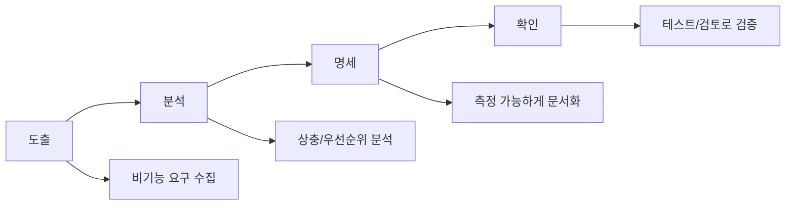

- 다음 챕터인 `008 요구사항 개발 프로세스`와 연결해서 보면 비기능 요구사항은 다음 흐름으로 다뤄진다.

- 도출:
  - 이해관계자 인터뷰, 기존 시스템 분석, 법규/표준 검토, 운영 환경 분석으로 비기능 요구를 찾는다.
  - 사용자가 직접 말하지 않아도 필요한 보안, 성능, 가용성 요구가 있을 수 있다.

- 분석:
  - 비기능 요구사항끼리 충돌할 수 있다.
  - 예: 강한 보안은 사용성을 낮출 수 있다.
  - 예: 높은 성능과 낮은 비용은 충돌할 수 있다.
  - 예: 특정 기술 제약은 이식성을 낮출 수 있다.

- 명세:
  - 모호한 형용사를 줄이고 측정 가능한 문장으로 바꾼다.
  - 조건, 수치, 범위, 예외, 검증 방법을 함께 적는다.

- 확인:
  - 성능 테스트, 보안 점검, 사용성 테스트, 리뷰, 프로토타입 평가 등으로 요구사항이 타당하고 검증 가능한지 확인한다.

- 시험 포인트:
  - 비기능 요구사항은 도출하기 어렵고 누락되기 쉽다.
  - 뒤늦게 발견되면 아키텍처 변경이 필요해 비용이 커질 수 있다.
  - 요구사항 명세 단계에서 검증 가능하게 작성하는 것이 중요하다.

---

## 13. 아키텍처와 설계에 미치는 영향

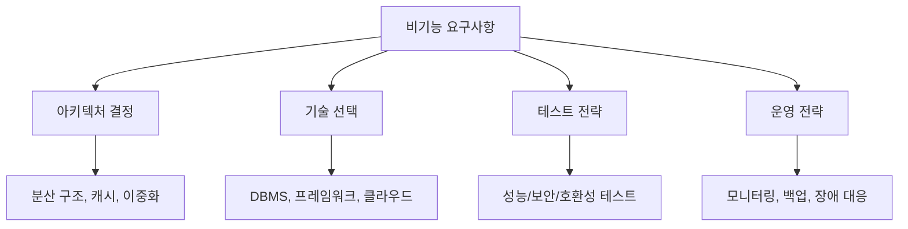

- 비기능 요구사항은 단순한 부가 조건이 아니다.
- 시스템 설계에서 큰 방향을 결정한다.

- 성능 요구사항의 설계 영향:
  - 캐시 적용
  - DB 인덱스 설계
  - 비동기 처리
  - 서버 확장 구조
  - 부하 분산

- 보안 요구사항의 설계 영향:
  - 인증/인가 구조
  - 암호화 키 관리
  - 감사 로그 저장 구조
  - 네트워크 분리
  - 접근 통제 정책

- 품질 요구사항의 설계 영향:
  - 장애 복구 구조
  - 모듈화
  - 테스트 자동화
  - 유지보수 가능한 계층 구조
  - UI/UX 설계

- 제약사항의 설계 영향:
  - 사용 가능한 기술 제한
  - 배포 환경 제한
  - 법규 준수 설계
  - 운영 방식 제한

- 인터페이스 요구사항의 설계 영향:
  - API 설계
  - 메시지 포맷
  - 오류 코드 체계
  - 외부 시스템 장애 대응
  - 데이터 변환 구조

- 시험 포인트:
  - 비기능 요구사항은 구현 후 마지막에 붙이는 것이 아니다.
  - 초기 요구사항 분석과 아키텍처 설계 단계에서 반드시 고려해야 한다.

---

## 14. 시험에서 보는 단서어

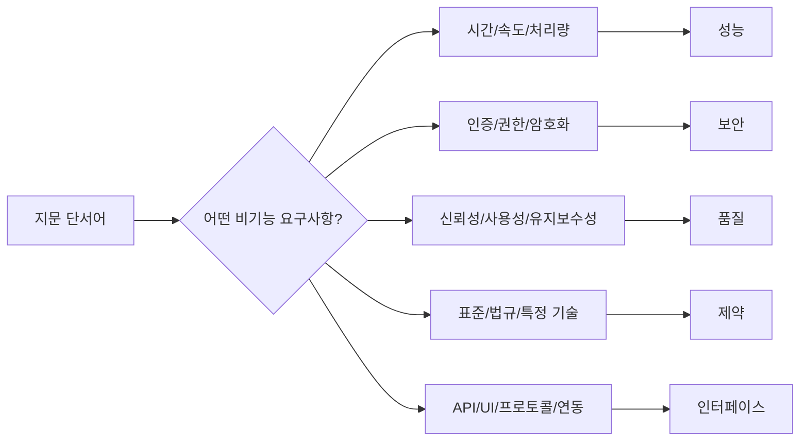

- 단서어별 빠른 매칭:

| 지문 단서어 | 연결할 요구사항 |
|---|---|
| 응답시간, 처리량, 동시 사용자, TPS, 지연시간, 용량 | 성능 요구사항 |
| 인증, 인가, 권한, 암호화, 감사 로그, 접근 통제 | 보안 요구사항 |
| 신뢰성, 가용성, 사용성, 유지보수성, 이식성, 호환성 | 품질 요구사항 |
| 법규, 표준, 정책, 특정 DBMS, 특정 OS, 예산, 일정 | 제약사항 |
| 화면, API, 프로토콜, 파일 형식, 메시지 구조, 외부 시스템 | 인터페이스 요구사항 |

- 기능 요구사항과 구분하는 단서:
  - `상품을 조회한다` → 기능 요구사항
  - `상품 조회는 2초 이내 응답한다` → 성능 요구사항
  - `관리자는 상품을 삭제할 수 있다` → 기능 요구사항
  - `상품 삭제는 관리자 권한 사용자만 가능하다` → 보안 요구사항
  - `정산 파일을 생성한다` → 기능 요구사항
  - `정산 파일은 UTF-8 CSV 형식이어야 한다` → 인터페이스/제약 요구사항

- 문제 풀이 순서:
  1. 지문이 `기능 자체`를 말하는지 본다.
  2. 수치, 조건, 기준, 표준, 품질 속성이 있으면 비기능으로 본다.
  3. 비기능이면 `성-보-품-제-인` 중 어느 항목인지 단서어로 매칭한다.
  4. `항상`, `전혀`, `모든`, `무조건` 같은 극단 표현은 오답 가능성을 의심한다.

---

## 15. 자주 나오는 함정

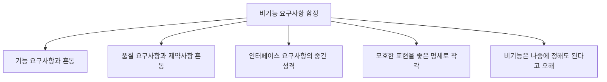

- 함정 1: `로그인 기능`과 `로그인 보안` 혼동
  - 로그인 기능 제공은 기능 요구사항이다.
  - 비밀번호 암호화, 로그인 실패 제한, 권한별 접근 통제는 보안 요구사항이다.

- 함정 2: `빠르다`라는 말만 보고 충분하다고 판단
  - `빠르다`는 비기능 요구사항의 방향은 맞지만 명세로는 부족하다.
  - `동시 사용자 500명 조건에서 95% 요청 2초 이내`처럼 측정 가능해야 한다.

- 함정 3: 제약사항을 품질 요구사항으로 착각
  - `월 99.9% 가용성`은 품질 요구사항이다.
  - `PostgreSQL을 사용해야 한다`는 제약사항이다.
  - 제약사항은 설계 선택지를 제한한다.

- 함정 4: 인터페이스 요구사항 분류 혼동
  - 인터페이스 요구사항은 기능 요구사항과 비기능 요구사항 양쪽 성격이 있을 수 있다.
  - 이 PDF 챕터에서는 주요 비기능 요구사항에 포함되므로 시험에서는 PDF 기준으로 암기한다.

- 함정 5: 비기능 요구사항은 구현 후 조정하면 된다고 오해
  - 성능, 보안, 가용성, 확장성은 아키텍처에 큰 영향을 준다.
  - 나중에 발견되면 설계 변경 비용이 커진다.

- 함정 6: 품질 요구사항과 ISO 품질 특성 목록 혼동
  - 이 챕터는 주요 비기능 요구사항 5개가 핵심이다.
  - ISO/IEC 9126 품질 특성은 별도 챕터에서 구체적으로 다룬다.
  - 여기서는 품질 요구사항의 예시로 연결해 이해한다.

---

## 16. 암기 포인트

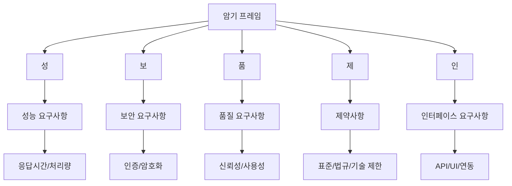

- 1차 암기:
  - `성-보-품-제-인`
  - 성능, 보안, 품질, 제약, 인터페이스

- 2차 암기:
  - 성능 = 얼마나 빠르고 많이 처리하는가
  - 보안 = 얼마나 안전하게 보호하는가
  - 품질 = 얼마나 안정적이고 사용하기 좋고 유지보수 가능한가
  - 제약 = 어떤 제한 조건을 반드시 지켜야 하는가
  - 인터페이스 = 사용자/외부 시스템/데이터/장비와 어떻게 연결되는가

- 3차 암기:
  - 기능 요구사항 = 무엇을 하는가
  - 비기능 요구사항 = 어떤 품질과 조건으로 하는가
  - 좋은 비기능 요구사항 = 측정 가능해야 한다

- 말로 풀어 외우기:
  - `비기능은 기능을 둘러싼 품질과 조건이다. 성능, 보안, 품질, 제약, 인터페이스를 본다.`

- 시험 직전 10초 복습:
  - `로그인한다` → 기능
  - `2초 이내 로그인` → 성능
  - `암호화 로그인` → 보안
  - `99.9% 가용성` → 품질
  - `특정 DBMS 사용` → 제약
  - `REST API JSON 연동` → 인터페이스

---

## 17. 빠른 복습

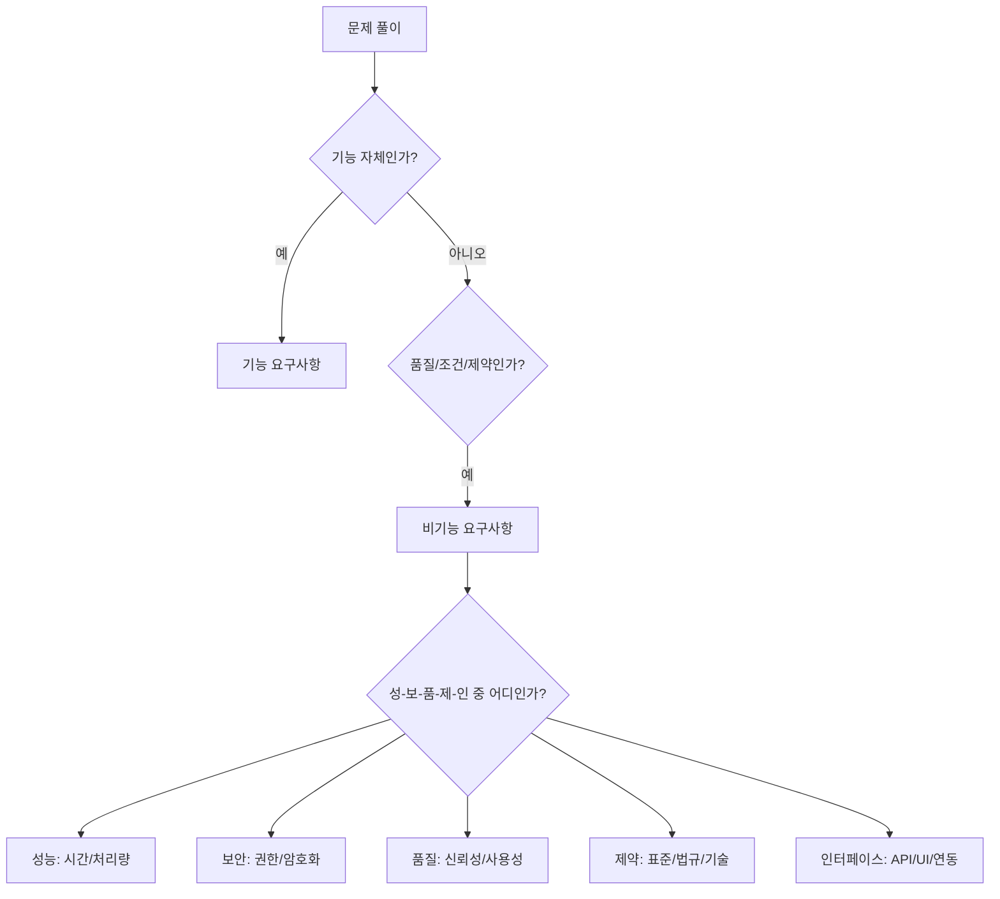

- 챕터명:
  - `007 주요 비기능 요구사항`

- 소속 영역:
  - `1과목 소프트웨어 설계`
  - `요구사항`

- 반드시 외울 목록:
  - `성능 요구사항`
  - `보안 요구사항`
  - `품질 요구사항`
  - `제약사항`
  - `인터페이스 요구사항`

- 가장 중요한 해석:
  - 비기능 요구사항은 기능 자체가 아니라 기능이 만족해야 하는 품질, 제약, 운영 조건을 정의한다.
  - 비기능 요구사항은 아키텍처와 테스트에 큰 영향을 주므로 초기에 명확히 해야 한다.
  - 모호한 비기능 요구사항은 검증하기 어려우므로 수치, 조건, 기준을 포함해야 한다.

- 자주 나오는 문제 유형:
  - 기능 요구사항과 비기능 요구사항을 구분하는 문제
  - 주요 비기능 요구사항 목록을 고르는 문제
  - 응답시간/암호화/가용성/특정 기술 사용/API 형식의 분류 문제
  - 모호한 요구사항을 측정 가능한 요구사항으로 바꾸는 문제
  - 품질 요구사항과 제약사항의 차이를 묻는 문제

- 최종 암기 문장:
  - `비기능 요구사항은 기능의 품질과 조건을 정의하며, 주요 항목은 성능, 보안, 품질, 제약사항, 인터페이스 요구사항이다.`

---

## 18. 참고 링크

- 기준 PDF: `/Users/nes0903/Documents/study/정보처리기사/핵심요약집_2026_정보처리기사필기핵심요약.pdf`
- [Q-Net 정보처리기사 종목 페이지](https://www.q-net.or.kr/crf005.do?id=crf00503s02&jmCd=1320&jmInfoDivCcd=B0)
- [IREB CPRE Glossary](https://cpre.ireb.org/en/downloads-and-resources/glossary)
- [ISO/IEC 25010:2023 - ISO 공식 페이지](https://www.iso.org/standard/78176.html)
- [ISO/IEC 25010 quality model summary](https://www.iso25000.com/index.php/en/iso-25000-standards/iso-25010/45-iso-iec-25010)

<!-- study-links:start -->
## 관련 문서

- `iec 9126의 품질 특성`: [[정보처리기사/1과목 소프트웨어 설계/024 ISO IEC 9126의 품질 특성/024 ISO IEC 9126의 품질 특성|024 ISO/IEC 9126의 품질 특성]]
- `요구사항 개발 프로세스`: [[정보처리기사/1과목 소프트웨어 설계/008 요구사항 개발 프로세스/008 요구사항 개발 프로세스|008 요구사항 개발 프로세스]]
- `요구사항 분석`: [[정보처리기사/1과목 소프트웨어 설계/009 요구사항 분석/009 요구사항 분석|009 요구사항 분석]]
- `트랜잭션`: [[ACID-트랜잭션/ACID-트랜잭션|ACID 트랜잭션 상세 정리]]
- `미들웨어`: [[정보처리기사/1과목 소프트웨어 설계/054 미들웨어(Middleware)/054 미들웨어(Middleware)|054 미들웨어(Middleware)]]
- `iec`: [[정보처리기사/5과목 정보시스템 구축 관리/242 ISO IEC 12207/242 ISO IEC 12207|242 ISO/IEC 12207]]
- `모듈화`: [[정보처리기사/1과목 소프트웨어 설계/026 모듈화/026 모듈화|026 모듈화]]
- `무결성`: [[정보처리기사/3과목 데이터베이스 구축/115 무결성/115 무결성|115 무결성]]
- `스택`: [[정보처리기사/2과목 소프트웨어 개발/057 스택(Stack)/057 스택(Stack)|057 스택(Stack)]]
- `해시`: [[정보처리기사/5과목 정보시스템 구축 관리/304 해시(Hash)/304 해시(Hash)|304 해시(Hash)]]
<!-- study-links:end -->
