# 008 요구사항 개발 프로세스

작성 기준일: 2026-05-02  
과목: `1과목 소프트웨어 설계`  
기준 PDF: `/Users/nes0903/Documents/study/정보처리기사/핵심요약집_2026_정보처리기사필기핵심요약.pdf`  
PDF 확인 위치: `1페이지`  
검색 보강: IREB CPRE 요구공학 용어집, IREB Requirements Elicitation, ISO/IEC/IEEE 29148:2018, IEEE 29148 표준 페이지, Q-Net 정보처리기사 시험 정보를 함께 확인하여 시험 중심으로 확장 정리

---

## 1. 한 줄 요약

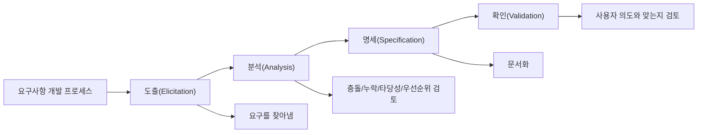

- 요구사항 개발 프로세스는 사용자의 막연한 요구를 `도출 → 분석 → 명세 → 확인` 절차로 정리해 개발과 검증의 기준으로 만드는 활동이다.
- PDF 기준 암기 순서는 `도-분-명-확`이다.
- 시험에서는 각 단계의 이름보다 `각 단계에서 무엇을 하는지`를 구분하는 문제가 더 자주 헷갈린다.
- 특히 `확인(Validation)`은 완성된 시스템 테스트만 의미하는 것이 아니라, 요구사항 명세가 이해관계자의 실제 필요와 맞는지 검토하는 활동이다.
- 요구사항 오류는 뒤 단계로 갈수록 수정 비용이 커지므로, 요구사항 개발 단계에서 충돌·누락·모호성을 조기에 잡는 것이 중요하다.

---

## 2. PDF 기준 핵심

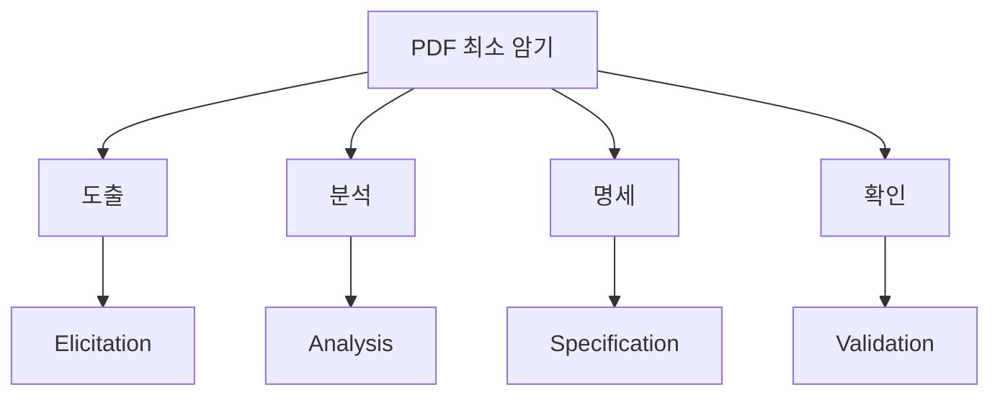

- PDF에 제시된 요구사항 개발 프로세스는 다음 4단계다.
  - `도출(Elicitation)`
  - `분석(Analysis)`
  - `명세(Specification)`
  - `확인(Validation)`

- 이 챕터의 최소 암기 목표:
  - 단계 순서
  - 각 단계의 목적
  - 각 단계의 대표 활동
  - 단계별 산출물
  - `요구사항 확인`과 `요구사항 검증 방법` 챕터의 연결

- 시험에서 가장 중요한 문장:
  - `도출`: 이해관계자와 자료에서 요구사항을 찾아낸다.
  - `분석`: 요구사항의 충돌, 누락, 모호성, 타당성, 우선순위를 검토한다.
  - `명세`: 요구사항을 개발자와 이해관계자가 이해할 수 있도록 문서화한다.
  - `확인`: 명세된 요구사항이 사용자의 실제 의도와 맞는지 검토한다.

---

## 3. 요구공학에서의 위치

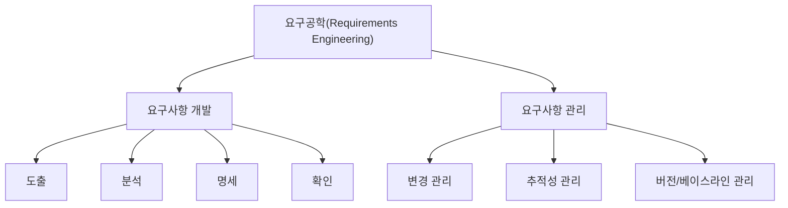

- 요구공학은 요구사항을 체계적으로 다루는 활동 전체를 말한다.
- IREB CPRE 용어집은 요구공학을 이해관계자의 요구와 필요를 이해하고, 요구사항을 명세하고 관리하여 실제 요구와 맞지 않는 시스템을 납품할 위험을 줄이는 체계적 접근으로 설명한다.
- 정보처리기사의 `요구사항 개발 프로세스`는 요구공학 중 `요구사항 개발`에 해당한다.

- 요구사항 개발:
  - 요구사항을 새로 찾고 정리하고 문서화하고 확인하는 활동이다.
  - PDF 기준 단계는 `도출 → 분석 → 명세 → 확인`이다.

- 요구사항 관리:
  - 이미 정리된 요구사항을 변경, 추적, 우선순위, 버전, 베이스라인 관점에서 관리하는 활동이다.
  - 개발 중 요구사항 변경이 발생하면 요구사항 관리가 중요해진다.

- 시험 포인트:
  - `개발 프로세스`는 요구를 만드는 흐름이다.
  - `관리`는 요구사항이 만들어진 뒤에도 변경과 추적성을 유지하는 흐름이다.
  - 실제 프로젝트에서는 개발과 관리가 반복적으로 얽히지만, 시험에서는 먼저 PDF 순서대로 외운다.

---

## 4. 전체 흐름과 산출물

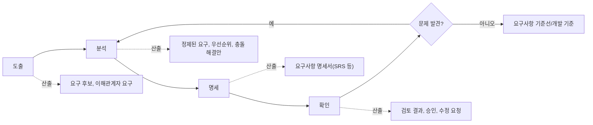

- 요구사항 개발 프로세스는 시험에서는 순차적으로 외우지만, 실제로는 반복된다.
- 확인 단계에서 누락이나 모호성이 발견되면 다시 분석 또는 도출 단계로 돌아갈 수 있다.
- 각 단계의 대표 산출물:

| 단계 | 핵심 활동 | 대표 산출물 |
|---|---|---|
| 도출 | 이해관계자 요구 수집 | 요구 후보, 인터뷰 기록, 회의록, 업무 규칙 |
| 분석 | 분류, 충돌 해결, 우선순위화, 타당성 검토 | 정제된 요구사항, 우선순위, 요구사항 모델 |
| 명세 | 요구사항 문서화 | 요구사항 명세서, 유스케이스 명세, 사용자 스토리 |
| 확인 | 요구사항 검토와 승인 | 검토 결과, 결함 목록, 승인된 요구사항 |

- ISO/IEC/IEEE 29148:2018은 요구사항을 만드는 공학 활동과 그 과정에서 생산되는 정보 항목 및 내용에 관한 지침을 제공하는 표준이다.
- IEEE 29148 표준 페이지도 이 표준이 좋은 요구사항의 구조, 요구사항 특성, 요구사항 프로세스의 반복적 적용을 다룬다고 설명한다.

---

## 5. 1단계: 도출(Elicitation)

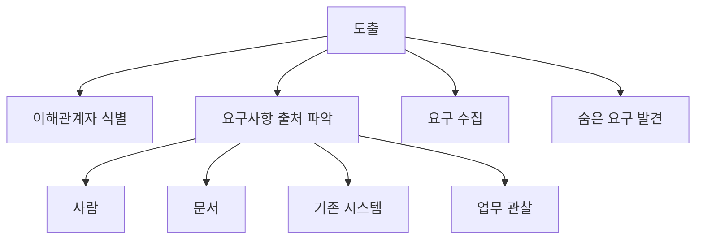

- 의미:
  - 도출은 이해관계자, 문서, 기존 시스템, 업무 환경 등에서 요구사항을 찾아내고 수집하는 활동이다.
  - IREB CPRE 용어집은 요구사항 도출을 사용 가능한 요구사항 출처에서 요구사항을 찾고, 포착하고, 통합하는 과정으로 설명한다.

- 대표 활동:
  - 이해관계자 식별
  - 사용자 인터뷰
  - 설문조사
  - 워크숍
  - 브레인스토밍
  - 업무 관찰
  - 기존 문서 분석
  - 기존 시스템 분석
  - 프로토타입 활용

- 요구사항 출처:
  - 고객
  - 최종 사용자
  - 운영자
  - 관리자
  - 개발자
  - 유지보수 담당자
  - 법규/표준 문서
  - 기존 시스템
  - 업무 매뉴얼
  - 장애/문의 기록

- 시험 단서:
  - `사용자 요구를 수집`
  - `이해관계자 인터뷰`
  - `설문`
  - `업무 관찰`
  - `요구사항을 찾아냄`
  - `잠재 요구 발굴`

- 오답 함정:
  - 도출은 요구사항을 문서로 정리하는 명세 단계가 아니다.
  - 도출은 요구사항의 충돌을 해결하는 분석 단계가 아니다.
  - 도출은 요구사항이 사용자 의도와 맞는지 승인받는 확인 단계가 아니다.

---

## 6. 도출 기법 정리

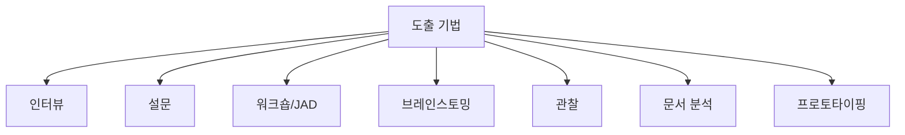

- 인터뷰:
  - 이해관계자와 직접 대화해 요구와 문제를 파악한다.
  - 깊이 있는 요구를 찾기 좋다.
  - 인터뷰어 역량에 따라 결과 품질이 달라질 수 있다.

- 설문:
  - 다수 사용자에게 표준화된 질문을 배포해 의견을 수집한다.
  - 넓은 범위의 데이터를 빠르게 모을 수 있다.
  - 깊은 맥락을 파악하기는 어렵다.

- 워크숍/JAD:
  - 여러 이해관계자가 모여 요구를 논의하고 합의한다.
  - 충돌 요구를 빠르게 드러내고 조정하기 좋다.
  - 참여자 구성과 진행자의 역량이 중요하다.

- 브레인스토밍:
  - 짧은 시간에 다양한 아이디어와 요구 후보를 만든다.
  - 초기 탐색에 좋다.
  - 이후 분석 단계에서 정제와 우선순위화가 필요하다.

- 관찰:
  - 사용자의 실제 업무 수행을 보고 숨은 요구를 찾는다.
  - 사용자가 말로 설명하지 못하는 암묵지 파악에 유리하다.
  - 관찰자의 해석 오류를 주의해야 한다.

- 문서 분석:
  - 업무 매뉴얼, 규정, 계약서, 기존 명세서, 장애 기록 등을 분석한다.
  - 법규/정책/업무 규칙을 찾는 데 유리하다.
  - 오래된 문서와 실제 업무가 다를 수 있다.

- 프로토타이핑:
  - 화면이나 기능의 시제품을 보여주며 요구를 구체화한다.
  - 사용자가 요구를 눈으로 확인하고 피드백하기 쉽다.
  - 프로토타입을 완성품으로 오해하지 않게 해야 한다.

---

## 7. 2단계: 분석(Analysis)

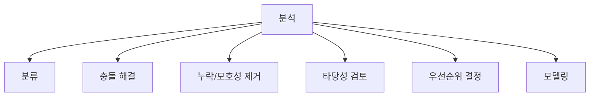

- 의미:
  - 분석은 도출된 요구사항을 이해하고 정리하며, 서로 충돌하거나 빠진 부분, 모호한 부분, 비현실적인 부분을 검토하는 활동이다.
  - IREB CPRE 용어집은 요구사항 분석을 도출된 요구사항을 이해하고 문서화하기 위해 분석하는 활동으로 설명한다.

- 대표 활동:
  - 기능 요구사항과 비기능 요구사항 분류
  - 요구사항 충돌 분석
  - 이해관계자 간 요구 조정
  - 중복 요구 제거
  - 누락 요구 식별
  - 모호한 표현 구체화
  - 비용과 일정 타당성 검토
  - 기술 실현 가능성 검토
  - 요구사항 우선순위화
  - DFD, UML, 유스케이스 등 모델링

- 분석 기준:
  - 요구사항이 서로 모순되지 않는가
  - 필요한 요구가 빠지지 않았는가
  - 이해관계자가 같은 의미로 이해할 수 있는가
  - 비용과 일정 안에서 구현 가능한가
  - 비즈니스 가치가 높은가
  - 상위 목표와 연결되는가
  - 테스트 가능한 형태인가

- 시험 단서:
  - `충돌 해결`
  - `우선순위 부여`
  - `타당성 조사`
  - `비용과 일정 검토`
  - `모호성 제거`
  - `요구사항 정제`
  - `기능/비기능 분류`

- 오답 함정:
  - 분석은 요구를 처음 찾아내는 도출과 다르다.
  - 분석은 최종 문서로 만드는 명세와 다르다.
  - 분석은 사용자 승인 중심의 확인과 다르다.

---

## 8. 분석에서 보는 요구사항 품질 기준

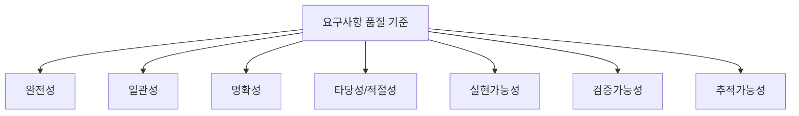

- 완전성:
  - 필요한 요구사항이 빠지지 않았는지 본다.
  - IREB 용어집도 요구사항 명세가 알려진 관련 요구사항을 모두 포함하는 정도를 완전성 관점으로 설명한다.

- 일관성:
  - 요구사항끼리 서로 모순되지 않는지 본다.
  - 예: `비밀번호는 4자리 숫자`와 `비밀번호는 12자 이상 영문/숫자/특수문자`가 동시에 있으면 충돌 가능성이 있다.

- 명확성:
  - 읽는 사람이 같은 의미로 이해할 수 있는지 본다.
  - `빠르게`, `쉽게`, `적절히`, `충분히` 같은 표현은 명확성이 낮다.

- 타당성/적절성:
  - 요구사항이 이해관계자의 실제 필요를 제대로 반영하는지 본다.
  - IREB 용어집은 적절성을 요구사항이 이해관계자의 실제로 합의된 욕구와 필요를 표현하는 정도로 설명한다.

- 실현가능성:
  - 주어진 기술, 일정, 비용, 인력, 제약 안에서 구현 가능한지 본다.

- 검증가능성:
  - 요구사항이 테스트나 리뷰 등으로 확인 가능한지 본다.
  - `시스템은 사용하기 좋아야 한다`는 검증하기 어렵고, `신규 사용자가 10분 이내 주문 조회를 완료할 수 있어야 한다`는 검증하기 쉽다.

- 추적가능성:
  - 요구사항이 출처, 설계, 구현, 테스트와 연결되는지 본다.
  - 변경 영향 분석과 누락 방지에 중요하다.

- 시험 포인트:
  - 분석 단계는 요구사항 품질을 높이는 단계다.
  - 단순히 문서 작성만 하는 단계가 아니다.
  - 충돌, 모호성, 누락, 타당성, 우선순위가 나오면 분석을 떠올린다.

---

## 9. 3단계: 명세(Specification)

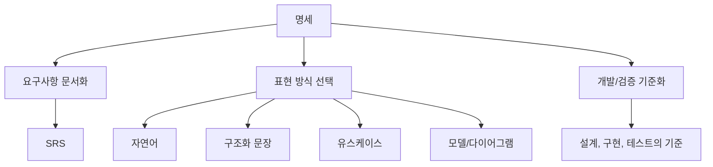

- 의미:
  - 명세는 분석된 요구사항을 체계적으로 문서화해 이해관계자, 개발자, 테스터가 공통 기준으로 사용할 수 있게 만드는 활동이다.
  - IREB CPRE 용어집은 요구사항 명세를 일정 기준을 만족하는 요구사항의 체계적 표현 모음으로 설명한다.

- 대표 산출물:
  - 요구사항 명세서
  - SRS(Software Requirements Specification)
  - 유스케이스 명세
  - 사용자 스토리
  - 요구사항 목록
  - 요구사항 모델
  - 화면 정의서
  - 인터페이스 명세서

- 명세 방식:
  - 자연어 문장
  - 구조화된 요구사항 문장
  - 표 형식
  - 유스케이스
  - 사용자 스토리
  - UML 다이어그램
  - DFD
  - 상태 전이도
  - 의사결정표

- 좋은 명세 문장의 특징:
  - 하나의 요구사항은 하나의 의미를 가진다.
  - 주어와 대상이 명확하다.
  - 조건과 예외가 명확하다.
  - 측정 가능한 기준이 있다.
  - 검증 방법을 떠올릴 수 있다.
  - 모호한 형용사를 피한다.

- 시험 단서:
  - `문서화`
  - `요구사항 명세서`
  - `SRS`
  - `개발과 검증의 기준`
  - `체계적으로 표현`
  - `요구사항을 기록`

- 오답 함정:
  - 명세는 요구사항을 처음 수집하는 활동이 아니다.
  - 명세는 충돌을 해결하는 분석 활동과 구분된다.
  - 명세는 문서를 만든 뒤 끝나는 것이 아니라 이후 확인을 거쳐야 한다.

---

## 10. 명세 문장 작성 예시

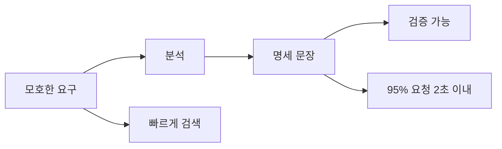

- 명세는 단순히 예쁘게 문서를 쓰는 일이 아니다.
- 검증 가능한 요구사항으로 바꾸는 것이 핵심이다.

| 나쁜 요구사항 | 개선된 명세 |
|---|---|
| 시스템은 빨라야 한다 | 상품 검색은 동시 사용자 500명 조건에서 95% 요청을 2초 이내에 응답해야 한다 |
| 사용자가 편하게 로그인해야 한다 | 사용자는 이메일과 비밀번호를 입력해 로그인할 수 있어야 하며, 로그인 실패 시 실패 사유를 화면에 표시해야 한다 |
| 보안이 좋아야 한다 | 개인정보 조회 API는 인증된 사용자만 접근 가능하며 모든 접근 기록을 감사 로그로 저장해야 한다 |
| 결제 내역을 잘 보여준다 | 사용자는 최근 1년간의 결제 내역을 결제일 역순으로 조회할 수 있어야 한다 |
| 외부 시스템과 연동한다 | 정산 시스템 연동은 HTTPS 기반 REST API로 수행하며 요청/응답 본문은 JSON 형식을 사용해야 한다 |

- 구조화 문장 예시:
  - `시스템은 [조건]에서 [주체]가 [기능/행위]를 [기준]에 따라 수행할 수 있도록 해야 한다.`
  - `시스템은 [이벤트] 발생 시 [대상]에게 [응답]을 [시간/방식] 내에 제공해야 한다.`
  - `시스템은 [데이터]를 [보안/품질/형식 기준]에 따라 처리해야 한다.`

- 시험 포인트:
  - 명세 단계는 요구사항을 문서화하는 단계다.
  - 좋은 명세는 명확하고 검증 가능해야 한다.
  - 명세는 설계, 구현, 테스트의 기준이 된다.

---

## 11. 4단계: 확인(Validation)

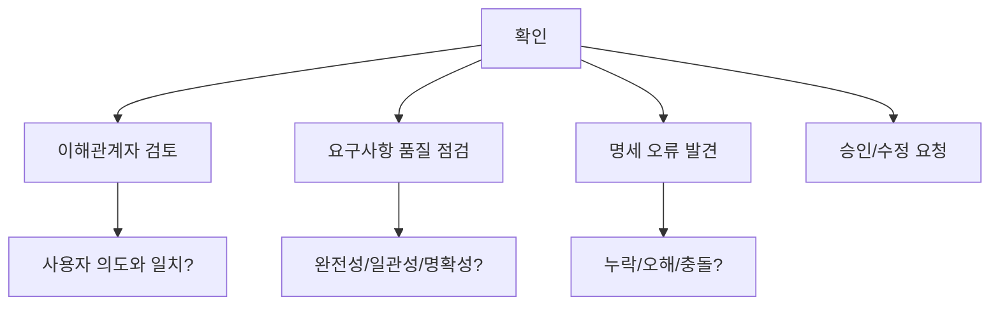

- 의미:
  - 확인은 명세된 요구사항이 이해관계자의 실제 필요와 맞는지 검토하는 활동이다.
  - IREB CPRE 용어집은 Validation을 산출물이나 시스템이 이해관계자의 필요와 맞는지 확인하는 과정으로 설명하며, 요구공학에서는 문서화된 요구사항이 이해관계자의 필요와 맞는지 확인하는 것이라고 설명한다.

- 확인에서 보는 것:
  - 사용자 요구와 일치하는가
  - 요구사항이 완전한가
  - 요구사항끼리 모순이 없는가
  - 요구사항이 모호하지 않은가
  - 요구사항이 구현 가능한가
  - 요구사항이 검증 가능한가
  - 이해관계자가 동의했는가

- 대표 방법:
  - 동료검토(Peer Review)
  - 워크스루(Walk Through)
  - 인스펙션(Inspection)
  - 프로토타입 검토
  - 요구사항 리뷰 회의
  - 체크리스트 기반 검토
  - 인수 기준 검토

- 시험 단서:
  - `사용자 요구와 일치하는지 검토`
  - `명세서 내용 검토`
  - `요구사항 오류 발견`
  - `이해관계자 승인`
  - `검토, 워크스루, 인스펙션`

- 오답 함정:
  - 확인은 구현된 프로그램의 단위 테스트만 의미하지 않는다.
  - 확인은 요구사항 명세가 맞는지 보는 활동이다.
  - 다음 챕터의 `요구사항 검증 방법`과 연결되지만, 이 챕터에서는 프로세스 단계 중 `확인`을 묻는다는 점을 구분해야 한다.

---

## 12. Verification과 Validation 구분

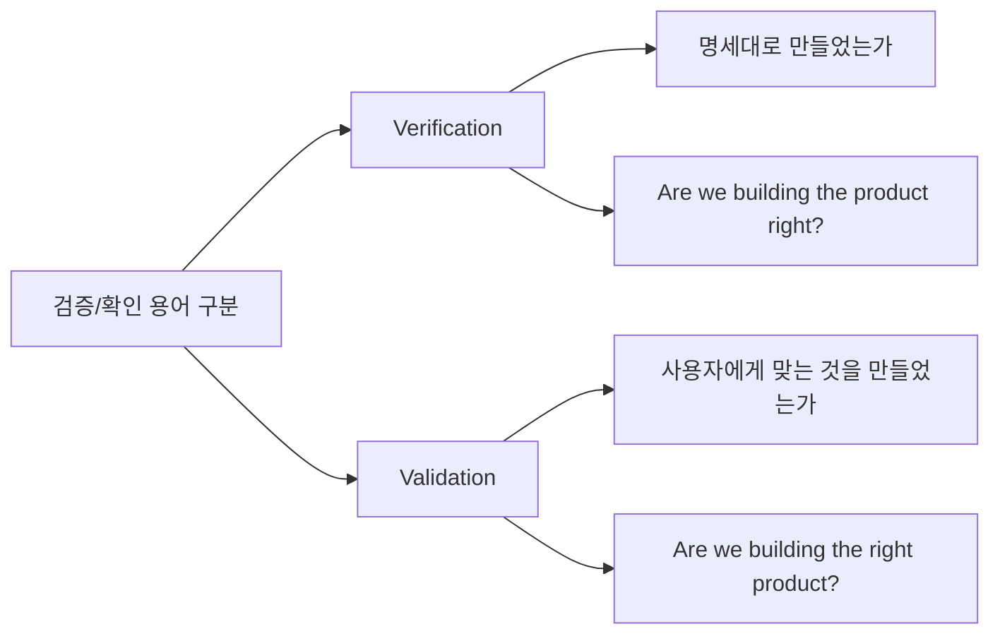

- 정보처리기사 PDF의 `확인(Validation)`은 요구사항 개발 프로세스의 마지막 단계다.
- 소프트웨어 공학에서 흔히 다음처럼 구분한다.
  - Verification: 명세와 일치하는지 확인
  - Validation: 이해관계자의 실제 필요와 맞는지 확인

- 요구사항 개발 프로세스에서의 확인:
  - 요구사항 명세가 사용자 의도와 맞는지 본다.
  - 올바른 요구사항을 명세했는지 본다.
  - 이해관계자가 동의할 수 있는지 본다.

- 시험에서 안전하게 푸는 기준:
  - `사용자 요구와 맞는가` → 확인(Validation)
  - `문서에 오류가 없는가` → 확인 활동에 포함 가능
  - `요구사항을 문서로 작성` → 명세
  - `요구사항을 수집` → 도출
  - `요구사항 충돌 해결` → 분석

- 주의:
  - 한국어 교재에서는 `검증`, `확인`, `검토` 표현이 섞여 쓰일 수 있다.
  - 이 챕터에서는 PDF의 영문 표기인 `Validation`을 기준으로 `확인`으로 외운다.

---

## 13. 단계별 비교표

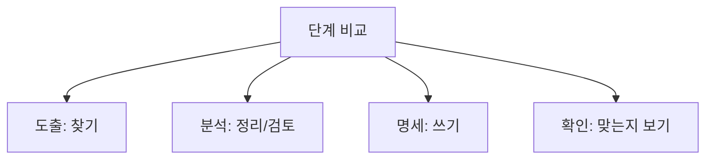

| 구분 | 도출 | 분석 | 명세 | 확인 |
|---|---|---|---|---|
| 핵심 동사 | 찾아낸다 | 정리하고 검토한다 | 문서화한다 | 맞는지 확인한다 |
| 입력 | 이해관계자, 문서, 기존 시스템 | 도출된 요구사항 | 분석된 요구사항 | 요구사항 명세 |
| 주요 활동 | 인터뷰, 설문, 관찰, 워크숍 | 충돌 해결, 우선순위, 타당성 검토 | SRS 작성, 모델 작성 | 리뷰, 워크스루, 인스펙션 |
| 산출물 | 요구 후보 | 정제된 요구사항 | 요구사항 명세서 | 승인/수정 요청/결함 목록 |
| 시험 단서 | 수집, 발굴, 인터뷰 | 충돌, 누락, 우선순위 | 문서화, 명세서 | 사용자 요구와 일치, 검토 |

- 한 줄 구분:
  - 도출 = 요구를 `꺼내는` 단계
  - 분석 = 요구를 `다듬는` 단계
  - 명세 = 요구를 `적는` 단계
  - 확인 = 요구가 `맞는지 보는` 단계

- 가장 많이 틀리는 부분:
  - `분석`과 `확인`을 혼동한다.
  - `명세`와 `확인`을 혼동한다.
  - `도출`을 단순 문서화로 오해한다.

---

## 14. 요구사항 개발과 요구사항 관리 비교

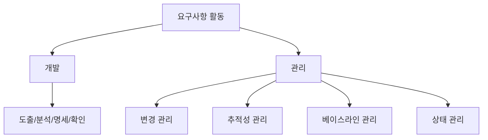

- 요구사항 개발:
  - 요구사항을 만들어내는 활동이다.
  - 주요 키워드는 `도출`, `분석`, `명세`, `확인`이다.

- 요구사항 관리:
  - 요구사항을 통제하고 추적하는 활동이다.
  - 주요 키워드는 `변경`, `추적성`, `베이스라인`, `버전`, `상태`, `영향 분석`이다.

- IREB CPRE 용어집은 요구사항 관리를 기존 요구사항과 관련 산출물을 저장, 변경, 추적하는 활동으로 설명한다.

- 비교:

| 구분 | 요구사항 개발 | 요구사항 관리 |
|---|---|---|
| 목적 | 요구사항을 만들고 확정 | 요구사항을 변경/추적/통제 |
| 대표 단계 | 도출, 분석, 명세, 확인 | 변경 관리, 추적성 관리, 베이스라인 관리 |
| 주요 산출물 | 요구사항 명세서 | 변경 이력, 추적성 매트릭스, 기준선 |
| 시험 단서 | 요구를 찾아 문서화하고 확인 | 변경 요청, 영향 분석, 버전 관리 |

- 시험 포인트:
  - `도-분-명-확`은 개발 프로세스다.
  - `변경 관리`, `추적성`은 관리 활동 쪽 단서다.

---

## 15. 폭포수와 애자일에서의 요구사항 개발

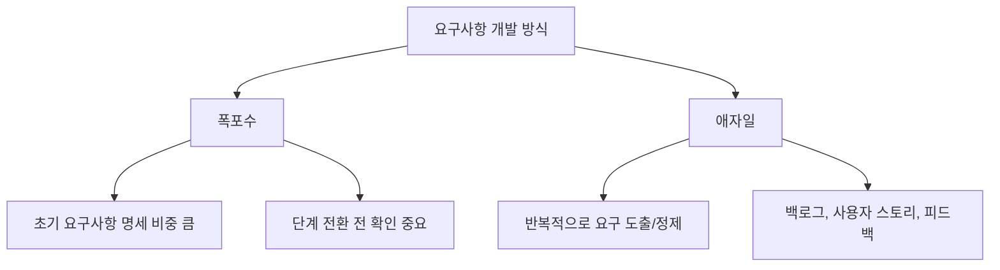

- 폭포수 관점:
  - 초기 요구사항 분석과 명세가 매우 중요하다.
  - 요구사항을 명확히 정리한 뒤 설계와 구현으로 넘어가는 경향이 강하다.
  - 요구사항 오류가 뒤늦게 발견되면 수정 비용이 커질 수 있다.

- 애자일 관점:
  - 요구사항을 한 번에 모두 확정하기보다 반복적으로 도출하고 정제한다.
  - 사용자 스토리, 제품 백로그, 스프린트 계획 등을 통해 요구사항을 다룬다.
  - 고객 피드백을 통해 요구사항을 계속 조정한다.

- 공통점:
  - 어떤 개발 모형이든 요구사항을 이해하고 문서화하고 확인하는 활동은 필요하다.
  - 애자일이라고 요구사항 개발을 생략하지 않는다.
  - 폭포수라고 사용자의 피드백이 불필요한 것은 아니다.

- 시험 포인트:
  - 정보처리기사의 요구사항 개발 프로세스는 일반적인 단계 순서를 묻는 경우가 많다.
  - 애자일과 연결되면 `반복`, `백로그`, `사용자 스토리`, `고객 피드백` 단서가 나온다.
  - 폭포수와 연결되면 `초기 명세`, `단계적 진행`, `변경 비용` 단서가 나온다.

---

## 16. 요구사항 오류가 위험한 이유

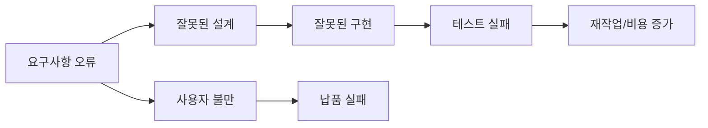

- 요구사항은 설계, 구현, 테스트의 출발점이다.
- 요구사항이 틀리면 이후 단계가 모두 틀린 방향으로 진행될 수 있다.
- 요구사항 오류의 예:
  - 중요한 기능 누락
  - 서로 충돌하는 요구
  - 모호한 표현
  - 잘못된 이해관계자 요구 반영
  - 비현실적인 성능 기준
  - 보안/법규 요구 누락

- 오류가 뒤늦게 발견되면:
  - 설계 변경이 필요하다.
  - 구현 코드를 다시 작성해야 한다.
  - 테스트 케이스를 수정해야 한다.
  - 일정과 비용이 증가한다.
  - 고객과의 신뢰가 낮아진다.

- 시험 포인트:
  - 요구사항 개발 프로세스는 단순 문서 절차가 아니라 오류 비용을 줄이는 활동이다.
  - 확인 단계에서 명세 오류를 조기에 발견하는 것이 중요하다.
  - 요구사항 분석 단계에서 충돌과 누락을 잡는 것이 중요하다.

---

## 17. 시험에서 보는 단서어

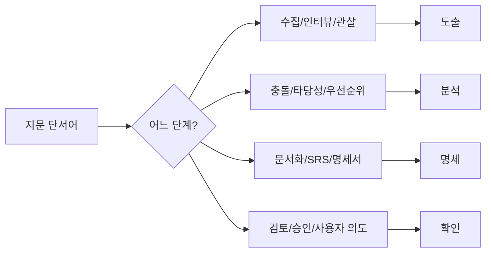

- 단서어별 빠른 매칭:

| 지문 단서어 | 연결 단계 |
|---|---|
| 인터뷰, 설문, 관찰, 워크숍, 요구 수집, 요구 발굴 | 도출 |
| 충돌, 중복, 누락, 우선순위, 타당성, 비용/일정 검토 | 분석 |
| 문서화, SRS, 요구사항 명세서, 유스케이스 명세 | 명세 |
| 검토, 승인, Validation, 사용자 요구와 일치, 워크스루, 인스펙션 | 확인 |

- 보기 판별 예시:

| 보기 | 판단 | 이유 |
|---|---|---|
| 요구사항 개발 프로세스는 도출, 분석, 명세, 확인 순서로 진행된다 | O | PDF 핵심 |
| 도출은 이해관계자로부터 요구사항을 찾아내는 활동이다 | O | 도출 정의 |
| 분석은 요구사항을 문서화해 명세서를 작성하는 활동이다 | X | 문서화는 명세 |
| 명세는 요구사항의 충돌과 우선순위를 조정하는 활동이다 | X | 충돌/우선순위는 분석 |
| 확인은 명세된 요구사항이 사용자 요구와 맞는지 검토하는 활동이다 | O | 확인 정의 |
| 확인은 구현 완료 후 단위 테스트만 수행하는 단계다 | X | 요구사항 명세 확인이 핵심 |

- 문제 풀이 순서:
  1. 지문이 `수집`, `정리`, `문서화`, `검토` 중 무엇에 가까운지 본다.
  2. `도-분-명-확` 순서에 맞춰 위치를 잡는다.
  3. 용어가 헷갈리면 산출물을 본다.
  4. 산출물이 `요구사항 명세서`면 명세, 산출물이 `검토 결과/승인`이면 확인이다.

---

## 18. 자주 나오는 함정

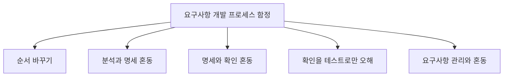

- 함정 1: 순서 바꾸기
  - 정답 순서는 `도출 → 분석 → 명세 → 확인`이다.
  - `도출 → 명세 → 분석 → 확인`처럼 분석과 명세를 바꾸는 보기를 조심한다.

- 함정 2: 분석과 명세 혼동
  - 분석은 충돌, 누락, 우선순위, 타당성을 검토한다.
  - 명세는 분석된 요구사항을 문서화한다.

- 함정 3: 명세와 확인 혼동
  - 명세는 요구사항을 적는 활동이다.
  - 확인은 적힌 요구사항이 맞는지 검토하는 활동이다.

- 함정 4: 확인을 구현 테스트로만 오해
  - 확인은 요구사항 명세가 이해관계자의 실제 요구와 맞는지 보는 활동이다.
  - 구현된 시스템 테스트와 연결될 수 있지만, 이 챕터의 핵심은 요구사항 명세 확인이다.

- 함정 5: 요구사항 개발과 요구사항 관리 혼동
  - 개발은 요구사항을 도출/분석/명세/확인하는 활동이다.
  - 관리는 변경, 추적성, 버전, 베이스라인을 다루는 활동이다.

- 함정 6: 도출을 단순 회의로만 생각
  - 도출은 인터뷰뿐 아니라 문서 분석, 관찰, 프로토타입, 기존 시스템 분석 등을 포함한다.

- 함정 7: 명세서를 작성하면 요구사항 개발이 끝난다고 생각
  - 명세 뒤에는 확인이 필요하다.
  - 확인에서 문제를 찾으면 다시 분석 또는 도출로 돌아갈 수 있다.

---

## 19. 암기 포인트

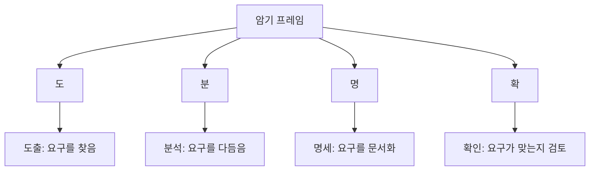

- 1차 암기:
  - `도-분-명-확`
  - 도출, 분석, 명세, 확인

- 2차 암기:
  - 도출 = 요구사항을 `찾는다`
  - 분석 = 요구사항을 `다듬는다`
  - 명세 = 요구사항을 `문서화한다`
  - 확인 = 요구사항이 `맞는지 검토한다`

- 3차 암기:
  - 도출 기법 = 인터뷰, 설문, 관찰, 워크숍, 브레인스토밍, 문서 분석, 프로토타입
  - 분석 기준 = 충돌, 누락, 모호성, 타당성, 우선순위, 실현가능성
  - 명세 산출물 = 요구사항 명세서, SRS, 유스케이스 명세
  - 확인 방법 = 리뷰, 워크스루, 인스펙션, 프로토타입 검토

- 말로 풀어 외우기:
  - `요구를 찾고, 다듬고, 적고, 맞는지 본다.`

- 시험 직전 10초 복습:
  - 수집/인터뷰 → 도출
  - 충돌/우선순위 → 분석
  - 문서화/SRS → 명세
  - 검토/승인/Validation → 확인

---

## 20. 빠른 복습

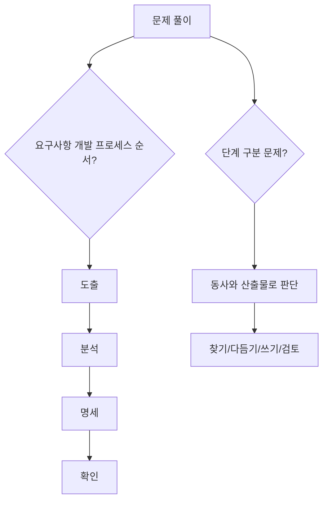

- 챕터명:
  - `008 요구사항 개발 프로세스`

- 소속 영역:
  - `1과목 소프트웨어 설계`
  - `요구사항`

- 반드시 외울 목록:
  - `도출(Elicitation)`
  - `분석(Analysis)`
  - `명세(Specification)`
  - `확인(Validation)`

- 가장 중요한 해석:
  - 요구사항 개발 프로세스는 요구사항을 찾아내고, 정제하고, 문서화하고, 사용자 요구와 맞는지 확인하는 절차다.
  - 요구사항 명세서는 개발과 테스트의 기준이 되므로 명확하고 검증 가능해야 한다.
  - 확인 단계는 요구사항이 사용자의 실제 의도와 맞는지 조기에 검토하는 활동이다.

- 자주 나오는 문제 유형:
  - 프로세스 순서를 묻는 문제
  - 각 단계의 설명을 주고 단계명을 고르는 문제
  - 도출 기법을 묻는 문제
  - 분석 단계의 충돌/우선순위/타당성 검토를 묻는 문제
  - 명세와 확인을 구분하는 문제
  - 요구사항 개발과 요구사항 관리를 구분하는 문제

- 최종 암기 문장:
  - `요구사항 개발 프로세스는 도출, 분석, 명세, 확인 순서로 진행되며, 요구사항을 개발 가능한 기준으로 만드는 활동이다.`

---

## 21. 참고 링크

- 기준 PDF: `/Users/nes0903/Documents/study/정보처리기사/핵심요약집_2026_정보처리기사필기핵심요약.pdf`
- [Q-Net 정보처리기사 종목 페이지](https://www.q-net.or.kr/crf005.do?id=crf00503s02&jmCd=1320&jmInfoDivCcd=B0)
- [IREB CPRE Glossary](https://cpre.ireb.org/en/downloads-and-resources/glossary)
- [IREB CPRE Requirements Elicitation](https://cpre.ireb.org/en/concept/requirements-elicitation)
- [ISO/IEC/IEEE 29148:2018 - ISO 공식 페이지](https://www.iso.org/standard/72089.html)
- [IEEE/ISO/IEC 29148-2018 - IEEE SA](https://standards.ieee.org/ieee/29148/6937/)
