# 009 요구사항 분석

작성 기준일: 2026-05-02  
과목: `1과목 소프트웨어 설계`  
기준 PDF: `/Users/nes0903/Documents/study/정보처리기사/핵심요약집_2026_정보처리기사필기핵심요약.pdf`  
PDF 확인 위치: `2페이지`  
검색 보강: IREB CPRE 요구공학 용어집, ISO/IEC/IEEE 29148:2018, IEEE 29148 표준 페이지, IBM DFD 설명, Q-Net 정보처리기사 시험 정보를 함께 확인하여 시험 중심으로 확장 정리

---

## 1. 한 줄 요약

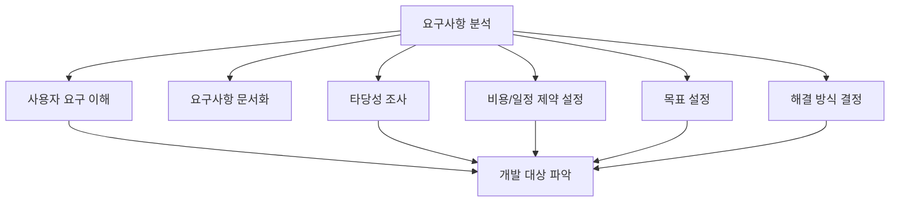

- 요구사항 분석은 개발 대상에 대한 사용자의 요구사항을 이해하고 문서화하며, 요구의 타당성·비용·일정·제약·목표·해결 방식을 정리하는 활동이다.
- PDF는 요구사항 분석을 `소프트웨어 개발의 실제적인 첫 단계`라고 설명한다.
- 요구사항 개발 프로세스의 큰 흐름에서는 `도출 → 분석 → 명세 → 확인` 중 두 번째 단계지만, 개발 대상의 문제와 목표를 실질적으로 구조화한다는 점에서 실제 개발의 출발점으로 본다.
- 시험에서는 `타당성 조사`, `비용과 일정 제약`, `목표 설정`, `해결 방식 결정`, `사용자 요구 이해와 문서화`가 핵심 단서다.
- 암기 문장은 `이해하고, 문서화하고, 타당성을 보고, 제약을 잡고, 목표와 해결 방식을 정한다`로 잡으면 된다.

---

## 2. PDF 기준 핵심

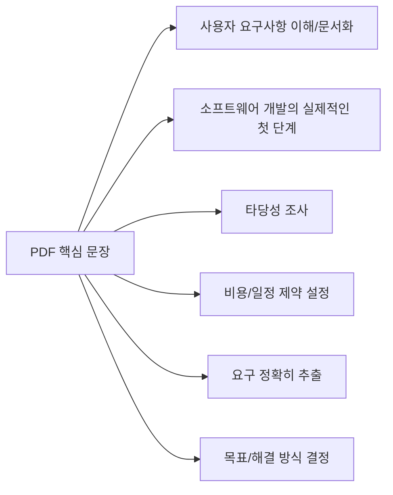

- PDF에 제시된 요구사항 분석의 핵심은 다음과 같다.
  - 개발 대상에 대한 사용자의 요구사항을 이해하고 문서화하는 활동이다.
  - 소프트웨어 개발의 실제적인 첫 단계이다.
  - 사용자 요구의 타당성을 조사하고 비용과 일정에 대한 제약을 설정한다.
  - 요구를 정확하게 추출하여 목표를 정하고 해결 방식을 결정한다.

- 최소 암기 골격:
  - `이해`
  - `문서화`
  - `실제적인 첫 단계`
  - `타당성 조사`
  - `비용/일정 제약`
  - `목표 설정`
  - `해결 방식 결정`

- 시험에서 자주 바뀌는 표현:

| PDF 표현 | 같은 의미의 보기 표현 |
|---|---|
| 사용자의 요구사항을 이해 | 사용자 요구 파악, 업무 요구 이해, 문제 영역 이해 |
| 문서화 | 요구사항을 정리하여 기록, 분석 결과를 문서로 표현 |
| 타당성 조사 | 실현 가능성 검토, 요구의 적절성 판단 |
| 비용과 일정 제약 설정 | 예산/기간/자원 제한 조건 파악 |
| 목표 설정 | 개발 목표, 시스템 목표, 문제 해결 목표 정의 |
| 해결 방식 결정 | 가능한 해결 대안 검토, 시스템화 방향 결정 |

---

## 3. 요구사항 개발 프로세스에서의 위치

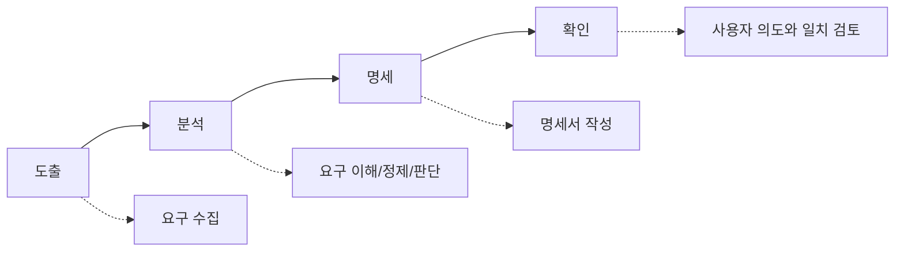

- 요구사항 개발 프로세스에서 분석은 도출된 요구사항을 정리하고 판단하는 단계다.
- 도출이 `요구를 찾아내는 활동`이라면, 분석은 `찾아낸 요구가 무엇을 뜻하는지 이해하고 실제 개발 기준으로 다듬는 활동`이다.
- 명세가 `요구사항을 체계적으로 문서화하는 활동`이라면, 분석은 명세 전에 요구사항의 의미·범위·충돌·타당성·우선순위를 정리하는 활동이다.
- 확인이 `명세된 요구사항이 사용자 의도와 맞는지 검토하는 활동`이라면, 분석은 확인 전에 요구사항 자체의 품질을 높이는 활동이다.

- IREB CPRE 용어집은 요구사항 분석을 도출된 요구사항을 이해하고 문서화하기 위해 분석하는 활동으로 설명한다.
- 같은 용어가 넓은 의미로는 요구공학 전체의 동의어처럼 쓰이기도 하지만, 정보처리기사에서는 PDF 문맥에 맞춰 `요구사항 개발 프로세스 안의 분석 단계`로 외우는 것이 안전하다.

- 시험 포인트:
  - 순서 문제에서는 `도출 → 분석 → 명세 → 확인`.
  - 정의 문제에서는 `사용자 요구 이해`, `문서화`, `타당성 조사`, `비용/일정 제약`.
  - 비교 문제에서는 도출, 명세, 확인과의 차이를 봐야 한다.

---

## 4. 요구사항 분석의 목적

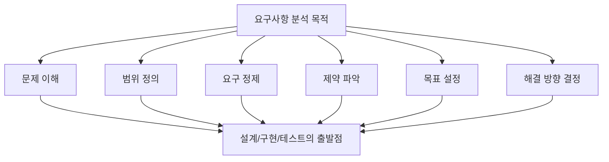

- 요구사항 분석의 목적은 단순히 사용자 말을 받아 적는 것이 아니다.
- 목적은 사용자의 요구를 개발 가능한 기준으로 바꾸는 것이다.

- 주요 목적:
  - 개발 대상 시스템의 문제와 업무 맥락을 이해한다.
  - 시스템 범위와 경계를 정한다.
  - 요구사항의 의미를 명확히 한다.
  - 요구사항 간 충돌을 발견한다.
  - 누락되거나 중복된 요구사항을 찾는다.
  - 요구사항의 타당성과 실현 가능성을 검토한다.
  - 비용과 일정의 제약을 파악한다.
  - 개발 목표와 우선순위를 정한다.
  - 가능한 해결 방식을 비교한다.
  - 명세와 설계의 기준을 만든다.

- 요구사항 분석이 실패하면:
  - 엉뚱한 기능을 개발할 수 있다.
  - 중요한 요구가 누락될 수 있다.
  - 범위가 계속 늘어날 수 있다.
  - 일정과 비용 산정이 틀어질 수 있다.
  - 설계와 테스트 기준이 흔들릴 수 있다.

- 시험 포인트:
  - `요구사항 분석 = 사용자의 요구를 개발 가능한 요구사항으로 정제하는 활동`
  - `요구사항 분석 = 문제 영역과 해결 영역을 연결하는 활동`

---

## 5. 사용자 요구 이해와 문서화

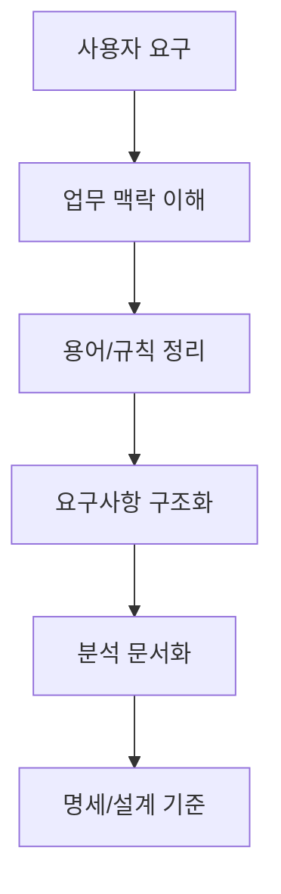

- 사용자의 요구는 처음부터 명확한 요구사항 형태로 주어지지 않는 경우가 많다.
- 사용자는 자신의 업무 언어로 말하고, 개발자는 이를 시스템 언어로 바꾸어 이해해야 한다.

- 분석에서 이해해야 하는 것:
  - 사용자가 현재 어떤 문제를 겪는가
  - 어떤 업무 절차가 있는가
  - 어떤 데이터가 생성되고 이동하는가
  - 누가 시스템을 사용하는가
  - 어떤 외부 시스템과 연결되는가
  - 어떤 법규와 정책을 지켜야 하는가
  - 어떤 품질 요구가 필요한가
  - 어떤 기능이 핵심이고 어떤 기능이 부가적인가

- 문서화의 의미:
  - 분석 결과를 머릿속에만 두지 않고 공유 가능한 형태로 남긴다.
  - 요구사항 목록, 업무 규칙, 제약, 모델, 용어 정의, 우선순위 등을 기록한다.
  - 이후 명세 단계에서 요구사항 명세서의 기초가 된다.

- 시험 주의:
  - `문서화`라는 단어가 있다고 해서 무조건 명세 단계만 의미하는 것은 아니다.
  - PDF는 요구사항 분석도 사용자의 요구를 이해하고 문서화하는 활동이라고 설명한다.
  - 다만 `요구사항 명세서 작성`처럼 명세 산출물을 직접 묻는 경우는 명세 단계에 가깝다.

---

## 6. 타당성 조사

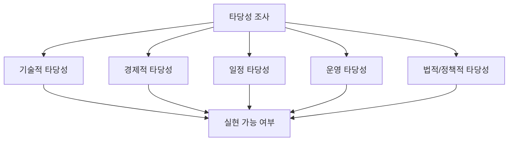

- 타당성 조사는 사용자 요구가 실제 프로젝트 조건에서 구현할 가치와 가능성이 있는지 검토하는 활동이다.
- PDF는 요구사항 분석에서 `사용자 요구의 타당성을 조사`한다고 명시한다.

- 기술적 타당성:
  - 현재 기술로 구현 가능한가
  - 필요한 성능을 달성할 수 있는가
  - 기존 시스템과 연동 가능한가
  - 보안과 안정성을 확보할 수 있는가

- 경제적 타당성:
  - 개발 비용 대비 효과가 있는가
  - 운영 비용을 감당할 수 있는가
  - 투자 대비 편익이 있는가

- 일정 타당성:
  - 요구사항을 정해진 기간 안에 구현할 수 있는가
  - 일정 위험이 큰 요구사항은 무엇인가
  - 선행 작업이나 외부 의존성이 있는가

- 운영 타당성:
  - 실제 사용자와 운영 조직이 사용할 수 있는가
  - 운영 프로세스에 맞는가
  - 유지보수 가능성이 있는가

- 법적/정책적 타당성:
  - 개인정보, 보안, 접근성, 산업 규정 등을 지킬 수 있는가
  - 기관 표준이나 내부 정책과 충돌하지 않는가

- 시험 단서:
  - `타당성`
  - `실현 가능성`
  - `비용 대비 효과`
  - `기술적으로 가능한가`
  - `운영 환경에 맞는가`

---

## 7. 비용과 일정 제약 설정

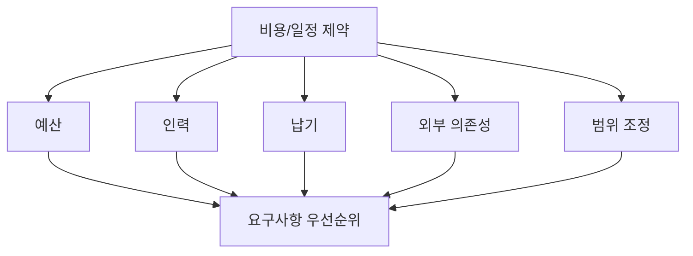

- PDF는 요구사항 분석에서 `비용과 일정에 대한 제약을 설정`한다고 설명한다.
- 모든 요구사항을 같은 중요도로 동시에 구현할 수 없기 때문에 분석 단계에서 제약을 함께 검토해야 한다.

- 비용 제약:
  - 개발 인력 비용
  - 인프라 비용
  - 라이선스 비용
  - 외부 연동 비용
  - 테스트 및 검증 비용
  - 운영과 유지보수 비용

- 일정 제약:
  - 출시 예정일
  - 법규 시행일
  - 계약 납기
  - 외부 시스템 오픈 일정
  - 사용자 교육 일정
  - 데이터 이관 일정

- 제약이 요구사항 분석에 미치는 영향:
  - 우선순위를 조정한다.
  - 범위를 줄이거나 단계적으로 나눈다.
  - 대체 해결 방식을 찾는다.
  - 위험이 큰 요구사항을 먼저 검증한다.
  - 기능 요구사항과 비기능 요구사항의 목표 수준을 조정한다.

- 시험 포인트:
  - 비용과 일정 제약은 프로젝트 관리만의 문제가 아니다.
  - 요구사항 분석에서 요구의 범위와 해결 방식을 결정하는 핵심 기준이다.

---

## 8. 요구사항 추출과 정제

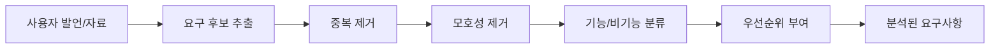

- PDF는 요구사항 분석이 `요구를 정확하게 추출`한다고 설명한다.
- 요구사항 추출은 사용자 발언에서 요구사항 후보를 뽑아내는 것에 그치지 않고, 분석 과정에서 정확한 의미로 정제하는 것까지 포함한다.

- 정제 활동:
  - 중복 요구사항 제거
  - 유사 요구사항 통합
  - 모호한 표현 구체화
  - 기능 요구사항과 비기능 요구사항 분류
  - 요구사항의 출처 기록
  - 상위 목표와 연결
  - 구현 가능성 검토
  - 우선순위 부여
  - 테스트 가능 여부 확인

- 예시:

| 사용자 표현 | 분석 후 요구사항 |
|---|---|
| 검색이 빨라야 한다 | 상품 검색은 동시 사용자 500명 조건에서 95% 요청을 2초 이내 응답해야 한다 |
| 관리자만 볼 수 있게 해달라 | 관리자 권한을 가진 사용자만 매출 통계 화면에 접근할 수 있어야 한다 |
| 주문 내역을 편하게 보고 싶다 | 사용자는 최근 1년간 주문 내역을 주문일 역순으로 조회할 수 있어야 한다 |
| 엑셀로 내려받고 싶다 | 사용자는 검색 결과를 XLSX 형식으로 다운로드할 수 있어야 한다 |

- 시험 포인트:
  - `정확하게 추출`, `요구를 정리`, `요구를 구체화`, `모호성 제거`가 나오면 분석 단서다.

---

## 9. 목표 설정과 해결 방식 결정

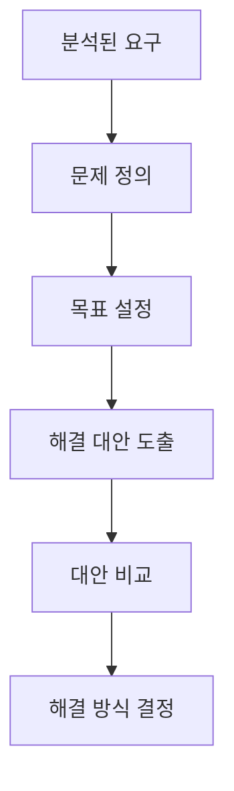

- PDF는 요구사항 분석에서 `목표를 정하고 해결 방식을 결정`한다고 설명한다.
- 목표 설정은 단순히 기능 목록을 나열하는 것이 아니라, 시스템이 해결해야 할 문제와 달성해야 할 상태를 정하는 것이다.

- 목표 설정 예시:
  - 주문 처리 시간을 줄인다.
  - 고객 문의 처리 지연을 줄인다.
  - 수작업 데이터 입력 오류를 줄인다.
  - 승인 절차를 추적 가능하게 만든다.
  - 보안 감사 요구를 만족한다.

- 해결 방식 결정 예시:
  - 수작업 엑셀 관리 대신 웹 시스템을 도입한다.
  - 배치 처리 대신 실시간 API 연동을 사용한다.
  - 기존 시스템을 전면 교체하지 않고 일부 기능을 모듈화해 연동한다.
  - 고위험 기능은 프로토타입으로 먼저 검증한다.
  - 비용과 일정 제약 때문에 1차 범위와 2차 범위를 나눈다.

- 분석 단계에서 해결 방식까지 고려하는 이유:
  - 요구사항이 실제로 가능한지 판단해야 한다.
  - 같은 요구도 여러 해결 방식이 있을 수 있다.
  - 해결 방식에 따라 비용, 일정, 성능, 위험이 달라진다.

- 시험 포인트:
  - `목표 설정`, `해결 방식 결정`은 요구사항 분석의 PDF 핵심 문장이다.
  - 설계 단계처럼 상세 구조를 결정하는 것은 아니지만, 해결 방향과 제약을 잡는 활동이다.

---

## 10. 요구사항 충돌과 협상

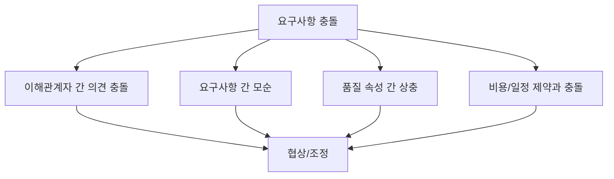

- 요구사항 분석에서는 충돌을 발견하고 조정해야 한다.
- IREB CPRE 용어집은 요구사항 충돌을 두 개 이상의 요구사항이 동시에 만족될 수 없거나, 이해관계자들이 특정 요구사항에 대해 의견이 다른 상황으로 설명한다.
- 충돌은 요구사항 협상을 통해 해결해야 한다.

- 충돌 예시:
  - 보안팀은 2단계 인증을 요구하지만 영업팀은 로그인 절차를 최대한 간단히 원한다.
  - 고객은 모든 통계를 실시간으로 원하지만 예산과 인프라 제약상 배치 처리가 현실적이다.
  - 사용자는 모든 데이터를 오래 보관하길 원하지만 개인정보 보존 기간 제한이 있다.
  - 관리자는 세부 권한을 많이 나누고 싶지만 운영팀은 권한 관리 복잡도를 줄이고 싶어 한다.

- 충돌 해결 기준:
  - 비즈니스 가치
  - 법규와 보안 필요성
  - 비용과 일정
  - 기술 가능성
  - 사용자 영향
  - 운영 부담
  - 위험도

- 시험 단서:
  - `충돌`
  - `상충`
  - `이해관계자 의견 조정`
  - `우선순위 조정`
  - `요구사항 협상`

---

## 11. 기능 요구사항과 비기능 요구사항 분석

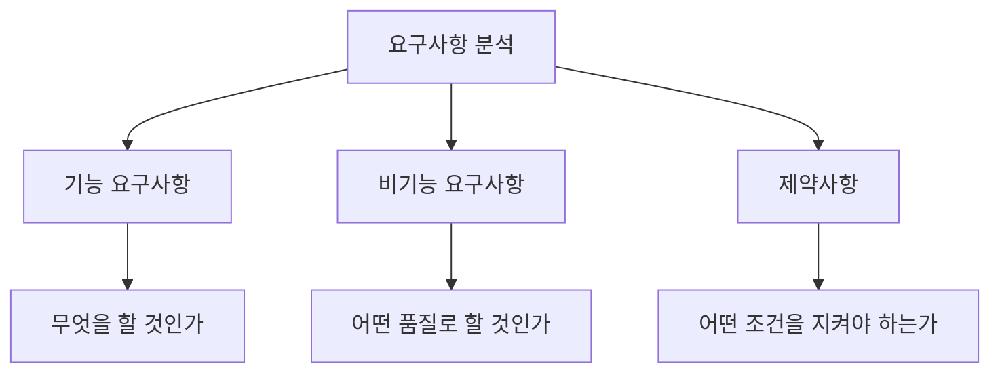

- 요구사항 분석에서는 요구사항을 종류별로 분류한다.
- 기능 요구사항:
  - 시스템이 제공해야 할 기능과 행위다.
  - 예: 로그인한다, 주문을 조회한다, 보고서를 생성한다.

- 비기능 요구사항:
  - 기능이 만족해야 할 품질과 조건이다.
  - 예: 2초 이내 응답, 99.9% 가용성, 암호화, 접근성 준수.

- 제약사항:
  - 해결 공간을 제한하는 조건이다.
  - 예: 특정 DBMS 사용, 특정 운영체제 지원, 법규 준수, 예산 제한.

- 분석 시 확인할 질문:
  - 이 요구는 기능인가, 품질인가, 제약인가
  - 기능 요구사항에 필요한 비기능 기준이 빠져 있지 않은가
  - 제약사항이 기능 구현 방식에 어떤 영향을 주는가
  - 비기능 요구사항이 측정 가능한가

- 시험 포인트:
  - `기능/비기능 분류`는 요구사항 분석의 대표 활동이다.
  - 앞 챕터 `007 주요 비기능 요구사항`과 연결된다.

---

## 12. 요구사항 모델링과 DFD 연결

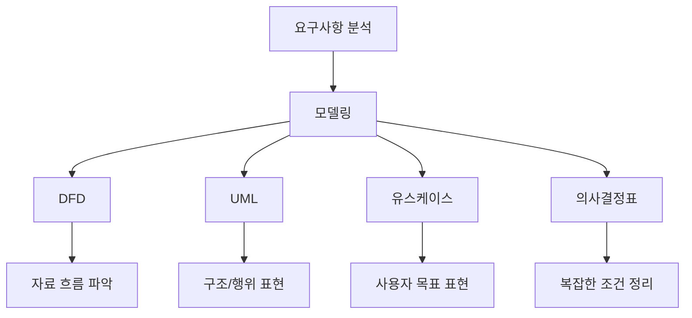

- 요구사항 분석에서는 요구사항을 문장만으로 다루지 않고 모델로 표현하기도 한다.
- 모델링은 복잡한 업무와 시스템을 이해하기 쉽게 만드는 활동이다.
- 다음 챕터 `010 자료 흐름도의 구성 요소`와 직접 연결된다.

- DFD(Data Flow Diagram):
  - IBM은 DFD를 정보 시스템이나 업무 프로세스에서 데이터가 어떻게 흐르는지 시각적으로 표현하는 도구로 설명한다.
  - 복잡한 시스템을 이해하고 분석하는 데 도움을 준다.
  - 자료가 어디서 들어오고, 어떤 처리 과정을 거치고, 어디에 저장되고, 어디로 나가는지 표현한다.

- DFD가 요구사항 분석에서 유용한 이유:
  - 업무 흐름을 시각화한다.
  - 데이터 흐름을 명확히 한다.
  - 누락된 입력과 출력을 찾는다.
  - 중복 처리나 병목을 찾는다.
  - 이해관계자와 공통된 그림으로 논의할 수 있다.
  - 보안상 민감한 데이터가 어디서 들어오고 나가는지 파악할 수 있다.

- DFD 기본 구성 요소:
  - `외부 엔티티`: 시스템 밖에서 데이터를 주고받는 사람, 조직, 시스템
  - `프로세스`: 입력 데이터를 처리하여 출력 데이터로 바꾸는 활동
  - `자료 저장소`: 데이터가 저장되는 곳
  - `자료 흐름`: 데이터가 이동하는 경로

- 시험 포인트:
  - 요구사항 분석과 DFD는 연결되어 출제될 수 있다.
  - DFD 자체의 구성 요소는 다음 챕터에서 더 직접적으로 묻는다.

---

## 13. 분석 산출물

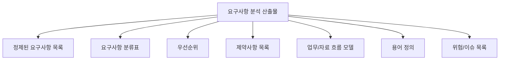

- 요구사항 분석의 결과는 이후 명세와 설계의 입력이 된다.
- 대표 산출물:
  - 정제된 요구사항 목록
  - 기능 요구사항 목록
  - 비기능 요구사항 목록
  - 제약사항 목록
  - 요구사항 우선순위
  - 요구사항 충돌 해결 결과
  - 요구사항 모델
  - DFD
  - 유스케이스 모델
  - 업무 규칙 목록
  - 용어 사전
  - 비용/일정 제약
  - 위험과 이슈 목록

- 산출물의 목적:
  - 이해관계자 간 합의 근거가 된다.
  - 명세서 작성의 기초가 된다.
  - 설계 범위를 정한다.
  - 테스트 기준을 준비한다.
  - 변경 영향 분석의 출발점이 된다.

- 시험 포인트:
  - 분석 산출물은 `명세서 완성본`만을 의미하지 않는다.
  - 요구사항 명세서는 명세 단계의 대표 산출물이지만, 분석 단계의 정리 결과가 명세서의 재료가 된다.

---

## 14. 좋은 요구사항 품질 기준

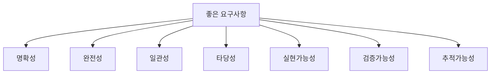

- ISO/IEC/IEEE 29148:2018은 시스템과 소프트웨어 제품의 요구사항을 만드는 공학 활동과 관련 산출물, 정보 항목에 대한 지침을 다룬다.
- IEEE 29148 표준 페이지는 좋은 요구사항의 구조와 요구사항 특성, 요구사항 프로세스의 반복적 적용을 다룬다고 설명한다.
- 정보처리기사 시험에서는 세부 표준 조항을 외우기보다는 분석 단계에서 요구사항 품질을 높인다는 관점으로 이해하면 된다.

- 명확성:
  - 여러 사람이 같은 의미로 이해해야 한다.
  - `빠르게`, `쉽게`, `적절하게` 같은 표현은 구체화해야 한다.

- 완전성:
  - 필요한 요구사항이 빠지지 않아야 한다.
  - IREB 용어집은 요구사항 명세가 알려진 관련 요구사항을 모두 포함하는 정도를 완전성으로 설명한다.

- 일관성:
  - 요구사항끼리 서로 모순되지 않아야 한다.
  - IREB 용어집은 일관성을 요구사항 집합이 모순된 진술에서 자유로운 정도로 설명한다.

- 타당성:
  - 이해관계자의 실제 필요와 맞아야 한다.
  - IREB 용어집은 요구사항의 적절성을 이해관계자의 진짜 욕구와 필요를 표현하는 정도로 설명한다.

- 실현가능성:
  - 기술, 비용, 일정, 운영 제약 안에서 구현 가능해야 한다.

- 검증가능성:
  - 테스트나 리뷰로 만족 여부를 판단할 수 있어야 한다.

- 추적가능성:
  - 요구사항의 출처, 설계, 구현, 테스트와 연결되어야 한다.

---

## 15. 요구사항 분석과 도출/명세/확인의 차이

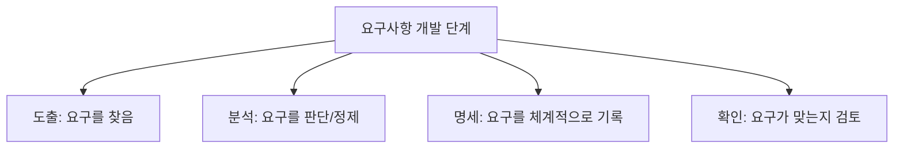

| 구분 | 핵심 | 시험 단서 |
|---|---|---|
| 도출 | 요구사항을 찾아내고 수집 | 인터뷰, 설문, 관찰, 워크숍 |
| 분석 | 요구사항을 이해하고 타당성·제약·충돌·목표를 검토 | 타당성, 비용/일정, 우선순위, 충돌 |
| 명세 | 분석된 요구사항을 문서로 체계화 | 요구사항 명세서, SRS, 문서화 |
| 확인 | 명세된 요구가 사용자 의도와 맞는지 검토 | 리뷰, 워크스루, 인스펙션, 승인 |

- 요구사항 분석은 도출과 다르다.
  - 도출은 요구를 찾는 활동이다.
  - 분석은 요구를 해석하고 판단하는 활동이다.

- 요구사항 분석은 명세와 다르다.
  - 분석에서도 문서화가 언급되지만, 명세는 체계적인 요구사항 명세서를 작성하는 단계다.
  - 분석은 명세 전에 요구사항을 정제한다.

- 요구사항 분석은 확인과 다르다.
  - 분석은 요구사항을 다듬고 타당성을 판단한다.
  - 확인은 명세된 요구사항이 이해관계자 요구와 맞는지 검토한다.

- 시험 포인트:
  - `문서화`라는 단어 하나만 보고 명세로 단정하지 않는다.
  - 문맥이 `사용자 요구 이해와 타당성 검토`면 분석이다.

---

## 16. 요구사항 분석 예시

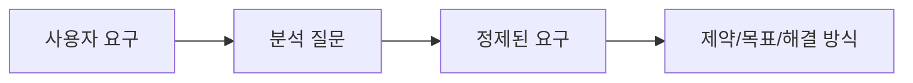

- 예시 1: `검색이 빨라야 한다`
  - 분석 질문:
    - 어떤 검색인가
    - 사용자는 몇 명인가
    - 데이터는 몇 건인가
    - 빠르다는 기준은 몇 초인가
  - 정제:
    - `상품 검색은 동시 사용자 500명, 상품 100만 건 조건에서 95% 요청을 2초 이내 응답해야 한다.`
  - 관련 분석:
    - 성능 요구사항
    - 인덱스, 캐시, 검색 엔진 도입 여부 검토
    - 인프라 비용 제약 확인

- 예시 2: `관리자만 볼 수 있게 해달라`
  - 분석 질문:
    - 관리자는 어떤 역할인가
    - 어떤 화면과 데이터가 대상인가
    - 접근 기록이 필요한가
  - 정제:
    - `매출 통계 화면은 관리자 권한을 가진 사용자만 접근할 수 있어야 하며, 모든 조회 이력은 감사 로그로 저장해야 한다.`
  - 관련 분석:
    - 보안 요구사항
    - 역할 기반 접근 제어
    - 감사 로그 저장 비용과 기간

- 예시 3: `정산 시스템과 연동해야 한다`
  - 분석 질문:
    - 어떤 시스템인가
    - 연동 주기는 실시간인가 배치인가
    - 데이터 형식은 무엇인가
    - 오류 발생 시 재처리 방식은 무엇인가
  - 정제:
    - `정산 데이터는 매일 02:00에 HTTPS 기반 API로 전송하며 요청/응답 형식은 JSON을 사용해야 한다. 실패 시 최대 3회 재시도하고 실패 내역을 운영자에게 알림으로 전송해야 한다.`
  - 관련 분석:
    - 인터페이스 요구사항
    - 운영 제약
    - 오류 처리 정책

---

## 17. 폭포수와 애자일에서의 요구사항 분석

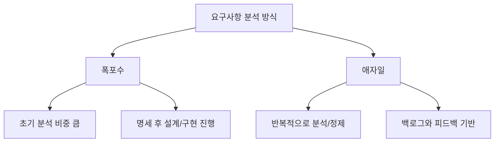

- 폭포수 모형에서:
  - 요구사항 분석은 초기에 매우 중요하다.
  - 분석 결과가 설계와 구현의 기준이 된다.
  - 요구사항 변경이 늦게 발생하면 비용이 커질 수 있다.

- 애자일에서:
  - 요구사항 분석을 한 번에 끝내지 않는다.
  - 제품 백로그, 사용자 스토리, 고객 피드백을 통해 반복적으로 분석한다.
  - 우선순위가 높은 요구부터 상세 분석한다.

- 공통점:
  - 어떤 개발 방식이든 요구사항 분석은 필요하다.
  - 사용자의 요구를 이해하고 타당성을 검토해야 한다.
  - 비용, 일정, 제약을 고려해야 한다.

- 시험 포인트:
  - PDF의 `소프트웨어 개발의 실제적인 첫 단계`는 특히 전통적 개발 흐름에서 요구사항 분석의 중요성을 강조하는 표현이다.
  - 애자일이라고 요구사항 분석이 없는 것은 아니다.

---

## 18. DFD와 요구사항 분석 문제 연결

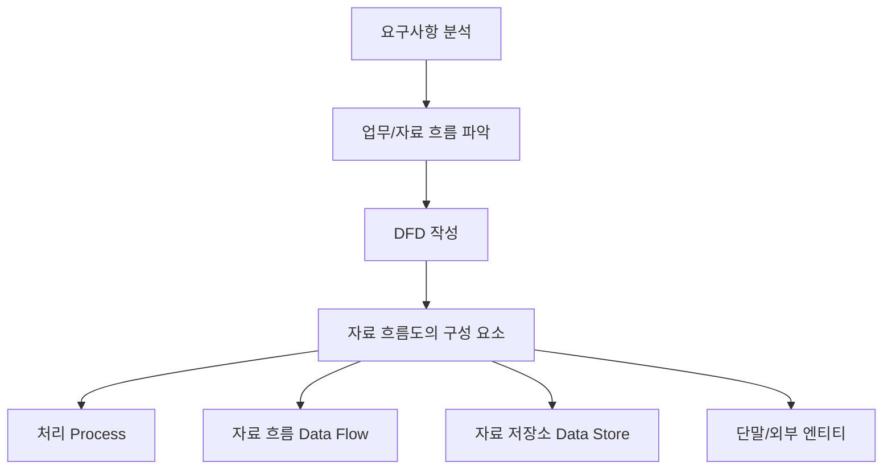

- 정보처리기사 1과목에서는 요구사항 분석 다음에 자료 흐름도(DFD) 구성 요소가 바로 이어진다.
- 따라서 요구사항 분석을 공부할 때 DFD를 함께 연결해두면 좋다.

- 요구사항 분석에서 DFD를 사용하는 이유:
  - 사용자 업무를 데이터 흐름 관점으로 표현한다.
  - 입력, 처리, 저장, 출력을 구분한다.
  - 시스템 경계를 파악한다.
  - 외부 엔티티와 시스템 내부 처리를 구분한다.
  - 누락된 데이터 흐름이나 저장소를 찾는다.

- DFD 레벨:
  - Level 0은 전체 시스템을 하나의 큰 프로세스로 보는 컨텍스트 다이어그램에 가깝다.
  - Level 1은 큰 프로세스를 하위 프로세스로 분해한다.
  - Level 2 이상은 더 세부적인 처리 흐름을 표현한다.

- 시험 포인트:
  - 요구사항 분석은 DFD, 자료 사전, UML, 유스케이스 같은 표현 도구와 연결된다.
  - DFD의 세부 구성 요소는 `010 자료 흐름도의 구성 요소`에서 직접 암기한다.

---

## 19. 시험에서 보는 단서어

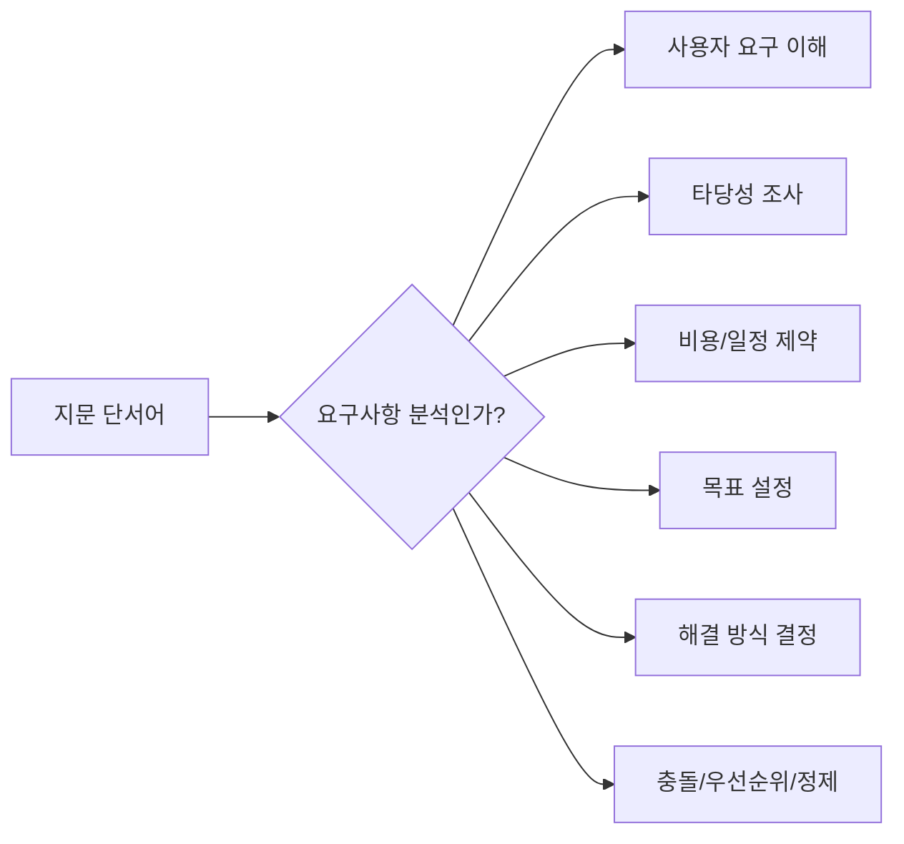

- 요구사항 분석 단서어:

| 단서어 | 판단 |
|---|---|
| 사용자의 요구사항을 이해 | 요구사항 분석 |
| 개발 대상에 대한 요구를 문서화 | 요구사항 분석 또는 명세, 문맥 확인 |
| 소프트웨어 개발의 실제적인 첫 단계 | 요구사항 분석 |
| 사용자 요구의 타당성 조사 | 요구사항 분석 |
| 비용과 일정에 대한 제약 설정 | 요구사항 분석 |
| 요구를 정확하게 추출 | 요구사항 분석 |
| 목표를 정함 | 요구사항 분석 |
| 해결 방식을 결정 | 요구사항 분석 |
| 충돌, 누락, 모호성, 우선순위 | 요구사항 분석 |

- 보기 판별 예시:

| 보기 | 판단 | 이유 |
|---|---|---|
| 요구사항 분석은 사용자의 요구사항을 이해하고 문서화하는 활동이다 | O | PDF 핵심 |
| 요구사항 분석은 소프트웨어 개발의 실제적인 첫 단계이다 | O | PDF 핵심 |
| 요구사항 분석은 사용자 요구의 타당성을 조사한다 | O | PDF 핵심 |
| 요구사항 분석은 비용과 일정 제약을 전혀 고려하지 않는다 | X | PDF와 반대 |
| 요구사항 분석은 도출된 요구의 충돌과 모호성을 검토한다 | O | 분석 활동 |
| 요구사항 분석은 구현 완료 후 프로그램을 실행해 결함을 찾는 단계다 | X | 테스트 단계와 혼동 |

- 문제 풀이 순서:
  1. `수집`, `분석`, `명세`, `확인` 중 어떤 동사인지 본다.
  2. `타당성`, `비용`, `일정`, `목표`, `해결 방식`이 나오면 분석을 먼저 의심한다.
  3. `요구사항 명세서 작성`이 핵심이면 명세로 본다.
  4. `사용자 요구와 맞는지 검토`가 핵심이면 확인으로 본다.

---

## 20. 자주 나오는 함정

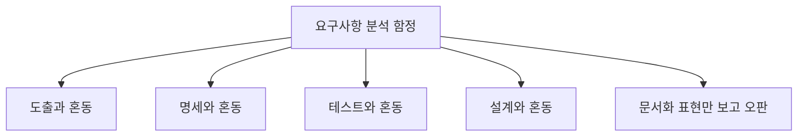

- 함정 1: 도출과 혼동
  - 도출은 요구사항을 찾아내는 활동이다.
  - 분석은 도출된 요구사항의 의미, 타당성, 제약, 우선순위, 목표를 검토한다.

- 함정 2: 명세와 혼동
  - 명세는 요구사항을 체계적으로 문서화하는 단계다.
  - 분석에서도 문서화가 언급되지만, 핵심은 요구사항 이해와 타당성 판단이다.

- 함정 3: 확인과 혼동
  - 확인은 명세된 요구사항이 사용자 의도와 맞는지 검토하는 활동이다.
  - 분석은 확인 전에 요구사항을 정제하고 판단하는 활동이다.

- 함정 4: 설계와 혼동
  - 분석에서 해결 방향을 결정할 수는 있지만, 상세 구조와 내부 설계를 모두 확정하는 것은 설계 단계다.
  - 분석은 `무엇이 필요하고 어떤 제약이 있는가`를 중심으로 본다.

- 함정 5: 테스트와 혼동
  - 요구사항 분석은 구현 후 결함을 찾는 활동이 아니다.
  - 다만 분석이 잘 되어야 테스트 기준이 명확해진다.

- 함정 6: `실제적인 첫 단계` 표현 혼동
  - 요구사항 개발 프로세스 순서로는 도출 다음 분석이다.
  - PDF의 표현은 소프트웨어 개발을 실제로 시작하는 핵심 분석 활동이라는 의미로 이해한다.

- 함정 7: 비용/일정은 프로젝트 관리 영역이라 분석과 무관하다고 오해
  - PDF는 요구사항 분석에서 비용과 일정 제약을 설정한다고 명시한다.
  - 요구사항의 범위와 해결 방식은 비용과 일정에 직접 영향을 받는다.

---

## 21. 암기 포인트

```mermaid
flowchart TD
    A["요구사항 분석 암기"] --> B["이"]
    A --> C["문"]
    A --> D["타"]
    A --> E["제"]
    A --> F["목"]
    A --> G["해"]

    B --> B1["이해"]
    C --> C1["문서화"]
    D --> D1["타당성 조사"]
    E --> E1["비용/일정 제약"]
    F --> F1["목표 설정"]
    G --> G1["해결 방식 결정"]
```

- 1차 암기:
  - `이-문-타-제-목-해`
  - 이해, 문서화, 타당성, 제약, 목표, 해결 방식

- 2차 암기:
  - 요구사항 분석 = 사용자의 요구사항을 이해하고 문서화
  - 요구사항 분석 = 소프트웨어 개발의 실제적인 첫 단계
  - 요구사항 분석 = 타당성 조사
  - 요구사항 분석 = 비용과 일정 제약 설정
  - 요구사항 분석 = 목표와 해결 방식 결정

- 3차 암기:
  - 도출 = 요구를 찾음
  - 분석 = 요구를 판단하고 정제
  - 명세 = 요구를 체계적으로 문서화
  - 확인 = 요구가 맞는지 검토

- 말로 풀어 외우기:
  - `요구사항 분석은 요구를 이해하고, 타당한지 보고, 비용·일정 제약 안에서 목표와 해결 방식을 정하는 실제 개발의 첫 단계다.`

- 시험 직전 10초 복습:
  - 타당성 → 분석
  - 비용/일정 제약 → 분석
  - 목표 설정 → 분석
  - 해결 방식 결정 → 분석
  - 인터뷰/설문 → 도출
  - SRS 작성 → 명세
  - 워크스루/인스펙션 → 확인

---

## 22. 빠른 복습

```mermaid
flowchart TD
    A["문제 풀이"] --> B{"요구사항 분석 단서?"}
    B -- "타당성/비용/일정" --> C["분석"]
    B -- "목표/해결 방식" --> C
    B -- "사용자 요구 이해" --> C
    B -- "수집/인터뷰" --> D["도출"]
    B -- "SRS/명세서" --> E["명세"]
    B -- "검토/승인" --> F["확인"]
```

- 챕터명:
  - `009 요구사항 분석`

- 소속 영역:
  - `1과목 소프트웨어 설계`
  - `요구사항`

- 반드시 외울 PDF 핵심:
  - 개발 대상에 대한 사용자의 요구사항을 이해하고 문서화하는 활동
  - 소프트웨어 개발의 실제적인 첫 단계
  - 사용자 요구의 타당성 조사
  - 비용과 일정에 대한 제약 설정
  - 요구를 정확하게 추출
  - 목표 설정과 해결 방식 결정

- 가장 중요한 해석:
  - 요구사항 분석은 요구사항을 개발 가능한 기준으로 정제하는 활동이다.
  - 요구사항 분석은 도출된 요구를 그대로 받아들이지 않고, 타당성·제약·충돌·목표·해결 방식을 검토한다.
  - 요구사항 분석 결과는 명세, 설계, 테스트의 기준이 된다.

- 자주 나오는 문제 유형:
  - 요구사항 분석의 정의를 묻는 문제
  - 요구사항 분석이 아닌 활동을 고르는 문제
  - 도출/분석/명세/확인을 구분하는 문제
  - 타당성 조사와 비용·일정 제약을 묻는 문제
  - DFD와 요구사항 분석의 연결을 묻는 문제
  - `실제적인 첫 단계` 표현을 묻는 문제

- 최종 암기 문장:
  - `요구사항 분석은 사용자의 요구를 이해하고 문서화하며, 타당성·비용·일정 제약을 검토해 목표와 해결 방식을 정하는 실제 개발의 첫 단계다.`

---

## 23. 참고 링크

- 기준 PDF: `/Users/nes0903/Documents/study/정보처리기사/핵심요약집_2026_정보처리기사필기핵심요약.pdf`
- [Q-Net 정보처리기사 종목 페이지](https://www.q-net.or.kr/crf005.do?id=crf00503s02&jmCd=1320&jmInfoDivCcd=B0)
- [IREB CPRE Glossary](https://cpre.ireb.org/en/downloads-and-resources/glossary)
- [ISO/IEC/IEEE 29148:2018 - ISO 공식 페이지](https://www.iso.org/standard/72089.html)
- [IEEE/ISO/IEC 29148-2018 - IEEE SA](https://standards.ieee.org/ieee/29148/6937/)
- [IBM - What is a Data Flow Diagram?](https://www.ibm.com/think/topics/data-flow-diagram)
