# 010 자료 흐름도의 구성 요소

작성 기준일: 2026-05-02  
과목: `1과목 소프트웨어 설계`  
기준 PDF: `/Users/nes0903/Documents/study/정보처리기사/핵심요약집_2026_정보처리기사필기핵심요약.pdf`  
PDF 확인 위치: `2페이지`  
검색 보강: IBM DFD 설명, IREB CPRE 요구공학 용어집, Q-Net 정보처리기사 시험 정보를 함께 확인하여 시험 중심으로 확장 정리

---

## 1. 한 줄 요약

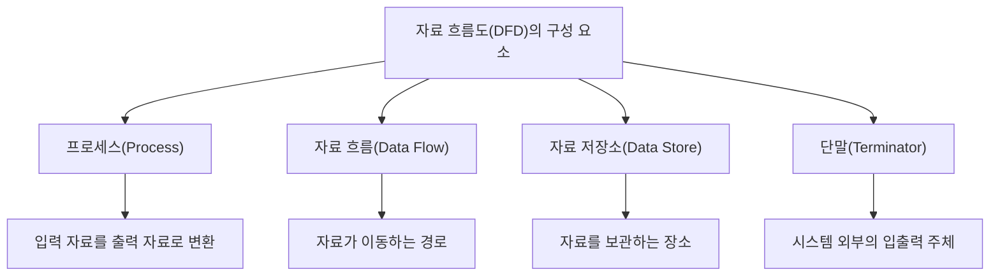

- 자료 흐름도(DFD, Data Flow Diagram)는 시스템이나 업무 프로세스에서 자료가 어디서 들어와 어떻게 처리되고 어디에 저장되며 어디로 나가는지를 표현하는 구조적 분석 도구다.
- PDF 기준 DFD 구성 요소는 `프로세스`, `자료 흐름`, `자료 저장소`, `단말` 4개다.
- IBM 설명에서도 DFD의 핵심 구성 요소를 `External entities`, `Processes`, `Data stores`, `Data flows` 4개로 정리한다.
- 시험에서는 이름만 외우는 것보다 `역할`, `표기`, `예시`, `직접 연결 가능 여부`를 함께 구분해야 한다.
- 암기 축약어는 `프-흐-저-단`으로 잡으면 빠르다.

---

## 2. PDF 기준 핵심

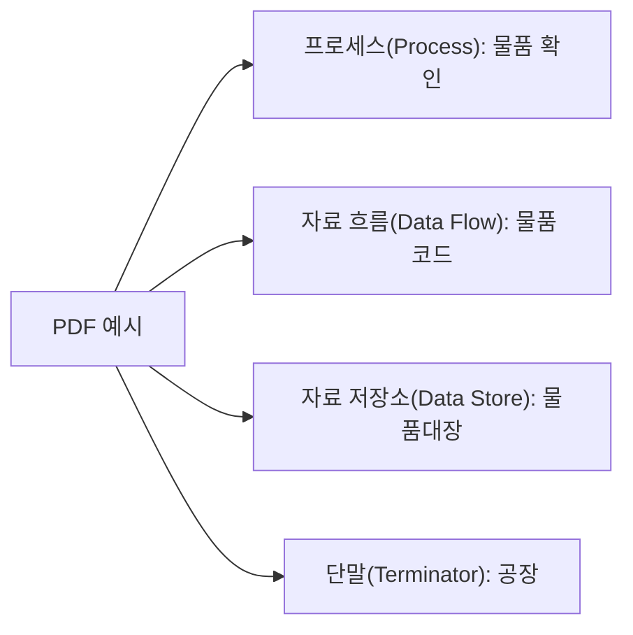

- PDF에 제시된 자료 흐름도의 구성 요소는 다음 4개다.
  - `프로세스(Process)` 예: `물품 확인`
  - `자료 흐름(Data Flow)` 예: `물품 코드`
  - `자료 저장소(Data Store)` 예: `물품대장`
  - `단말(Terminator)` 예: `공장`

- 이 챕터의 최소 암기 목표:
  - 구성 요소 4개를 정확히 외운다.
  - 각 구성 요소가 무엇을 의미하는지 구분한다.
  - DFD가 `자료의 흐름`과 `자료의 처리`를 표현한다는 점을 기억한다.
  - 제어 흐름, 시간 순서, 프로그램 내부 호출 관계를 표현하는 도구로 오해하지 않는다.

- PDF 예시 해석:

| 구성 요소 | PDF 예시 | 해석 |
|---|---|---|
| 프로세스 | 물품 확인 | 물품 관련 입력 자료를 받아 확인 결과로 바꾸는 처리 |
| 자료 흐름 | 물품 코드 | 프로세스나 저장소 사이를 이동하는 자료 |
| 자료 저장소 | 물품대장 | 물품 정보가 저장되는 파일, 장부, DB에 해당 |
| 단말 | 공장 | 시스템 외부에서 자료를 주거나 받는 외부 주체 |

---

## 3. DFD의 기본 개념

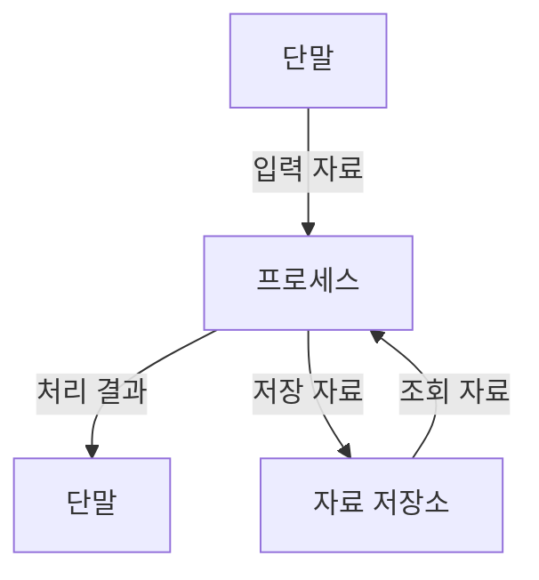

- DFD는 `데이터가 어떻게 움직이는가`를 중심으로 시스템을 분석한다.
- IBM은 DFD를 정보 시스템이나 업무 프로세스에서 데이터 흐름을 시각적으로 표현하는 도구로 설명한다.
- DFD는 시스템의 기능을 절차 코드처럼 표현하기보다, 자료가 들어오고 처리되고 저장되고 나가는 관계를 보여준다.

- DFD가 보여주는 것:
  - 외부에서 어떤 자료가 들어오는가
  - 자료가 어떤 처리 과정을 거치는가
  - 자료가 어디에 저장되는가
  - 처리 결과가 어디로 나가는가
  - 시스템 경계 밖의 주체는 누구인가

- DFD가 직접적으로 보여주지 않는 것:
  - 프로그램의 상세 알고리즘
  - 조건문과 반복문의 내부 구조
  - 화면 배치
  - 클래스 구조
  - 객체 간 메시지 호출 순서
  - 정확한 시간 순서나 제어 흐름

- 시험 포인트:
  - DFD는 구조적 분석 도구다.
  - 자료 중심 모델이다.
  - `자료 흐름`, `처리`, `저장`, `외부 주체`를 구분한다.

---

## 4. 구성 요소 전체 비교

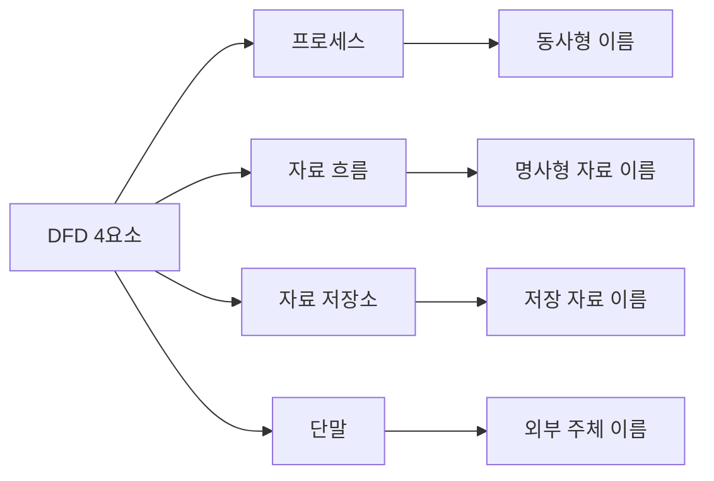

| 구성 요소 | 영문 | 핵심 역할 | 보통의 이름 형태 | 예시 |
|---|---|---|---|---|
| 프로세스 | Process | 자료를 처리하거나 변환 | 동사 또는 동사구 | 주문 접수, 물품 확인, 결제 승인 |
| 자료 흐름 | Data Flow | 자료가 이동하는 경로 | 명사 또는 명사구 | 주문 정보, 물품 코드, 결제 요청 |
| 자료 저장소 | Data Store | 자료를 보관 | 명사 또는 명사구 | 주문 DB, 물품대장, 고객 파일 |
| 단말 | Terminator, External Entity | 시스템 외부 입출력 주체 | 사람/조직/외부 시스템명 | 고객, 공장, 결제 시스템 |

- 가장 쉬운 구분:
  - 처리하면 `프로세스`
  - 이동하면 `자료 흐름`
  - 저장하면 `자료 저장소`
  - 시스템 밖이면 `단말`

- 시험에서 자주 나오는 표현:
  - 프로세스 = 처리, 변환, 가공
  - 자료 흐름 = 이동, 전달, 입력/출력 데이터
  - 자료 저장소 = 파일, DB, 장부, 저장 위치
  - 단말 = 외부 엔티티, 외부 주체, 터미네이터, 자료의 출발점/도착점

---

## 5. 프로세스(Process)

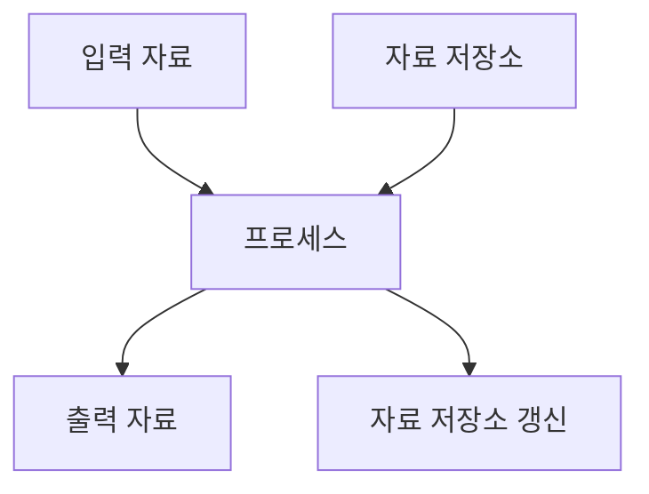

- 의미:
  - 프로세스는 입력 자료를 받아 처리, 계산, 검증, 분류, 변환하여 출력 자료를 만드는 활동이다.
  - IBM은 프로세스를 데이터를 변경하거나 변환하는 활동으로 설명한다.
  - DFD에서 프로세스는 시스템 내부에서 수행되는 기능 또는 처리 단위를 나타낸다.

- 이름 붙이는 방법:
  - 동사 또는 동사구로 표현한다.
  - 예: `주문 접수`, `물품 확인`, `결제 승인`, `재고 차감`, `회원 인증`, `보고서 생성`
  - 너무 추상적인 이름은 피한다.
  - 예: `처리`, `관리`, `작업`만 쓰면 의미가 모호하다.

- 특징:
  - 하나 이상의 입력 자료가 있어야 한다.
  - 하나 이상의 출력 자료가 있어야 한다.
  - 입력을 그대로 통과시키기만 하면 프로세스로 보기 어렵다.
  - 자료를 변환하거나 의미 있는 결과를 만들어야 한다.

- PDF 예시:
  - `물품 확인`
  - 물품 코드 같은 입력 자료를 받아 물품 존재 여부, 물품 정보, 확인 결과를 만드는 처리로 이해할 수 있다.

- 시험 포인트:
  - `처리`, `변환`, `계산`, `검증`, `분류`, `확인`이 나오면 프로세스를 의심한다.
  - 프로세스 이름은 명사보다 동사형이 자연스럽다.
  - 프로세스는 DFD에서 자료 흐름의 중간 처리 지점이다.

---

## 6. 자료 흐름(Data Flow)

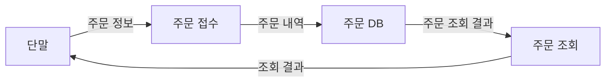

- 의미:
  - 자료 흐름은 자료가 단말, 프로세스, 자료 저장소 사이를 이동하는 경로다.
  - IREB 용어집은 자료 흐름을 생산자에서 소비자로 흐르는 데이터 항목의 순서로 설명한다.
  - IBM은 자료 흐름을 외부 엔티티, 프로세스, 데이터 저장소 사이에서 정보가 이동하는 경로로 설명한다.

- 이름 붙이는 방법:
  - 이동하는 자료의 이름을 붙인다.
  - 보통 명사 또는 명사구를 사용한다.
  - 예: `주문 정보`, `물품 코드`, `결제 요청`, `승인 결과`, `고객 정보`, `재고 수량`

- 특징:
  - 보통 화살표로 표현한다.
  - 화살표 방향은 자료가 이동하는 방향을 나타낸다.
  - 자료 흐름의 이름은 처리 동작이 아니라 이동하는 데이터여야 한다.
  - 자료 흐름은 제어 신호보다 데이터 자체에 초점을 둔다.

- PDF 예시:
  - `물품 코드`
  - 공장이나 사용자로부터 프로세스로 들어가거나, 프로세스와 저장소 사이에서 이동하는 데이터로 이해할 수 있다.

- 시험 포인트:
  - `자료 이동`, `입력 자료`, `출력 자료`, `화살표`, `데이터 경로`가 나오면 자료 흐름이다.
  - 자료 흐름 이름은 `조회한다`, `검증한다` 같은 동사가 아니라 `조회 요청`, `검증 결과`처럼 자료명이어야 한다.

---

## 7. 자료 저장소(Data Store)

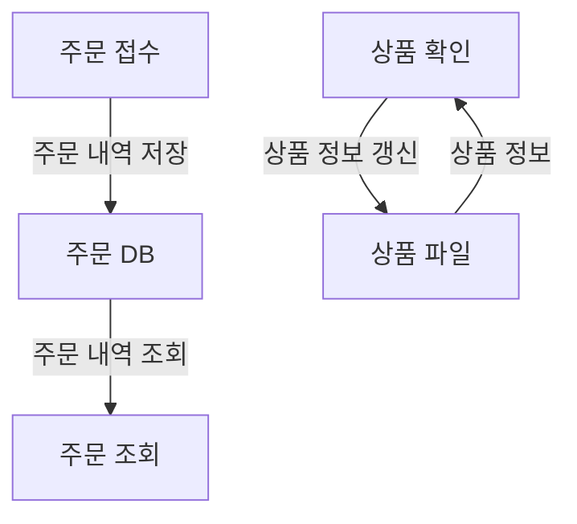

- 의미:
  - 자료 저장소는 자료가 저장되는 위치다.
  - IBM은 자료 저장소를 이후 사용을 위해 데이터가 저장되는 위치로 설명하며, 데이터베이스, 문서, 파일 같은 저장소가 될 수 있다고 설명한다.
  - DFD에서 자료 저장소는 시스템 내부에서 자료가 보관되고 다시 읽히는 지점을 나타낸다.

- 이름 붙이는 방법:
  - 저장되는 자료의 이름을 붙인다.
  - 보통 명사 또는 명사구를 사용한다.
  - 예: `주문 DB`, `물품대장`, `고객 파일`, `재고 장부`, `상품 정보`, `로그 저장소`

- 특징:
  - 자료를 임시 또는 영구적으로 보관한다.
  - 프로세스를 통해 읽거나 쓴다.
  - 자료 저장소는 스스로 자료를 처리하지 않는다.
  - 자료 저장소는 일반적으로 단말과 직접 연결하지 않는다.

- PDF 예시:
  - `물품대장`
  - 물품 정보가 저장되어 있는 장부, 파일, DB로 이해할 수 있다.

- 시험 포인트:
  - `파일`, `DB`, `장부`, `저장`, `보관`, `대장`, `Repository`가 나오면 자료 저장소다.
  - 자료 저장소는 데이터가 머무는 곳이고, 프로세스는 데이터를 바꾸는 곳이다.
  - 저장소끼리 직접 연결하는 것은 일반적인 DFD 규칙에 맞지 않는다.

---

## 8. 단말(Terminator)

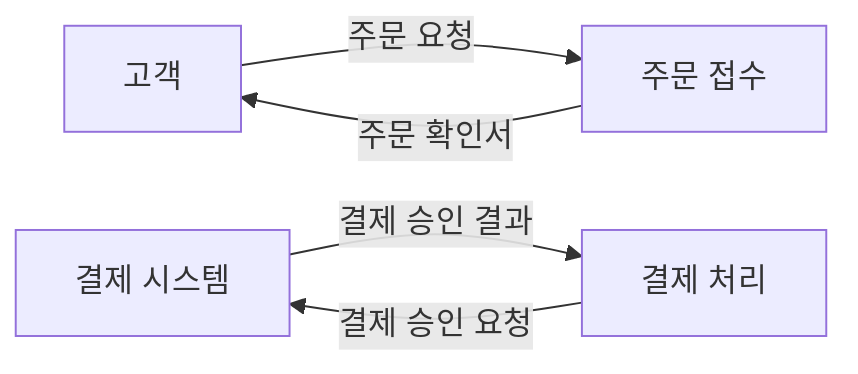

- 의미:
  - 단말은 시스템 외부에서 자료를 입력하거나 결과를 받는 외부 주체다.
  - IBM은 External Entity를 DFD에서 자료 흐름의 시작점과 끝점으로 설명하며, 사람, 조직, 외부 시스템이 될 수 있다고 설명한다.
  - 단말은 `Terminator`, `External Entity`, `Source`, `Sink`, `Actor` 등으로 불리기도 한다.

- 이름 붙이는 방법:
  - 외부 사람, 조직, 부서, 시스템 이름을 붙인다.
  - 예: `고객`, `공장`, `관리자`, `은행 시스템`, `결제 시스템`, `택배사`, `회계 시스템`

- 특징:
  - 시스템 경계 밖에 있다.
  - 시스템으로 자료를 제공하거나 시스템으로부터 결과를 받는다.
  - 시스템 내부 처리 로직은 단말로 표현하지 않는다.
  - 단말 내부에서 무슨 일이 일어나는지는 DFD의 분석 대상이 아닐 수 있다.

- PDF 예시:
  - `공장`
  - 물품 코드나 물품 관련 요청을 시스템에 보내거나, 물품 확인 결과를 받는 외부 조직으로 이해할 수 있다.

- 시험 포인트:
  - `외부`, `사용자`, `조직`, `다른 시스템`, `자료의 시작점/끝점`이 나오면 단말이다.
  - 단말은 시스템 내부 모듈이 아니다.
  - 단말과 자료 저장소는 직접 연결하지 않고 프로세스를 거쳐야 한다.

---

## 9. 표기법과 기호

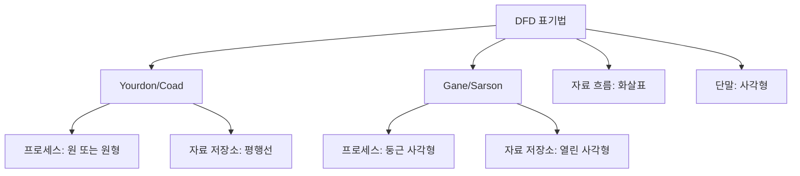

- DFD 표기법은 교재와 도구에 따라 기호가 조금 다를 수 있다.
- IBM은 대표적인 표기법으로 `Yourdon/Coad`와 `Gane/Sarson`을 설명한다.
- 두 표기법은 프로세스와 자료 저장소의 그림 모양이 다를 수 있지만, 구성 요소의 의미는 동일하다.

| 구성 요소 | 일반적 표기 | Yourdon/Coad 관점 | Gane/Sarson 관점 |
|---|---|---|---|
| 단말 | 사각형 | 사각형 | 사각형 |
| 프로세스 | 원, 원형, 둥근 사각형 | 원 또는 원형 | 둥근 사각형 |
| 자료 저장소 | 평행선, 열린 사각형 | 평행선 | 열린 사각형 |
| 자료 흐름 | 화살표 | 화살표 | 화살표 |

- 시험 포인트:
  - 정보처리기사에서는 기호 모양보다 구성 요소 이름과 역할이 더 중요하다.
  - 기호가 달라도 `처리`, `흐름`, `저장`, `외부 주체`의 의미로 구분한다.
  - 단말은 시스템 밖이고, 프로세스와 자료 저장소는 시스템 분석 범위 안에 놓이는 경우가 많다.

---

## 10. DFD 작성 규칙

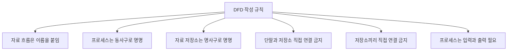

- DFD는 아무 선이나 연결하는 그림이 아니다.
- IBM 설명 기준으로도 데이터 흐름, 프로세스, 데이터 저장소에는 각각 설명적 라벨을 붙이고, 저장소와 외부 엔티티는 직접 연결하지 않는 등의 기본 규칙이 있다.

- 기본 규칙:
  - 자료 흐름에는 이동하는 자료명을 붙인다.
  - 프로세스에는 자료 변환을 나타내는 동사구를 붙인다.
  - 자료 저장소에는 저장되는 자료를 나타내는 명사구를 붙인다.
  - 프로세스와 자료 저장소는 최소한 하나 이상의 입력과 출력이 있어야 한다.
  - 단말에서 자료 저장소로 직접 연결하지 않는다.
  - 자료 저장소에서 단말로 직접 연결하지 않는다.
  - 자료 저장소끼리 직접 연결하지 않는다.
  - 단말끼리 직접 연결하지 않는다.
  - 자료 흐름은 가능하면 교차하지 않게 그린다.

- 왜 직접 연결이 문제인가:
  - DFD에서 자료는 프로세스를 통해 처리, 기록, 조회, 변환되어야 한다.
  - 단말이 저장소에 직접 쓰거나 읽는 것처럼 표현하면 시스템 내부 처리가 빠져 보인다.
  - 저장소끼리 직접 연결하면 어떤 처리로 자료가 이동하는지 알 수 없다.

- 시험 포인트:
  - `단말 → 자료 저장소` 직접 연결은 부적절하다.
  - `자료 저장소 → 자료 저장소` 직접 연결은 부적절하다.
  - 중간에 프로세스가 있어야 자료의 처리 의미가 드러난다.

---

## 11. 올바른 연결과 잘못된 연결

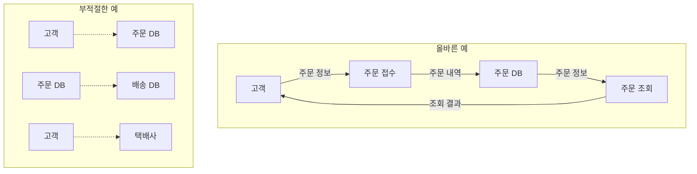

- 올바른 연결:
  - 단말 → 프로세스
  - 프로세스 → 단말
  - 프로세스 → 자료 저장소
  - 자료 저장소 → 프로세스
  - 프로세스 → 프로세스

- 부적절한 연결:
  - 단말 → 자료 저장소
  - 자료 저장소 → 단말
  - 자료 저장소 → 자료 저장소
  - 단말 → 단말

- 부적절한 이유:
  - 단말과 저장소를 직접 연결하면 시스템 내부 처리 과정이 생략된다.
  - 저장소끼리 직접 연결하면 어떤 프로세스가 자료를 이동시키는지 알 수 없다.
  - 단말끼리 직접 연결하면 분석 대상 시스템을 거치지 않는 외부 상호작용이 된다.

- 시험에서 보기 형태:
  - `자료 저장소는 단말과 직접 연결될 수 있다` → 일반적으로 오답
  - `자료 흐름은 자료가 이동하는 방향을 나타낸다` → 정답
  - `프로세스는 입력 자료를 출력 자료로 변환한다` → 정답
  - `단말은 시스템 내부의 처리 모듈이다` → 오답

---

## 12. DFD 레벨과 분할

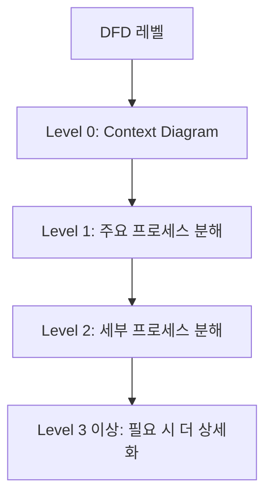

- DFD는 한 장에 모든 내용을 그리기보다 레벨을 나누어 점진적으로 상세화할 수 있다.
- IBM은 DFD가 단순한 상위 수준에서 시작해 하위 레벨로 내려가며 더 자세한 프로세스와 하위 프로세스를 보여줄 수 있다고 설명한다.

- Level 0:
  - 컨텍스트 다이어그램이라고도 한다.
  - 전체 시스템을 하나의 프로세스로 보고 외부 단말과의 주요 자료 흐름을 표현한다.
  - 시스템 경계와 외부 주체를 파악하기 좋다.

- Level 1:
  - Level 0의 큰 프로세스를 주요 하위 프로세스로 분해한다.
  - 자료 저장소와 주요 자료 흐름이 더 구체적으로 나타난다.

- Level 2:
  - Level 1의 특정 프로세스를 더 세부 프로세스로 분해한다.
  - 복잡한 처리 흐름을 더 자세히 표현한다.

- 시험 포인트:
  - 레벨이 내려갈수록 상세해진다.
  - 상위 DFD와 하위 DFD의 입출력 자료 흐름은 균형을 맞춰야 한다.
  - Level 0은 전체 시스템을 하나의 큰 프로세스로 보는 상위 그림이다.

---

## 13. DFD 균형화(Balancing)

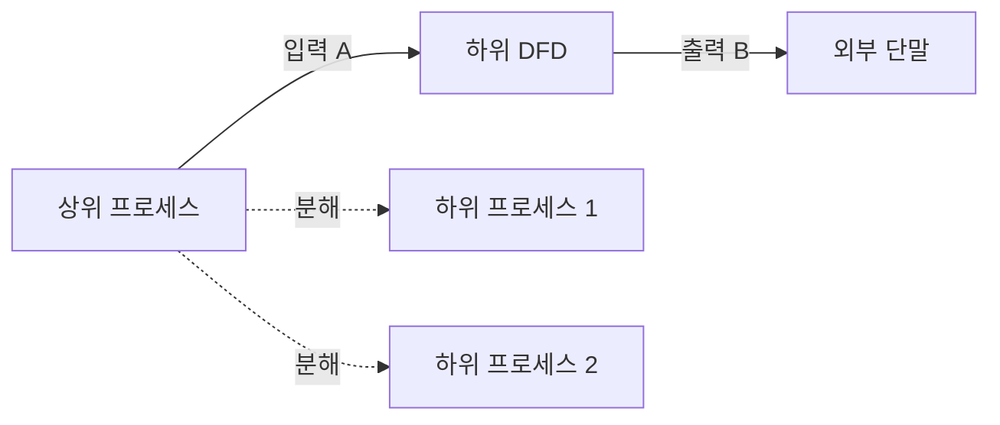

- 균형화는 상위 DFD의 입출력 자료 흐름과 하위 DFD의 입출력 자료 흐름이 맞아야 한다는 원칙이다.
- 상위 프로세스를 세부 프로세스로 분해했는데, 하위 DFD에서 갑자기 새로운 외부 입력이나 출력이 생기면 분석 일관성이 깨질 수 있다.

- 균형화에서 확인할 것:
  - 상위 프로세스에 들어오던 입력 자료가 하위 DFD에도 들어오는가
  - 상위 프로세스에서 나가던 출력 자료가 하위 DFD에도 나가는가
  - 하위 DFD에 새로운 자료 흐름이 생겼다면 상위 DFD에도 반영해야 하는가
  - 외부 단말과의 연결이 상하위 레벨에서 일관적인가

- 예시:
  - Level 0에서 `고객 → 주문 시스템: 주문 정보`가 있다.
  - Level 1로 분해하면 `주문 정보`는 `주문 접수`, `재고 확인`, `결제 처리` 등의 내부 프로세스로 나뉘어 흐를 수 있다.
  - 하지만 Level 1에서 외부로 나가는 결과가 `주문 확인서`라면 Level 0에도 그 출력이 표현되어야 한다.

- 시험 포인트:
  - DFD 분할은 자유롭게 해도 되지만 상위와 하위의 입출력 균형이 중요하다.
  - 균형화는 DFD의 일관성을 유지하기 위한 원칙이다.

---

## 14. 논리 DFD와 물리 DFD

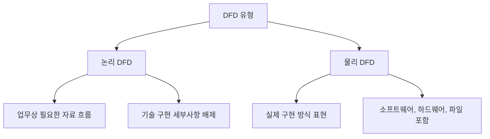

- IBM은 DFD를 크게 논리 DFD와 물리 DFD로 구분해 설명한다.

- 논리 DFD:
  - 업무나 시스템 프로세스를 수행하는 데 필요한 자료 흐름을 높은 수준에서 표현한다.
  - 기술적 구현 세부사항보다 `무슨 데이터가 필요하고 어떻게 이동하는가`에 초점을 둔다.
  - 요구사항 분석 단계에서 특히 유용하다.

- 물리 DFD:
  - 실제 구현 방식, 소프트웨어, 하드웨어, 파일, 장비, 운영 절차 등을 포함해 표현한다.
  - 설계나 구현에 가까운 관점이다.

- 비교:

| 구분 | 논리 DFD | 물리 DFD |
|---|---|---|
| 초점 | 업무와 자료 흐름 | 구현 기술과 실제 운영 방식 |
| 관심사 | 무엇이 필요한가 | 어떻게 구현할 것인가 |
| 사용 시점 | 요구사항 분석 | 설계/구현 분석 |
| 예시 | 주문 정보가 접수되고 결제 결과가 생성됨 | REST API, DB 테이블, 배치 파일, 서버 파일 경로 |

- 시험 포인트:
  - 요구사항 분석에서는 논리 DFD 관점이 더 자주 연결된다.
  - DFD가 구현 세부 코드까지 표현하는 도구라고 보면 틀리기 쉽다.

---

## 15. 요구사항 분석과 DFD의 관계

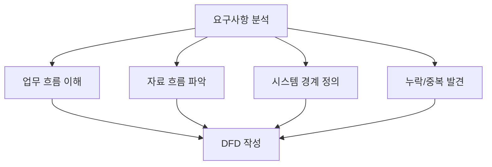

- DFD는 요구사항 분석에서 업무와 자료 흐름을 이해하기 위한 도구다.
- 이전 챕터 `009 요구사항 분석`에서 다룬 것처럼, 요구사항 분석은 사용자 요구를 이해하고 문서화하며 타당성과 제약을 검토한다.
- DFD는 이 과정에서 복잡한 업무 흐름을 그림으로 표현해 이해관계자와 개발자가 같은 그림을 보고 논의하도록 돕는다.

- 요구사항 분석에서 DFD가 유용한 이유:
  - 자료의 입력과 출력을 명확히 한다.
  - 시스템 경계를 분명히 한다.
  - 외부 시스템과 사용자 역할을 구분한다.
  - 필요한 자료 저장소를 식별한다.
  - 누락된 처리나 자료 흐름을 찾는다.
  - 보안상 민감한 자료의 이동 경로를 확인한다.
  - 병목이나 중복 처리를 발견할 수 있다.

- 시험 포인트:
  - DFD는 요구사항 분석 도구로 자주 연결된다.
  - DFD는 구조적 분석 방법론에서 많이 사용된다.
  - DFD 구성 요소는 다음 챕터 `011 자료 사전의 표기 기호`와도 연결된다.

---

## 16. 자료 사전(Data Dictionary)과의 연결

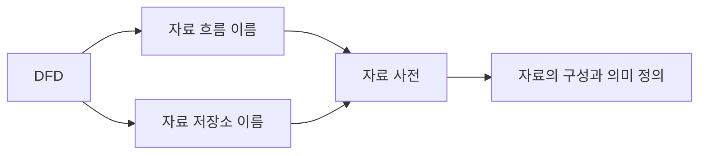

- DFD가 자료의 이동과 저장 구조를 그림으로 표현한다면, 자료 사전은 DFD에 등장하는 자료의 세부 내용을 정의한다.
- 예를 들어 DFD에 `주문 정보`라는 자료 흐름이 있으면, 자료 사전에서는 주문 정보가 어떤 항목으로 구성되는지 정의한다.

- 연결 예시:
  - DFD 자료 흐름: `주문 정보`
  - 자료 사전 정의: `주문 정보 = 주문번호 + 고객번호 + 상품코드 + 수량 + 주문일자`

- DFD만으로 부족한 점:
  - 자료 흐름 이름만 보고는 데이터 항목의 세부 구조를 알기 어렵다.
  - 자료 저장소에 어떤 필드가 있는지 알기 어렵다.
  - 자료의 반복, 선택, 연결 관계를 표현하기 어렵다.

- 자료 사전이 보완하는 점:
  - 자료 항목의 의미를 명확히 한다.
  - 자료 구성 요소를 정리한다.
  - DFD의 모호성을 줄인다.
  - 요구사항 명세와 설계의 기준이 된다.

- 시험 포인트:
  - DFD 구성 요소 다음에는 자료 사전 표기 기호가 이어진다.
  - DFD와 자료 사전은 구조적 분석에서 함께 쓰이는 도구로 이해한다.

---

## 17. UML, 순서도, DFD 비교

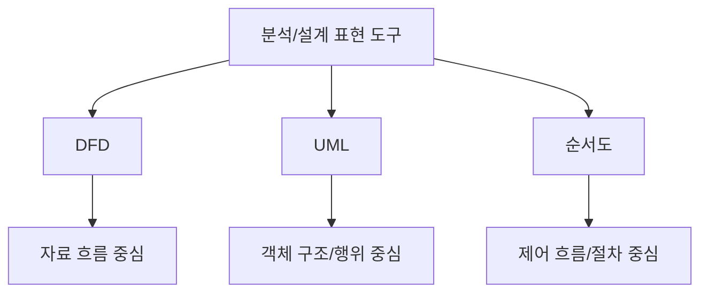

- DFD:
  - 데이터가 어디서 들어오고 어디로 이동하며 어떻게 처리되는지 표현한다.
  - 자료 흐름과 저장소가 핵심이다.

- UML:
  - 객체지향 분석과 설계에서 구조와 행위를 표현한다.
  - 클래스 다이어그램, 유스케이스 다이어그램, 순차 다이어그램 등 여러 종류가 있다.

- 순서도:
  - 알고리즘이나 절차의 흐름을 표현한다.
  - 조건 분기, 반복, 처리 순서가 핵심이다.

| 구분 | 중심 관점 | 대표 요소 | 시험상 구분 |
|---|---|---|---|
| DFD | 자료 흐름 | 프로세스, 자료 흐름, 자료 저장소, 단말 | 데이터 이동과 변환 |
| UML | 객체/관계/행위 | 클래스, 액터, 유스케이스, 메시지 | 객체지향 모델링 |
| 순서도 | 제어 흐름 | 처리, 판단, 시작/끝, 흐름선 | 절차와 알고리즘 |

- 시험 포인트:
  - DFD를 프로그램 순서도로 착각하지 않는다.
  - DFD는 조건문과 반복문보다 자료 흐름에 초점을 둔다.
  - 객체지향 관계를 표현하는 도구는 UML 쪽에 가깝다.

---

## 18. 예시: 주문 처리 DFD

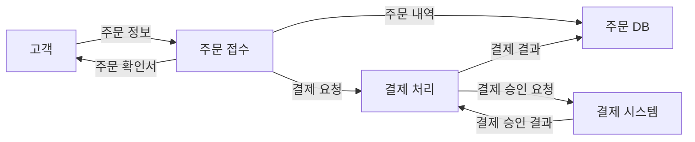

- 구성 요소 찾기:

| 그림 요소 | 구성 요소 | 이유 |
|---|---|---|
| 고객 | 단말 | 시스템 외부에서 주문 정보를 제공하고 확인서를 받음 |
| 결제 시스템 | 단말 | 외부 시스템으로 결제 요청과 결과를 주고받음 |
| 주문 접수 | 프로세스 | 주문 정보를 처리해 주문 내역과 확인서를 생성 |
| 결제 처리 | 프로세스 | 결제 요청을 처리하고 결과를 저장 |
| 주문 DB | 자료 저장소 | 주문 내역과 결제 결과가 저장됨 |
| 주문 정보, 결제 요청, 결제 결과 | 자료 흐름 | 구성 요소 사이를 이동하는 데이터 |

- 분석 포인트:
  - 고객이 주문 DB에 직접 연결되지 않는다.
  - 주문 접수 프로세스가 주문 DB에 자료를 저장한다.
  - 결제 시스템은 외부 단말이다.
  - 결제 처리는 시스템 내부 프로세스로 볼 수 있다.

- 시험 포인트:
  - 예시 그림에서 구성 요소를 찾아내는 문제가 나올 수 있다.
  - 연결 관계를 보고 부적절한 연결을 고르는 문제가 나올 수 있다.

---

## 19. PDF 예시 재구성

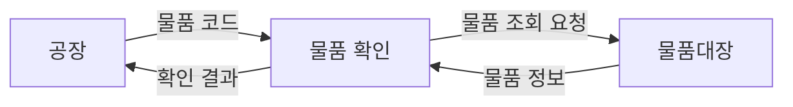

- PDF 예시를 DFD 흐름으로 재구성하면 다음처럼 이해할 수 있다.
  - 단말: `공장`
  - 자료 흐름: `물품 코드`
  - 프로세스: `물품 확인`
  - 자료 저장소: `물품대장`

- 해석:
  - 공장이 물품 코드를 시스템에 전달한다.
  - 물품 확인 프로세스가 물품 코드를 입력받는다.
  - 물품 확인 프로세스가 물품대장에서 물품 정보를 조회한다.
  - 물품 확인 프로세스가 확인 결과를 공장에 반환한다.

- 이 예시에서 주의할 점:
  - `공장 → 물품대장`으로 직접 연결하면 부적절하다.
  - `물품대장 → 공장`으로 직접 연결해도 부적절하다.
  - `물품 확인` 같은 처리 프로세스를 거쳐야 한다.

- 시험 포인트:
  - PDF 예시 자체를 외우면 4요소 구분 문제가 빨라진다.
  - `물품 확인`은 동작이므로 프로세스다.
  - `물품 코드`는 이동하는 데이터이므로 자료 흐름이다.
  - `물품대장`은 저장 위치이므로 자료 저장소다.
  - `공장`은 외부 주체이므로 단말이다.

---

## 20. 시험에서 보는 단서어

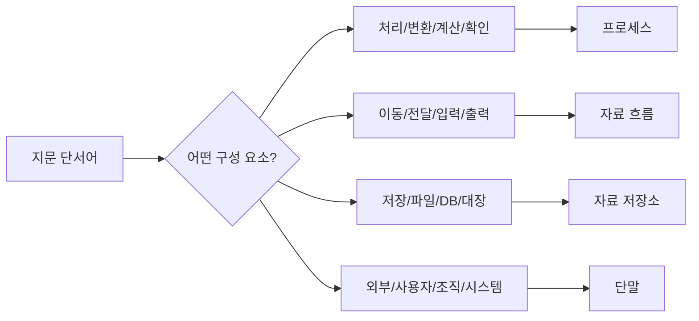

- 단서어별 빠른 매칭:

| 단서어 | 구성 요소 |
|---|---|
| 처리, 변환, 계산, 검증, 분류, 확인 | 프로세스 |
| 이동, 전달, 입력, 출력, 요청, 결과, 코드 | 자료 흐름 |
| 저장, 보관, 파일, DB, 장부, 대장, Repository | 자료 저장소 |
| 사용자, 고객, 공장, 부서, 외부 시스템, 기관 | 단말 |

- 보기 판별 예시:

| 보기 | 판단 | 이유 |
|---|---|---|
| 프로세스는 입력 자료를 출력 자료로 변환한다 | O | 프로세스의 핵심 역할 |
| 자료 흐름은 자료가 이동하는 경로를 나타낸다 | O | 자료 흐름의 정의 |
| 자료 저장소는 자료를 보관하는 장소다 | O | 저장소의 정의 |
| 단말은 시스템 내부에서 자료를 처리하는 모듈이다 | X | 단말은 외부 주체 |
| 자료 저장소와 단말은 직접 연결해도 무방하다 | X | 일반적으로 프로세스를 거쳐야 함 |
| DFD는 제어 흐름보다 자료 흐름을 중점적으로 표현한다 | O | DFD의 핵심 |

- 문제 풀이 순서:
  1. 지문에서 동작인지, 데이터인지, 저장 위치인지, 외부 주체인지 본다.
  2. 동작이면 프로세스, 데이터 이동이면 자료 흐름, 보관이면 저장소, 외부면 단말로 매칭한다.
  3. 연결 관계 문제가 나오면 단말-저장소, 저장소-저장소, 단말-단말 직접 연결을 의심한다.

---

## 21. 자주 나오는 함정

```mermaid
flowchart TD
    A["DFD 함정"] --> H1["단말과 프로세스 혼동"]
    A --> H2["자료 흐름과 프로세스 이름 혼동"]
    A --> H3["자료 저장소와 단말 직접 연결"]
    A --> H4["DFD를 순서도로 오해"]
    A --> H5["저장소를 처리 기능으로 오해"]
```

- 함정 1: 단말을 내부 모듈로 착각
  - 단말은 시스템 외부의 사람, 조직, 외부 시스템이다.
  - 내부 처리 기능은 프로세스다.

- 함정 2: 자료 흐름에 동작 이름 붙이기
  - `주문한다`, `확인한다`는 프로세스 이름에 가깝다.
  - `주문 정보`, `확인 결과`는 자료 흐름 이름에 가깝다.

- 함정 3: 저장소와 단말 직접 연결
  - 단말이 저장소를 직접 읽고 쓰는 식의 표현은 일반적으로 부적절하다.
  - 중간에 프로세스가 있어야 한다.

- 함정 4: 자료 저장소를 프로세스로 착각
  - `고객 DB`는 저장소다.
  - `고객 정보 조회`는 프로세스다.

- 함정 5: DFD를 흐름도와 혼동
  - DFD는 자료 흐름 중심이다.
  - 순서도는 제어 흐름과 절차 중심이다.

- 함정 6: DFD가 시간 순서를 엄밀히 나타낸다고 오해
  - DFD의 화살표는 자료 이동 방향이지 반드시 시간 순서 전체를 의미하지 않는다.

- 함정 7: 모든 세부 구현을 DFD에 넣으려 함
  - 요구사항 분석 단계의 DFD는 보통 업무와 자료 흐름을 이해하기 위한 모델이다.
  - 상세 구현은 설계 단계에서 더 구체화할 수 있다.

---

## 22. 암기 포인트

```mermaid
flowchart TD
    A["암기 프레임"] --> B["프"]
    A --> C["흐"]
    A --> D["저"]
    A --> E["단"]

    B --> B1["프로세스: 처리"]
    C --> C1["자료 흐름: 이동"]
    D --> D1["자료 저장소: 보관"]
    E --> E1["단말: 외부"]
```

- 1차 암기:
  - `프-흐-저-단`
  - 프로세스, 자료 흐름, 자료 저장소, 단말

- 2차 암기:
  - 프로세스 = 처리/변환
  - 자료 흐름 = 이동/전달
  - 자료 저장소 = 저장/보관
  - 단말 = 외부 주체

- 3차 암기:
  - 프로세스 이름은 동사구
  - 자료 흐름 이름은 이동하는 자료명
  - 자료 저장소 이름은 저장되는 자료명
  - 단말 이름은 외부 사람, 조직, 시스템명

- PDF 예시 암기:
  - `물품 확인` = 프로세스
  - `물품 코드` = 자료 흐름
  - `물품대장` = 자료 저장소
  - `공장` = 단말

- 시험 직전 10초 복습:
  - 처리하면 프로세스
  - 이동하면 자료 흐름
  - 저장하면 저장소
  - 외부면 단말
  - 단말과 저장소는 직접 연결하지 않는다

---

## 23. 빠른 복습

```mermaid
flowchart TD
    A["문제 풀이"] --> B{"무엇을 나타내는가?"}
    B -- "처리/변환" --> C["프로세스"]
    B -- "자료 이동" --> D["자료 흐름"]
    B -- "자료 보관" --> E["자료 저장소"]
    B -- "외부 입출력 주체" --> F["단말"]

    A --> G{"연결 관계 문제?"}
    G --> H["단말-저장소 직접 연결 금지"]
    G --> I["저장소-저장소 직접 연결 금지"]
    G --> J["프로세스를 거쳐야 함"]
```

- 챕터명:
  - `010 자료 흐름도의 구성 요소`

- 소속 영역:
  - `1과목 소프트웨어 설계`
  - `요구사항`
  - `구조적 분석`

- 반드시 외울 목록:
  - `프로세스(Process)`
  - `자료 흐름(Data Flow)`
  - `자료 저장소(Data Store)`
  - `단말(Terminator)`

- 가장 중요한 해석:
  - DFD는 자료의 이동과 변환을 표현한다.
  - 프로세스는 자료를 처리한다.
  - 자료 흐름은 자료가 이동하는 경로다.
  - 자료 저장소는 자료를 보관한다.
  - 단말은 시스템 외부의 입출력 주체다.

- 자주 나오는 문제 유형:
  - DFD 구성 요소 4개를 고르는 문제
  - 구성 요소 설명을 보고 이름을 고르는 문제
  - 예시가 어느 구성 요소인지 묻는 문제
  - 부적절한 DFD 연결 관계를 묻는 문제
  - DFD와 순서도, UML의 차이를 묻는 문제
  - Level 0, Level 1 같은 DFD 분할 개념을 묻는 문제

- 최종 암기 문장:
  - `자료 흐름도의 구성 요소는 프로세스, 자료 흐름, 자료 저장소, 단말이며, 자료가 외부 주체와 처리 과정, 저장소 사이를 어떻게 이동하는지 표현한다.`

---

## 24. 참고 링크

- 기준 PDF: `/Users/nes0903/Documents/study/정보처리기사/핵심요약집_2026_정보처리기사필기핵심요약.pdf`
- [Q-Net 정보처리기사 종목 페이지](https://www.q-net.or.kr/crf005.do?id=crf00503s02&jmCd=1320&jmInfoDivCcd=B0)
- [IBM - What is a Data Flow Diagram?](https://www.ibm.com/think/topics/data-flow-diagram)
- [IREB CPRE Glossary](https://cpre.ireb.org/en/downloads-and-resources/glossary)

<!-- study-links:start -->
## 관련 문서

- `자료 사전의 표기 기호`: [[정보처리기사/1과목 소프트웨어 설계/011 자료 사전의 표기 기호/011 자료 사전의 표기 기호|011 자료 사전의 표기 기호]]
- `유스케이스 다이어그램`: [[정보처리기사/1과목 소프트웨어 설계/018 유스케이스 다이어그램 - 액터(Actor)/018 유스케이스 다이어그램 - 액터(Actor)|018 유스케이스 다이어그램 - 액터(Actor)]]
- `요구사항 분석`: [[정보처리기사/1과목 소프트웨어 설계/009 요구사항 분석/009 요구사항 분석|009 요구사항 분석]]
- `분석 도구`: [[정보처리기사/2과목 소프트웨어 개발/094 소스 코드 품질 분석 도구 - 정적 분석 도구/094 소스 코드 품질 분석 도구 - 정적 분석 도구|094 소스 코드 품질 분석 도구 - 정적 분석 도구]]
- `uml`: [[정보처리기사/1과목 소프트웨어 설계/013 UML/013 UML|013 UML]]
<!-- study-links:end -->
