# 011 자료 사전의 표기 기호

작성 기준일: 2026-05-02  
과목: `1과목 소프트웨어 설계`  
기준 PDF: `/Users/nes0903/Documents/study/정보처리기사/핵심요약집_2026_정보처리기사필기핵심요약.pdf`  
PDF 확인 위치: `2페이지`  
검색 보강: IBM DFD 설명, IREB CPRE 요구공학 용어집, 자료 사전 표기법 자료, Q-Net 정보처리기사 시험 정보를 함께 확인하여 시험 중심으로 확장 정리

---

## 1. 한 줄 요약

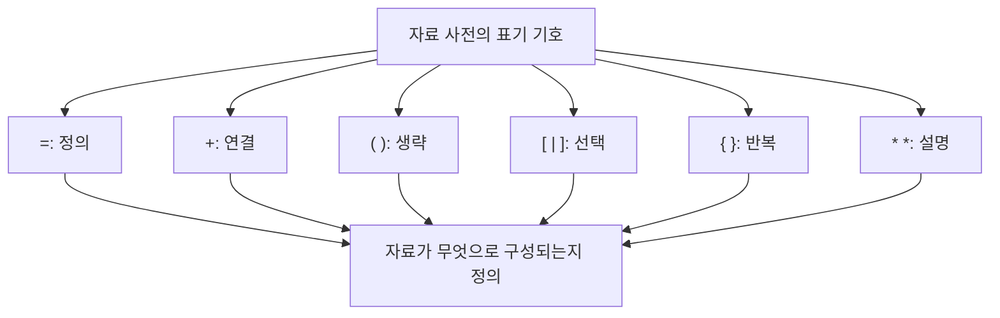

- 자료 사전(Data Dictionary)은 DFD에 나타난 자료 흐름과 자료 저장소의 자료 구조, 의미, 구성 요소를 표준 기호로 정의하는 문서화 도구다.
- PDF 기준 표기 기호는 `=`, `+`, `( )`, `[ | ]`, `{ }`, `* *` 6개다.
- 시험에서는 기호와 의미를 그대로 매칭하는 문제, 예시 식을 보고 기호 의미를 묻는 문제, `( )` 생략과 `[ | ]` 선택을 구분하는 문제가 자주 나온다.
- 자료 사전은 DFD 그림만으로 알 수 없는 자료의 내부 구조를 보완한다.
- 암기 축약어는 `정-연-생-선-반-설`로 잡으면 빠르다.

---

## 2. PDF 기준 핵심

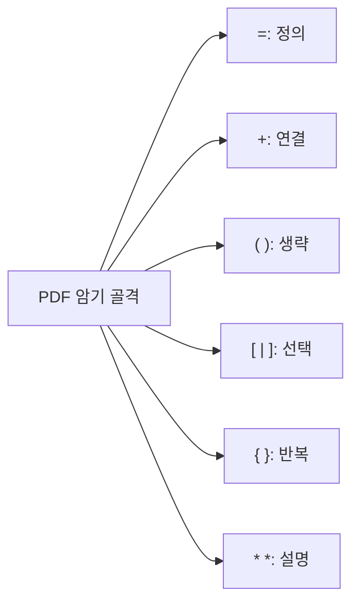

- PDF에 제시된 자료 사전 표기 기호는 다음과 같다.
  - `=` : 정의
  - `+` : 연결
  - `( )` : 생략
  - `[ | ]` : 선택
  - `{ }` : 반복
  - `* *` : 설명

- 이 챕터의 최소 암기 목표:
  - 기호 6개와 의미를 정확히 연결한다.
  - 자료 사전이 DFD와 함께 사용되는 이유를 이해한다.
  - 예시 표현에서 어떤 기호가 어떤 구조를 뜻하는지 해석한다.
  - `생략`, `선택`, `반복`을 구분한다.

- 시험에서 가장 중요한 매칭:

| 기호 | 의미 | 한 줄 해석 |
|---|---|---|
| `=` | 정의 | 왼쪽 자료가 오른쪽 자료들로 구성됨 |
| `+` | 연결 | 여러 자료 요소를 함께 연결 |
| `( )` | 생략 | 있어도 되고 없어도 되는 선택적 항목 |
| `[ | ]` | 선택 | 여러 대안 중 하나를 선택 |
| `{ }` | 반복 | 항목이 0회 이상 또는 여러 번 반복 |
| `* *` | 설명 | 주석, 부가 설명, 의미 설명 |

---

## 3. 자료 사전의 기본 개념

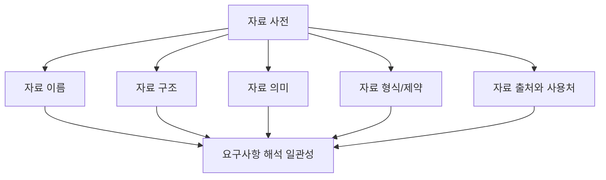

- 자료 사전은 시스템에서 사용하는 자료 항목의 정의를 모아둔 사전이다.
- 자료 사전은 DFD에 등장하는 자료 흐름과 자료 저장소의 이름만으로 알기 어려운 세부 구조를 설명한다.
- IBM은 DFD가 정보 시스템이나 업무 프로세스에서 데이터 흐름을 시각적으로 표현한다고 설명한다.
- DFD가 자료의 이동을 그림으로 보여준다면, 자료 사전은 그 자료가 어떤 항목으로 구성되어 있는지 문장과 기호로 설명한다.

- 자료 사전에 들어갈 수 있는 정보:
  - 자료 이름
  - 별칭
  - 자료의 설명
  - 자료의 구성 요소
  - 자료형
  - 길이
  - 허용 값
  - 단위
  - 범위
  - 출처
  - 목적지
  - 사용 프로세스
  - 관련 자료 저장소

- 자료 사전의 목적:
  - 자료 이름의 의미를 통일한다.
  - 요구사항의 모호함을 줄인다.
  - 분석가, 개발자, 사용자 간 의사소통을 돕는다.
  - DFD의 자료 흐름과 저장소를 구체화한다.
  - 설계와 구현 단계에서 데이터 구조를 정하는 기준이 된다.
  - 테스트와 검증에서 어떤 자료가 필요한지 확인하게 한다.

- 시험 포인트:
  - 자료 사전은 `자료에 관한 자료`, 즉 메타데이터 성격을 가진다.
  - 자료 사전은 구조적 분석에서 DFD와 함께 사용된다.
  - 자료 사전은 프로그램 알고리즘을 표현하는 도구가 아니라 자료 정의 도구다.

---

## 4. DFD와 자료 사전의 관계

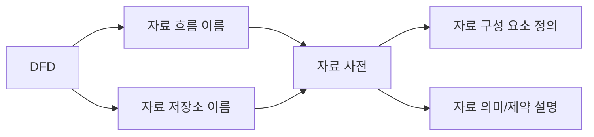

- DFD는 자료가 어디서 와서 어디로 가는지를 표현한다.
- 자료 사전은 DFD에 나타난 자료의 내부 구조와 의미를 정의한다.

- 예시:
  - DFD 자료 흐름: `주문 정보`
  - 자료 사전 정의: `주문 정보 = 주문번호 + 고객번호 + {주문상품} + 주문일자`
  - 자료 사전 추가 설명: `* 주문상품은 하나 이상의 상품 주문 항목을 의미한다 *`

- DFD만 보면 알기 어려운 점:
  - `주문 정보`가 어떤 항목으로 구성되는지 알기 어렵다.
  - `고객 정보`에 주소가 포함되는지 알기 어렵다.
  - `상품 목록`이 하나인지 여러 개인지 알기 어렵다.
  - 어떤 항목이 필수이고 어떤 항목이 선택인지 알기 어렵다.

- 자료 사전이 보완하는 점:
  - 자료 구조를 명확히 한다.
  - 반복 항목을 구분한다.
  - 선택 항목을 구분한다.
  - 생략 가능한 항목을 구분한다.
  - 주석으로 자료 의미를 보충한다.

- 시험 포인트:
  - DFD 구성 요소 중 자료 흐름과 자료 저장소는 자료 사전으로 구체화하기 좋다.
  - 자료 사전은 DFD의 모호성을 줄이는 보완 문서다.

---

## 5. 기호 전체 비교

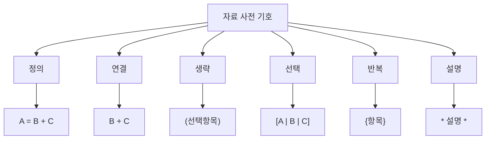

| 기호 | PDF 의미 | 일반적 표현 | 대표 예시 | 해석 |
|---|---|---|---|---|
| `=` | 정의 | is composed of | `고객정보 = 고객번호 + 고객명` | 고객정보는 고객번호와 고객명으로 구성 |
| `+` | 연결 | AND, sequence | `성명 = 성 + 이름` | 성과 이름을 연결 |
| `( )` | 생략 | optional | `고객명 = 성 + (중간이름) + 이름` | 중간이름은 있어도 되고 없어도 됨 |
| `[ | ]` | 선택 | OR, selection | `결제수단 = [카드 | 계좌이체 | 현금]` | 셋 중 하나 선택 |
| `{ }` | 반복 | repetition | `주문 = 주문번호 + {주문상품}` | 주문상품이 반복됨 |
| `* *` | 설명 | comment | `* 주문상품은 1개 이상 가능 *` | 주석 또는 설명 |

- 가장 쉬운 구분:
  - `=`는 왼쪽 자료를 오른쪽 구조로 정의한다.
  - `+`는 자료 요소를 이어 붙인다.
  - `( )`는 없어도 되는 항목이다.
  - `[ | ]`는 여러 선택지 중 하나다.
  - `{ }`는 여러 번 반복될 수 있는 항목이다.
  - `* *`는 해석을 돕는 설명이다.

- 시험 포인트:
  - 기호와 의미를 그대로 묻는 문제가 많다.
  - 예시를 보고 `선택`, `생략`, `반복`을 구분해야 한다.
  - `+`는 산술 덧셈이 아니라 자료 요소의 연결이다.

---

## 6. `=` 정의

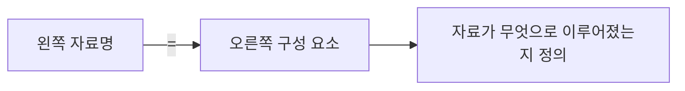

- 의미:
  - `=`는 자료 항목이 무엇으로 구성되어 있는지 정의한다.
  - 일반 자료 사전 표기법에서는 `is composed of`, `consists of`의 의미로 사용된다.
  - PDF에서는 `정의`로 제시한다.

- 예시:
  - `고객정보 = 고객번호 + 고객명 + 연락처`
  - `주문정보 = 주문번호 + 고객번호 + 주문일자 + {주문상품}`
  - `상품정보 = 상품코드 + 상품명 + 단가 + 재고수량`

- 해석:
  - `고객정보`라는 자료는 `고객번호`, `고객명`, `연락처`로 구성된다.
  - 왼쪽은 정의되는 자료 이름이다.
  - 오른쪽은 그 자료를 구성하는 요소다.

- 주의:
  - `=`는 수학적 같음이라기보다 자료 구조의 정의다.
  - `=` 오른쪽에는 다른 기호 `+`, `( )`, `[ | ]`, `{ }`, `* *`가 함께 올 수 있다.

- 시험 포인트:
  - `정의`, `구성된다`, `이루어진다`, `is composed of`가 나오면 `=`를 떠올린다.

---

## 7. `+` 연결

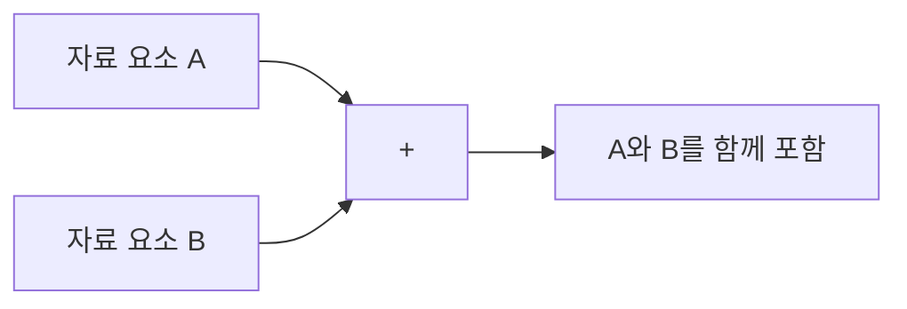

- 의미:
  - `+`는 여러 자료 요소를 연결한다.
  - 일반 자료 사전 표기법에서는 `AND`, `sequence`, `concatenation`의 의미로 쓰인다.
  - PDF에서는 `연결`로 제시한다.

- 예시:
  - `성명 = 성 + 이름`
  - `주소 = 우편번호 + 기본주소 + 상세주소`
  - `계좌정보 = 은행코드 + 계좌번호 + 예금주명`

- 해석:
  - `성명`은 `성`과 `이름`이 함께 있어야 구성된다.
  - `주소`는 `우편번호`, `기본주소`, `상세주소`가 연결되어 구성된다.

- 주의:
  - `+`는 산술 덧셈이 아니다.
  - `+`는 두 값의 합계를 구하는 것이 아니라 자료 요소를 이어 구성한다는 뜻이다.
  - 자료 항목이 필수인지 선택인지 구분하려면 `( )`나 `[ | ]`가 함께 사용될 수 있다.

- 시험 포인트:
  - `연결`, `AND`, `순서`, `연속`, `결합`이 나오면 `+`를 떠올린다.

---

## 8. `( )` 생략

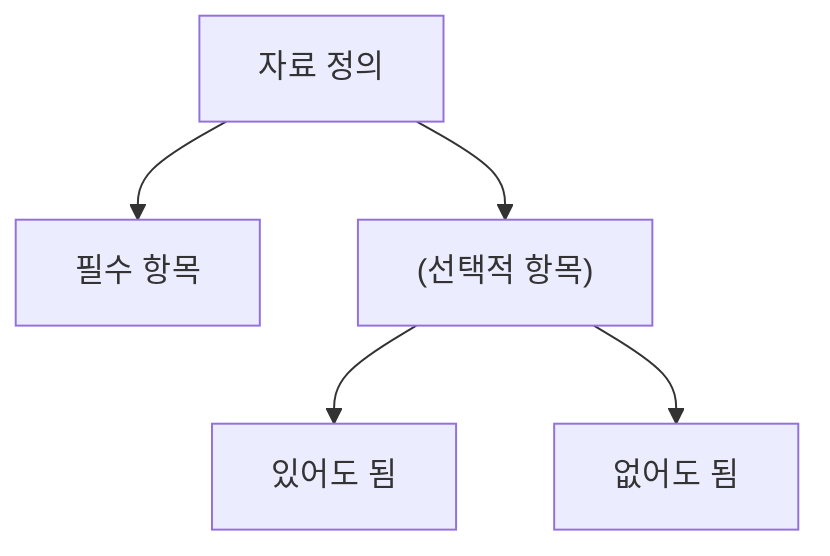

- 의미:
  - `( )`는 생략 가능한 선택적 항목을 나타낸다.
  - PDF에서는 `생략`으로 제시한다.
  - 일반 자료 사전 표기법에서는 optional data의 의미로 설명된다.

- 예시:
  - `고객명 = 성 + (중간이름) + 이름`
  - `주소 = 우편번호 + 기본주소 + (상세주소)`
  - `전화번호 = 국가번호 + 지역번호 + 가입자번호 + (내선번호)`

- 해석:
  - `중간이름`은 있을 수도 있고 없을 수도 있다.
  - `상세주소`는 아파트 동/호수처럼 필요할 수도 있고 없을 수도 있다.
  - `내선번호`는 회사 전화번호에는 있을 수 있지만 개인 휴대전화에는 없을 수 있다.

- `[ | ]`와의 차이:
  - `( )`는 특정 항목이 `있거나 없거나`이다.
  - `[ | ]`는 여러 대안 중 `하나를 고르는 것`이다.

- 시험 포인트:
  - `생략 가능`, `있어도 되고 없어도 됨`, `optional`이 나오면 `( )`를 떠올린다.

---

## 9. `[ | ]` 선택

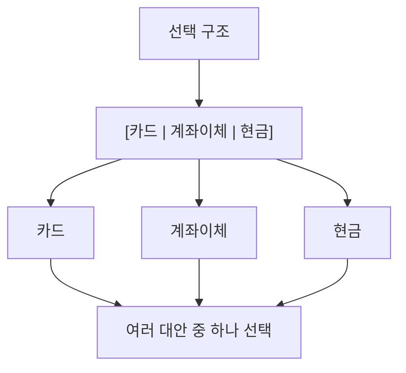

- 의미:
  - `[ | ]`는 여러 대안 중 하나를 선택하는 구조다.
  - PDF에서는 `선택`으로 제시한다.
  - 일반 자료 사전 표기법에서는 OR 또는 selection의 의미로 설명된다.

- 예시:
  - `결제수단 = [카드 | 계좌이체 | 현금]`
  - `회원등급 = [일반 | 우수 | VIP]`
  - `배송방법 = [택배 | 방문수령 | 퀵배송]`

- 해석:
  - 결제수단은 카드, 계좌이체, 현금 중 하나다.
  - 회원등급은 일반, 우수, VIP 중 하나다.
  - 배송방법은 택배, 방문수령, 퀵배송 중 하나다.

- `( )`와의 차이:
  - `[ | ]`는 대안 중 선택이다.
  - `( )`는 항목 자체가 생략 가능하다는 뜻이다.

- `{ }`와의 차이:
  - `[ | ]`는 하나를 고르는 것이다.
  - `{ }`는 같은 구조가 반복되는 것이다.

- 시험 포인트:
  - `선택`, `택일`, `대안`, `OR`, `choice`, `|`가 나오면 `[ | ]`를 떠올린다.

---

## 10. `{ }` 반복

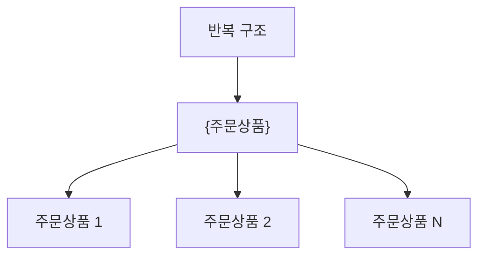

- 의미:
  - `{ }`는 같은 자료 항목이나 자료 구조가 반복됨을 나타낸다.
  - PDF에서는 `반복`으로 제시한다.
  - 일반 자료 사전 표기법에서는 repetition 또는 iteration의 의미로 설명된다.

- 예시:
  - `주문 = 주문번호 + 고객번호 + {주문상품}`
  - `영수증 = 영수증번호 + 발행일자 + {구매항목}`
  - `수강신청 = 학번 + 학기 + {수강과목}`

- 해석:
  - 하나의 주문에는 여러 주문상품이 포함될 수 있다.
  - 하나의 영수증에는 여러 구매항목이 포함될 수 있다.
  - 하나의 수강신청에는 여러 수강과목이 포함될 수 있다.

- 반복 횟수:
  - 교재나 표기법에 따라 `{항목}`을 0회 이상 반복으로 보기도 하고, 문맥상 1회 이상 반복으로 해석하기도 한다.
  - 정보처리기사에서는 PDF의 `반복` 의미를 우선 외운다.
  - 필요하면 `1{항목}N`처럼 최소/최대 반복 횟수를 덧붙여 표현하는 자료도 있다.

- 시험 포인트:
  - `반복`, `여러 개`, `목록`, `배열`, `복수 항목`, `iteration`, `repetition`이 나오면 `{ }`를 떠올린다.

---

## 11. `* *` 설명

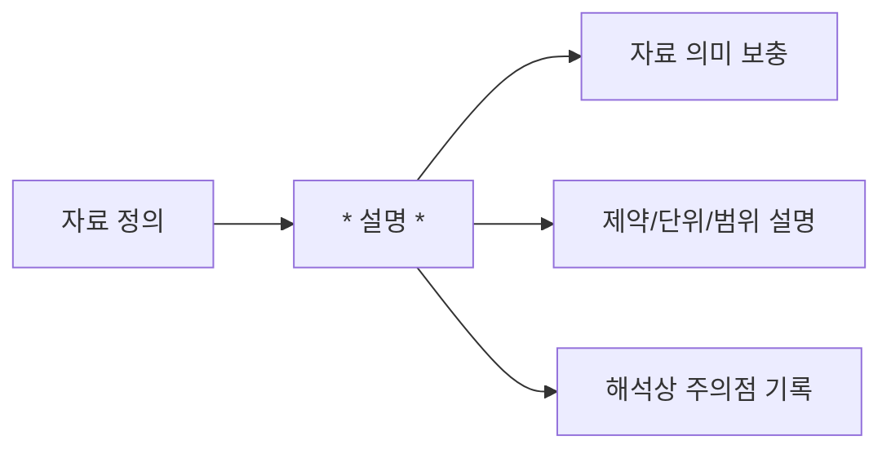

- 의미:
  - `* *`는 자료 항목에 대한 주석이나 설명을 나타낸다.
  - PDF에서는 `설명`으로 제시한다.
  - 일반 자료 사전 표기법에서는 comment 또는 additional information의 의미로 사용된다.

- 예시:
  - `주문금액 = 상품금액 + 배송비 + (할인금액) * 단위: 원 *`
  - `나이 = 정수 * 범위: 0..150 *`
  - `회원등급 = [일반 | 우수 | VIP] * 등급은 전월 구매액 기준으로 산정 *`

- 해석:
  - 자료 구조 자체만으로는 부족한 의미를 덧붙인다.
  - 단위, 범위, 산정 기준, 업무 규칙을 설명할 수 있다.

- 주의:
  - `* *`는 반복 기호가 아니다.
  - 프로그래밍 언어의 곱셈이나 와일드카드와 혼동하면 안 된다.
  - 시험에서는 `설명`, `주석`, `comment`와 연결한다.

- 시험 포인트:
  - `설명`, `주석`, `부가 정보`, `comment`가 나오면 `* *`를 떠올린다.

---

## 12. 복합 예시로 해석하기

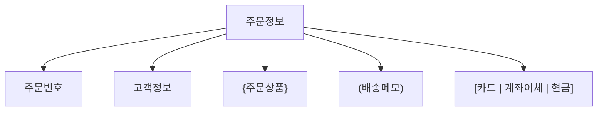

- 예시 정의:
  - `주문정보 = 주문번호 + 고객정보 + {주문상품} + (배송메모) + 결제수단`
  - `결제수단 = [카드 | 계좌이체 | 현금]`
  - `고객정보 = 고객번호 + 고객명 + (연락처)`
  - `주문상품 = 상품코드 + 상품명 + 수량 + 단가`
  - `* 주문상품은 주문에 포함된 상품 항목을 의미한다 *`

- 기호 해석:

| 표현 | 사용 기호 | 의미 |
|---|---|---|
| `주문정보 = ...` | `=` | 주문정보의 구성을 정의 |
| `주문번호 + 고객정보` | `+` | 여러 자료 요소 연결 |
| `{주문상품}` | `{ }` | 주문상품이 반복됨 |
| `(배송메모)` | `( )` | 배송메모는 생략 가능 |
| `[카드 | 계좌이체 | 현금]` | `[ | ]` | 결제수단 중 하나 선택 |
| `* 주문상품은 ... *` | `* *` | 주석 또는 설명 |

- 분석 포인트:
  - 하나의 주문에 여러 주문상품이 있을 수 있으므로 `{주문상품}`이 자연스럽다.
  - 배송메모는 사용자가 입력하지 않을 수 있으므로 `(배송메모)`가 자연스럽다.
  - 결제수단은 대안 중 하나를 고르는 것이므로 `[ | ]`가 자연스럽다.

- 시험 포인트:
  - 복합 예시에서 각 기호를 따로 떼어 해석해야 한다.
  - 한 줄에 여러 기호가 같이 나올 수 있다.

---

## 13. 생략, 선택, 반복 구분

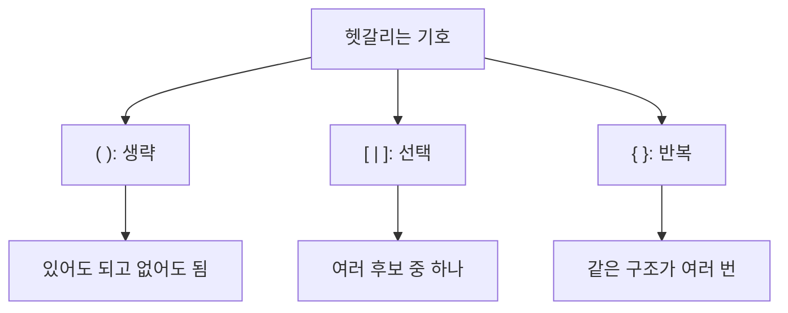

- `( )` 생략:
  - 항목 자체가 있을 수도 있고 없을 수도 있다.
  - 예: `고객명 = 성 + (중간이름) + 이름`
  - 중간이름은 있을 수도 있고 없을 수도 있다.

- `[ | ]` 선택:
  - 여러 후보 중 하나를 고른다.
  - 예: `성별 = [남 | 여 | 기타]`
  - 남, 여, 기타 중 하나다.

- `{ }` 반복:
  - 같은 자료 구조가 여러 번 나올 수 있다.
  - 예: `주문 = 주문번호 + {주문상품}`
  - 주문상품은 여러 개일 수 있다.

- 빠른 비교:

| 구분 | 질문 | 예시 | 기호 |
|---|---|---|---|
| 생략 | 이 항목이 없어도 되는가 | 연락처가 없을 수 있음 | `( )` |
| 선택 | 여러 후보 중 하나인가 | 결제수단 중 하나 | `[ | ]` |
| 반복 | 같은 항목이 여러 개인가 | 주문상품 여러 개 | `{ }` |

- 시험 포인트:
  - `optional`은 `( )`.
  - `OR`, `choice`, `대안`은 `[ | ]`.
  - `multiple`, `repetition`, `iteration`, `목록`은 `{ }`.

---

## 14. 자료 사전 작성 순서

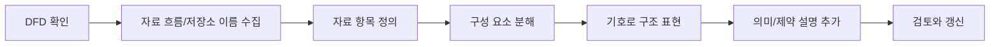

- 자료 사전은 보통 DFD와 함께 작성하거나 DFD 작성 후 보완한다.

- 작성 흐름:
  1. DFD에 등장하는 자료 흐름과 자료 저장소를 확인한다.
  2. 각 자료 이름의 의미를 정리한다.
  3. 자료가 어떤 하위 항목으로 구성되는지 분해한다.
  4. `=`, `+`, `( )`, `[ | ]`, `{ }`, `* *` 기호로 자료 구조를 표현한다.
  5. 자료형, 길이, 단위, 범위, 허용 값, 업무 규칙을 보충한다.
  6. 이해관계자와 검토해 의미가 맞는지 확인한다.
  7. DFD가 바뀌면 자료 사전도 함께 갱신한다.

- 작성 예시:
  - DFD 자료 흐름: `회원가입정보`
  - 자료 사전:
    - `회원가입정보 = 아이디 + 비밀번호 + 이름 + (추천인코드) + 연락처`
    - `연락처 = [휴대전화번호 | 이메일]`
    - `* 추천인코드는 추천 이벤트 기간에만 입력 가능 *`

- 시험 포인트:
  - 자료 사전은 한 번 작성하고 끝나는 문서가 아니라 DFD 변경과 함께 관리되어야 한다.
  - 자료 사전은 자료 구조와 의미를 표준화한다.

---

## 15. 자료 사전에 포함되는 정보

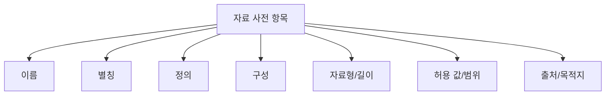

- 자료 사전은 표기 기호만 적는 표가 아니다.
- 자료를 정확하게 이해하기 위한 여러 정보를 함께 담을 수 있다.

- 주요 항목:
  - `이름`: 자료 항목의 공식 명칭
  - `별칭`: 같은 자료를 부르는 다른 이름
  - `정의`: 자료의 의미
  - `구성`: 하위 자료 요소의 구조
  - `자료형`: 문자, 숫자, 날짜 등
  - `길이`: 입력 가능한 자리 수
  - `허용 값`: 가능한 값 목록
  - `범위`: 최솟값과 최댓값
  - `단위`: 원, kg, cm 등
  - `출처`: 자료가 발생하는 곳
  - `목적지`: 자료가 사용되는 곳
  - `관련 프로세스`: DFD의 어떤 프로세스와 연결되는지
  - `관련 저장소`: 어떤 자료 저장소에 저장되는지

- 예시:

| 항목 | 예시 |
|---|---|
| 이름 | 주문금액 |
| 정의 | 주문상품 금액과 배송비, 할인금액을 반영한 최종 결제 금액 |
| 구성 | `주문금액 = 상품금액 + 배송비 + (할인금액)` |
| 자료형 | 숫자 |
| 단위 | 원 |
| 범위 | 0 이상 |
| 설명 | `* 할인금액이 없으면 0으로 처리 *` |

- 시험 포인트:
  - 자료 사전은 자료의 이름과 구조뿐 아니라 의미와 제약을 정리하는 데 쓰인다.
  - 단순히 DFD 기호를 다시 그리는 도구가 아니다.

---

## 16. 자료 흐름과 자료 저장소 정의 예시

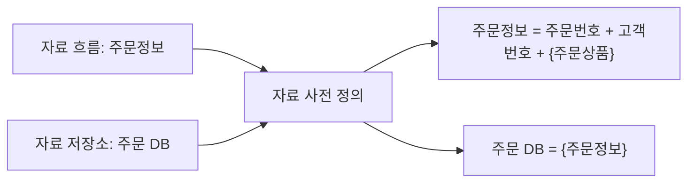

- 자료 흐름 정의 예시:
  - DFD의 자료 흐름: `주문정보`
  - 자료 사전 정의: `주문정보 = 주문번호 + 고객번호 + 주문일자 + {주문상품} + 결제수단`

- 자료 저장소 정의 예시:
  - DFD의 자료 저장소: `주문 DB`
  - 자료 사전 정의: `주문 DB = {주문정보}`

- 하위 항목 정의 예시:
  - `주문상품 = 상품코드 + 상품명 + 수량 + 단가`
  - `결제수단 = [카드 | 계좌이체 | 현금]`
  - `고객정보 = 고객번호 + 고객명 + (연락처)`

- 해석:
  - 자료 흐름은 한 번 이동하는 자료 구조를 정의한다.
  - 자료 저장소는 여러 건의 자료가 저장될 수 있으므로 `{주문정보}`처럼 반복 구조로 표현하기 쉽다.
  - 하위 항목도 계속 정의해 원자적인 자료 요소까지 내려갈 수 있다.

- 시험 포인트:
  - 자료 저장소는 복수의 자료를 보관하므로 반복 기호와 연결될 수 있다.
  - 자료 흐름과 자료 저장소의 이름은 자료 사전에서 구체적으로 정의된다.

---

## 17. DFD, 자료 사전, 자료 사전 기호 비교

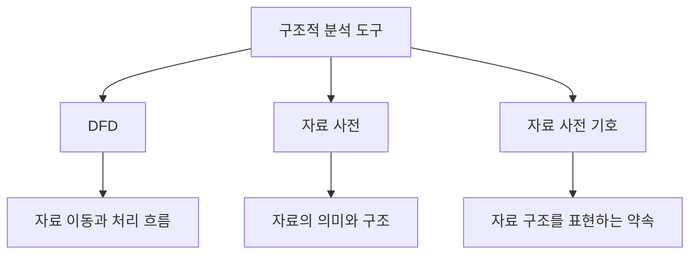

| 구분 | 역할 | 예시 |
|---|---|---|
| DFD | 자료가 어디서 와서 어디로 가는지 표현 | 고객 → 주문 접수 → 주문 DB |
| 자료 사전 | DFD에 나온 자료가 무엇인지 정의 | 주문정보 = 주문번호 + 고객번호 + {주문상품} |
| 자료 사전 기호 | 자료 정의를 간결하게 표현 | `=`, `+`, `( )`, `[ | ]`, `{ }`, `* *` |

- DFD와 자료 사전은 서로 보완 관계다.
- DFD는 흐름을 잘 보여주지만 자료 구조를 자세히 보여주지는 못한다.
- 자료 사전은 자료 구조를 잘 보여주지만 시스템 전체 흐름을 그림처럼 보여주지는 못한다.
- 자료 사전 기호는 자료 사전을 간결하고 일관되게 작성하기 위한 약속이다.

- 시험 포인트:
  - DFD 구성 요소를 묻는 문제와 자료 사전 기호를 묻는 문제를 구분한다.
  - DFD 구성 요소는 `프로세스`, `자료 흐름`, `자료 저장소`, `단말`.
  - 자료 사전 기호는 `=`, `+`, `( )`, `[ | ]`, `{ }`, `* *`.

---

## 18. 시험에서 보는 단서어

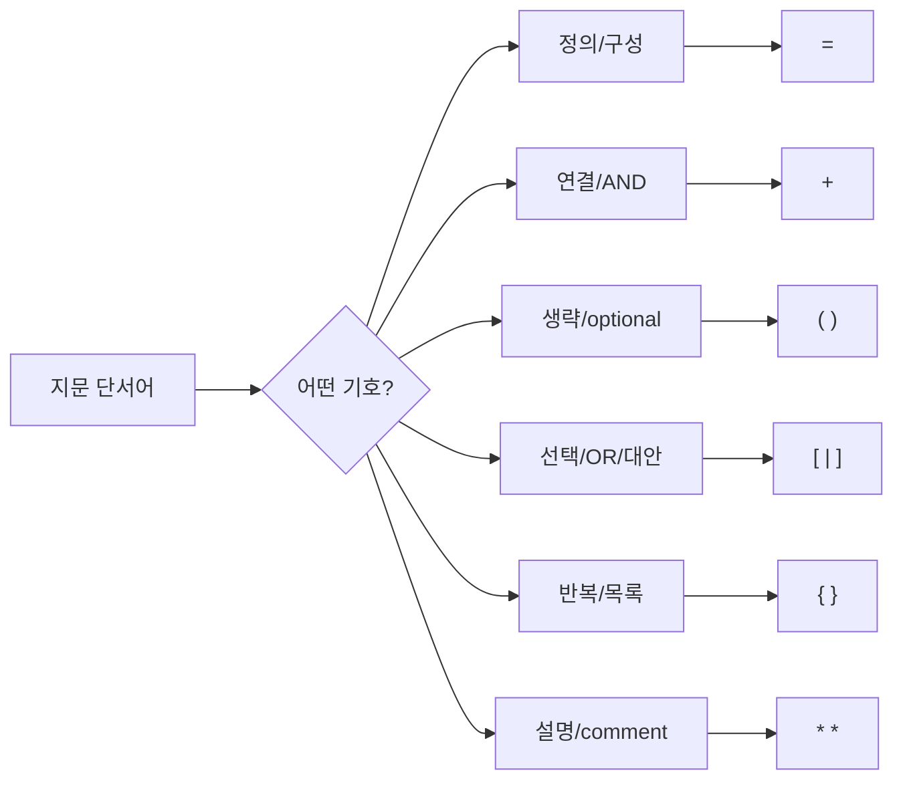

- 단서어별 빠른 매칭:

| 단서어 | 기호 |
|---|---|
| 정의, 구성, consists of, is composed of | `=` |
| 연결, AND, sequence, concatenation | `+` |
| 생략, 선택적 항목, 있어도 되고 없어도 됨, optional | `( )` |
| 선택, 대안, OR, 택일, choice | `[ | ]` |
| 반복, multiple, iteration, repetition, 목록 | `{ }` |
| 설명, 주석, comment, 부가 정보 | `* *` |

- 보기 판별 예시:

| 보기 | 판단 | 이유 |
|---|---|---|
| `=`는 자료의 구성을 정의한다 | O | PDF 기준 정의 |
| `+`는 자료 요소를 연결한다 | O | PDF 기준 연결 |
| `( )`는 반복을 의미한다 | X | `( )`는 생략 |
| `[ | ]`는 선택을 의미한다 | O | PDF 기준 선택 |
| `{ }`는 생략을 의미한다 | X | `{ }`는 반복 |
| `* *`는 설명을 의미한다 | O | PDF 기준 설명 |

- 문제 풀이 순서:
  1. 지문이 기호의 의미를 직접 묻는지 본다.
  2. 예시 식이 나오면 기호 주변의 자료 구조를 해석한다.
  3. `( )`, `[ | ]`, `{ }` 중 무엇인지 먼저 구분한다.
  4. `+`는 산술 연산이 아니라 자료 요소 연결임을 기억한다.

---

## 19. 자주 나오는 함정

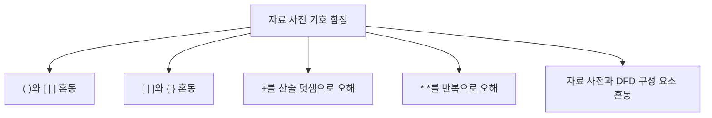

- 함정 1: `( )`와 `[ | ]` 혼동
  - `( )`는 생략 가능이다.
  - `[ | ]`는 여러 대안 중 선택이다.
  - 예: `(연락처)`는 연락처가 없어도 된다는 뜻이다.
  - 예: `[이메일 | 휴대전화]`는 둘 중 하나를 고른다는 뜻이다.

- 함정 2: `[ | ]`와 `{ }` 혼동
  - `[ | ]`는 하나를 선택한다.
  - `{ }`는 반복한다.
  - 예: `[카드 | 현금]`은 결제수단 선택이다.
  - 예: `{주문상품}`은 주문상품 목록이다.

- 함정 3: `+`를 덧셈으로 오해
  - 자료 사전의 `+`는 수학 덧셈이 아니라 자료 요소 연결이다.
  - `주소 = 우편번호 + 기본주소 + 상세주소`는 세 항목의 조합을 뜻한다.

- 함정 4: `* *`를 곱셈이나 와일드카드로 오해
  - 자료 사전의 `* *`는 설명 또는 주석이다.
  - 반복은 `{ }`다.

- 함정 5: 자료 사전 기호와 DFD 구성 요소 혼동
  - DFD 구성 요소: 프로세스, 자료 흐름, 자료 저장소, 단말
  - 자료 사전 기호: `=`, `+`, `( )`, `[ | ]`, `{ }`, `* *`

- 함정 6: 자료 사전이 DB 테이블 설계서와 완전히 같다고 생각
  - 자료 사전은 DB 설계와 연결될 수 있지만 요구사항 분석 단계에서는 DFD 자료 흐름과 자료 저장소의 의미를 정의하는 데 초점이 있다.

- 함정 7: 자료 사전은 구현 후에만 작성한다고 오해
  - 자료 사전은 요구사항 분석과 구조적 분석에서 모호성을 줄이기 위해 작성된다.

---

## 20. 암기 포인트

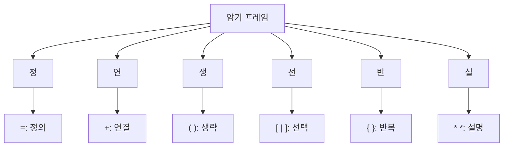

- 1차 암기:
  - `정-연-생-선-반-설`
  - 정의, 연결, 생략, 선택, 반복, 설명

- 2차 암기:
  - `=` = 정의
  - `+` = 연결
  - `( )` = 생략
  - `[ | ]` = 선택
  - `{ }` = 반복
  - `* *` = 설명

- 3차 암기:
  - 생략 = 없어도 됨
  - 선택 = 여러 대안 중 하나
  - 반복 = 여러 번 나옴
  - 설명 = 주석

- 말로 풀어 외우기:
  - `자료 사전은 자료를 정의하고, 연결하고, 생략 가능 항목과 선택 항목과 반복 항목을 표시하며, 설명을 붙인다.`

- 시험 직전 10초 복습:
  - 정의는 `=`
  - 연결은 `+`
  - 생략은 `( )`
  - 선택은 `[ | ]`
  - 반복은 `{ }`
  - 설명은 `* *`

---

## 21. 빠른 복습

```mermaid
flowchart TD
    A["문제 풀이"] --> B{"기호 의미 문제?"}
    B -- "정의" --> C["="]
    B -- "연결" --> D["+"]
    B -- "생략" --> E["( )"]
    B -- "선택" --> F["[ | ]"]
    B -- "반복" --> G["{ }"]
    B -- "설명" --> H["* *"]

    A --> I{"예시 해석 문제?"}
    I --> J["자료 구조를 왼쪽에서 오른쪽으로 해석"]
```

- 챕터명:
  - `011 자료 사전의 표기 기호`

- 소속 영역:
  - `1과목 소프트웨어 설계`
  - `요구사항`
  - `구조적 분석`

- 반드시 외울 목록:
  - `=` : 정의
  - `+` : 연결
  - `( )` : 생략
  - `[ | ]` : 선택
  - `{ }` : 반복
  - `* *` : 설명

- 가장 중요한 해석:
  - 자료 사전은 DFD에 나타난 자료 흐름과 자료 저장소의 자료 구조와 의미를 정의한다.
  - 자료 사전 기호는 자료 구성 관계를 간결하게 표현하는 약속이다.
  - 시험에서는 기호와 의미의 정확한 매칭이 핵심이다.

- 자주 나오는 문제 유형:
  - 자료 사전 표기 기호의 의미를 묻는 문제
  - 의미를 주고 기호를 고르는 문제
  - 예시 식에서 선택/생략/반복을 구분하는 문제
  - DFD와 자료 사전의 관계를 묻는 문제
  - 자료 사전 기호와 DFD 구성 요소를 섞은 오답을 판별하는 문제

- 최종 암기 문장:
  - `자료 사전의 표기 기호는 = 정의, + 연결, ( ) 생략, [ | ] 선택, { } 반복, * * 설명이다.`

---

## 22. 참고 링크

- 기준 PDF: `/Users/nes0903/Documents/study/정보처리기사/핵심요약집_2026_정보처리기사필기핵심요약.pdf`
- [Q-Net 정보처리기사 종목 페이지](https://www.q-net.or.kr/crf005.do?id=crf00503s02&jmCd=1320&jmInfoDivCcd=B0)
- [IBM - What is a Data Flow Diagram?](https://www.ibm.com/think/topics/data-flow-diagram)
- [IREB CPRE Glossary](https://cpre.ireb.org/en/downloads-and-resources/glossary)
- [GeeksforGeeks - What is Data Dictionary?](https://www.geeksforgeeks.org/dbms/what-is-data-dictionary/)

<!-- study-links:start -->
## 관련 문서

- `요구사항 분석`: [[정보처리기사/1과목 소프트웨어 설계/009 요구사항 분석/009 요구사항 분석|009 요구사항 분석]]
<!-- study-links:end -->
