# 012 HIPO

작성 기준일: 2026-05-02  
과목: `1과목 소프트웨어 설계`  
기준 PDF: `/Users/nes0903/Documents/study/정보처리기사/핵심요약집_2026_정보처리기사필기핵심요약.pdf`  
PDF 확인 위치: `2페이지`  
검색 보강: HIPO 개요 자료, IBM DFD 설명, 소프트웨어 분석/설계 도구 자료, Q-Net 정보처리기사 시험 정보를 함께 확인하여 시험 중심으로 확장 정리

---

## 1. 한 줄 요약

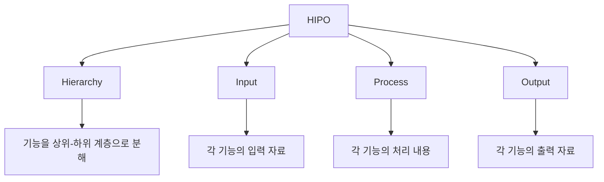

- HIPO는 `Hierarchy + Input + Process + Output`의 약자로, 하향식 소프트웨어 개발에서 기능을 계층적으로 분해하고 각 기능의 입력·처리·출력을 문서화하는 도구다.
- PDF 기준 핵심은 `하향식 소프트웨어 개발을 위한 문서화 도구`, `기호와 도표를 사용하므로 보기 쉽고 이해하기 쉬움`, `기능과 자료의 의존 관계를 동시에 표현 가능`이다.
- HIPO는 구조적 분석/설계에서 복잡한 시스템을 상위 기능에서 하위 기능으로 나누어 이해하기 쉽게 만든다.
- 시험에서는 HIPO를 DFD, 자료 사전, 순서도, 구조도와 비교해서 묻는 경우가 많다.
- 암기 문장은 `HIPO는 하향식으로 기능 계층을 나누고, 각 기능의 입력-처리-출력을 도표로 문서화하는 도구`로 잡으면 된다.

---

## 2. PDF 기준 핵심

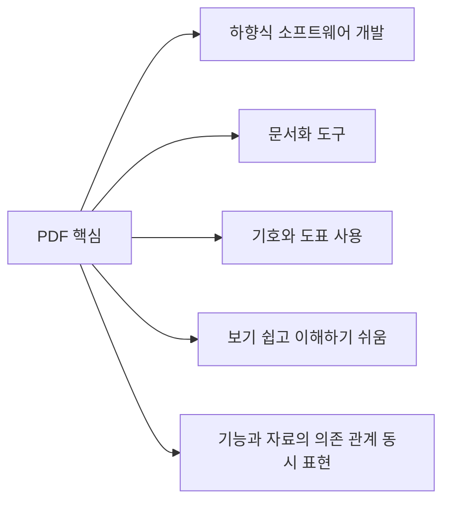

- PDF에 제시된 HIPO의 핵심은 다음과 같다.
  - 하향식 소프트웨어 개발을 위한 문서화 도구이다.
  - 기호, 도표 등을 사용하므로 보기 쉽고 이해하기도 쉽다.
  - 기능과 자료의 의존 관계를 동시에 표현할 수 있다.

- 이 챕터의 최소 암기 목표:
  - HIPO의 약자 의미
  - 하향식 개발과의 연결
  - 문서화 도구라는 성격
  - 도표를 사용해 이해하기 쉽다는 장점
  - 기능 계층과 입력·처리·출력의 관계
  - DFD와의 차이

- 시험에서 자주 바뀌는 표현:

| PDF 표현 | 같은 의미로 볼 수 있는 표현 |
|---|---|
| 하향식 소프트웨어 개발 | Top-down 개발, 상위 기능을 하위 기능으로 분해 |
| 문서화 도구 | 설계 문서화, 시스템 구조 표현, 기능 문서화 |
| 기호와 도표 사용 | 시각적 표현, 차트, 다이어그램 |
| 보기 쉽고 이해하기 쉬움 | 의사소통 용이, 가독성 높음 |
| 기능과 자료의 의존 관계 | 기능 계층과 입력/처리/출력 관계 |

---

## 3. HIPO의 기본 개념

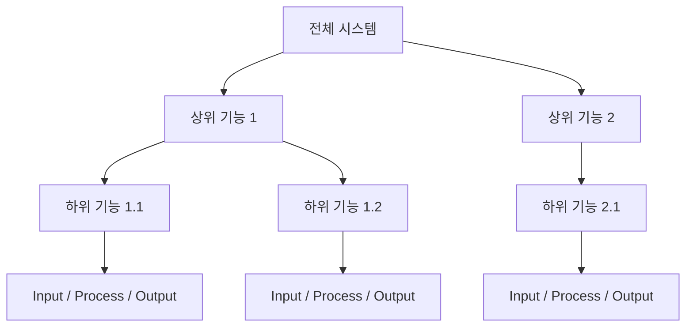

- HIPO는 시스템을 기능 단위로 계층화한 뒤, 각 기능이 어떤 입력을 받아 어떤 처리를 수행하고 어떤 출력을 만드는지 정리한다.
- CIO Wiki는 HIPO를 1970년대부터 사용된 시스템 분석·설계 보조 및 문서화 기법으로 설명하며, 시스템 모듈을 계층으로 표현하고 각 모듈을 문서화하는 데 쓰인다고 설명한다.
- HIPO는 복잡한 시스템을 작은 기능 단위로 나누기 때문에 분석가, 설계자, 개발자, 관리자 간 의사소통에 유리하다.

- HIPO의 핵심 질문:
  - 이 시스템은 어떤 상위 기능으로 구성되는가
  - 각 상위 기능은 어떤 하위 기능으로 나뉘는가
  - 각 기능은 어떤 입력을 받는가
  - 각 기능은 어떤 처리를 수행하는가
  - 각 기능은 어떤 출력을 만드는가
  - 기능끼리 어떤 의존 관계를 가지는가

- HIPO가 표현하는 것:
  - 시스템 기능의 계층 구조
  - 모듈 또는 기능의 분해 관계
  - 각 기능의 입력 자료
  - 각 기능의 처리 내용
  - 각 기능의 출력 자료
  - 기능과 자료의 관계

- HIPO가 직접 표현하기 어려운 것:
  - 상세 알고리즘의 모든 제어 흐름
  - 객체 간 메시지 순서
  - 데이터가 시스템 전체를 따라 이동하는 세부 경로
  - 조건 분기와 반복의 상세 로직

---

## 4. HIPO의 구성 요소

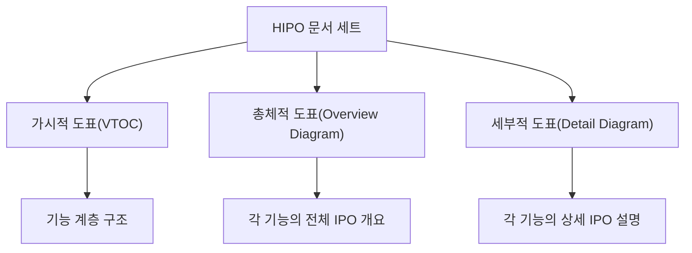

- HIPO는 단순히 하나의 그림만 의미하지 않는다.
- 전통적으로 HIPO 문서 세트는 기능 계층을 보여주는 도표와 각 기능의 IPO를 설명하는 도표로 구성된다.

- 가시적 도표(VTOC, Visual Table of Contents):
  - 시스템 전체 기능의 계층 구조를 보여준다.
  - 상위 기능과 하위 기능의 관계를 트리처럼 표현한다.
  - 전체 시스템을 한눈에 파악하게 한다.

- 총체적 도표(Overview Diagram):
  - 특정 기능이나 모듈의 입력, 처리, 출력을 개략적으로 보여준다.
  - 기능이 어떤 자료를 받아 어떤 결과를 내는지 전체 관점에서 설명한다.

- 세부적 도표(Detail Diagram):
  - 특정 기능의 입력, 처리, 출력 내용을 더 자세히 설명한다.
  - 처리 과정의 세부 내용, 자료 항목, 출력 결과를 구체화한다.

- 시험 포인트:
  - HIPO는 기능 계층만 그리는 도구가 아니라 IPO 관점의 문서화까지 포함한다.
  - `Hierarchy`는 가시적 도표와 연결된다.
  - `Input-Process-Output`은 총체적 도표와 세부적 도표에서 구체화된다.

---

## 5. Hierarchy: 기능 계층 구조

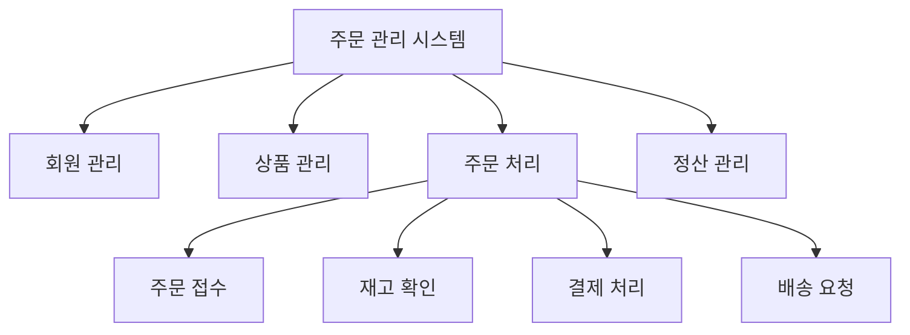

- `Hierarchy`는 시스템 기능을 상위 기능에서 하위 기능으로 분해한 구조다.
- HIPO는 하향식 개발을 전제로 하므로, 먼저 전체 시스템을 큰 기능으로 나누고 다시 하위 기능으로 세분화한다.

- 기능 계층이 필요한 이유:
  - 복잡한 시스템을 이해하기 쉽게 만든다.
  - 기능의 포함 관계를 파악할 수 있다.
  - 모듈 분할의 기준이 된다.
  - 작업 분담과 문서화를 쉽게 한다.
  - 누락된 기능이나 중복 기능을 찾는 데 도움이 된다.

- 좋은 계층 구조의 특징:
  - 상위 기능은 하위 기능을 포괄한다.
  - 하위 기능은 상위 기능을 완성하는 데 필요한 기능이다.
  - 같은 계층의 기능은 비슷한 추상화 수준을 가진다.
  - 너무 깊거나 너무 얕지 않게 분해한다.
  - 기능 이름은 명확한 동사구 또는 업무명으로 표현한다.

- 시험 포인트:
  - `계층`, `하향식`, `상위 기능`, `하위 기능`, `모듈 분해`가 나오면 HIPO의 Hierarchy를 떠올린다.
  - HIPO는 시스템을 작은 모듈로 분해해 이해하기 쉽게 한다.

---

## 6. IPO: 입력, 처리, 출력

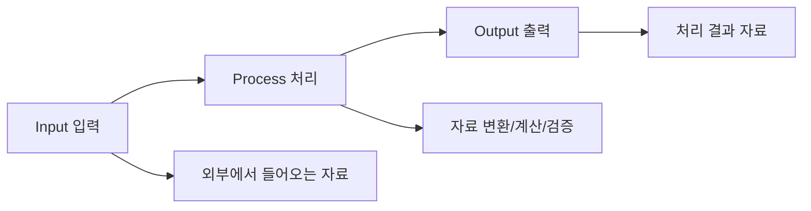

- `Input`은 기능이 처리하기 위해 받는 자료다.
- `Process`는 입력을 출력으로 바꾸는 처리 내용이다.
- `Output`은 처리 결과로 생성되는 자료다.

- HIPO에서 IPO가 중요한 이유:
  - 기능을 단순 이름으로만 두지 않고 자료 관점으로 설명한다.
  - 기능이 무엇을 받아 무엇을 내는지 명확해진다.
  - 기능 간 의존 관계를 이해하기 쉬워진다.
  - 테스트 입력과 기대 출력을 생각하기 쉬워진다.

- 예시:

| 기능 | Input | Process | Output |
|---|---|---|---|
| 회원 인증 | 아이디, 비밀번호 | 사용자 정보 조회, 비밀번호 검증 | 인증 성공/실패 결과 |
| 주문 접수 | 주문 정보, 고객 정보 | 주문 유효성 검증, 주문 번호 생성 | 주문 내역, 주문 확인서 |
| 재고 확인 | 상품 코드, 주문 수량 | 현재 재고 조회, 가능 수량 비교 | 재고 가능 여부 |
| 결제 처리 | 결제 요청 정보 | 결제 승인 요청, 결과 검증 | 결제 승인 결과 |

- 시험 포인트:
  - HIPO의 `I-P-O`는 기능별 입력, 처리, 출력이다.
  - IPO는 DFD의 자료 흐름과 유사해 보이지만, HIPO는 기능 계층과 기능별 설명에 초점을 둔다.

---

## 7. 가시적 도표(VTOC)

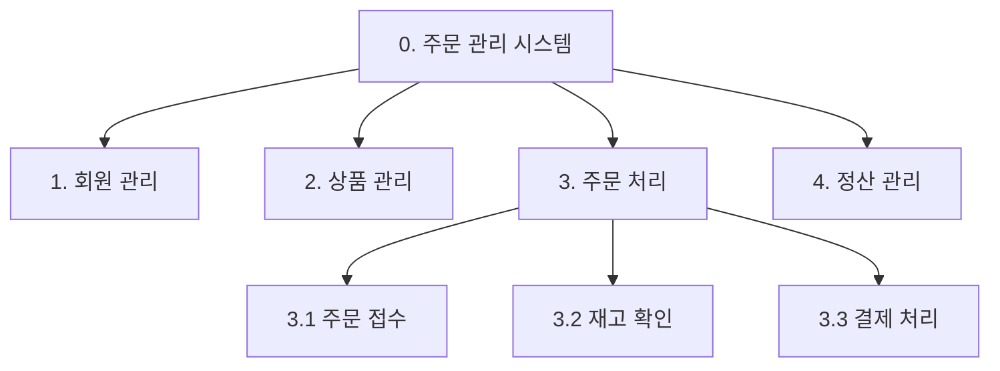

- 가시적 도표는 HIPO의 전체 목차 역할을 하는 도표다.
- VTOC는 Visual Table of Contents의 약자로, 시스템 기능을 번호와 이름이 붙은 계층 구조로 보여준다.
- 마치 책의 목차처럼 전체 기능의 위치와 관계를 한눈에 보여준다.

- 가시적 도표의 역할:
  - 전체 시스템 구조 파악
  - 기능 분해 관계 표현
  - 상위 기능과 하위 기능의 관계 표현
  - 각 기능에 대응하는 IPO 도표의 위치 표시
  - 개발자와 이해관계자의 공통 이해 지원

- 작성 포인트:
  - 최상위에는 전체 시스템이나 주요 프로그램을 둔다.
  - 하위에는 주요 기능을 둔다.
  - 더 아래에는 세부 기능을 둔다.
  - 기능 번호를 붙여 추적하기 쉽게 한다.
  - 같은 계층의 기능은 비슷한 수준으로 맞춘다.

- 시험 포인트:
  - 가시적 도표는 기능의 계층 구조를 보여주는 도표다.
  - `전체 목차`, `Visual Table of Contents`, `기능 계층`이 나오면 가시적 도표와 연결한다.

---

## 8. 총체적 도표(Overview Diagram)

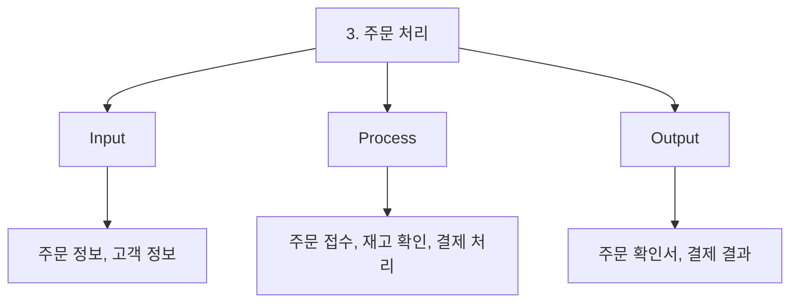

- 총체적 도표는 특정 기능의 입력, 처리, 출력을 전체적으로 정리한 도표다.
- 가시적 도표가 기능의 위치를 보여준다면, 총체적 도표는 그 기능이 무엇을 받아 무엇을 처리하고 무엇을 내보내는지 보여준다.

- 총체적 도표의 역할:
  - 기능의 개요 설명
  - 입력 자료와 출력 자료의 큰 관계 표현
  - 처리 내용의 요약
  - 하위 세부 도표로 들어가기 전 전체 이해 제공

- 예시:
  - 기능명: `주문 처리`
  - 입력: 주문 정보, 고객 정보, 상품 정보
  - 처리: 주문 접수, 재고 확인, 결제 처리
  - 출력: 주문 확인서, 결제 승인 결과, 배송 요청 정보

- 시험 포인트:
  - 총체적 도표는 기능의 전체적인 IPO를 보여준다.
  - 상세 절차보다 입력·처리·출력의 큰 관계가 중심이다.

---

## 9. 세부적 도표(Detail Diagram)

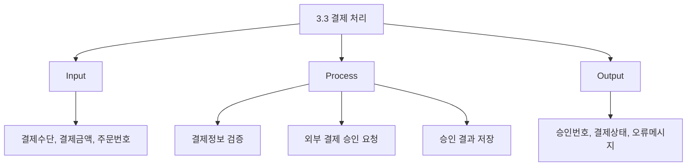

- 세부적 도표는 특정 기능의 IPO를 더 구체적으로 설명한다.
- 기능의 입력 자료 항목, 처리 단계, 출력 자료 항목을 자세히 적어 설계와 구현의 기준으로 삼는다.

- 세부적 도표의 역할:
  - 기능별 상세 처리 내용 설명
  - 입력 자료의 구체적 항목 정리
  - 처리 로직의 핵심 절차 정리
  - 출력 자료의 구체적 항목 정리
  - 구현자와 검토자가 같은 기준을 보게 함

- 예시:
  - 기능명: `결제 처리`
  - 입력: 주문번호, 결제금액, 결제수단, 카드정보
  - 처리:
    - 결제금액 검증
    - 결제수단 검증
    - 외부 결제 시스템 승인 요청
    - 승인 결과 저장
    - 실패 시 오류 메시지 생성
  - 출력: 승인번호, 결제상태, 결제일시, 오류메시지

- 시험 포인트:
  - 세부적 도표는 상세 IPO 설명이다.
  - 총체적 도표보다 더 구체적인 입력·처리·출력 내용을 다룬다.

---

## 10. HIPO 작성 흐름


- HIPO 작성은 보통 하향식으로 진행된다.

- 작성 절차:
  1. 전체 시스템의 목적과 범위를 파악한다.
  2. 시스템의 주요 기능을 식별한다.
  3. 주요 기능을 하위 기능으로 분해한다.
  4. 기능 계층을 가시적 도표로 표현한다.
  5. 각 기능의 입력, 처리, 출력을 정리한다.
  6. 주요 기능에 대한 총체적 도표를 작성한다.
  7. 필요한 기능에 대해 세부적 도표를 작성한다.
  8. 기능 누락, 중복, 의존 관계 오류를 검토한다.

- 작성 시 주의:
  - 기능 분해 수준을 일정하게 유지한다.
  - 입력과 출력이 모호한 기능은 다시 분석한다.
  - 처리 내용이 너무 상세해져 코드 수준으로 내려가지 않게 한다.
  - 기능 이름은 이해하기 쉬운 업무 용어로 표현한다.
  - DFD, 자료 사전, 유스케이스 등과 모순되지 않게 관리한다.

- 시험 포인트:
  - HIPO는 하향식 문서화 도구다.
  - 기능 계층을 먼저 잡고, 각 기능의 IPO를 정리하는 흐름으로 이해한다.

---

## 11. HIPO의 장점

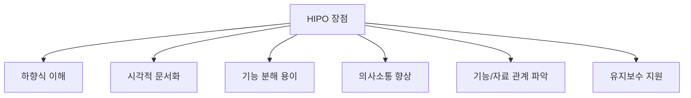

- PDF 기준 장점:
  - 기호와 도표를 사용하므로 보기 쉽다.
  - 이해하기 쉽다.
  - 기능과 자료의 의존 관계를 동시에 표현할 수 있다.

- 추가 장점:
  - 전체 시스템을 상위 수준에서 파악하기 쉽다.
  - 복잡한 기능을 작은 기능으로 나눌 수 있다.
  - 기능 단위로 작업을 나누기 쉽다.
  - 문서화가 체계적이다.
  - 신규 개발자나 검토자가 시스템 구조를 이해하기 쉽다.
  - 기능별 입력과 출력을 정리하므로 테스트 관점에서도 도움이 된다.
  - 기능 누락이나 중복을 발견하는 데 도움이 된다.

- CIO Wiki 설명과 연결:
  - HIPO는 복잡한 시스템을 작은 구성 요소로 나누어 이해와 의사소통을 쉽게 하는 구조적 방법이다.
  - 모듈별로 나누어 문서화하므로 문제 지점을 찾는 데도 도움이 된다.

- 시험 포인트:
  - `보기 쉽다`, `이해하기 쉽다`, `도표`, `문서화`, `하향식`, `기능 분해`는 HIPO의 장점 단서다.

---

## 12. HIPO의 한계

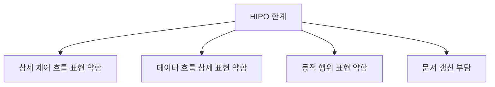

- HIPO는 모든 것을 표현하는 만능 도구가 아니다.
- 기능 계층과 기능별 IPO를 설명하는 데 강하지만, 상세한 제어 흐름과 시간 순서를 표현하는 데는 제한이 있다.

- 주요 한계:
  - 조건 분기와 반복의 상세 흐름을 표현하기 어렵다.
  - 프로세스 간 자료 흐름의 상세 경로는 DFD가 더 적합하다.
  - 객체 간 메시지 순서나 동적 상호작용은 순차 다이어그램이 더 적합하다.
  - 상태 변화는 상태 다이어그램이 더 적합하다.
  - 문서가 갱신되지 않으면 실제 시스템과 불일치할 수 있다.

- GeeksforGeeks의 HIPO 설명에서도 HIPO가 문서화와 계층 구조 표현에 강하지만, 데이터 흐름이나 제어 흐름 자체를 직접 제공하는 도구로 보기는 어렵다고 설명한다.

- 시험 포인트:
  - HIPO는 기능 계층과 IPO를 표현한다.
  - 상세 자료 흐름은 DFD, 알고리즘 흐름은 순서도, 객체지향 구조는 UML이 더 직접적이다.
  - HIPO를 DFD나 순서도와 같은 것으로 보면 오답 가능성이 크다.

---

## 13. HIPO와 DFD 비교

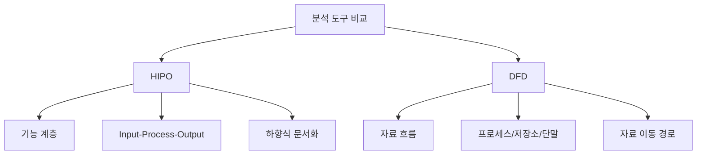

- HIPO:
  - 기능을 계층적으로 분해한다.
  - 각 기능의 입력, 처리, 출력을 문서화한다.
  - 하향식 설계와 문서화에 적합하다.

- DFD:
  - 자료가 어디서 와서 어디로 흐르는지 표현한다.
  - 프로세스, 자료 흐름, 자료 저장소, 단말로 구성된다.
  - 요구사항 분석에서 자료 흐름과 처리 관계를 파악하는 데 적합하다.

| 구분 | HIPO | DFD |
|---|---|---|
| 중심 관점 | 기능 계층과 IPO | 자료 흐름 |
| 주요 구성 | Hierarchy, Input, Process, Output | 프로세스, 자료 흐름, 자료 저장소, 단말 |
| 개발 방식 | 하향식 분해와 문서화 | 자료 흐름 중심 분석 |
| 강점 | 시스템 구조와 기능 분해 이해 | 데이터 이동과 저장 관계 이해 |
| 한계 | 상세 데이터 흐름 표현 약함 | 기능 계층 구조 표현은 상대적으로 약함 |

- 시험 포인트:
  - `기능 계층`, `하향식`, `IPO` → HIPO
  - `자료 흐름`, `자료 저장소`, `단말`, `화살표` → DFD

---

## 14. HIPO와 자료 사전 비교

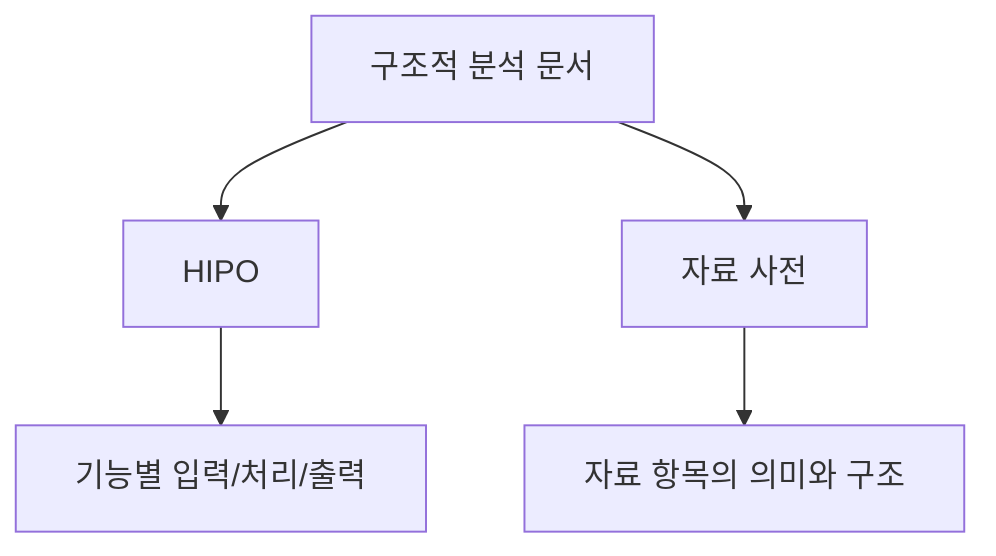

- HIPO는 기능과 자료의 의존 관계를 도표로 문서화한다.
- 자료 사전은 DFD에 나타난 자료 흐름과 자료 저장소의 자료 구조와 의미를 정의한다.

| 구분 | HIPO | 자료 사전 |
|---|---|---|
| 초점 | 기능 계층과 기능별 IPO | 자료의 이름, 의미, 구성 |
| 표현 방식 | 계층도, IPO 도표 | `=`, `+`, `( )`, `[ | ]`, `{ }`, `* *` |
| 사용 목적 | 기능 구조와 처리 관계 문서화 | 자료 정의의 모호성 제거 |
| 예시 | 주문 처리 = 입력/처리/출력으로 설명 | 주문정보 = 주문번호 + 고객번호 + {주문상품} |

- 시험 포인트:
  - HIPO는 기능 문서화 도구다.
  - 자료 사전은 자료 정의 도구다.
  - 둘 다 문서화 도구지만 중심 대상이 다르다.

---

## 15. HIPO와 구조도, 순서도, UML 비교

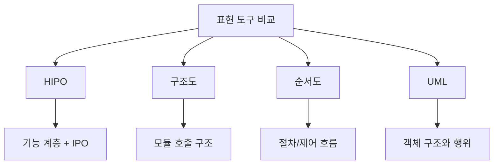

- 구조도(Structure Chart):
  - 모듈의 계층 구조와 호출 관계를 표현한다.
  - HIPO의 계층 부분과 유사해 보일 수 있다.
  - 하지만 HIPO는 기능별 IPO 설명을 함께 가진다는 점이 중요하다.

- 순서도(Flowchart):
  - 알고리즘의 순서, 조건 분기, 반복 흐름을 표현한다.
  - HIPO보다 상세 제어 흐름 표현에 강하다.

- UML:
  - 객체지향 분석/설계에서 구조와 행위를 표현한다.
  - 클래스 다이어그램, 유스케이스 다이어그램, 순차 다이어그램 등이 있다.

| 구분 | 중심 관점 | 대표 단서 |
|---|---|---|
| HIPO | 기능 계층 + 입력/처리/출력 | 하향식, 문서화, IPO |
| 구조도 | 모듈 구조와 호출 관계 | 모듈, 호출, 계층 구조 |
| 순서도 | 처리 절차와 제어 흐름 | 시작/종료, 판단, 반복 |
| UML | 객체지향 구조와 행위 | 클래스, 액터, 메시지, 관계 |

- 시험 포인트:
  - HIPO는 순서도가 아니다.
  - HIPO는 DFD와도 다르다.
  - HIPO는 기능 계층과 IPO 문서화를 함께 떠올려야 한다.

---

## 16. HIPO 예시: 주문 관리 시스템

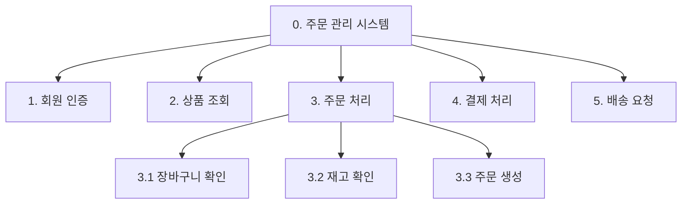

- 가시적 도표 예시:
  - `0. 주문 관리 시스템`
    - `1. 회원 인증`
    - `2. 상품 조회`
    - `3. 주문 처리`
      - `3.1 장바구니 확인`
      - `3.2 재고 확인`
      - `3.3 주문 생성`
    - `4. 결제 처리`
    - `5. 배송 요청`

- 총체적 도표 예시:

| 기능 | Input | Process | Output |
|---|---|---|---|
| 주문 처리 | 고객 정보, 장바구니 정보, 상품 정보 | 장바구니 확인, 재고 확인, 주문 생성 | 주문 내역, 주문번호 |

- 세부적 도표 예시:

| 기능 | Input | Process | Output |
|---|---|---|---|
| 재고 확인 | 상품 코드, 주문 수량 | 상품별 현재 재고 조회, 주문 가능 수량 비교 | 재고 가능 여부, 부족 상품 목록 |
| 주문 생성 | 고객 번호, 주문상품 목록, 배송지 | 주문번호 생성, 주문 상세 저장, 주문 상태 설정 | 주문번호, 주문 완료 메시지 |

- 이 예시에서 HIPO가 보여주는 것:
  - 주문 관리 시스템의 기능 계층
  - 주문 처리 기능의 하위 기능
  - 각 기능의 입력, 처리, 출력
  - 기능과 자료 간 의존 관계

---

## 17. HIPO가 요구사항/설계에 주는 도움

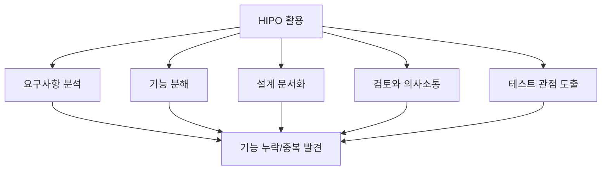

- 요구사항 분석에서의 도움:
  - 사용자가 원하는 기능을 계층적으로 정리한다.
  - 상위 요구를 하위 기능으로 나누어 누락을 확인한다.
  - 기능별 입력과 출력을 정리해 모호성을 줄인다.

- 설계에서의 도움:
  - 모듈 분할 방향을 잡는다.
  - 기능별 책임을 나눈다.
  - 각 기능의 입출력 인터페이스를 생각하게 한다.
  - 문서화를 통해 유지보수 기준을 만든다.

- 테스트에서의 도움:
  - 입력과 출력이 정리되어 테스트 케이스를 만들기 쉽다.
  - 기능별 기대 결과를 확인할 수 있다.
  - 상위 기능과 하위 기능의 관계를 보며 통합 테스트 범위를 잡을 수 있다.

- 시험 포인트:
  - HIPO는 요구사항, 설계, 문서화, 검토에 모두 도움을 줄 수 있지만, 시험에서는 `하향식 문서화 도구`라는 표현을 가장 우선한다.

---

## 18. 기능과 자료의 의존 관계

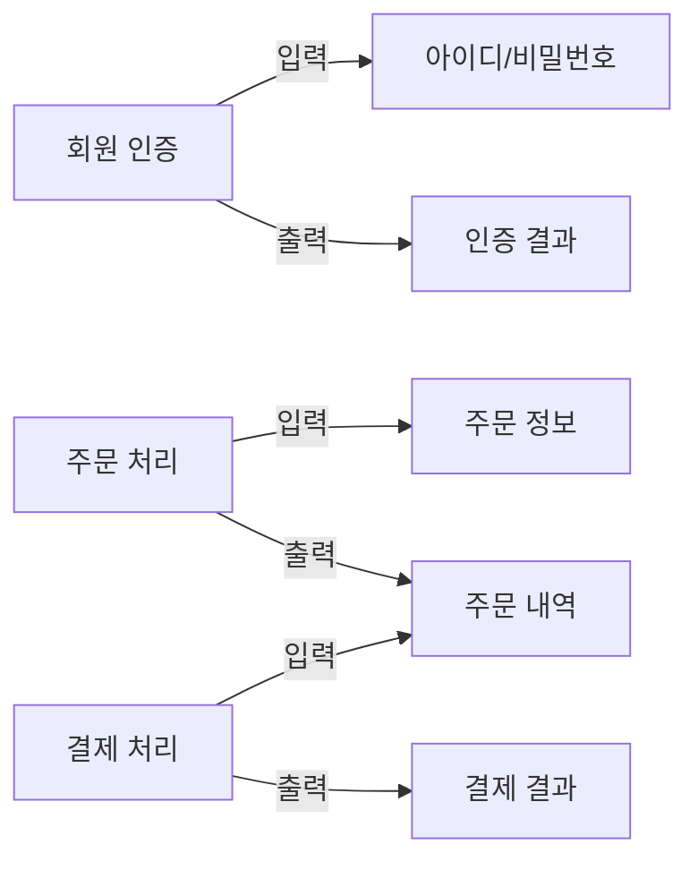

- PDF는 HIPO가 기능과 자료의 의존 관계를 동시에 표현할 수 있다고 설명한다.
- 이 말은 기능 계층만 표현하는 것이 아니라, 기능이 어떤 자료를 입력으로 사용하고 어떤 자료를 출력으로 만드는지도 함께 문서화할 수 있다는 뜻이다.

- 의존 관계의 예:
  - `결제 처리`는 `주문 내역`이 있어야 수행될 수 있다.
  - `배송 요청`은 `결제 결과`가 성공이어야 수행될 수 있다.
  - `재고 차감`은 `주문상품 목록`을 입력으로 필요로 한다.

- HIPO에서 의존 관계를 읽는 방법:
  - 어떤 기능이 어떤 입력을 필요로 하는가
  - 어떤 기능이 어떤 출력을 만드는가
  - 어떤 출력이 다른 기능의 입력이 되는가
  - 상위 기능과 하위 기능의 입출력이 일관적인가

- 시험 포인트:
  - `기능과 자료의 의존 관계`는 HIPO의 핵심 문장이다.
  - 다만 상세한 자료 흐름 경로를 그리는 도구는 DFD가 더 직접적이다.

---

## 19. 시험에서 보는 단서어

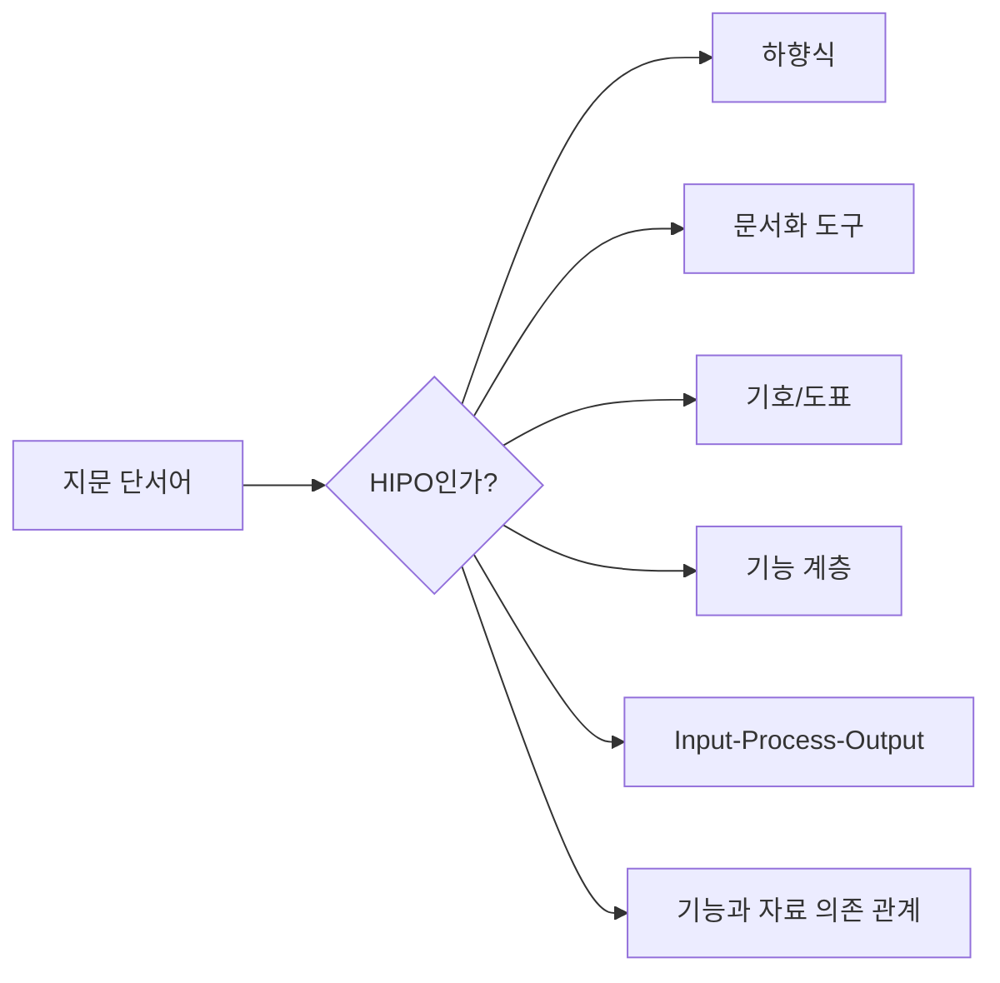

- HIPO 단서어:

| 단서어 | 판단 |
|---|---|
| 하향식 소프트웨어 개발 | HIPO |
| 문서화 도구 | HIPO |
| 기호와 도표로 보기 쉽고 이해하기 쉬움 | HIPO |
| 기능과 자료의 의존 관계 동시 표현 | HIPO |
| Hierarchy Input Process Output | HIPO |
| 기능 계층과 IPO | HIPO |
| 가시적 도표, 총체적 도표, 세부적 도표 | HIPO |

- 보기 판별 예시:

| 보기 | 판단 | 이유 |
|---|---|---|
| HIPO는 하향식 소프트웨어 개발을 위한 문서화 도구이다 | O | PDF 핵심 |
| HIPO는 기호와 도표를 사용하므로 보기 쉽고 이해하기 쉽다 | O | PDF 핵심 |
| HIPO는 기능과 자료의 의존 관계를 동시에 표현할 수 있다 | O | PDF 핵심 |
| HIPO는 자료 흐름만을 표현하며 기능 계층은 표현하지 않는다 | X | DFD와 혼동 |
| HIPO는 객체 간 메시지 순서를 표현하는 UML 다이어그램이다 | X | 순차 다이어그램과 혼동 |
| HIPO는 입력, 처리, 출력 관점을 사용한다 | O | IPO 의미 |

- 문제 풀이 순서:
  1. 지문에 `하향식`, `문서화`, `기능 계층`, `IPO`가 있는지 본다.
  2. 자료 흐름, 저장소, 단말이 중심이면 DFD를 의심한다.
  3. `=`, `+`, `{ }` 같은 자료 정의 기호가 중심이면 자료 사전을 의심한다.
  4. 조건 분기와 반복 순서가 중심이면 순서도를 의심한다.

---

## 20. 자주 나오는 함정

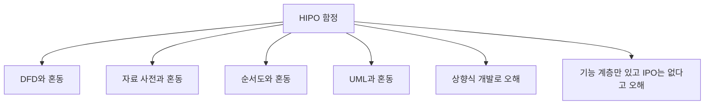

- 함정 1: DFD와 혼동
  - DFD는 자료 흐름 중심이다.
  - HIPO는 기능 계층과 입력-처리-출력 중심이다.

- 함정 2: 자료 사전과 혼동
  - 자료 사전은 자료 구조와 의미를 정의한다.
  - HIPO는 기능 구조와 기능별 IPO를 문서화한다.

- 함정 3: 순서도와 혼동
  - 순서도는 알고리즘의 제어 흐름과 절차를 표현한다.
  - HIPO는 기능을 계층적으로 나누고 각 기능의 IPO를 설명한다.

- 함정 4: UML과 혼동
  - UML은 객체지향 구조와 행위를 표현하는 표준 모델링 언어다.
  - HIPO는 전통적인 구조적 분석/설계 문서화 도구에 가깝다.

- 함정 5: 상향식 개발로 오해
  - HIPO의 핵심은 하향식이다.
  - 전체 시스템에서 시작해 하위 기능으로 분해한다.

- 함정 6: HIPO가 기능 계층만 표현한다고 오해
  - HIPO는 Hierarchy뿐 아니라 Input, Process, Output도 함께 다룬다.
  - 기능별 입력과 출력이 빠지면 HIPO의 장점이 줄어든다.

- 함정 7: HIPO가 상세 데이터 흐름을 완전히 표현한다고 오해
  - HIPO는 기능과 자료 의존 관계를 표현할 수 있지만, DFD처럼 자료 흐름 경로 자체를 세밀하게 표현하는 도구는 아니다.

---

## 21. 암기 포인트

```mermaid
flowchart TD
    A["HIPO 암기"] --> B["H: Hierarchy"]
    A --> C["I: Input"]
    A --> D["P: Process"]
    A --> E["O: Output"]

    B --> B1["기능 계층"]
    C --> C1["입력"]
    D --> D1["처리"]
    E --> E1["출력"]

    A --> F["하향식 문서화 도구"]
```

- 1차 암기:
  - HIPO = `Hierarchy + Input + Process + Output`
  - 계층, 입력, 처리, 출력

- 2차 암기:
  - HIPO = 하향식 소프트웨어 개발을 위한 문서화 도구
  - HIPO = 기호와 도표를 사용해 보기 쉽고 이해하기 쉬움
  - HIPO = 기능과 자료의 의존 관계를 동시에 표현 가능

- 3차 암기:
  - 가시적 도표 = 기능 계층 목차
  - 총체적 도표 = 기능의 전체 IPO
  - 세부적 도표 = 기능의 상세 IPO

- 비교 암기:
  - DFD = 자료 흐름
  - 자료 사전 = 자료 정의
  - HIPO = 기능 계층 + IPO
  - 순서도 = 절차/제어 흐름
  - UML = 객체지향 모델링

- 시험 직전 10초 복습:
  - 하향식 → HIPO
  - 문서화 도구 → HIPO
  - 기능 계층 → HIPO
  - 입력/처리/출력 → HIPO
  - 자료 흐름/저장소/단말 → DFD

---

## 22. 빠른 복습

```mermaid
flowchart TD
    A["문제 풀이"] --> B{"단서가 무엇인가?"}
    B -- "하향식/문서화/IPO" --> C["HIPO"]
    B -- "자료 흐름/저장소/단말" --> D["DFD"]
    B -- "= + { } [ ]" --> E["자료 사전"]
    B -- "조건/반복/절차" --> F["순서도"]
    B -- "객체/클래스/메시지" --> G["UML"]
```

- 챕터명:
  - `012 HIPO`

- 소속 영역:
  - `1과목 소프트웨어 설계`
  - `요구사항`
  - `구조적 분석/설계`

- 반드시 외울 PDF 핵심:
  - 하향식 소프트웨어 개발을 위한 문서화 도구
  - 기호와 도표를 사용하므로 보기 쉽고 이해하기 쉬움
  - 기능과 자료의 의존 관계를 동시에 표현 가능

- 가장 중요한 해석:
  - HIPO는 시스템을 위에서 아래로 기능 분해한다.
  - 각 기능은 입력, 처리, 출력 관점으로 문서화한다.
  - 전체 기능 계층과 기능별 IPO를 함께 보아야 HIPO를 제대로 이해할 수 있다.

- 자주 나오는 문제 유형:
  - HIPO의 정의를 묻는 문제
  - HIPO의 약자 의미를 묻는 문제
  - HIPO의 특징으로 옳은/틀린 것을 고르는 문제
  - HIPO와 DFD를 비교하는 문제
  - HIPO와 자료 사전/순서도/UML을 구분하는 문제
  - 가시적 도표, 총체적 도표, 세부적 도표의 역할을 묻는 문제

- 최종 암기 문장:
  - `HIPO는 하향식 소프트웨어 개발에서 기능 계층과 각 기능의 입력·처리·출력을 도표로 문서화하여 기능과 자료의 의존 관계를 표현하는 도구다.`

---

## 23. 참고 링크

- 기준 PDF: `/Users/nes0903/Documents/study/정보처리기사/핵심요약집_2026_정보처리기사필기핵심요약.pdf`
- [Q-Net 정보처리기사 종목 페이지](https://www.q-net.or.kr/crf005.do?id=crf00503s02&jmCd=1320&jmInfoDivCcd=B0)
- [CIO Wiki - Hierarchical-Input-Process-Output](https://cio-wiki.org/wiki/Hierarchical-Input-Process-Output_%28HIPO%29_Mode)
- [GeeksforGeeks - Software Analysis and Design Tools](https://www.geeksforgeeks.org/software-engineering/software-analysis-and-design-tools/)
- [IBM - What is a Data Flow Diagram?](https://www.ibm.com/think/topics/data-flow-diagram)
- [HandWiki - HIPO model](https://handwiki.org/wiki/HIPO_model)
