# 013 UML

작성 기준일: 2026-05-02  
과목: `1과목 소프트웨어 설계`  
기준 PDF: `/Users/nes0903/Documents/study/정보처리기사/핵심요약집_2026_정보처리기사필기핵심요약.pdf`  
PDF 확인 위치: `2페이지`  
검색 보강: OMG UML 공식 페이지, OMG UML 2.5.1 명세 페이지, OMG What is UML, Q-Net 정보처리기사 시험 정보를 함께 확인하여 시험 중심으로 확장 정리

---

## 1. 한 줄 요약

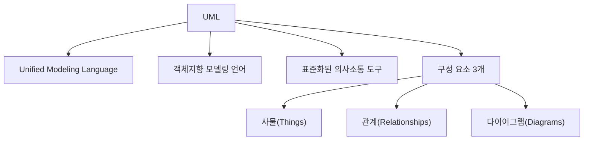

- UML은 시스템 개발자와 고객, 개발자 상호 간의 의사소통이 원활하게 이루어지도록 표준화한 대표적인 객체지향 모델링 언어다.
- UML은 프로그래밍 언어가 아니라 `모델링 언어`다.
- PDF 기준 UML의 구성 요소는 `사물(Things)`, `관계(Relationships)`, `다이어그램(Diagrams)`이다.
- OMG는 UML을 소프트웨어와 시스템의 구조, 행위, 설계를 시각화·명세화·문서화하는 표준으로 설명한다.
- 시험에서는 UML의 정의, 구성 요소 3개, 주요 관계, 구조적/행위 다이어그램 구분을 연결해서 묻는 경우가 많다.
- 암기 축약어는 `사-관-다`로 잡으면 빠르다.

---

## 2. PDF 기준 핵심

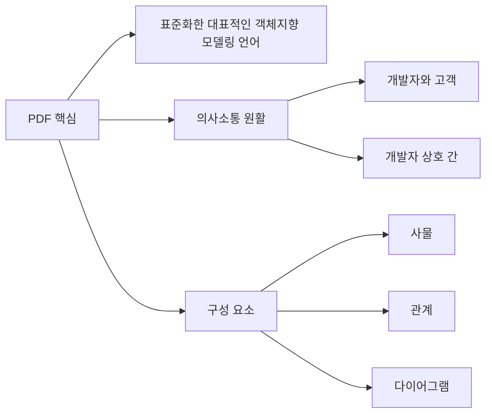

- PDF에 제시된 UML 핵심 문장은 다음과 같다.
  - 시스템 개발자와 고객 또는 개발자 상호 간의 의사소통이 원활하게 이루어지도록 표준화한 대표적인 객체지향 모델링 언어이다.
  - 구성 요소는 `사물(Things)`, `관계(Relationships)`, `다이어그램(Diagrams)`이다.

- 이 챕터의 최소 암기 목표:
  - UML의 약자
  - UML이 모델링 언어라는 점
  - 객체지향 모델링 언어라는 점
  - 의사소통을 위한 표준 표현이라는 점
  - UML 구성 요소 3개
  - 다음 챕터의 UML 주요 관계와 다이어그램 분류와의 연결

- 시험에서 자주 바뀌는 표현:

| PDF 표현 | 같은 의미로 볼 수 있는 표현 |
|---|---|
| 객체지향 모델링 언어 | 객체지향 분석/설계 표현 언어 |
| 표준화한 언어 | 공통 표기법, 표준 모델링 표기법 |
| 의사소통이 원활 | 개발자·고객 간 이해 공유 |
| 구성 요소 | UML을 구성하는 기본 요소 |
| 사물, 관계, 다이어그램 | Things, Relationships, Diagrams |

---

## 3. UML의 기본 개념

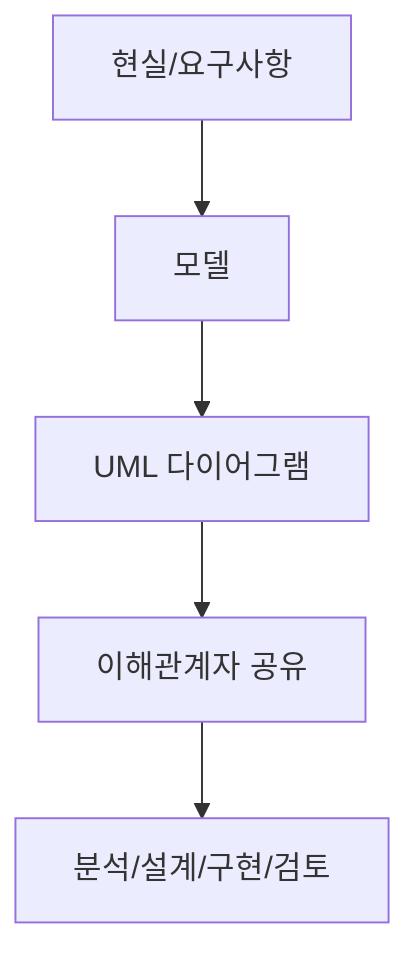

- UML은 `Unified Modeling Language`의 약자다.
- UML은 소프트웨어 시스템을 이해하고 설계하기 위해 사용하는 표준 모델링 언어다.
- UML은 코드를 직접 작성하는 언어가 아니다.
- UML은 시스템의 구조와 행위를 그림과 기호로 표현해 이해관계자들이 같은 모델을 보고 의사소통하도록 돕는다.

- OMG의 UML 소개 페이지는 UML을 소프트웨어와 시스템을 시각화, 명세화, 문서화하는 표준으로 설명한다.
- OMG의 `What is UML?` 설명은 UML이 소프트웨어 시스템의 모델을 명세하고 시각화하고 문서화하는 데 도움을 준다고 설명한다.
- UML은 객체지향 개념인 클래스, 객체, 연산, 관계, 상호작용 등을 표현하는 데 적합하다.

- UML의 핵심 목적:
  - 복잡한 시스템을 추상화한다.
  - 시스템 구조를 시각적으로 표현한다.
  - 시스템 행위를 시각적으로 표현한다.
  - 요구사항과 설계를 명확하게 전달한다.
  - 고객, 분석가, 설계자, 개발자, 테스터 간 의사소통을 돕는다.
  - 유지보수 시 시스템 구조를 이해하기 쉽게 한다.

- 시험 포인트:
  - UML은 `프로그래밍 언어`가 아니다.
  - UML은 `객체지향 모델링 언어`다.
  - UML은 `의사소통을 위한 표준화된 표현`이다.

---

## 4. UML을 사용하는 이유

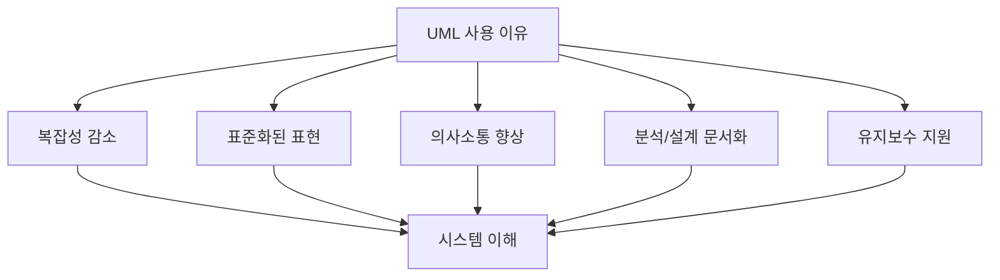

- UML은 복잡한 시스템을 추상화해 큰 그림과 세부 요소를 구분해서 볼 수 있게 한다.
- 개발자와 고객은 같은 용어와 그림을 사용해 요구사항과 설계를 논의할 수 있다.
- 개발자끼리는 클래스, 관계, 메시지, 상태, 활동 등의 표현을 공유할 수 있다.
- 설계 결과를 문서화해 유지보수와 인수인계에 활용할 수 있다.

- UML이 특히 유용한 상황:
  - 객체지향 분석과 설계를 수행할 때
  - 시스템 구조가 복잡할 때
  - 고객과 요구사항을 시각적으로 검토해야 할 때
  - 개발자 간 설계 의도를 공유해야 할 때
  - 클래스 구조와 객체 간 상호작용을 표현해야 할 때
  - 시스템의 상태 변화나 업무 흐름을 분석해야 할 때

- UML의 추상화 관점:
  - 세부 코드를 모두 보지 않고 구조를 이해한다.
  - 특정 관점만 선택해 볼 수 있다.
  - 정적 구조와 동적 행위를 나누어 표현한다.
  - 필요한 수준의 상세도로 모델을 작성한다.

- 시험 포인트:
  - `고객과 개발자 간 의사소통`, `개발자 상호 간 의사소통`, `표준화`, `객체지향 모델링`이 나오면 UML을 떠올린다.

---

## 5. UML의 구성 요소 3개

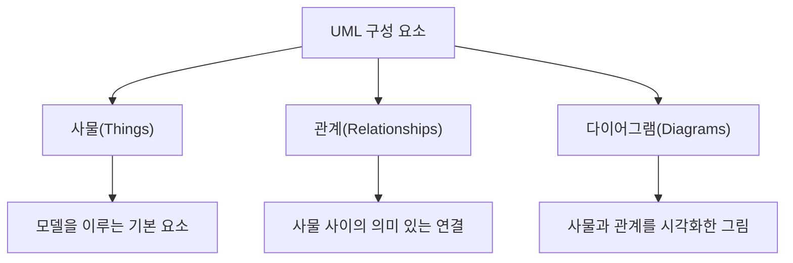

- PDF 기준 UML의 구성 요소는 `사물`, `관계`, `다이어그램`이다.
- 이 3개는 반드시 그대로 외워야 한다.

- 사물(Things):
  - UML 모델을 구성하는 기본 요소다.
  - 클래스, 인터페이스, 유스케이스, 컴포넌트, 노드, 패키지 같은 요소가 포함될 수 있다.

- 관계(Relationships):
  - 사물 사이의 의미 있는 연결이다.
  - 연관, 집합, 포함, 일반화, 의존, 실체화 등이 대표적이다.
  - 다음 챕터 `014 UML의 주요 관계`와 직접 연결된다.

- 다이어그램(Diagrams):
  - 사물과 관계를 특정 관점에서 시각적으로 표현한 그림이다.
  - 구조적 다이어그램과 행위 다이어그램으로 크게 나누어 공부한다.
  - 다음 챕터 `015 구조적 다이어그램의 종류`, `016 행위 다이어그램의 종류`와 직접 연결된다.

- 시험 포인트:
  - UML 구성 요소를 묻는 문제의 정답은 `사물, 관계, 다이어그램`이다.
  - `클래스, 객체, 메시지` 같은 세부 요소를 구성 요소 3개와 혼동하지 않는다.

---

## 6. 사물(Things)

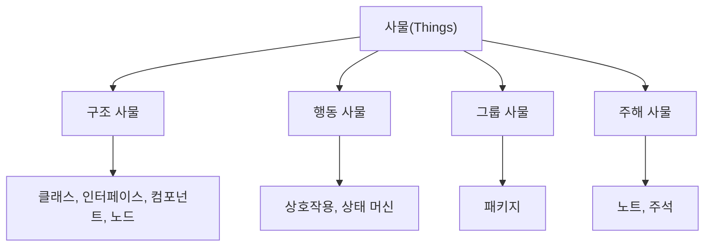

- 사물은 UML 모델 안에서 실제로 표현되는 기본 구성 요소다.
- UML에서 사물은 구조, 행동, 그룹, 주해 등 여러 관점으로 나눌 수 있다.

- 구조 사물:
  - 시스템의 정적인 부분을 표현한다.
  - 예: 클래스, 인터페이스, 유스케이스, 컴포넌트, 노드, 객체

- 행동 사물:
  - 시스템의 동적인 행위를 표현한다.
  - 예: 상호작용, 상태 머신

- 그룹 사물:
  - 관련 요소를 묶는다.
  - 예: 패키지

- 주해 사물:
  - 모델에 설명을 덧붙인다.
  - 예: 노트, 주석

- 시험 포인트:
  - 사물은 UML 구성 요소 3개 중 하나다.
  - 사물은 다이어그램에 등장하는 모델 요소라고 이해하면 쉽다.
  - 사물의 세부 분류까지 깊게 외우기보다, `모델의 기본 요소`라는 의미를 우선 잡는다.

---

## 7. 관계(Relationships)

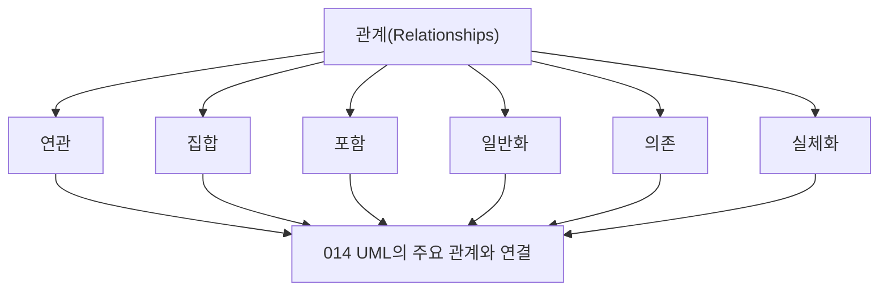

- 관계는 사물 사이의 의미 있는 연결이다.
- 정보처리기사 PDF의 다음 챕터에서 UML의 주요 관계를 따로 다룬다.
- 이 챕터에서는 `관계는 UML 구성 요소 중 하나`라는 점을 우선 기억한다.

- 주요 관계의 큰 의미:
  - 연관(Association): 두 사물이 관련되어 있음
  - 집합(Aggregation): 전체와 부분의 느슨한 포함 관계
  - 포함(Composition): 전체와 부분의 강한 포함 관계
  - 일반화(Generalization): 상위 개념과 하위 개념의 관계
  - 의존(Dependency): 한 요소가 다른 요소에 영향을 받는 관계
  - 실체화(Realization): 인터페이스나 명세를 구현하는 관계

- 시험 포인트:
  - `관계`는 UML의 구성 요소 3개 중 하나다.
  - 관계의 세부 종류는 `014 UML의 주요 관계`에서 자세히 외운다.
  - 일반화, 의존, 실체화 같은 용어가 나오면 UML 관계 문제일 가능성이 높다.

---

## 8. 다이어그램(Diagrams)

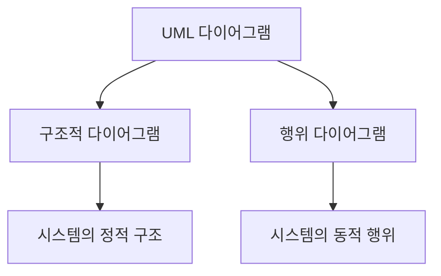

- 다이어그램은 사물과 관계를 특정 관점에서 시각화한 그림이다.
- UML은 하나의 다이어그램으로 모든 것을 표현하지 않는다.
- 시스템의 정적 구조를 표현할 때는 구조적 다이어그램을 사용한다.
- 시스템의 동적 행위와 상호작용을 표현할 때는 행위 다이어그램을 사용한다.

- 시험에서 중요한 구분:
  - 구조적 다이어그램: 클래스, 객체, 컴포넌트, 배치, 복합체 구조, 패키지
  - 행위 다이어그램: 유스케이스, 순차, 커뮤니케이션, 상태, 활동, 상호작용 개요, 타이밍

- 공식 UML 명세의 다이어그램 분류는 버전과 범위에 따라 Profile Diagram 등을 추가로 언급할 수 있다.
- 정보처리기사 필기에서는 PDF와 인접 챕터 기준 목록을 우선한다.

- 시험 포인트:
  - 정적 구조 = 구조적 다이어그램
  - 동적 행위 = 행위 다이어그램
  - 다이어그램 목록을 섞어 놓고 다른 하나를 고르게 하는 문제가 자주 나온다.

---

## 9. 구조적 다이어그램 개요

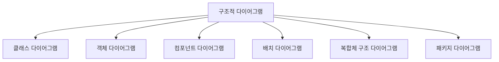

- 구조적 다이어그램은 시스템의 정적인 구조를 표현한다.
- 클래스, 객체, 컴포넌트, 노드, 패키지처럼 시스템을 구성하는 요소와 관계를 보여준다.
- PDF의 다음 챕터 `015 구조적(Structural) 다이어그램의 종류`에 직접 연결된다.

- PDF 기준 구조적 다이어그램:
  - 클래스 다이어그램(Class Diagram)
  - 객체 다이어그램(Object Diagram)
  - 컴포넌트 다이어그램(Component Diagram)
  - 배치 다이어그램(Deployment Diagram)
  - 복합체 구조 다이어그램(Composite Structure Diagram)
  - 패키지 다이어그램(Package Diagram)

- 구조적 다이어그램의 핵심 질문:
  - 시스템은 어떤 정적 요소로 구성되는가
  - 클래스와 클래스는 어떤 관계인가
  - 객체는 특정 시점에 어떤 상태로 연결되어 있는가
  - 컴포넌트는 어떻게 구성되는가
  - 실행 노드와 배포 구조는 어떻게 되는가
  - 패키지는 어떻게 묶이고 의존하는가

- 시험 포인트:
  - `클래스`, `객체`, `컴포넌트`, `배치`, `패키지`가 나오면 구조적 다이어그램 쪽 단서다.

---

## 10. 행위 다이어그램 개요

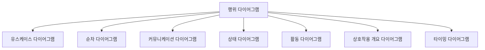

- 행위 다이어그램은 시스템의 동적인 행위, 상호작용, 상태 변화, 활동 흐름을 표현한다.
- PDF의 다음 챕터 `016 행위(Behavioral) 다이어그램의 종류`에 직접 연결된다.

- PDF 기준 행위 다이어그램:
  - 유스케이스 다이어그램(Use Case Diagram)
  - 순차 다이어그램(Sequence Diagram)
  - 커뮤니케이션 다이어그램(Communication Diagram)
  - 상태 다이어그램(State Diagram)
  - 활동 다이어그램(Activity Diagram)
  - 상호작용 개요 다이어그램(Interaction Overview Diagram)
  - 타이밍 다이어그램(Timing Diagram)

- 행위 다이어그램의 핵심 질문:
  - 사용자는 시스템과 어떤 기능으로 상호작용하는가
  - 객체들은 어떤 순서로 메시지를 주고받는가
  - 객체나 시스템의 상태는 어떻게 변하는가
  - 업무 활동은 어떤 흐름으로 진행되는가
  - 시간 제약에 따라 상태나 값은 어떻게 변하는가

- 시험 포인트:
  - `유스케이스`, `순차`, `커뮤니케이션`, `상태`, `활동`, `타이밍`이 나오면 행위 다이어그램 쪽 단서다.
  - 순차 다이어그램은 이후 `019 순차 다이어그램의 구성 요소`와 연결된다.

---

## 11. UML 다이어그램 선택 기준

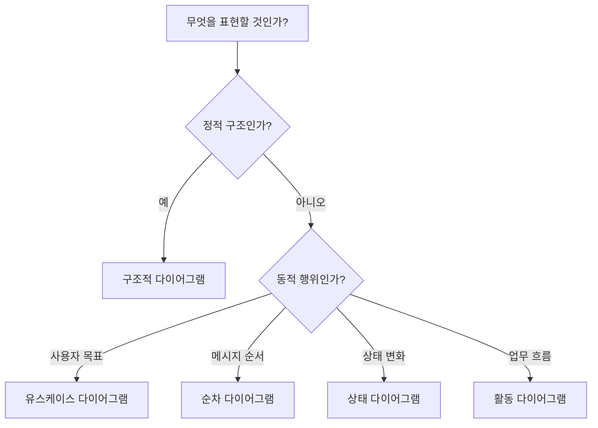

- UML은 목적에 맞는 다이어그램을 골라 사용하는 것이 중요하다.
- 모든 상황에 클래스 다이어그램을 사용하는 것이 아니다.
- 모든 동작을 순차 다이어그램으로만 표현하는 것도 아니다.

- 선택 기준:

| 표현하고 싶은 것 | 적합한 UML 다이어그램 |
|---|---|
| 클래스와 속성, 연산, 관계 | 클래스 다이어그램 |
| 특정 시점의 객체 관계 | 객체 다이어그램 |
| 사용자의 목표와 시스템 기능 | 유스케이스 다이어그램 |
| 객체 간 메시지 순서 | 순차 다이어그램 |
| 객체 간 연결과 메시지 | 커뮤니케이션 다이어그램 |
| 상태와 전이 | 상태 다이어그램 |
| 업무 흐름과 제어 흐름 | 활동 다이어그램 |
| 컴포넌트와 인터페이스 | 컴포넌트 다이어그램 |
| 물리적 배치와 실행 노드 | 배치 다이어그램 |
| 패키지와 의존성 | 패키지 다이어그램 |

- 시험 포인트:
  - 문제 지문에서 `무엇을 표현하는지`를 먼저 찾는다.
  - 정적 구조인지, 동적 행위인지 구분하면 오답을 많이 줄일 수 있다.

---

## 12. UML과 객체지향

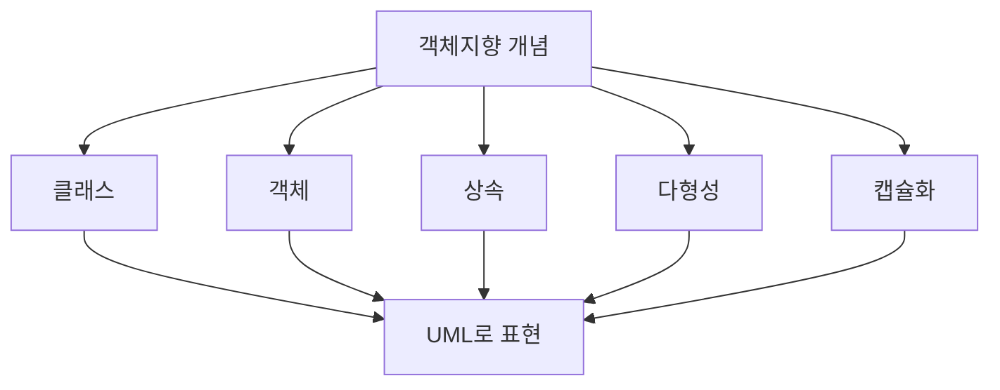

- UML은 객체지향 분석과 설계에서 많이 사용된다.
- UML은 클래스, 객체, 속성, 연산, 인터페이스, 상속, 연관, 의존 같은 객체지향 개념을 표현할 수 있다.

- 객체지향과 UML의 연결:
  - 클래스 → 클래스 다이어그램
  - 객체 → 객체 다이어그램
  - 상속 → 일반화 관계
  - 인터페이스 구현 → 실체화 관계
  - 객체 간 메시지 → 순차 다이어그램, 커뮤니케이션 다이어그램
  - 객체 상태 변화 → 상태 다이어그램

- UML은 객체지향 언어와 자연스럽게 연결된다.
  - Java, C++, C#, Kotlin 같은 객체지향 언어의 구조를 UML로 표현하기 쉽다.
  - 하지만 UML은 객체지향 언어 전용 코드 생성 도구만을 뜻하는 것은 아니다.
  - OMG 자료도 UML이 비객체지향 시스템이나 비소프트웨어 시스템 모델링에도 쓰일 수 있음을 설명한다.

- 시험 포인트:
  - 정보처리기사에서는 `대표적인 객체지향 모델링 언어`라는 표현을 우선 외운다.
  - 객체지향 개념과 UML 관계를 함께 잡아두면 뒤쪽 객체지향 챕터와 연결된다.

---

## 13. UML과 개발 단계

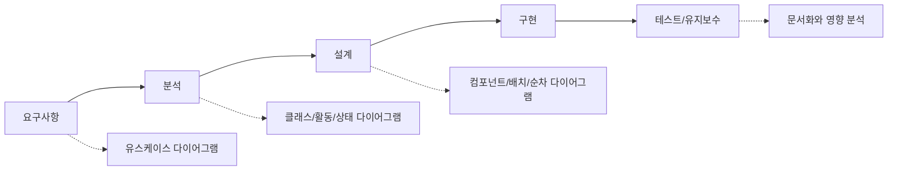

- UML은 요구사항부터 분석, 설계, 구현, 유지보수까지 여러 단계에서 사용할 수 있다.

- 요구사항 단계:
  - 유스케이스 다이어그램으로 사용자와 시스템의 상호작용을 표현한다.
  - 고객과 기능 범위를 논의하는 데 도움이 된다.

- 분석 단계:
  - 클래스 후보, 객체 관계, 업무 흐름, 상태 변화를 분석한다.
  - 클래스 다이어그램, 활동 다이어그램, 상태 다이어그램 등이 쓰일 수 있다.

- 설계 단계:
  - 컴포넌트 구조, 배치 구조, 객체 간 메시지 흐름을 구체화한다.
  - 컴포넌트 다이어그램, 배치 다이어그램, 순차 다이어그램 등이 쓰일 수 있다.

- 유지보수 단계:
  - 기존 시스템 구조를 이해한다.
  - 변경 영향 범위를 파악한다.
  - 문서화된 모델을 통해 인수인계와 검토를 지원한다.

- 시험 포인트:
  - UML은 특정 한 단계에만 쓰이는 것이 아니다.
  - 다만 시험에서는 객체지향 분석/설계와 의사소통 도구라는 표현이 가장 중요하다.

---

## 14. UML과 다른 분석/설계 도구 비교

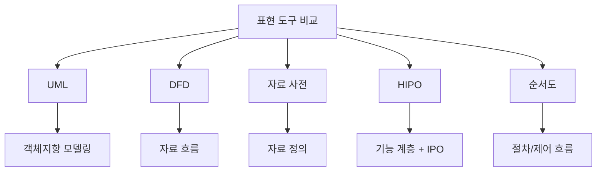

- UML:
  - 객체지향 분석/설계 모델링 언어다.
  - 구조와 행위를 다양한 다이어그램으로 표현한다.

- DFD:
  - 자료 흐름 중심 분석 도구다.
  - 프로세스, 자료 흐름, 자료 저장소, 단말로 구성된다.

- 자료 사전:
  - 자료 흐름과 자료 저장소의 자료 구조와 의미를 정의한다.
  - `=`, `+`, `( )`, `[ | ]`, `{ }`, `* *` 같은 기호를 사용한다.

- HIPO:
  - 하향식 소프트웨어 개발을 위한 문서화 도구다.
  - 기능 계층과 입력·처리·출력을 표현한다.

- 순서도:
  - 알고리즘의 절차와 제어 흐름을 표현한다.
  - 조건 분기와 반복 흐름을 표현하는 데 적합하다.

- 시험 포인트:
  - `객체지향 모델링 언어` → UML
  - `자료 흐름` → DFD
  - `자료 정의 기호` → 자료 사전
  - `하향식 기능 계층 + IPO` → HIPO
  - `처리 순서와 조건 분기` → 순서도

---

## 15. UML의 주요 관계와 연결

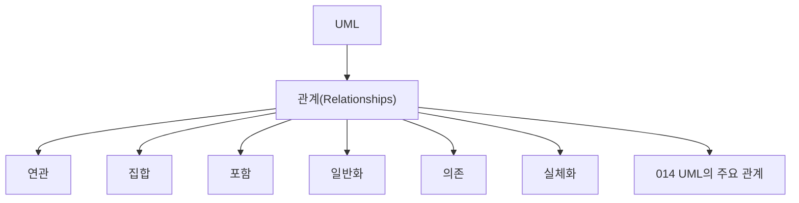

- 다음 챕터는 `014 UML의 주요 관계`다.
- 이 챕터에서 `관계`가 UML 구성 요소 중 하나라는 점을 잡고, 다음 챕터에서 관계 종류를 외우면 흐름이 자연스럽다.

- 관계를 구분하는 핵심:
  - 연관: 알고 있음, 연결되어 있음
  - 집합: 전체-부분 관계지만 부분이 독립적으로 존재 가능
  - 포함: 전체-부분 관계이며 부분의 생명주기가 전체에 강하게 종속
  - 일반화: 상위-하위, 부모-자식, 상속
  - 의존: 한 요소가 다른 요소를 일시적으로 사용하거나 영향을 받음
  - 실체화: 인터페이스나 명세를 구현

- 시험에서 이 챕터와 다음 챕터를 연결하는 방식:
  - UML 구성 요소가 무엇인지 묻는다.
  - 구성 요소 중 관계의 예시를 묻는다.
  - 특정 관계 설명을 주고 관계명을 고르게 한다.

- 시험 포인트:
  - `사물, 관계, 다이어그램` 중 `관계`의 세부 내용이 다음 챕터로 이어진다.

---

## 16. 스테레오 타입과 확장성

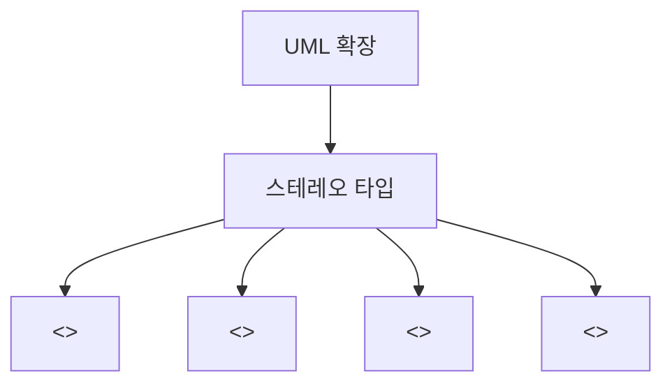

- UML은 기본 요소만으로 부족한 의미를 표현하기 위해 확장 메커니즘을 제공한다.
- 시험에서는 스테레오 타입이 별도 챕터 `017 스테레오 타입`으로 나온다.
- 스테레오 타입은 UML 기본 요소에 추가 의미를 부여하는 표기다.

- 예시:
  - `<<include>>`: 유스케이스 포함 관계에서 자주 사용
  - `<<extend>>`: 유스케이스 확장 관계에서 자주 사용
  - `<<interface>>`: 인터페이스임을 나타냄
  - `<<entity>>`: 엔티티 성격의 클래스를 나타낼 때 사용 가능

- 시험 포인트:
  - 스테레오 타입은 UML에서 추가적인 의미를 표현하는 확장 표기다.
  - `<< >>` 형태가 나오면 스테레오 타입을 의심한다.
  - 이 챕터에서는 UML의 전체 개념과 구성 요소를 잡고, 스테레오 타입은 별도 챕터에서 세부 암기한다.

---

## 17. UML 예시: 간단한 주문 시스템

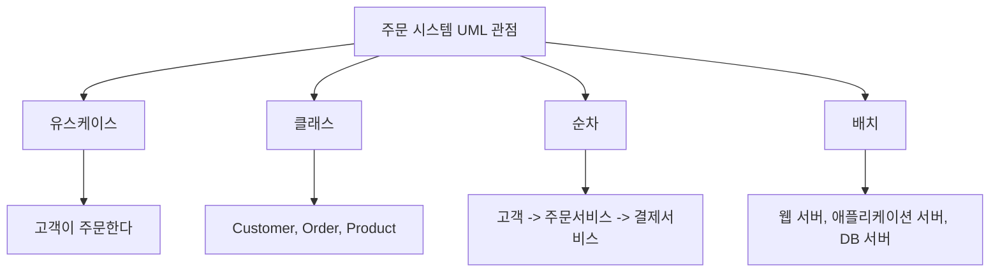

- 하나의 시스템도 UML에서는 여러 다이어그램으로 나누어 볼 수 있다.

- 주문 시스템을 유스케이스 다이어그램으로 보면:
  - 고객이 상품을 조회한다.
  - 고객이 주문한다.
  - 고객이 결제한다.
  - 관리자가 상품을 관리한다.

- 주문 시스템을 클래스 다이어그램으로 보면:
  - Customer 클래스
  - Order 클래스
  - OrderItem 클래스
  - Product 클래스
  - Payment 클래스
  - 클래스 간 연관, 집합, 포함 관계

- 주문 시스템을 순차 다이어그램으로 보면:
  - 고객이 주문 요청을 보낸다.
  - 주문 서비스가 재고 서비스를 호출한다.
  - 주문 서비스가 결제 서비스를 호출한다.
  - 결제 결과가 반환된다.

- 주문 시스템을 배치 다이어그램으로 보면:
  - 웹 서버
  - 애플리케이션 서버
  - 데이터베이스 서버
  - 외부 결제 시스템

- 시험 포인트:
  - UML은 하나의 시스템을 여러 관점의 다이어그램으로 표현한다.
  - 표현하려는 관점에 따라 적절한 다이어그램이 달라진다.

---

## 18. UML 시험 단서어

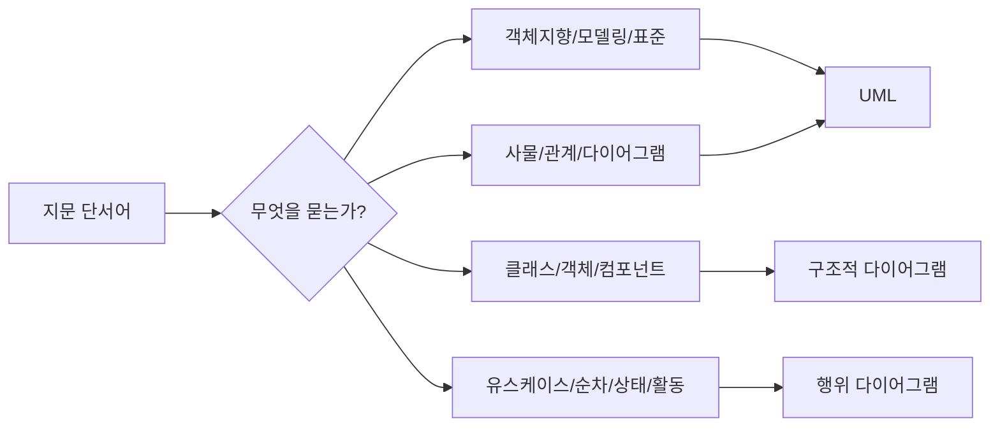

- UML 자체 단서어:
  - Unified Modeling Language
  - 객체지향 모델링 언어
  - 표준화된 모델링 언어
  - 개발자와 고객 간 의사소통
  - 사물, 관계, 다이어그램
  - 구조와 행위 표현

- 구조적 다이어그램 단서어:
  - 클래스
  - 객체
  - 컴포넌트
  - 배치
  - 복합체 구조
  - 패키지

- 행위 다이어그램 단서어:
  - 유스케이스
  - 순차
  - 커뮤니케이션
  - 상태
  - 활동
  - 상호작용 개요
  - 타이밍

- 관계 단서어:
  - 일반화
  - 의존
  - 실체화
  - 연관
  - 집합
  - 포함

- 시험 포인트:
  - 지문이 UML의 정의를 묻는지, 구성 요소를 묻는지, 다이어그램 종류를 묻는지 먼저 구분한다.

---

## 19. 보기 판별 예시

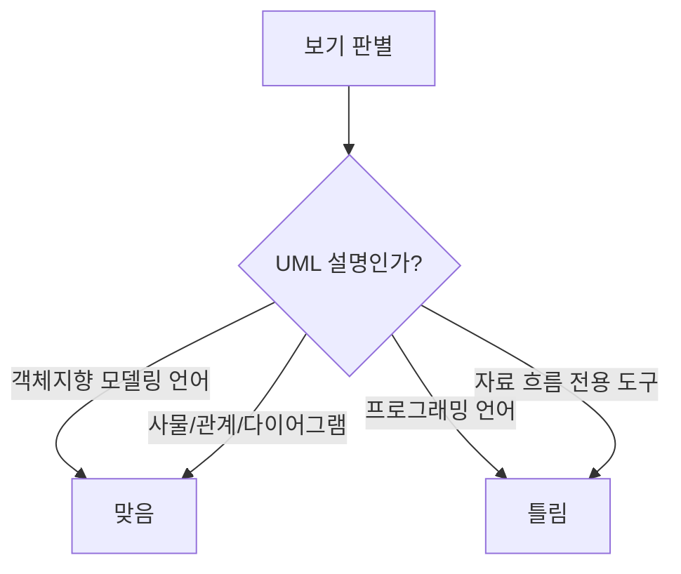

| 보기 | 판단 | 이유 |
|---|---|---|
| UML은 대표적인 객체지향 모델링 언어이다 | O | PDF 핵심 |
| UML은 시스템 개발자와 고객 간 의사소통을 돕는다 | O | PDF 핵심 |
| UML의 구성 요소는 사물, 관계, 다이어그램이다 | O | PDF 핵심 |
| UML은 프로그램을 직접 실행하는 프로그래밍 언어이다 | X | 모델링 언어이지 실행 언어가 아님 |
| UML은 자료 흐름도와 동일한 도구이다 | X | DFD와 구분 |
| UML은 구조와 행위를 다양한 다이어그램으로 표현할 수 있다 | O | UML의 모델링 목적 |
| 클래스 다이어그램은 행위 다이어그램이다 | X | 구조적 다이어그램 |
| 유스케이스 다이어그램은 행위 다이어그램이다 | O | PDF 기준 행위 다이어그램 |

- 문제 풀이 순서:
  1. UML 자체 정의인지 본다.
  2. 구성 요소를 묻는다면 `사-관-다`를 떠올린다.
  3. 다이어그램 종류를 묻는다면 `구조적/행위`를 먼저 나눈다.
  4. 관계를 묻는다면 다음 챕터의 주요 관계 목록을 떠올린다.
  5. DFD, HIPO, 자료 사전과 섞은 보기를 조심한다.

---

## 20. 자주 나오는 함정

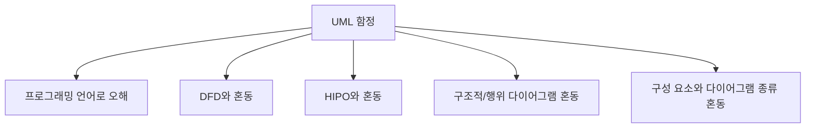

- 함정 1: UML을 프로그래밍 언어로 오해
  - UML은 모델링 언어다.
  - 코드 작성 언어가 아니다.

- 함정 2: UML을 DFD와 혼동
  - DFD는 자료 흐름 중심이다.
  - UML은 객체지향 구조와 행위를 표현하는 표준 모델링 언어다.

- 함정 3: UML을 HIPO와 혼동
  - HIPO는 하향식 소프트웨어 개발을 위한 문서화 도구다.
  - UML은 객체지향 모델링 언어다.

- 함정 4: UML 구성 요소와 다이어그램 종류 혼동
  - 구성 요소 3개: 사물, 관계, 다이어그램
  - 다이어그램 종류: 클래스, 객체, 유스케이스, 순차 등

- 함정 5: 구조적 다이어그램과 행위 다이어그램 혼동
  - 클래스 다이어그램은 구조적 다이어그램이다.
  - 객체 다이어그램은 구조적 다이어그램이다.
  - 유스케이스 다이어그램은 행위 다이어그램이다.
  - 순차 다이어그램은 행위 다이어그램이다.

- 함정 6: UML이 객체지향에서만 절대적으로 사용된다고 오해
  - 시험에서는 객체지향 모델링 언어로 외우는 것이 중요하다.
  - 다만 공식 설명상 UML은 소프트웨어 외 시스템이나 비객체지향 시스템 모델링에도 활용될 수 있다.

- 함정 7: UML 다이어그램을 모두 외우지 않고 이름만 감으로 판단
  - `컴포넌트`, `배치`, `패키지`는 구조적이다.
  - `상태`, `활동`, `타이밍`은 행위다.

---

## 21. 암기 포인트

```mermaid
flowchart TD
    A["UML 암기"] --> B["정의"]
    A --> C["구성 요소"]
    A --> D["다이어그램 분류"]
    A --> E["비교"]

    B --> B1["객체지향 모델링 언어"]
    C --> C1["사-관-다"]
    D --> D1["구조적 / 행위"]
    E --> E1["DFD/HIPO/자료 사전과 구분"]
```

- 1차 암기:
  - UML = Unified Modeling Language
  - 대표적인 객체지향 모델링 언어
  - 개발자와 고객 또는 개발자 상호 간 의사소통을 돕는 표준화된 언어

- 2차 암기:
  - UML 구성 요소 = `사물`, `관계`, `다이어그램`
  - 암기어 = `사-관-다`

- 3차 암기:
  - 구조적 다이어그램 = 정적 구조
  - 행위 다이어그램 = 동적 행위

- 비교 암기:
  - UML = 객체지향 모델링
  - DFD = 자료 흐름
  - 자료 사전 = 자료 정의
  - HIPO = 하향식 기능 계층 + IPO
  - 순서도 = 절차/제어 흐름

- 시험 직전 10초 복습:
  - UML은 프로그래밍 언어가 아니다.
  - UML은 객체지향 모델링 언어다.
  - UML 구성 요소는 사물, 관계, 다이어그램이다.
  - 클래스는 구조적, 유스케이스와 순차는 행위다.

---

## 22. 빠른 복습

```mermaid
flowchart TD
    A["문제 풀이"] --> B{"UML 정의 문제?"}
    B -- "예" --> C["객체지향 모델링 언어"]
    A --> D{"구성 요소 문제?"}
    D -- "예" --> E["사물/관계/다이어그램"]
    A --> F{"다이어그램 분류 문제?"}
    F -- "정적 구조" --> G["구조적 다이어그램"]
    F -- "동적 행위" --> H["행위 다이어그램"]
```

- 챕터명:
  - `013 UML`

- 소속 영역:
  - `1과목 소프트웨어 설계`
  - `UML`
  - `객체지향 분석/설계`

- 반드시 외울 PDF 핵심:
  - 시스템 개발자와 고객 또는 개발자 상호 간의 의사소통이 원활하게 이루어지도록 표준화한 대표적인 객체지향 모델링 언어
  - 구성 요소는 사물, 관계, 다이어그램

- 가장 중요한 해석:
  - UML은 시스템을 여러 관점에서 모델링하기 위한 표준 표현이다.
  - UML은 코드가 아니라 모델이다.
  - UML은 객체지향 분석/설계에서 구조와 행위를 표현하는 데 많이 사용된다.

- 자주 나오는 문제 유형:
  - UML의 정의를 묻는 문제
  - UML의 구성 요소를 묻는 문제
  - UML이 프로그래밍 언어인지 묻는 함정 문제
  - 구조적 다이어그램과 행위 다이어그램을 구분하는 문제
  - UML 관계 종류와 연결하는 문제
  - DFD, HIPO, 자료 사전과 구분하는 문제

- 최종 암기 문장:
  - `UML은 개발자와 고객 또는 개발자 상호 간 의사소통을 위해 표준화한 대표적인 객체지향 모델링 언어이며, 구성 요소는 사물·관계·다이어그램이다.`

---

## 23. 참고 링크

- 기준 PDF: `/Users/nes0903/Documents/study/정보처리기사/핵심요약집_2026_정보처리기사필기핵심요약.pdf`
- [Q-Net 정보처리기사 종목 페이지](https://www.q-net.or.kr/crf005.do?id=crf00503s02&jmCd=1320&jmInfoDivCcd=B0)
- [OMG - Unified Modeling Language](https://www.omg.org/uml/)
- [OMG - What is UML?](https://www.omg.org/uml/what-is-uml.htm)
- [OMG - UML Specification](https://www.omg.org/spec/UML/)
